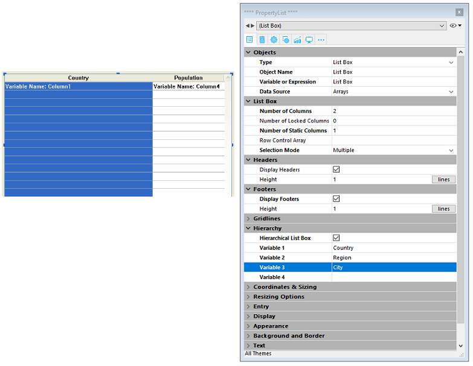
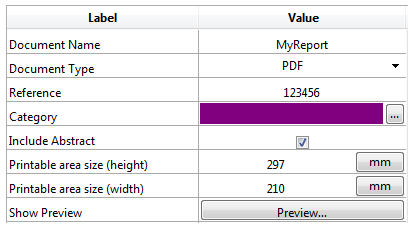
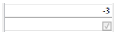

List boxes são objetos ativos complexos que permitem exibir e ingressar dados como colunas sincronizadas. Podem ser conectadas aos conteúdos de banco de dados como seleções de entidade e seleções de registro, ou para conteúdos de linguagem como coleções e arrays. Incluem características avançadas relativas à entrada de dados, classificação de colunas, gestão de eventos, aspecto personalizado, movimentação de colunas, etc.


Uma list box contém uma ou mais colunas cujo conteúdos são automaticamente sincronizados. O número de colunas é teoricamente ilimitado (depende dos recursos da máquina).

## Visão Geral

### Funcionalidades de usuário básicas

Durante a execução, list boxes permitem exibir e ingressar dados como listas. Para tornar uma célula editável ([se a entrada for permitida para a coluna](#managing-entry)), simplesmente clique duas vezes no valor que contém:


Usuários podem ingressar e exibir o texto em várias linhas dentro de uma célula list box. Para adicionar uma quebra de linha pressione **Ctrl+Retorno de carro** em Windows ou **Opção+Retorno de Carro** em macOS.

Booleanos e imagens podem ser exibidos em células, assim como datas, horas ou números. É possível ordenar valores em colunas clicando em um cabeçalho ([ordenação padrão](#managing-sorts)). Todas as colunas são sincronizadas automaticamente.

Também é possível redimensionar cada coluna, e o usuário pode modificar a ordem das [colunas](properties_ListBox.md#locked-columns-and-static-columns) e [linhas](properties_Action.md#movable-rows) ao movê-las usando o mouse, se essa ação for autorizada. Note que a list boxes podem ser usadas em [modo hierarquico](#hierarchical-list-boxes).

O usuário pode selecionar um ou mais linhas usando os atalhos padrão: **Shift+clique** para uma seleção adjacente **Ctrl+clique** (Windows) ou **Comando+clique** (macOS) para uma seleção não adjacente.


### Partes de list box

Uma list box é composta de quatro partes diferentes:

*   o objeto list box em sua globalidade
*   colunas,
*   cabeçalhos de coluna, e
*   rodapés de colunas.


Cada parte tem seu próprio nome assim como propriedades específicas. Por exemplo, o número de colunas ou as cores alternativas de cada linha é estabelecida nas propriedades de objeto list box, a largura de cada coluna é estabelecida nas propriedades de colunas e a fonte do cabeçalho é estabelecida nas propriedades de cabeçalho.

É possível adicionar um método objeto para o objeto list box ou para cada coluna da list box. Métodos objetos são chamados na ordem abaixo:

1. Método objeto de cada coluna
2. Método objeto da list box

O método objeto coluna obtém eventos que ocorrem em seu  [cabeçalho](#list-box-headers) e [rodapé](#list-box-footers).


### Tipos de List box

Há vários tipos de list boxes com seus próprios comportamentos e propriedades específicos. O tipo list box depende das propriedades [Data Source property](properties_Object.md#data-source):

- **Arrays**: cada coluna é conectada a um array 4D. List boxes baseadas em array podem ser exibidas como [list boxes hierárquicas](listbox_overview.md#hierarchical-list-boxes).
- **Seleção** (**Seleção atual** ou **Seleções nomeadas**): cada coluna é conectada a uma expressão (por exemplo um campo) que é avaliado para cada registro da seleção.
- **Coleção ou seleção de entidade**: cada coluna é conectada a uma expressão que é avaliada para todo elemento da coleção ou toda entidade da seleção de entidade.
> Não é possível combinar diferentes tipos de list box no mesmo objeto list box. A fonte de dados é estabelecida quando a list box é criada. Não é mais possível modificar por programação.


### Gerenciando list boxes

Pode configurar completamente um objeto list box através de suas propriedades e também pode gerenciar dinamicamente por programação.

A linguagem 4D inclui um tema dedicado "List Box" para comandos list box, mas comandos de vários outros temas, como comandos "Object properties" ou `EDIT ITEM`, `Displayed line number` podem ser usados. Veja a página [Sumário Comandos List Box](https://doc.4d.com/4Dv17R6/4D/17-R6/List-Box-Commands-Summary.300-4311159.en.html) em *Referência de Linguagem 4D* para mais informação.


## Objetos tipo list box

### List box de tipo array

Em um list box de tipo array, cada coluna deve estar associada a um array unidimensional 4D; podem ser utilizados todos os tipos de array, com exceção dos arrays de ponteiros. O número de linhas é baseado no número de elementos array.

Como padrão, 4D atribui o nome "ColumnX" para cada coluna. Pode mudar isso, assim como outras propriedades de coluna, nas [propriedades de coluna](listbox_overview.md#column-specific-properties). O formato de exibição para cada coluna também pode ser definido usando o comando `OBJECT SET FORMAT`
> List boxes tipo array podem ser exibidas em [modo hierárquico](listbox_overview.md#hierarchical-list-boxes), com mecanismos específicos.

Com list box de tipo array, o valor ingressado ou exibido são gerenciados usando a linguagem 4D. Também pode associar uma [lista de escolha](properties_DataSource.md#choice-list) com uma coluna para controlar entrada de dados.´ Os valores de coluna são gerenciados usando comandos de List box de alto nível (tais como `LISTBOX INSERT ROWS` ou `LISTBOX DELETE ROWS`) assim como comandos manipulação de array. Os valores de coluna são gerenciados usando comandos de List box de alto nível (tais como `LISTBOX INSERT ROWS` ou `LISTBOX DELETE ROWS`) assim como comandos manipulação de array. Por exemplo, para iniciar os conteúdos da coluna, pode usar a instrução abaixo:

```4d
ARRAY TEXT(varCol;size)
```

Também pode usar uma lista:

```4d
LIST TO ARRAY("ListName";varCol)
```
> **Aviso**: quando uma list box conter vários tamanhos diferentes de coluna, só o número de itens do menor array (coluna) será exibido. Tem que verificar que cada array tenha o mesmo número de elementos que os outros. Além disso, se uma coluna list box for vazia (isso ocorre quando o array associado não for corretamente declarado ou dimensionado usando a linguagem), a list box não exibe nada.


### List box de tipo seleção

Nesse tipo de list box, cada coluna pode ser associada com um campo (por exemplo `[Employees]LastName)` ou uma expressão. A expressão pode ser baseada em um ou mais campos (por exemplo), `[Employees]FirstName+" "[Employees]LastName`) ou simplesmente ser uma fórmula (por exemplo `String(Milisegundos)`). A expressão também pode ser um método de proejeto, uma variável ou um item array. Pode usar os comandos `LISTBOX SET COLUMN FORMULA` e `LISTBOX INSERT COLUMN FORMULA` para modificar colunas por programação.

Os conteúdos de cada linha são avaliados de acordo com a seleção de registros: **a seleção atual** de uma tablea ou uma **seleção nomeada**.

No caso de uma list box baseada na seleção atual de uma tablea, qualquer modificação feita do lado da database é refletida automaticamente na list box e vice versa. A seleção atual é portanto sempre a mesma em ambos os lugares.


### List boxes de coleção ou de seleção de entidade

Nesse tipo de list box, cada coluna deve ser associada a uma expressão. Os conteúdos de cada linha são então avaliados por elemento de coleção ou por entidade da seleção de entidade.

Cada elemento da coleção ou cada entidade está disponível como um objeto que pode ser acessada através do comando [This](https://doc.4d.com/4Dv17R6/4D/17-R6/This.301-4310806.en.html). Uma expressão coluna pode ser um método de projeto, uma variável ou qualquer fórmula, acessando cada entidade ou objeto elementod e coleção através de `This`, por exemplo `This.<propertyPath>` (ou `This.value` no caso de uma coleção de valores escalares). Pode usar os comandos `LISTBOX SET COLUMN FORMULA` e `LISTBOX INSERT COLUMN FORMULA` para modificar colunas por programação.

Quando a fonte de dados for uma seleção de entidades, qualquer modificação feita no lado da list box são salvas automaticamente na database. Do outro lado, modificações feitas na database são visíveis na list box depois que as entidades tocadas foram recarregadas.

Quando a fonte de dados for uma coleção, qualquer modificação feita nos valores da list box são refletidas na coleção. Quando a fonte de dados for uma coleção, qualquer modificação feita nos valores da list box são refletidas na coleção. Por exemplo:

```4d
myCol:=myCol.push("new value") //exibir novo valor na list box
```


### Propriedades compatíveis

Propriedades compatíveis dependem do tipo de list box.


| Propriedade                                                                                 | List box array | List box seleção | List box coleção ou entity selection |
| ------------------------------------------------------------------------------------------- | -------------- | ---------------- | ------------------------------------ |
| [Cor de fundo alternado](properties_BackgroundAndBorder.md#alternate-background-color)      | X              | X                | X                                    |
| [Cor de fundo](properties_BackgroundAndBorder.md#background-color--fill-color)              | X              | X                | X                                    |
| [Negrito](properties_Text.md#bold)                                                          | X              | X                | X                                    |
| [Expressão cor de fundo](properties_BackgroundAndBorder.md#background-color-expression)     |                | X                | X                                    |
| [Estilo borda linha](properties_BackgroundAndBorder.md#border-line-style)                   | X              | X                | X                                    |
| [Fundo](properties_CoordinatesAndSizing.md#bottom)                                          | X              | X                | X                                    |
| [Class](properties_Object.md#css-class)                                                     | X              | X                | X                                    |
| [Seleção de entidade ou coleção](properties_Object.md#collection-or-entity-selection)       |                | X                | X                                    |
| [Autodimensionamento coluna](properties_ResizingOptions.md#column-auto-resizing)            | X              | X                | X                                    |
| [Item atual](properties_DataSource.md#current-item)                                         |                |                  | X                                    |
| [Posição item atual](properties_DataSource.md#current-item-position)                        |                |                  | X                                    |
| [Fonte de dados](properties_Object.md#data-source)                                          | X              | X                | X                                    |
| [Nome formulário detalhe](properties_ListBox.md#detail-form-name)                           |                | X                |                                      |
| [Exibir cabeçalhos](properties_Headers.md#display-headers)                                  | X              | X                | X                                    |
| [Exibir rodapés](properties_Footers.md#display-footers)                                     | X              | X                | X                                    |
| [Duplo clique em linha](properties_ListBox.md#double-click-on-row)                          |                | X                |                                      |
| [Arrastável](properties_Action.md#droppable)                                                | X              | X                | X                                    |
| [Soltável](properties_Action.md#droppable)                                                  | X              | X                | X                                    |
| [Focável](properties_Entry.md#focusable)                                                    | X              | X                | X                                    |
| [Fonte](properties_Text.md#font)                                                            | X              | X                | X                                    |
| [Cor fonte](properties_Text.md#font-color)                                                  | X              | X                | X                                    |
| [Expressão cor fonte](properties_Text.md#font-color-expression)                             |                | X                | X                                    |
| [Tamanho fonte](properties_Text.md#font-size)                                               | X              | X                | X                                    |
| [Altura (list box)](properties_CoordinatesAndSizing.md#height)                              | X              | X                | X                                    |
| [Altura (cabeçalhos)](properties_Headers.md#height)                                         | X              | X                | X                                    |
| [Altura (rodapés)](properties_Footers.md#height)                                            | X              | X                | X                                    |
| [Esconder linhas em branco extras](properties_BackgroundAndBorder.md#hide-extra-blank-rows) | X              | X                | X                                    |
| [Esconder retangulo foco](properties_Appearance.md#hide-focus-rectangle)                    | X              | X                | X                                    |
| [Esconder ressalte seleção](properties_Appearance.md#hide-selection-highlight)              | X              | X                | X                                    |
| [List box hierárquica](properties_Object.md#array-list-box)                                 | X              |                  |                                      |
| [Ressaltar conjunto](properties_ListBox.md#highlight-set)                                   |                | X                |                                      |
| [Alihamento horizontal](properties_Text.md#horizontal-alignment)                            | X              | X                | X                                    |
| [Cor linha horizontal](properties_Gridlines.md#horizontal-line-color)                       | X              | X                | X                                    |
| [Barra rolagem horizontal](properties_CoordinatesAndSizing.md#horizontal-padding)           | X              | X                | X                                    |
| [Altura linha](properties_Appearance.md#horizontal-scroll-bar)                              | X              | X                | X                                    |
| [Dimensionamento horizontal](properties_ResizingOptions.md#horizontal-sizing)               | X              | X                | X                                    |
| [Itálico](properties_Text.md#italic)                                                        | X              | X                | X                                    |
| [Direita](properties_CoordinatesAndSizing.md#left)                                          | X              | X                | X                                    |
| [Tabela mestre](properties_DataSource.md#master-table)                                      |                | X                |                                      |
| [Expressão info meta](properties_Text.md#meta-info-expression)                              |                |                  | X                                    |
| [Métodos](properties_Action.md#method)                                                      | X              | X                | X                                    |
| [Linhas móveis](properties_Action.md#movable-rows)                                          | X              |                  |                                      |
| [Seleção nomeada](properties_DataSource.md#selection-name)                                  |                | X                |                                      |
| [Número de colunas trancadas](properties_ListBox.md#number-of-columns)                      | X              | X                | X                                    |
| [Número de colunas estáticas](properties_ListBox.md#number-of-locked-columns)               | X              | X                | X                                    |
| [Número de colunas](properties_ListBox.md#number-of-static-columns)                         | X              | X                | X                                    |
| [Nome de objeto](properties_Object.md#object-name)                                          | X              | X                | X                                    |
| [Esquerda](properties_CoordinatesAndSizing.md#right)                                        | X              | X                | X                                    |
| [Array controle linha](properties_BackgroundAndBorder.md#row-background-color-array)        | X              |                  |                                      |
| [Array controle linha](properties_ListBox.md#row-control-array)                             | X              |                  |                                      |
| [Array cores de Fonte](properties_Text.md#row-font-color-array)                             | X              |                  |                                      |
| [Array altura linha](properties_CoordinatesAndSizing.md#row-height)                         | X              |                  |                                      |
| [Array estilo linha](properties_CoordinatesAndSizing.md#row-height-array)                   | X              |                  |                                      |
| [Array estilo linha](properties_Text.md#row-style-array)                                    | X              |                  |                                      |
| [Itens selecionados](properties_DataSource.md#selected-items)                               |                |                  | X                                    |
| [Modo seleção](properties_ListBox.md#selection-mode)                                        | X              | X                | X                                    |
| [Editar com um clique](properties_Entry.md#single-click-edit)                               | X              | X                | X                                    |
| [Ordenável](properties_Action.md#sortable)                                                  | X              | X                | X                                    |
| [Ação padrão](properties_Action.md#standard-action)                                         | X              |                  |                                      |
| [Expressão estilo](properties_Text.md#style-expression)                                     |                | X                | X                                    |
| [Topo](properties_CoordinatesAndSizing.md#top)                                              | X              | X                | X                                    |
| [Transparente](properties_BackgroundAndBorder.md#transparent)                               | X              | X                | X                                    |
| [Tipo](properties_Object.md#type)                                                           | X              | X                | X                                    |
| [Sublinhado](properties_Text.md#underline)                                                  | X              | X                | X                                    |
| [Variável ou expressão](properties_Object.md#variable-or-expression)                        | X              | X                |                                      |
| [Cor linha vertical](properties_Text.md#vertical-alignment)                                 | X              | X                | X                                    |
| [Array cores de fundo](properties_Gridlines.md#vertical-line-color)                         | X              | X                | X                                    |
| [Dimensionamento vertical](properties_CoordinatesAndSizing.md#vertical-padding)             | X              | X                | X                                    |
| [Barra rolagem vertical](properties_Appearance.md#vertical-scroll-bar)                      | X              | X                | X                                    |
| [Alinhamento vertical](properties_ResizingOptions.md#vertical-sizing)                       | X              | X                | X                                    |
| [Visibilidade](properties_Display.md#visibility)                                            | X              | X                | X                                    |
| [Largura](properties_CoordinatesAndSizing.md#width)                                         | X              | X                | X                                    |


> Colunas list box, cabeçalhos e rodapés suportam propriedades específicas.


### Eventos formulário suportados


| Evento formulário    | Propriedades adicionais devolvidas (ver [Form event](https://doc.4d.com/4Dv18/4D/18/FORM-Event.301-4522191.en.html) para as propriedades principais) | Comentários                                                                                                                                         |
| -------------------- | ---------------------------------------------------------------------------------------------------------------------------------------------------- | --------------------------------------------------------------------------------------------------------------------------------------------------- |
| On After Edit        | <li>[column](#additional-properties)</li><li>[columnName](#additional-properties)</li><li>[row](#additional-properties)</li>                                                                          |                                                                                                                                                     |
| On After Keystroke   | <li>[column](#additional-properties)</li><li>[columnName](#additional-properties)</li><li>[row](#additional-properties)</li>                                                                          |                                                                                                                                                     |
| On After Sort        | <li>[column](#additional-properties)</li><li>[columnName](#additional-properties)</li><li>[headerName](#additional-properties)</li>                                                                          | *As fórmulas compostas não podem ser ordenadas. <br/>(por exemplo, This.firstName + This.lastName)*                                           |
| On Alternative Click | <li>[column](#additional-properties)</li><li>[columnName](#additional-properties)</li><li>[row](#additional-properties)</li>                                                                        | *Esse princípio não é aplicado quando apenas uma variável for especificada na hierarquia: nesse caso, valores idênticos podem ser agrupados.*       |
| On Before Data Entry | <li>[column](#additional-properties)</li><li>[columnName](#additional-properties)</li><li>[row](#additional-properties)</li>                                                                       |                                                                                                                                                     |
| On Before Keystroke  | <li>[column](#additional-properties)</li><li>[columnName](#additional-properties)</li><li>[row](#additional-properties)</li>                                                                       |                                                                                                                                                     |
| On Begin Drag Over   | <li>[column](#additional-properties)</li><li>[columnName](#additional-properties)</li><li>[row](#additional-properties)</li>                                                                       |                                                                                                                                                     |
| On Clicked           | <li>[column](#additional-properties)</li><li>[columnName](#additional-properties)</li><li>[row](#additional-properties)</li>                                                                       |                                                                                                                                                     |
| On Close Detail      | <li>[row](#additional-properties)</li>                                                                                                                           | *Pode usar a constante `lk inherited` para imitar a aparência atual da list box (por exemplo, cor de fonte, cor de fundo, estilo da fonte,  etc.).* |
| On Collapse          | <li>[column](#additional-properties)</li><li>[columnName](#additional-properties)</li><li>[row](#additional-properties)</li>                                                                       | *Apenas list box hierárquicos*                                                                                                                      |
| On Column Moved      | <li>[columnName](#additional-properties)</li><li>[newPosition](#additional-properties)</li><li>[oldPosition](#additional-properties)</li>                                                                       |                                                                                                                                                     |
| On Column Resize     | <li>[column](#additional-properties)</li><li>[columnName](#additional-properties)</li><li>[newSize](#additional-properties)</li><li>[oldSize](#additional-properties)</li>                                             |                                                                                                                                                     |
| On Data Change       | <li>[column](#additional-properties)</li><li>[columnName](#additional-properties)</li><li>[row](#additional-properties)</li>                                                                       |                                                                                                                                                     |
| On Delete Action     | <li>[row](#additional-properties)</li>                                                                                                                           |                                                                                                                                                     |
| On Display Detail    | <li>[isRowSelected](#additional-properties)</li><li>[row](#additional-properties)</li>                                                                                                 |                                                                                                                                                     |
| On Double Clicked    | <li>[column](#additional-properties)</li><li>[columnName](#additional-properties)</li><li>[row](#additional-properties)</li>                                                                       |                                                                                                                                                     |
| On Drag Over         | <li>[area](#additional-properties)</li><li>[areaName](#additional-properties)</li><li>[column](#additional-properties)</li><li>[columnName](#additional-properties)</li><li>[row](#additional-properties)</li>                   |                                                                                                                                                     |
| On Drop              | <li>[column](#additional-properties)</li><li>[columnName](#additional-properties)</li><li>[row](#additional-properties)</li>                                                                       |                                                                                                                                                     |
| On Expand            | <li>[column](#additional-properties)</li><li>[columnName](#additional-properties)</li><li>[row](#additional-properties)</li>                                                                       | *Apenas list box hierárquicos*                                                                                                                      |
| On Footer Click      | <li>[column](#additional-properties)</li><li>[columnName](#additional-properties)</li><li>[footerName](#additional-properties)</li>                                                                       | *List box arrays, seleção atual e seleção temporal apenas*                                                                                          |
| On Getting Focus     | <li>[column](#additional-properties)</li><li>[columnName](#additional-properties)</li><li>[row](#additional-properties)</li>                                                                       | *Propriedades adicionais devolvidas apenas quando se edita uma célula*                                                                              |
| On Header Click      | <li>[column](#additional-properties)</li><li>[columnName](#additional-properties)</li><li>[headerName](#additional-properties)</li>                                                                       |                                                                                                                                                     |
| On Load              |                                                                                                                                                      |                                                                                                                                                     |
| On Losing Focus      | <li>[column](#additional-properties)</li><li>[columnName](#additional-properties)</li><li>[row](#additional-properties)</li>                                                                       | *Propriedades adicionais devolvidas apenas quando a edição de uma célula tiver sido concluída*                                                      |
| On Mouse Enter       | <li>[area](#additional-properties)</li><li>[areaName](#additional-properties)</li><li>[column](#additional-properties)</li><li>[columnName](#additional-properties)</li><li>[row](#additional-properties)</li>                   |                                                                                                                                                     |
| On Mouse Leave       |                                                                                                                                                      |                                                                                                                                                     |
| On Mouse Move        | <li>[area](#additional-properties)</li><li>[areaName](#additional-properties)</li><li>[column](#additional-properties)</li><li>[columnName](#additional-properties)</li><li>[row](#additional-properties)</li>                   |                                                                                                                                                     |
| On Open Detail       | <li>[row](#additional-properties)</li>                                                                                                                           | *Pode usar a constante `lk inherited` para imitar a aparência atual da list box (por exemplo, cor de fonte, cor de fundo, estilo da fonte,  etc.).* |
| On Row Moved         | <li>[newPosition](#additional-properties)</li><li>[oldPosition](#additional-properties)</li>                                                                                                 | *Esse princípio não é aplicado quando apenas uma variável for especificada na hierarquia: nesse caso, valores idênticos podem ser agrupados.*       |
| On Selection Change  |                                                                                                                                                      |                                                                                                                                                     |
| On Scroll            | <li>[horizontalScroll](#additional-properties)</li><li>[verticalScroll](#additional-properties)</li>                                                                                                 |                                                                                                                                                     |
| On Unload            |                                                                                                                                                      |                                                                                                                                                     |


#### Propriedades adicionais

Os eventos de formulário em objetos de caixa de listagem ou de coluna de caixa de listagem podem retornar as seguintes propriedades adicionais:

| Propriedade          | Tipo          | Descrição                                                                    |
| -------------------- | ------------- | ---------------------------------------------------------------------------- |
| area                 | text          | Área de objeto List box ("header", "footer", "cell")                         |
| areaName             | text          | Nome da zona                                                                 |
| column               | inteiro longo | Número da coluna                                                             |
| columnName           | text          | Nome da coluna                                                               |
| footerName           | text          | Nome do rodapé                                                               |
| headerName           | text          | Nome do cabeçalho                                                            |
| horizontalScroll     | inteiro longo | Positivo se a deslocação for para a direita, negativo se for para a esquerda |
| isRowSelected        | boolean       | True se a linha estiver selecionada, senão False                             |
| newPosition          | inteiro longo | Nova posição da coluna ou linha                                              |
| newSize              | inteiro longo | Novo tamanho (em pixéis) da coluna ou linha                                  |
| oldPosition          | inteiro longo | Posição anterior da coluna ou da linha                                       |
| oldSize              | inteiro longo | Tamanho anterior (em pixéis) da coluna ou linha                              |
| row                  | inteiro longo | Número da linha                                                              |
| Alinhamento vertical | inteiro longo | Positivo se a deslocação for para baixo, negativo se for para cima           |
> Se um evento ocorrer em uma coluna ou linha "falsa" que não exista, é normalmente retornada uma cadeia de caracteres vazia.


## Colunas list boxes

Uma list box é feita de um ou mais objetos coluna que têm propriedades específicas. Pode selecionar uma coluna list box no editor de Formulário clicando nela ou quando o objeto list box for selecionado:


Pode estabelecer propriedades padrão (texto, cor de fundo, etc) para cada coluna da list box: essas propriedades tem prioridade sobre as propriedades objeto da list box.
> Pode definir o [Tipo de expressão](properties_Object.md#expression-type) para colunas list box array  (String, Texto, Número, Data, Hora, Imagem, Booleano, ou Objeto).


### Propriedades específicas de coluna

[Formato alfa](properties_Display.md#alpha-format) - [Cor de fundo alternativa](properties_BackgroundAndBorder.md#alternate-background-color) - [Altura automática da linha](properties_CoordinatesAndSizing.md#automatic-row-height) - [Background Color](properties_BackgroundAndBorder.md#background-color--fill-color) - [Expressão de cor de fundo](properties_BackgroundAndBorder.md#background-color-expression) - [Negrito](properties_Text.md#bold) - [Lista de opções](properties_DataSource.md#choice-list) - [Classe](properties_Object.md#css-class) - [Tipo de dados (coluna de list box seleção e coleção)](properties_DataSource.md#data-type) - [Formato Data](properties_Display.md#date-format) - [Valores padrão](properties_DataSource.md#default-list-of-values) - [Tipo exibição](properties_Display.md#display-type) - [Digitável](properties_Entry.md#enterable) - [Filtro de entrada](properties_Entry.md#entry-filter) - [Lista de excluídos](properties_RangeOfValues.md#excluded-list) - [Expressão](properties_DataSource.md#expression) - [Tipo de expressão (coluna list box array)](properties_Object.md#expression-type) - [Fonte](properties_Text.md#font) - [Cor da fonte](properties_Text.md#font-color) - [Alinhamento horizontal](properties_Text.md#horizontal-alignment) - [Preenchimento horizontal](properties_CoordinatesAndSizing.md#horizontal-padding) - [Itálico](properties_Text.md#italic) - [Invisível](properties_Display.md#visibility) - [Largura máxima](properties_CoordinatesAndSizing.md#maximum-width) - [Método](properties_Action.md#method) - [Largura mínima](properties_CoordinatesAndSizing.md#minimum-width) - [Multi-estilo](properties_Text.md#multi-style) - [Formato número](properties_Display.md#number-format) - [Nome objeto](properties_Object.md#object-name) - [Formato imagem](properties_Display.md#picture-format) - [Redimensionável](properties_ResizingOptions.md#resizable) - [Lista obrigatória](properties_RangeOfValues.md#required-list) - [Array de cores de fundo de linha](properties_BackgroundAndBorder.md#row-background-color-array) - [Array de cores de fonte de linha](properties_Text.md#row-font-color-array) - [Array de estilo de linha](properties_Text.md#row-style-array) - [Salvar como](properties_DataSource.md#save-as) - [Expressão de estilo](properties_Text.md#style-expression) - [Texto quando False/Texto quando True](properties_Display.md#text-when-falsetext-when-true) - [Formato de hora](properties_Display.md#time-format) - [Truncar com reticências](properties_Display.md#truncate-with-ellipsis) - [Sublinhado](properties_Text.md#underline) - [Variável ou expressão](properties_Object.md#variable-or-expression) - [Alinhamento vertical](properties_Text.md#vertical-alignment) - [Preenchimento Vertical](properties_CoordinatesAndSizing.md#vertical-padding) - [Largura](properties_CoordinatesAndSizing.md#width) - [Envolvimento de palavras](properties_Display.md#wordwrap)

### Eventos formulário suportados

| Evento formulário    | Propriedades adicionais devolvidas (ver [Form event](https://doc.4d.com/4Dv18/4D/18/FORM-Event.301-4522191.en.html) para as propriedades principais) | Comentários                                                                                                                                   |
| -------------------- | ---------------------------------------------------------------------------------------------------------------------------------------------------- | --------------------------------------------------------------------------------------------------------------------------------------------- |
| On After Edit        | <li>[column](#additional-properties)</li><li>[columnName](#additional-properties)</li><li>[row](#additional-properties)</li>                                                                       |                                                                                                                                               |
| On After Keystroke   | <li>[column](#additional-properties)</li><li>[columnName](#additional-properties)</li><li>[row](#additional-properties)</li>                                                                       |                                                                                                                                               |
| On After Sort        | <li>[column](#additional-properties)</li><li>[columnName](#additional-properties)</li><li>[headerName](#additional-properties)</li>                                                                       | *As fórmulas compostas não podem ser ordenadas. <br/>(por exemplo, This.firstName + This.lastName)*                                     |
| On Alternative Click | <li>[column](#additional-properties)</li><li>[columnName](#additional-properties)</li><li>[row](#additional-properties)</li>                                                                       | *Esse princípio não é aplicado quando apenas uma variável for especificada na hierarquia: nesse caso, valores idênticos podem ser agrupados.* |
| On Before Data Entry | <li>[column](#additional-properties)</li><li>[columnName](#additional-properties)</li><li>[row](#additional-properties)</li>                                                                       |                                                                                                                                               |
| On Before Keystroke  | <li>[column](#additional-properties)</li><li>[columnName](#additional-properties)</li><li>[row](#additional-properties)</li>                                                                       |                                                                                                                                               |
| On Begin Drag Over   | <li>[column](#additional-properties)</li><li>[columnName](#additional-properties)</li><li>[row](#additional-properties)</li>                                                                    |                                                                                                                                               |
| On Clicked           | <li>[column](#additional-properties)</li><li>[columnName](#additional-properties)</li><li>[row](#additional-properties)</li>                                                                    |                                                                                                                                               |
| On Column Moved      | <li>[columnName](#additional-properties)</li><li>[newPosition](#additional-properties)</li><li>[oldPosition](#additional-properties)</li>                                                                    |                                                                                                                                               |
| On Column Resize     | <li>[column](#additional-properties)</li><li>[columnName](#additional-properties)</li><li>[newSize](#additional-properties)</li><li>[oldSize](#additional-properties)</li>                                         |                                                                                                                                               |
| On Data Change       | <li>[column](#additional-properties)</li><li>[columnName](#additional-properties)</li><li>[row](#additional-properties)</li>                                                                    |                                                                                                                                               |
| On Double Clicked    | <li>[column](#additional-properties)</li><li>[columnName](#additional-properties)</li><li>[row](#additional-properties)</li>                                                                    |                                                                                                                                               |
| On Drag Over         | <li>[area](#additional-properties)</li><li>[areaName](#additional-properties)</li><li>[column](#additional-properties)</li><li>[columnName](#additional-properties)</li><li>[row](#additional-properties)</li>              |                                                                                                                                               |
| On Drop              | <li>[column](#additional-properties)</li><li>[columnName](#additional-properties)</li><li>[row](#additional-properties)</li>                                                                    |                                                                                                                                               |
| On Footer Click      | <li>[column](#additional-properties)</li><li>[columnName](#additional-properties)</li><li>[footerName](#additional-properties)</li>                                                                    | *List box arrays, seleção atual e seleção temporal apenas*                                                                                    |
| On Getting Focus     | <li>[column](#additional-properties)</li><li>[columnName](#additional-properties)</li><li>[row](#additional-properties)</li>                                                                    | *Propriedades adicionais devolvidas apenas quando se edita uma célula*                                                                        |
| On Header Click      | <li>[column](#additional-properties)</li><li>[columnName](#additional-properties)</li><li>[headerName](#additional-properties)</li>                                                                    |                                                                                                                                               |
| On Load              |                                                                                                                                                      |                                                                                                                                               |
| On Losing Focus      | <li>[column](#additional-properties)</li><li>[columnName](#additional-properties)</li><li>[row](#additional-properties)</li>                                                                    | *Propriedades adicionais devolvidas apenas quando a edição de uma célula tiver sido concluída*                                                |
| On Row Moved         | <li>[newPosition](#additional-properties)</li><li>[oldPosition](#additional-properties)</li>                                                                                               | *Esse princípio não é aplicado quando apenas uma variável for especificada na hierarquia: nesse caso, valores idênticos podem ser agrupados.* |
| On Scroll            | <li>[horizontalScroll](#additional-properties)</li><li>[verticalScroll](#additional-properties)</li>                                                                                               |                                                                                                                                               |
| On Unload            |                                                                                                                                                      |                                                                                                                                               |


## Cabeçalhos de list box

> Para poder acessar às propriedades dos cabeçalhos de um list box, deve ativar a opção [Mostrar cabeçalhos](properties_Headers.md#display-headers) da list box.

Quando mostrar os cabeçalhos, pode selecionar um cabeçalho no editor de formulários clicando nele quando o objeto List Box estiver selecioando:


Pode estabelecer propriedades de texto padrão para cada cabeçalho de coluna da list box, nesse caso, essas propriedades tem prioriedade sobre aquelas da coluna ou da própria list box.


Além disso, tem acesso às propriedades específicas para cabeçalhos. Especificamente, um ícone pode ser exibido no cabeçalho do lado ou ao invés do título da coluna, por exemplo quando realizar [ordenações personalizadas](#managing-sorts).


Na execução, eventos que ocorrem em um cabeçalho são gerados em [método de objeto coluna list box](#object-methods).

Quando o comando `OBJECT SET VISIBLE` for usado com um cabeçalho, é aplicado a todos os cabeçalhos, independente do elemento individual estabelecido pelo comando. Por exemplo, `OBJECT SET VISIBLE(*;"header3";False)` esconde todos os cabeçalhos no objeto list box ao qual *header3* pertence e não apenas esse cabeçalho.

### Propriedades específicas de cabeçalho

[Bold](properties_Text.md#bold) - [Class](properties_Object.md#css-class) - [Font](properties_Text.md#font) - [Font Color](properties_Text.md#font-color) - [Help Tip](properties_Help.md#help-tip) - [Horizontal Alignment](properties_Text.md#horizontal-alignment) - [Icon Location](properties_TextAndPicture.md#icon-location) - [Italic](properties_Text.md#italic) - [Object Name](properties_Object.md#object-name) - [Pathname](properties_TextAndPicture.md#picture-pathname) - [Title](properties_Object.md#title) - [Underline](properties_Text.md#underline) - [Variable or Expression](properties_Object.md#variable-or-expression) - [Vertical Alignment](properties_Text.md#vertical-alignment) - [Width](properties_CoordinatesAndSizing.md#width)


## Rodapés de list box
> Para poder acessar as propriedades de um cabeçalho deve ativar a opção[Exibir rodapés](properties_Footers.md#display-footers).

List boxes podem conter "cabeçalhos" não editáveis, exibindo informação adicional. No caso de dados mostrados em formato de tabela, os rodapés são geralmente usados para exibir cálculos como totais ou médias.

Quando cabeçalhos são exibidos, pode clicar para selecionar um quando o objeto list box for selecionado no editor de Formulário:


Para cada cabeçalho coluna List Box pode estabelecer propriedades texto padrão: nesse caso, essas propriedades têm prioridade sobre àquelas da coluna ou da list box. Pode também acessar propriedades específicas para cabeçalhos. Particularmente pode inserir um [cálculo personalizado ou automático](properties_Object.md#variable-calculation).

Na execução, eventos que ocorrem em um rodapé são gerados em [método de objeto coluna list box](#object-methods).

Quando o comando `OBJECT SET VISIBLE` for usado com um rodapé, é aplicado a todos os rodapés, independente do elemento individual estabelecido pelo comando. Por exemplo, `OBJECT SET VISIBLE(*;"footer3";False)` esconde todos os rodapés no objeto list box ao qual *footer3* pertence e não apenas esse rodapé.

### Propriedades específicas do rodapé


[Formato alfa](properties_Display.md#alpha-format) - [Cor do plano de fundo](properties_BackgroundAndBorder.md#background-color--fill-color) - [Negrito](properties_Text.md#bold) - [Classe](properties_Object.md#css-class) - [Formato de data](properties_Display.md#date-format) - [Tipo de expressão](properties_Object.md#expression-type) - [Fonte](properties_Text.md#font) - [Cor da fonte](properties_Text.md#font-color) - [Dica de ajuda](properties_Help.md#help-tip) - [Alinhamento horizontal](properties_Text.md#horizontal-alignment) - [Preenchimento horizontal](properties_CoordinatesAndSizing.md#horizontal-padding) - [Itálico](properties_Text.md#italic) - [Formato de número](properties_Display.md#number-format) - [Nome do objeto](properties_Object.md#object-name) - [Formato de imagem](properties_Display.md#picture-format) - [Formato de hora](properties_Display.md#time-format) - [Truncar com reticências](properties_Display.md#truncate-with-ellipsis) - [Sublinhado](properties_Text.md#underline) - [Cálculo de variável](properties_Object.md#variable-calculation) - [Variável ou expressão](properties_Object.md#variable-or-expression) - [Alinhamento vertical](properties_Text.md#vertical-alignment) - [Preenchimento vertical](properties_CoordinatesAndSizing.md#vertical-padding) - [Largura](properties_CoordinatesAndSizing.md#width) - [Envolvimento de palavras](properties_Display.md#wordwrap)


## Gerenciar entrada

Para uma célula list box ser editável, as duas condições abaixo devem ser atendidas:

- A coluna da célula deve ser estabelecida como [Editável](properties_Entry.md#enterable) (senão, as células da coluna nunca poderão ser editáveis).
- No evento `On Before Data Entry`, $0 não retorna -1. Quando o cursor chegar na célula, o evento `On Before Data Entry` é gerado no método coluna. Se, no contexto desse evento, $0 for estabelecido a -1, a célula é considerada como não editável. Se o evento for gerado depois de  **Tab** ou **Shift+Tab** ter sido pressionado, o foco vai para a próxima célula ou para a célula anterior, respectivamente. Se $0 não for -1 (como padrão $0 é 0), a célula for editável e trocar para o modo edição.

Vamos considerar o exemplo de uma lsit box contendo dois arrays: uma data e um texto. O array data não é editável mas o array texto é editável se a data não tiver sido passada.


Aqui está o método da coluna *arrText*:

```4d
 Case of
    :(Form event=On Before Data Entry) // uma célua obtém o foco
       LISTBOX GET CELL POSITION(*;"lb";$col;$row)
  // identificação da célula       If(arrDate{$row}<Current date) // se data for anterior que hoje
          $0:=-1 // célula NAO é editável
       Else
  // senão, célula é editável
       End if
 End case
```

O evento `On Before Data Entry` é retornado antes `On Getting Focus`.

Para preservar consistência de dados para list boxes de tipo seleção e tipo seleção de entidade, qualquer registro/entidade modificada é automaticamente salva assim que a célula for validada, ou seja.:

- quando a célula for desativada (usuário pressiona tab, clica, etc)
- quando a listbox não estiver mais em foco,
- quando o formulário não tiver mais o foco.

A sequencia típica de eventos gerados durante a entrada de dados ou modificação é como a seguir:

| Ação                                                                                      | Tipos Listbox                        | Sequencia de eventos                                                                                                                                                                                                      |
| ----------------------------------------------------------------------------------------- | ------------------------------------ | ------------------------------------------------------------------------------------------------------------------------------------------------------------------------------------------------------------------------- |
| Uma célula troca para modo editar (ação de usuário ou uma chamada ao comando `EDIT ITEM`) | Todos                                | On Before Data Entry                                                                                                                                                                                                      |
|                                                                                           | Todos                                | On Getting Focus                                                                                                                                                                                                          |
| Quando o valor foi modificado                                                             | Todos                                | On Before Keystroke                                                                                                                                                                                                       |
|                                                                                           | Todos                                | On After Keystroke                                                                                                                                                                                                        |
|                                                                                           | Todos                                | On After Edit                                                                                                                                                                                                             |
| Um usuário valida e deixa a célula                                                        | List box de tipo seleção             | Salvar                                                                                                                                                                                                                    |
|                                                                                           | List box de tipo seleção de registro | Ativação de On saving an existing record (se estabelecido)                                                                                                                                                                |
|                                                                                           | List box de tipo seleção             | On Data Change(*)                                                                                                                                                                                                         |
|                                                                                           | List box de tipo seleção de entidade | Entidade é salva com opção autofusão, trancamento otimista (ver entitity.save()). No caso de salvamento com sucesso, a entidade é recarregada com a última atualização. Se a operação de salvar falhar, um erro é exibido |
|                                                                                           | Todos                                | On Losing Focus                                                                                                                                                                                                           |

(*) Com list boxes de seleção de entidade, no evento On Data Change:
- O objeto contém o valor antes da modificação [Current item](properties_DataSource.md#current-item).
- o objeto `This` contém o valor modificado.

> Entrada de dados em list boxes do tipo coleção/seleção de entidade tem uma limitação quando a expressão for analisada como null. Nesse caso, não é possível editar ou remover o valor null na célula.


## Gerenciar seleções

Seleções são gerenciadas diretamente, dependendo de se a list box é a baseada em um array, em uma seleção de registros ou em uma coleção/seleção de entidades:

- **Lista box de tipo seleção**: as seleções são gerenciadas mediante um conjunto chamado como padrão `$ListboxSetX` (onde X começa em 0 e se incrementa em função do número de list box no formulário), que pode ser modificado se for necessário. Este conjunto se [define nas propriedades](properties_ListBox.md#highlight-set) da list box. É mantido automaticamente por 4D: se o usuário selecionar uma ou mais linhas na list box, o conjunto se atualiza imediatamente. Por outro lado, é também possível usar comandos do tema "Conjuntos" para modificar a seleção na list box via programação.

- **List box de tipo coleção/seleção de entidades**: as seleções se gerenciam através das propriedades de list box dedicado:
    - [Elemento atual](properties_DataSource.md#current-item) é um objeto que receberá o elemento/a entidade selecionado
    - [Itens Selecionados](properties_DataSource.md#selected-items) é um objeto de seleção de coleção/entidade dos itens selecionados
    - [Posição do elemento atual](properties_DataSource.md#current-item-position) devolve a posição do elemento ou da entidade selecionada.

- **List box de tipo array**: o comando `LISTBOX SELECT ROW` pode utilizar-se para selecionar uma ou mais linhas de list box por programação. A [variável associada ao objeto List box](propiedades_Objeto.md#variable-o-expresión) se utiliza para obter, definir ou armazenar as seleções de linhas no objeto. Esta variável corresponde a um array de booleanos que é criado e mantido automaticamente por 4D. O tamanho deste array vem determinado pelo tamanho do list box: contém o mesmo número de elementos que o menor array associado às colunas. Cada elemento deste array contém `True` se selecionar a línha correspondente e `False` em caso contrário. 4D atualiza o conteúdo deste array em função das ações de usuário. Do lado contrário, pode mduar o valor dos elementos array para mudar a seleção na list box. Mas não se pode inserir nem apagar linhas nesse array; nem se pode reescrever as linhas. O comando `Count in array` pode ser usado para encontrar o número de líneas selecionadas. Por exemplo, este método permite inverter a seleção da primeira línha de list box (tipo array):
```4d
 ARRAY BOOLEAN(tBListBox;10)
  //tBListBox é o nome da variável associada ao list box no formulário
 If(tBListBox{1}=True)
    tBListBox{1}:=False
 Else
    tBListBox{1}:=True
 End if
```

> O comando `OBJECT SET SCROLL POSITION` percorre as linhas da caixa de listagem de modo a que seja apresentada a primeira linha seleccionada ou uma linha especificada.


### Personalizar a aparência de linhas selecionadas

Quando a opção [Hide selection highlight](properties_Appearance.md#hide-selection-highlight) for selecionada, precisa fazer com que as seleções de list boxes sejam visíveis usando opções de interface disponíveis. Como seleções não são gerenciadas totalmente por 4D, isso significa:

- Para array de tipo list boxes, deve analisar a variável array booleana associada com a list box para determinar quais linhas foram ou não selecionadas.
- Para list boxes de tipo seleção, tem que checar se o registro atual (linha) pertence ao conjunto especificado na propriedade de list box [Highlight Set](properties_ListBox.md#highlight-set).

Pode então definir cores de fundo especificas, cores de fonte ou estilos de fonte por programação para personalizar a aparência de linhas selecionadas. Isso pode ser feito usando arrays ou expressões, dependendo do tipo de list box sendo exibido (ver as seções abaixo).

> Pode usar a constante `lk inherited` para imitar a aparência atual da list box (por exemplo, cor de fonte, cor de fundo, estilo da fonte,  etc.).

#### List box de tipo seleção

Para determinar que list boxes foram selecionadas, é preciso checar se estão incluídas no conjunto especificado na propriedade de list box [Highlight Set](properties_ListBox.md#highlight-set). Pode então definir a aparência das linhas selecionadas usando um ou mais das cores ou estilos propriedades de estilo relevantes [](#using-arrays-and-expressions).

Lembre que essas expressões são automaticamente reavaliadas a cada vez que:
- a seleção de list box mudar.
- a list box obter ou perder o foco.
- a janela de formulário contendo a list box virar a janela mais à frente, ou deixar de estar à frente.


#### List box de tipo array
É preciso decompor o array Booleano [Variable or Expression](properties_Object.md#variable-or-expression) associado com a lsit box para determinar quaiws linhas foram selecionadas ou não selecionadas.

Pode então definir a aparência das linhas selecionadas usando um ou mais das cores ou estilos propriedades de estilo de array relevantes [](#using-arrays-and-expressions).

Note que arrays de list box usados para definir a aparência de linhas selecionadas devem ser recalculadas durante o evento de formulário `On Selection Change`; entretanto, também pode modificar esses arrays baseado nos eventos de formulários abaixo:
- `On Getting Focus` (propriedade de list box)
- `On Losing Focus` (propriedade de list box)
- `On Activate` (propriedade formulário)
- `On Deactivate` (form property) ...depending on whether and how you want to visually represent changes of focus in selections.

##### Exemplo

Se escolher esconder os destaques do sistema e quiser exibir seleções de list box com uma cor de fundo verde, como mostrado aqui:


Para uma list box de tipo array, precisa atualizar [Row Background Color Array](properties_BackgroundAndBorder.md#row-background-color-array) por programação. No formulário JSON, se definiu o Array Row Background Color para a list box:

```
    "rowFillSource": "_ListboxBackground",
```

No método de objeto da list box, pode escrever:

```4d
 Case of
    :(Form event=On Selection Change)
       $n:=Size of array(LB_Arrays)
       ARRAY LONGINT(_ListboxBackground;$n) // cores de fundo linha
       For($i;1;$n)
          If(LB_Arrays{$i}=True) // selecionado
             _ListboxBackground{$i}:=0x0080C080 // fundo verde
          Else // não selecionado
             _ListboxBackground{$i}:=lk inherited
          End if
       End for
 End case
```

Para uma seleção de tipo list box, para produzi o mesmo efeito pode usar um método para atualizar [Background Color Expression](properties_BackgroundAndBorder.md#background-color-expression) baseado no conjunto especificado na propriedade [Highlight Set](properties_ListBox.md#highlight-set).

Por exemplo, no formulário JSON, se definiu  HIghlight Set e Background Color Expression para o list box:

```
    "highlightSet": "$SampleSet",
 "rowFillSource": "UI_SetColor",
```
Pode escrever no método *UI_SetColor*:

```4d
 If(Is in set("$SampleSet"))
    $color:=0x0080C080 //  fundo verde
 Else
    $color:=lk inherited
 End if

 $0:=$color
```

> Em list boxes hierárquicos , quebras de linha não podem ser ressaltadas quando a opção [Hide selection highlight](properties_Appearance.md#hide-selection-highlight) estiver marcada. Já que não é possível diferenciar cores de cabeçalho ao mesmo nível, não há uma maneira de ressaltar uma quebra de linha especifica por programação.


## Gestão de ordenações

Uma ordenação num list box pode ser padrão ou personalizada. Todas as colunas são sincronizadas automaticamente.

### Ordenação standard

como padrão, uma list box gerencia automaticamente ordenações de coluna padrão quando o cabeçalho for clicado. Uma ordenação normal é uma ordenação alfanumérica de valores de coluna, alternando entre ascendente e descendente com cada clique sucessivo.

Pode impedir que o usuário use ordenações padrão desativando a propriedade [Sortable](properties_Action.md#sortable) da list box.

O suporte de ordenação padrão depende do tipo de list box:

| Tipo de list box              | Suporte de ordenação padrão | Comentários                                                                                                  |
| ----------------------------- | --------------------------- | ------------------------------------------------------------------------------------------------------------ |
| Uma coleção de objetos        | Sim                         | <ul><li>As colunas "This.a" ou "This.a.b" podem ser ordenadas.</li><li>A [propriedade source do list box](properties_Object.md#variable-or-expression) deve ser uma [expressão atribuível](../Concepts/quick-tour.md#assignable-vs-non-assignable-expressions).</li></ul>                                                                                  |
| Colecção de valores escalares | Não                         | Use a classificação personalizada com a função[`orderBy()`](../API/CollectionClass.md#orderby)               |
| Seleção de entidades          | Sim                         | <li>A [propriedade source do list box](properties_Object.md#variable-or-expression) deve ser uma [expressão atribuível](../Concepts/quick-tour.md#assignable-vs-non-assignable-expressions).</li><li>Suportado: classifica propriedades de atributos de objetos (por exemplo, "This.data.city" quando "data" é um atributo de objeto)</li><li>Suportado: ordena por atributos relacionados (por exemplo, "This.company.name")</li><li>Não suportado: classifica propriedades de atributos de objetos por meio de atributos relacionados (por exemplo, "This.company.data.city"). Para isso, você precisa usar a classificação personalizada com a função [`orderByFormula()`](../API/EntitySelectionClass.md#orderbyformula) (veja o exemplo abaixo)</li> |
| Selecção actual               | Sim                         | Somente expressões simples podem ser classificadas (por exemplo, `[Table_1]Field_2`)                         |
| Seleção temporal              | Não                         |                                                                                                              |
| Arrays                        | Sim                         | As colunas ligadas a arrays de imagens e ponteiros não podem ser ordenadas                                   |


### Ordenação personalizada

O desenvolvedor pode estabelecer ordenações personalizadas com o comando `LISTBOX SORT COLUMNS` ou combinando com os eventos de formulário `On Header Click` e `On After Sort` (ver o comando `FORM Event` ) e outros comandos 4D relevantes.

As ordenações personalizadas permitem-lhe:

- efetuar ordenações multinível em várias colunas, graças ao comando [`LISTBOX SORT COLUMNS`](https://doc.4d.com/4dv19/help/command/en/page916.html),
- use funções como [`collection.orderByFormula()`](../API/CollectionClass.md#orderbyformula) ou [`entitySelection.orderByFormula()`](../API/EntitySelectionClass.md#orderbyformula) para classificar colunas com base em critérios complexos.

#### Exemplo

Você deseja classificar uma caixa de lista usando valores de uma propriedade armazenada em um atributo de objeto relacionado. Tem a seguinte estrutura:


Você projeta um list box do tipo de seleção de entidades, vinculada à expressão `Form.child`. No evento formulário `On Load`, você executa `Form.child:=ds.Child.all()`.

São exibidas duas colunas:

| Negrito     | Apelido do progenitor        |
| ----------- | ---------------------------- |
| `This.name` | `This.parent.extra.nickname` |

Se quiser ordenar o list box utilizando os valores da segunda coluna, tem de escrever:

```4d
If (Form event code=On Header Click)
 Form.child:=Form.child.orderByFormula("This.parent.extra.nickname"; dk ascending)
End if
```

### Variável de cabeçalho de coluna

P valor da variável column header variable[](properties_Object.md#variable-or-expression) permite gerenciar informação adicional: a ordenação atual da coluna (read) e a exibição da flecha de ordenação.

- Se a variável for estabelecida como 0, a coluna não é ordenada e a flecha de ordenação não é exibida;  
  

- Se a variável for estabelecida como 1, a coluna é ordenada de forma ascendente e a flecha de ordenação é exibida;

- Se a variável for estabelecida como 2, a coluna é ordenada de forma descendente e a flecha de ordenação é exibida. 

> Somente [variáveis](Concepts/variables.md) declaradas ou dinâmicas podem ser usadas como variáveis de coluna de cabeçalho. Não são suportados outros tipos de [expressões](Concepts/quick-tour.md#expressions), como `Form.sortValue`.

Pode estabelecer o valor da variável (por exemplo, Header2:=2) para  “forçar” a exibição da flecha de ordenação. A ordenação de coluna não é modificada nesse caso; depende do desenvolvedor como vai manejá-la.

> O comando [`OBJECT SET FORMAT`](https://doc.4d.com/4dv19/help/command/en/page236.html) oferece suporte específico para ícones nos cabeçalhos dos list box, o que pode ser útil quando se pretende trabalhar com um ícone de ordenação personalizado.


## Gerenciar cores linha, estilos e exibição

Aqui estão algumas maneiras de estabelecer cores de fundo, cores de fonte e estilos de fonte para list boxes:

- no nível das propriedades de  [objeto list box](#list-box-objects),
- no nível das propriedades de [colunas](#list-box-columns),
- usar [arrays ou propriedades de expressão](#using-arrays-and-expressions) para a list box ou para cada coluna,
- no nível de texto de cada célula (se [texti multiestilo](properties_Text.md#multi-style)).


### Prioridade & herança

Princípios de prioridade e herança são observados quando a mesma propriedade for estabelecida em mais de um nível.

| Nível de prioridade | Localização do parâmetro                                                        |
| ------------------- | ------------------------------------------------------------------------------- |
| alta prioridade     | Célula (se texto multiestilo)                                                   |
|                     | Arrays/métodos de coluna                                                        |
|                     | Arrays/métodos de Listbox                                                       |
|                     | Propriedades da coluna                                                          |
|                     | Propriedades de list box                                                        |
| baixa prioridade    | Expressão Meta Info (para list boxes de tipo collection ou seleção de entidade) |

Por exemplo se estabelecer um estilo de fonte nas propriedades de list box e outro usando um array estilo para a coluna, este último será levado em consideração.

Para cada atributo (estilo, cor e cor de fundo), uma **herança** é implementada quando o valor padrão for usado:

- Para atributos de célula: atributos valores de linhas
- para atributos linhas: valores de atributos de colunas
- para atributos coluna: valores atributos no list box

Dessa maneira se quiser que um objeto herde o valor de atributo de um nível superior, pode usar a constante `lk inherited` (valor parão) à definição de comando ou diretamente no elemento do array correspondente de estilo/cor. Por exemplo dado um list box array contendo um estilo de fonte padrão com cores alternantes: 

Pode realizar as modificações abaixo:

- mude o fundo da linha 2 para vermelho usando a propriedade [Row Background Color Array](properties_BackgroundAndBorder.md#row-background-color-array) do objeto list box,
- mude o estilo da linha 4 para itálico usando a propriedade [Row Style Array](properties_Text.md#row-style-array) do objeto de list box,
- dois elementos na coluna 5 são mudados para negrito usando as propriedades [Row Style Array](properties_Text.md#row-style-array) do objeto coluna 5,
- os 2 elementos para coluna 1 e 2 são mudados para azul escuro usando a propriedade [Row Background Color Array](properties_BackgroundAndBorder.md#row-background-color-array) para os objetos coluna 1 e 2:


Para restaurar a aparência original da list box, é possível:

- passar a constante `lk inherited` no elemento 2 dos arrays de cor de fundo para as colunas 1 e 2: elas então herdam a cor de fundo vermelha da linha.
- passe a constante `lk inherited` em elementos 3 e 4 do array de estilo para coluna 5: elas então herdam o estilo padrão, exceto para o elemento 4, que mudam para itálico como especificado no array de estilo da list box.
- passe a constante `lk inherited` no elemento 4 do array de estilo para a list box para poder remover o estilo de itálico.
- passe a constante `lk inherited` em elemento 3 do array de cor de fundo para o list box para poder restaurar a cor original da list box.


### Usar arrays e expressões

Dependendo do tipo de list box, pode usar diferentes propriedades para personalizar cores de linha, estilos e exibição:

| Propriedade     | List box array                                                                       | List box seleção                                                                        | List box coleção ou entity selection                                                                                                                            |
| --------------- | ------------------------------------------------------------------------------------ | --------------------------------------------------------------------------------------- | --------------------------------------------------------------------------------------------------------------------------------------------------------------- |
| Cor de fundo    | [Array controle linha](properties_BackgroundAndBorder.md#row-background-color-array) | [Expressão cor de fundo](properties_BackgroundAndBorder.md#background-color-expression) | [Background Color Expression](properties_BackgroundAndBorder.md#background-color-expression) ou [Meta info expression](properties_Text.md#meta-info-expression) |
| Cor de fundo    | [Array cores de Fonte](properties_Text.md#row-font-color-array)                      | [Expressão cor fonte](properties_Text.md#font-color-expression)                         | [Font Color Expression](properties_Text.md#font-color-expression) ou [Meta info expression](properties_Text.md#meta-info-expression)                            |
| Estilo de letra | [Array estilo linha](properties_Text.md#row-style-array)                             | [Expressão estilo](properties_Text.md#style-expression)                                 | [Style Expression](properties_Text.md#style-expression) ou [Meta info expression](properties_Text.md#meta-info-expression)                                      |
| Visualização    | [Array controle linha](properties_ListBox.md#row-control-array)                      | -                                                                                       | -                                                                                                                                                               |


## Imprimir list boxes

dois modos de impressão estão disponíveis: **preview mode** - que pode ser usado imprimir uma list box como um objeto formulário e  **advanced mode** - quer permite controlar a impressão de objeto list box dentro do formulário. Note que a aparência "Impressão" está disponível para objetos list box no editor de Formulário.

### Modo de vista previa

Imprimir uma list box em modo preview consiste de imprimir diretamente o list box e o formulário que o contém usando os comandos de impressão normais ou o comando de menu **Print** . A list box é impressa como no formulário. Esse modo não permite controle preciso da impressão do objeto, especialmente não permite imprimir todas as linhas da list box que contenham mais linhas que podem ser exibidas.

### Modo avançado

Nesse modo, a impressão de list box é realizada por programação via o comando `Print object` (formulários projeto e formulários tabela são compatíveis). O comando `LISTBOX GET PRINT INFORMATION` é usado para controlar a impressão do objeto.

Nesse modo:

- A altura do objeto list box é reduzida automaticamente quando o número de linhas a ser impresso for menor que a altura original do objeto (não há linhas "em branco" impressas). Por outro lado a altura não aumenta automaticamente de acordo com os conteúdos do objeto. O tamanho do objeto realmente impresso pode ser obtido via o comando `LISTBOX GET PRINT INFORMATION` .
- The list box object is printed "as is", in other words, taking its current display parameters into account: visibility of headers and gridlines, hidden and displayed rows, etc. These parameters also include the first row to be printed: if you call the `OBJECT SET SCROLL POSITION` command before launching the printing, the first row printed in the list box will be the one designated by the command. O objeto list box é impresso "como está" ou seja, levando em consideração seus parâmetros atuais de exibição: visibilidade de cabeçalhos e grades de impressão, linhas escondidas e exibidas, etc. Esses parâmetros também incluem a primeira linha a ser impressa: se chamar o comando `OBJECT SET SCROLL POSITION` antes de lançar a impressão, a primeira linha impressa será aquela determinada pelo comando.
- Um mecanismo automático facilita a impressão de list boxes que contenham mais linhas do que é possível exibir: chamadas repetidas a `Print object` podem ser usadas para imprimir um novo conjunto de linhas a cada vez. O comando `LISTBOX GET PRINT INFORMATION` pode ser usado para checar o estado da impressão enquanto estiver sendo realizada.


## List box hierárquicos.

Uma list box hierárquica é uma list box na qual o conteúdo da primeira coluna aparece em forma hierárquica. Esse tipo de representação se adapta à apresentação de informação que inclua valores repetidos ou que dependem de hierarquias (país/região/cidade e assim por diante).

> Apenas [list boxes de tipo array](#array-list-boxes) podem ser hierárquicos.

As caixas de listagem hierárquica são uma forma particular de representar dados, mas não modificam a estrutura de dados (matrizes). As caixas de listagem hierárquica são geridas exactamente da mesma forma que as caixas de listagem normais.


### Definir a hierarquia

Para definir uma list box hierárquica há várias possibilidades:

*   Configurar manualmente os elementos hierárquicos usando a lista Propriedade no editor de formulário (ou editar o formulário JSON).
*   Gerar visualmente a hierarquia usando o menu emergente de gestão de list box no editor de formulários.
*   Usar os comandos[LISTBOX SET HIERARCHY](https://doc.4d.com/4Dv17R5/4D/17-R5/LISTBOX-SET-HIERARCHY.301-4127969.en.html) e [LISTBOX GET HIERARCHY](https://doc.4d.com/4Dv17R5/4D/17-R5/LISTBOX-GET-HIERARCHY.301-4127970.en.html), descritos no manual *4D Language Reference*.


#### Propriedades de List Box hierárquico

Essa propriedade especifica que o list box deve ser exibido em forma hierárquica. No formulário JSON essa funcionalidade é ativada [quando o *dataSource* valor de propriedade for um array](properties_Object.md#hierarchical-list-box), ou seja uma coleção.

Opções adicionais (**Variable 1...10**) estão disponíveis quando a opção *List box hierárquica* for selecionada, correspondendo a cada array *dataSource* para usar como quebra de coluna. A cada vez que um valor é digitado em um campo, uma nova linha é adicionada. Podem ser especificadas até 10 variáveis. Essas variáveis estabelecem os níveis hierárquicos a serem exibidos na primeira coluna.

A primeira variável sempre corresponde ao nome da variável para a primeira coluna da list box (os dois valores são automaticamente conectados) Essa primeira variável é sempre visível e editável. Essa primeira variável é sempre visível e editável. Por exemplo: country. A segunda variável é sempre visível e editável: especifica o segundo nível hierárquico. Por exemplo: regions. A partir do terceiro campo, cada variável depende da variável que a antecedeu. Por exemplo: countries, cities etc. Pode ser especificado um máximo de dez níveis hierárquicos. Se remover um valor, a hierarquia inteira move um nível para cima.

A última variável nunca é hierárquica mesmo se vários valores idênticos existirem nesse nível. Por exemplo, referindo-se à configuração ilustrada acima, imagine que arr1 contém os valores  A A A B B B, arr2 tenha os valores 1 1 1 2 2 2 e arr3 os valores X X Y Y Y Z. Neste caso, A, B, 1 e 2 poderiam aparecer na forma colapsada, mas não  X e Y:


Esse princípio não é aplicado quando apenas uma variável for especificada na hierarquia: nesse caso, valores idênticos podem ser agrupados.
> Se especificar uma hierarquia baseada nas primeiras colunas de uma list box existente, deve então remover ou esconder essas colunas (exceto a primeira) senão vão aparecer de forma duplicada na list box. Se especificar a hierarquia via o menu pop up do editor (ver abaixo), as colunas desnecessárias serão removidas automaticamente da list box.


#### Crie hierarquias usando o menu contextual

Quando se selecciona pelo menos uma coluna para além da primeira num objecto list box (do tipo array) no editor de formulários, o comando **Criar hierarquia** está disponível no menu de contexto:


Este comando é um atalho para definir a hierarquia. Quando for selecionado, as ações a seguir são realizadas:

*   A opção **Hierarchical list box** é marcada para o objeto na Lista propriedade.
*   As variváveis das colunas são usadas para especificar a hierarquia. Elas substituem qualquer variável já especificada.
*   As colunas selecionadas não aparecem mais na list box (exceto para o título da primeira).

Exemplo: dado uma list box cujas primeiras colunas contém País, região, cidade e população. Quando País, região e cidade forem selecionadas, se escolher **Create hierarchy** no menu contextual, uma hierarquia de três níveis é criada na primeira coluna, colunas número 2 e 3 são removidas e a coluna População vira a segunda:



##### Cancelar hierarquia
Quando a primeira coluna for selecionada e especificada como hierárquica pode usar o comando **Cancel hierarchy**. Quando selecionar este comando, as ações abaixo serão realizadas:

*   A opção **Hierarchical list box** é desmarcada para o objeto,
*   Os níveis hierárquicos 2 a X são removidos e transformados em colunas adicionadas à list box.


### Como funciona

Quando um formulário que conter uma list box hierárquica for aberto pela primeira vez, como padrão todas as linhas são expandidas.

Uma linha de quebra e um "nó" hierárquico são automaticamente adicionados na caixa de listagem quando os valores são repetidos nas matrizes. Por exemplo, imagine uma caixa de listagem contendo quatro arrays especificando cidades, sendo cada cidade caracterizada pelo seu país, a sua região, o seu nome e o seu número de habitantes:


Se esta caixa de listagem for apresentada de forma hierárquica (sendo as três primeiras arrays incluídas na hierarquia), obtém-se:


As matrizes não são ordenadas antes de a hierarquia ser construída. Se, por exemplo, uma matriz contém os dados AAABBAACC, a hierarquia obtida é a seguinte:

    > &gt; > A B A C

Para expandir ou colapsar um "nó" hierárquico, pode simplesmente clicar sobre ele. Se **Alt+clique em** (Windows) ou **Option+clique em** (macOS) no nó, todos os seus subelementos também serão expandidos ou recolhidos. Estas operações também podem ser efectuadas por programação, utilizando os comandos `LISTBOX EXPAND` e `LISTBOX COLLAPSE`.

Quando valores do tipo de data ou hora são incluídos numa caixa de listagem hierárquica, eles são exibidos no formato de sistema curto.

#### Ordenar em caixas de listagem hierárquica

Numa caixa de listagem em modo hierárquico, uma ordenação padrão (realizada clicando no cabeçalho de uma coluna da caixa de listagem) é sempre construída da seguinte forma:

- Em primeiro lugar, todos os níveis da coluna hierárquica (primeira coluna) são automaticamente ordenados por ordem ascendente.
- A ordenação é então efectuada por ordem ascendente ou descendente (de acordo com a acção do utilizador) sobre os valores da coluna que foi clicada.
- Todas as colunas são sincronizadas.
- Durante ordenações posteriores realizadas em colunas não hierárquicas da caixa de listagem, apenas o último nível da primeira coluna é classificado. É possível modificar a ordenação desta coluna, clicando no seu cabeçalho.

Dada, por exemplo, a seguinte caixa de listagem, na qual não é especificado nenhum tipo específico:


Se clicar no cabeçalho "População" para ordenar as populações por ordem ascendente (ou alternadamente descendente), os dados aparecem como se segue:


Como para todas as caixas de listagem, pode [desactivar o mecanismo de ordenação padrão](properties_Action.md#sortable) e gerir os tipos usando programação.


#### Seleções e posições em caixas de listagem hierárquica

Uma caixa de listagem hierárquica exibe um número variável de linhas na tela, de acordo com o estado expandido/colocado dos nós hierárquicos. Isto não significa, contudo, que o número de filas das matrizes varie. Apenas o visor é modificado, não os dados. É importante compreender este princípio porque a gestão programada das caixas de listagem hierárquica é sempre baseada nos dados das matrizes, não nos dados apresentados. Em particular, as linhas de intervalo adicionadas automaticamente não são tidas em conta nas matrizes de opções de visualização (ver abaixo).

Vejamos, por exemplo, as seguintes matrizes:


Se estes conjuntos forem representados hierarquicamente, a linha "Quimper" não será exibida na segunda linha, mas sim na quarta, devido às duas linhas de interrupção que são adicionadas:


Independentemente de como os dados são exibidos na caixa da lista (hierarquicamente ou não), se quiser alterar a linha que contém "Quimper" para negrito, deve utilizar a declaração Style{2} = negrito. Apenas a posição da fila nas matrizes é tida em conta.

Este princípio é implementado para as matrizes internas que podem ser utilizadas para gerir:

- cores
- cores de fundo


- estilos
- filas ocultas
- seleções

Por exemplo, se quiser seleccionar a fila que contém Rennes, deve passar:

```4d
 ->MyListbox{3}:=True
```

Representação não hierárquica:  Representação hierárquica: 

> Se uma ou mais filas estiverem escondidas porque os seus pais estão desmoronados, já não são seleccionados. Apenas as linhas visíveis (directamente ou por rolagem) podem ser seleccionadas. Por outras palavras, as filas não podem ser tanto escondidas como seleccionadas.

Tal como com as selecções, o comando `LISTBOX GET CELL POSITION` devolverá os mesmos valores para uma caixa de listagem hierárquica e uma caixa de listagem não hierárquica. Isto significa que em ambos os exemplos abaixo, `LISTBOX GET CELL POSITION` irá devolver a mesma posição: (3;2).

*Representação hierárquica:* 

*Representação não-hierárquica:* 

Quando todas as filas de uma sub-hierarquia estão escondidas, a linha de quebra é automaticamente escondida. No exemplo acima, se as linhas 1 a 3 estiverem escondidas, a linha de quebra "Bretanha" não aparecerá.

#### Linhas de quebra

Se o usuário selecionar uma linha de quebra, `LISTBOX GET CELL POSITION` devolve a primeira ocorrência da linha na matriz correspondente. No caso seguinte:


... `LISTBOX GET CELL POSITION` retorna (2;4). Para selecionar uma linha de quebra por programação, terá de utilizar o comando `LISTBOX SELECT BREAK` .

As linhas de quebra não são tidas em conta nos arrays internos utilizados para gerir o aspecto gráfico das caixas de listagem (estilos e cores). No entanto, é possível modificar estas características para linhas de quebra através dos comandos de gestão gráfica dos objectos. Basta executar os comandos apropriados nas matrizes que constituem a hierarquia.

Dada, por exemplo, a seguinte caixa de listagem (os nomes dos arrays associados são especificados entre parênteses):

*Representação hierárquica:* 

*Representação não-hierárquica:* 

No modo hierárquico, os níveis de quebra não são tidos em conta pelos arrays de modificação de estilo denominadas `tStyle` e `tColors`. Para modificar a cor ou o estilo dos níveis de quebra, é necessário executar as seguintes declarações:

```4d
 OBJECT SET RGB COLORS(T1;0x0000FF;0xB0B0B0)
 OBJECT SET FONT STYLE(T2;Bold)
```
> Neste contexto, apenas a sintaxe usando a variável array pode funcionar com os comandos de propriedade do objecto porque as arrays não têm nenhum objecto associado.

Resultados:


#### Gestão otimizada da expansão/colapso

Pode optimizar a exibição e gestão de caixas de listagem hierárquica usando os eventos de formulário `On Expand` e `On Collapse`.

Uma caixa de listagem hierárquica é construída a partir do conteúdo de seus arrays de modo a só poder ser exibida quando todas estas matrizes são carregadas na memória. Isto torna difícil construir grandes caixas de listagem hierárquica com base em arrays gerados a partir de dados (através do comando `SELECTION TO ARRAY` ), não só devido à velocidade de visualização mas também à memória utilizada.


Usando os formulários `On Expand` e `On Collapse` , os eventos podem ultrapassar estas restrições: por exemplo, é possível exibir apenas parte da hierarquia e carregar/descarregar as arrays a qualquer momento, com base nas ações dos usuários. No contexto destes eventos, o comando `LISTBOX GET CELL POSITION` devolve a célula onde o usuário clicou para expandir ou colapsar uma fila.

Neste caso, é necessário preencher e esvaziar os arrays através do código. Os princípios a serem implementados são os seguintes:
- Quando a list box é exibido, somente o primeiro array deve ser preenchido. No entanto, é necessário criar um segundo array com valores vazios para que o list box apresente os botões expandir/colapsar: 

- Quando um usuário clicar num botão de expansão, pode processar o evento `On Expand` . O comando `LISTBOX GET CELL POSITION` devolve a célula em questão e permite-lhe construir a hierarquia apropriada: preenche o primeiro array com os valores repetidos e a segunda com os valores enviados do comando `SELECTION TO ARRAY` e insere tantas linhas quantas forem necessárias na caixa de listagem usando o comando `LISTBOX INSERT ROWS` . 

- Quando um usuário clicar num botão de colapso, pode processar o evento `On Collapse` . O comando `LISTBOX GET CELL POSITION` devolve a célula em questão: retira-se tantas filas quantas forem necessárias da caixa de listagem usando o comando `LISTBOX DELETE ROWS` .


## Arrays objetos nas colunas (4D View Pro)

As colunas da caixa de listagem podem tratar de arrays de objectos. Uma vez que os arrays de objectos podem conter diferentes tipos de dados, esta nova e poderosa característica permite-lhe misturar diferentes tipos de entrada nas linhas de uma única coluna, e exibir também vários widgets. Por exemplo, poderia inserir uma entrada de texto na primeira linha, uma caixa de verificação na segunda, e uma lista drop down na terceira. Os arrays de objetos também fornecem acesso a novos tipos de widgets, tais como botões ou seletores de cores.

A seguinte caixa de listagem foi concebida utilizando uma matriz de objectos:




### Configuração de uma coluna de matriz de objectos

Para atribuir uma array de objectos a uma coluna de caixa de listagem, basta definir o nome da array de objectos na lista de propriedades (campo "Nome da Variável"), ou usando o comando [LISTBOX INSERT COLUMN](https://doc.4d.com/4Dv17R6/4D/17-R6/LISTBOX-INSERT-COLUMN.301-4311153.en.html) , como em qualquer coluna baseada em array. Na lista de propriedades, pode agora selecionar Objecto como "Tipo de Expressão" para a coluna:


Estão disponíveis propriedades padrão relacionadas com coordenadas, tamanho e estilo para colunas de objectos. Pode defini-los usando a lista de propriedades, ou programando o estilo, cor da fonte, cor de fundo e visibilidade para cada linha de uma coluna de caixa de lista de tipo de objecto. Estes tipos de colunas também podem ser ocultados.

No entanto, o tema Fonte de Dados não está disponível para as colunas da caixa de listagem tipo objecto. De fato, o conteúdo de cada célula de coluna é baseado em atributos encontrados no elemento correspondente da array de objectos. Cada elemento da array pode definir:

the value type (mandatory): text, color, event, etc. the value itself (optional): used for input/output. the cell content display (optional): button, list, etc. additional settings (optional): depend on the value type To define these properties, you need to set the appropriate attributes in the object (available attributes are listed below). Por exemplo, pode escrever "Olá Mundo!" numa coluna de objectos usando este código simples:

```4d  
ARRAY OBJECT(obColumn;0) //column array
 C_OBJECT($ob1)
 $entry:="Hello world!" OB SET($ob1;"valueType";"text")
 OB SET($ob1;"value";$entry) // if the user enters a new value, $entry will contain the edited value
 C_OBJECT($ob2)
 OB SET($ob2;"valueType";"real")
 OB SET($ob2;"value";2/3)
 C_OBJECT($ob3)
 OB SET($ob3;"valueType";"boolean")
 OB SET($ob3;"value";True)

 APPEND TO ARRAY(obColumn;$ob1)
 APPEND TO ARRAY(obColumn;$ob2)
 APPEND TO ARRAY(obColumn;$ob3)  
```


> O formato de visualização e os filtros de entrada não podem ser definidos para uma coluna de objectos. Dependem automaticamente do tipo de valor.

#### valueType e visualização de dados

Quando uma coluna de caixa de listagem é associada a uma array de objectos, a forma como uma célula é exibida, introduzida, ou editada, é baseada no atributo valueType do elemento da array. Os valores suportados são os tipos de valores:

*   "texto": para um valor de texto
*   "real": for a numeric value that can include separators like a `\&#060;space&#062;`, <.>, or
*   "integer": para um valor inteiro
*   "booleano": para um valor Verdadeiro/Falso
*   "cor": para definir uma cor de fundo
*   "evento": para exibir um botão com um rótulo.

4D utiliza widgets padrão no que respeita ao valor "valueType" (ou seja, um "texto" é exibido como um widget de entrada de texto, um "booleano" como uma caixa de verificação), mas também estão disponíveis exibições alternativas através de opções (*por exemplo*, um real também pode ser representado como um menu drop-down). A tabela seguinte mostra a visualização por defeito, bem como as alternativas para cada tipo de valor:

| valueType | Widget padrão                                       | Widgets alternativos                                                                                            |
| --------- | --------------------------------------------------- | --------------------------------------------------------------------------------------------------------------- |
| text      | entrada de texto                                    | menu drop-down (lista obrigatória) ou caixa combinada (lista de escolha)                                        |
| real      | entrada de texto controlada (números e separadores) | menu drop-down (lista obrigatória) ou caixa combinada (lista de escolha)                                        |
| integer   | entrada de texto controlada (apenas números)        | menu drop down (lista necessária) ou caixa combinada (lista de escolha) ou caixa de verificação de três estados |
| boolean   | caixa de verificação                                | menu drop-down (lista obrigatória)                                                                              |
| color     | cor de fundo                                        | text                                                                                                            |
| "event"   | botão com rótulo                                    |                                                                                                                 |
|           |                                                     | Todos os widgets podem ter um botão de alternância de unidade adicional ou um botão de elipse ligado à célula.  |

Define-se a visualização e opções de células usando atributos específicos em cada objecto (ver abaixo).

#### Formatos de visualização e filtros de entrada

Não é possível definir formatos de exibição ou filtros de entrada para colunas de caixas de listagem de tipos de objectos. São automaticamente definidos de acordo com o tipo de valor. Estes estão listados na tabela seguinte:

| Tipo de valor | Formato predefinido                                                        | Controlo de entrada     |
| ------------- | -------------------------------------------------------------------------- | ----------------------- |
| text          | o mesmo que definido no objecto                                            | qualquer (sem controlo) |
| real          | o mesmo que definido no objeto (utilizando o separador decimal do sistema) | "0-9" e "." e "-"       |
|               |                                                                            | "0-9" e "." se min>=0   |
| integer       | o mesmo que definido no objecto                                            | "0-9" e "-"             |
|               |                                                                            | "0-9" se min>=0         |
| Parâmetros    | caixa de verificação                                                       | N/A                     |
| color         | N/A                                                                        | N/A                     |
| "event"       | N/A                                                                        | N/A                     |

### Atributos

Cada elemento da array de objetos é um objecto que pode conter um ou mais atributos que definirão o conteúdo da célula e a exibição dos dados (ver exemplo acima).

O único atributo obrigatório é "valueType" e os seus valores suportados são "text", "real", "integer", "boolean", "color", e "event". A tabela seguinte lista todos os atributos suportados nas arrays de objectos da caixa de listagem, dependendo do valor "valueType" (quaisquer outros atributos são ignorados). Os formatos de exibição são detalhados e são fornecidos exemplos abaixo.

|                       | valueType                                  | text | real | integer | boolean | color | "event" |
| --------------------- | ------------------------------------------ | ---- | ---- | ------- | ------- | ----- | ------- |
| *Atributos*           | *Descrição*                                |      |      |         |         |       |         |
| value                 | valor da célula (entrada ou saída)         | x    | x    | x       |         |       |         |
| min                   | valor mínimo                               |      | x    | x       |         |       |         |
| max                   | valor máximo                               |      | x    | x       |         |       |         |
| behavior              | valor "threeStates"                        |      |      | x       |         |       |         |
| requiredList          | lista drop down definida no objecto        | x    | x    | x       |         |       |         |
| choiceList            | combo box definida no objecto              | x    | x    | x       |         |       |         |
| requiredListReference | 4D lista ref, depende do valor "saveAs     | x    | x    | x       |         |       |         |
| requiredListName      | Nome da lista 4D, depende do valor "saveAs | x    | x    | x       |         |       |         |
| saveAs                | "referência" ou "valor                     | x    | x    | x       |         |       |         |
| choiceListReference   | 4D lista ref, mostrar caixa combinada      | x    | x    | x       |         |       |         |
| choiceListName        | Nome da lista 4D, mostrar caixa combinada  | x    | x    | x       |         |       |         |
| unitList              | array de X elementos                       | x    | x    | x       |         |       |         |
| unitReference         | índice de elementos seleccionados          | x    | x    | x       |         |       |         |
| unitsListReference    | 4D lista ref para unidades                 | x    | x    | x       |         |       |         |
| unitsListName         | 4D nome da lista para unidades             | x    | x    | x       |         |       |         |
| alternateButton       | adicionar um botão alternativo             | x    | x    | x       | x       | x     |         |

#### value

Os valores das células são armazenados no atributo "value". Este atributo é utilizado tanto para a entrada como para a saída. Também pode ser utilizada para definir valores por defeito quando se utilizam listas (ver abaixo).

````4d
 C_OBJECT($ob1)
$entry:="Hello world!"
 OB SET($ob;"valueType";"text")
OB SET($ob;"alternateButton";True)
OB SET($ob;"value";$entry)
````


> Os valores Null são suportados e resultam numa célula vazia.

#### mín. e máx

Quando o "valueType" é "real" ou "integer", o objeto também aceita os atributos min e max com os valores apropriados (os valores devem ser do mesmo tipo que o valueType).

Esses atributos podem ser usados para controlar o intervalo de valores de entrada. Quando uma célula é validada (quando perde o foco), se o valor de entrada for menor que o valor mínimo ou maior que o valor máximo, ela será rejeitada. Nesse caso, o valor anterior é mantido e uma dica exibe uma explicação.

````4d
 C_OBJECT($ob3)
 $entry3:=2015
 OB SET($ob3;"valueType";"integer")
 OB SET($ob3;"value";$entry3)
 OB SET($ob3;"min";2000)
 OB SET($ob3;"max";3000)
````


#### behavior

O atributo behavior fornece variações para a representação regular de valores. Em 4D v15, uma única variação é proposta:

| Atributo | Valor(es) disponível(eis) | valueType(s) | Descrição                                                                                                                                                                                                                   |
| -------- | ------------------------- | ------------ | --------------------------------------------------------------------------------------------------------------------------------------------------------------------------------------------------------------------------- |
| behavior | threeStates               | integer      | Representa um valor numérico como uma caixa de seleção de três estados.<br/> 2=semi-marcado, 1=marcado, 0=desmarcado, -1=invisível, -2=desmarcado desabilitado, -3=marcado desabilitado, -4=semi-marcado desabilitado |

```4d
 C_OBJECT($ob3)
 OB SET($ob3;"valueType";"integer")

 OB SET($ob3;"value";-3)
 C_OBJECT($ob4)


 OB SET($ob4;"valueType";"integer")
 OB SET($ob4;"value";-3)
 OB SET($ob4;"behavior";"threeStates")
```



#### requiredList e choiceList

Quando um atributo "choiceList" ou "requiredList" está presente no objeto, a entrada de texto é substituída por uma lista suspensa ou uma caixa de combinação, dependendo do atributo:

*   Se o atributo é "choiceList", a célula é apresentada como um combo box. Isto significa que o usuário pode selecionar ou escrever um valor.
*   Se o atributo for "requiredList", então a célula é exibida como uma lista suspensa e o usuário só pode selecionar um dos valores fornecidos na lista.

Em ambos os casos, um atributo "valor" pode ser usado para pré-selecionar um valor no widget.
> Os valores do widget são definidos através de um array. Se quiser atribuir uma lista 4D existente ao widget, você precisará usar os atributos "requiredListReference", "requiredListName", "choiceListReference" ou "choiceListName".

Exemplos:

*   Se quiser exibir uma lista suspensa com apenas duas opções: "Aberto" ou "Fechado". "Closed" deve ser pré-selecionada:

```4d
    ARRAY TEXT($RequiredList;0)
 APPEND TO ARRAY($RequiredList;"Open")
 APPEND TO ARRAY($RequiredList;"Closed")
 C_OBJECT($ob)
 OB SET($ob;"valueType";"text")
 OB SET($ob;"value";"Closed")
 OB SET ARRAY($ob;"requiredList";$RequiredList)
```


*   Se quiser aceitar qualquer valor inteiro, mas exibir uma caixa de combinação para sugerir os valores mais comuns:

```4d
    ARRAY LONGINT($ChoiceList;0)
 APPEND TO ARRAY($ChoiceList;5)
 APPEND TO ARRAY($ChoiceList;10)
 APPEND TO ARRAY($ChoiceList;20)
 APPEND TO ARRAY($ChoiceList;50)
 APPEND TO ARRAY($ChoiceList;100)
 C_OBJECT($ob)
 OB SET($ob;"valueType";"integer")
 OB SET($ob;"value";10) //10 as default value
 OB SET ARRAY($ob;"choiceList";$ChoiceList)
```


#### requiredListName e requiredListReference

Os atributos "requiredListName" e "requiredListReference" permitem que você use, em uma célula da caixa de listagem, uma lista definida no 4D no modo Desenho (no editor de Listas da caixa de ferramentas) ou por programação (usando o comando Nova lista). A célula será então apresentada como uma lista pendente. Isso significa que o usuário só pode selecionar um dos valores fornecidos na lista.

Use "requiredListName" ou "requiredListReference" dependendo da origem da lista: se a lista vier da Caixa de ferramentas, você passará um nome; caso contrário, se a lista tiver sido definida por programação, você passará uma referência. Em ambos os casos, um atributo "valor" pode ser usado para pré-selecionar um valor no widget.
> * Se quiser definir esses valores através de uma matriz simples, você precisará usar o atributo "requiredList".
> * Se a lista contiver itens de texto que representem valores reais, o separador decimal deverá ser um ponto ("."), independentemente das configurações locais, por exemplo: "17.6" "1234.456".

Exemplos:

*   Você deseja exibir uma lista suspensa com base em uma lista de "cores" definida na caixa de ferramentas (contendo os valores "azul", "amarelo" e "verde"), salvá-la como um valor e exibir "azul" por padrão:


```4d
    C_OBJECT($ob)
 OB SET($ob;"valueType";"text")
 OB SET($ob;"saveAs";"value")
 OB SET($ob;"value";"blue")
 OB SET($ob;"requiredListName";"colors")
```


*   Você quer exibir uma lista suspensa baseada em uma lista definida por programação e salvá-la como uma referência:

```4d
    <>List:=New list
 APPEND TO LIST(<>List;"Paris";1)
 APPEND TO LIST(<>List;"London";2)
 APPEND TO LIST(<>List;"Berlin";3)
 APPEND TO LIST(<>List;"Madrid";4)
 C_OBJECT($ob)
 OB SET($ob;"valueType";"integer")
 OB SET($ob;"saveAs";"reference")
 OB SET($ob;"value";2) //displays London by default
 OB SET($ob;"requiredListReference";<>List)
```


    ../assets/en/FormObjects/listbox_column_objectArray_cities.png

#### choiceListName e choiceListReference

Os atributos "choiceListName" e "choiceListReference" permitem que você use, em uma célula de caixa de listagem, uma lista definida no 4D no modo Desenho (na caixa de ferramentas) ou por programação (usando o comando Nova lista). A célula é então exibida como uma caixa de combinação, o que significa que o usuário pode selecionar ou digitar um valor.

Use "choiceListName" ou "choiceListReference" dependendo da origem da lista: se a lista vier da Caixa de ferramentas, você passará um nome; caso contrário, se a lista tiver sido definida por programação, você passará uma referência. Em ambos os casos, um atributo "valor" pode ser usado para pré-selecionar um valor no widget.
> * Se quiser definir esses valores através de uma matriz simples, você precisará usar o atributo "choiceList".
> * Se a lista contiver itens de texto que representem valores reais, o separador decimal deverá ser um ponto ("."), independentemente das configurações locais, por exemplo: "17.6" "1234.456".

Exemplo:

Você deseja exibir uma caixa de combinação com base em uma lista de "cores" definida na caixa de ferramentas (contendo os valores "azul", "amarelo" e "verde") e exibir "verde" por padrão:


````4d
 C_OBJECT($ob)
 OB SET($ob;"valueType";"text")

 OB SET($ob;"value";"blue")
 OB SET($ob;"choiceListName";"colors")
````


#### unitsList, unitsListName, unitsListReference e unitReference

Você pode usar atributos específicos para adicionar unidades associadas aos valores das células (*por exemplo:* "10 cm", "20 pixels" etc.). Para definir a lista de unidades, pode utilizar um dos seguintes atributos:

*   "unitsList": um array que contém os elementos x usados para definir as unidades disponíveis (por exemplo: "cm", "polegadas", "km", "milhas" etc.). Utilize este atributo para definir unidades no interior do objeto.
*   "unitsListReference": uma referência de lista 4D que contém as unidades disponíveis. Use esse atributo para definir unidades com uma lista 4D criada com o comando [New list](https://doc.4d.com/4Dv15/4D/15.6/New-list.301-3818474.en.html).
*   "unitsListName": um nome de uma lista 4D baseada em design que contém unidades disponíveis. Utilize este atributo para definir unidades com uma lista 4D criada na caixa de ferramentas.

Independentemente da forma como a lista de unidades é definida, ela pode ser associada ao seguinte atributo:

*   "unitReference": um valor único que contenha o índice (de 1 a x) do item selecionado na lista de valores "unitsListReference" ou "unitsListName".

A unidade atual é exibida como um botão que percorre os valores "unitList", "unitsListReference" ou "unitsListName" sempre que é clicado (por exemplo, "pixeil" -> "rows" -> "cm" -> "pixels" -> etc.)

Exemplo:

Queremos configurar uma entrada numérica seguida de duas unidades possíveis: "linhas" ou "píxeis". O valor atual é "2" + "linhas". Utilizamos valores definidos diretamente no objeto (atributo "unitsList"):

````4d
ARRAY TEXT($_units;0)
APPEND TO ARRAY($_units;"lines")
APPEND TO ARRAY($_units;"pixels")
C_OBJECT($ob)
OB SET($ob;"valueType";"integer")
OB SET($ob;"value";2) // 2 "units" OB SET($ob;"unitReference";1) //"lines" OB SET ARRAY($ob;"unitsList";$_units)
````


#### alternateButton

Se você quiser adicionar um botão de reticências [...] a uma célula, basta passar o "alternateButton" com o valor True no objeto. O botão será automaticamente apresentado na célula.

Quando esse botão for clicado por um usuário, será gerado um evento `On Alternate Click`, e você poderá tratá-lo como quiser (consulte o parágrafo "Gerenciamento de eventos" para obter mais informações).

Exemplo:

```4d
C_OBJECT($ob1)
$entry:="Hello world!"
OB SET($ob;"unitReference";1) //"lines" OB SET ARRAY($ob;"unitsList";$_units)
```


#### valueType color

O valueType "color" permite-lhe apresentar uma cor ou um texto.

*   Se o valor for um número, é desenhado um retângulo colorido no interior da célula. Exemplo:

    ````4d
    C_OBJECT($ob4)
 OB SET($ob4;"valueType";"color")
 OB SET($ob4;"value";0x00FF0000)
    ````


*   Si el valor es un texto, entonces se muestra el texto (*por ejemplo*: "valor"; "Automatic").


#### event valueType

O "evento" valueType exibe um botão simples que gera um evento `On Clicked` quando clicado. Nenhum dado ou valor pode ser transmitido ou devolvido.

Opcionalmente, pode passar um atributo "label".

Exemplo:

````4d
C_OBJECT($ob)
OB SET($ob;"valueType";"event")
OB SET($ob;"label";"Edit...")
````


### Gestão de eventos
Vários eventos podem ser tratados durante o uso de um list box array de objetos:

*   **On Data Change**: um evento `On Data Change` é acionado quando qualquer valor foi modificado também:
    *   numa zona de introdução de texto
    *   numa lista pendente
    *   numa área combo box
    *   num botão de unidade (mudar do valor x para o valor x+1)
    *   numa caixa de verificação (alternar entre verificado/não verificado)
*   **On Clicked**: quando o usuário clicar em um botão instalado usando o atributo *valueType* "event", será gerado um evento `On Clicked`. Este evento é gerido pelo programador.
*   **On Alternative Click**: quando o usuário clicar em um botão de reticências (atributo "alternateButton"), será gerado um evento `On Alternative Click`. Este evento é gerido pelo programador.
