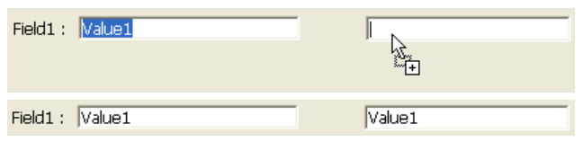
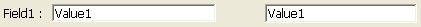

---
## Arrastável

Controlar se e como o usuário pode arrastar o objeto. Por defeito, não é permitida qualquer operação de arrastamento.

Estão disponíveis dois modos de arrastamento:

- **Personalizado**: nesse modo, qualquer operação de arrastar executada no objeto aciona o evento de formulário `On Begin Drag` no contexto do objeto. Em seguida, você gerencia a ação de arrastar usando um método.   
  No modo personalizado, basicamente toda a operação de arrastar e soltar é gerenciada pelo programador. Esse modo permite que você implemente qualquer interface baseada em arrastar e soltar, incluindo interfaces que não necessariamente transportam dados, mas podem executar qualquer ação, como abrir arquivos ou acionar um cálculo. Esse modo é baseado em uma combinação de propriedades, eventos e comandos específicos do tema `Pasteboard`.
- **Automático**: nesse modo, 4D **cópia** o texto ou as imagens diretamente do objeto formulário. Poderá então ser utilizado na mesma área de 4D, entre duas áreas 4D ou entre 4D e outra aplicação. Por exemplo, o arrastar (e largar) automático permite-lhe copiar um valor entre dois campos sem utilizar a programação:  
    
   Neste modo, o evento do formulário `On Begin Drag` NÃO é gerado. Se você quiser "forçar" o uso do arrasto personalizado enquanto o arrasto automático estiver ativado, mantenha pressionada a tecla **Alt** (Windows) ou **Option** (macOS) durante a ação. Esta opção não está disponível para as imagens.

Para mais informações, consulte [Arraste e Solte](https://doc.4d.com/4Dv18/4D/18/Drag-and-Drop.300-4505037.en.html) no manual *Linguajem 4D*.

#### Gramática JSON

| Nome     | Tipo de dados | Valores possíveis                                            |
| -------- | ------------- | ------------------------------------------------------------ |
| dragging | text          | "none" (por padrão), "custom", "automatic" (exceto list box) |

#### Objectos suportados

[Áreas 4D Write Pro](writeProArea_overview.md) - [Entrada](input_overview.md) - [Lista hierárquica](list_overview.md#overview) - [List Box](listbox_overview.md#overview) - [Área de plug-in](pluginArea_overview.md#overview)

#### Veja também
[Soltável](#droppable)

---
## Soltável

Controle se e como o objeto pode ser o destino de uma operação de arrastar e soltar.

Há dois modos de soltar em 4D:

- **Personalizado**: nesse modo, qualquer operação de soltar executada no objeto aciona os eventos de formulário `On Drag Over` e `On Drop` no contexto do objeto. Em seguida, você gerencia a ação de soltar usando um método.    
  No modo personalizado, basicamente toda a operação de arrastar e soltar é gerenciada pelo programador. Esse modo permite que você implemente qualquer interface baseada em arrastar e soltar, incluindo interfaces que não necessariamente transportam dados, mas podem executar qualquer ação, como abrir arquivos ou acionar um cálculo. Esse modo é baseado em uma combinação de propriedades, eventos e comandos específicos do tema `Pasteboard`.
- **Automático**: neste modo, 4D gere automaticamente - se possível - a inserção de dados arrastados do tipo texto ou imagem largada no objeto (os dados são colados no objeto). Os eventos formulário `On Drag Over` e `On Drop` NÃO são gerados. Por outro lado, são gerados os eventos `On After Edit` (durante a descida) e `On Data Change` (quando o objeto perde o foco).

Para mais informações, consulte [Arraste e Solte](https://doc.4d.com/4Dv18/4D/18/Drag-and-Drop.300-4505037.en.html) no manual *Linguajem 4D*.

#### Gramática JSON

| Nome     | Tipo de dados | Valores possíveis                                            |
| -------- | ------------- | ------------------------------------------------------------ |
| dropping | text          | "none" (por padrão), "custom", "automatic" (exceto list box) |

#### Objectos suportados

[Áreas 4D Write Pro](writeProArea_overview.md) - [Botão](button_overview.md) - [Entrada](input_overview.md) - [Lista hierárquica](list_overview.md#overview) - [List Box](listbox_overview.md#overview) - [Área de plug-in](pluginArea_overview.md#overview)

#### Veja também
[Arrastável](#draggable)

---
## Executar método objeto
Quando essa opção está ativada, o método objeto é executado com o evento `On Data Change` *no mesmo momento* em que o usuário altera o valor do indicador. Quando a opção está desativada, o método é executado *após* a modificação.

#### Gramática JSON

| Nome                | Tipo de dados | Valores possíveis |
| ------------------- | ------------- | ----------------- |
| continuousExecution | boolean       | true, false       |

#### Objectos suportados

[Barra de progresso](progressIndicator.md) - [Régua](ruler.md) - [Degrau](stepper.md)

---
## Métodos

Referência de um método ligado ao objeto. Os métodos do objeto "gerencie" geralmente o objeto enquanto o formulário é exibido ou impresso. Você não chama um método objeto — 4D o chama automaticamente quando um evento envolve o objeto ao qual o método objeto é anexado.

São suportados vários tipos de referências de métodos:

- um caminho de arquivo de método de objeto padrão, ou seja, que usa o seguinte padrão:  
  `ObjectMethods/objectName.4dm`  
  ... em que `objectName` é o [nome do objeto](properties_Object.md#object-name) real. Este tipo de referência indica que o arquivo de método está localizado no local padrão ("sources/forms/*formName*/ObjectMethods/"). Nesse caso, 4D trata automaticamente o método objeto quando as operações são executadas no objeto formulário (renomeação, duplicação, copiar/colar...)

- um nome de método projeto: nome de um método projeto existente sem extensão de arquivo, ou seja: `myMethod` Nesse caso, o 4D não oferece suporte automático para operações objeto.

- um caminho de arquivo de método personalizado incluindo a extensão .4dm, por exemplo:  
  `../../CustomMethods/myMethod.4dm` Você também pode usar um sistema de arquivos:  
  `/RESOURCES/Buttons/bOK.4dm` Nesse caso, o 4D não oferece suporte automático para operações objeto.

#### Gramática JSON

| Nome   | Tipo de dados | Valores possíveis                                                                       |
| ------ | ------------- | --------------------------------------------------------------------------------------- |
| method | text          | Caminho de ficheiro padrão ou personalizado do método objeto, ou nome do método projeto |

#### Objectos suportados

[Área 4D View Pro](viewProArea_overview.md) - [Área 4D Write Pro](writeProArea_overview.md) - [Botão](button_overview.md) - [Grade de botões](buttonGrid_overview.md) - [Casilla de selección](checkbox_overview.md) - [Combo Box](comboBox_overview.md) - [Lista suspensa](dropdownList_Overview.md) - [Formulários](FormEditor/forms.md) - [Lista hierárquica](list_overview.md#overview) - [Entrada](input_overview.md) - [List Box](listbox_overview.md#overview) - [Coluna List Box](listbox_overview.md#list-box-columns) - [Botão imagem](pictureButton_overview.md) - [Menu pop-up de imagem](picturePopupMenu_overview.md) - [Área de plugins](pluginArea_overview.md#overview) - [Indicadores de progresso](progressIndicator.md) - [Botão rádio](radio_overview.md) - [Regra](ruler.md) - [Spinner](spinner.md) - [Splitter](splitters.md) - [Stepper](stepper.md) - [Subformulário](subform_overview.md) - [Controle de tabulação](tabControl.md) - [Área web](webArea_overview.md#overview)

---
## Linhas móveis
`List box de tipo array`

Autoriza a deslocação de linhas durante a execução. Esta opção é selecionada por defeito. Não está disponível para [list boxes do tipo seleção](listbox_overview.md#selection-list-boxes) nem para [list boxes no modo hierárquico](properties_Hierarchy.md#hierarchical-list-box).

#### Gramática JSON

| Nome        | Tipo de dados | Valores possíveis |
| ----------- | ------------- | ----------------- |
| movableRows | boolean       | true, false       |

#### Objectos suportados

[List Box](listbox_overview.md#overview)

---
## Multi-seleccionável

Permite a seleção de vários registros/opções em uma [lista hierárquica](list_overview.md).

#### Gramática JSON

| Nome          | Tipo de dados | Valores possíveis            |
| ------------- | ------------- | ---------------------------- |
| selectionMode | text          | "multiple", "single", "none" |

#### Objectos suportados

[Lista hierárquica](list_overview.md)

---
## Ordenável

Permite classificar os dados da coluna clicando no cabeçalho de uma [listbox](listbox_overview.md). Esta opção é selecionada por defeito. Os arrays de tipo imagem (colunas) não podem ser ordenadas com esta funcionalidade.

Nos list boxes baseados em uma seleção de registros, a função de classificação padrão está disponível apenas:
*   Quando a fonte de dados é *Seleção atual*,
*   Com colunas associadas com campos (do tipo Alfa, Número, Data, Hora ou Booliano).

Em outros casos (list box baseados em seleções nomeadas, colunas associadas com expressões), a função de classificação padrão não está disponível. Uma classificação de list box padrão altera a ordem da seleção atual no banco de dados. No entanto, os registros destacados e o registro atual não são alterados. Uma classificação padrão sincroniza todas as colunas da list box, incluindo colunas calculadas.

#### Gramática JSON

| Nome     | Tipo de dados | Valores possíveis |
| -------- | ------------- | ----------------- |
| sortable | boolean       | true, false       |

#### Objectos suportados
[List Box](listbox_overview.md)

---
## Ação padrão
As atividades típicas a serem realizadas por objetos ativos*(por exemplo,*, permitir que o usuário aceite, cancele ou exclua registros, mova-se entre registros ou de uma página para outra em um formulário de várias páginas, etc.) foram predefinidas por 4D como ações padrão. Eles são descritos em detalhes na seção [Ações padrão](https://doc.4d.com/4Dv17R5/4D/17-R5/Standard-actions.300-4163633.en.html) do *Manual de Desenho*.

Você pode atribuir uma ação padrão e um método projeto de um objeto. Neste caso, a ação padrão é geralmente executada depois que o método e o 4D usa esta ação para ativar/desativar o objeto conforme o contexto atual. Quando um objeto é desativado, o método projeto associado não pode ser executado.

Você também pode definir essa propriedade usando o comando `OBJECT SET ACTION`.

#### Gramática JSON

| Nome   | Tipo de dados | Valores possíveis                                                                                                  |
| ------ | ------------- | ------------------------------------------------------------------------------------------------------------------ |
| action | string        | O nome de uma [ação normalizada válida](https://doc.4d.com/4Dv17R5/4D/17-R5/Standard-actions.300-4163633.en.html). |

#### Objectos suportados

[Botão](button_overview.md) - [Grade de botões](buttonGrid_overview.md) - [Caixa de seleção](checkbox_overview.md) - [Lista suspensa](dropdownList_Overview.md) - [List Box](listbox_overview.md) - [Botão imagem](pictureButton_overview.md) - [Menu pop-up imagem](picturePopupMenu_overview.md) - [Controle de guias](tabControl.md)
