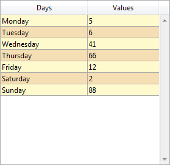
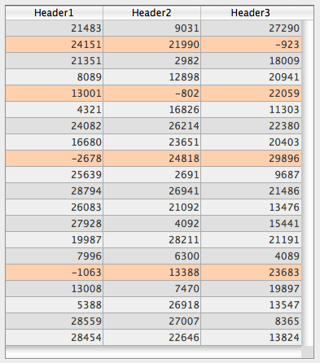
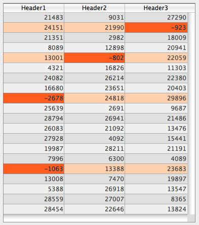

## Cor de fundo alternado

Permite definir uma cor de fundo diferente para linhas/colunas ímpares em uma caixa de listagem. Por padrão, *Automático* está selecionado: a coluna usa a cor de fundo alternativa definida no nível da caixa de listagem.

Você também pode definir essa propriedade usando o comando [`OBJECT SET RGB COLORS`](https://doc.4d.com/4dv20/help/command/en/page628.html).

#### Gramática JSON

| Nome          | Tipo de dados | Valores possíveis                              |
| ------------- | ------------- | ---------------------------------------------- |
| alternateFill | string        | qualquer valor css; "transparent"; "automatic" |

#### Objectos suportados

[List Box](listbox_overview.md#overview) - [Coluna List Box](listbox_overview.md#list-box-columns)

---

## Cor de fundo / Cor de preenchimento

Define a cor de fundo de um objeto.

No caso de uma caixa de listagem, por padrão, *Automático* é selecionado: a coluna usa a cor de fundo definida no nível da caixa de listagem.

Você também pode definir essa propriedade usando o comando [`OBJECT SET RGB COLORS`](https://doc.4d.com/4dv20/help/command/en/page628.html).

#### Gramática JSON

| Nome | Tipo de dados | Valores possíveis                              |
| ---- | ------------- | ---------------------------------------------- |
| fill | string        | qualquer valor css; "transparent"; "automatic" |

#### Objectos suportados

[Lista hierárquica](list_overview.md) - [Entrada](input_overview.md) - [List Box](listbox_overview.md) - [Coluna List Box](listbox_overview.md#list-box-columns) - [Rodapé de List Box](listbox_overview.md#list-box-footers) - [Oval](shapes_overview.md#oval) - [Retângulo](shapes_overview.md#rectangle) - [Área de texto](text.md)

#### Veja também

[Transparente](#transparent)

---

## Expressão cor de fundo

`List box de tipo coleção e seleção de entidades`

Uma expressão ou uma variável (variáveis de matriz não podem ser usadas) para aplicar uma cor de fundo personalizada a cada linha da caixa de listagem. A expressão ou variável será avaliada para cada linha exibida e deve retornar um valor de cor RGB. Para obter mais informações, consulte a descrição do comando [`OBJECT SET RGB COLORS`](https://doc.4d.com/4dv20/help/command/en/page628.html) no manual *Linguajem 4D*.

Você também pode definir essa propriedade usando a propriedade [`LISTBOX SET PROPERTY`](https://doc.4d.com/4dv20/help/command/en/page1440.html) com a constante `de expressão lk background color`.
> Com caixas de listagem do tipo de seleção de coleção ou entidade, essa propriedade também pode ser definida usando uma [expressão de metainformação](properties_Text.md#meta-info-expression).

#### Gramática JSON

| Nome          | Tipo de dados | Valores possíveis                             |
| ------------- | ------------- | --------------------------------------------- |
| rowFillSource | string        | Uma expressão que retorna um valor de cor RGB |

#### Objectos suportados

[List Box](listbox_overview.md#overview) - [Coluna List Box](listbox_overview.md#list-box-columns)

---

## Estilo borda linha

Permite definir um estilo padrão para o contorno do objeto.

#### Gramática JSON

| Nome        | Tipo de dados | Valores possíveis                                                 |
| ----------- | ------------- | ----------------------------------------------------------------- |
| borderStyle | text          | "system", "none", "solid", "dotted", "raised", "sunken", "double" |

#### Objectos suportados

[4D View Pro Area](viewProArea_overview.md) - [4D Write Pro areas](writeProArea_overview.md) - [Buttons](button_overview.md) - [Button Grid](buttonGrid_overview.md) - [Hierarchical List](list_overview.md#overview) - [Input](input_overview.md) - [List Box](listbox_overview.md#overview) - [Picture Button](pictureButton_overview.md) - [Picture Pop-up Menu](picturePopupMenu_overview.md) - [Plug-in Area](pluginArea_overview.md#overview) - [Progress Indicator](progressIndicator.md) - [Ruler](ruler.md) - [Spinner](spinner.md) - [Stepper](stepper.md) - [Subform](subform_overview.md#overview) - [Text Area](text.md) - [Web Area](webArea_overview.md#overview)

---

## Tipo de linha pontilhada

Descreve o tipo de linha pontilhada como uma sequência de pontos pretos e brancos.

#### Gramática JSON

| Nome            | Tipo de dados               | Valores possíveis                                                                |
| --------------- | --------------------------- | -------------------------------------------------------------------------------- |
| strokeDashArray | arrays numéricos ou strings | Ex. Ex. Ex. "6 1" or \[6,1\] for a sequence of 6 black point and 1 white point |

#### Objectos suportados

[Retângulo](shapes_overview.md#rectangle) - [Oval](shapes_overview.md#oval) - [Linha](shapes_overview.md#line)

---

## Esconder linhas em branco extras

Controla a exibição de linhas em branco extras adicionadas na parte inferior de um objeto de caixa de listagem. Por defeito, 4D adiciona essas linhas extra para preencher a área vazia:


Pode remover estas linhas vazias selecionando esta opção. A parte inferior do objeto do list box é deixada em branco:



#### Gramática JSON

| Nome               | Tipo de dados | Valores possíveis |
| ------------------ | ------------- | ----------------- |
| hideExtraBlankRows | boolean       | true, false       |

#### Objectos suportados

[List Box](listbox_overview.md#overview)

---

## Cor da linha

Designa a cor das linhas do objeto. A cor pode ser especificada por:

* um nome de cor - como "red"
* um valor HEX - como "#ff0000"
* um valor RGB - como "rgb(255,0,0)"

Você também pode definir essa propriedade usando o comando [`OBJECT SET RGB COLORS`](https://doc.4d.com/4dv20/help/command/en/page628.html).

#### Gramática JSON

| Nome   | Tipo de dados | Valores possíveis                        |
| ------ | ------------- | ---------------------------------------- |
| stroke | string        | um valor css, "transparent", "automatic" |

> Essa propriedade também está disponível para objetos baseados em texto e, nesse caso, ela designa a cor da fonte e as linhas do objeto; consulte [Cor da fonte](properties_Text.md#font-color).

#### Objectos suportados

[Linha](shapes_overview.md#line) - [Oval](shapes_overview.md#oval) - [Retângulo](shapes_overview.md#rectangle)

---

## Largura da linha

Designa a espessura de uma linha.

#### Gramática JSON

| Nome        | Tipo de dados | Valores possíveis                                                                     |
| ----------- | ------------- | ------------------------------------------------------------------------------------- |
| strokeWidth | number        | 0 para a largura mais pequena num formulário impresso, ou qualquer valor inteiro < 20 |

#### Objectos suportados

[Linha](shapes_overview.md#line) - [Oval](shapes_overview.md#oval) - [Retângulo](shapes_overview.md#rectangle)

---

## Array controle linha

`List box de tipo array`

O nome de um array para aplicar uma cor de fundo personalizada para cada linha ou coluna da list box.

Deve ser introduzido o nome de um array Longint. Cada elemento deste array corresponde a uma linha do list box (se aplicada o list box) ou a uma célula da coluna (se aplicada a uma coluna), pelo que o array deve ter o mesmo tamanho que o array associado à coluna. Você pode usar as constantes do tema [SET RGB COLORS](https://doc.4d.com/4Dv20/4D/20.1/SET-RGB-COLORS.302-6481080.en.html). Se você quiser que a célula herde a cor de fundo definida no nível superior, passe o valor -255 para o elemento de array correspondente.

Por exemplo, dada uma caixa de listagem em que as linhas têm uma cor alternada de cinza/cinza claro, definida nas propriedades da caixa de listagem. Um array de cor de fundo também foi definida para a caixa de listagem, a fim de mudar a cor das linhas em que pelo menos um valor é negativo para laranja claro:

```4d
 <>_BgndColors{$i}:=0x00FFD0B0 // laranja
 <>_BgndColors{$i}:=-255 // valor por padrão
```



De seguida, deve colorir as células com valores negativos a laranja-escuro. Para fazer isso, você define uma matriz de cores de fundo para cada coluna, por exemplo, `<>_BgndColor_1`, `<>_BgndColor_2` e `<>_BgndColor_3`. Os valores dessas arrays têm prioridade sobre os valores definidos nas propriedades da caixa de listagem, bem como sobre os valores do array geral de cores de fundo:

```4d
 <>_BgndColorsCol_3{2}:=0x00FF8000 // laranja escura
 <>_BgndColorsCol_2{5}:=0x00FF8000
 <>_BgndColorsCol_1{9}:=0x00FF8000
 <>_BgndColorsCol_1{16}:=0x00FF8000
```



Você pode obter o mesmo resultado usando os comandos [`LISTBOX SET UMA ARTA`](https://doc.4d.com/4dv20/help/command/en/page1268.html) e [`LISTBOX SET UMA UM COLOR`](https://doc.4d.com/4dv20/help/command/en/page1270.html). Eles têm a vantagem de permitir que você não precise predefinir matrizes de estilo/cor para as colunas: em vez disso, elas são criadas dinamicamente pelos comandos.

#### Gramática JSON

| Nome          | Tipo de dados | Valores possíveis           |
| ------------- | ------------- | --------------------------- |
| rowFillSource | string        | O nome de um array longint. |

#### Objectos suportados

[Caixa de Listagem](listbox_overview.md) - [Coluna da caixa de listagem](listbox_overview.md#list-box-columns)

---

## Transparente

Define o fundo do list box como "Transparent". Quando definido, qualquer [cor de fundo alternativa](#alternate-background-color) ou [cor de fundo](#background-color--fill-color) definida para a coluna é ignorada.

#### Gramática JSON

| Nome | Tipo de dados | Valores possíveis |
| ---- | ------------- | ----------------- |
| fill | text          | "transparent"     |

#### Objectos suportados

[List Box](listbox_overview.md#overview)

#### Veja também

[Cor de fundo / Cor de preenchimento](#background-color--fill-color)
