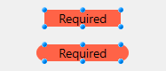
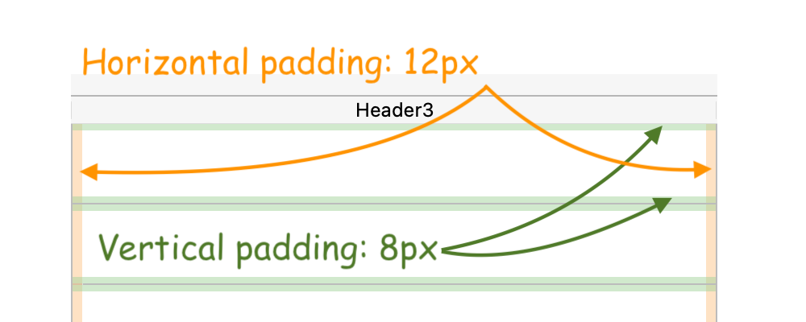

## Altura automática da linha

Essa propriedade só está disponível para caixas de listagem com as seguintes [fontes de dados](properties_Object.md#data-source):

- collection ou entity selection,
- array (não hierárquico).

A propriedade não está selecionada por padrão. Quando usado para pelo menos uma coluna, a altura de cada linha na coluna será automaticamente calculada por 4D, e o conteúdo da coluna será levado em consideração. Observe que somente as colunas com a opção selecionada serão levadas em conta para calcular a altura da linha.

:::note

Ao redimensionar o formulário, se a propriedade [de dimensionamento horizontal](properties_ResizingOptions.md#horizontal-sizing) "Grow" tiver sido atribuída à caixa de listagem, a coluna mais à direita será aumentada além de sua largura máxima, se necessário.

:::

Quando essa propriedade está ativada, a altura de cada linha é calculada automaticamente para que o conteúdo da célula caiba totalmente sem ser truncado (a menos que a opção [Wordwrap](properties_Display.md#wordwrap) esteja desativada).

* O cálculo da altura da linha tem em conta:
  * qualquer tipo de conteúdo (texto, numérico, datas, horas, imagens (o cálculo depende do formato da imagem), objetos),
  * quaisquer tipos de controlo (entradas, caixas de verificação, listas, listas suspensas),
  * tipos, estilos e tamanhos de letra,
  * a opção [Wordwrap](properties_Display.md#wordwrap): se desativada, a altura será baseada no número de parágrafos (as linhas são truncadas); se ativada, a altura será baseada no número de linhas (não truncadas).

* O cálculo da altura da linha ignora:
  * conteúdo da coluna oculta
  * Propriedades [Row Height](#row-height) e [Row Height Array](#row-height-array) (se houver) definidas na lista de propriedades ou por programação.

:::caution

> > Since it requires additional calculations at runtime, the automatic row height option could affect the scrolling fluidity of your list box, in particular when it contains a large number of rows.

:::


#### Gramática JSON

| Nome          | Tipo de dados | Valores possíveis |
| ------------- | ------------- | ----------------- |
| rowHeightAuto | boolean       | true, false       |

#### Objectos suportados

[Coluna da List Box](listbox_overview.md#list-box-columns)

---

## Fundo

Coordenadas inferiores do objeto no formulário.

#### Gramática JSON

| Nome   | Tipo de dados | Valores possíveis |
| ------ | ------------- | ----------------- |
| bottom | number        | mínimo: 0         |

#### Objectos suportados

[4D View Pro Area](viewProArea_overview.md) - [4D Write Pro Area](writeProArea_overview.md) - [Botão](button_overview.md) - [Grade de botões](buttonGrid_overview.md) - [Caixa de seleção](checkbox_overview.md) - [Caixa de](comboBox_overview.md) [combinação](dropdownList_Overview.md) - [Lista suspensa](dropdownList_Overview.md) -

Caixa de grupo</7> - [Lista hierárquica](list_overview.md#overview) - [Entrada](input_overview.md) - [Caixa de listagem](listbox_overview.md#overview) - [Linha](shapes_overview.md#line) - [Coluna de caixa de listagem](listbox_overview.md#list-box-columns) - [Oval](shapes_overview.md#oval) - [Botão de imagem](pictureButton_overview.md) - [Menu pop-up de imagem](picturePopupMenu_overview.md) - [Área de plug-in](pluginArea_overview.md#overview) - [Indicadores de progresso](progressIndicator.md) - [Botão de rádio](radio_overview.md) - [Retângulo](shapes_overview.md#rectangle) - [Régua](ruler.md) - [Spinner](spinner.md) - [Divisor](splitters.md) - [Imagem estática](staticPicture.md) - [Stepper](stepper.md) - [Subformulário](subform_overview.md) - [Controle de tabulação](tabControl.md) - [Área de texto](text.md) - [Área da Web](webArea_overview.md#overview)</p> 


---


## Direita

Coordenadas esquerda do objecto no formulário.


#### Gramática JSON

| Nome | Tipo de dados | Valores possíveis |
| ---- | ------------- | ----------------- |
| left | number        | mínimo: 0         |


#### Objectos suportados

[4D View Pro Area](viewProArea_overview.md) - [4D Write Pro Area](writeProArea_overview.md) - [Botão](button_overview.md) - [Grade de botões](buttonGrid_overview.md) - [Caixa de seleção](checkbox_overview.md) - [Caixa de](comboBox_overview.md) [combinação](dropdownList_Overview.md) - [Lista suspensa](dropdownList_Overview.md) - Caixa de grupo</7> - [Lista hierárquica](list_overview.md#overview) - [Entrada](input_overview.md) - [Caixa de listagem](listbox_overview.md#overview) - [Linha](shapes_overview.md#line) - [Coluna de caixa de listagem](listbox_overview.md#list-box-columns) - [Oval](shapes_overview.md#oval) - [Botão de imagem](pictureButton_overview.md) - [Menu pop-up de imagem](picturePopupMenu_overview.md) - [Área de plug-in](pluginArea_overview.md#overview) - [Indicadores de progresso](progressIndicator.md) - [Botão de rádio](radio_overview.md) - [Régua](ruler.md) - [Retângulo](shapes_overview.md#rectangle) - [Spinner](spinner.md) - [Divisor](splitters.md) - [Imagem estática](staticPicture.md) - [Stepper](stepper.md) - [Subformulário](subform_overview.md) - [Controle de tabulação](tabControl.md) - [Área de texto](text.md) - [Área da Web](webArea_overview.md#overview)</p> 


---


## Esquerda

Coordenada direita do objecto no formulário.


#### Gramática JSON

| Nome    | Tipo de dados | Valores possíveis |
| ------- | ------------- | ----------------- |
| direita | number        | mínimo: 0         |


#### Objectos suportados

[4D View Pro Area](viewProArea_overview.md) - [4D Write Pro Area](writeProArea_overview.md) - [Botão](button_overview.md) - [Grade de botões](buttonGrid_overview.md) - [Caixa de seleção](checkbox_overview.md) - [Caixa de](comboBox_overview.md) [combinação](dropdownList_Overview.md) - [Lista suspensa](dropdownList_Overview.md) - Caixa de grupo</7> - [Lista hierárquica](list_overview.md#overview) - [Entrada](input_overview.md) - [Caixa de listagem](listbox_overview.md#overview) - [Linha](shapes_overview.md#line) - [Coluna de caixa de listagem](listbox_overview.md#list-box-columns) - [Oval](shapes_overview.md#oval) - [Botão de imagem](pictureButton_overview.md) - [Menu pop-up de imagem](picturePopupMenu_overview.md) - [Área de plug-in](pluginArea_overview.md#overview) - [Indicadores de progresso](progressIndicator.md) - [Botão de rádio](radio_overview.md) - [Régua](ruler.md) - [Retângulo](shapes_overview.md#rectangle) - [Spinner](spinner.md) - [Divisor](splitters.md) - [Imagem estática](staticPicture.md) - [Stepper](stepper.md) - [Subformulário](subform_overview.md) - [Controle de tabulação](tabControl.md) - [Área de texto](text.md) - [Área da Web](webArea_overview.md#overview)</p> 


---


## Topo

Coordenada superior do objecto no formulário.


#### Gramática JSON

| Nome | Tipo de dados | Valores possíveis |
| ---- | ------------- | ----------------- |
| top  | number        | mínimo: 0         |


#### Objectos suportados

[4D View Pro Area](viewProArea_overview.md) - [4D Write Pro Area](writeProArea_overview.md) - [Botão](button_overview.md) - [Grade de botões](buttonGrid_overview.md) - [Caixa de seleção](checkbox_overview.md) - [Caixa de](comboBox_overview.md) [combinação](dropdownList_Overview.md) - [Lista suspensa](dropdownList_Overview.md) - Caixa de grupo</7> - [Lista hierárquica](list_overview.md#overview) - [Entrada](input_overview.md) - [Caixa de listagem](listbox_overview.md#overview) - [Linha](shapes_overview.md#line) - [Coluna de caixa de listagem](listbox_overview.md#list-box-columns) - [Oval](shapes_overview.md#oval) - [Botão de imagem](pictureButton_overview.md) - [Menu pop-up de imagem](picturePopupMenu_overview.md) - [Área de plug-in](pluginArea_overview.md#overview) - [Indicadores de progresso](progressIndicator.md) - [Botão de rádio](radio_overview.md) - [Régua](ruler.md) - [Retângulo](shapes_overview.md#rectangle) - [Spinner](spinner.md) - [Divisor](splitters.md) - [Imagem estática](staticPicture.md) - [Stepper](stepper.md) - [Subformulário](subform_overview.md) - [Controle de tabulação](tabControl.md) - [Área de texto](text.md) - [Área da Web](webArea_overview.md#overview)</p> 


---


## Retângulo

<details><summary>Histórico</summary>

| Release | Mudanças                               |
| ------- | -------------------------------------- |
| 18 R6   | Suporte para entradas e áreas de texto |


</details>

Define o arredondamento do canto (em pixels) do objeto. Por padrão, o valor do raio é 0 pixels. Você pode alterar essa propriedade para desenhar objetos arredondados com formas personalizadas:


O valor mínimo é 0; nesse caso, um retângulo de objeto padrão não arredondado é desenhado. O valor máximo depende do tamanho do retângulo (ele não pode exceder metade do tamanho do retângulo menor) e é calculado dinamicamente.

:::note

Com [áreas de texto](text.md) e [entradas](input_overview.md):

- a propriedade corner radius só está disponível com os [estilos de linha de borda](properties_BackgroundAndBorder.md#border-line-style)"none", "solid" ou "dotted",
- o arredondamento do canto é desenhado fora da área do objeto (o objeto parece maior no formulário, mas sua [largura](properties_CoordinatesAndSizing.md#width) e [altura](properties_CoordinatesAndSizing.md#height) não são ampliadas).



:::  

Você também pode definir essa propriedade usando os comandos [OBJECT Get corner radius](https://doc.4d.com/4dv19/help/command/en/page1323.html) e [OBJECT SET CORNER RADIUS](https://doc.4d.com/4dv19/help/command/en/page1324.html).


#### Gramática JSON

| Nome         | Tipo de dados | Valores possíveis |
| ------------ | ------------- | ----------------- |
| borderRadius | integer       | mínimo: 0         |


#### Objectos suportados

[Entrada](input_overview.md) - [Retângulo](shapes_overview.md#rectangle) - [Área de texto](text.md)


---


## Altura

Esta propriedade designa o tamanho vertical de um objeto.


> Alguns objetos podem ter uma altura predefinida que não pode ser alterada.


#### Gramática JSON

| Nome   | Tipo de dados | Valores possíveis |
| ------ | ------------- | ----------------- |
| height | number        | mínimo: 0         |


#### Objectos suportados

[4D View Pro Area](viewProArea_overview.md) - [4D Write Pro Area](writeProArea_overview.md) - [Button](button_overview.md) - [Button Grid](buttonGrid_overview.md) - [Check Box](checkbox_overview.md) - [Combo Box](comboBox_overview.md) - [Dropdown list](dropdownList_Overview.md) - [Group Box](groupBox.md) - [Hierarchical List](list_overview.md#overview) - [Input](input_overview.md) - [List Box](listbox_overview.md#overview) - [Line](shapes_overview.md#line) - [List Box Column](listbox_overview.md#list-box-columns) - [Oval](shapes_overview.md#oval) - [Picture Button](pictureButton_overview.md) - [Picture Pop up menu](picturePopupMenu_overview.md) - [Plug-in Area](pluginArea_overview.md#overview) - [Progress Indicators](progressIndicator.md) - [Radio Button](radio_overview.md) - [Ruler](ruler.md) - [Rectangle](shapes_overview.md#rectangle) - [Spinner](spinner.md) - [Splitter](splitters.md) - [Static Picture](staticPicture.md) - [Stepper](stepper.md) - [Subform](subform_overview.md) - [Tab control](tabControl.md) - [Text Area](text.md) - [Web Area](webArea_overview.md#overview)


---


## Largura

Esta propriedade designa o tamanho horizontal de um objeto.


> * Alguns objetos podem ter uma altura predefinida que não pode ser alterada.
> * Se a propriedade [Resizable](properties_ResizingOptions.md#resizable) for usada para uma [coluna de caixa de listagem](listbox_overview.md#list-box-columns), o usuário também poderá redimensionar manualmente a coluna.
> * Ao redimensionar o formulário, se a propriedade [ de dimensionamento horizontal "Grow"](properties_ResizingOptions.md#horizontal-sizing) tiver sido atribuída à caixa de listagem, a coluna mais à direita será aumentada além de sua largura máxima, se necessário.


#### Gramática JSON

| Nome  | Tipo de dados | Valores possíveis |
| ----- | ------------- | ----------------- |
| width | number        | mínimo: 0         |


#### Objectos suportados

[4D View Pro Area](viewProArea_overview.md) - [4D Write Pro Area](writeProArea_overview.md) - [Botão](button_overview.md) - [Grade de botões](buttonGrid_overview.md) - [Caixa de seleção](checkbox_overview.md) - [Caixa de](comboBox_overview.md) [combinação](dropdownList_Overview.md) - <6>Lista suspensa</a> - Caixa de grupo</7> - [Lista hierárquica](list_overview.md#overview) - [Entrada](input_overview.md) - [Linha](shapes_overview.md#line) - [Caixa de listagem](listbox_overview.md#overview) - [Coluna de caixa de listagem](listbox_overview.md#list-box-columns) - [Oval](shapes_overview.md#oval) - [Botão de imagem](pictureButton_overview.md) - [Menu pop-up de imagem](picturePopupMenu_overview.md) - [Área de plug-in](pluginArea_overview.md#overview) - [Indicadores de progresso](progressIndicator.md) - [Botão de rádio](radio_overview.md) - [Régua](ruler.md) - [Retângulo](shapes_overview.md#rectangle) - [Spinner](spinner.md) - [Divisor](splitters.md) - [Imagem estática](staticPicture.md) - [Stepper](stepper.md) - [Subformulário](subform_overview.md) - [Controle de tabulação](tabControl.md) - [Área de texto](text.md) - [Área da Web](webArea_overview.md#overview)</p> 


---


## Largura máxima

A largura máxima da coluna (em píxeis). A largura da coluna não pode ser aumentada além deste valor ao redimensionar a coluna ou o formulário.


> Ao redimensionar o formulário, se a propriedade [ de dimensionamento horizontal "Grow"](properties_ResizingOptions.md#horizontal-sizing) tiver sido atribuída à caixa de listagem, a coluna mais à direita será aumentada além de sua largura máxima, se necessário.


#### Gramática JSON

| Nome     | Tipo de dados | Valores possíveis |
| -------- | ------------- | ----------------- |
| maxWidth | number        | mínimo: 0         |


#### Objectos suportados

[Coluna da List Box](listbox_overview.md#list-box-columns)


---


## Largura mínima

A largura mínima da coluna (em píxeis). A largura da coluna não pode ser reduzida abaixo deste valor quando se redimensiona a coluna ou o formulário.


> Ao redimensionar o formulário, se a propriedade [ de dimensionamento horizontal "Grow"](properties_ResizingOptions.md#horizontal-sizing) tiver sido atribuída à caixa de listagem, a coluna mais à direita será aumentada além de sua largura máxima, se necessário.


#### Gramática JSON

| Nome     | Tipo de dados | Valores possíveis |
| -------- | ------------- | ----------------- |
| minWidth | number        | mínimo: 0         |


#### Objectos suportados

[Coluna da List Box](listbox_overview.md#list-box-columns)


---


## Array altura linha

Define a altura das linhas do list box (excluindo cabeçalhos e rodapés). Por padrão, a altura da linha é definida conforme a plataforma e o tamanho da fonte.


#### Gramática JSON

| Nome      | Tipo de dados | Valores possíveis                               |
| --------- | ------------- | ----------------------------------------------- |
| rowHeight | string        | valor css na unidade "em" ou "px" (por defeito) |


#### Objectos suportados

[List Box](listbox_overview.md#overview)


#### Veja também

[Array estilo linha](#row-height-array)


---


## Array estilo linha

Essa propriedade é usada para especificar o nome de um array de altura de linha que você deseja associar a list box. Um array de altura de linha deve ser do tipo numérico (longint por defeito).

Quando um array de altura de linha é definido, cada um de seus elementos cujo valor difere de 0 (zero) é considerado para determinar a altura da linha correspondente no list box, com base na unidade de altura da linha atual.

Por exemplo, pode escrever:


```4d
ARRAY LONGINT(RowHeights;20)
RowHeights{5}:=3
```


Supondo que a unidade das linhas seja "linhas", então a quinta linha do list box terá uma altura de três linhas, enquanto todas as outras linhas manterão sua altura padrão.


> * A propriedade Row Height Array não é considerado nos list boxes hierárquicos.
> * Para caixas de listagem de seleção de matriz e coleção/entidade, essa propriedade estará disponível somente se a opção [Altura automática da linha](#automatic-row-height) não estiver selecionada.


#### Gramática JSON

| Nome            | Tipo de dados | Valores possíveis              |
| --------------- | ------------- | ------------------------------ |
| rowHeightSource | string        | Nome de uma variável array 4D. |


#### Objectos suportados

[List Box](listbox_overview.md#overview)


#### Veja também

[Array altura linha](#row-height)


---


## Barra rolagem horizontal

Define um preenchimento horizontal para as células. O valor é definido em pixeis (padrão = 0).




#### Gramática JSON

| Nome              | Tipo de dados | Valores possíveis               |
| ----------------- | ------------- | ------------------------------- |
| horizontalPadding | number        | Número de pixéis (deve ser >=0) |


#### Objectos suportados

[List Box](listbox_overview.md#overview) - [List Box Column](listbox_overview.md#list-box-columns) - [Footers](properties_Footers.md) - [Headers](properties_Headers.md)


#### Veja também

[Dimensionamento vertical](#vertical-padding)


---


## Dimensionamento vertical

Define um preenchimento vertical para as células. O valor é definido em pixeis (padrão = 0).  


#### Gramática JSON

| Nome            | Tipo de dados | Valores possíveis               |
| --------------- | ------------- | ------------------------------- |
| verticalPadding | number        | Número de pixéis (deve ser >=0) |


#### Objectos suportados

[Caixa de listagem](listbox_overview.md#overview) - [Coluna de caixa de listagem](listbox_overview.md#list-box-columns) - [Rodapés](properties_Footers.md) - [Cabeçalhos](properties_Headers.md)


#### Veja também

[Barra rolagem horizontal](#horizontal-padding)
