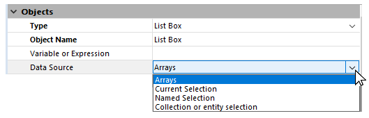

---

## Tipo

 `CONFIGURAÇÃO OBRIGATÓRIA`

Esta propriedade designa o tipo de [objecto formulárioactivo ou inactivo](formObjects_overview.md).

#### Gramática JSON

| Nome | Tipo de dados | Valores possíveis                                                                                                                                                                                                                                                                                        |
| ---- | ------------- | -------------------------------------------------------------------------------------------------------------------------------------------------------------------------------------------------------------------------------------------------------------------------------------------------------- |
| type | string        | "button", "buttonGrid", "checkbox", "combo", "dropdown", "groupBox", "input", "line", "list", "listbox", "oval", "picture", "pictureButton", "picturePopup", "plugin", "progress", "radio", "rectangle", "ruler", "spinner", "splitter", "stepper", "subform", "tab", "text", "view", "webArea", "write" |

#### Objectos suportados

[Área 4D View Pro](viewProArea_overview.md) - [Área 4D Write Pro](writeProArea_overview.md) - [Botão](button_overview.md) - [Grade de botões](buttonGrid_overview.md) - [Caixa de seleção](checkbox_overview.md) - [Caixa de](comboBox_overview.md) - [Lista suspensa](dropdownList_Overview.md) - [Caixa de grupo](groupBox.md) - [Lista hierárquica](list_overview.md) - [List Box](listbox_overview.md) - [Coluna de List Box](listbox_overview.md#list-box-columns) - [Rodapé List Box](listbox_overview.md#list-box-footers) - [Cabeçalho List Box](listbox_overview.md#list-box-headers) - [Botão de imagem](pictureButton_overview.md) - [Menu pop-up imagem](picturePopupMenu_overview.md) - [Área de plug-in](pluginArea_overview.md) - [Indicador de progresso](progressIndicator.md) - [Botão de rádio](radio_overview.md) - [Spinner](spinner.md) - [Divisor](splitters.md) - [Imagem estática](staticPicture.md) - [Stepper](stepper.md) - [Subformulário](subform_overview.md) - [Controle de tabulação](tabControl.md) - [Área de texto](text.md) - [Área da Web](webArea_overview.md)

---

## Nome de objeto

Cada objeto de formulário ativo está associado a um nome de objeto. Cada nome de objeto deve ser único.
> Os nomes dos objectos estão limitados a um tamanho de 255 bytes.

Ao usar a linguagem 4D, você pode se referir a um objeto de formulário ativo pelo nome do objeto (para obter mais informações sobre isso, consulte [Propriedades do objeto](https://doc.4d.com/4Dv17R5/4D/17-R5/Object-Properties.300-4128195.en.html) no manual de referência da linguagem 4D).

Para obter mais informações sobre regras de nomeação para objetos de formulário, consulte a seção [Identificadores](Concepts/identifiers.md).

#### Gramática JSON

| Nome | Tipo de dados | Valores possíveis                                                 |
| ---- | ------------- | ----------------------------------------------------------------- |
| name | string        | Qualquer nome permitido que não pertença a um objeto já existente |

#### Objectos suportados

[Área 4D View Pro](viewProArea_overview.md) - [Área 4D Write Pro](writeProArea_overview.md) - [Botão](button_overview.md) - [Grade de botões](buttonGrid_overview.md) - [Caixa de seleção](checkbox_overview.md) - [Caixa de](comboBox_overview.md) - [Lista suspensa](dropdownList_Overview.md) - [Caixa de grupo](groupBox.md) - [Lista hierárquica](list_overview.md) - [List Box](listbox_overview.md) - [Coluna de List Box](listbox_overview.md#list-box-columns) - [Rodapé List Box](listbox_overview.md#list-box-footers) - [Cabeçalho List Box](listbox_overview.md#list-box-headers) - [Botão de imagem](pictureButton_overview.md) - [Menu pop-up imagem](picturePopupMenu_overview.md) - [Área de plug-in](pluginArea_overview.md) - [Indicador de progresso](progressIndicator.md) - [Spinner](spinner.md) - [Divisor](splitters.md) - [Imagem estática](staticPicture.md) - [Stepper](stepper.md) - [Botão de rádio](radio_overview.md) -[Subformulário](subform_overview.md) - [Controle de tabulação](tabControl.md) - [Área texto](text.md) - [Área Web](webArea_overview.md)

---

## Salvar valor

Essa propriedade está disponível quando a opção [Salvar geometria](FormEditor/properties_FormProperties.md#save-geometry) está marcada para o formulário.

Essa funcionalidade só é suportada por objetos que contribuam para a geometria geral do formulário. Por exemplo, esta opção está disponível para caixas de seleção porque seu valor pode ser usado para ocultar ou exibir áreas adicionais na janela.

Eis a lista de objetos cujo valor pode ser guardado:

| Object                                                  | Valor guardado                                                                         |
| ------------------------------------------------------- | -------------------------------------------------------------------------------------- |
| [Caixa de selecção](checkbox_overview.md)               | Valor da variável associada (0, 1, 2)                                                  |
| [Lista suspensa ou drop down](dropdownList_Overview.md) | Número da linha seleccionada                                                           |
| [Botão rádio](radio_overview.md)                        | Valor da variável associada (1, 0, True ou False para os botões, consoante o seu tipo) |
| [Controle de abas](tabControl.md)                       | Número da aba selecionada                                                              |

#### Gramática JSON

| Nome          | Tipo de dados | Valores possíveis |
| ------------- | ------------- | ----------------- |
| memorizeValue | boolean       | true, false       |

#### Objectos suportados

[Caixa de verificação](checkbox_overview.md) - [Lista pendente](dropdownList_Overview.md) - [Botão de rádio](radio_overview.md) - [Controlo de separadores](tabControl.md)

---

## Variável ou expressão

> Veja também **[Expression](properties_DataSource.md#expression)** para colunas de list box de tipo seleção e coleção.

Esta propriedade especifica a fonte dos dados. Cada objeto de formulário ativo está associado a um nome de objeto e a um nome de variável. O nome da variável pode diferir do nome do objeto. No mesmo formulário, você pode usar a mesma variável várias vezes, mas cada [nome de objeto](#object-name) deve ser exclusivo.
> O tamanho do nome da variável é limitado a 31 bytes. Consulte a seção [Identificadores](Concepts/identifiers.md) para obter mais informações sobre regras de nomenclatura.

As variáveis de objeto do formulário permitem controlar e monitorar os objetos. Por exemplo, quando um botão é clicado, sua variável é definida como 1; em todos os outros momentos, ela é 0. A expressão associada a um indicador de progresso permite que você leia e altere a configuração atual.

As variáveis ou expressões podem ser digitáveis ou não digitáveis e podem receber dados do tipo Texto, Inteiro, Numérico, Data, Hora, Imagem, Booleano ou Objeto.

#### Gramática JSON

| Nome       | Tipo de dados              | Valores possíveis                                                           |
| ---------- | -------------------------- | --------------------------------------------------------------------------- |
| dataSource | string ou array de strings | <li>4D variable, field name, or arbitrary complex language expression.</li><li>Cadeia vazia para [variáveis dinâmicas](#dynamic-variables).</li><li>Array de strings (coleção de nomes de array) para uma coluna de [listbox hierárquico](listbox_overview.md#hierarchical-list-boxes)]</li> |

### Expressões

Você pode usar uma [expressão](Concepts/quick-tour.md#expressions) como fonte de dados para um objeto. Qualquer expressão 4D válida é permitida: expressão simples, propriedade do objeto, fórmula, função 4D, nome do método do projeto ou campo usando a sintaxe padrão `[Table]Field`. A expressão é avaliada quando o formulário é executado e reavaliado para cada evento de formulário. Tenga en cuenta que las expresiones pueden ser [asignables o no asignables](Concepts/quick-tour.md#expressions).
> Se o valor inserido corresponde a um nome de variável e a um nome de método, 4D considera que você está indicando o método.

### Variáveis dinâmicas

Você pode deixar que 4D crie variáveis associadas a seus objetos de formulário (botões, variáveis inseríveis, caixas de seleção, etc.) dinamicamente e de acordo com suas necessidades. Para isso, basta deixar a propriedade "Variable or Expression" (ou o campo JSON `dataSource`) em branco.

Quando uma variável não é nomeada, quando o formulário é carregado, 4D cria uma variável para o objeto, com um nome calculado único no espaço das variáveis de processo do intérprete (o que significa que esse mecanismo pode ser usado mesmo no modo compilado). Esta variável temporária será destruída quando o formulário for fechado. Para que este princípio funcione em modo compilado, é imperativo que as variáveis dinâmicas sejam explicitamente tipadas. Há duas formas de o fazer:

- Pode definir o tipo utilizando a propriedade [Tipo de expressão](#expression-type).
- É possível utilizar um código de inicialização específico quando o formulário é carregado, que utiliza, por exemplo, o comando `VARIABLE TO VARIABLE`:

```4d
 If(Form event=On Load)
    C_TEXT($init)
    $Ptr_object:=OBJECT Get pointer(Object named;"comments")
    $init:=""
    VARIABLE TO VARIABLE(Current process;$Ptr_object->;$init)
 End if
```

No código 4D, as variáveis dinâmicas podem ser acedidas através de um ponteiro obtido com o comando `OBJECT Get pointer`. Por exemplo:

```4d
  // atribuir a hora 12:00:00 à variável do objeto "tstart"
 $p :=OBJECT Get pointer(Object named; "tstart")
 $p->:=?12:00:00?
```

Este mecanismo tem duas vantagens:

- Por um lado, ele permite o desenvolvimento de componentes do tipo "subformulário" que podem ser usados várias vezes no mesmo formulário host. Tomemos como exemplo o caso de um subformulário datepicker que é inserido duas vezes em um formulário host para definir uma data inicial e uma data final. Esse subformulário usará objetos para escolher a data do mês e do ano. Será necessário que esses objetos trabalhem com variáveis diferentes para a data de início e a data de término. Permitir que 4D crie sua variável com um nome exclusivo é uma forma de resolver essa dificuldade.
- Por outro lado, pode ser utilizado para limitar a utilização da memória. De facto, os objectos formulário só funcionam com variáveis processo ou inter-processo. No entanto, no modo compilado, uma instância de cada variável de processo é criada em todos os processos, incluindo os processos do servidor. Essa instância ocupa memória, mesmo quando o formulário não é usado durante a sessão. Portanto, permitir que 4D crie variáveis dinamicamente ao carregar os formulários pode economizar memória.

### List box array

Para um list box de tipo arrays a propriedade **Variável ou Expressão** geralmente contém o nome da variável array definida para o list box, e para cada coluna. No entanto, você pode usar um array de strings (contendo nomes de arrays) como valor de *dataSource* para uma coluna de list box para definir uma [list box hierárquico](listbox_overview.md#hierarchical-list-boxes).

#### Objectos suportados

[Área 4D View Pro](viewProArea_overview.md) - [Área 4D Write Pro](writeProArea_overview.md) - [Botão](button_overview.md) - [Grade de botões](buttonGrid_overview.md) - [Caixa de seleção](checkbox_overview.md) - [Combo Box](comboBox_overview.md) - [Lista suspensa](dropdownList_Overview.md) - [Lista hierárquica](list_overview.md#overview) - [List Box](listbox_overview.md#overview) - [Coluna List Box](listbox_overview.md#list-box-columns) - [Cabeçalho de List Box](listbox_overview.md#list-box-headers) - [Rodapé de List Box](listbox_overview.md#list-box-footers) - [Menu pop-up imagem](picturePopupMenu_overview.md) - [Área de plug-in](pluginArea_overview.md#overview) - [Indicador de progresso](progressIndicator.md) - [Botão rádio](radio_overview.md) - [Spinner](spinner.md) - [Divisor](splitters.md) - [Stepper](stepper.md) - [Subformulário](subform_overview.md#overview) - [Controle de tabulação](tabControl.md) - [Área da Web](webArea_overview.md)

---

## Tipo de expressão

> Essa propriedade é chamada [**Tipo de dados**](properties_DataSource.md#data-type-expression-type) na Lista de propriedades para colunas de list box associadas [seleção](listbox_overview.md#selection-list-boxes) e [coleção](listbox_overview.md#collection-or-entity-selection-list-boxes) e para as [listas suspensas](dropdownList_Overview.md) associadas a um [objeto](FormObjects/dropdownList_Overview.md#using-an-object) ou a um [array](FormObjects/dropdownList_Overview.md#using-an-array).

Especifique o tipo de dados para a expressão ou variável associada ao objeto. Observe que o principal objetivo dessa configuração é definir as opções (como formatos de exibição) disponíveis para o tipo de dados. Não digita efetivamente a variável em si. Em vista da compilação de um banco de dados, deve utilizar os comandos da linguagem 4D do tema `Compilador`.

No entanto, essa propriedade tem uma função de digitação nos seguintes casos específicos:

- **[Variáveis dinâmicas](#dynamic-variables)**: você pode usar essa propriedade para declarar o tipo de variáveis dinâmicas.
- **[Colunas de List Box](listbox_overview.md#list-box-columns)**: essa propriedade é usada para associar um formato de exibição aos dados da coluna. Os formatos fornecidos dependerão do tipo de variável (list box de tipo array) ou do tipo de data/campo (list box de tipos de coleção e seleção). Os formatos padrão 4D que podem ser usados são: Alfa, Numeric, Data, Hora, Imagem e Booleano. O tipo de texto não tem formatos de visualização específicos. Também estão disponíveis quaisquer formatos personalizados existentes.
- **[Variáveis imagem](input_overview.md)**: você pode usar esse menu para declarar as variáveis antes de carregar o formulário no modo interpretado. Mecanismos nativos específicos governam a exibição de variáveis imagem em formulários. Esses mecanismos requerem maior precisão na configuração das variáveis: a partir de agora, elas devem já ter sido declaradas antes de carregarem o formulário — i.., mesmo antes do evento `On Load` do formulário — ao contrário de outros tipos de variáveis. Para fazer isso, você também precisa que o comando `C_PICTURE(varName)` tenha sido executado antes de carregar o formulário (tipicamente, no método chamando o comando `DIALOG`), ou para que a variável tenha sido digitada no nível do formulário usando a propriedade do tipo de expressão. Caso contrário, a variável imagem não será exibida corretamente (apenas no modo de interpretação).

#### Gramática JSON

| Nome               | Tipo de dados | Valores possíveis                                  |
| ------------------ | ------------- | -------------------------------------------------- |
| dataSourceTypeHint | string        | <li>**objectos standard:** "integer", "boolean", "number", "picture", "text", date", "time", "arrayText", "arrayDate", "arrayTime", "arrayNumber", "collection", "object", "undefined"</li><li>**columnas list box:** "boolean", "number", "picture", "text", date", "time". *Apenas para Array/seleção list box*: "integer", "object"</li> |

#### Objectos suportados

[Caixa de seleção](checkbox_overview.md) - [Combo Box](comboBox_overview.md) - [Lista suspensa](dropdownList_Overview.md) - [Entrada](input_overview.md) - [Coluna de List Box ](listbox_overview.md#list-box-columns) - [Rodapé de List Box](listbox_overview.md#list-box-footers) - [Área de plug-in](pluginArea_overview.md#overview) - [Indicador de progresso](progressIndicator.md) - [Botão rádio](radio_overview.md) - [Régua](ruler.md) - [Spinner](spinner.md) - [Stepper](stepper.md) - [Subformulário](subform_overview.md) - [Controle de tabulação](tabControl.md)

---

## Classe CSS

Uma lista de palavras separadas por espaços utilizadas como seletores de classe em [ficheiros css](FormEditor/createStylesheet.md#style-sheet-files).

#### Gramática JSON

| Nome    | Tipo de dados | Valores possíveis                                                                   |
| ------- | ------------- | ----------------------------------------------------------------------------------- |
| "class" | string        | Uma cadeia de caracteres com o(s) nome(s) do CSS separados por caracteres de espaço |

#### Objectos suportados

[Área 4D View Pro](viewProArea_overview.md) - [Área 4D Write Pro](writeProArea_overview.md) - [Botão](button_overview.md) - [Grade de botões](buttonGrid_overview.md) - [Caixa de seleção](checkbox_overview.md) - [Combo Box](comboBox_overview.md) - [Lista suspensa](dropdownList_Overview.md) - [Caixa de grupo](groupBox.md) - [Lista hierárquica](list_overview.md#overview) - [List Box](listbox_overview.md#overview) - [Botão imagem](pictureButton_overview.md) - [Menu pop-up imagem](picturePopupMenu_overview.md) - [Área de plug-in](pluginArea_overview.md#overview) - [Botão rádio](radio_overview.md) - [Imagem estática](staticPicture.md) - [Subformulário](subform_overview.md#overview) - [Área de texto](text.md) - [Área Web](webArea_overview.md#overview)

---

## Seleção de entidade ou coleção

Para usar elementos da coleção ou entidades para definir o conteúdo da linha da list box.

Insira uma expressão que retorne uma coleção ou uma seleção de entidades. Geralmente, você irá digitar o nome de uma variável, um elemento de coleção ou uma propriedade que contém uma coleção ou uma seleção de entidade.

A coleção ou a seleção da entidade deve estar disponível para o formulário quando for carregada. Cada elemento da coleção ou cada entidade da seleção de entidades será associado a uma linha do list box e estará disponível como um objeto por meio da função [`This`](../Concepts/classes.md#this) palavra-chave:

- se você usou uma coleção de objetos, poderá chamar **This** na expressão do datasource para acessar cada valor de propriedade, por exemplo, `This.<propertyPath>`.
- se você usou uma seleção de entidade, poderá chamar **This** na expressão de fonte de dados para acessar cada valor de atributo, por exemplo, `This.<attributePath>`.
> Se você usou uma coleção de valores escalares (e não objetos), 4D permite que você exiba cada valor chamando **This.value** na expressão de fonte de dados. No entanto, neste caso, você não conseguirá modificar valores ou acessar o objeto atual (veja abaixo).


#### Gramática JSON

| Nome       | Tipo de dados | Valores possíveis                                              |
| ---------- | ------------- | -------------------------------------------------------------- |
| dataSource | string        | Expressão que devolve uma coleção ou uma seleção de entidades. |

#### Objectos suportados

[List Box](listbox_overview.md)

---

## Fonte de dados

Especifique o tipo de list box.



- **Arrays**(padrão): usa elementos de array como as linhas de list box.
- **Seleção atual**: use expressões, campos ou métodos cujos valores serão avaliados para cada registro da seleção atual de uma tabela.
- **Seleção temporária**: use expressões, campos ou métodos cujos valores serão avaliados para cada registro de uma seleção temporária.
- ** Coleção ou Seleção de Entidade**: usar elementos da coleção ou entidades para definir o conteúdo da linha do list box. Note que com esta caixa de lista, você precisa definir a propriedade [Collection or Entity Selection](properties_Object.md#collection-or-entity-selection).

#### Gramática JSON

| Nome        | Tipo de dados | Valores possíveis                                           |
| ----------- | ------------- | ----------------------------------------------------------- |
| listboxType | string        | "array", "currentSelection", "namedSelection", "collection" |

#### Objectos suportados

[List Box](listbox_overview.md)

---

## Tipo de plug-in

Nome da [área externa do plug-in](pluginArea_overview.md) associada ao objeto. Os nomes das áreas externas do plug-in são publicados no arquivo manifest.json do plug-in.

#### Gramática JSON

| Nome           | Tipo de dados | Valores possíveis                                          |
| -------------- | ------------- | ---------------------------------------------------------- |
| pluginAreaKind | string        | Nome da área externa do plug-in (começa com um carácter %) |

#### Objectos suportados

[Área Plug-in](pluginArea_overview.md)

---

## Grupo Rádio

Permite que os botões de opção sejam usados em conjuntos coordenados: apenas um botão de cada vez pode ser selecionado no conjunto.

#### Gramática JSON

| Nome       | Tipo de dados | Valores possíveis   |
| ---------- | ------------- | ------------------- |
| radioGroup | string        | Nome do grupo rádio |

#### Objectos suportados

[Botão rádio](radio_overview.md)

---

## Título

Permite inserir uma etiqueta num objeto. O tipo de letra e o estilo desta etiqueta podem ser especificados.

Pode forçar um retorno de carro na etiqueta utilizando o carácter \ (barra invertida).


Para inserir um \ na etiqueta, introduzir "&#92;&#92;".

Por padrão, a etiqueta é colocada no centro do objeto. Quando o objeto também contém um ícone, você pode modificar a localização relativa desses dois elementos usando a propriedade [Posição Título/Imagem](properties_TextAndPicture.md#titlepicture-position).

Para a tradução do banco de dados, pode introduzir uma referência XLIFF na área do título de um botão (ver [Apêndice B: arquitetura XLIFF](https://doc.4d.com/4Dv17R5/4D/17-R5/Appendix-B-XLIFF-architecture.300-4163748.en.html)).

#### Gramática JSON

| Nome | Tipo de dados | Valores possíveis |
| ---- | ------------- | ----------------- |
| text | string        | qualquer texto    |

#### Objectos suportados

[Botão](button_overview.md) - [Caixa de seleção](checkbox_overview.md) - [Cabeçalho de list box](listbox_overview.md#list-box-headers) - [Botão rádio](radio_overview.md) - [Área de texto](text.md)

---

## Cálculo de variáveis

Esta propriedade define o tipo de cálculo a ser feito em uma área de [rodapé da coluna](listbox_overview.md#list-box-footers).
> Ó cálculo de rodapés também pode ser definido com o comando 4D `LISTBOX SET FOOTER CALCULATION`.

Existem vários tipos de cálculos disponíveis. A tabela a seguir mostra quais cálculos podem ser usados conforme o tipo de dados encontrados em cada coluna e indica que o tipo é automaticamente afetado por 4D para a variável de rodapé (se não for digitado pelo código):

| Cálculo                | Num | Text | Date | Hora | Bool | Pict | tipo var rodapé         |
| ---------------------- | --- | ---- | ---- | ---- | ---- | ---- | ----------------------- |
| Mínimo                 | X   | X    | X    | X    | X    |      | Igual ao tipo de coluna |
| Máximo                 | X   | X    | X    | X    | X    |      | Igual ao tipo de coluna |
| Soma                   | X   |      |      | X    | X    |      | Igual ao tipo de coluna |
| Contagem               | X   | X    | X    | X    | X    | X    | Integer                 |
| Média                  | X   |      |      | X    |      |      | Real                    |
| Desvio padrão(*)       | X   |      |      | X    |      |      | Real                    |
| Variância(*)           | X   |      |      | X    |      |      | Real                    |
| Soma dos quadrados(*)  | X   |      |      | X    |      |      | Real                    |
| Personalizado ("none") | X   | X    | X    | X    | X    | X    | Qualquer                |

(*) Apenas para list boxes do tipo array.

> Somente [variáveis](Concepts/variables.md) declaradas ou dinâmicas podem ser usadas para exibir cálculos de rodapé. Não há suporte para outros tipos de [expressões](Concepts/quick-tour.md#expressions), como `Form.value`.

Os cálculos automáticos ignoram o estado mostrado/oculto das linhas de list box. Se você quiser restringir um cálculo para apenas linhas visíveis, você deve usar um cálculo personalizado.

Os valores *Null* não são considerados em nenhum cálculo.

Se a coluna contiver diferentes tipos de valores (coluna baseada em coleção, por exemplo):

- A média e a soma consideram apenas os elementos numéricos (outros tipos de elementos são ignorados).
- Minimum e Maximum retornam um resultado conforme a ordem usual da lista de tipos, conforme definido na função [collection.sort()](API/CollectionClass.md#sort).

O uso de cálculos automáticos em rodapés de colunas com base em expressões tem as seguintes limitações:

- é **compatível** com todos os tipos de list box quando a expressão é "simples" (como `[table]field` ou `this.attribute`),
- é **compatível, mas não é recomendado** por motivos de desempenho, com os list box collection/entity selection quando a expressão é "complexa" (diferente de `this.attribute`) e o list box contém um grande número de linhas,
- não é **suportado** com os list box seleção atuais/temporárias quando a expressão é "complexa". Precisa utilizar cálculos personalizados.

Quando **Personalizado** ("none" em JSON) é definido, nenhum cálculo automático é realizado por 4D e você deve atribuir o valor da variável nesta área por programação.

#### Gramática JSON

| Nome                | Tipo de dados | Valores possíveis                                                                                     |
| ------------------- | ------------- | ----------------------------------------------------------------------------------------------------- |
| variableCalculation | string        | "none", "minimum", "maximum", "sum", "count", "average", "standardDeviation", "variance", "sumSquare" |

#### Objectos suportados

[Rodapé do List Box](listbox_overview.md#list-box-footers)
