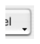
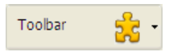

## Rota de acesso ao Fundo

Define o caminho da imagem que será desenhada no fundo do objeto. Se o objeto utilizar um [ícone ](#picture-pathname) com [estados diferentes](#number-of-states), a imagem de fundo suportará automaticamente o mesmo número de estados.

O nome do caminho a introduzir é semelhante ao [da propriedade Caminho para imagens estáticas](properties_Picture.md#pathname).

#### Gramática JSON

| Nome                    | Tipo de dados | Valores possíveis                                                                                                     |
| ----------------------- | ------------- | --------------------------------------------------------------------------------------------------------------------- |
| customBackgroundPicture | string        | Caminho relativo na sintaxe POSIX. Deve ser utilizado em conjunto com a opção "Personalizado" da propriedade "Style". |

#### Objectos suportados

[Botão personalizado](button_overview.md#custom) - [Caixa de verificação personalizada](checkbox_overview.md#custom) - [Botão rádio personalizado](radio_overview.md#custom)

---

## Estilo de botão

Aspeto geral do botão. O estilo do botão também desempenha um papel na disponibilidade de determinadas opções.

#### Gramática JSON

| Nome  | Tipo de dados | Valores possíveis                                                                                                                                                  |
|:-----:|:-------------:| ------------------------------------------------------------------------------------------------------------------------------------------------------------------ |
| style |     text      | "regular", "flat", "toolbar", "bevel", "roundedBevel", "gradientBevel", "texturedBevel", "office", "help", "circular", "disclosure", "roundedDisclosure", "custom" |

#### Objectos suportados

[Botão](button_overview.md) - [Botão rádio](radio_overview.md) - [Caixa de verificação](checkbox_overview.md) - [Botão rádio](radio_overview.md)

---

## Margem horizontal

Esta propriedade permite definir o tamanho (em píxeis) das margens horizontais do botão. Esta margem delimita a área que o ícone e o título do botão não devem ultrapassar.

Este parâmetro é útil, por exemplo, quando a imagem de fundo contém contornos:

| Com / Sem               | Exemplo                                                      |
| ----------------------- | ------------------------------------------------------------ |
| Sem margem              |  |
| Com margem de 13 píxeis |  |
> Esta propriedade funciona em conjunto com a propriedade [Margem vertical](#vertical-margin).

#### Gramática JSON

| Nome          | Tipo de dados | Valores possíveis                                     |
| ------------- | ------------- | ----------------------------------------------------- |
| customBorderX | number        | Para utilizar com o estilo "personalizado". Mínimo: 0 |

#### Objectos suportados

[Botão personalizado](button_overview.md#custom) - [Caixa de verificação personalizada](checkbox_overview.md#custom) - [Botão rádio personalizado](radio_overview.md#custom)

---

## Localização do ícone

Designa a colocação de um ícone em relação ao objeto formulário.

#### Gramática JSON

| Nome          | Tipo de dados | Valores possíveis       |
| ------------- | ------------- | ----------------------- |
| iconPlacement | string        | "none", "left", "right" |

#### Objectos suportados

[Cabeçalho do List Box](listbox_overview.md#list-box-headers)

---

## Offset do ícone

Define um valor de desvio personalizado em pixeis, que será utilizado quando se clica no botão

O título do botão será deslocado para a direita e para baixo em função do número de pixeis introduzidos. Isto permite aplicar um efeito 3D personalizado quando o botão é clicado.

#### Gramática JSON

| Nome         | Tipo de dados | Valores possíveis |
| ------------ | ------------- | ----------------- |
| customOffset | number        | mínimo: 0         |

#### Objectos suportados

[Botão personalizado](button_overview.md#custom) - [Caixa de verificação personalizada](checkbox_overview.md#custom) - [Botão rádio personalizado](radio_overview.md#custom)

---

## Número de estados

Esta propriedade define o número exato de estados presentes na imagem utilizada como ícone para um [botão com ícone](button_overview.md), uma [caixa de verificação](checkbox_overview.md) ou um [botão radio](radio_overview.md) personalizado.

A imagem pode conter de 2 a 6 estados.

- 2 estados: false, true
- 3 estados: false, true, rollover,
- 4 estados: false, true, rollover, desativado,
- 5 estados (apenas para caixas de verificação e botões rádio): false, true, false rollover, true rollover, desativado
- 6 estados (apenas para caixas de verificação e botões rádio): false, true, false rollover, true rollover, false desativado, true disable.

:::note

- "false" significa que o botão não foi clicado/não foi selecionado ou que a caixa de seleção não foi marcada (valor da variável=0)
- "true" significa botão clicado/selecionado ou caixa de seleção verificada (variável valor=1)

:::

Cada estado é representado por uma imagem diferente. Na imagem de origem, os estados devem ser empilhados verticalmente:

#### Gramática JSON

| Nome       | Tipo de dados | Valores possíveis                               |
| ---------- | ------------- | ----------------------------------------------- |
| iconFrames | number        | Número de estados na imagem do ícone. Mínimo: 1 |

#### Objectos suportados

[Botão](button_overview.md) (todos os estilos exceto [Ajuda](button_overview.md#help)) - [Caixa de verificação](checkbox_overview.md) - [Botão rádio](radio_overview.md)

---

## Caminho da imagem

Define o caminho da imagem que será utilizada como ícone para o objeto.

O nome do caminho a introduzir é semelhante ao [da propriedade Caminho para imagens estáticas](properties_Picture.md#pathname).

> Quando utilizada como ícone para objetos ativos, a imagem deve ser concebida para suportar [um número de estados](#number-of-states) variável.

#### Gramática JSON

| Nome | Tipo de dados | Valores possíveis                                |
| ---- | ------------- | ------------------------------------------------ |
| icon | picture       | Caminho relativo ou filesystem na sintaxe POSIX. |

#### Objectos suportados

[Botão](button_overview.md) (todos os estilos exceto [Ajuda](button_overview.md#help)) - [Caixa de verificação](checkbox_overview.md) - [Cabeçalho da caixa de listagem](listbox_overview.md#list-box-headers) - [Botão rádio](radio_overview.md)

---

## Posição título/Imagem

Esta propriedade permite modificar a localização relativa do título do botão em relação ao ícone associado. Esta propriedade não tem efeito quando o botão contém apenas um título (sem imagem associada) ou uma imagem (sem título). Por predefinição, quando um botão contém um título e uma imagem, o texto é colocado por baixo da imagem.

Aqui estão os resultados utilizando as várias opções para esta propriedade:

| Opção        | Descrição                                                                                                                             | Exemplo                                                           |
| ------------ | ------------------------------------------------------------------------------------------------------------------------------------- | ----------------------------------------------------------------- |
| **Direita**  | O texto é colocado à esquerda do ícone. O conteúdo do botão é alinhado à direita.                                                     |   |
| **Topo**     | O texto é colocado por cima do ícone. O conteúdo do botão é centrado.                                                                 |       |
| **Esquerda** | O texto é colocado à direita do ícone. O conteúdo do botão é alinhado à esquerda.                                                     |     |
| **Fundo**    | O texto é colocado por baixo do ícone. O conteúdo do botão é centrado.                                                                |    |
| **Centrado** | O texto do ícone é centrado vertical e horizontalmente no botão. Este parâmetro é útil, por exemplo, para o texto incluído num ícone. |  |

#### Gramática JSON

| Nome          | Tipo de dados | Valores possíveis                          |
| ------------- | ------------- | ------------------------------------------ |
| textPlacement | string        | "left", "top", "right", "bottom", "center" |

#### Objectos suportados

[Botão](button_overview.md) (todos os estilos exceto [Ajuda](button_overview.md#help)) - [Caixa de verificação](checkbox_overview.md) - [Botão rádio](radio_overview.md)

---

## Image hugs title

Esta propriedade permite-lhe definir se o título e a imagem do botão devem ser visualmente adjacentes ou separados, conforme as propriedades [Posição do título/da imagem](#titlepicture-position) e [Alinhamento horizontal](#horizontal-alignment).

Esta propriedade não tem efeito quando o botão contém apenas um título (sem imagem associada) ou uma imagem (sem título).

Por padrão, quando um botão contém um título e uma imagem, os elementos são unidos. O gráfico a seguir mostra o efeito da propriedade `imageHugsTitle` (verdadeira quando a propriedade está ativada) com diferentes alinhamentos de botões:

#### Gramática JSON

| Nome           | Tipo de dados | Valores possíveis    |
| -------------- | ------------- | -------------------- |
| imageHugsTitle | boolean       | true (padrão), false |

#### Objectos suportados

[Botão](button_overview.md) (todos os estilos, exceto Ajuda) - [Caixa de seleção](checkbox_overview.md) (todos os estilos, exceto Regular, Plano, Divulgação e Recolher/Expandir) - [Botão de rádio](radio_overview.md) (todos os estilos, exceto Regular, Plano, Divulgação e Recolher/Expandir).

---

## Margem vertical

Esta propriedade permite definir o tamanho (em pixels) das margens verticais do botão. Esta margem delimita a área que o ícone e o título do botão não devem ultrapassar.

Este parâmetro é útil, por exemplo, quando a imagem de fundo contém contornos.

> Essa propriedade funciona em conjunto com a propriedade [Horizontal Margin (Margem horizontal](#horizontal-margin) ).

#### Gramática JSON

| Nome          | Tipo de dados | Valores possíveis                                     |
| ------------- | ------------- | ----------------------------------------------------- |
| customBorderY | number        | Para utilizar com o estilo "personalizado". Mínimo: 0 |

#### Objectos suportados

[Botão personalizado](button_overview.md#custom) - [Caixa de verificação personalizada](checkbox_overview.md#custom) - [Botão rádio personalizado](radio_overview.md#custom)

---

## Com menu pop-up

Esta propriedade permite exibir um símbolo que aparece como um triângulo no botão para indicar a presença de um menu pop-up anexado:

A aparência e o local desse símbolo dependem do estilo do botão e da plataforma atual.

### Ligados e Separados

Para anexar um símbolo de menu pop-up a um botão, há duas opções de exibição disponíveis:

|                         Linked                          |                          Separado                          |
|:-------------------------------------------------------:|:----------------------------------------------------------:|
|  |  |
> A disponibilidade real de um modo "separado" depende do estilo do botão e da plataforma.

Cada opção especifica a relação entre o botão e o menu pop-up anexado:

- Quando o menu pop-up é **separado**, clicar na parte esquerda do botão executa diretamente a ação atual do botão; essa ação pode ser modificada usando o menu pop-up acessível na parte direita do botão.
- Quando o menu pop-up está **vinculado**, um simples clique no botão exibe apenas o menu pop-up. Somente a seleção da ação no menu pop-up causa sua execução.

:::info

Consulte a [descrição do evento`On Alternative Click`](../Events/onAlternativeClick.md) para obter mais informações sobre o tratamento de eventos nesse caso.

:::

### Gerir o menu pop-up

É importante observar que a propriedade "With Pop-up Menu" gerencia apenas o aspecto gráfico do botão. A exibição do menu pop-up e seus valores devem ser tratados inteiramente pelo desenvolvedor, principalmente por meio de `eventos de formulário` e da função [`Menu pop-up dinâmico`](https://doc.4d.com/4dv19R7/help/command/en/page1006.html) e [`Menu pop-up`](https://doc.4d.com/4dv19R7/help/command/en/page542.html) e menu pop-up.

#### Gramática JSON

| Nome           | Tipo de dados | Valores possíveis                                                           |
|:-------------- | ------------- | --------------------------------------------------------------------------- |
| popupPlacement | string        | <li>"none"</li><li>"linked"</li><li>"separated"</li> |

#### Objectos suportados

[Botão da barra de ferramentas](button_overview.md#toolbar) - [Botão](button_overview.md#bevel) [chanfrado - Botão chanfrado arredondado](button_overview.md#rounded-bevel) - [Botão de gradiente do OS X](button_overview.md#os-x-gradient) - [Botão texturizado do OS X](button_overview.md#os-x-textured) - [Botão do Office XP](button_overview.md#office-xp) - [Botão de círculo](button_overview.md#circle) - [Personalizado](button_overview.md#custom)
