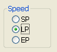
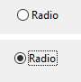
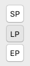

Os botões rádio são objetos que permitem que o usuário selecione um de um grupo de botões.

Um botão radio aparece na forma de um texto seguido de um círculo. Entretanto, os botões de rádio podem ter <a href=“#button-styles”>aparências diferentes</a>.

É selecionado um botão rádio:
- quando o usuário clica nele
- quando tem o foco e o usuário pressiona a tecla **Barra de Espaço**.

## Configuração de botões radio

Os botões rádio são usados em conjuntos coordenados: somente um botão de cada vez pode ser selecionado no conjunto. Para operar de forma coordenada, um conjunto de botões de rádio deve compartilhar a mesma propriedade [Grupo Rádio](properties_Object.md#radio-group).

Os botões rádio são controlados com métodos. Como todos os botões, um botão de rádio é definido como 0 quando o formulário é aberto pela primeira vez. Um método associado a um botão de rádio é executado quando o botão é selecionado. A seguir, um exemplo de um grupo de botões de rádio usados em um banco de dados de coleção de vídeos para inserir a velocidade da gravação (SP, LP ou EP):

A seleção de um botão de rádio em um grupo define esse botão como 1 e todos os outros no grupo como 0. Só pode ser selecionado um botão rádio de cada vez.
> Você pode associar [expressões boolianas](properties_Object.md#variable-or-expression) a botões rádio. Nesse caso, quando um botão de opção em um grupo é selecionado, sua variável é True e as variáveis dos outros botões de opção do grupo são False.

O valor contido em um objeto de botão de opção não é salvo automaticamente (exceto se for a representação de um campo booliano); os valores dos botões de opção devem ser armazenados em suas variáveis e gerenciados com métodos.

## Estilos de botões

[Os estilos de botão](properties_TextAndPicture.md#button-style) rádio controlam a aparência geral do botão rádio, bem como suas propriedades disponíveis. É possível aplicar diferentes estilos predefinidos aos botões rádio. No entanto, o mesmo estilo de botão deve ser aplicado a todos os botões rádio em um grupo para que eles funcionem como esperado.

4D fornece botões rádio nos seguintes estilos predefinidos:

### Clássico

O estilo de botão rádio Regular é um botão sistema padrão *(ou seja,* um pequeno alvo com texto) que executa o código quando o usuário clica nele.

Além de iniciar a execução do código, o estilo do botão de opção Regular muda a cor do bullsey ao passar o mouse.

### Plano

O estilo de botão rádio plano é um botão sistema padrão *(ou seja,* um pequeno alvo com texto) que executa o código quando o usuário clica nele.

Por padrão, o estilo Plano tem um aspeto minimalista. A natureza gráfica do estilo Plano é especialmente útil para os formulários que vão ser impressos.

### Barra de ferramentas

O estilo de botão rádio está pensado principalmente para sua integração em uma barra de ferramentas.

Por padrão, o estilo da barra de ferramentas tem um fundo transparente com um rótulo no centro. A aparência do botão pode ser diferente quando o cursor passar por cima dele, dependendo do SO:

 - *Windows* - o botão é realçado.

 - *macOS* - o destaque do botão nunca aparece.

### Bevel

O estilo de botão rádio Bevel é semelhante ao comportamento do estilo [Barra de ferramentas](#toolbar), exceto pelo fato de ter um fundo cinza-claro e um contorno cinza. A aparência do botão pode ser diferente quando o cursor passar por cima dele, dependendo do SO:

 - *Windows* - o botão é realçado.

  

 - *macOS* - o destaque do botão nunca aparece.

### Bevel arredondado

O estilo de botão Bevel arredondado é quase idêntico ao estilo [Bevel](#bevel), exceto que, dependendo do sistema operativo, as esquinas do botão podem ser arredondadas.

 - *Windows* - o botão é idêntico ao estilo [Bevel](#bevel).

 - *macOS* - os cantos do botão são arredondados. 

### OS X Gradient

O estilo de botão OS X Gradient é quase idêntico ao estilo [Bevel](#bevel), exceto pelo fato de que, dependendo do sistema operacional, ele pode ter uma aparência de dois tons.

 - *Windows* - o botão é idêntico ao estilo [Bevel](#bevel).

 - *macOS* - o botão é exibido como um botão de sistema de dois tons.

### OS X Texturizado

O estilo de botão rádio OS X Textured é quase idêntico ao estilo [Barra de ferramentas](#toolbar), exceto, dependendo do SO, ele pode ter uma aparência diferente e não mostra o mouse.

Como padrão, o estilo OS X Textured aparece como:

 - *Windows* - um botão como uma barra de ferramentas com um rótulo no centro e o plano de fundo é sempre exibido.

 - *macOS* - - um botão sistema padrão que mostra uma mudança de cor cinza claro a cinza escuro. Sua altura está predefinida: não é possível ampliar ou reduzir.

  

### Office XP

O estilo de botão Office XP combina a aparência de estilo [Clássico](#regular) com o comportamento de estilo [Barra de ferramentas](#toolbar).

As cores (ressaltado e fundo) de um botão com o estilo Office XP são baseadas nos sistemas de cores. A aparência do botão pode ser diferente quando o cursor passar por cima dele, dependendo do SO:

 - *Windows* - seu fundo só aparece quando o mouse passa por cima.

  

 - *macOS* - seu fundo é sempre mostrado.

### Contrair/expandir

Este estilo de botão pode ser utilizado para adicionar um ícone padrão contracter/déployer. Esses botões são usados nativamente em listas hierárquicas. Esses botões são usados nativamente em listas hierárquicas.

:::info

O estilo Contrair/Expandir tem o nome "disclosure" na [gramática JSON do estilo de botão](properties_TextAndPicture.md#button-style).

:::

### Botão disclosure

O estilo do botão divulgação exibe o botão rádio como um botão de divulgação padrão, normalmente usado para mostrar/ocultar informações adicionais. O símbolo do botão aponta para baixo com o valor 0 e para cima com o valor 1.

:::info

O estilo Disclosure tem o nome "roundedDisclosure" na [gramática JSON do estilo de botão](properties_TextAndPicture.md#button-style).

:::

### Personalizado

O estilo de botão rádio Personalizado aceita uma imagem de fundo personalizada e permite o gerenciamento de parâmetros adicionais, como [deslocamento do ícone](properties_TextAndPicture.md#icon-offset) e [margens](properties_TextAndPicture.md#horizontal-margin).

## Propriedades compatíveis

Todos os botões rádio partilham o mesmo conjunto de propriedades básicas:

[Negrito](properties_Text.md#bold) - [Inferior](properties_CoordinatesAndSizing.md#bottom) - [Estilo do botão](properties_TextAndPicture.md#button-style) - [Classe](properties_Object.md#css-class) - [Tipo de expressão](properties_Object.md#expression-type) - [Focalizável](properties_Entry.md#focusable) - [Fonte](properties_Text.md#font) - [Cor da fonte](properties_Text.md#font-color) - [Altura](properties_CoordinatesAndSizing.md#height) - [Dica de ajuda](properties_Help.md#help-tip) - [Alinhamento horizontal](properties_Text.md#horizontal-alignment)(1) - [Dimensionamento horizontal](properties_ResizingOptions.md#horizontal-sizing) - [Título dos abraços da imagem](properties_TextAndPicture.md#image-hugs-title)(2) - [Itálico](properties_Text.md#italic) - [Esquerda](properties_CoordinatesAndSizing.md#left) - [Número de estados](properties_TextAndPicture.md#number-of-states)(2) - [Método](properties_Action.md#method) - [Nome do objeto](properties_Object.md#object-name) - [Grupo de rádios](properties_Object.md#radio-group) - [Nome do caminho da imagem](properties_TextAndPicture.md#picture-pathname)(2) - [Direita](properties_CoordinatesAndSizing.md#right) - [Salvar valor](properties_Object.md#save-value) - [Atalho](properties_Entry.md#shortcut) - [Título](properties_Object.md#title) - [Posição do título/da imagem](properties_TextAndPicture.md#titlepicture-position)(2) - [Superior](properties_CoordinatesAndSizing.md#top) - [Tipo](properties_Object.md#type) - [Sublinhado](properties_Text.md#underline) - [Variável ou expressão](properties_Object.md#variable-or-expression) - [Dimensionamento vertical](properties_ResizingOptions.md#vertical-sizing) - [Visibilidade](properties_Display.md#visibility) - [Largura](properties_CoordinatesAndSizing.md#width)

> (1) Not supported by the [Regular](#regular) and [Flat](#flat) styles.  (2) Not supported by the [Regular](#regular), [Flat](#flat), [Disclosure](#disclosure) and [Collapse/Expand](#collapseexpand) styles.

Propriedades específicas adicionais estão disponíveis dependendo do [estilo botão](#button-styles):

- Personalizado: [Nome do caminho do plano de fundo](properties_TextAndPicture.md#background-pathname) - [Margem horizontal](properties_TextAndPicture.md#horizontal-margin) - [Deslocamento do ícone](properties_TextAndPicture.md#icon-offset) - [Margem vertical](properties_TextAndPicture.md#vertical-margin)