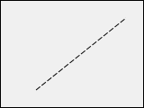

As formas são [objectos estáticos](formObjects_overview.md#active-and-static-objects) que podem ser adicionados a formas 4D.

As formas 4D suportam as seguintes formas básicas:

- retângulos
- linhas
- ovals


## Retângulo

Um retângulo estático é um objeto decorativo para os formulários. Os rectângulos são limitados a formas quadradas.

O desenho dos retângulos é controlado através de muitas propriedades (cor, espessura da linha, padrão, etc.). Especificamente, a [circularidade](properties_CoordinatesAndSizing.md#corner-radius) dos seus cantos pode ser definida.


#### Exemplo JSON:

```4d
    "myRectangle": {
  "type": "rectangle", //define the type of object
  "left": 60,    //left position on the form  
  "top": 160,    //top position on the form 
  "width": 100,   //width of the object
  "height": 20,   //height of the object
  "borderRadius": 20  //define the roundness of the corners
                }
```


#### Propriedades compatíveis
[Inferior](properties_CoordinatesAndSizing.md#bottom) - [Classe](properties_Object.md#css-class) - [Raio do canto](properties_CoordinatesAndSizing.md#corner-radius) - [Tipo de linha pontilhada](properties_BackgroundAndBorder.md#dotted-line-type) - [Cor de preenchimento](properties_BackgroundAndBorder.md#background-color--fill-color) - [Altura](properties_CoordinatesAndSizing.md#height) - [Dimensionamento horizontal](properties_ResizingOptions.md#horizontal-sizing) - [Esquerda](properties_CoordinatesAndSizing.md#left) - [Cor da linha](properties_BackgroundAndBorder.md#line-color) - [Largura da linha](properties_BackgroundAndBorder.md#line-width) - [Nome do objeto](properties_Object.md#object-name) - [Direita](properties_CoordinatesAndSizing.md#right) - [Superior](properties_CoordinatesAndSizing.md#top) - [Tipo](properties_Object.md#type) - [Dimensionamento vertical](properties_ResizingOptions.md#vertical-sizing) - [Visibilidade](properties_Display.md#visibility) - [Largura](properties_CoordinatesAndSizing.md#width)

## Linha

Uma linha estática é um objeto decorativo para os formulários, desenhado entre duas tramas. As linhas podem ser horizontais, verticais ou de qualquer forma angular.

O desenho das linhas é controlado através de muitas propriedades (cor, espessura da linha, etc.).


### propriedade startPoint
A propriedade JSON `startPoint` define a coordenada a partir da qual a linha deve ser desenhada (ver exemplo).

> a propriedade `startPoint` não está exposta na Lista de Propriedades, onde a direção do desenho da linha é visível.


#### Exemplos JSON

```
    "myLine": {
  "type": "line",                
  "left": 20,
  "top": 40,
  "width": 100,
  "height": 80,
  "startPoint": "topLeft", //first direction
  "strokeDashArray": "6 2" //dashed
  }
```
Result: 


```
    "myLine": {
  "type": "line",                
  "left": 20,
  "top": 40,
  "width": 100,
  "height": 80,
  "startPoint": "bottomLeft", //2nd direction
  "strokeDashArray": "6 2" //dashed
  }
```
Result: 


#### Propriedades compatíveis
[Inferior](properties_CoordinatesAndSizing.md#bottom) - [Classe](properties_Object.md#css-class) - [Tipo de linha pontilhada](properties_BackgroundAndBorder.md#dotted-line-type) - [Altura](properties_CoordinatesAndSizing.md#height) - [Tamanho Horizontal](properties_ResizingOptions.md#horizontal-sizing) - [Izquerda](properties_CoordinatesAndSizing.md#left) - [Cor da linha](properties_BackgroundAndBorder.md#line-color) - [Largura da linha](properties_BackgroundAndBorder.md#line-width) - [Nome do objeto](properties_Object.md#object-name) - [Certo](properties_CoordinatesAndSizing.md#right) - [startPoint](#startpoint-property) - [Topo](properties_CoordinatesAndSizing.md#top) - [Tipo](properties_Object.md#type) - [Dimensionamento vertical](properties_ResizingOptions.md#vertical-sizing) - [Visibilidade](properties_Display.md#visibility) - [Largura](properties_CoordinatesAndSizing.md#width)

## Oval

Uma oval estática é um objeto decorativo para formas. Os objetos ovais podem ser usados para desenhar formas circulares (quando as propriedades de [largura](properties_CoordinatesAndSizing.md#width) e [altura](properties_CoordinatesAndSizing.md#height) são iguais).


#### Exemplo JSON:

```4d
    "myOval": {
  "type": "oval",  //define the type of object
  "left": 60,   //left position on the form  
  "top": 160,   //top position on the form 
  "width": 100,  //width of the object
  "height": 20,  //height of the object
  "fill": "blue"  //define the background color
                }
```


#### Propriedades compatíveis
[Inferior](properties_CoordinatesAndSizing.md#bottom) - [Classe](properties_Object.md#css-class) - [Tipo de linha pontilhada](properties_BackgroundAndBorder.md#dotted-line-type) - [Cor de preenchimento](properties_BackgroundAndBorder.md#background-color--fill-color) - [Altura](properties_CoordinatesAndSizing.md#height) - [Dimensionamento horizontal](properties_ResizingOptions.md#horizontal-sizing) - [Esquerda](properties_CoordinatesAndSizing.md#left) - [Cor da linha](properties_BackgroundAndBorder.md#line-color) - [Largura da linha](properties_BackgroundAndBorder.md#line-width) - [Nome do objeto](properties_Object.md#object-name) - [Direita](properties_CoordinatesAndSizing.md#right) - [Superior](properties_CoordinatesAndSizing.md#top) - [Tipo](properties_Object.md#type) - [Dimensionamento vertical](properties_ResizingOptions.md#vertical-sizing) - [Visibilidade](properties_Display.md#visibility) - [Largura](properties_CoordinatesAndSizing.md#width) 