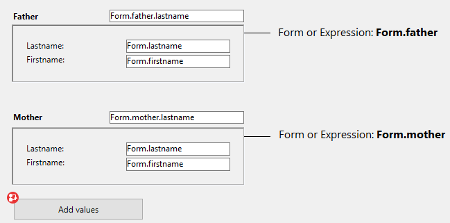

Um subformulário é um formulário incluído noutro formulário.


## Terminologia

Para definir claramente os conceitos implementados com subformulários, aqui estão algumas definições para certos termos utilizados:

*   **Subformulário**: um formulário destinado a ser incluído em outro formulário, ele próprio chamado de formulário pai.
*   **Formulário pai**: um formulário que contém um ou mais subformulários.
*   **Contêiner de sub**formulário: um objeto incluído no formulário pai, que exibe uma instância do subformulário.
*   **Instância de sub**formulário: a representação de um subformulário em um formulário pai. Esse conceito é importante porque é possível exibir várias instâncias do mesmo subformulário em um formulário pai.
*   **Formulário lista**: instância do subformulário exibido como uma lista.
*   **Formulário de detalhes**: formulário de entrada do tipo página associado a um subformulário do tipo lista que pode ser acessado com um clique duplo na lista.


## Sub formulários lista

Um subformulário lista permite que você insira, visualize e modifique dados em outras tabelas. Normalmente, os subformulários de lista são usados em bancos de dados nos quais você estabeleceu relações Um para Muitos. Um subformulário de lista em um formulário em uma tabela One relacionada permite visualizar, inserir e modificar dados em uma tabela Many relacionada. Você pode ter vários subformulários provenientes de tabelas diferentes no mesmo formulário. No entanto, não é possível colocar dois subformulários que pertençam à mesma tabela na mesma página de um formulário.

Por exemplo, um banco de dados do gerenciador de contatos pode usar um subformulário de lista para exibir todos os números de telefone de um determinado contato. Embora os números de telefone apareçam na tela Contatos, as informações são, na verdade, armazenadas em uma tabela relacionada. Usando uma relação de um para muitos, esse design de banco de dados facilita o armazenamento de um número ilimitado de números de telefone por contato. Com as relações automáticas, você pode apoiar a entrada de dados diretamente na tabela Many relacionada sem programação.

Embora os subformulários de lista geralmente estejam associados a muitas tabelas, uma instância de subformulário pode exibir os registros de qualquer outra tabela do banco de dados.

Também é possível permitir que o usuário introduza dados no formulário Lista. Dependendo da configuração do subformulário, o usuário pode exibir o formulário detalhado clicando duas vezes em um subregistro ou usando os comandos para adicionar e editar subregistros.

> 4D oferece três ações padrão para atender às necessidades básicas de gerenciamento de sub-registros: `Editar Subregistro`, `Excluir Subregistro` e `Adicionar Subregistro`. Quando o formulário incluir várias instâncias de subformulários, a ação será aplicada ao subformulário que tiver o foco.


## Subformulários em página

Os subformulários de página podem exibir os dados do subregistro atual ou qualquer tipo de valor pertinente, dependendo do contexto (variáveis, figuras etc.). Uma das principais vantagens do uso de subformulários de página é que eles podem incluir funcionalidades avançadas e interagir diretamente com o formulário pai (widgets). Os subformulários de página também têm suas próprias propriedades e eventos específicos; você pode gerenciá-los inteiramente por meio de programação.

O subformulário de página usa o formulário de entrada indicado pela propriedade [Detail Form](properties_Subform.md#detail-form). Ao contrário de um subformulário de lista, o formulário usado pode vir da mesma tabela que o formulário pai. Também é possível usar um formulário de projeto. Quando executado, um subformulário de página tem as mesmas características de exibição padrão de um formulário de entrada.

> Os widgets 4D são objetos compostos predefinidos com base em subformulários de página. They are described in detail in a separate manual, [4D Widgets](https://doc.4d.com/4Dv17R6/4D/17-R6/4D-Widgets.100-4465257.en.html).


### Utilizar a variável ou expressão ligada

É possível vincular [uma variável ou uma expressão](properties_Object.md#variable-or-expression) a um objeto de contêiner de subformulário. Isso é muito útil para sincronizar valores do formulário principal e de seus subformulários.

Por padrão, o 4D cria uma variável ou expressão de [tipo objeto](properties_Object.md#expression-type) para um contêiner de subformulário, o que permite compartilhar valores no contexto do subformulário usando o comando `Form` ([veja abaixo](#using-the-subform-bound-object)). For example, imagine a subform representing a dynamic clock, inserted into a parent form containing an enterable variable of the Time type:

- Defina uma variável ou expressão vinculada de um tipo escalar e chame os comandos `OBJECT Get subform container value` e `OBJECT SET SUBFORM CONTAINER VALUE` para trocar valores quando ocorrerem eventos de formulário [On Bound Variable Change](../Events/onBoundVariableChange.md) ou [On Data Change](../Events/onDataChange.md). Esta solução é recomendada para sincronizar um único valor.
- Defina uma variável ou expressão vinculada do tipo de **objeto** e use o comando `Form` para acessar suas propriedades no subformulário. Esta solução é recomendada para sincronizar vários valores.


### Sincronização do formulário principal e do subformulário (valor único)

A vinculação da mesma variável ou expressão ao contêiner do subformulário e a outros objetos do formulário pai permite vincular os contextos do formulário pai e do subformulário para dar os toques finais em interfaces sofisticadas. Imagine um subformulário que contém um relógio que exibe uma hora estática, inserido em um formulário pai que contém uma [área de entrada](input_overview.md):


No formulário pai, ambos os objetos (área de entrada e contêiner de subformulário) ***possuem o mesmo valor que ***Variável ou Expressão******. Pode ser uma variável (por exemplo, `parisTime`) ou uma expressão (por exemplo, `Form.parisTime`).

:::info

Para exibir uma hora estática, você deve usar o [tipo de dados](properties_DataSource.md#data-type-expression-type) apropriado para a [variável ou expressão](properties_Object.md#variable-or-expression):

- Se você usar uma variável (por exemplo, `parisTime`), ela deverá ser do tipo `texto` ou `hora`.
- Se você usar uma expressão (por exemplo, `Form.myValue`), ela deverá conter um valor `de texto`.

O valor do texto deve ter o formato "hh:mm:ss".

:::

No subformulário, o objeto do relógio é gerenciado através da propriedade `Form.clockValue`.


#### Atualização do conteúdo de um subformulário

Caso 1: O valor da variável da forma pai ou expressão é modificado e essa modificação deve ser passado para um subformulário.

`parisTime` ou `Form.parisTime` muda para "12:15:00" no formulário pai, seja porque o usuário o inseriu ou porque foi atualizado dinamicamente (por meio da instrução `String(Current time)`, por exemplo). Isso aciona o evento [On Bound Variable Change](../Events/onBoundVariableChange.md) no método Form do subformulário.

O seguinte código é executado:

```4d  
// Método de formulário de subformulário
If (Form event code=On Bound Variable Change) //variável ou expressão vinculada foi modificada no formulário pai
    Form.clockValue:=OBJECT Obter valor do contêiner do subformulário //sincronizar o valor local
End if
```

Ele atualiza o valor de `Form.clockValue` no subformulário:


O evento de formulário [On Bound Variable Change](../Events/onBoundVariableChange.md) é gerado:

- assim que um valor for atribuído à variável/expressão do formulário pai, mesmo que o mesmo valor seja reatribuído
- se o subformulário pertence à página formulário atual ou à página 0.

Observe que, como no exemplo acima, é preferível usar o comando `OBJECT Get valor do contêiner de subformulário` que retorna o valor da expressão no contêiner de subformulário em vez da própria expressão porque é possível inserir vários subformulários no mesmo formulário pai (por exemplo, uma janela que exibe diferentes fusos horários contém vários relógios).

Modificar a variável ou expressão vinculada aciona eventos de formulário que permitem sincronizar os valores do formulário pai e do subformulário:

- Use o evento de formulário [On Bound Variable Change](../Events/onBoundVariableChange.md) para indicar ao subformulário (método de formulário do subformulário) que a variável ou expressão foi modificada no formulário pai.
- Use do evento de formulário [On Data Change](../Events/onDataChange.md) para indicar ao contêiner do subformulário que o valor da variável ou expressão foi modificado no subformulário.


#### Atualização do conteúdo de um formulário pai

Caso 2: o conteúdo do subformulário é modificado e esta modificação deve ser transmitida ao formulário principal.

Dentro do subformulário, o botão altera o valor da expressão `Form.clockValue` do tipo Texto, associada ao objeto relógio. Isso aciona o evento de formulário [On Data Change](../Events/onDataChange.md) dentro do objeto de relógio (esse evento deve ser selecionado para o objeto), que atualiza o valor `Form.parisTime` no formulário principal.

O seguinte código é executado:

```4d  
// método do objeto de relógio do subformulário
If (Form event code=On Data Change) //qualquer que seja a forma como o valor é alterado
    OBJECT SET SUBFORM CONTAINER VALUE(Form.clockValue) //Push the value to the container
End if
```


Sempre que o valor de `Form.clockValue` muda no subformulário, `parisTime` ou `Form.parisTime` no contêiner do subformulário também é atualizado.


> Se o valor da variável ou expressão é definido em vários locais, o 4D usa o valor que foi carregado por último. Ele aplica a seguinte ordem de carregamento: 1 - Métodos de objeto do subformulário, 2 - Método de formulário do subformulário, 3 - Métodos de objeto do formulário pai, 4 - Método de formulário do formulário pai


### Sincronização formulário principal e do subformulário (valores múltiplos)

Por padrão, 4D vincula uma variável ou expressão de [tipo de objeto](properties_Object.md#expression-type) a cada subformulário. O conteúdo desse objeto pode ser lido e/ou modificado a partir do formulário pai e do subformulário, o que permite compartilhar vários valores em um contexto local.

Quando vinculado ao contêiner do subformulário, esse objeto é retornado pelo comando `Form` diretamente no subformulário. Como os objetos são sempre passados por referência, se o usuário modificar o valor de uma propriedade no subformulário, ele será automaticamente salvo no próprio objeto e, portanto, estará disponível para o formulário pai. Por outro lado, se uma propriedade do objeto for modificada pelo usuário no formulário pai ou por programação, ela será automaticamente atualizada no subformulário. Não é necessária qualquer gestão de eventos.

Por exemplo, em um subformulário, os inputs são vinculados às propriedades do objeto `Form` (do subformulário):


No formulário pai, o subformulário é apresentado duas vezes. Cada contêiner de subformulário é vinculado a uma expressão que é uma propriedade do objeto `Form` (do formulário pai):



O botão apenas cria as propriedades `mãe` e `pai` no objeto `Form` do pai:

```4d
//Método de objeto do botão Adicionar valores
Form.mother:=New object("lastname"; "Hotel"; "firstname"; "Anne")
Form.father:=New object("lastname"; "Golf"; "firstname"; "Félix")
```

Quando você executa o formulário e clica no botão, você vê que todos os valores são exibidos corretamente:


Se você modificar um valor tanto no formulário principal quanto no subformulário, ele será automaticamente atualizado no outro formulário porque o mesmo objeto é utilizado:

 

### Utilização de ponteiros (compatibilidade)

Em versões anteriores à 4D v19 R5, a sincronização entre formulários e subformas pai foi realizada através do **ponteiros**. Por exemplo, para atualizar um objeto subformulário, você pode chamar o seguinte código:

```4d  
// Método do formulário de subformulário
Se (Código do evento do formulário=On Bound Variable Change) 
    ptr:=OBJECT Get pointer(Object subform container) 
    clockValue:=ptr-> 
Fim se
```

**Este princípio ainda é suportado para compatibilidade, mas agora está obsoleto, pois não permite expressões de ligação a subformulários.** Não deve mais ser usado em seus desenvolvimentos. Em qualquer caso, recomendamos usar o [`Comando Formulário`](#synchronizing-parent-form-and-subform-multiple-values) ou os [`Comando OBJECT GET SUBFORM CONTAINER VALUE` e `Comando OBJECT SET SUBFORM CONTAINER VALUE`](#synchronizing-parent-form-and-subform-single-value) para sincronizar os valores do formulário e subformulário.


### Programação entre formulários avançada

A comunicação entre o formulário pai e as instâncias do subformulário pode exigir mais do que a troca de valores por meio da variável vinculada. Na verdade, você pode querer atualizar as variáveis nos subformulários de acordo com as ações realizadas no formulário principal e vice-versa. Se usarmos o exemplo anterior do subformulário do tipo "relógio dinâmico", podemos querer definir um ou mais horários de alarme para cada relógio.

4D implementou os seguintes mecanismos para atender a essas necessidades:

- Chamada de um objeto contêiner a partir do subformulário usando o comando `CALL SUBFORM CONTAINER`
- Execução de um método no contexto do subformulário por meio do comando `EXECUTE METHOD IN SUBFORM`

> O comando `GOTO OBJECT` procura o objeto de destino no formulário pai, mesmo que seja executado em um subformulário.


#### Comando CALL SUBFORM CONTAINER

O comando `CALL SUBFORM CONTAINER` permite que uma instância de subformulário envie um [evento](../Events/overview.md) para o objeto contêiner de subformulário, que pode então processá-lo no contexto do formulário pai. O evento é recebido no método do objeto contentor. Ele pode estar na origem de qualquer evento detectado pelo subformulário (clique, arrastar e soltar etc.).

O código do evento não tem restrições (por exemplo, 20000 ou -100). Você pode usar um código que corresponda a um evento existente (por exemplo, 3 para `On Validate`), ou usar um código personalizado. No primeiro caso, você só pode usar eventos que você verificou na Lista de Propriedades para sub-formulários. No segundo caso, o código não deve corresponder a nenhum evento de formulário existente. Recomenda-se usar um valor negativo para ter certeza de que esse código não será usado por 4D em versões futuras.

Para obter mais informações, consulte a descrição do comando `CALL SUBFORM CONTAINER`.

#### Comando EXECUTE METHOD IN SUBFORM

O comando `EXECUTE METHOD IN SUBFORM` permite que um formulário ou um de seus objetos solicite a execução de um método no contexto da instância do subformulário, o que lhe dá acesso às variáveis do subformulário, objetos, etc. Este método também pode receber parâmetros.

Este mecanismo é ilustrado no diagrama seguinte:


Para mais informações, consultar a descrição do comando `EXECUTE METHOD IN SUBFORM`.


## Propriedades compatíveis

[Border Line Style](properties_BackgroundAndBorder.md#border-line-style) - [Bottom](properties_CoordinatesAndSizing.md#bottom) - [Class](properties_Object.md#css-class) - [Detail Form](properties_Subform.md#detail-form) - [Double click on empty row](properties_Subform.md#double-click-on-empty-row) - [Double click on row](properties_Subform.md#double-click-on-row) - [Enterable in list](properties_Subform.md#enterable-in-list) - [Expression Type](properties_Object.md#expression-type) - [Focusable](properties_Entry.md#focusable) - [Height](properties_CoordinatesAndSizing.md#height) - [Hide focus rectangle](properties_Appearance.md#hide-focus-rectangle) - [Horizontal Scroll Bar](properties_Appearance.md#horizontal-scroll-bar) - [Horizontal Sizing](properties_ResizingOptions.md#horizontal-sizing) - [Left](properties_CoordinatesAndSizing.md#left) - [List Form](properties_Subform.md#list-form) - [Method](properties_Action.md#method) - [Object Name](properties_Object.md#object-name) - [Print Frame](properties_Print.md#print-frame) - [Right](properties_CoordinatesAndSizing.md#right) - [Selection mode](properties_Subform.md#selection-mode) - [Source](properties_Subform.md#source) - [Top](properties_CoordinatesAndSizing.md#top) - [Type](properties_Object.md#type) - [Variable or Expression](properties_Object.md#variable-or-expression) - [Vertical Scroll Bar](properties_Appearance.md#vertical-scroll-bar) - [Vertical Sizing](properties_ResizingOptions.md#vertical-sizing) - [Visibility](properties_Display.md#visibility) - [Width](properties_CoordinatesAndSizing.md#width) 
