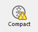

A página de Informação fornece informações sobre os ambientes 4D e sistema, bem como o banco de dados e os arquivos da aplicação. Cada página pode ser exibida usando controles de guia na parte superior da janela.

## Programa

Essa página indica o nome, a versão e o local da aplicação, bem como a pasta 4D ativa (para obter mais informações sobre a pasta 4D ativa, consulte a descrição do comando `Get 4D folder` no manual *Linguagem 4D*).

A parte central da janela indica o nome e local do projeto de bancos de dados e arquivos de dados assim como o arquivo de histórico (se houver). A parte inferior da janela indica o nome do titular da licença 4D, o tipo de licença e o nome de usuário do banco de dados quando ativar as senhas (ou o Designer se não for o caso).

- **Exibição e seleção de nomes de caminho**: na guia **Programa**, os nomes de caminho são exibidos em menus pop-up que contêm a sequência de pastas conforme encontrada no disco:  
   Se você selecionar um item de menu (disco ou pasta), ele será exibido em uma nova janela do sistema. O comando **Copie o caminho** copia o nome completo do caminho como texto para a área de transferência, usando os separadores da plataforma atual.

- **Pasta "Licenses"** O botão **Pasta "Licenses"** exibe o conteúdo da pasta Licenses ativa em uma nova janela do sistema. Todos os arquivos de licença instalados em seu ambiente 4D estão agrupados nessa pasta, em seu disco duro. Quando são abertos com um navegador Web, esses arquivos exibem informações sobre as licenças que contêm e suas características. O local da pasta "Licenses" pode variar conforme a versão do seu sistema operacional. Para obter mais informações sobre a localização desta pasta, consulte o comando `Get 4D folder`. ***Nota:** você também pode acessar esta pasta a partir da caixa de diálogo "Atualizar Licença" (disponível no menu Ajuda).*

## Tabelas

Esta página fornece uma visão geral das tabelas da sua base de dados:

> As informações desta página estão disponíveis nos modos standard e de manutenção.

A página lista todas as tabelas do banco de dados (incluindo tabelas invisíveis), bem como suas características:

- **ID**: número interno da tabela.
- **Tabelas**: nome da tabela. Os nomes das tabelas excluídas são exibidos entre parênteses (se ainda estiverem na lixeira).
- **Registros**: número total de registros na tabela. Se um registro estiver danificado ou não puder ser lido, será exibido *Error* em vez do número. Neste caso, pode considerar a utilização das ferramentas de verificação e reparação.
- **Campos**: número de campos na tabela. Os campos invisíveis são contados, mas os campos apagados não são contados.
- **Indexes**: Número de índices de qualquer tipo na tabela
- **Criptografável**: se marcado, é selecionado o atributo **Encriptable** para a tabela ao nível da estrutura (ver o parágrafo Encriptable no Manual de Design).
- **Criptografado**: se marcada, os registros da tabela serão criptografados no arquivo de dados. ***Nota**: qualquer inconstância entre as opções Criptografável e Criptografado exige que você verifique o estado da criptografia do arquivo de dados na página Criptografar do CSM.*
- **Address Table Size**: Size of the address table for each table. The address table is an internal table which stores one element per record created in the table. Na verdade, associa os registos ao seu endereço físico. For performance reasons, it is not resized when records are deleted, thus its size can be different from the current number of records in the table. If this difference is significant, a data compacting operation with the "Compact address table" option checked can be executed to optimize the address table size (see [Compact](compact.md) page). ***Note:** Differences between address table size and record number can also result from an incident during the cache flush.*

## Dados

The **Data** page provides information about the available and used storage space in the data file.
> Esta página não pode ser acedida em modo manutenção

As informações são fornecidas sob a forma de gráficos:

> This page does not take into account any data that may be stored outside of the data file (see "External storage").

Arquivos que são muito fragmentados reduzem o desempenho do disco e, assim, do banco de dados. If the occupation rate is too low, 4D will indicate this by a warning icon (which is displayed on the Information button and on the tab of the corresponding file type) and specify that compacting is necessary:

A warning icon is also displayed on the button of the [Compact](compact.md) page: 
