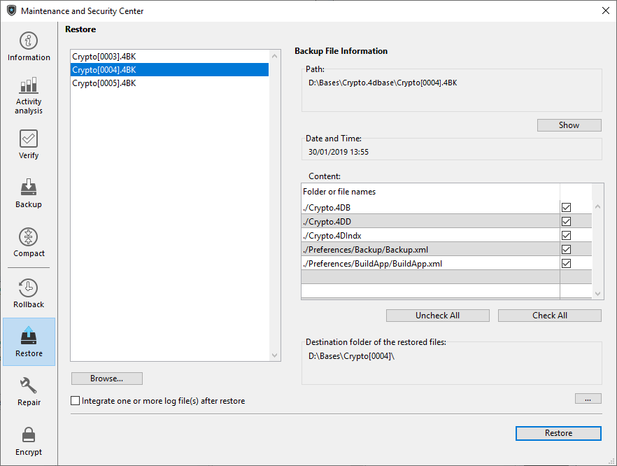

Você pode restaurar manualmente um arquivo da aplicação atual usando a página **Restaurar**. Essa página fornece várias opções que podem ser usadas para controlar a restauração:

> Os sistemas de recuperação automática 4D restauram as aplicações e incluem o arquivo de registro de dados quando necessário.

A lista encontrada na parte esquerda da janela exibe todos os backups existentes da aplicação. Você também pode clicar no botão **Procurar...**, localizado logo abaixo da área, para abrir qualquer outro arquivo de um local diferente. É então acrescentado à lista de arquivos.

Quando você seleciona um backup nessa lista, a parte direita da janela exibe as informações referentes a esse backup específico:

- **Caminho**: nome completo do caminho do arquivo de backup selecionado. Clicar no botão Mostrar abre o ficheiro de cópia de segurança numa janela do sistema.
- **Data e hora**: data e hora da cópia de segurança.
- **Conteúdo**: conteúdo do ficheiro de cópia de segurança. Cada item da lista tem uma caixa de seleção ao lado que pode ser usada para indicar se você deseja restaurá-lo ou não. Você também pode usar o **Verifique todos** ou **Desmarque todos os botões** para definir a lista de itens a serem restaurados.
- **Pasta de destino dos arquivos restaurados**: pasta onde os arquivos restaurados serão colocados. Por padrão, o 4D restaura os arquivos em uma pasta chamada "Archivename" (sem extensão) sendo colocada ao lado da pasta Project. Para alterar esse local, clique em **[...]** e especifique a pasta onde deseja que os arquivos restaurados sejam colocados.

O botão **Restaurar** inicia a restauração manual do(s) elemento(s) selecionado(s).

## Integração sucessiva de vários ficheiros de histórico

A opção **Integrar um ou mais arquivos de log após a restauração** permite integrar vários arquivos de log de dados sucessivamente em uma aplicação. Se, por exemplo, você tiver 4 arquivos de arquivo de diário (.4BL) correspondentes a 4 backups, poderá restaurar o primeiro backup e, em seguida, integrar os arquivos de diário (registro de dados) um a um. Isso significa que você pode, por exemplo, recuperar um arquivo de dados mesmo quando os últimos arquivos de backup estiverem faltando.

Quando essa opção está marcada, 4D exibe a caixa de diálogo padrão Abrir arquivo após a restauração, que pode ser usada para selecionar o arquivo de diário a ser integrado. A caixa de diálogo Abrir arquivo é exibida novamente após cada integração até ela ser cancelada.

## Restauração de um banco de dados criptografado

Lembre-se de que a chave de criptografia de dados (frase secreta) pode ter sido alterada em várias versões de arquivos de backup (.4BK), arquivos .journal (.4BL) e na aplicação atual. Devem ser sempre fornecidas chaves de encriptação correspondentes.

Ao restaurar um backup e integrar o arquivo de registro atual em um banco de dados criptografado:

- Se você restaurar um backup usando uma senha antiga, essa senha será exigida na próxima inicialização do banco de dados.
- Após uma criptografia, ao abrir o arquivo de dados criptografado, um backup é executado e um novo arquivo de diário é criado. Portanto, não é possível restaurar um arquivo .4BK criptografado com uma chave e integrar arquivos .4BL criptografados com outra chave.

A sequência seguinte ilustra os princípios de uma operação com várias chaves de backup/restauro:

| Operação                                    | Ficheiros gerados                                    | Comentário                                                                                                                                                                                                                                 |
| ------------------------------------------- | ---------------------------------------------------- | ------------------------------------------------------------------------------------------------------------------------------------------------------------------------------------------------------------------------------------------ |
| Novo ficheiro de dados                      |                                                      |                                                                                                                                                                                                                                            |
| Adicionar dados (registo # 1)               |                                                      |                                                                                                                                                                                                                                            |
| Cópia de segurança do banco de dados        | 0000.4BL e 0001.4BK                                  |                                                                                                                                                                                                                                            |
| Adicionar dados (registo # 2)               |                                                      |                                                                                                                                                                                                                                            |
| Cópia de segurança do banco de dados        | 0001.4BL e 0002.4BK                                  |                                                                                                                                                                                                                                            |
| Adicionar dados (registo # 3)               |                                                      |                                                                                                                                                                                                                                            |
| Criptografar um arquivo de dados com key1   | Ficheiro 0003.4BK (encriptado com key1)              | A criptografia salva os arquivos originais (incluindo o diário) na pasta "Replaced files (Encrypting) YYY-DD-MM HH-MM-SS". Ao abrir o arquivo de dados criptografados, um novo diário é criado e um backup é feito para ativar esse diário |
| Adicionar dados (registo #4)                |                                                      |                                                                                                                                                                                                                                            |
| Cópia de segurança do banco de dados        | Ficheiros 0003.4BL e 0004.4BK (encriptados com key1) | Podemos restaurar 0003.4BK e integrar 0003.4BL                                                                                                                                                                                             |
| Adicionar dados (registo # 5)               |                                                      |                                                                                                                                                                                                                                            |
| Cópia de segurança do banco de dados        | Ficheiros 0004.4BL e 0005.4BK (encriptados com key1) | Podemos restaurar 0003.4BK e integrar 0003.4BL + 0004.4BL. Podemos restaurar 0004.4BK e integrar 0004.4BL                                                                                                                                  |
| Adicionar dados (registo # 6)               |                                                      |                                                                                                                                                                                                                                            |
| Encriptação de um arquivo de dados com key2 | Ficheiro 0006.4BK (encriptado com key2)              | A criptografia salva os arquivos originais (incluindo o diário) na pasta "Replaced files (Encrypting) YYY-DD-MM HH-MM-SS". Ao abrir o arquivo de dados criptografados, um novo diário é criado e um backup é feito para ativar esse diário |
| Adicionar dados (registo # 7)               |                                                      |                                                                                                                                                                                                                                            |
| Cópia de segurança do banco de dados        | Ficheiros 0006.4BL e 0007.4BK (encriptados com key2) | Podemos restaurar 0006.4BK e integrar 0006.4BL                                                                                                                                                                                             |
| Adicionar dados (registo # 8)               |                                                      |                                                                                                                                                                                                                                            |
| Cópia de segurança do banco de dados        | Ficheiros 0007.4BL e 0008.4BK (encriptados com key2) | Podemos restaurar 0006.4BK e integrar 0006.4BL + 0007.4BL. Podemos restaurar 0007.4BK e integrar 0007.4BL                                                                                                                                  |
> Ao restaurar um backup e integrar um ou vários arquivos .4BL, os arquivos .4BK e .4BL restaurados devem ter a mesma chave de criptografia. Durante o processo de integração, se nenhuma chave de criptografia válida for encontrada no keychain 4D quando o arquivo .4BL for integrado, será gerado um erro.
> 
> Se você tiver armazenado chaves de dados sucessivas no mesmo dispositivo externo, a restauração de um backup e a integração de arquivos de registro encontrarão automaticamente a chave correspondente se o dispositivo estiver conectado.
