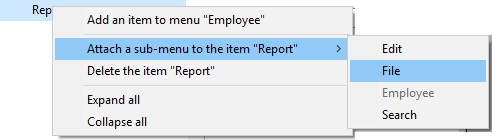

É possível criar menus e barras de menu:

- usando o editor de menus da janela da caixa de ferramentas 4D. Nesse caso, os menus e as barras de menu são armazenados na estrutura da aplicação.
- dinamicamente, utilizando os comandos de linguagem do tema "Menus". Nesse caso, os menus e as barras de menu não são armazenados, eles existem apenas na memória.

Você pode combinar os dois recursos e usar menus criados na estrutura como modelos para definir menus na memória.

## Barra de menu padrão

Uma aplicação personalizada deve conter pelo menos uma barra de menu com um menu. Por padrão, quando você cria um projeto, 4D cria automaticamente uma barra de menu padrão (Menu Bar #1) para você poder acessar a modo Aplicação. A barra de menu padrão inclui menus padrão e um comando para retornar ao modo Desenho.

Isso permite que o usuário acesse o modo Aplicação assim que o projeto é criado. A barra de menus nº 1 é chamada automaticamente quando o comando **Teste de aplicação** é selecionado no menu **Executar**.

A barra de menus predefinida inclui três menus:

- **Arquivo**: inclui apenas o comando **Sair**. A ação padrão *Sair* está associada ao comando, o que faz com que aplicação seja encerrada.
- **Editar**: padrão e completamente modificável. As funções de edição, como copiar, colar, etc., são definidas por meio de ações padrão.
- **Modo**: contém, por padrão, o comando **Retornar ao modo Desenho**, usado para sair do modo Aplicação.
> > > > > > Os itens de menu aparecem *em itálico* porque consistem em referências e não em texto codificado. Consultar [Propriedade Título](properties.md#title).

Pode modificar esta barra de menu como desejar ou criar outras.

## Criar menus

### Utilizar o editor de menus

1. Selecione o item que pretende criar e clique no botão Adicionar  abaixo da área da barra de menus. OR Choose **Create a new menu bar** or **Create a new menu** from the context menu of the list or the options menu below the list. Se você criou uma barra de menus, uma nova barra aparecerá na lista contendo os menus padrão (Arquivo e Edição).
2. (opcional) Clique duas vezes no nome da barra de menus/menu para alternar para o modo de edição e digitar um nome personalizado. OU Digite o nome personalizado na área "Título". Os nomes das barras de menu devem ser únicos. Podem conter até 31 caracteres. Você pode inserir o nome como "hard coded" ou inserir uma referência (consulte [as informações sobre a propriedade Titule](properties.md#title)).

### Utilizar a linguagem 4D
Use o comando `Create menu` para criar uma barra de menu ou referência de menu*(MenuRef*) na memória.

Quando os menus são manipulados por referências *MenuRef*, não há diferença entre um menu e uma barra de menus. Em ambos os casos, consiste numa lista de itens. Apenas a sua utilização é diferente. No caso de uma barra de menu, cada item corresponde a um menu composto por itens.

`Create menu` pode criar menus vazios (a serem preenchidos usando `APPEND MENU ITEM` ou `INSERT MENU ITEM`) ou por menus criados com base em menus projetados no Editor de menus.

## Adicionar itens
Para cada um dos menus, você deve adicionar os comandos que aparecem quando o menu é exibido. É possível inserir itens que serão associados a métodos ou ações padrão, ou anexar outros menus (submenus).

### Utilizar o editor de menus
Para adicionar um item de menu:

1. Na lista de menus de origem, selecione o menu ao qual você deseja adicionar um comando. Se o menu já contiver comandos, eles serão exibidos na lista central. Se você quiser inserir o novo comando, selecione o comando que deseja que apareça acima dele. Você sempre pode reorganizar o menu posteriormente, arrastando e soltando.
2. Escolha **Adicionar um item ao menu "MenuName"** no menu de opções do editor ou no menu de contexto (clique com o botão direito do mouse na lista central). OR Click on the add  button located below the central list. 4D adiciona um novo item com o nome padrão "Item X", onde X é o número de itens já criados.
3. Clique duas vezes no nome do comando para alternar para o modo de edição e inserir um nome personalizado. OU Digite o nome personalizado na área "Título". Pode conter até 31 caracteres. Você pode digitar o nome como "código duro" ou insira uma referência (veja abaixo).

### Utilizar a linguagem 4D

Utilize `INSERT MENU ITEM` ou `APPEND MENU ITEM` para inserir ou adicionar itens de menu em referências de menu existentes.

## Eliminar menus e itens

### Utilizar o editor de menus
Você pode excluir uma barra de menus, um menu ou um item de menu a qualquer momento. Note que cada menu ou barra de menu tem apenas uma referência. Quando um menu é anexado a diferentes barras ou diferentes menus, qualquer modificação ou exclusão feita no menu é imediatamente executada em todas as outras ocorrências desse menu. A eliminação de um menu apenas elimina uma referência. Quando você exclui a última referência de um menu, o 4D exibe um alerta.

Para eliminar uma barra de menu, um menu ou um item de menu:

- Selecione o item a eliminar e clique no botão eliminar  situado por baixo da lista.
- ou use o comando **Excluir...** apropriado no menu de contexto ou no menu de opções do editor.

> Não é possível eliminar a barra de menus #1.

### Utilizar a linguagem 4D

Utilize `DELETE MENU ITEM` para remover um item de uma referência de menu. Use `RELEASE MENU` para descarregar a referência de menu da memória.

## Anexar os menus

Após criar um menu, você pode anexá-lo a um ou vários outros menus (submenu) ou barra(s) de menu.

Os submenus podem ser usados para agrupar funções organizadas conforme o assunto no mesmo menu. Os submenus e seus itens podem ter os mesmos atributos dos próprios menus (ações, métodos, atalhos, ícones e assim por diante). Os itens do submenu mantêm suas características e propriedades originais e o funcionamento do submenu é idêntico ao de um menu padrão.

Você pode criar submenus de submenus em uma profundidade praticamente ilimitada. Observe, no entanto, que, por motivos relacionados à ergonomia da interface, geralmente não é recomendado ir além de dois níveis de submenus.

Em tempo de execução, se um menu anexado for modificado pela programação, todas as outras instâncias do menu refletirão essas alterações.

### Utilizar o editor de menus

Um menu pode ser anexado a uma barra de menus ou a outro menu.

- Para anexar um menu a uma barra de menus: clique com o botão direito do mouse na barra de menus e selecione **Anexar um menu à barra de menus "bar name" >** e, em seguida, escolha o menu a ser anexado à barra de menus:  Você também pode selecionar uma barra de menu e clicar no botão de opções localizado abaixo da lista.
- Para anexar um menu a outro menu: selecione o menu na área à esquerda, clique com o botão direito do mouse no item de menu e selecione **Anexar um submenu ao item "nome do item">** e, em seguida, escolha o menu que deseja usar como submenu:  
   Você também pode selecionar um item de menu e clicar no botão de opções localizado abaixo da lista. O menu que está a ser anexado torna-se assim um sub-menu. O título do item é mantido (o nome original do submenu é ignorado), mas esse título pode ser modificado.

#### Desvinculação de menus

Você pode separar um menu de uma barra de menus ou um submenu de um menu a qualquer momento. O menu desvinculado não estará mais disponível na barra de menus ou no submenu, conforme o caso, mas ainda estará presente na lista de menus.

Para desanexar um menu, clique com o botão direito do mouse no menu ou submenu que você deseja desanexar na lista central e, em seguida, escolha a opção **Desanexar o menu(...)** ou **Desanexar o submenu(...)**

### Utilizar a linguagem 4D

Como não há diferença entre menus e barras de menu na linguagem 4D, a anexação de menus ou submenus é feita da mesma maneira: use o parâmetro *subMenu* do comando `APPEND MENU ITEM` para anexar um menu a uma barra de menu ou a um menu.  
