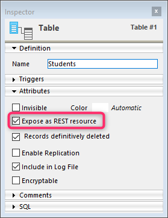

A tecnologia ORDA baseia-se em um mapeamento automático de uma estrutura de banco de dados subjacente. Também fornece acesso aos dados através de objetos seleção de entidades (entity selection) e entidades (entity). Como resultado, ORDA expõe toda a base de dados como um conjunto de objetos de modelo de dados.


## Mapeamento da estrutura

Quando você chama um datastore usando o comando [`ds`](API/DataStoreClass.md#ds) ou a função [`Open datastore`](API/DataStoreClass.md#open-datastore) 4D automaticamente referir-se a tabelas e campos da estrutura 4D correspondente como propriedades do objeto [datastore](#datastore) retornado:

*   As tabelas correspondem às dataclasses.
*   Os campos são mapeados para atributos de armazenamento.
*   As relações são mapeadas para atributos de relações - os nomes de relações, definidos no editor de estrutura, são usados como nomes de atributos de relações.


### Regras gerais

As seguintes regras são aplicadas a quaisquer conversões:

* Os nomes de tabelas, campos e relações são mapeados para nomes de propriedade de objeto. Certifique-se de que esses nomes estejam em conformidade com as regras gerais de nomenclatura de objetos, conforme explicado na seção [convenções de nomenclatura de objetos](Concepts/identifiers.md).
*   Uma datastore só referencia as tabelas com uma única chave primária. As tabelas seguintes não são referenciadas:
    *   Tabelas sem chave primária
    *   Tabelas com chaves primárias compostas.
*   Os campos BLOB estão automaticamente disponíveis como atributos do tipo [objeto Blob](Concepts/dt_blob.md#blob-types).

> O mapeamento ORDA não considera:  
> - a opção "Invisível" para tabelas ou campos, - a estrutura virtual definida por `SET TABLE TITLES` ou `SET FIELD TITLES`, - a propriedade "Manual" ou "Automático" das relações.


### Regras para o controlo do acesso remoto

Ao acessar a um datastore remoto por meio do comando `Open datastore` ou das [solicitações REST](REST/gettingStarted.md), somente as tabelas e os campos com a propriedade **Expose as REST resource** estão disponíveis remotamente.

Essa opção deve ser selecionada no nível da estrutura 4D para cada tabela e cada campo que você deseja expor como classe de dados e atributo no armazenamento de dados:




### Actualização do modelo de dados

Quaisquer modificações aplicadas no nível da estrutura da base de dados invalidam a camada de modelo atual da ORDA. Estas modificações incluem:

*   adicionar ou remover uma tabela, um campo ou uma relação
*   renomeação de uma tabela, um campo ou uma relação
*   alterar uma propriedade principal de um campo (tipo, exclusivo, índice, autoincremento, suporte a valor null)

Quando a camada atual do modelo ORDA é invalidada, ela é automaticamente recarregada e atualizada em chamadas subsequentes do datastore local `ds` no 4D e no 4D Server. Observe que as referências existentes a objetos ORDA, como entidades ou seleções de entidades, continuarão a usar o modelo a partir do qual foram criadas, até que sejam geradas novamente.

No entanto, a camada atualizada do modelo ORDA não está automaticamente disponível nos seguintes contextos:

*   uma aplicação remota 4D conectado ao servidor 4D -- o aplicativo remoto deve reconectar ao servidor.
*   um datastore remoto aberto usando `Open datastore` ou por [chamadas REST](REST/gettingStarted.md) - uma nova sessão deve ser aberta.


## Definição de objetos

### Datastore

O datastore é o objeto de interface para um banco de dados. Constrói uma representação de todo o banco de dados como objeto. Uma datastore é feita de um **modelo** e **dados**:

- O modelo contém e descreve todas as dataclasses que compõem o datastore. É independente do próprio banco de dados subjacente.
- Os dados referem-se à informação que vai ser utilizada e armazenada neste modelo. Por exemplo, nomes, endereços e datas de nascimento dos funcionários são peças de dados com os quais você pode trabalhar em um datastore.

Quando manipulado pelo código, o datastore é um objeto cujas propriedades são todas as [dataclasses](#dataclass) que foram especificamente expostas.

4D permite lidar com os seguintes datastores:

- a datastore local, baseada na base 4D atual, devolvida pelo comando `ds` (o datastore principal).
- um ou mais datastore(s) remotos expostos como recursos REST em bancos de dados 4D remotos, retornados pelo comando `Open datastore`.

Um datastore faz referência apenas a um único banco de dados local ou remoto.

O próprio objeto datastore não pode ser copiado como um objeto:

```4d 
$mydatastore:=OB Copy(ds) //retorna nulo
```


No entanto, as propriedades do datastore são enumeráveis:


```4d 
 ARRAY TEXT($prop;0)
 OB GET PROPERTY NAMES(ds;$prop)
  //$prop contém os nomes de todas as classes de dados
```


O datastore principal (padrão) está sempre disponível através do comando `ds`, mas o comando `Open datastore` permite fazer referência a qualquer datastore remoto.

### Dataclass

Uma dataclass é o equivalente a uma tabela. É usado como um modelo de objeto e referir-se a todos os campos como atributos, incluindo atributos relativo (atributos construídos sobre as relações entre os dataclasses). Os atributos relacionais podem ser utilizados em consultas como qualquer outro atributo.

Todas as dataclasses em um projeto 4D estão disponíveis como uma propriedade do armazenamento de dados `ds`. Para datastores remotos acessados através `Open datastore` ou [Solicitações REST](REST/gettingStarted.md), a opção **Expor como recurso REST** deve ser selecionada no nível de estrutura 4D para cada tabela exposta que você quer ser exposta como dataclass no datastore.

Por exemplo, considere a seguinte tabela na estrutura 4D:


A tabela `Company` está automaticamente disponível como uma classe de dados no repositório de dados `ds`. Você pode escrever:

```4d 
var $compClass : cs. Company //declares a $compClass object variable of the Company class
$compClass:=ds. Company //assigns the Company dataclass reference to $compClass
```

Um objeto de classe de dados pode conter:

*   atributos
*   atributos relacionais

A classe de dados oferece uma abstração do banco de dados físico e permite a manipulação de um modelo de dados conceitual. A dataclass é a única forma de consultar o datastore. Uma consulta é feita a partir de uma única dataclass. As consultas são construídas em torno de atributos e nomes de atributos de relação das dataclasses. Assim, os atributos de relação são o meio de envolver várias tabelas ligadas numa consulta.

O próprio objeto dataclass não pode ser copiado como um objeto:

```4d 
$mydataclass:=OB Copy(ds. Employee) //returns null
```

No entanto, as propriedades da dataclass são enumeráveis:

```code4d 
ARRAY TEXT($prop;0)
OB GET PROPERTY NAMES(ds. Employee;$prop)
//$prop contains the names of all the dataclasse attributes
```


### Atributo

As propriedades de dataclass são objetos de atributo que descrevem os campos ou relações subjacentes. Por exemplo:

```4d 
 $nameAttribute:=ds. Company.name //reference to class attribute
 $revenuesAttribute:=ds. Company["revenues"] //alternate way
```

Esse código atribui a `$nameAttribute` e `$revenuesAttribute` faz referência aos atributos name e revenues da classe `Company`. Essa sintaxe NAO devolve valores mantidos dentro do atributo, mas sim devolve referências aos próprios atributos. Para manejar os valores, é necessário passar por [Entidades](#entity).

Todos os campos elegíveis em uma tabela estão disponíveis como atributos de sua [dataclass](#dataclass) principal. Para datastores remotos acessados através `Open datastore` ou [Solicitações REST](REST/gettingStarted.md), a opção **Expor como recurso REST** deve ser selecionada no nível de estrutura 4D para cada campo que você deseja ser exposto como um atributo de dataclass.


#### Atributos de armazenamento e de relação

Atributos da Dataclass vêm em vários tipos: armazenamento, relatedEntity e relatedEntities. Os atributos que são escalares (*ou seja*, fornecem apenas um único valor) são compatíveis com todos os tipos de dados 4D padrão (inteiro, texto, objeto etc.).

*   Um **atributo de armazenamento** é equivalente a um campo no banco de dados 4D e pode ser indexado. Os valores atribuídos a um atributo de armazenamento são armazenados como parte da entidade quando ela é salva. Quando um atributo de armazenamento é acessado, seu valor vem diretamente do datastore. Atributos de armazenamento são o bloco de construção mais básico de uma entidade e são definidos pelo nome e tipo de dados.
*   Um **atributo de relação** fornece acesso a outras entidades. Os atributos relação podem resultar em uma única entidade (ou nenhuma entidade) ou em uma seleção de entidades (de 0 a N). Os atributos relacional são criados com base em relações "clássicas" na estrutura relacional para fornecer acesso direto a entidades relacionadas ou a entidades relacionadas. Os atributos de relação estão diretamente disponíveis no ORDA usando seus nomes.

Por exemplo, considere a seguinte estrutura de banco de dados parcial e as propriedades de relação:


Todos os atributos de armazenamento estarão automaticamente disponíveis:

*   na dataclass Project: "ID", "name" e "companyID"
*   na dataclass Company: "ID", "name" e "discount"

Além disso, os seguintes atributos de relação também estarão automaticamente disponíveis:

*   na classe de dados Project: atributo **theClient**, do tipo "relatedEntity"; há no máximo uma empresa para cada projeto (o cliente)
*   na classe de dados Empresa: atributo **companyProjects**, do tipo "relatedEntities"; para cada empresa, há qualquer número de projetos relacionados.
> A propriedade Manual ou Automática de uma relação de banco de dados não tem efeito no ORDA.

Todos os atributos da dataclass são expostos como propriedades da dataclass:


Tenha em mente que esses objetos descrevem os atributos, mas não dão acesso aos dados. A leitura ou escrita de dados é feita através de [objetos entidade](entities.md#using-entity-attributes).

#### Atributos computados e alias

Os [atributos computados](ordaClasses.md#computed-attributes) e [atributos aliás](ordaClasses.md#alias-attributes) são atributos "virtuais". O seu valor não é armazenado, mas avaliado sempre que são acedidos. Eles não pertencem à estrutura de banco de dados subjacente, mas são construídos sobre ela e podem ser usados como qualquer atributo do modelo de dados.


### Entity

Uma entidade é o equivalente a um registo. Na verdade, é um objeto que referir-se a um registo no banco de dados. Ele pode ser visto como uma instância da [dataclass](#dataclass), como um registro da tabela que corresponde à dataclass. No entanto, uma entidade também contém dados correlacionados ao banco de dados relacionado ao datastore.

O objetivo da entidade é gerir dados (criar, atualizar, apagar). Quando uma referência de entidade é obtida por uma seleção de entidade, ela também retém informações sobre a seleção de entidade, o que permite a iteração por meio da seleção.

O objeto entidade em si não pode ser copiado como um objeto:

```4d
 $myentity:=OB Copy(ds. Employee.get(1)) //retorna null
```

As propriedades da entidade são, no entanto, enumeráveis:

```4d
 ARRAY TEXT($prop;0)
 OB GET PROPERTY NAMES(ds. Employee.get(1);$prop)
  //$prop contains the names of all the entity attributes
```


### Seleção de entidades

Uma seleção de entidade é um objeto contendo uma ou mais referência(s) a entidades pertencentes à mesma dataclass. É normalmente criado como resultado de uma consulta ou devolvido a partir de um atributo de relação. Uma seleção de entidades pode conter 0, 1 ou X entidades da dataclass -- onde X pode representar o número total de entidades contidas na dataclass.

Exemplo:

```4d
var $e : cs. EmployeeSelection //declares a $e object variable of the EmployeeSelection class type
$e:=ds. Employee.all() //assigns the resulting entity selection reference to the $e variable
```

As seleções de entidades podem ser "classificadas" ou "não classificadas" ([consulte abaixo](#ordered-or-unordered-entity-selection)).

> As entity selections também podem ser "compartilháveis" ou "não compartilháveis", dependendo de [como foram criadas](entities.md#shareable-or-alterable-entity-selections).

O próprio objeto de seleção de entidades não pode ser copiado como um objeto:

```4d
 $myentitysel:=OB Copy(ds. Employee.all()) //returns null
```

No entanto, as propriedades de seleção de entidades são enumeráveis:

```4d
 ARRAY TEXT($prop;0)
 OB GET PROPERTY NAMES(ds. Employee.all();$prop)
  //$prop contains the names of the entity selection properties
  //("length", 00", "01"...)
```


#### Entity selections ordenadas ou não ordenadas

Por motivos de otimização, por padrão, o 4D ORDA geralmente cria seleções de entidades não ordenadas, exceto quando você usa o método `orderBy( )` ou usa opções específicas. Nesta documentação, a menos que especificado, "seleção de entidade" geralmente se refere a uma "seleção de entidade não ordenada".

As seleções das entidades ordenadas são criadas apenas quando necessárias ou quando solicitadas especificamente usando opções, ou seja, nos seguintes casos:

*   resultado de um `orderBy()` em uma seleção (de qualquer tipo) ou um `orderBy()` em uma dataclass
*   resultado do método `newSelection()` com a opção `dk keep ordered`

As selecções de entidades não ordenadas são criadas nos seguintes casos:

*   resultado de uma `query()` padrão em uma seleção (de qualquer tipo) ou uma `query()` em uma dataclass,
*   resultado do método `newSelection()` sem opção,
*   resultado de qualquer um dos métodos de comparação, independentemente do tipo de seleção de entrada: `or()`, `and()`, `minus()`.
> As seguintes seleções de entidades são sempre **ordenadas**:
> 
> * seleções de entidades retornadas pelo 4D Server para um cliente remoto
> * selecções de entidades construídas em datastores remotos.

Observe que quando uma seleção de entidade ordenada se torna uma seleção de entidade não ordenada, quaisquer referências repetidas são removidas.
