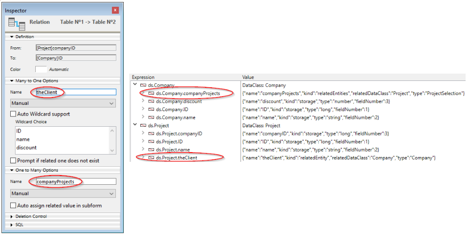

A tecnologia ORDA baseia-se em um mapeamento automático de uma estrutura de banco de dados subjacente. Também fornece acesso aos dados através de objetos seleção de entidades (entity selection) e entidades (entity). Como resultado, ORDA expõe toda a base de dados como um conjunto de objetos de modelo de dados.


## Mapeamento da estrutura

Quando você chama um datastore usando o comando [`ds`](API/DataStoreClass.md#ds) ou a função [`Open datastore`](API/DataStoreClass.md#open-datastore) 4D automaticamente referir-se a tabelas e campos da estrutura 4D correspondente como propriedades do objeto [datastore](#datastore) retornado:

*   As tabelas correspondem às dataclasses.
*   Os campos são mapeados para atributos de armazenamento.
*   As relações são mapeadas para atributos de relações - os nomes de relações, definidos no editor de estrutura, são usados como nomes de atributos de relações.




### Regras gerais

As seguintes regras são aplicadas a quaisquer conversões:

* Os nomes de tabelas, campos e relações são mapeados para nomes de propriedade de objeto. Certifique-se de que esses nomes estejam em conformidade com as regras gerais de nomenclatura de objetos, conforme explicado na seção [convenções de nomenclatura de objetos](Concepts/identifiers.md).
*   Uma datastore só referencia as tabelas com uma única chave primária. As tabelas seguintes não são referenciadas:
    *   Tabelas sem chave primária
    *   Tabelas com chaves primárias compostas.
*   Os campos BLOB estão automaticamente disponíveis como atributos do tipo [objeto Blob](Concepts/dt_blob.md#blob-types).

> O mapeamento ORDA não considera:  
> - a opção "Invisível" para tabelas ou campos, - a estrutura virtual definida por `SET TABLE TITLES` ou `SET FIELD TITLES`, - a propriedade "Manual" ou "Automático" das relações.


### Regras para o controlo do acesso remoto

Ao acessar a um datastore remoto por meio do comando `Open datastore` ou das [solicitações REST](REST/gettingStarted.md), somente as tabelas e os campos com a propriedade **Expose as REST resource** estão disponíveis remotamente.

Essa opção deve ser selecionada no nível da estrutura 4D para cada tabela e cada campo que você deseja expor como classe de dados e atributo no armazenamento de dados:


### Actualização do modelo de dados

Quaisquer modificações aplicadas no nível da estrutura da base de dados invalidam a camada de modelo atual da ORDA. Estas modificações incluem:

*   adicionar ou remover uma tabela, um campo ou uma relação
*   renomeação de uma tabela, um campo ou uma relação
*   alterar uma propriedade principal de um campo (tipo, exclusivo, índice, autoincremento, suporte a valor null)

Quando a camada atual do modelo ORDA é invalidada, ela é automaticamente recarregada e atualizada em chamadas subsequentes do datastore local `ds` no 4D e no 4D Server. Observe que as referências existentes a objetos ORDA, como entidades ou seleções de entidades, continuarão a usar o modelo a partir do qual foram criadas, até que sejam geradas novamente.

No entanto, a camada atualizada do modelo ORDA não está automaticamente disponível nos seguintes contextos:

*   uma aplicação remota 4D conectado ao servidor 4D -- o aplicativo remoto deve reconectar ao servidor.
*   um datastore remoto aberto usando `Open datastore` ou por [chamadas REST](REST/gettingStarted.md) - uma nova sessão deve ser aberta.


## Definição de objetos

### Datastore

O datastore é o objeto de interface para um banco de dados. Constrói uma representação de todo o banco de dados como objeto. Uma datastore é feita de um **modelo** e **dados**:

- O modelo contém e descreve todas as dataclasses que compõem o datastore. É independente do próprio banco de dados subjacente.
- Os dados referem-se à informação que vai ser utilizada e armazenada neste modelo. Por exemplo, nomes, endereços e datas de nascimento dos funcionários são peças de dados com os quais você pode trabalhar em um datastore.

Quando manipulado pelo código, o datastore é um objeto cujas propriedades são todas as [dataclasses](#dataclass) que foram especificamente expostas.

4D permite lidar com os seguintes datastores:

- a datastore local, baseada na base 4D atual, devolvida pelo comando `ds` (o datastore principal).
- um ou mais datastore(s) remotos expostos como recursos REST em bancos de dados 4D remotos, retornados pelo comando `Open datastore`.

Um datastore faz referência apenas a um único banco de dados local ou remoto.

O próprio objeto datastore não pode ser copiado como um objeto:

```4d 
$mydatastore:=OB Copy(ds) //retorna nulo
```


No entanto, as propriedades do datastore são enumeráveis:


```4d 
 ARRAY TEXT($prop;0)
 OB GET PROPERTY NAMES(ds;$prop)
  //$prop contém os nomes de todas as classes de dados
```


The main (default) datastore is always available through the `ds` command, but the `Open datastore` command allows referencing any remote datastore.

### Dataclass

Uma dataclass é o equivalente a uma tabela. It is used as an object model and references all fields as attributes, including relational attributes (attributes built upon relations between dataclasses). Os atributos relacionais podem ser utilizados em consultas como qualquer outro atributo.

All dataclasses in a 4D project are available as a property of the `ds` datastore. For remote datastores accessed through `Open datastore` or [REST requests](REST/gettingStarted.md), the **Expose as REST resource** option must be selected at the 4D structure level for each exposed table that you want to be exposed as dataclass in the datastore.

Por exemplo, considere a seguinte tabela na estrutura 4D:


The `Company` table is automatically available as a dataclass in the `ds` datastore. Você pode escrever:

```4d 
var $compClass : cs. Company //declares a $compClass object variable of the Company class
$compClass:=ds. Company //assigns the Company dataclass reference to $compClass
```

Um objeto de classe de dados pode conter:

*   attributes
*   atributos relacionais

The dataclass offers an abstraction of the physical database and allows handling a conceptual data model. A dataclass é a única forma de consultar o datastore. Uma consulta é feita a partir de uma única dataclass. As consultas são construídas em torno de atributos e nomes de atributos de relação das dataclasses. Assim, os atributos de relação são o meio de envolver várias tabelas ligadas numa consulta.

O próprio objeto dataclass não pode ser copiado como um objeto:

```4d 
$mydataclass:=OB Copy(ds. Employee) //returns null
```

No entanto, as propriedades da dataclass são enumeráveis:

```code4d 
ARRAY TEXT($prop;0)
OB GET PROPERTY NAMES(ds. Employee;$prop)
//$prop contains the names of all the dataclasse attributes
```


### Atributo

Dataclass properties are attribute objects describing the underlying fields or relations. Por exemplo:

```4d 
 $nameAttribute:=ds. Company.name //reference to class attribute
 $revenuesAttribute:=ds. Company["revenues"] //alternate way
```

This code assigns to `$nameAttribute` and `$revenuesAttribute` references to the name and revenues attributes of the `Company` class. Essa sintaxe NAO devolve valores mantidos dentro do atributo, mas sim devolve referências aos próprios atributos. Para manejar os valores, é necessário passar por [Entidades](#entity).

All eligible fieds in a table are available as attributes of their parent [dataclass](#dataclass). For remote datastores accessed through `Open datastore` or [REST requests](REST/gettingStarted.md), the **Expose as REST resource** option must be selected at the 4D structure level for each field that you want to be exposed as a dataclass attribute.


#### Atributos de armazenamento e de relação

Atributos da Dataclass vêm em vários tipos: armazenamento, relatedEntity e relatedEntities. Attributes that are scalar (*i.e.*, provide only a single value) support the standard 4D data type (integer, text, object, etc.).

*   A **storage attribute** is equivalent to a field in the 4D database and can be indexed. Values assigned to a storage attribute are stored as part of the entity when it is saved. When a storage attribute is accessed, its value comes directly from the datastore. Storage attributes are the most basic building block of an entity and are defined by name and data type.
*   A **relation attribute** provides access to other entities. Os atributos relação podem resultar em uma única entidade (ou nenhuma entidade) ou em uma seleção de entidades (de 0 a N). Relation attributes are built upon "classic" relations in the relational structure to provide direct access to related entity or related entities. Os atributos de relação estão diretamente disponíveis no ORDA usando seus nomes.

For example, consider the following partial database structure and the relation properties:


Todos os atributos de armazenamento estarão automaticamente disponíveis:

*   na dataclass Project: "ID", "name" e "companyID"
*   na dataclass Company: "ID", "name" e "discount"

In addition, the following relation attributes will also be automatically available:

*   in the Project dataclass: **theClient** attribute, of the "relatedEntity" kind; there is at most one Company for each Project (the client)
*   in the Company dataclass: **companyProjects** attribute, of the "relatedEntities" kind; for each Company there is any number of related Projects.
> > > The Manual or Automatic property of a database relation has no effect in ORDA.

Todos os atributos da dataclass são expostos como propriedades da dataclass:


Keep in mind that these objects describe attributes, but do not give access to data. A leitura ou escrita de dados é feita através de [objetos entidade](entities.md#using-entity-attributes).

#### Atributos computados e alias

[Computed attributes](ordaClasses.md#computed-attributes) and [alias attributes](ordaClasses.md#alias-attributes) are "virtual" attributes. O seu valor não é armazenado, mas avaliado sempre que são acedidos. They do not belong to the underlying database structure, but are built upon it and can be used as any attribute of the data model.


### Entity

Uma entidade é o equivalente a um registo. Na verdade, é um objeto que referir-se a um registo no banco de dados. It can be seen as an instance of a [dataclass](#dataclass), like a record of the table matching the dataclass. However, an entity also contains data correlated to the database related to the datastore.

O objetivo da entidade é gerir dados (criar, atualizar, apagar). When an entity reference is obtained by means of an entity selection, it also retains information about the entity selection which allows iteration through the selection.

O objeto entidade em si não pode ser copiado como um objeto:

```4d
 $myentity:=OB Copy(ds. Employee.get(1)) //retorna null
```

As propriedades da entidade são, no entanto, enumeráveis:

```4d
 ARRAY TEXT($prop;0)
 OB GET PROPERTY NAMES(ds. Employee.get(1);$prop)
  //$prop contains the names of all the entity attributes
```


### Seleção de entidades

Uma seleção de entidade é um objeto contendo uma ou mais referência(s) a entidades pertencentes à mesma dataclass. É normalmente criado como resultado de uma consulta ou devolvido a partir de um atributo de relação. Uma seleção de entidades pode conter 0, 1 ou X entidades da dataclass -- onde X pode representar o número total de entidades contidas na dataclass.

Exemplo:

```4d
var $e : cs. EmployeeSelection //declares a $e object variable of the EmployeeSelection class type
$e:=ds. Employee.all() //assigns the resulting entity selection reference to the $e variable
```

As seleções de entidades podem ser "classificadas" ou "não classificadas" ([consulte abaixo](#ordered-or-unordered-entity-selection)).

> Entity selections can also be "shareable" or "non-shareable", depending on [how they have been created](entities.md#shareable-or-alterable-entity-selections).

O próprio objeto de seleção de entidades não pode ser copiado como um objeto:

```4d
 $myentitysel:=OB Copy(ds. Employee.all()) //returns null
```

No entanto, as propriedades de seleção de entidades são enumeráveis:

```4d
 ARRAY TEXT($prop;0)
 OB GET PROPERTY NAMES(ds. Employee.all();$prop)
  //$prop contains the names of the entity selection properties
  //("length", 00", "01"...)
```


#### Entity selections ordenadas ou não ordenadas

For optimization reasons, by default 4D ORDA usually creates unordered entity selections, except when you use the `orderBy( )` method or use specific options. In this documentation, unless specified, "entity selection" usually refers to an "unordered entity selection".

Ordered entity selections are created only when necessary or when specifically requested using options, i.e. in the following cases:

*   result of an `orderBy()` on a selection (of any type) or an `orderBy()` on a dataclass
*   result of the `newSelection()` method with the `dk keep ordered` option

As selecções de entidades não ordenadas são criadas nos seguintes casos:

*   result of a standard `query()` on a selection (of any type) or a `query()` on a dataclass,
*   resultado do método `newSelection()` sem opção,
*   result of any of the comparison methods, whatever the input selection types: `or()`, `and()`, `minus()`.
> > > The following entity selections are always **ordered**: > > * entity selections returned by 4D Server to a remote client > * entity selections built upon remote datastores.
> 
> * > > * > > * entity selections returned by 4D Server to a remote client > * entity selections built upon remote datastores.
> * selecções de entidades construídas em datastores remotos.

Note that when an ordered entity selection becomes an unordered entity selection, any repeated entity references are removed.
