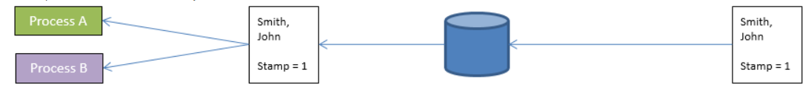

No ORDA, você acessa os dados através de [entidades](dsMapping.md#entity) e [as seleções das entidades](dsMapping.md#entity-selection). Estes objectos permitem-lhe criar, atualizar, consultar ou ordenar os dados do datastore.


## Criar uma entidade

Existem duas maneiras de criar uma nova entidade numa dataclass:

*   Como as entidades são referências a registros do banco de dados, é possível criar entidades criando registros usando a linguagem 4D "clássica" e, em seguida, referenciá-los com métodos ORDA, como `entity.next( )` ou `entitySelection.first( )`.
*   Você também pode criar uma entidade usando o método `dataClass.new()`.

Tenha em atenção que a entidade só é criada na memória. Se você quiser adicioná-lo ao armazenamento de dados, deverá chamar o método `entity.save( )`.

Os atributos da entidade estão diretamente disponíveis como propriedades do objeto entidade. Para obter mais informações, consulte [Usando atributos de entidade](#using-entity-attributes).

Por exemplo, se quisermos criar uma nova entidade na classe de dados "Employee" no repositório de dados atual com "John" e "Dupont" atribuídos aos atributos firstname e name:

```4d
var $myEntity : cs. EmployeeEntity
$myEntity:=ds. Employee.new() //Create a new object of the entity type
$myEntity.name:="Dupont" //assign 'Dupont' to the 'name' attribute
$myEntity.firstname:="John" //assign 'John' to the 'firstname' attribute
$myEntity.save() //save the entity
```
> Uma entidade é definida apenas no processo em que foi criada. Não é possível, por exemplo, armazenar uma referência a uma entidade em uma variável interprocessos e usá-la em outro processo.

## Entidades e referências

Uma entidade contém uma referência a um registo 4D. Entidades diferentes podem fazer referência ao mesmo registo 4D. Além disso, como uma entidade pode ser armazenada em uma variável de objeto 4D, diferentes variáveis podem conter uma referência à mesma entidade.

Se executar o seguinte código:

```4d
 var $e1; $e2 : cs. EmployeeEntity
 $e1:=ds. Employee.get(1) //access the employee with ID 1
 $e2:=$e1
 $e1.name:="Hammer"
  //both variables $e1 and $e2 share the reference to the same entity
  //$e2.name contains "Hammer"
```

Este facto é ilustrado pelo gráfico seguinte:


Agora, se executar:

```4d
 var $e1; $e2 : cs. EmployeeEntity
 $e1:=ds. Employee.get(1)
 $e2:=ds. Employee.get(1)
 $e1.name:="Hammer"
  //variable $e1 contains a reference to an entity
  //variable $e2 contains another reference to another entity
  //$e2.name contains "smith"
```

Este facto é ilustrado pelo gráfico seguinte:


Note-se, no entanto, que as entidades se referem ao mesmo registo. Em todos os casos, se você chamar o método `entity.save( )` , o registro será atualizado (exceto em caso de conflito, consulte [Bloqueio de entidades](#entity-locking)).

De fato, `$e1` e `$e2` não são a entidade em si, mas uma referência à entidade. Isso significa que você pode passá-los diretamente para qualquer função ou método, e ele funcionará como um ponteiro, e mais rápido do que um ponteiro 4D. Por exemplo:

```4d
 For each($entity;$selection)
    do_Capitalize($entity)
 End for each
```

E o método é:

```4d
 $entity:=$1
 $name:=$entity.lastname
 If(Not($name=Null))
    $name:=Uppercase(Substring($name;1;1))+Lowercase(Substring($name;2))
 End if
 $entity.lastname:=$name
```

Você pode lidar com entidades como qualquer outro objeto em 4D e passar suas referências diretamente como  [parâmetros](Concepts/parameters.md).
> Com as entidades, não há o conceito de "registro atual" como na linguagem clássica 4D. Pode utilizar tantas entidades quantas as necessárias, em simultâneo. Também não há bloqueio automático em uma entidade (consulte [Bloqueio de entidades](#entity-locking)). Quando uma entidade é carregada, ela usa o mecanismo [lazy loading](glossary.md#lazy-loading) , o que significa que somente as informações necessárias são carregadas. No entanto, no cliente/servidor, a entidade pode ser carregada automaticamente de forma direta, se necessário.


## Utilização de atributos de entidades

Os atributos de entidade armazenam dados e mapeiam os campos correspondentes na tabela correspondente. Os atributos de entidade do tipo armazenamento podem ser definidos ou obtidos como propriedades simples do objeto de entidade, enquanto a entidade do tipo **relatedEntity** ou **relatedEntities** retornará uma entidade ou uma seleção de entidades.
> Para obter mais informações sobre o tipo de atributo, consulte o parágrafo [Storage and Relation attributes](dsMapping.md#storage-and-relation-attributes) .

Por exemplo, para definir um atributo de armazenamento:

```4d
 $entity:=ds.Employee.get(1) //obter atributo de funcionário com ID 1
 $name:=$entity.lastname //obter o nome do funcionário, por exemplo, "Smith"
 $entity.lastname:="Jones" //definir o nome do funcionário
 $entity.save() //salvar as modificações
```

> Os campos de Blob do banco de dados ([blobs escalares](Concepts/dt_blob.md) são automaticamente convertidos de e para atributos de objetos de blob ([`4D.Blob`](Concepts/dt_blob.md)) quando manipulados pelo ORDA. Ao salvar um atributo blob objeto, tenha em mente isso, Ao contrário do tamanho do objeto blob limitado apenas pela memória disponível, o tamanho do campo Blob é limitado a 2GB.

O acesso a um atributo relacionado depende do tipo de atributo. Por exemplo, com a seguinte estrutura:


Você pode acessar os dados por meio do(s) objeto(s) relacionado(s):

```4d
 $entity:=ds. Project.all().first().theClient //get the Company entity associated to the project
 $EntitySel:=ds. Company.all().first().companyProjects //get the selection of projects for the company
```

Observe que tanto *theClient* quanto *companyProjects* no exemplo acima são atributos de relação primária e representam uma relação direta entre as duas classes de dados. No entanto, os atributos de relação também podem ser criados com base em caminhos através de relações em vários níveis, incluindo referências circulares. Por exemplo, considere a seguinte estrutura:


Cada trabalhador pode ser um gestor e pode ter um gestor. Para obter o gerente do gerente de um funcionário, você pode simplesmente escrever:

```4d
 $myEmp:=ds. Employee.get(50)
 $manLev2:=$myEmp.manager.manager.lastname
```

## Atribuição de valores a atributos de relação

Na arquitetura ORDA, os atributos de relação contêm diretamente dados relacionados a entidades:

*   Um atributo de relação do tipo N->1 (**relatedEntity** kind) contém uma entidade
*   Um atributo de relação do tipo 1->N (**relatedEntities** kind) contém uma seleção de entidade

Vejamos a seguinte estrutura (simplificada):


Neste exemplo, uma entidade na classe de dados "Employee" contém um objeto do tipo Entity no atributo "employer" (ou um valor nulo). Uma entidade na classe de dados "Company" contém um objeto do tipo EntitySelection no atributo "staff" (ou um valor nulo).
> Na ORDA, a propriedade Automática ou Manual das relações não tem efeito.

Para atribuir um valor diretamente ao atributo "employer", você deve passar uma entidade existente da classe de dados "Company". Por exemplo:

```4d
 $emp:=ds.Employee.new() // crie um funcionário
 $emp.lastname:="Smith" // atribua um valor a um atributo
 $emp. mployer:=ds.Company.query("nome =:1";"4D")[0]  //atribuir uma entidade da empresa
 $emp.save()
```

Você também pode obter diretamente a entidade relacionada através de sua chave primária (Número ou texto). Por exemplo:

```4d
 $emp:=ds.Employee.new()
 $emp.lastname:="Wesson"
 $emp.employer:=ds.Company.get(2)
  //obtém a entidade Company com o valor de chave primária 2
  //atribui ao funcionário
 $emp.save()
```

Isso é particularmente útil quando você está importando grandes quantidades de dados de um banco de dados relacional. Este tipo de importação geralmente contém uma coluna "ID", que faz referência a uma chave primária que você pode atribuir diretamente a um atributo de relação.


Você pode atribuir ou modificar o valor de um "1" atributo da entidade relacionada a partir do dataclass "N" diretamente através do atributo relacionado. Por exemplo, se você deseja modificar o atributo de nome de uma entidade relacionada da Empresa de uma entidade funcional, você pode escrever:

```code4d
 $emp:=ds. //modificar o atributo name da empresa relacionada
 $emp.employer.save() //salvar o atributo relacionado
  //a entidade relacionada é atualizada
```

## Criar uma selecção de entidade

Você pode criar um objeto de tipo [seleção de entidade](dsMapping.md#entity-selection) da seguinte forma:

*   Consultando as entidades [em um dataclass](API/DataClassClass.md#query) ou em um [existente seleção de entidade](API/EntitySelectionClass.md#query);
*   Usando a função [`.all()`](API/DataClassClass.md#all) de dataclass para selecionar todas as entidades em um dataclass;
*   Usando o comando `Create entity selection` ou o método [`.newSelection()`](API/DataClassClass.md#newselection) para criar uma seleção de entidade em branco;
*   Usando a função [`.copy()`](API/EntitySelectionClass.md#copy) para duplicar uma seleção de entidade existente;
*   Usando uma das várias funções da classe [Entity selection](API/EntitySelectionClass.md) que retorna uma nova entidade selecionada, tais como [`. r()`](API/EntitySelectionClass.md#or);
*   Utilizando um atributo de relação do tipo "entidades relacionadas" (ver abaixo).

Você pode criar e usar simultaneamente tantas seleções de entidades diferentes quanto desejar para uma classe de dados. Lembre-se de que uma seleção de entidade contém apenas referências a entidades. Seleções diferentes de entidades podem conter referências para as mesmas entidades.

### Entity selections partilháveis ou alteráveis

Uma seleção de entidade pode ser **compartilhável** (pode ser lida por vários processos, mas não pode ser alterada após a criação) ou **alterável** (suporta a função [`.add()`](API/EntitySelectionClass.md#add) , mas só pode ser usada pelo processo atual).

#### Propriedades

Uma seleção de entidade **compartilhável** tem as seguintes características:

- ele pode ser armazenado em um objeto compartilhado ou em uma coleção compartilhada e pode ser passado como parâmetro entre vários processos ou workers;
- ele pode ser armazenado em vários objetos ou coleções compartilhados, ou em um objeto ou coleção compartilhado que já pertença a um grupo;
- não permite a adição de novas entidades. A tentativa de adicionar uma entidade a uma seleção de entidade compartilhável acionará um erro (1637 - Esta seleção de entidade não pode ser alterada). Para adicionar uma entidade a uma seleção de entidade compartilhável, você deve primeiro transformá-la em uma seleção de entidade não compartilhável usando a função [`.copy()`](API/EntitySelectionClass.md#copy) , antes de chamar [`.add()`](API/EntitySelectionClass.md#add).

> A maioria das funções de seleção de entidades (como [`.slice()`](API/EntitySelectionClass.md#slice), [`.and()`](API/EntitySelectionClass.md#and)...) suporta seleções de entidades compartilháveis, pois não precisam alterar a seleção de entidades original (elas retornam uma nova).

Uma seleção **alternável** da entidade tem as seguintes características:

- não pode ser compartilhado entre processos, nem armazenado em um objeto ou coleção compartilhada. A tentativa de armazenar uma seleção de entidade não compartilhável em um objeto ou coleção compartilhada acionará um erro (-10721 - Tipo de valor não suportado em um objeto compartilhado ou coleção compartilhada);
- aceita a adição de novas entidades, ou seja, é compatível com a função [`.add()`](API/EntitySelectionClass.md#add) .


#### Como é que são definidos?

A natureza **compartilhável** ou **alterável** de uma seleção de entidade é definida quando a seleção de entidade é criada (ela não pode ser modificada posteriormente). Você pode conhecer a seleção de uma entidade usando a função [.isAlterable()](API/EntitySelectionClass.md#isalterable) ou o comando `OB Is shared`.


Uma nova seleção de entidade é **partilhável** nos seguintes casos:

- A seleção da nova entidade resulta de uma função de classe ORDA aplicada a uma dataClass: [dataClass.all()](API/DataClassClass.md#all), [dataClass.fromCollection()](API/DataClassClass.md#fromcollection), [dataClass.query()](API/DataClassClass.md#query),
- a nova seleção de entidade é baseada em uma relação [entity.*attributeName*](API/EntityClass.md#attributename) (por exemplo, "company.employees") quando *attributeName* é um atributo relacionado um-para-muitos, mas a entidade não pertence a uma seleção de entidade.
- a nova seleção de entidade é explicitamente copiada como compartilhável com [entitySeletion. opy()](API/EntitySelectionClass.md#copy) ou `Cópia` (ou seja, com a opção `ck compartilhou`).

Exemplo:
```4d
$myComp:=ds. Company.get(2) //$myComp does not belong to an entity selection
$employees:=$myComp.employees //$employees is shareable
```

Uma nova seleção de entidade é **alterável** nos seguintes casos:

- a nova seleção de entidade criada em branco usando a função [dataClass.newSelection()](API/DataClassClass.md#newselection) ou o comando `Criar seleção de entidade`,
- a nova seleção de entidade é explicitamente copiada como alterável com [entitySelection.copy()](API/EntitySelectionClass.md#copy) ou `OB Copy` (ou seja, sem a opção `compartilhada ck` ).

Exemplo:
```4d
$toModify:=ds. Company.all().copy() //$toModify is alterable
```


Uma nova seleção de entidade **herda** da natureza da seleção de entidade original nos seguintes casos:

- the new entity selection is based upon a relation [entity.*attributeName*](API/EntityClass.md#attributename) (e.g. .
- a nova entity selection é baseada numa relação:
    - [entity.*attributeName*](API/EntityClass.md#attributename) (por exemplo, "company.employees") quando *attributeName* é um atributo relacionado um-para-muitos e a entidade pertence a uma seleção de entidade (mesma natureza da seleção de entidade [.getSelection()](API/EntityClass.md#getselection) ),
    - [entitySeletion.*attributeName*](API/EntitySelectionClass.md#attributename) (por exemplo, "employees.employer") quando *attributeName* é um atributo relacionado (mesma natureza que a seleção da entidade),
    - [.extract()](API/EntitySelectionClass.md#extract) quando a coleção resultante contém seleções de entidade (mesma natureza que a seleção da entidade).

Exemplos:

```4d
var $highSal; $lowSal : cs.EmployeeSelection
var $comp; $comp2 : cs.Company

$highSal:=ds.Employee.query("salary >= :1"; 1000000)   

	//$highSal é compartilhável por causa da consulta em dataClass
$comp:=$highSal.employer //$comp é compartilhável porque $highSal é compartilhável

$lowSal:=ds.Employee.query("salary <= :1"; 10000).copy()
	//$lowSal é alterável por causa da copy()
$comp2:=$lowSal.employer //$comp2 é alterável porque $lowSal é alterável
```

:::note Seleções de entidades devolvidas pelo servidor

Na arquitetura cliente/servidor, as seleções de entidades retornadas do servidor são sempre compartilháveis no cliente, mesmo que [`copy()`](API/EntitySelectionClass.md#copy) tenha sido chamado no servidor. Para tornar essa seleção de entidade alterável no cliente, você precisa executar [`copy()`](API/EntitySelectionClass.md#copy) no lado do cliente. Exemplo:

```4d
    	//uma função é sempre executada no servidor
exposed Function getSome() : cs.MembersSelection
    return This.query("ID >= :1"; 15).orderBy("ID ASC")

	//em um método, é executado no lado remoto
var $result : cs.MembersSelection
var $alterable : Boolean
$result:=ds.Members.getSome() //$result é compartilhável
$alterable:=$result.isAlterable() //False

$result:=ds.Members.getSome().copy() // $result agora é alterável
$alterable:=$result.isAlterable() // True
```

:::


#### Partilhar uma seleção de entidade entre processos (exemplo)

Você trabalha com duas seleções de entidades que deseja passar para um processo de trabalho para ele poder enviar e-mails para as pessoas apropriadas:

```4d

var $paid; $unpaid : cs.InvoicesSelection
//We get entity selections for paid and unpaid invoices

$paid:=ds.Invoices.query("status=:1"; "Paid")
$unpaid:=ds.Invoices.query("status=:1"; "Unpaid")

//Passamos referências de seleção de entidades como parâmetros para o worker
CALL WORKER("mailing"; "sendMails"; $paid; $unpaid)

```

O método `sendMails`:

```4d 

 #DECLARAR ($paid : cs.InvoicesSelection, $unpaid : cs.InvoicesSelection)
 var $invoice : cs. nvoicesEntity

 var $server; $transporter; $email; $status : Objeto

  //Prepare e-mails
 $server:=Novo objet()
 $server. . ost:="exchange.company.com"
 $server.user:="myName@company.com"
 $server. assword:="minha!!senha"
 $transporter:=SMTP New transporter($server)
 $email:=New object()
 $email.from:="myName@company. Um"

  //Laços em seleções das entidades
 Para cada uma ($invoice;$paid)
    $email. o:=$invoicecliente ddress // endereço de e-mail do cliente
    $email. ubject:="Pagamento OK para fatura # "+String($invoice.number)

    $status:=$transporter. end($email)
 End para cada

 Por cada uma ($invoice;$unpaid)
    $email. o:=$invoice.customer.address // endereço de e-mail do cliente
    $email. ubject:="Por favor pague a fatura # "+String($invoice.number)
    $status:=$transporter.send($email)
 End para cada
```


### Selecções de entidades e atributos de armazenamento

Todos os atributos de armazenamento (texto, número, booleano, data) estão disponíveis como propriedades de seleções de entidades, bem como de entidades. Quando usado em conjunto com uma seleção de entidade, um atributo escalar retorna uma coleção de valores escalares. Por exemplo:

```4d
 $locals:=ds.Person.query("cidade = :1";"San Jose") //seleção de entidade de pessoas
 $localEmails:=$locals.emailAddress //coleção de endereços de e-mail (strings)
```

Esse código retorna em *$localEmails* uma coleção de endereços de e-mail como cadeias de caracteres.

### Selecções de entidades e atributos de relações

Além da variedade de maneiras que você pode consultar, você também pode usar atributos de relação como propriedades das seleções das entidades para retornar as novas seleções da entidade. Por exemplo, considere a seguinte estrutura:


```4d
 $myParts:=ds.Part.query("ID < 100") //Retorna partes com ID menor que 100
 $myInvoices:=$myParts. nvoiceItems.invoice
  //Todas as faturas com pelo menos um item de linha relacionado a uma parte do $myParts
```

A última linha retornará em $myInvoices uma seleção de entidade de todas as faturas que tenham pelo menos um item de fatura relacionado a uma peça na seleção de entidade myParts. Quando se utiliza um atributo de relação como propriedade de uma seleção de entidades, o resultado é sempre outra seleção de entidades, mesmo que só se devolva uma entidade. Quando se utiliza um atributo de relação como propriedade de uma seleção de entidades, o resultado é sempre outra seleção de entidades, mesmo que só se devolva uma entidade.


## Bloqueio de entidades

Você frequentemente precisa gerenciar possíveis conflitos que podem surgir quando vários usuários ou processos carregam e tentam modificar as mesmas entidades ao mesmo tempo. Bloqueio de registros é uma metodologia usada em bancos de dados relacionais, para evitar atualizações inconsistentes de dados. O conceito é bloquear um registro após a leitura para que nenhum outro processo possa atualizá-lo, ou alternativamente. para verificar ao salvar um registro para verificar se algum outro processo não modificou desde que foi lido. O primeiro é chamado **bloqueio de registro pessimista** e garante que um registro modificado possa ser gravado à custa do bloqueio de registros para outros usuários. Esse último é chamado **bloqueio otimista de registro** e troca a garantia de privilégios de gravação no registro pela flexibilidade de decidir privilégios de gravação somente se o registro precisar ser atualizado. No bloqueio do recorde pessimista, o registro está bloqueado, mesmo que não haja necessidade de o atualizar. Em bloqueio de registro otimista, a validade da modificação de um registro é decidida no momento de atualização.

ORDA fornece-lhe dois modos de bloqueio de entidades:

- um modo automático "otimista", adequado à maioria das aplicações,
- um modo "pessimista" que permite bloquear as entidades antes do seu acesso.

### Bloqueio optimista automático

Esse mecanismo automático baseia-se no conceito de "bloqueio otimista", que é particularmente adequado aos problemas dos aplicativos da Web. Este conceito é caracterizado pelos seguintes princípios de funcionamento:

*   Todas as entidades sempre podem ser carregadas para leitura e gravação; não há "bloqueio" *_a priori_* das entidades.
*   Cada entidade tem um carimbo de bloqueio interno incrementado sempre que é guardado.
*   Quando um usuário ou processo tenta salvar uma entidade usando o método `entity.save( )`, 4D compara o valor do carimbo da entidade a ser salva com o da entidade encontrada nos dados (no caso de uma modificação):
    *   Quando os valores correspondem, a entidade é salva e o valor do marcador interno é aumentado.
    *   Quando os valores não correspondem, significa que outro usuário modificou esta entidade nesse meio tempo. A gravação não é efetuada e é devolvido um erro.

O diagrama seguinte ilustra o bloqueio otimista:

1. Dois processos carregam a mesma entidade.<br/><br/>

2. O primeiro processo modifica a entidade e valida a alteração. É chamado o método `entity.save( )`. O mecanismo 4D compara automaticamente o valor do carimbo interno da entidade modificada com o da entidade armazenada nos dados. Se coincidirem, a entidade é guardada e o seu valor de carimbo é incrementado.<br/><br/>

3. O segundo processo também modifica a entidade carregada e valida as suas alterações. É chamado o método `entity.save( )`. Uma vez que o valor do carimbo da entidade modificada não corresponde ao da entidade armazenada nos dados, a gravação não é efetuada e é devolvido um erro.<br/><br/>


Isto também pode ser ilustrado pelo seguinte código:

```4d
 $person1:=ds.Person.get(1) //Referência à entidade
 $person2:=ds.Person.get(1) //Outra referência à mesma entidade
 $person1.name:="Bill"
 $result:=$person1.save() //$result.success=true, alteração salva
 $person2.name:="William"
 $result:=$person2.save() //$result.success=false, alteração não salva
```

Neste exemplo, atribuímos a $person1 uma referência à entidade pessoa com uma chave de 1. De seguida, atribuímos outra referência da mesma entidade à variável $person2. Utilizando $person1, alteramos o primeiro nome da pessoa e guardamos a entidade. Quando tentamos fazer a mesma coisa com $person2, 4D verifica se a entidade no disco é a mesma de quando a referência em $person1 foi atribuída pela primeira vez. Como não é a mesma coisa, ele retorna false na propriedade success e não salva a segunda modificação.

Cuando se produce esta situación, puede, por ejemplo, volver a cargar la entidad desde el disco utilizando el método `entity.reload()` para poder intentar realizar de nuevo la modificación. O método `entity.save()` também propõe uma opção "automerge" para salvar a entidade caso os processos modifiquem atributos que não sejam os mesmos.

> Os carimbos de registro não são usados em **transações** porque, nesse contexto, existe apenas uma única cópia de um registro. Seja qual for o número de entidades que referenciam um registro, a mesma cópia é modificada, portanto, as operações `entity.save()` nunca gerarão erros de carimbo.

### Bloqueio pessimista

É possível bloquear e desbloquear entidades a pedido quando se acede aos dados. Quando uma entidade está sendo bloqueada por um processo, ela é carregada em leitura/gravação nesse processo, mas é bloqueada para todos os outros processos. A entidade só pode ser carregada no modo somente leitura nesses processos; seus valores não podem ser editados ou salvos.

Esse recurso é baseado em duas funções da classe `Entity`:

*   [`entity.lock()`](../API/EntityClass.md#lock)
*   [`entity.unlock()`](../API/EntityClass.md#unlock)

Para mais informações, consulte as descrições destas funções.

> Os bloqueios pessimistas também podem ser tratados através da API [REST](../REST/$lock.md).


### Utilização simultânea de bloqueios clássicos 4D e bloqueios pessimistas ORDA

Usando comandos clássicos e da ORDA para bloquear os registros é baseado nos seguintes princípios:

*   Um bloqueio definido com um comando clássico 4D em um registro impede a ORDA de bloquear a entidade correspondente ao registro.
*   Um bloqueio com ORDA em uma entidade impede comandos 4D clássicos para bloquear o registro correspondente à entidade.

Estes princípios são apresentados no diagrama seguinte:


**Os bloqueios de transação** também se aplicam aos comandos clássicos e ORDA. Em um processo multiusuário ou um aplicativo multiusuário, um bloqueio definido dentro de uma transação em um registro por um comando clássico resultará na prevenção de quaisquer outros processos para bloquear entidades relacionadas a este registro (ou inversamente), até que a transação seja validada ou cancelada.

*   Exemplo com um bloqueio definido por um comando clássico:<br/><br/>
*   Example with a lock set by an ORDA method:<br/><br/>
