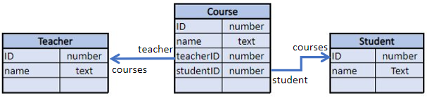
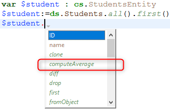

ORDA permite-lhe criar funções de classe de alto nível acima do modelo de dados. Isto permite-lhe escrever código orientado para o negócio e "publicá-lo" tal como uma API. Datastore, classes de dados, seleções de entidades e entidades estão todos disponíveis como objetos de classe que podem conter funções.

Por exemplo, pode criar uma função `getNextWithHigherSalary()` na classe `EmployeeEntity` para devolver os empregados com um salário superior ao selecionado. Seria tão simples como chamar:

```4d
$nextHigh:=ds. Employee.get(1).getNextWithHigherSalary()
```

Os desenvolvedores podem não só utilizar estas funções em datastores locais, mas também em arquiteturas cliente/servidor e remotas:

```4d
 //$cityManager é a referência de um datastore remoto
Form.comp.city:=$cityManager.City.getCityName(Form.comp.zipcode)
```

Graças a esta caraterística, toda a lógica comercial da sua aplicação 4D pode ser armazenada como uma camada independente para que possa ser facilmente mantida e reutilizada com um alto nível de segurança:

- É possível "esconder" a complexidade global da estrutura física subjacente e expor apenas funções compreensíveis e prontas a utilizar.

- Se a estrutura física evoluir, pode simplesmente adaptar o código da função e as aplicações cliente continuarão a chamá-las de forma transparente.

- Por predefinição, todas as suas funções de classe do modelo de dados (incluindo [funções de atributo computadas](#computed-attributes-1)) e [atributos de alias](#alias-attributes-1) não são **expostas** a aplicações remotas e não podem ser chamadas a partir de pedidos REST. É necessário declarar explicitamente cada função pública e alias com a palavra-chave [`exposed`](#exposed-vs-non-exposed-functions) .


Além disso, 4D [pré-criou automaticamente](#creating-classes) as classes para cada objeto de modelo de dados disponível.


## Arquitetura

A ORDA fornece **classes genéricas** expostas através da loja de classes **`4D`** [](Concepts/classes.md#class-stores), bem como **classes de utilizador** (que estendem as classes genéricas) expostas na loja de classes **`cs`** [](Concepts/classes.md#class-stores):


Todas as classes do modelo de dados ORDA são expostas como propriedades do armazenamento de classes **`cs`** . Estão disponíveis as seguintes classes ORDA:

| Class                       | Nome do exemplo       | Instanciado por                                                                                                                                                                                                                                                                                                                                                                                                                                                                                                                                                                                                                                                                                                                                                                                                                                                        |
| --------------------------- | --------------------- | ---------------------------------------------------------------------------------------------------------------------------------------------------------------------------------------------------------------------------------------------------------------------------------------------------------------------------------------------------------------------------------------------------------------------------------------------------------------------------------------------------------------------------------------------------------------------------------------------------------------------------------------------------------------------------------------------------------------------------------------------------------------------------------------------------------------------------------------------------------------------- |
| cs. DataStore               | cs. DataStore         | comando [`ds`](API/DataStoreClass.md#ds)                                                                                                                                                                                                                                                                                                                                                                                                                                                                                                                                                                                                                                                                                                                                                                                                                               |
| cs.*DataClassName*          | cs. Employee          | [`dataStore. DataClassName`](API/DataStoreClass.md#dataclassname), `dataStore["DataClassName"]`                                                                                                                                                                                                                                                                                                                                                                                                                                                                                                                                                                                                                                                                                                                                                                        |
| cs.*DataClassName*Entity    | cs. EmployeeEntity    | [`dataClass.get()`](API/DataClassClass.md#get), [`dataClass.new()`](API/DataClassClass.md#new), [`entitySelection.first()`](API/EntitySelectionClass.md#first), [`entitySelection.last()`](API/EntitySelectionClass.md#last), [`entity.previous()`](API/EntityClass.md#previous), [`entity.next()`](API/EntityClass.md#next), [`entity.first()`](API/EntityClass.md#first), [`entity.last()`](API/EntityClass.md#last), [`entity.clone()`](API/EntityClass.md#clone)                                                                                                                                                                                                                                                                                                                                                                                                   |
| cs.*DataClassName*Selection | cs. EmployeeSelection | [`dataClass.query()`](API/DataClassClass.md#query), [`entitySelection.query()`](API/EntitySelectionClass.md#query), [`dataClass.all()`](API/DataClassClass.md#all), [`dataClass.fromCollection()`](API/DataClassClass.md#fromcollection), [`dataClass.newSelection()`](API/DataClassClass.md#newselection), [`entitySelection.drop()`](API/EntitySelectionClass.md#drop), [`entity.getSelection()`](API/EntityClass.md#getselection), [`entitySelection.and()`](API/EntitySelectionClass.md#and), [`entitySelection.minus()`](API/EntitySelectionClass.md#minus), [`entitySelection.or()`](API/EntitySelectionClass.md#or), [`entitySelection.orderBy()`](API/EntitySelectionClass.md#or), [`entitySelection.orderByFormula()`](API/EntitySelectionClass.md#orderbyformula), [`entitySelection.slice()`](API/EntitySelectionClass.md#slice), `Create entity selection` |

> As classes de utilizador ORDA são armazenadas como arquivos de classe normais (.4dm) na subpasta Classes do projeto [(ver abaixo)](#class-files).

Além disso, as instâncias de objetos das classes de usuárioes do modelo de dados ORDA beneficiam das propriedades e funções dos seus pais:

- um objeto da classe Datastore pode chamar funções da classe genérica [ORDA Datastore](API/DataStoreClass.md).
- um objeto da classe Dataclass pode chamar funções da classe genérica [ORDA Dataclass](API/DataClassClass.md).
- um objeto da classe Seleção de entidades pode chamar funções da classe genérica [ORDA Seleção de entidades](API/EntitySelectionClass.md).
- um objeto da classe Entidade pode chamar funções da classe genérica [ORDA Entity](API/EntityClass.md).


## Descrição da classe

<details><summary>Histórico</summary>

| Release | Mudanças                                                                                                                |
| ------- | ----------------------------------------------------------------------------------------------------------------------- |
| 19 R4   | Atributos alias na Entity Class                                                                                         |
| 19 R3   | Atributos calculados en la Entity Class                                                                                 |
| 18 R5   | As funções de classe do modelo de dados não são expostas ao REST por defeito. Novas palavras-chave `exposed` e `local`. |
</details>


### Classe DataStore


Uma base de dados 4D expõe a sua própria classe DataStore na loja de classes `cs` .

- **Extends**: 4D. DataStoreImplementation
- **Class name**: cs. DataStore

É possível criar funções na classe DataStore que estarão disponíveis através do objeto `ds`.

#### Exemplo

```4d  
// cs. DataStore class Class extends DataStoreImplementation Function getDesc
  $0:="Database exposing employees and their companies"
```


Esta função pode então ser chamada:

```4d
$desc:=ds.getDesc() //"Database exposing..."
```


### Classe DataClass

Cada tabela exposta com ORDA oferece uma classe DataClass no armazenamento de classes `cs`.

- **Extends**: 4D. DataClass
- **Nome da classe**: cs.*DataClassName* (em que *DataClassName* é o nome da tabela)
- **Example name**: cs. Employee


#### Exemplo

```4D
// cs. Company class Class extends DataClass

// Returns companies whose revenue is over the average
// Returns an entity selection related to the Company DataClass Function GetBestOnes()
 $sel:=This.query("revenues >= :1";This.all().average("revenues"));
 $0:=$sel
```

Em seguida, pode obter uma seleção de entidades das "melhores" empresas através da execução:


```4d
    var $best : cs. CompanySelection
 $best:=ds. Company. GetBestOnes()
```

> [Os atributos computados](#computed-attributes) são definidos na classe de entidade [](#entity-class).


#### Exemplo com um datastore remoto

O seguinte catálogo *City* está exposto num datastore remoto (vista parcial):


A classe `City` fornece uma API:

```4d  
// cs. City class Class extends DataClass Function getCityName()
 var $1; $zipcode : Integer
 var $zip : 4D. Entity
 var $0 : Text

 $zipcode:=$1
 $zip:=ds. ZipCode.get($zipcode)
 $0:="" 

 If ($zip#Null)
  $0:=$zip.city.name
 End if
```

A aplicação cliente abre uma sessão no datastore remoto:

```4d
$cityManager:=Open datastore(New object("hostname";"127.0.0.1:8111");"CityManager")
```

Em seguida, uma aplicação cliente pode utilizar a API para obter a cidade correspondente a um código postal (por exemplo) a partir de um formulário:

```4d
Form.comp.city:=$cityManager. City.getCityName(Form.comp.zipcode)

```


### Classe EntitySelection

Cada tabela exposta com ORDA oferece uma classe EntitySelection no repositório de classes `cs` .

- **Extends**: 4D. EntitySelection
- **Nome da classe**: *DataClassName*Seleção (em que *DataClassName* é o nome da tabela)
- **Exemplo de nome**: cs.EmployeeSelection


#### Exemplo

```4d
// Class cs.EmployeeSelection 


Class extends EntitySelection

//Extrair os empregados com um salário superior à média desta seleção de entidades 

Function withSalaryGreaterThanAverage
    C_OBJECT($0)
    $0:=This.query("salary > :1";This.average("salary")).orderBy("salary")

```

Em seguida, é possível obter empregados com um salário superior à média em qualquer seleção de entidade através da execução:

```4d
$moreThanAvg:=ds. Company.all().employees.withSalaryGreaterThanAverage()
```

### Entity Class

Cada tabela exposta com ORDA oferece uma classe de Entidade no armazenamento de classes `cs`.

- **Extends**: 4D. Entity
- **Nome da classe**: *DataClassName*Entity (em que *DataClassName* é o nome da tabela)
- **Example name**: cs. CityEntity

#### Atributos calculados

As classes de entidades permitem-lhe definir **atributos computados** utilizando palavras-chave específicas:

- `Function get` *attributeName*
- `Function set` *attributeName*
- `Function query` *attributeName*
- `Function orderBy` *attributeName*

Para obter informações, consulte a secção [Atributos calculados](#computed-attributes-1).

#### Atributos de Alias

As classes de entidades permitem definir **atributos de alias (apelido)**, normalmente sobre atributos relacionados, utilizando a palavra-chave `Alias` :

`Nome alternativo` *attributeName* *targetPath*

Para obter informações, consulte a seção [Atributos de pseudônimo](#alias-attributes-1) .


#### Exemplo

```4d
// cs. CityEntity class Class extends Entity Function getPopulation()
    $0:=This.zips.sum("population") Function isBigCity C_BOOLEAN($0)
// The getPopulation() function is usable inside the class
$0:=This.getPopulation()>50000
```

Em seguida, pode chamar este código:

```4d
var $cityManager; $city : Object

$cityManager:=Open datastore(New object("hostname";"127.0.0.1:8111");"CityManager")
$city:=$cityManager. City.getCity("Caguas") If ($city.isBigCity())
 ALERT($city.name + " is a big city")
End if
```

### Regras específicas

Ao criar ou editar classes de modelo de dados, é necessário preste atenção às seguintes regras:

- Já que são utilizadas para definir nomes de classes DataClass automáticas no armazenamento de classes **cs** [](Concepts/classes.md#class-stores), as tabelas 4D devem ser nomeadas de modo a evitar qualquer conflito no namespace **cs** . Em particular:
    - Não dê o mesmo nome a uma tabela 4D e a um nome de classe de utilizador [](Concepts/classes.md#class-names). Se isso acontecer, o construtor da classe de utilizador torna-se inutilizável (o compilador emite um aviso).
    - Não use um nome reservado para uma tabela 4D (por exemplo, "DataClass").

- Ao definir uma classe, certifique-se de que a instrução [`Class extends`](Concepts/classes.md#class-extends-classnameclass) corresponde exatamente ao nome da classe-mãe (lembre-se de que são sensíveis a maiúsculas e minúsculas). Por exemplo, `Class extends EntitySelection` para uma classe de seleção de entidades.

- Não é possível instanciar um objeto de classe de modelo de dados com a palavra-chave `new()` (é devolvido um erro). É necessário utilizar um método normal, tal como indicado na coluna [`Instantiated by` da tabela de classes ORDA](#architecture).

- Não é possível substituir uma função de classe ORDA nativa da loja de classes **`4D`** [](Concepts/classes.md#class-stores) por uma função de classe de utilizador do modelo de dados.


### Execução preventiva

Quando compiladas, as funções da classe do modelo de dados são executadas:

- em **processos preemptivos ou cooperativos** (dependendo do processo de chamada) em aplicações de utilizador único,
- em **processos preemptivos** em aplicações cliente/servidor (exceto se for utilizada a palavra-chave [`local`](#local-functions) , caso em que depende do processo de chamada, como no utilizador único).

Se o seu projeto foi concebido para ser executado em cliente/servidor, certifique-se de que o código da função da classe do modelo de dados é thread-safe. Se o código thread-unsafe for chamado, será lançado um erro em tempo de execução (nenhum erro será lançado em tempo de compilação, uma vez que a execução cooperativa é suportada em aplicações de utilizador único).


## Atributos calculados


### Visão Geral

Um atributo computado é um atributo de classe de dados com um tipo de dados que oculta um cálculo. [As classes 4D standard](Concepts/classes.md) implementam o conceito de propriedades computadas com `get` (*getter*) e `set` (*setter*) [funções de acesso](Concepts/classes.md#function-get-and-function-set). Os atributos da classe de dados ORDA beneficiam desta caraterística e alargam-na com duas funções adicionais: `query` e `orderBy`.

No mínimo, um atributo computado requer uma função `get` que descreva como o seu valor será calculado. Quando uma função *getter* é fornecida para um atributo, 4D não cria o espaço de armazenamento subjacente no datastore, mas substitui o código da função cada vez que o atributo é acessado. Se o atributo não for acessado, o código nunca é executado.

Um atributo calculado pode também implementar uma função `set` , que é executada sempre que é atribuído um valor ao atributo. A função *setter* descreve o que fazer com o valor atribuído, normalmente redireccionando-o para um ou mais atributos de armazenamento ou, em alguns casos, para outras entidades.

Tal como os atributos de armazenamento, os atributos calculados podem ser incluídos nas consultas ****. Como padrão, quando um atributo calculado for utilizado numa consulta ORDA, o atributo é calculado uma vez por entidade examinada. Em alguns casos, isto é suficiente. No entanto, para um melhor desempenho, especialmente em cliente/servidor, os atributos computados podem implementar uma função `query` que se baseia nos atributos reais da classe de dados e beneficia dos seus índices.

Do mesmo modo, os atributos calculados podem ser incluídos em **sorts**. Quando um atributo calculado é utilizado numa ordenação ORDA, o atributo é calculado uma vez por entidade examinada. Tal como nas consultas, os atributos calculados podem implementar uma função `orderBy` que substitui outros atributos durante a ordenação, aumentando assim o desempenho.


### Como definir atributos computados

Cria-se um atributo computado definindo um acessor `get` na classe de entidade [****](#entity-class) da classe de dados. O atributo computado estará automaticamente disponível nos atributos da classe de dados e nos atributos da entidade.

Outras funções de atributos computados (`set`, `query`, e `orderBy`) podem também ser definidas na classe de entidade. São facultativos.

Nas funções de atributos calculados, [`This`](Concepts/classes.md#this) designa a entidade. Os atributos calculados podem ser utilizados e tratados como qualquer atributo de classe de dados, ou seja, serão processados pelas funções [entity class](API/EntityClass.md) ou [entity selection class](API/EntitySelectionClass.md) .

> Os atributos calculados ORDA não são [**expostos**](#exposed-vs-non-exposed-functions) por defeito. Expõe-se um atributo calculado adicionando a palavra-chave `exposed` à definição da função get ****.

> **As funções get e set** podem ter a propriedade [**local**](#local-functions) para otimizar o processamento cliente/servidor.


### `Function get <attributeName>`

#### Sintaxe

```4d
{local} {exposed} Function get <attributeName>({$event : Object}) -> $result : type
// code
```
A função *getter* é obrigatória para declarar o atributo computado *attributeName* . Sempre que o atributo *attributeName* é acedido, 4D avalia o código `Function get` e devolve o valor *$result* .

> Um atributo calculado pode utilizar o valor de outro(s) atributo(s) calculado(s). As chamadas recursivas geram erros.

A função *getter* define o tipo de dados do atributo calculado graças ao parâmetro *$result*. São permitidos os seguintes tipos de resultados:

- Scalar (text, boolean, date, time, number)
- Object
- Imagem
- BLOB
- Entity (i.e. cs. EmployeeEntity)
- Entity selection (i.e. cs. EmployeeSelection)

O parâmetro *$event* contém as seguintes propriedades:

| Propriedade   | Tipo         | Descrição                                                                                              |
| ------------- | ------------ | ------------------------------------------------------------------------------------------------------ |
| attributeName | Text         | Nome do atributo computado                                                                             |
| dataClassName | Text         | Nome do dataclass                                                                                      |
| kind          | Text         | "get"                                                                                                  |
| resultado     | Diferente de | Opcional. Adicione esta propriedade com o valor Null se pretender que um atributo escalar devolva Null |


#### Exemplos

- atributo calculado *fullName*:

```4d
Function get fullName($event : Object)-> $fullName : Text

  Case of   
    : (This.firstName=Null) & (This.lastName=Null)
        $event.result:=Null //use resultado para retornar Null
    : (This.firstName=Null)
        $fullName:=This.lastName
    : (This.lastName=Null)
        $fullName:=This.firstName
    Else 
        $fullName:=This.firstName+" "+This.lastName
    End case 
```

- Um atributo calculado pode ser baseado num atributo relacionado com uma entidade:

```4d
Function get bigBoss($event : Object)-> $result: cs. EmployeeEntity
    $result:=This.manager.manager

```

- Um atributo calculado pode ser baseado num atributo relacionado com a seleção de uma entidade:

```4d
Function get coWorkers($event : Object)-> $result: cs. EmployeeSelection
    If (This.manager.manager=Null)
        $result:=ds. Employee.newSelection()
    Else 
        $result:=This.manager.directReports.minus(this)
    End if
```

### `Function set <attributeName>`


#### Sintaxe

```4d

{local} Conjunto de funções <attributeName>($value : type {; $event : Object})
// código
```

A função *setter* é executada sempre que é atribuído um valor ao atributo. Esta função processa normalmente o(s) valor(es) de entrada e o resultado é enviado entre um ou mais atributos.

O parâmetro *$value* recebe o valor atribuído ao atributo.

O parâmetro *$event* contém as seguintes propriedades:

| Propriedade   | Tipo         | Descrição                              |
| ------------- | ------------ | -------------------------------------- |
| attributeName | Text         | Nome do atributo computado             |
| dataClassName | Text         | Nome do dataclass                      |
| kind          | Text         | "set"                                  |
| value         | Diferente de | Valor a tratar pelo atributo calculado |

#### Exemplo

```4d
Function set fullName($value : Text; $event : Object)
    var $p : Integer
    $p:=Position(" "; $value)       
    This.firstname:=Substring($value; 1; $p-1)  // "" if $p<0
    This.lastname:=Substring($value; $p+1)
```


### `Function query <attributeName>`

#### Sintaxe

```4d
Function query <attributeName>($event : Object)
Function query <attributeName>($event : Object) -> $result : Text Function query <attributeName>($event : Object) -> $result : Object
// code
```

Esta função suporta três sintaxes:

- Com a primeira sintaxe, toda a consulta é tratada através da propriedade do objeto `$event.result` .
- Com a segunda e terceira sintaxes, a função devolve um valor em *$result*:
    - Se *$result* for um Texto, tem de ser uma cadeia de consulta válida
    - Se *$result* for um Objeto, deve conter duas propriedades:

    | Propriedade        | Tipo       | Descrição                                                          |
    | ------------------ | ---------- | ------------------------------------------------------------------ |
    | $result.query      | Text       | Cadeia de consulta válida com marcadores de posição (:1, :2, etc.) |
    | $result.parameters | Collection | valores para marcadores                                            |

A função `query` é executada sempre que é lançada uma consulta que utiliza o atributo calculado. É útil personalizar e otimizar as consultas com base em atributos indexados. Quando a função `query` não estiver implementada para um atributo calculado, a pesquisa é sempre sequencial (com base na avaliação de todos os valores utilizando a função `get <AttributeName>`).

> As seguintes características não são suportadas: - chamar uma função `de consulta` em atributos computados do tipo Entidade ou seleção de Entidade, - utilizar a palavra-chave `order by` na cadeia de consulta resultante.

O parâmetro *$event* contém as seguintes propriedades:

| Propriedade   | Tipo         | Descrição                                                                                                                                                                                                                                                                                                                                                                      |
| ------------- | ------------ | ------------------------------------------------------------------------------------------------------------------------------------------------------------------------------------------------------------------------------------------------------------------------------------------------------------------------------------------------------------------------------ |
| attributeName | Text         | Nome do atributo computado                                                                                                                                                                                                                                                                                                                                                     |
| dataClassName | Text         | Nome do dataclass                                                                                                                                                                                                                                                                                                                                                              |
| kind          | Text         | "query"                                                                                                                                                                                                                                                                                                                                                                        |
| value         | Diferente de | Valor a tratar pelo atributo calculado                                                                                                                                                                                                                                                                                                                                         |
| operator      | Text         | Operador de consulta (ver também a consulta [`` função de classe](API/DataClassClass.md#query)). Valores possíveis:<li>== (igual a, @ é um wildcard)</li><li>=== (igual a, @ não é wildcard)</li><li>!= (não é igual a, @ é um wildcard)</li><li>!== (não é igual a, @ não é wildcard)</li><li>< (menor que)</li><li><= (less than or equal to)</li><li>> (maior que)</li><li>>= (maior ou igual a)</li><li>IN (incluído em)</li><li>% (contém palavra-chave)</li> |
| resultado     | Diferente de | Valor a tratar pelo atributo calculado. Passe `Null` nesta propriedade se quiser deixar 4D executar a consulta padrão (sempre seqüencial para atributos computados).                                                                                                                                                                                                           |

> Se a função devolver um valor em *$result* e for atribuído outro valor à propriedade `$event.result` , a prioridade é dada a `$event.result`.

#### Exemplos

- Consulta do atributo computorizado *fullName* .

```4d
Function query fullName($event : Object)->$result : Object

    var $fullname; $firstname; $lastname; $query : Text
    var $operator : Text
    var $p : Integer
    var $parameters : Collection

    $operator:=$event.operator
    $fullname:=$event.value

    $p:=Position(" "; $fullname) 
    If ($p>0)
        $firstname:=Substring($fullname; 1; $p-1)+"@"
        $lastname:=Substring($fullname; $p+1)+"@"
        $parameters:=New collection($firstname; $lastname) // dois itens da coleção
    Else 
        $fullname:=$fullname+"@"
        $parameters:=New collection($fullname) // item único da coleção
    End if 

    Case of 
    : ($operator="==") | ($operator="===")
        If ($p>0)
            $query:="(firstName = :1 and lastName = :2) or (firstName = :2 and lastName = :1)"
        Else 
            $query:="firstName = :1 or lastName = :1"
        End if 
    : ($operator="!=")
        If ($p>0)
            $query:="firstName != :1 and lastName != :2 and firstName != :2 and lastName != :1"
        Else 
            $query:="firstName != :1 and lastName != :1"
        End if 
    End case 

    $result:=New object("query"; $query; "parameters"; $parameters)
```

> Não esquecer que a utilização de espaços reservados nas consultas baseadas na introdução de texto pelo utilizador é recomendada por razões de segurança (ver [`query()` description](API/DataClassClass.md#query)).

Código de chamada, por exemplo:

```4d
$emps:=ds. Employee.query("fullName = :1"; "Flora Pionsin")
```

- Esta função trata as consultas do atributo calculado *age* e devolve um objeto com parâmetros:

```4d
Function query age($event : Object)->$result : Object

    var $operator : Text
    var $age : Integer
    var $_ages : Collection

    $operator:=$event.operator

    $age:=Num($event.value)  // inteiro
    $d1:=Add to date(Current date; -$age-1; 0; 0)
    $d2:=Add to date($d1; 1; 0; 0)
    $parameters:=New collection($d1; $d2)

    Case of 

        : ($operator="==")
            $query:="birthday > :1 and birthday <= :2"  // depois d1 e antes ou igual a d2

        : ($operator="===") 

            $query:="birthday = :2"  // d2 = segunda data calculada (= data nascimento)

        : ($operator=">=")
            $query:="birthday <= :2"

            //... outros operadores           


    End case 


    If (Undefined($event.result))
        $result:=New object
        $result.query:=$query
        $result.parameters:=$parameters
    End if

```

Código de chamada, por exemplo:

```4d
// pessoas com idades entre 20 e 21 anos (-1 dia)
$twenty:=people.query("age = 20") // chama o caso "=="

// pessoas com 20 anos hoje
$twentyToday:=people.query("age === 20") // equivalente a people.query("age is 20") 

```


### `Function orderBy <attributeName>`

#### Sintaxe

```4d
Function orderBy <attributeName>($event : Object)
Function orderBy <attributeName>($event : Object)-> $result : Text

// código
```

A função `orderBy` é executada sempre que for necessário ordenar o atributo calculado. Permite ordenar o atributo calculado. Por exemplo, pode ordenar *fullName* pelos nomes próprios e depois pelos apelidos, ou vice-versa. Quando a função `orderBy` não está implementada para um atributo calculado, a ordenação é sempre sequencial (com base na avaliação de todos os valores utilizando a função `get <AttributeName>`).

> A chamada de uma função `orderBy` em atributos calculados do tipo classe Entidade ou classe de seleção Entidade **não é suportada**.

O parâmetro *$event* contém as seguintes propriedades:

| Propriedade   | Tipo         | Descrição                                                                                         |
| ------------- | ------------ | ------------------------------------------------------------------------------------------------- |
| attributeName | Text         | Nome do atributo computado                                                                        |
| dataClassName | Text         | Nome do dataclass                                                                                 |
| kind          | Text         | "orderBy"                                                                                         |
| value         | Diferente de | Valor a tratar pelo atributo calculado                                                            |
| operator      | Text         | "desc" ou "asc" (padrão)                                                                          |
| descending    | Parâmetros   | `true` para ordem descendente, `false` para ordem ascendente                                      |
| resultado     | Diferente de | Valor a tratar pelo atributo calculado. Passe `Null` se quiser que 4D execute a ordenação padrão. |

> Pode utilizar o operador `` ou a propriedade `descendente` . É essencialmente uma questão de estilo de programação (ver exemplos).

Pode devolver a string de caracteres `orderBy` na propriedade do objeto `$event.result` ou no resultado da função *$result* . Se a função devolver um valor em *$result* e for atribuído outro valor à propriedade `$event.result` , a prioridade é dada a `$event.result`.


#### Exemplo

É possível escrever código condicional:

```4d
Function orderBy fullName($event : Object)-> $result : Text
    If ($event.descending=True)
        $result:="firstName desc, lastName desc" 
    Else 
        $result:="firstName, lastName" 
    End if
```

Também pode escrever código compacto:

```4d
Function orderBy fullName($event : Object)-> $result : Text
    $result:="firstName "+$event.operator+", "lastName "+$event.operator

```

O código condicional é necessário em alguns casos:

```4d
Function orderBy age($event : Object)-> $result : Text

    If ($event.descending=True)
        $result:="birthday asc" 
    Else 
        $result:="birthday desc" 
    End if

```


## Atributos de Alias

### Visão Geral

Um atributo **alias** é construído por cima de outro atributo do modelo de dados, denominado **target** attribute. O atributo de destino pode pertencer a uma classe de dados relacionada (disponível através de qualquer número de níveis de relação) ou à mesma classe de dados. Um atributo de alias não armazena dados, mas sim o caminho para o seu atributo de destino. É possível definir tantos atributos de alias quanto se pretenda numa classe de dados.

Os atributos de alias (pseudônimo) são particularmente úteis para tratar relações N para N. Proporcionam maior legibilidade e simplicidade no código e nas consultas, permitindo basear-se em conceitos comerciais em vez de pormenores de implementação.

### Como definir atributos alias

Cria-se um atributo de alias numa classe de dados utilizando a palavra-chave `Alias` na  [**classe de entidade**](#entity-class) da classe de dados.


### `Alias <attributeName> <targetPath>`


#### Sintaxe

```
{exposed} Alias <attributeName> <targetPath>
```

*attributeName* deve estar em conformidade com as regras normalizadas [para nomes de propriedades](../Concepts/identifiers.md#object-properties).

*targetPath* é um atributo path que contém um ou mais níveis, como por exemplo "employee.company.name". Se o atributo de destino pertencer à mesma classe de dados, *targetPath* é o nome do atributo.

Um alias pode ser utilizado como parte de um caminho de outro alias.

Um  [atributo computado](#computed-attributes-1) pode ser utilizado num caminho de alias, mas apenas como o último nível do caminho; caso contrário, é devolvido um erro. Por exemplo, se "fullName" for um atributo computado, é válido um alias com o caminho "employee.fullName".

> Os atributos dos pseudónimos ORDA são **não expostos** por defeito. É necessário adicionar a palavra-chave [`exposed`](#exposed-vs-non-exposed-functions) antes da palavra-chave `Alias` se pretender que o alias esteja disponível para pedidos remotos.


### Utilizar atributos alias

Os atributos de alias são apenas de leitura (exceto quando baseados num atributo escalar da mesma classe de dados, ver o último exemplo abaixo). Podem ser utilizados em vez do caminho do atributo de destino em funções de classe como:

| Function                                       |
| ---------------------------------------------- |
| `dataClass.query()`, `entitySelection.query()` |
| `entity.toObject()`                            |
| `entitySelection.toCollection()`               |
| `entitySelection.extract()`                    |
| `entitySelection.orderBy()`                    |
| `entitySelection.orderByFormula()`             |
| `entitySelection.average()`                    |
| `entitySelection.count()`                      |
| `entitySelection.distinct()`                   |
| `entitySelection.sum()`                        |
| `entitySelection.min()`                        |
| `entitySelection.max()`                        |
| `entity.diff()`                                |
| `entity.touchedAttributes()`                   |

> Tenha em atenção que os atributos alias são calculados no servidor. Em configurações remotas, a atualização de atributos de alias em entidades requer que as entidades sejam recarregadas a partir do servidor.

### Propriedades alias

Atributo de alias [`kind`](../API/DataClassClass.md#attributename) é "alias".

Um atributo alias herda seu tipo de dados [`type`](../API/DataClassClass.md#attributename) do atributo destino:

- se o atributo de destino [`kind`](../API/DataClassClass.md#attributename) for "storage", o tipo de dados do alias será do mesmo tipo,
- se o atributo de destino [`kind`](../API/DataClassClass.md#attributename) for "relatedEntity" ou "relatedEntities", o tipo de dados do alias é do tipo `4D.Entity` ou `4D.EntitySelection` ("*classname*Entity" ou "*classname*Selection").

Os atributos alias baseados em relações têm uma propriedade [`path`](../API/DataClassClass.md#attributename) específica, que contém o caminho dos seus atributos de destino. Os atributos de alias baseados em atributos da mesma classe de dados têm as mesmas propriedades que os seus atributos de destino (e nenhuma propriedade  `path` ).


### Exemplos

Considerando o seguinte modelo:



Na classe de dados Teacher, um atributo alias devolve todos os alunos de um professor:

```4d
// cs.TeacherEntity class

Class extends Entity

Alias students courses.student //relatedEntities 
```

Na classe de dados Student, um atributo alias devolve todos os professores de um aluno:


```4d
// cs. StudentEntity class Class extends Entity Alias teachers courses.teacher //relatedEntities 
```

Na classe de dados Curso:

- um atributo alias devolve outra etiqueta para o atributo "name".
- um atributo alias devolve o nome do professor
- um atributo alias devolve o nome do aluno


```4d
// cs. CourseEntity class Class extends Entity Exposed Alias courseName name //scalar Exposed Alias teacherName teacher.name //scalar value Exposed Alias studentName student.name //scalar value

```

Em seguida, é possível executar as seguintes consultas:

```4d
// Find course named "Archaeology"
ds. Course.query("courseName = :1";"Archaeology")

// Find courses given by the professor Smith
ds. Course.query("teacherName = :1";"Smith")

// Find courses where Student "Martin" assists
ds. Course.query("studentName = :1";"Martin")

// Find students who have M. Smith as teacher 
ds. Student.query("teachers.name = :1";"Smith")

// Find teachers who have M. Martin as Student
ds. Teacher.query("students.name = :1";"Martin")
// Note that this very simple query string processes a complex 
// query including a double join, as you can see in the queryPlan:   
// "Join on Table : Course  :  Teacher.ID = Course.teacherID,    
//  subquery:[ Join on Table : Student  :  Course.studentID = Student.ID,
//  subquery:[ Student.name === Martin]]"
```


Também é possível editar o valor do alias *courseName* :

```4d
// Rename a course using its alias attribute
$arch:=ds. Course.query("courseName = :1";"Archaeology")
$arch.courseName:="Archaeology II"
$arch.save() //courseName and name are "Archaeology II"
```


## Funções expostas vs não expostas

For security reasons, all of your data model class functions are **not exposed** (i.e., private) by default to remote requests.

Os pedidos remotos incluem:

- Pedidos enviados por aplicações 4D remotas ligadas através de `Open datastore`
- Pedidos REST

> Os pedidos regulares de cliente/servidor 4D não são afetados. As funções de classe do modelo de dados estão sempre disponíveis nesta arquitetura.

Uma função que não esteja exposta não está disponível em aplicações remotas e não pode ser chamada em qualquer instância de objeto a partir de um pedido REST. Se uma aplicação remota tentar aceder a uma função não exposta, é devolvido o erro "-10729 - Método de membro desconhecido".

Para permitir que uma função de classe de modelo de dados seja chamada por um pedido remoto, é necessário declará-la explicitamente utilizando a palavra-chave `exposed` . A sintaxe formal é:

```4d  
// declarar uma função exposta
Função exposta <functionName>   
```

> A palavra-chave `exposed` só pode ser utilizada com funções de classe de modelo de dados. Se for utilizada com uma função [da classe de usuário regular](Concepts/classes.md) , é ignorada e o compilador devolve um erro.

### Exemplo

Se quiser que uma função exposta utilize uma função privada numa classe de dataclass:

```4d
Class extends DataClass

//Public function
exposed Function registerNewStudent($student : Object) -> $status : Object

var $entity : cs. StudentsEntity

$entity:=ds. Students.new()
$entity.fromObject($student)
$entity.school:=This.query("name=:1"; $student.schoolName).first()
$entity.serialNumber:=This.computeSerialNumber()
$status:=$entity.save()

//Not exposed (private) function Function computeIDNumber()-> $id : Integer
//compute a new ID number
$id:=...

```

Quando o código é chamado:

```4d
var $remoteDS; $student; $status : Object
var $id : Integer

$remoteDS:=Open datastore(New object("hostname"; "127.0.0.1:8044"); "students")
$student:=New object("firstname"; "Mary"; "lastname"; "Smith"; "schoolName"; "Math school")

$status:=$remoteDS. Schools.registerNewStudent($student) // OK
$id:=$remoteDS. Schools.computeIDNumber() // Error "Unknown member method" 
```


## Funções locais

Por padrão, na arquitetura cliente/servidor, as funções do modelo de dados ORDA são executadas **no servidor**. Normalmente, proporciona o melhor desempenho, uma vez que apenas o pedido de função e o resultado são enviados através da rede.

No entanto, pode acontecer que uma função seja totalmente executável no lado do cliente (por exemplo, quando processa dados que já estão na cache local). Neste caso, pode poupar pedidos ao servidor e, assim, melhorar o desempenho da aplicação, inserindo a palavra-chave `local` . A sintaxe formal é:

```4d  
// declarar uma função para executar localmente no cliente/servidor
local Function <functionName>   
```

Com esta palavra-chave, a função será sempre executada no lado do cliente.

> A palavra-chave `local` só pode ser utilizada com funções de classe de modelo de dados. Se for utilizada com uma função [da classe de usuário regular](Concepts/classes.md) , é ignorada e o compilador devolve um erro.

Note-se que a função funcionará mesmo que eventualmente seja necessário aceder ao servidor (por exemplo, se a cache ORDA tiver expirado). No entanto, é altamente recomendável certificar-se de que a função local não acede a dados no servidor, caso contrário a execução local não poderá trazer qualquer benefício em termos de desempenho. Uma função local que gera muitos pedidos ao servidor é menos eficiente do que uma função executada no servidor que apenas devolveria os valores resultantes. Por exemplo, considere a seguinte função na classe de entidade Escolas:

```4d
// Obter os alunos mais novos  
// Uso inapropriado da palavra-chave local
local Function getYoungest
    var $0 : Object
    $0:=This.students.query("birthDate >= :1"; !2000-01-01!).orderBy("birthDate desc").slice(0; 5)
```
- **sem** a palavra-chave `local` , o resultado é dado através de um único pedido
- **Com** a palavra-chave `local` , são necessários 4 pedidos: um para obter a entidade Schools students, um para `query()`, um para `orderBy()`, e um para `slice()`. Neste exemplo, a utilização da palavra-chave `local` não é adequada.


### Exemplos

#### Cálculo da idade

Dada uma entidade com um atributo *birthDate* , pretendemos definir uma função `age()` que seria chamada numa caixa de listagem. Esta função pode ser executada no cliente, o que evita desencadear um pedido ao servidor para cada linha da caixa de listagem.

Na classe *StudentsEntity*:

```4d
Class extends Entity

local Function age() -> $age: Variant
    If (This.birthDate#!00-00-00!)
    If (This.birthDate#!00-00-00!)
    $age:=Year of(Current date)-Year of(This.birthDate)
Else 
    $age:=Null End if
```

#### Verificação de atributos

Pretendemos verificar a consistência dos atributos de uma entidade carregada no cliente e actualizada pelo utilizador antes de solicitar ao servidor que os guarde.

Na classe *StudentsEntity* , a função local `checkData()` verifica a idade do Aluno:

```4d
Classe extends Entity

local Function checkData() -> $status : Object

$status:=New object("success"; True)
Case of
    : (This.age()=Null)
        $status.success:=False
        $status.statusText:="Falta a data de nascimento" 

    :((This.age() <15) | (This.age()>30) )
        $status.success:=False
        $status.statusText:="O estudante tem de ter entre 15 e 30 anos - Este é "+String(This.age())
End case
```

Código de chamada:

```4d
var $status : Object

//Form.student is loaded with all its attributes and updated on a Form
$status:=Form.student.checkData()
If ($status.success)
    $status:=Form.student.save() // call the server End if
```


## Support in 4D projects


### Ficheiros de classe (class files)

Uma classe de usuário do modelo de dados ORDA é definida adicionando, na [mesma localização que os arquivos classe normais](Concepts/classes.md#class-files) (*ou seja.* na pasta `/Sources/Classes` da pasta do projeto), um arquivo .4dm com o nome da classe. Por exemplo, uma classe de entidade para a classe de dados `Utilities` será definida através de um arquivo `UtilitiesEntity.4dm` .


### Criação de classes

4D pré-criou automaticamente classes vazias na memória para cada objeto de modelo de dados disponível.


> Por padrão, as classes ORDA vazias não são exibidas no Explorer. Para as mostrar, é necessário selecionar **Mostrar todas as classes de dados** no menu de opções do Explorador: 

As classes de utilizadores ORDA têm um ícone diferente das classes normais. As classes vazias são escurecidas:


Para criar um arquivo de classe ORDA, basta fazer duplo clique na classe predefinida correspondente no Explorador. 4D cria o arquivo de classe e adiciona o código `extends` . Por exemplo, para uma classe Entity:

```
Class extends Entity
```

Quando uma classe for definida, o seu nome deixa de estar obscurecido no Explorador.


### Edição de classes

To open a defined ORDA class in the 4D method editor, select or double-click on an ORDA class name and use **Edit...** from the contextual menu/options menu of the Explorer window:


Para as classes ORDA baseadas no armazenamento de dados local (`ds`), pode aceder diretamente ao código da classe a partir da janela 4D Structure:


### Editor de método

No Editor de Código 4D, as variáveis digitadas como uma classe ORDA se beneficiam automaticamente das características de autocompletar. Exemplo com uma variável de classe Entity:



