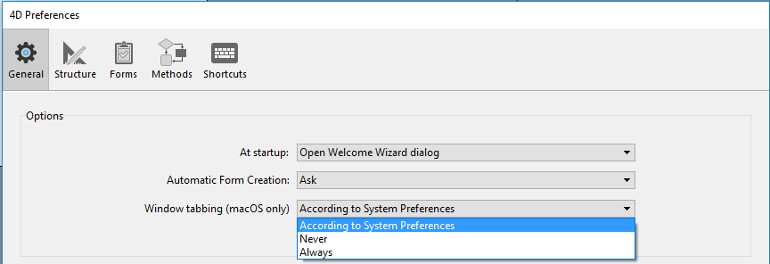

Esta página contém várias opções para configurar o funcionamento geral da sua aplicação 4D.

## Opções

### Na inicialização

Esta opção permite configurar o ecrã 4D por padrão no arranque, quando o usuário inicia apenas a aplicação.

*   **Não fazer nada**: só aparece a janela da aplicação, vazia.
*   **Diálogo Abrir Projeto Local**: 4D apresenta uma caixa de diálogo padrão para abrir um documento, permitindo-lhe selecionar um projeto local.
*   **Abrir o último projeto utilizado**: 4D abre diretamente o último projeto utilizado; não aparece nenhuma caixa de diálogo de abertura. >Para forçar a apresentação da caixa de diálogo de abertura quando esta opção é selecionada, mantenha premida a tecla **Alt** (Windows) ou **Opção** (macOS) enquanto inicia o projeto.
*   **Diálogo Abrir Projeto Remoto**: 4D mostra o diálogo de logon padrão do 4D Server, permitindo selecionar um projeto publicado na rede.
*   **Open last used project**: 4D directly opens the last project used; no opening dialog box appears.
> > > **4D Server**: The 4D Server application ignores this option. In this environment, the **Do nothing** mode is always used.

### Criação de formulários automática

> This option is only used in binary databases; it is ignored in project architecture. Ver doc.4d.com.

### Janela com guias (somente macOS)

Starting with macOS Sierra, Mac applications can benefit from the Automatic Window Tabbing feature that helps organizing multiple windows: document windows are stacked into a single parent window and can be browsed through tabs. This feature is useful on small screens and/or when using a trackpad.

You can benefit from this feature in the following environments (with 4D 64-bit versions only):

*   Method Editor windows
*   Janelas do editor de formulários

All windows from these editors can be put in tab form:


A set of commands in the **Window** menu allows managing the tabs:


In the 4D's Preferences dialog box, the **Window tabbing** option allows you to control this feature:



Estão disponíveis três opções:

*   **According to System Preferences** (default): 4D windows will behave like defined in the macOS System Preferences (In full screen, Always, or Manually).
*   **Never**: Opening a new document in 4D form editor or method editor will always result in creating a new window (tabs are never created).
*   **Always**: Opening a new document in 4D form editor or method editors will always result in creating a new tab.

### Aspeto (apenas macOS)

This menu lets you select the color scheme to use for the **4D development** environment. The specified scheme will be applied to all editors and windows of the Design mode.

> You can also set the color scheme to use in your **desktop applications** in the "Interface" page of the Settings dialog box.

Estão disponíveis três opções:

*   **According to System Color Scheme Preferences** (default): Use the color scheme defined in the macOS System Preferences.
*   **Claro**: utilizar o tema claro
*   **Escuro**: utilizar o tema escuro

> Esta preferência só é suportada no macOS. No Windows, é sempre utilizado o esquema "Light".


### Sair do modo Desenho ao passar para o modo Aplicação

If this option is checked, when the user switches to the Application environment using the **Test Application** menu command, all the windows of the Design environment are closed. If this option is not checked (factory setting), the windows of the Design environment remain visible in the background of the Application environment.


### Ativar a criação de bases de dados binárias

Se selecionar esta opção, são adicionados dois itens ao menu **Ficheiro > Novo** e ao botão **Novo** da barra de ferramentas:

*   **Base de dados...**
*   **Base de dados a partir da definição da estrutura...**


These items allow you to create binary databases (see [Creating a new database](https://doc.4d.com/4Dv18R6/4D/18-R6/Creating-a-new-database.300-5217610.en.html) section). They are no longer proposed by default because 4D recommends using project-based architecture for new developments.

## Ao criar um novo projeto

### Usar ficheiro de registo

When this option is checked, a log file is automatically started and used when a new database is created. For more information, please refer to [Log file (.journal)](Backup/log.md).

### Criar pacote

When this option is checked, 4D databases are automatically created in a folder suffixed .4dbase.

Thanks to this principle, under macOS the database folders appear as packages having specific properties. No Windows, isto não tem qualquer impacto particular.

### Incluir tokens nos ficheiros de origem do projeto

When this option is checked, saved [method source files](../Project/architecture.md#sources) in new 4D projects will contain **tokens** for classic language and database objects (constants, commands, tables and fields). Tokens are additional characters such as `:C10` or `:5` inserted in the source code files, that allow renaming tables and fields and identifying elements whatever the 4D version (see [Using tokens in formulas](https://doc.4d.com/4Dv19R3/4D/19-R3/Using-tokens-in-formulas.300-5583062.en.html)).

If you intend to use VCS or external code editors with your new projects, you might want to uncheck this option for a better readability of the code with these tools.

> This option can only be applied to projects (binary databases always include tokens).

> You can always get the code with tokens by calling [`METHOD GET CODE`](https://doc.4d.com/4dv19R/help/command/en/page1190.html) with 1 in the *option* parameter.

#### Excluir tokens em projetos existentes

You can configure your existing projects to save code **without tokens** by inserting the following key in the [`<applicationName>.4DProject`](../Project/architecture.md#applicationname4dproject-file) file using a text editor:

```
"tokenizedText": false
```

> Este parâmetro só é tida em conta quando os métodos são guardados. Existing methods in your projects are left untouched, unless you resave them.


### Criar o ficheiro `.gitignore`

You might need or want git to ignore some files in your new projects.

You can set this preference by checking the **Create .gitignore file**  option.

When a project is created in 4D and that box is checked, 4D creates a `.gitignore` file at the same level as the `Project` folder (see [Architecture of a Project](Project/architecture.md#gitignore-file-optional)).

You can define the default contents of the `.gitignore` file by clicking the pencil icon. This will open the .gitignore configuration file in your text editor. The contents of this file will be used to generate the `.gitignore` files in your new projects.

The [official git documentation](https://git-scm.com/docs/gitignore) is a great resource to understand how `.gitignore` files work.

### Linguagem de comparação de texto

This parameter configures the default language used for character string processing and comparison in new databases. The language choice has a direct influence on the sorting and searching of text, as well as the character case, but it has no effect on the translation of texts or on the date, time or currency formats, which remain in the system language. By default (factory setting), 4D uses the current user language set in the system.

A 4D database can thus operate in a language different from that of the system. When a database is opened, the 4D engine detects the language used by the data file and provides it to the language (interpreter or compiled mode). Text comparisons, regardless of whether they are carried out by the database engine or the language, are done in the same language.

When creating a new data file, 4D uses the language previously set in this menu. When opening a data file that is not in the same language as the structure, the data file language is used and the language code is copied into the structure.
> Pode modificar este parâmetro para a base de dados aberta utilizando os parâmetros da base de dados (ver [Comparação de texto](../settings/database.md#text-comparison)).

## Localização da documentação

Esta área configura o acesso à documentação HTML 4D exibida no seu navegador atual:

*   Quando se pressiona a tecla **F1** enquanto o cursor está inserido numa função de classe 4D ou nome de comando no Editor de Código;
*   Ao clicar duas vezes em um comando 4D na **página Comandos** do Explorer.


### Língua da documentação

Linguaje da documentação HTML a apresentar. You can modify it, for example if you want to display documentation in a different language from the application language.

### Procurar primeiro na pasta local

> Esta opção só é tida em conta para o acesso à documentação de comandos (excluindo as funções de classe).

Define onde 4D irá procurar por páginas de documentação.

*   Quando marcado (padrão), 4D primeiro procura a página na pasta local (veja abaixo). Se for encontrado, 4D mostra a página no navegador atual. If it is found, 4D displays the page in the current browser. Desta forma, é possível aceder à documentação mesmo quando se está offline.
*   When it is not checked, 4D looks for the desired page directly in the on-line documentation of the Web site and displays it in the current browser. Se não for encontrado, 4D mostra uma mensagem de erro no navegador.

### Pasta local

> Esta opção só é tida em conta para o acesso à documentação de comandos (excluindo as funções de classe).

Indica a localização da documentação HTML estática. Por padrão, esta é a subpasta \Help\Command\language. Pode ver a localização clicando no menu associado à zona. Se esta subpasta não estiver presente, a localização é apresentada a vermelho.

You can modify this location as desired, for example if you want to display the documentation in a language different from that of the application. The static HTML documentation can be located on another volume, on a web server, etc. To designate a different location, click on the **[...]** button next to the entry area and choose a documentation root folder (folder corresponding to the language: `fr`, `en`, `es`, `de` or `ja`). The static HTML documentation can be located on another volume, on a web server, etc. To designate a different location, click on the [...] button next to the entry area and choose a documentation root folder (folder corresponding to the language: fr, en, es, de or ja). 
