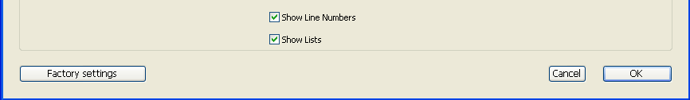

User preferences specify various settings affecting your working environment, e.g. default options, display themes, Code Editor features, shortcuts, etc. They are applied to all projects opened with your 4D or 4D Server application. Eles são aplicados a todos os projetos abertos com sua aplicação 4D ou 4D Server.

**4D Server**: o bloqueio de objetos ocorre quando dois ou mais usuários tentam modificar as definições na caixa de diálogo Preferências em simultâneo. Apenas um usuário pode utilizar a caixa de diálogo Preferências.
> 4D oferece um conjunto diferente de parâmetros específicos para o projeto aberto: **Parâmetros** (disponível no menu **Desenho**). Para mais informações, consulte o capítulo Parâmetros.

## Acesso

Você pode acessar a caixa de diálogo Preferências no menu **Editar> Preferencies...** (Windows) ou no menu da aplicação **4D** (macOS):

Esta opção de menu está disponível mesmo quando não existe nenhum projeto aberto.

Também pode visualizar a caixa de diálogo Preferências no modo Aplicação utilizando a ação padrão "Preferências" (associada a um item de menu ou a um botão) ou utilizando o comando `OPEN SETTINGS WINDOW`.

## Armazenamento

Les réglages effectués dans la boîte de dialogue Préférences sont enregistrés dans un fichier de préférences au format XML nommé **4D Preferences vXX.4DPreferences** qui est stocké dans le dossier 4D actif de l'utilisateur actuel, tel que retourné par la commande [`Get 4D folder`](https://doc.4d.com/4Dv18R6/4D/18-R6/Get-4D-folder.301-5198423.en.html):

*   Windows: `{disk}\Users\\{username\}\AppData\Roaming\4D`
*   macOS: `{disk}:Users:\{username\}:Library:Application Support:4D`

## Personalização de parâmetros e redefinição de configurações

Nas caixas de diálogo de parâmetros, os parâmetros cujos valores foram modificados aparecem a negrito:

As preferências indicadas como personalizadas podem ter sido modificadas diretamente na caixa de diálogo, ou podem ter sido modificadas anteriormente no caso de uma base de dados convertida.

Um parâmetro continua a aparecer a negrito mesmo quando o seu valor é substituído manualmente pelos seus valores por defeito. Desta forma, é sempre possível identificar visualmente quaisquer parâmetros que tenham sido personalizados.

Para repor os parâmetros nos seus valores predefinidos e remover o estilo a negrito que indica que foram personalizados, clique no botão **Repor os parâmetros de fábrica**:

Este botão repõe todos os parâmetros da página atual. Fica ativo quando pelo menos um parâmetro tiver sido modificado na página atual.

