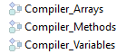

Você pode compilar seus projetos, ou seja, traduzir todos os seus métodos para a linguagem da máquina. Compilar um projeto permite que você verifique a consistência do código e acelere a sua execução, Além de tornar possível ofuscar o código na sua totalidade. A compilação constitui um passo indispensável entre o desenvolvimento de projectos que utilizam o 4D e a sua implantação como aplicações isoladas.


## Compilar

A compilação é tratada do seu aplicativo 4D e é inteiramente automática.

> En macOS, la compilación requiere que instale `Xcode`. Consulte [esta seção](#silicon-compiler) para obter mais informações sobre esse requisito.

1. Abra a janela do compilador selecionando o comando **Compiler...** no menu **Desenho** ou o botão da barra de ferramentas **Compiler**.

    

    

> Você também pode iniciar diretamente a compilação selecionando o item de menu **Iniciar Compilação** do menu **Desenho**.

2. Clique no botão **Compilar** para iniciar a compilação usando as atuais configurações [de compilação](#compiler-settings).

Se nenhum erro for detectado, a compilação atual começa e a mensagem "Compilação com sucesso" é exibida na parte inferior da janela quando a compilação é concluída:


Você pode imediatamente [executar sua aplicação em modo compilado](#run-compiled) e ver o quão mais rápido ela é.

Se erros forem detectados, o processo é interrompido e a mensagem "Compilação falhou" é exibida. A área de informação da janela exibe os nomes de métodos e números de linha envolvidos em uma lista hierárquica:


Clique duas vezes em cada erro detectado para abrir o método ou a classe em questão diretamente no Editor de Código 4D. A linha que contém o erro é destacada e o tipo de erro é exibido na área de sintaxe da janela.

Use os comandos **Previous Error (Erro anterior** )/ **Next Error (Próximo erro** ) do menu **Method (Método** ) para navegar de um erro para o próximo.

O número de erros encontrados durante as suas primeiras compilações pode ser um desafio, mas não deixe isso te avisar. Logo você descobrirá que eles muitas vezes nascem da mesma fonte, ou seja, não conformidade com certas convenções do projeto. O compilador sempre fornece um [diagnóstico preciso](#error-file) dos erros para ajudá-lo a corrigi-los.

> A compilação requer uma licença adequada. Sem esta licença, não é possível realizar uma compilação (os botões estão desativados). No entanto, ainda é possível verificar a sintaxe e gerar métodos de digitação.

## Executar a compilação

Depois que um projeto é compilado, é possível mudar do [modo interpretado para o modo compilado](Concepts/interpreted.md), e vice-versa, a qualquer momento e sem precisar sair do aplicativo 4D (exceto quando o código interpretado tiver sido removido). Para fazer isso, use o tge **Reiniciar Interpretado** e **Reiniciar os comandos** do menu **Executar**. A [caixa de diálogo Abrir projeto](GettingStarted/creating.md#options) também oferece uma opção entre o modo interpretado ou compilado para a inicialização do banco de dados.

Quando você alternar de um modo para o outro, a 4D fecha o modo atual e abre o novo. Isto é equivalente a sair e reabrir a aplicação. Cada vez que você mudar de um modo para outro, O 4D executa os dois seguintes métodos de banco de dados (se especificado) nessa ordem: `On Exit` -> `On Startup`.

Se você modificar seu projeto em modo interpretado, é necessário recompilá-lo para que suas edições sejam consideradas no modo compilado.

## Características da janela do compilador

Além do botão[**Compilar**](#compile), a janela Compilador oferece recursos adicionais que são úteis durante a fase de desenvolvimento do projeto.

### Verificar sintaxe

O botão **Verificar sintaxe** inicia a execução da fase de verificação de sintaxe. No final do processo de verificação, todos os erros detectados são listados na área de informações. Você pode clicar duas vezes em uma linha de erro para exibir o método correspondente.

A verificação de sintaxe também pode ser iniciada diretamente usando o comando **Check Syntax** associado ao botão da barra de ferramentas **Compiler**. Esta é a única opção disponível se você não tiver uma licença adequada para permitir a compilação de aplicativos.

### Gerar digitação

O botão **Generate Typing (Gerar digitação** ) cria ou atualiza os métodos do compilador de digitação. Os métodos do Compilador são métodos do projeto que agrupam todas as declarações de digitação de variável e matriz (processo e interprocesso), assim como os parâmetros do [método](../Concepts/parameters.md#compiler_methods-method). Esses métodos, quando eles existem, são usados diretamente pelo compilador durante a compilação de código, resultando em tempos de compilação mais rápidos.

O nome desses métodos deve começar com `Compiler_`. You can set the default name for each of the 5 compiler methods in the [compiler settings window](#compiler-methods-for). The compiler methods that are generated and maintained by 4D automatically have the `Invisible` attribute:



Only the necessary compiler methods (i.e., those for which items already exist in the project) are generated.

The information area indicates any errors found during method creation or updating. Double-clicking on an error line causes the method and line concerned to be displayed in the Method editor.


### Limpar código compilado

O botão **Limpar código compilado** exclui o código compilado do projeto. When you click on it, all of the [code generated during compilation](#classic-compiler) is deleted, the **Restart Compiled** command of the **Run** menu is disabled and the "Compiled Project" option is not available at startup.


### Mostrar/ocultar avisos

Warnings are specific messages generated by the compiler when it checks the syntax. These messages are intended to draw your attention to statements that might lead to execution errors. Não impedem a compilação.

Depending on circumstances and the programming style used, these warnings may be more or less relevant. You can toggle the warnings on or off by clicking the **Show/Hide Warnings** button:


When this option is checked, the warnings (if any) are displayed in the window, after the other error types. Estas aparecem em itálico:


Um duplo clique num aviso abre o método correspondente.

#### Desativar os avisos durante a compilação

Você pode desativar seletivamente determinados avisos durante a compilação inserindo o seguinte no código de um método 4D:

```4d
  //%W-<warning number>
```

Apenas os avisos com números podem ser desactivados. Os números de aviso são especificados no final de cada mensagem na lista de erros de compilação. Por exemplo, para desativar o seguinte aviso:

*1: Ponteiro numa declaração de array (518.5)*

... você só precisa escrever o seguinte comentário em um método 4D, de preferência um método `COMPILER_xxx` (método compilado primeiro):

```4d
  //%W-518.5
```


## Parâmetros do compilador

The "Compiler" page of the Settings dialog box lets you set parameters related to project compilation. You can directly open this page from the [compiler window](#compiler-window) by clicking on the **Compiler Settings** button:


### Opções de compilação

This area groups the generic options used during the compilation process.

#### Generate symbol file

Used to generate the error file (see [error file](#symbol-file)) at the time of syntax checking. The error file is created in the [Logs folder](Project/architecture.md#logs) of the project with the name `ProjectName_errors.xml`.

#### Gerar ficheiro de erros

Used to generate the error file (see [error file](#error-file)) at the time of syntax checking. The error file is automatically named `projectName_errors.xml` and is placed in the [Logs folder](Project/architecture.md#logs) of the project.


#### Caminho de compilação

Used to set the number of passes (code parsing) performed by the compiler and thus the duration of compilation.

- **Type the variables**: Passes by all the stages that make compilation possible.
- **Process and interprocess variables are typed**: The pass for typing process and interprocess variables as well as method parameters is not carried out. This option can be used when you have already carried out the typing of all your process and interprocess variables either yourself or using the function for automatic generation of compiler methods.
- **All variables are typed**: The pass for typing local, process and interprocess variables as well as method parameters is not carried out. Use this option when you are certain that all the process, interprocess and local variables as well as method parameters have been clearly typed.

#### Objectivo de compilação

<details><summary>Histórico</summary>

| Release | Mudanças   |
| ------- | ---------- |
| 19      | Adicionado |

</details>

Esta configuração permite selecionar a família de processadores para a qual seu projeto 4D deve ser compilado nativamente. O compilador 4D pode criar código nativo para duas famílias de processadores:

- Os processadores **Intel/AMD** (todas as máquinas),
- os processadores **Apple Silicon**.

Duas opções de alvo estão disponíveis. O resultado depende do processador da máquina em que 4D está em execução.

| *Opção*                                                | *no Windows Intel/AMD*                                                                    | *macOS Intel*                                                                                | *no macOS Silicon*                                                                           |
| ------------------------------------------------------ | ----------------------------------------------------------------------------------------- | -------------------------------------------------------------------------------------------- | -------------------------------------------------------------------------------------------- |
| **Todos os processadores (Intel/AMD e Apple Silicon)** | Código para Intel/AMD<br/>*Não é possível produzir código Apple Silicon no Windows* | Code for Apple Silicon + Code for Intel/AMD<br/>*Two compiled codes will be available* | Code for Apple Silicon + Code for Intel/AMD<br/>*Two compiled codes will be available* |
| **O meu processador (processador)**                    | Código para Intel/AMD                                                                     | Código para Intel/AMD                                                                        | Código para Apple Silicon                                                                    |

> O alvo do compilador Apple Silicon requer que o aplicativo **Clang** esteja instalado em sua máquina. Clang vem com a versão mais recente do Xcode. See the [Silicon compiler requirements](#requirements) for more information.

### Digitação por defeito

Use esta área para definir o tipo padrão para objetos de banco de dados ambíguos.

- **Numeric**: Used to force numeric typing in an unambiguous manner, either in real or longint. Isso não substituirá as diretivas que você possa ter definido em seu projeto. Você pode otimizar a execução do seu banco de dados escolhendo o tipo Longint.
- **Button**: Used to force button typing in an unambiguous manner, either in real or longint. Isso não substituirá as diretivas que você possa ter definido em seu projeto. This type applies to buttons as well as check boxes, picture buttons, button grids, radio buttons, picture pop-up menus and drop-down lists.

### Compiler Methods for

Esta área permite renomear os métodos do Compilador gerados automaticamente pelo compilador quando você clica em [Gerar Typing](#generate-typing).

Up to 5 compiler methods may be generated; a compiler method is only generated if the project contains the following items:

- **Variables**: Groups together process variable declarations;
- **Interprocess Variables**: Groups together interprocess variable declarations;
- **Arrays**: Agrupa as declarações de arrays de processos;
- **Interprocess Arrays**: Groups together interprocess array declarations;
- **Methods**: Groups together method parameter declarations (for instance, `C_LONGINT(mymethod;$1;$2)`). For more information, see [`Compiler_Methods` method](../Concepts/parameters.md#compiler_methods-method).

You can rename each of these methods in the corresponding areas, but they will always be preceded by the label `Compiler_` (non-modifiable). The name of each method (prefix included) must be no longer than 31 characters. It must also be unique and comply with [4D rules for naming methods](Concepts/identifiers.md#project-methods).


## Ferramentas de compilação

### Ficheiro Symbol

If you check the [**Generate the symbol file**](#generate-the-symbol-file) option in the compiler settings, a symbol file called `ProjectName_symbols.txt` is created in the [Logs folder](Project/architecture.md#logs) of the project during compilation. Está dividido en varias partes:

#### Lista das variáveis processo e interprocesso

Estas duas listas contêm quatro colunas:

- Names of process and interprocess variables and arrays used in your project. Estas variáveis são enumeradas por ordem alfabética.
- Tipo da variável. Types are set by compiler directive commands or are determined by the compiler based on the use of the variable. Se o tipo de uma variável não puder ser determinado, a coluna estará vazia.
- Número de dimensões se a variável for um array.
- Reference to the context in which the compiler established the type of the variable. If the variable is used in several contexts, the context mentioned is the one used by the compiler to determine its type.
    - Se a variável foi encontrada em um método de banco de dados, o nome do método de banco de dados é dado, precedido por (M)*.
    - If the variable was found in a project method, the method is identified as it has been defined in 4D, preceded by (M).
    - If the variable was found in a trigger, the table name is given, preceded by (TM).
    - If the variable was found in a form method, the form name is given, preceded by the table name and (FM).
    - If the variable was found in an object method, the object method’s name is given, preceded by the form name, table name, and by (OM).
    - If the variable is an object in a form and does not appear in any project, form, object method, or trigger, the name of the form in which it appears is given, preceded by (F). At the end of each list, you can find the sizes of the process and interprocess variables in bytes.

> When compiling, the compiler cannot determine in which process a given process variable is used. Uma variável processo pode ter um valor diferente em cada processo. Consequently, all process variables are systematically duplicated as each new process is launched: it is thus advisable to watch out for the amount of memory that they will take up. Also, keep in mind that the space for process variables is not related to the stack size for the process.

#### Lista de variáveis locais

The list of local variables is sorted by database method, project method, trigger, form method, and object method, in the same order as in 4D.

Esta lista está dividida em três colunas:

- lista das variáveis locais utilizadas no método;
- tipo da variável;
- número de dimensões se a variável for um array.

#### Lista completa de métodos

Uma lista completa de seus métodos banco de dados e projeto é apresentada no final do ficheiro com:

- o seu tipo (procedimento ou função que devolve um valor)
- os tipos de dados de seus parâmetros e o resultado retornado
- o número de chamadas
- a propriedade Thread Safe ou Thread Unsafe.

Esta informação aparece da seguinte forma:

```
Procedimiento o función <Method name>(tipos de datos de los parámetros):
tipo resultado, número de llamadas, Thread Safe o Thread Unsafe
```

### Arquivo de erros

You can choose whether or not to generate an error file during compilation using the [**Generate error file**](#generate-error-file) option in the compiler settings. The error file is automatically named `projectName_errors.xml` and is placed in the [Logs folder](Project/architecture.md#logs) of the project.

Although the errors can be accessed directly via the [compiler window](#compile), it can be useful to have an error file that can be transmitted from one machine to another. The error file is generated in XML format in order to facilitate automatic parsing of its contents. Também permite a criação de interfaces customizadas de exibição de erros.

The length of the error file depends on the number of errors and warnings issued by the compiler.

A estrutura do ficheiro de erros é a seguinte:

- At the top of the file is the list of errors and warnings, sorted by method and in their order of creation in 4D.
- **General errors**: These are errors that make it impossible to compile the project. There are two cases in which the compiler reports a general error:
    - número da linha no método (0 indica erros gerais)
    - atributo de aviso indicando se a anomalia detectada é um aviso (warning="true") ou um erro (warning="false")
    - diagnóstico que descreve o erro

If your project does not have any general errors, the file will not have a *General errors* section.

Um ficheiro de erros pode conter três tipos de mensagens:

- **Errors linked to a specific line**: these errors are displayed in context — the line in which they were found — with an explanation. The compiler reports this type of error when it encounters an expression in which it sees an inconsistency related to data type or syntax. Na janela do compilador, clique duas vezes em cada erro detectado para abrir o método em questão diretamente no Editor de Código 4D, com a linha que contém o erro destacado.

- In the ***General errors*** section, all the typing impossibilities and identity ambiguities are grouped together. Há dois casos em que o compilador informa um erro geral:
    - Não foi possível determinar o tipo de dados de uma variável processo.
    - Dois tipos diferentes de objetos têm o mesmo nome.

General errors are so named because they cannot be linked to any specific method. In the first case, the compiler could not perform a specified typing anywhere in the project. In the second, it was unable to decide whether to associate a given name with one object rather than with another.

- **Avisos**: os avisos não são erros. They do not prevent the project from being compiled, but simply point out potential code errors. Na janela do compilador, os avisos aparecem em itálico. Clique duas vezes em cada aviso para abrir o método em questão diretamente no Editor de Código 4D, com a linha que contém o aviso destacado.


### Controlo de execução

The code generated by the 4D compiler automatically checks that every access to an array element or a character reference is done within the actual range of array elements or string characters. Os acessos fora do intervalo provocarão erros de execução em tempo de execução.

Em alguns casos, pode preferir que a verificação de intervalos não se aplique a certas partes do código consideradas fiáveis. More particularly, in the case of loops that are repeated a great number of times, and when running the compiled database on older machines, range checking can significantly slow down processing. If you are absolutely certain that the code concerned is reliable and cannot cause system errors, you can disable range checking locally.

To do this, you must surround the code to be excluded from range checking with the special comments `//%R-` and `//%R+`. The `//%R-` comment disables range checking and `//%R+` enables it again:

```4d
  // %R- para desativar o intervalo verificando
 
 ... //Coloque o código a ser excluído do intervalo verificando aqui
 
  // %R+ para habilitar a verificação de intervalo novamente para o resto
```

## Sobre os compiladores

4D contém dois compiladores:

- um compilador "clássico", usado para compilar código nativo para processadores Intel/AMD;
- um compilador Silicon, para compilar código nativo para processadores Apple Silicon.

The classic compiler can be used on any platform, while the Silicon compiler can only be used on a Mac machine:

|             | Compilar para Windows | Compilar para Intel Mac | Compilar para Silicon Mac |
| ----------- |:---------------------:|:-----------------------:|:-------------------------:|
| Em Windows  |       &#10003;        |        &#10003;         |         &#10007;          |
| Intel Mac   |       &#10003;        |        &#10003;         |         &#10003;          |
| Silicon Mac |       &#10003;        |        &#10003;         |         &#10003;          |


Ambos os compiladores estão integrados em 4D. The appropriate compiler is automatically selected depending on the [compilation target](#compilation-target) option.


### Compilador clássico

The classic compiler generates native compiled code for Intel/AMD processors on any machines. Não necessita de qualquer configuração específica.

Resulting compiled code is stored in the [DerivedData](architecture.md#deriveddata) folder of the project.


### Compilador Silicon

The Silicon compiler generates native compiled code for Apple Silicon processors, such as *Apple M1*.

Resulting compiled code is stored in the [Libraries](architecture.md#libraries) folder of the project.


#### Requisitos

- **Apple machine**: The Silicon compiler can only be run from an Apple machine.
- **4D Project architecture**: The Silicon compiler is only available for 4D developments using [project architecture](architecture.md).
- **Xcode or Developer Tools**: The Silicon compiler calls the **Clang** open-source macOS compiler to compile the project from C++ code at the [second step](#incremental-compiler) of compilation. **Xcode or Developer Tools**: The Silicon compiler calls the **Clang** open-source macOS compiler to compile the project from C++ code at the [second step](#incremental-compiler) of compilation.
    - **If you already have** Xcode or Developer Tools installed on your computer, you only need to make sure that its version is compliant with 4D requirements.
    - **Se você não tiver** nenhuma dessas ferramentas instaladas no seu computador, você precisará baixar uma delas, no site do desenvolvedor Apple.

> We recommend to install **Xcode**, which is quite simple to install. You can decide to install **Developer Tools** which is more compact, however its installation is a little more complex.

In any cases, the 4D Silicon compiler will warn you if your configuration does not comply with its requirements.


#### Compilador incremental

O compilador Silicon é incremental, o que significa que:

- During the very first compilation, **all 4D methods** are compiled. Esta etapa pode demorar algum tempo. No entanto, só ocorre uma vez.
- Durante todas as compilações subsequentes, apenas **métodos novos ou modificados** são processados, reduzindo assim drasticamente o tempo de compilação. 