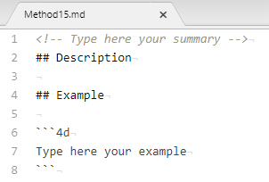

Nos projetos de aplicação, você pode documentar seus métodos e suas classes, formulários, tabelas ou campos. A criação de documentação é particularmente apropriada para projetos que estão sendo desenvolvidos por vários programadores e, em geral, é uma boa prática de programação. A documentação pode conter uma descrição de um elemento, bem como de qualquer informação necessária para entender como o elemento funciona na aplicação.

Os seguintes elementos do projeto aceitam documentação:

- Métodos (métodos banco de dados, métodos componentes, métodos projeto, métodos formulário, métodos 4D Mobile e triggers)
- Classes
- Formulários
- Tabela

Seus arquivos de documentação são escritos na sintaxe Markdown (arquivos .md) usando qualquer editor compatível com Markdown. São armazenados como ficheiros independentes na pasta do seu projeto.

A documentação é exibida na área de visualização (painel do lado direito) do Explorer:


Ele também pode ser parcialmente exposto como [dicas do editor de código](#viewing-documentation-in-the-code-editor).


## Arquivos de documentação

### Nome do arquivo de documentação

Os arquivos de documentação têm o mesmo nome do elemento anexado, com a extensão ".md". Por exemplo, o arquivo de documentação anexado ao método projeto `myMethod.4dm` será denominado `myMethod.md`.

No Explorer, o 4D exibe automaticamente o arquivo de documentação com o mesmo nome do elemento selecionado (veja abaixo).


### Arquitetura do arquivo de documentação

Todos os arquivos de documentação são armazenados na pasta `Documentation`, localizada no primeiro nível da pasta do pacote.

A arquitetura da pasta `Documentation` é a seguinte:

- `Documentation`
    + `Classes`
        * myClass.md
    + `DatabaseMethods`
        * onStartup.md
        * ...
    + `Formulários`
        * loginDial.md
        * ...
    + `Página Métodos`
        * myMethod.md
        * ...
    + `TableForms`
        * **1**
            - input.md
            - ...
        * ...
    + `Triggers`
        * table1.md
        * ...

- Um formulário projeto e seu método de formulário projeto compartilham o mesmo arquivo de documentação para formulário e método.
- Um formulário tabela e seu método de formulário tabela compartilham o mesmo arquivo de documentação para o formulário e o método.

> Renomear ou excluir um elemento documentado em seu projeto também renomeará ou excluirá o arquivo Markdown associado ao elemento.


## Documentação no Explorador

### Ver a documentação

Para visualizar a documentação na janela do Explorer:

1. Certifique-se de que a área de pré-visualização é mostrada.
2. Selecione o elemento documentado na lista do Explorador.
3. Clique no botão **Documentação** localizado abaixo da área de visualização.


- Se nenhum arquivo de documentação for encontrado para o elemento selecionado, um botão **Criar** será exibido (veja abaixo).

- Caso contrário, se houver um arquivo de documentação para o elemento selecionado, o conteúdo será exibido na área. Os conteúdos não são diretamente editáveis no painel.

### Edição do arquivo de documentação

Você pode criar e/ou editar um arquivo de documentação Markdown na janela Explorer para o elemento selecionado.

Se não houver um arquivo de documentação para o elemento selecionado, você poderá:

- clique no botão **Criar** no painel `Documentação` ou,
- escolha a opção **Editar documentação...** no menu contextual ou no menu de opções do Explorer.


4D cria automaticamente um arquivo .md com o nome apropriado com um modelo básico no local relevante e o abre com seu editor Markdown padrão.

Se já existir um arquivo de documentação para o elemento selecionado, você poderá abri-lo com seu editor Markdown escolhendo a opção **Editar documentação...** no menu contextual ou no menu de opções do Explorer.


## Ver a documentação no editor de código

O editor de código 4D exibe uma parte da documentação de um método em sua dica de ajuda.


Se um arquivo chamado `\&#060;MethodName&#062;. d` existe na pasta `\&#060;package&#062;/documentação` , o editor de código é exibido (por prioridade):

- Qualquer texto inserido em uma tag de comentário HTML (`<!-- documentação comando -->`) na parte superior do arquivo de markdown.

- Ou, se nenhuma tag de comentário html for usada, a primeira frase após uma tag `# Descrição` do arquivo markdown.  
  Neste caso, a primeira linha contém o protótipo **** do método, gerado automaticamente pelo analisador de código 4D.

:::note

Caso contrário, o editor de código exibe [o comentário do bloco na parte superior do código do método](../code-editor/write-class-method.md#using-help-tips).

:::


## Definição do arquivo de documentação

4D usa um modelo básico para criar ficheiros de documentação. Esse modelo sugere recursos específicos que permitem que você [exiba informações no editor de código](#viewing-documentation-in-the-code-editor).

No entanto, você pode usar qualquer [tag Markdown compatível](#supported-markdown).

Novos arquivos de documentação são criados com o seguinte conteúdo padrão:



| Linha                                      | Descrição                                                                                                                                                          |
| ------------------------------------------ | ------------------------------------------------------------------------------------------------------------------------------------------------------------------ |
| `<!-- Escreva aqui o seu resumo -->` | Comentário HTML. Usado em prioridade como a descrição do método nas [dicas do editor de código](#viewing-documentation-in-the-code-editor)                         |
| ## Description                            | Título de nível 2 em Markdown. A primeira frase após essa tag ser usada como descrição do método nas dicas do editor de código, se o comentário HTML não for usado |
| ## Exemplo                                | No nível 2 do cabeçalho, você pode usar essa área para mostrar um código de amostra                                                                                |
| ` ```4d Type here your example``` `        | Utilizado para formatar exemplos de código 4D (utiliza a biblioteca highlight.js)                                                                                  |


### Markdown suportado
- A etiqueta de título é suportada:

```md
# Title 1
## Title 2
### Title 3
```

- As etiquetas de estilo (itálico, negrito, riscado) são suportadas:

```md
_italic_
**bold**
**_bold/italic_**
~~strikethrough~~
```


- A etiqueta de bloco de código (\```4d ... ```) é suportada com realce do código 4D:

````md
```4d
    var $txt : Text
    $txt:="Hello world!"  
```
````
- A etiqueta de tabela é suportada:

```md
| Parâmetro | Tipo | Descrição |
| --------- | ------ | ------------ |
| wpArea | Text |Área de escrita profissional|
| toolbar | Text |Nome da barra de ferramentas |
```


- A etiqueta de ligação é suportada:

```md
// Case 1 The [documentation](https://doc.4d.com) of the command ....

// Case 2
[4D blog][1]

[1]: https://blog.4d.com
```

- As etiquetas de imagem são suportadas:

```md


[](https://blog.4d.com)
```
[](https://blog.4d.com)

> Para obter mais informações, consulte o [guia GitHub Markdown](https://guides.github.com/features/mastering-markdown/).


## Exemplo

No ficheiro `WP SwitchToolbar.md`, pode escrever:

````md
<!-- This method returns a different logo depending on the size parameter -->


GetLogo (size) -> logo


| Parameter | Type   | in/out | Description |
| --------- | ------ | ------ | ----------- |
| size      | Integer | in | Logo style selector (1 to 5)  |
| logo      | Picture | out | Selected logo |


## Descrição

Esse método retorna um logotipo de um tamanho específico, dependendo do valor do parâmetro *size*.
1 = tamanho mais pequeno, 5 = tamanho maior.

## Example C_PICTURE($logo)
C_LONGINT($size)

//Get the largest logo
$logo:=GetLogo(5)
````

- Explorer view:


- Code editor view:

