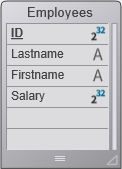

4D oferece um servidor REST poderoso que permite acesso direto aos dados armazenadas em seus bancos 4D.

O servidor REST está incluído nas aplicações 4D e 4D Server, e disponível automaticamente em seus bancos 4D [logo após ser configurado](configuration.md).

Esta seção tem o objetivo de familiarizar com as funcionalidades REST com um exemplo simples. Nós vamos:
- criar e configurar um banco de dados 4D simples
- acessar aos dados do banco 4D através de REST usando um navegador padrão.

Para simplificar o exemplo, vamos usar uma aplicação 4D e um navegador que são executados na mesma máquina. Também poderia usar uma arquitetura remota.


## Criar e configurar o banco de dados 4D

1. Lançar sua aplicação 4D ou 4D server e criar um novo banco de dados. Pode chamar de "Emp4D", por exemplo.

2. Create a table with some fields, for example:
    - Lastname (Alpha)
    - Firstname (Alpha)
    - Salary (Longint)



> A opção "Expor um recurso REST" está marcada por definição para a tabela e cada campo; não mude essa configuração.

3. Crie formulários depois crie alguns funcionários:


4. We will use the REST server to access data: go the "Settings" dialog box, select the "Web/Rest resource" page, and check the **Expose as REST server** option.

5. No menu **Executar**, selecione **Iniciar Web Server** (se necessário), e então selecione **Teste Web Server**.

4D exibe a página home padrão do servidor Web 4D.


## Acessar dados 4D através do navegador

Pode ler e editar dados com 4D apenas através de petições REST.

Qualquer petição 4D Rest URL  inicia com `/ rest`, para ser inserido depois da área `adress:port`. Por exemplo, para ver o que está dentro da 4D Datastore, pode escrever:

```
http://localhost/rest/$catalog
```

O servidor REST responde:

```
{
 "__UNIQID": "3F1B6ACFFE12B64493629AD76011922D",
 "dataClasses": [
  {
   "name": "Friends",
   "uri": "/rest/$catalog/Friends",
   "dataURI": "/rest/Friends"
  }
 ]
}
```

Significa que a datastore contém a dataclass Employees. Pode ver os atributos de classe de dados digitando:

```
/rest/$catalog/Employees
```

Se quiser obter todas as entidades da classe de dados Employee, pode escrever:

```
/rest/Employees
```

**Responsa:**

```
{
 "__DATACLASS": "Friends",
 "__entityModel": "Friends",
 "__GlobalStamp": 0,
 "__COUNT": 4,
 "__FIRST": 0,
 "__ENTITIES": [
  {
   "__KEY": "1",
   "__TIMESTAMP": "2020-10-27T14:29:01.914Z",
   "__STAMP": 1,
   "ID": 1,
   "lastName": "Smith",
   "firstName": "John"
  },
  {
   "__KEY": "2",
   "__TIMESTAMP": "2020-10-27T14:29:16.035Z",
   "__STAMP": 1,
   "ID": 2,
   "lastName": "Brown",
   "firstName": "Danny"
  },
  {
   "__KEY": "3",
   "__TIMESTAMP": "2020-10-27T14:29:43.945Z",
   "__STAMP": 1,
   "ID": 3,
   "lastName": "Purple",
   "firstName": "Mark"
  },
  {
   "__KEY": "4",
   "__TIMESTAMP": "2020-10-27T14:34:58.457Z",
   "__STAMP": 1,
   "ID": 4,
   "lastName":
```

Tem muitas possibilidades para filtrar dados a receber. Por exemplo, para obter só o valor de atributo "Lasname" da segunda entidade, pode escrever:

```
/rest/Employees(2)/Lastname
```

**Responsa:**

```
{
 "__entityModel": "Employees",
 "__KEY": "2",
 "__TIMESTAMP": "2020-01-07T17:08:14.387Z",
 "__STAMP": 2,
 "Lastname": "Jones"
}
```

A [REST API](REST_requests.md) oferece vários comandos para interagir com o banco de dados 4D.  
