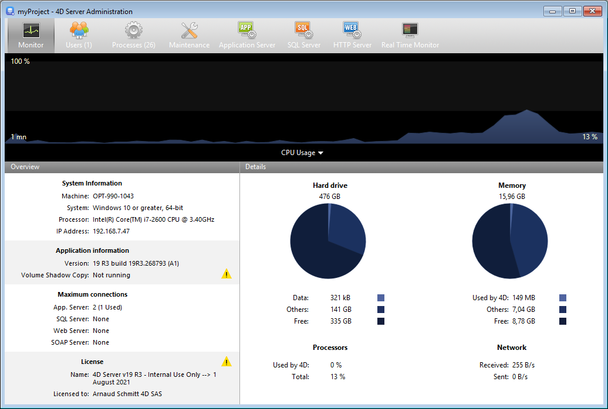

A página **Monitor** exibe informações dinâmicas sobre o uso de banco de dados, bem como informações sobre o sistema e a aplicação do servidor 4D.

> No Windows, algumas das informações do sistema exibidas nesta página são recuperadas através das ferramentas de "Analisador de desempenho do Windows". Estas ferramentas só podem ser acessadas quando o usuário que abriu a sessão onde o servidor 4D foi iniciado tiver a autorização administrativa necessária.

## Área gráfica

A área gráfica permite que você veja a evolução em tempo real de vários parâmetros: o uso da CPU, o tráfego de rede e a memória. Você seleciona o parâmetro a ser exibido através de um menu encontrado no centro da janela:

- **Uso da CPU**: Uso geral da CPU para todos os aplicativos juntos. A parte específica do servidor 4D nessa taxa de uso é fornecida na área de informação "Processadores".
- **Network**: Número de bytes recebidos por segundo pela máquina (servidor ou cliente). O número de bytes enviados é fornecido na área de informação "Rede".
- **Physical memory**: Quantity of RAM memory of machine used by 4D Server. A more detailed view of memory use is provided in the "Memory" information area.
- **Virtual memory**: Quantity of virtual memory used by the 4D Server application. Esta memória é alocada pelo sistema conforme as necessidades de aplicação. The value found at the bottom right of the area indicates the quantity of memory currently being used. The value found at the top left indicates the maximum quantity of usable virtual memory. The maximum value is calculated dynamically according to the general memory settings of the application.
- **Cache**: Quantity of cache memory used by the 4D Server application. The value found at the bottom right of the area indicates the quantity of memory currently being used. The value found at the bottom right of the area indicates the quantity of memory currently being used.

Note that when this option is selected, the graph area scrolling is slowed down since an efficient analysis of the cache is generally carried out over a fairly long observation period.

## Área Visão geral

The "Overview" area provides various information concerning the system, application and licenses installed on the 4D Server machine.

- **System Information**: Computer, system and IP address of server
- **Application Information**: Internal version number of 4D Server and Volume Shadow Copy status
- **Maximum connections**: Number of simultaneous connections allowed by type of server
- **Licença**: descrição da licença. When the product license or one of its attached expansions expires in less than 10 days, e.g. in case of a subscription-license, 4D Server tries to automatically renew the license from the 4D user account. In this case, if the automatic renewal failed for some reason (connection error, invalid account status, non-prolongated contract...), a warning icon is displayed next to the license to alert the server administrator. Additional information about the license renewal status can be displayed in a tip when you hover the mouse over the area:

Usually, you will need to check the [**Licences Manager**](Admin/licenses.md).

## Área Detalhes

The "Details" area repeats part of the information displayed in the graphic area and provides additional information as well.

- **Hard drive**: Overall capacity of the hard disk and distribution of the space used by the database data (data file + data index), the space used by other files and the free space available.
- **Memory**: RAM memory installed on the machine and amount of memory used by 4D Server, by other applications or that is free. The memory used by 4D Server can also be displayed dynamically in the graphic area.
- **Processors**: Instant occupancy rate for processor(s) of the machine by 4D Server and by other applications. Esta taxa é constantemente recalculada. The occupancy rate by 4D Server can also be displayed dynamically in the graphic area.
- **Network**: Instantaneous number of bytes sent and received by the machine (server or client). Este valor é atualizado constantemente. The number of bytes received by can also be displayed dynamically in the graphic area.
