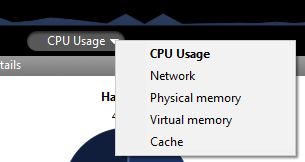

A página **Monitor** exibe informações dinâmicas sobre o uso de banco de dados, bem como informações sobre o sistema e a aplicação do servidor 4D.

> No Windows, algumas das informações do sistema exibidas nesta página são recuperadas através das ferramentas de "Analisador de desempenho do Windows". Estas ferramentas só podem ser acessadas quando o usuário que abriu a sessão onde o servidor 4D foi iniciado tiver a autorização administrativa necessária.

## Área gráfica

A área gráfica permite que você veja a evolução em tempo real de vários parâmetros: o uso da CPU, o tráfego de rede e a memória. Você seleciona o parâmetro a ser exibido através de um menu encontrado no centro da janela:

- **Uso da CPU**: Uso geral da CPU para todos os aplicativos juntos. A parte específica do servidor 4D nessa taxa de uso é fornecida na área de informação "Processadores".
- **Network**: Número de bytes recebidos por segundo pela máquina (servidor ou cliente). O número de bytes enviados é fornecido na área de informação "Rede".
- Memória física ****: Quantidade de memória RAM da máquina usada pelo servidor 4D. Uma visão mais detalhada do uso de memória é fornecida na área de informação "Memória".
- **Memória Virtual**: Quantidade de memória virtual usada pelo aplicativo 4D Servidor. Esta memória é alocada pelo sistema conforme as necessidades de aplicação. O valor encontrado no canto inferior direito da área indica a quantidade de memória atualmente em uso. O valor encontrado no canto superior esquerdo indica a quantidade máxima de memória virtual utilizável. O valor máximo é calculado dinamicamente de acordo com as configurações gerais de memória da aplicação.
- **Cache**: Quantidade de memória de cache usada pelo aplicativo servidor 4D. O valor encontrado no canto inferior direito da área indica a quantidade de memória atualmente em uso. O valor encontrado no canto superior esquerdo indica o tamanho total da memória de cache, como definido nas Configurações.

Observe que quando esta opção for selecionada, a rolagem da área do gráfico é desacelerada, uma vez que uma análise eficiente do cache é geralmente realizada por um período de observação bastante longo.

## Área Visão geral

A área "Visão Geral" fornece várias informações sobre o sistema, aplicativo e licenças instaladas na máquina do servidor 4D.

- **Informação do sistema**: Computador, sistema e endereço IP do servidor
- **Informações da Aplicação**: Número da versão interna do servidor 4D e status da cópia da sombra de volume
- **Máximo de conexões**: Número de conexões simultâneas permitidas por tipo de servidor
- **Licença**: Descrição da licença. Quando a licença do produto ou uma de suas expansões anexadas expirar em menos de 10 dias, por exemplo, em caso de uma licença de assinatura, o servidor 4D tenta renovar automaticamente a licença da conta de usuário 4D. Neste caso, se a renovação automática falhar por algum motivo (erro de conexão, status da conta inválido, contrato não prolongado. .), um ícone de aviso é exibido ao lado da licença para alertar o administrador do servidor. Informações adicionais sobre o status de renovação de licença podem ser exibidas em uma dica quando você passar o mouse sobre a área:

Normalmente, você precisará verificar o [**Gerenciador de Licenças**](Admin/licenses.md).

## Área Detalhes

A área de "Detalhes" repete parte das informações exibidas na área gráfica e fornece informações adicionais também.

- **Disco rígido**: Capacidade geral do disco rígido e da distribuição do espaço usado pelos dados da base de dados (dados + índice de dados), o espaço usado por outros arquivos e o espaço livre disponível.
- **Memória**: memória RAM instalada na máquina e quantidade de memória usada pelo servidor 4D, por outras aplicações ou que é grátis. A memória usada pelo servidor 4D também pode ser exibida dinamicamente na área de gráficos.
- **Processadores**: Taxa instantânea de ocupação para processador(es) da máquina pelo 4D Server e por outras aplicações. Esta taxa é constantemente recalculada. A taxa de ocupação do Servidor 4D também pode ser exibida dinamicamente na área gráfica.
- **Network**: Número instantâneo de bytes enviados e recebidos pela máquina (servidor ou cliente). Este valor é atualizado constantemente. O número de bytes recebidos também pode ser exibido dinamicamente na área gráfica.
