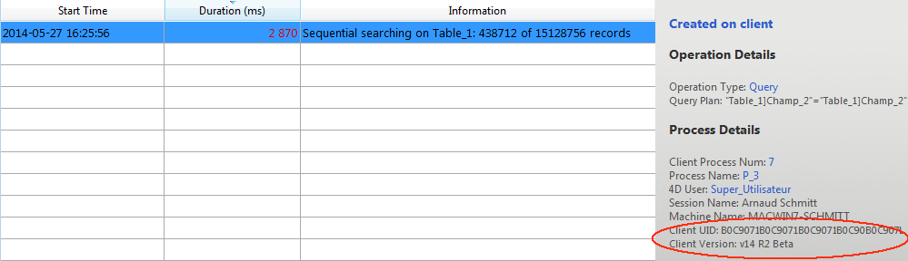

A página do Monitor em Tempo Real monitora o progresso de operações "longas" realizadas pela aplicação em tempo real. Estas operações são, por exemplo, consultas sequenciais, execução de fórmulas, etc.

> Esta página está disponível na janela de administração da máquina do servidor e também de uma máquina 4D remota. No caso de uma máquina remota, esta página exibe dados de operações realizadas na máquina do servidor.

É acrescentada uma linha para cada operação longa efetuada nos dados. Esta linha desaparece automaticamente quando a operação está concluída (você pode verificar as operações **pelo menos 5 segundos** opção para manter operações rápidas na tela por 5 segundos, veja abaixo).

As informações seguintes são fornecidas para cada linha:

- **Horário de início**: hora de início da operação no formato: "dd/mm/yyyy - hh:mm:ss"
- **Duração** (ms): duração em milissegundos da operação em curso
- **Informações**: título da operação.
- **Detalhes**: esta área exibe informações detalhadas, que variarão de acordo com o tipo de operação selecionada. Mais especificamente:
    + **Criado em**: indica se a operação resulta de uma ação do cliente (Criado no cliente) ou se foi iniciado explicitamente no servidor por meio de um procedimento armazenado ou a opção "Executar no servidor" (Criado no servidor).
    + **Detalhes da operação**: tipo de operação e plano de consulta (para operações de consulta)
    + **Sub-operações** (se houver): Operações dependentes da operação selecionada (ex. excluir registros relacionados antes de um registro pai).
    + **Detalhes do processo**: Informações adicionais sobre a tabela, campo, processo ou cliente, dependendo do tipo de operação

> A página de monitoramento em tempo real usa o comando [`GET ATIVIDADE SNAPSHOT`](https://doc.4d.com/4dv19/help/command/en/page1277.html) internamente. Para mais informações, consultar a descrição deste comando.

A página está ativa e é atualizada permanentemente assim que é exibida. Note-se que o seu funcionamento pode atrasar significativamente a execução da aplicação. É possível suspender a atualização desta página de uma das seguintes maneiras:

- clicando no botão **Pause**,
- clicando na lista,
- premindo a barra de espaços.

Quando você pausa a página, uma mensagem "PAUSADA" aparece e o rótulo do botão será exibido para **Retume**. Você pode retomar o monitoramento das operações realizando a mesma ação que realizar a pausa.

## Modo avançado

A página RTM pode exibir informações adicionais, se necessário, para cada operação listada.

Para acessar o modo avançado para uma operação, pressione **Shift** e selecione a operação desejada. Todas as informações disponíveis são então exibidas na área "Detalhes do Processo" sem qualquer filtro (conforme retornado pelo comando `ATIVAR SNAPSHOT`). A informação disponível depende da operação selecionada.

Eis um exemplo de informações apresentadas no modo padrão:

Modo avançado (**Shift+Clique** na operação), informações adicionais são exibidas:

## Botão instantânea

O botão **Snapshot** permite que você copie para a área de transferência todas as operações exibidas no painel RTM, assim como seus detalhes relacionados (informações de processo e suboperação):

## Mostrar operações durante pelo menos 5 segundos

Se você marcar a opção **Exibir operações pelo menos 5 segundos** , qualquer operação listada será exibida na página por pelo menos cinco segundos, mesmo após a conclusão da execução. As operações retidas aparecem esbatidas na lista de operações. Esta funcionalidade é útil para obter informações sobre operações que são executadas muito rapidamente.
