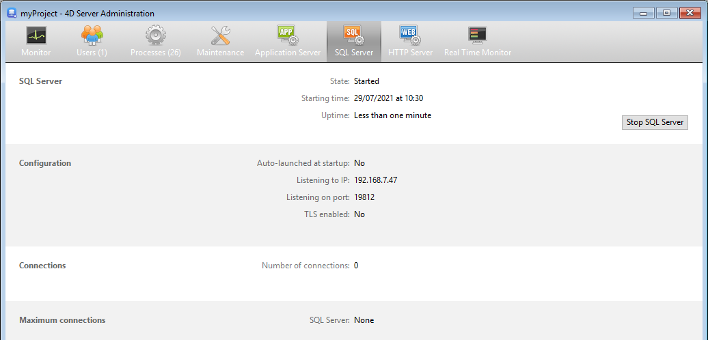

A página **SQL Server** reúne informações sobre o servidor SQL integrado de 4D Server. Também inclui um botão que pode ser usado para controlar a ativação do servidor.

A parte superior da página fornece informações sobre o status atual do servidor SQL de 4D Server.

- **Estado**: Iniciado ou Parado
- **Hora de início**: Data e hora em que o servidor SQL foi iniciado pela última vez.
- **Duração de funcionamento**: tempo decorrido desde a última inicialização do servidor SQL.

## Iniciar / Parar o SQL Server

Este botão alterna e pode ser usado para controlar a ativação do servidor SQL de 4D Server.

- Quando o estado do servidor SQL é "Iniciado", o botão é intitulado **Parar o servidor SQL**. Se você clicar neste botão, o servidor SQL de 4D é parado imediatamente; ele não responde mais a nenhuma solicitação externa SQL recebida na porta TCP designada.
- Quando o estado do servidor SQL é "interrompido", o botão é intitulado **Iniciar SQL Server**. Se você clicar neste botão, o servidor SQL de 4D é iniciado imediatamente; ele responde a qualquer consulta SQL externa recebida na porta TCP designada. Note que você precisará de uma licença adequada para poder usar o servidor SQL de 4D.

> O servidor SQL também pode ser executado automaticamente na inicialização da aplicação (opção das Preferências) ou pela programação.

## Informação

### Configuração

Esta área fornece informações sobre os parâmetros de configuração do servidor SQL: inicialização automática em inicialização, escutando o endereço IP, Porta TCP (19812 por padrão) e habilitação de SSL para conexões SQL (não diz respeito a conexões 4D nem HTTP).

Estes parâmetros podem ser modificados através das Preferências 4D.

### Conexões

Número de ligações SQL atualmente abertas no 4D Server.

### Ligações máximas

Número máximo de ligações SQL simultâneas permitidas. Este valor depende da licença instalada na máquina do servidor.
