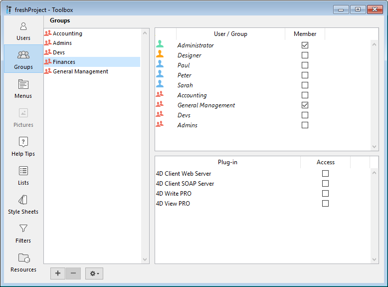

4D fornece aos usuários privilégios de acesso comuns e certos poderes. Quando o usuário e sistema de grupos tiver sido iniciado, esses privilégios começam a funcionar.

## Usuários e grupos em projectos

Em aplicações projecto (ficheiros .4DProject ou .4dz), os utilizadores e grupos 4D podem ser configurados tanto em ambientes usuário único como multi-usuário. No entanto, **controlo de acesso** só é eficaz com 4D Server. A tabela abaixo lista as principais funcionalidades de usuários e grupos e sua disponibilidade:

|                                                            | 4D (usuário único)                   | 4D Server |
| ---------------------------------------------------------- | ------------------------------------ | --------- |
| Adicionar/editar usuários e grupos                         | sim                                  | sim       |
| Atribuir acesso de usuário/grupo a servidores              | sim                                  | sim       |
| Identificação de usuário                                   | não (todos os usuários são Designer) | sim       |
| Controle de acesso quando o Designer for atribuído a senha | não (todos os acessos são Designer)  | sim       |

> Para obter informações sobre a identificação do usuário e o controlo de acesso em implementações de usuário único, consulte [este parágrafo](overview.md#access-control-in-single-user-applications).

## Designer e Administrador

O usuário mais poderoso é chamado **Designer**. Nenhum aspecto do banco de dados é fechado ao Designer. O Designer pode:
- acessar todos os servidores de banco de dados sem restrição,
- criar usuários e grupos,
- atribuir privilégios de acesso a grupos,
- acessar o ambiente Design. Em ambiente monousuário, direitos de acesso de Designer são sempre usados. Em ambiente cliente/servidor, atribuir uma senha ao Designer ativa a exibição do diálogo de login de usuário 4D.  Acesso ao ambiente Design é apenas leitura.

Depois do Designer, o usuário mais poderoso é o **Administrador**, ao qual é geralmente dada a tarefa de gerenciamento de acesso ao sistema e administração de funcionalidades.

O Administrador não pode:
- criar usuários e grupos,
- acessar ao monitor e janela de Administração 4D Server
- acessar a janela MSC para gerenciar cópias de segurança, restaurações ou servidor.

O administrador pode:
- editar o usuário Designer
- como padrão, acessar as partes protegidas do banco de dados. O Administrador não pode acessar o modo Design se for restringido. In particular, the Administrator cannot access to the Design mode if it is restricted. O administrador é inscrito em todo novo grupo, mas é possível remover o nome do Administrador de qualquer grupo.

Tanto o Designer quanto o Administrador estão disponíveis como padrão em todos os bancos de dados. No diálogo de [gestão de usuários](#users-and-groups-editor), os ícones de Designer e Administrator são exibidos em verde e vermelho, respectivamentes:

- Ícone Designer: 
- Ícone de Administrador: 

Pode renomear os usuários Designer e Administardor. Na linguagem, o ID de Designer é sempre 1 e a ID de Administrador é sempre 2.

O Designer e Administrador podem cada um criar até 16.000 grupos e 16 mil usuários.

## Editor de grupos

O editor de usuários está na Barra de Ferramentas de 4D.

> O editor de usuários e grupos pode ser exibido em execução com ajuda do comando [EDIT ACCESS](https://doc.4d.com/4dv19R/help/command/en/page281.html). Toda a configuração de usuários e grupos pode também ser editada durante a execução da aplicação utilizando comandos de linguagem 4D do tema `Usuários e grupos`.

### Adicionar e modificar usuários

Para usar o editor de usuários para criar contas de usuário, estabeleça as propriedades e atribua aos vários grupos.

Para adicionar um usuário da Barra de Ferramentas:

1. Selecione **Tool Box > Users** do menu**Design** ou clique no botão **Tool Box** da barra 4D. 4D exibe o editor de usuários.

A lista de usuários exibe todos os usuários, incluindo o[Designer and the Administrator](#designer-and-administrator).

2. Clique no botão  que está abaixo da lista de usuários. OU Clique com o botão direito do mouse na lista de usuários e escolha **Adicionar** ou **Duplicar** no menu de contexto.

> O comando **Duplicate** pode ser usado para criar rapidamente vários usuários com as mesmas características.

4D adiciona um novo usuário para a lista, chamado "Novo usuárioX" como padrão.

3. Digite o nome de usuário. Enter the user name. Pode renomear um usuário a qualquer momento usando o comando **Rename** do menu contextual ou usando os atalhos Alt+clique (Windows) ou Opção+clique (macOS), ou ainda clicando duas vezes no nome que quiser mudar.

4. Para digitar uma senha para o usuário, clique o botão **Edit...** na área de propriedades de usuário e digite a senha daus vezes na caixa de diálogo. Pode usar até 15 caracteres alfanuméricos para a senha. O editor de senhas é sensível a maiúsculas ou minúsculas.

> Os usuários podem mudar suas senhas a qualquer momento de acordo com as opções na página "Segurança" das configurações de banco de dados ou usando o comando `CHANGE PASSWORD`.

5. Estabeleça os grupos aos quais o usuário vai pertencer com a tabela "Membro de Grupos". Pode adicionar ou remover os usuários selecionados de ou para um grupo marcando a opção correspondente na coluna Membro.

A adesão do usuário aos diferentes grupos também pode ser estabelecida por grupo na página [Grupos](#configuring-access-groups).

### Apagar um usuário

Para apagar um usuário, selecione-o e clique no botão apagar ou use o comando **Delete** no menu contextual. 

Usuários deletados não aparecem mais no editor de Usuários. Note que as IDs de usuários deletados são retribuídas quando novas contas de usuário forem criadas.

### Propriedades de usuário

- **Tipo de usuário**: o campo Tipo de usuário contém "Designer", "Administrador", ou (para todos os outros usuários) "Usuário".

- **Método de inicialização**: nome do método associado que será executado automaticamente quando o usuário abrir a aplicação (opcional). Esse método pode ser usado por exemplo para carregar as preferências de usuário.

## Editor de usuários

O editor para grupos está na Barra de ferramentas de 4D.

### Grupos de configuração

Pode usar o editor de grupos para estabelecer os elementos que cada grupo conter (usuários ou outros grupos) e distribuir acesso aos plug-ins.

Lembre que se um grupo for criado não pode ser apagado. Se quiser desativar um grupo, precisa remover primeiro todos seus usuários.

Para criar um gurpo:

1. Selecione **Caixa de Ferramentas > Grupos** no menu **Design** ou clique no botão **Caixa de Ferramentas** da barra de ferramentas de 4D e depois no botão **Grupos**. 4D exibe a janela de editor de grupos. A lista de grupos exibe todos os grupos do banco de dados.

2. Clique no botão  abaixo da lista de grupos  
   . OU  
   Clique com o botão direito do mouse na lista de grupos e escolha o comando **Adicionar** ou **Duplicar** no menu de contexto.

> O comando Duplicar pode ser usado para criar vários grupos tendo as mesmas características.

4D adiciona um novo grupo para a lista, chamado "Novo grupoX".

3. Digite o nome do novo grupo. O nome de grupo pode ter até 15 caracteres. Pode renomear um grupo a qualquer momento usando o comando **Renomear** do menu contextual ou usando os atalhos Alt+clique (Windows) ou Opção+clique (macOS), ou ainda clicando duas vezes no nome que quiser mudar.

### Colocar usuários ou grupos dentro de grupos

Pode colocar qualquer usuário ou grupo dentro de um grupo, e pode também colocar um grupo dentro de vários outros grupos. Não é obrigatório colocar um usuário em um grupo.

Para colocar um usuário ou grupo em um grupo, precisa marcar a opção "Membro" para cada usuário ou grupo na área de atribuição de membros:

Se marcar o nome de usuário, esse usuário é adicionado ao grupo. Se marcar o nome de um grupo, todos os usuários do grupo serão adicionados ao novo grupo. O usuário ou grupo afiliado terá então os mesmos privilégios de acesso que os que foram atribuídos ao novo grupo.

A colocação de grupos noutros grupos permite-lhe criar uma hierarquia de usuários. Os usuários de um grupo colocado em outro grupo terão privilégios de acesso de ambos os grupos. Veja "[Um esquema de hierarquia de acesso](#an-access-hierarchy-scheme)" abaixo.

Para remover um usuário ou grupo de outro grupo, você só precisa desmarcar a opção correspondente na área de atribuição de membros.

### Atribuição de um grupo a um plug-in ou a um servidor

Você pode atribuir privilégios de grupo a qualquer plug-in instalado no projeto. Isto inclui todos os plug-ins 4D e de terceiros.

A distribuição de acesso ao plug-ins permite que você controle o uso das licenças que você possui para esses plug-ins. Qualquer usuário que não pertence ao grupo de acesso de um plug-in não pode carregar este plug-in.

> Licenças utilizadas permanecem anexadas a contas de usuário 4D no grupo para toda a sessão 4D.

A área "Plug-in" na página de grupos da caixa de ferramentas lista todos os plug-ins carregados pela aplicação 4D. Para dar acesso a um grupo a um plug-in, você precisa simplesmente marcar a opção correspondente.

As linhas **4D Client Web Server** e **4D Client SOAP Server** controlam a capacidade de publicação Web e SOAP (Web Services) de cada 4D no modo remoto. Essas licenças são consideradas como licenças de plug-in por 4D Server. Portanto, da mesma forma que para plug-ins, você pode restringir o direito de utilizar essas licenças para um grupo específico de usuários.

### Um esquema de acesso hierárquico

A melhor maneira de garantir a segurança da sua aplicação e fornecer aos usuários diferentes níveis de acesso é usar um esquema de hierarquia de acesso. Os usuários podem ser atribuídos a grupos e grupos apropriados podem ser aninhados para criar uma hierarquia de direitos de acesso. Esta secção discute várias abordagens a esse esquema.

Neste exemplo, um usuário é atribuído a um dos três grupos consoante o seu nível de responsabilidade. Usuários atribuídos ao grupo Accounting são responsáveis pela entrada de dados. Os usuários designados ao grupo Finanças são responsáveis por manter os dados, incluindo atualizações de registros e exclusão de registros desatualizados. Os usuários designados ao grupo geral de gerenciamento são responsáveis por analisar os dados, incluindo a realização de pesquisas e a impressão de relatórios analíticos.

Os grupos são então aninhados para que os privilégios sejam distribuídos corretamente para os usuários de cada grupo.

- O grupo geral de gerenciamento contém apenas usuários de "alto nível". 

- O grupo Finanças contém usuários de atualização de dados, bem como usuários da Administração geral, de modo que os usuários da Administração geral também têm os privilégios do grupo Finanças. 

- O grupo Contabilidade contém usuários de entrada de dados, bem como usuários do grupo Finanças, de modo que os usuários pertencentes ao grupo Finanças e ao grupo Administração geral também desfrutam dos privilégios do grupo Contabilidade. 

Você pode decidir quais privilégios de acesso atribuir a cada grupo com base no nível de responsabilidade dos usuários que ele inclui.

Tal sistema hierárquico facilita lembrar para qual grupo um novo usuário deve ser atribuído. Você só tem que atribuir cada usuário para um grupo e usar a hierarquia de grupos para determinar o acesso.

## Atribuir grupos de acesso

Os grupos recebem privilégios de acesso a partes ou recursos específicos da aplicação:

- Acesso ao ambiente Desenho e ao Explorador de execução,
- Servidor HTTP,
- Servidor REST,
- Servidor SQL.

Estes acessos são definidos no diálogo Parâmetros. O exemplo abaixo mostra direitos de acesso ao explorador de Execução e ao Design sendo atribuidos ao grupo "Devs":

Você também usa grupos para [distribuir licenças disponíveis](#assigning-a-group-to-a-plug-in-or-to-a-server). Esta distribuição é definida no editor Grupos.

## Ficheiro Directory.json

Os usuários, grupos, bem como seus direitos de acesso são armazenados em um arquivo específico do projeto chamado **directory.json**.

Esse arquivo pode ser armazenado nos seguintes locais, dependendo de suas necessidades:

- Se você quiser usar o mesmo diretório para todos os arquivos de dados (ou se você usar um arquivo de dados único), armazene o arquivo **directory.json** na pasta de configurações do usuário, ou seja, na pasta "Configurações" no [mesmo nível que a pasta "Projeto"](Project/architecture.md#project-folder) (local padrão).
- Se você quiser usar um arquivo de diretório específico por arquivo de dados, armazene o diretório **directory.json** na pasta dos parâmetros de dados, ou seja, na pasta ["Settings" da pasta "Data"](Project/architecture.md#settings). Se um arquivo **directory.json** estiver presente neste local, ele terá prioridade sobre o arquivo na pasta Settings usuário. Essa configuração personalizada/local de usuários e grupos não será afetada por uma atualização da aplicação.

> Para permitir alterações seguras de senhas e associações de grupos em um ambiente implantado, você pode incluir o arquivo **directory.json** na aplicação do servidor durante a compilação, usando a opção [correspondente da aplicação de compilação](../Desktop/building.md#embed-the-project-users-and-groups-in-built-server-application).

