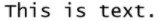

As propriedades da área 4D View Pro podem ser configuradas utilizando a lista de propriedades. As propriedades da folha de cálculo estão disponíveis através da linguagem.

## Propriedades da área do formulário

Usando a lista de propriedades da área, você pode definir as [propriedades objeto 4D View Pro](FormObjects/viewProArea_overview.md#supported-properties), como **Nome do objeto**, [**Variável ou Expressão**](#4d-view-pro-form-object-variable), **Aparência**, **Ação** e **Eventos**.


### Selecção de uma interface utilizador

Você pode selecionar a interface para usar com suas áreas de formulário 4D View Pro no **Propriedade List**, , sob **Aparência**:


> Você também pode usar a [`userInterface`](FormObjects/properties_Appearance.md#user-interface) e [`withFormulaBar`](FormObjects/properties_Appearance.md#show-formula-bar)(apenas com a interface "toolbar") em JSON.

As interfaces permitem modificações básicas e a manipulação de dados. Modificações definidas pelo usuário são salvas no objeto 4D View Pro quando o usuário salva o documento.

#### Fita


#### Barra de ferramentas

Ativar a interface da barra de ferramentas exibe a opção [**Mostrar barra de fórmula**](FormObjects/properties_Appearance.md#show-formula-bar). Quando selecionada, a barra de fórmula fica visível abaixo da interface da barra de ferramentas.

Com barra de fórmula visível:


#### Funcionalidades

Tanto os recursos relacionados ao Ribbon como o grupo da interface de ferramentas (toolbar) nas abas:

| Tab      | Acções                           | Interface Ribbon | Interface da barra de ferramentas |
| -------- | -------------------------------- |:----------------:|:---------------------------------:|
| File     | Manipulação de ficheiros         |        X         |                                   |
| Inicio   | Aspecto do texto                 |        X         |                 X                 |
| Inserir  | Adicionar itens                  |        X         |                 X                 |
| Fórmulas | Cálculo de fórmulas e biblioteca |        X         |                 X                 |
| Dados    | Manipulação de dados             |        X         |                 X                 |
| Mostrar  | Apresentação visual              |        X         |                 X                 |
| Settings | Presentação da folha             |        X         |                                   |

## Eventos formulário

Os seguintes eventos de formulário estão disponíveis na lista de propriedades para as áreas 4D View Pro.

Alguns dos eventos são eventos padrão de formulário (disponíveis para todos os objetos ativos) e alguns são eventos específicos de forma 4D View Pro. Alguns eventos de formulário padrão fornecem informações estendidas no objeto retornado pelo comando [`FORM Event`](https://doc.4d.com/4dv19/help/command/en/page1606.html) quando eles são gerados em 4D View Pro. A tabela a seguir mostra quais eventos são padrões e quais são específicos ou fornecem informações adicionais para as áreas 4D View Pro:

| Eventos 4D ‘standard’                           | Eventos 4D View Pro específicos e alargados           |
| ----------------------------------------------- | ----------------------------------------------------- |
| [On Load](../Events/onLoad.md)                  | [On VP Ready](../Events/onVpReady.md)                 |
| [On Getting Focus](../Events/onGettingFocus.md) | [On Clicked](../Events/onClicked.md)                  |
| [On Losing Focus](../Events/onLosingFocus.md)   | [On Double Clicked](../Events/onDoubleClicked.md)     |
| [On Unload](../Events/onUnload.md)              | [On Header Click](../Events/onHeaderClick.md)         |
|                                                 | [On After Edit](../Events/onAfterEdit.md)             |
|                                                 | [On Selection Change](../Events/onSelectionChange.md) |
|                                                 | [On Column Resize](../Events/onColumnResize.md)       |
|                                                 | [On Row Resize](../Events/onRowResize.md)             |
|                                                 | [On VP Range Changed](../Events/onVpRangeChanged.md)  |

## Opções folha

O objeto 4D View Pro permite controlar várias opções de suas áreas 4D View Pro. Este objeto é tratado pelos seguintes comandos:

* [VP SET SHEET OPTIONS](method-list.md#vp-set-sheet-options)
* [VP Get sheet options](method-list.md#vp-get-sheet-options)

### Aspecto da folha

| Propriedade          |                        | Tipo          | Descrição                                                                                                                                                                                                                                                                                                              |
| -------------------- | ---------------------- | ------------- | ---------------------------------------------------------------------------------------------------------------------------------------------------------------------------------------------------------------------------------------------------------------------------------------------------------------------- |
| allowCellOverflow    |                        | boolean       | Especifica se os dados podem transbordar para células vazias adjacentes.                                                                                                                                                                                                                                               |
| sheetTabColor        |                        | string        | Uma string de cores usada para representar a cor da aba da folha, como "red", "#FFFF00", "rgb(255,0,0)", "Accent 5", e assim por diante.                                                                                                                                                                               |
| frozenlineColor      |                        | string        | Uma cor, usada para representar a cor da linha congelada, como "red", "#FFFF00", "rgb(255,0,0)", "Accent 5", e assim por diante.                                                                                                                                                                                       |
| clipBoardOptions     |                        | inteiro longo | A opção de área de transferência. Valores disponibles: `vk clipboard paste options all`, `vk clipboard paste options formatting`, `vk clipboard paste options formulas`, `vk clipboard paste options formulas and formatting`, `vk clipboard paste options values`, `vk clipboard paste options values and formatting` |
| gridline             |                        | object        | As opções da linha de grade.                                                                                                                                                                                                                                                                                           |
|                      | color                  | string        | Uma cor, usada para representar a cor da linha da grade, como "red", "#FFFF00", "rgb(255,0,0)", "Accent 5", e assim por diante.                                                                                                                                                                                        |
|                      | showVerticalGridline   | boolean       | Especifica se a linha de grelha vertical deve ser mostrada.                                                                                                                                                                                                                                                            |
|                      | showHorizontalGridline | boolean       | Especifica se a linha de grelha horizontal deve ser mostrada.                                                                                                                                                                                                                                                          |
| rowHeaderVisible     |                        | boolean       | Especifica se o cabeçalho da linha é visível.                                                                                                                                                                                                                                                                          |
| colHeaderVisible     |                        | boolean       | Especifica se o cabeçalho da coluna é visível.                                                                                                                                                                                                                                                                         |
| rowHeaderAutoText    |                        | inteiro longo | Especifica se o cabeçalho da linha exibe letras ou números ou está em branco. Valores disponíveis: `vk header auto text blank`, `vk header auto text letters`, `vk header auto text numbers`                                                                                                                           |
| colHeaderAutoText    |                        | inteiro longo | Especifica se o cabeçalho da coluna exibe letras ou números ou está em branco. Valores disponíveis: `vk header auto text blank`, `vk header auto text letters`, `vk header auto text numbers`                                                                                                                          |
| selectionBackColor   |                        | string        | A cor de fundo da seleção para a folha. (formato RGBA preferido)                                                                                                                                                                                                                                                       |
| selectionBorderColor |                        | string        | A cor do contorno da seleção para a folha.                                                                                                                                                                                                                                                                             |
| sheetAreaOffset      |                        | object        | As opções de sheetAreaOffset.                                                                                                                                                                                                                                                                                          |
|                      | left                   | inteiro longo | O deslocamento à esquerda da folha em relação ao host.                                                                                                                                                                                                                                                                 |
|                      | top                    | inteiro longo | O deslocamento superior da folha em relação ao host.                                                                                                                                                                                                                                                                   |
> Todas as propriedades são opcionais.

### Protecção da folha

Para bloquear toda a planilha, você só precisa definir a propriedade *isProtected* para **true**. Em seguida, você pode desbloquear as células individualmente definindo a propriedade de estilo de célula [bloqueada](#layout).

| Propriedade       |                          | Tipo    | Descrição                                                                                                           |
| ----------------- | ------------------------ | ------- | ------------------------------------------------------------------------------------------------------------------- |
| isProtected       |                          | boolean | Especifica se as células nesta folha que são marcadas como protegidas não podem ser editadas.                       |
| protectionOptions |                          | object  | Um valor que indica os elementos que os usuários podem modificar. Se null: o parâmetro protectionOptions é reposto. |
|                   | allowSelectLockedCells   | boolean | Especifica se o usuário pode selecionar células bloqueadas, opcional. True por defeito.                             |
|                   | allowSelectUnlockedCells | boolean | Especifica se o usuário pode selecionar células desbloqueadas, opcional. True por defeito.                          |
|                   | allowSort                | boolean | Especifica se o usuário pode ordenar intervalos, opcional. Padrão é falso.                                          |
|                   | allowFilter              | boolean | Especifica se o usuário pode filtrar intervalos, opcional. Padrão é falso.                                          |
|                   | allowEditObjects         | boolean | Especifica se o usuário pode editar objetos flutuantes, opcional. Padrão é falso.                                   |
|                   | allowResizeRows          | boolean | Especifica se o usuário pode redimensionar as linhas, opcional. Padrão é falso.                                     |
|                   | allowResizeColumns       | boolean | Especifica se o usuário pode redimensionar colunas, opcional. Padrão é falso.                                       |
|                   | allowDragInsertRows      | boolean | Especifica se o usuário pode executar a operação de arrastar para inserir linhas, opcional. Padrão é falso.         |
|                   | allowDragInsertColumns   | boolean | Especifica se o usuário pode executar a operação de arrastar para inserir colunas, opcional. Padrão é falso.        |
|                   | allowInsertRows          | boolean | Especifica se o usuário pode inserir linhas, opcional. Padrão é falso.                                              |
|                   | allowInsertColumns       | boolean | Especifica se o usuário pode inserir colunas, opcional. Padrão é falso.                                             |
|                   | allowDeleteRows          | boolean | Especifica se o usuário pode eliminar linhas, opcional. Padrão é falso.                                             |
|                   | allowDeleteColumns       | boolean | Especifica se o usuário pode eliminar colunas, opcional. Padrão é falso.                                            |
> Todas as propriedades são opcionais.

## Formato das células

Definir um padrão de formato garante que o conteúdo dos seus documentos 4D View Pro seja exibido como deveria. Os formatos podem ser definidos usando a [interface](#selecting-a-user-interface) 4D View Pro selecionada ou usando os métodos [VP SET VALUE](method-list.md#vp-set-value) ou [VP SET NUM VALUE](method-list.md#vp-set-num-value).

A versão 4D View Pro tem formatos embutidos para números, datas, horas e texto, mas você também pode criar seus próprios padrões para formatar o conteúdo das células usando caracteres especiais e códigos.

Por exemplo, ao usar os métodos [VP SET VALUE](method-list.md#vp-set-value) ou [VP SET NUM VALUE](method-list.md#vp-set-num-value) para inserir valores em uma fatura, você pode querer que os símbolos de moeda ($, €, ¥, etc.) sejam alinhados independentemente do espaço exigido pelo número (ou seja, se o valor é $5,00 ou $5.000,00). Você poderia usar caracteres de formatação e especificar o padrão _($* #,##0.00_) que exibiria os valores conforme mostrado:


Observe que, ao criar seus próprios padrões de formato, apenas a exibição dos dados é modificada. O valor dos dados mantém-se inalterado.

### Formatos número e texto

Formatos de números se aplicam a todos os tipos de números (por exemplo, positivos, negativos e zeros).

| Caracteres | Descrição                                                                                                                                                                                                                               | Exemplo                                                                                                                                    |
| ---------- | --------------------------------------------------------------------------------------------------------------------------------------------------------------------------------------------------------------------------------------- | ------------------------------------------------------------------------------------------------------------------------------------------ |
| 0          | Marcador de posição mostrando zeros.                                                                                                                                                                                                    | #.00 mostrará 1.1 como 1.10                                                                                                                |
| .          | Exibe um ponto decimal                                                                                                                                                                                                                  | 0.00 mostrará 1999 como 1999.00                                                                                                            |
| ,          | Mostra o separador de milhares num número. Milhares são separados por vírgulas se o formato contém uma vírgula entre os sinais de número "#" ou por zeros. Uma vírgula após um marcador de posição de dígito escala o número por 1.000. | #,0 mostrará 12200000 como 12,200,000                                                                                                      |
| \_       | Salta a largura do carácter seguinte.                                                                                                                                                                                                   | Geralmente usado em combinação com parênteses para adicionar parágrafos esquerdos, \_(e _), respectivamente.                             |
| @          | Formatador de texto. Aplica o formato a todo o texto da célula                                                                                                                                                                          | "\[Red]@" aplica a cor de letra vermelha aos valores de texto.                                                                            |
| *          | Repete o carácter seguinte para preencher a largura da coluna.                                                                                                                                                                          | 0*- incluirá traços suficientes após um número para preencher a célula, enquanto *0 antes de qualquer formato incluirá zeros à esquerda. |
| " "        | Exibe o texto dentro das aspas sem interpretá-lo.                                                                                                                                                                                       | "8%" será exibido como: 8%                                                                                                                 |
| %          | Mostra os números como uma percentagem de 100.                                                                                                                                                                                          | 8% será exibido como 0,08                                                                                                                  |
| \#       | Espaço reservado para dígitos que não apresenta zeros extra. Se um número tem mais dígitos à direita do que existem espaços reservados, o número será arredondado.                                                                      | #.# mostrará 1.54 como 1.5                                                                                                                 |
| ?          | Espaço reservado digito que deixa espaço para zeros extras, mas não exibe-os. Normalmente utilizado para alinhar números pelo ponto decimal.                                                                                            | $?? mostra um máximo de 2 casas decimais e faz com que os sinais de dólar alinhem para valores variáveis.                                  |
| \         | Exibe o caractere seguinte.                                                                                                                                                                                                             | #.00\? mostrará 123 como 123.00?                                                                                                          |
| /          | Quando utilizado com números, apresenta-os como fracções. Quando utilizado com códigos de texto, data ou hora, é apresentado "tal e qual".                                                                                              | #/# mostrará .75 como 3/4                                                                                                                  |
| \[ ]      | Cria formatos condicionais.                                                                                                                                                                                                             | \[>100]\[GREEN]#,##0;\[`<=-100`]\[YELLOW]#,##0;\[BLUE]#,##0                                                                        |
| E          | Formato notação científica.                                                                                                                                                                                                             | #E+# - mostrará 1.500.500 como 2E+6                                                                                                        |
| \[color]  | Formata o texto ou número na cor especificada                                                                                                                                                                                           | \[Green]###.##\[Red]-###.###                                                                                                             |

#### Exemplo

```4d
//Set the cell value as $125,571.35 VP SET VALUE(VP Cell("ViewProArea";3;2);New object("value";125571.35;"format";"_($* #,##0.00_)")
```

### Formatos data e hora

4D View Pro fornece as seguintes constantes para padrões de data e hora do ISO 8601:

| Parâmetros                                | Valor                                | Comentário                                                                                                                                                               |
| ----------------------------------------- | ------------------------------------ | ------------------------------------------------------------------------------------------------------------------------------------------------------------------------ |
| `vk pattern full date time`               | "*fullDateTimePattern*"              | Formato ISO 8601 para a data e hora completas no padrão de localização.EUA atual: "dddd, dd MMMM yyyy HH:mm:ss"                                                          |
| `vk pattern long date`                    | "*longDatePattern*"                  | Formato ISO 8601 para a data completa no padrão de localização atual: "dddd, dd MMMM yyyy"                                                                               |
| `vk pattern long time`                    | "*longTimePattern*"                  | Formato ISO 8601 para a hora na localização atual. Padrão padrão EUA: "HH:mm:ss"                                                                                         |
| `vk pattern month day`                    | "*monthDayPattern*"                  | Formato ISO 8601 para o mês e dia no padrão da localização atual: "MMMM dd"                                                                                              |
| `vk pattern short date`                   | "*shortDatePattern*"                 | Formato ISO 8601 abreviado para a data na data atual de localização.USA padrão padrão: "MM/dd/yyyy"                                                                      |
| `vk pattern short time`                   | "*shortTimePattern*"                 | Formato abreviado ISO 8601 para a hora no padrão de localização.EUA atual: "HH:mm"                                                                                       |
| `vk pattern sortable date time`           | "*sortableDateTimePattern*"          | Formato ISO 8601 para a data e hora na localização atual que pode ser classificado.EUA padrão padrão: "yyyy\'-\'MM\'dd\'T\'H\':\'mm\':\':\'mm\':\'ss"        |
| `vk pattern universal sortable date time` | "*universalSortableDateTimePattern*" | Formato ISO 8601 para a data e hora na localização atual usando UTC que pode ser classificado.EUA padrão padrão: "yyyy\'-\'MM\'-\'dd H\':\'mm\':\':\'ss\'Z\'" |
| `vk pattern year month`                   | "*yearMonthPattern*"                 | Formato ISO 8601 para o mês e ano na localização atual. Padrão padrão para EUA: "MMM aaaa"                                                                               |

#### Exemplo

```4d
//Set the cell value as specific date and time VP SET VALUE(VP Cell("ViewProArea";3;9);New object("value";!2024-12-18!);"time";?14:30:10?;"format";vk pattern full date time))
```

### Formatos data e hora personalizados

Para criar seus próprios padrões de data e hora, na sua localização atual, você pode usar combinações dos seguintes códigos:

|      | Código<br/>(não sensível a maiúsculas e minúsculas) | Descrição                                                      | Exemplo              |
| ---- | --------------------------------------------------------- | -------------------------------------------------------------- | -------------------- |
| Date |                                                           |                                                                | (January 1, 2019)    |
|      | m                                                         | Número do mês sem zero à esquerda                              | 1                    |
|      | mm                                                        | Número do mês com zero à esquerda                              | 01                   |
|      | mmm                                                       | Nome do mês, abreviado                                         | Jan                  |
|      | mmmm                                                      | Nome do mês, long                                              | January              |
|      | d                                                         | Número do dia sem zero à esquerda                              | 1                    |
|      | dd                                                        | Número do dia com zero à esquerda                              | 01                   |
|      | ddd                                                       | Dia da semana, curto                                           | Tue                  |
|      | dddd                                                      | Dia da semana, longo                                           | Tuesday              |
|      | yy                                                        | Ano, breve                                                     | 19                   |
|      | yyyy                                                      | Ano, longo                                                     | 2019                 |
| Hora |                                                           |                                                                | (2:03:05 PM)         |
|      | h                                                         | Hora sem zero à esquerda. 0-23                                 | 2                    |
|      | hh                                                        | Hora com zero à esquerda. 00-23                                | 02                   |
|      | m                                                         | Minutos sem zero à esquerda. 0-59                              | 3                    |
|      | mm                                                        | Minutos com zero à esquerda. 00-59                             | 03                   |
|      | s                                                         | Segundos sem zero à esquerda. 0-59                             | 5                    |
|      | ss                                                        | Segundos com zero à esquerda. 00-59                            | 05                   |
|      | \[h]                                                     | Tempo decorrido em horas                                       | 14 (pode exceder 24) |
|      | \[mm]                                                    | Tempo decorrido em minutos                                     | 843                  |
|      | \[ss]                                                    | Tempo decorrido em segundos                                    | 50585                |
|      | AM/PM                                                     | Períodos do dia. Se omitido, utiliza-se o formato de 24 horas. | PM                   |
> O código "m" é interpretado de acordo com sua posição no padrão. Se for imediatamente após 'h' ou 'hh' ou imediatamente antes 't' ou 'ss', será interpretado como actos, caso contrário será interpretado como meses.

### Símbolos adicionais

Além dos caracteres especiais e códigos descritos nas seções anteriores, existem caracteres adicionais e símbolos que podem ser usados em seus padrões de formato. Esses caracteres e símbolos adicionais não exigem uma \ ou "" e não afetam a interpretação do padrão de formatos. Aparecem "tal como estão" no padrão.

| Caracteres  | Descrição                                                                    | Exemplo              |
| ----------- | ---------------------------------------------------------------------------- | -------------------- |
| + e -       | Sinais mais e menos                                                          | ### + ### = ###,### |
| ( )         | Parênteses esquerdo e direito                                                | (-###.##)            |
| :           | Dois pontos                                                                  | hh:mm:ss             |
| ^           | Caret                                                                        | #\^#                |
| '           | Apóstrofe                                                                    | '######              |
| { }         | Parêntesis enrolados                                                         | {###,###,###}        |
| `< >` | Sinais de menor e maior que                                                  | `## >##`          |
| =           | Sinal igual                                                                  | #+#=##               |
| /           | Barrada de frente. Quando utilizado com números, apresenta-os como fracções. | mm/dd/yyyy           |
| !           | Ponto de exclamação                                                          | $###.00!             |
| &           | Ampersand                                                                    | "Hello" & "Welcome"  |
| ~           | Tilde                                                                        | ~##                  |
|             | Carácter de espaço                                                           |                      |
| €           | Euro                                                                         | €###.00              |
| £           | Libra esterlina                                                              | £###.00              |
| ¥           | Iene japonês                                                                 | ¥###.00              |
| $           | Sinal de dólar                                                               | $###.00              |
| ¢           | Sinal de cêntimo                                                             | .00¢                 |

## Atributos de impressão

Os atributos de impressão 4D View Pro permitem que você controle todos os aspectos da impressão de áreas 4D View Pro. Esses atributos são tratados pelos seguintes comandos:

* [VP SET PRINT INFO](method-list.md#vp-set-print-info)
* [VP Get print info](method-list.md#vp-get-print-info)

### Colunas / Linhas

Atributos de coluna e linha são usados para especificar o início, o fim e a repetição de colunas e linhas.

| Propriedade       | Tipo          | Descrição                                                                                                               |
| ----------------- | ------------- | ----------------------------------------------------------------------------------------------------------------------- |
| columnEnd         | inteiro longo | A última coluna a imprimir num intervalo de células. Valor padrão = -1 (todas as colunas)                               |
| columnStart       | inteiro longo | A primeira coluna a imprimir num intervalo de células. Valor padrão = -1 (todas as colunas)                             |
| repeatColumnEnd   | inteiro longo | A última coluna de um intervalo de colunas a imprimir à esquerda de cada página. Valor padrão = -1 (todas as colunas)   |
| repeatColumnStart | inteiro longo | A primeira coluna de um intervalo de colunas a imprimir à esquerda de cada página. Valor padrão = -1 (todas as colunas) |
| repeatRowEnd      | inteiro longo | A última linha de um intervalo de linhas a imprimir no topo de cada página. Valor padrão = -1 (todas as linhas)         |
| repeatRowStart    | inteiro longo | A primeira linha de um intervalo de linhas a imprimir no topo de cada página. Valor padrão = -1 (todas as linhas)       |
| rowEnd            | inteiro longo | A última linha a imprimir num intervalo de células. Valor padrão = -1 (todas as linhas)                                 |
| rowStart          | inteiro longo | A primeira linha a imprimir num intervalo de células. Valor padrão = -1 (todas as linhas)                               |

### Cabeçalhos / Rodapés

Atributos de cabeçalho e rodapé são usados para especificar texto ou imagens na seção esquerda, direita e cabeçalho central.

| Propriedade       | Tipo                 | Descrição                                                        |
| ----------------- | -------------------- | ---------------------------------------------------------------- |
| footerCenter      | text                 | O texto e o formato do rodapé central nas páginas impressas.     |
| footerCenterImage | picture &#124; text* | A imagem para a secção central do rodapé.                        |
| footerLeft        | text                 | O texto e o formato do rodapé esquerdo nas páginas impressas.    |
| footerLeftImage   | picture &#124; text* | A imagem para a secção esquerda do rodapé.                       |
| footerRight       | text                 | O texto e o formato do rodapé direito nas páginas impressas.     |
| footerRightImage  | picture &#124; text* | A imagem para a secção direita do rodapé.                        |
| headerCenter      | text                 | O texto e o formato do cabeçalho central nas páginas impressas.  |
| headerCenterImage | picture &#124; text* | A imagem para a secção central do cabeçalho.                     |
| headerLeft        | text                 | O texto e o formato do cabeçalho esquerdo nas páginas impressas. |
| headerLeftImage   | picture &#124; text* | A imagem para a secção esquerda do cabeçalho.                    |
| headerRight       | text                 | O texto e o formato do cabeçalho direito nas páginas impressas.  |
| headerRightImage  | picture &#124; text* | A imagem para a secção direita do cabeçalho.                     |

\* Se estiver usando o tipo de texto, passe o caminho do arquivo (absoluto ou relativo) da imagem. Se você passar por um caminho relativo, o arquivo deve estar localizado ao lado do arquivo de estrutura do banco de dados. No Windows, a extensão do ficheiro deve ser indicada. Independentemente do tipo usado para definir uma imagem, a própria imagem (não uma referência) é armazenada na área 4D View Pro sendo retornada pelo comando [VP Get print info](method-list.md#vp-get-print-info).

### Caracteres especiais

Os seguintes caracteres especiais permitem a adição ou formatação automática de informações no cabeçalho e rodapé quando a área 4D View Pro é impressa.

| Caracteres | Descrição                       | Exemplo                                                                | Resultados                                           |
| ---------- | ------------------------------- | ---------------------------------------------------------------------- | ---------------------------------------------------- |
| &          | Carácter de escape              | (ver exemplos abaixo)                                                  |                                                      |
| P          | Página actual                   | printInfo.headerLeft:="This is page &P."                               | Esta é a página 5.|                                  |
| N          | Contagem de páginas             | printInfo.headerLeft:="Existem &N páginas."                            | Existem 10 páginas.                                  |
| D          | Data atual (formato yyyy/mm/dd) | printInfo.headerLeft:="É &D."                                          | Estamos em 2015/6/19.                                |
| T          | Hora actual                     | printInfo.headerLeft:="É &T."                                          | São 16:30:36.                                        |
| G          | Imagem                          | printInfo.headerLeftImage:=smiley<br/>printInfo.headerLeft:="&G" |  |
| S          | Riscado                         | printInfo.headerLeft:="&SThis is text."                                | ~Isto é texto.~                                      |
| U          | Sublinhado                      | printInfo.headerLeft:="&UThis is text."                                | Isto é texto. (Sublinhado)                           |
| B          | Negrito                         | printInfo.headerLeft:="&BThis is text."                                | **Isto é texto.**                                    |
| I          | Itálico                         | printInfo.headerLeft:="&IThis is text."                                | *Isto é texto.*                                      |
| "          | Prefixo do tipo de letra        | printInfo.headerLeft:="&\"Lucida Console\"&14This is text."          |  |
| K          | Prefixo da cor do texto         | printInfo.headerLeft:="&KFF0000Isto é texto."                          | Este é o texto (a vermelho).                         |
| F          | Nome do Workbook                | printInfo.headerLeft:="&F"                                             | 2019 Monthly Revenue Forecasts                       |
| A          | Nome da folha de cálculo        | printInfo.headerLeft:="&A"                                             | June 2019 revenue forecast                           |

### Margens

Atributos de margem são usados para especificar a margem 4D View Pro para impressão. Expresso em centésimos de polegada.

| Propriedade |         | Tipo          | Descrição                                                             |
| ----------- | ------- | ------------- | --------------------------------------------------------------------- |
| margin      |         | object        | As margens de impressão                                               |
|             | top     | inteiro longo | Margem superior, em centésimos de polegada. Valor padrão = 75         |
|             | bottom  | inteiro longo | Margem inferior, em centésimos de polegada. Valor padrão = 75         |
|             | left    | inteiro longo | Margem esquerda, em centésimos de polegada. Valor padrão = 70         |
|             | direita | inteiro longo | Margem direita, em centésimos de polegada. Valor padrão = 70          |
|             | header  | inteiro longo | Deslocação do cabeçalho, em centésimos de polegada. Valor padrão = 30 |
|             | footer  | inteiro longo | Deslocamento do rodapé, em centésimos de polegada. Valor padrão = 30  |

### Orientação

Os atributos de orientação são utilizados para especificar a direcção da disposição da página impressa.
> Este atributo define apenas as informações de renderização.

| Propriedade | Tipo          | Descrição                                                                                                                       |
| ----------- | ------------- | ------------------------------------------------------------------------------------------------------------------------------- |
| orientation | inteiro longo | Orientação da página. Valores disponíveis: `vk print page orientation landscape`, `vk print page orientation portrait` (padrão) |

### Página

Os atributos de página são utilizados para especificar as definições gerais de impressão de documentos.

| Propriedade     | Tipo          | Descrição                                                                                                                                                                                                 |
| --------------- | ------------- | --------------------------------------------------------------------------------------------------------------------------------------------------------------------------------------------------------- |
| blackAndWhite   | boolean       | Impressão apenas em preto e branco. <p>Valor padrão = false</p><p>**Nota**: os PDFs não são afetados por este atributo. As cores nos PDFs mantêm-se.</p>                                                                                                                     |
| centering       | inteiro longo | A forma como o conteúdo é centrado na página impressa. Valores disponíveis: `vk print centering both`, `vk print centering horizontal`, `vk print centering none` (padrão), `vk print centering vertical` |
| firstPageNumber | inteiro longo | The page number to print on the first page. Default value = 1                                                                                                                                             |
| pageOrder       | inteiro longo | As páginas do pedido são impressas. Valores disponíveis: `vk print page order auto` (default), `vk print page order down then over`, `vk print page order over then down`.                                |
| pageRange       | text          | O intervalo de páginas para impressão                                                                                                                                                                     |
| qualityFactor   | inteiro longo | O fator de qualidade para impressão (1 a 8).  Quanto maior o fator de qualidade, melhor a qualidade de impressão, no entanto, o desempenho de impressão pode ser afetado.<p>Valor padrão = 2</p>        |
| useMax          | boolean       | Apenas as colunas e linhas com dados são impressas.<p>Valor padrão = true</p>                                                                                                                              |
| zoomFactor      | real          | O valor para ampliar ou reduzir a página impressa.<p>Valor padrão = 1</p>                                                                                                                               |

### Tamanho de papel

Atributos do tamanho do papel são usados para especificar as dimensões ou modelo de papel a ser usado para impressão. Existem duas formas de definir o tamanho do papel:

* Tamanho personalizado - atributos de altura e largura
* Tamanho normal - atributo kind

| Propriedade |        | Tipo          | Descrição                                                                                                                      |
| ----------- | ------ | ------------- | ------------------------------------------------------------------------------------------------------------------------------ |
| paperSize   |        | object        | Dimensões do papel (altura, largura) ou formato específico (tipo) para impressão.                                              |
|             | height | inteiro longo | Altura do papel, em centésimos de polegada.                                                                                    |
|             | width  | inteiro longo | Largura do papel, em centésimos de polegada.                                                                                   |
|             | kind   | text          | Nome do tamanho padrão do papel (e.g., A2, A4, legal, etc.) retornado pela `Obter Opção de Impressão`. Valor padrão = "letter" |

* Se o tamanho do papel for especificado usando as propriedades `height` e `height`,  [`VP Get print info`](./method-list.md#vp-get-print-info) retorna um tamanho de papel com `custom` como valor para `kind`.

* Se você definir o tamanho do papel usando a propriedade `type` , você também pode usar:
  * um dos formatos da [lista de formatos do SpreadJS](https://www.grapecity.com/spreadjs/docs/latest/online/SpreadJS~GC.Spread.Sheets.Print.PaperKind.html)
  * um dos formatos retornados pelo comando [`PRINT OPTION VALUES`](https://doc.4d.com/4dv19/help/command/en/page785.html). Nesse caso, [`VP Get print info`](./method-list.md#vp-get-print-info) retorna o formato correspondente com a altura e a largura.

### Escala

Os atributos de escala são usados para especificar a otimização e ajustes de impressão.

| Propriedade    | Tipo          | Descrição                                                                                                          |
| -------------- | ------------- | ------------------------------------------------------------------------------------------------------------------ |
| bestFitColumns | boolean       | A largura da coluna é ajustada para se adequar à maior largura de texto para impressão. Valor padrão = "false"     |
| bestFitRows    | boolean       | A altura da linha é ajustada para se adequar à altura do texto mais alto para impressão. Valor padrão = "false"    |
| fitPagesTall   | inteiro longo | O número de páginas verticais (orientação retrato) para verificar na otimização da impressão. Valor padrão = -1    |
| fitPagesWide   | inteiro longo | O número de páginas horizontais (orientação paisagem) para verificar na otimização da impressão. Valor padrão = -1 |

### Mostrar / Esconder

Mostrar / Ocultar atributos são usados para especificar a visibilidade (impressão) de elementos de área 4D View Pro.

| Propriedade      | Tipo          | Descrição                                                                                                                                                                                            |
| ---------------- | ------------- | ---------------------------------------------------------------------------------------------------------------------------------------------------------------------------------------------------- |
| showBorder       | boolean       | Prints the outline border. Default value = "true"                                                                                                                                                    |
| showColumnHeader | inteiro longo | Parâmetros de impressão do cabeçalho da coluna. Valores disponíveis: `vk print visibility hide`, `vk print visibility inherit` (padrão), `vk print visibility show`, `vk print visibility show once` |
| showGridLine     | boolean       | Imprime as linhas de grade. Valor padrão = "false"                                                                                                                                                   |
| showRowHeader    | inteiro longo | Parâmetros de impressão de cabeçalhos de linha. Valores disponíveis: `vk print visibility hide`, `vk print visibility inherit` (padrão), `vk print visibility show`, `vk print visibility show once` |

### Marca de água

Atributos de marca d'água são usados para sobrepor texto ou uma imagem na área 4D View Pro.

| Propriedade   |                | Tipo                 | Descrição                                                                                                                                                                                  |
| ------------- | -------------- | -------------------- | ------------------------------------------------------------------------------------------------------------------------------------------------------------------------------------------ |
| marca de água |                | collection           | Coleção de parâmetros de marcas de água.  Valor padrão: undefined                                                                                                                          |
|               | \[ ].height   | inteiro longo        | A altura do texto/imagem da marca de água.                                                                                                                                                 |
|               | \[ ].imageSrc | picture &#124; text* | O texto/imagem da marca de água.                                                                                                                                                           |
|               | \[ ].page     | text                 | A(s) página(s) onde a marca de água é impressa. Para todas as páginas: "all". Para páginas específicas: números de página ou intervalos de páginas separados por vírgulas. Ex.: "1,3,5-12" |
|               | \[ ].width    | inteiro longo        | A largura do texto/imagem da marca de água.                                                                                                                                                |
|               | \[ ].x        | inteiro longo        | A coordenada horizontal do ponto superior esquerdo do texto / imagem da marca d'água.                                                                                                      |
|               | \[ ].y        | inteiro longo        | A coordenada vertical do ponto superior esquerdo do texto / imagem da marca d'água.                                                                                                        |

\* Se estiver usando o tipo de texto, passe o caminho do arquivo (absoluto ou relativo) da imagem. Se você passar por um caminho relativo, o arquivo deve estar localizado ao lado do arquivo de estrutura do banco de dados. No Windows, a extensão do ficheiro deve ser indicada. Independentemente do tipo usado para definir uma imagem, a própria imagem (não uma referência) é armazenada na área 4D View Pro sendo retornada pelo comando [VP Get print info](method-list.md#vp-get-print-info).

## Objetos Estilo

Objetos de estilo 4D View Pro e folhas de estilo permitem que você controle os aspectos gráficos e a aparência dos seus documentos 4D View Pro.

### Objectos de estilo & Folhas de estilo

Os objetos estilo contêm os parâmetros de estilo. Podem ser utilizados numa folha de estilo ou por conta própria. Objetos de estilo também podem ser usados além de uma folha de estilo para que diferentes configurações possam ser especificadas para intervalos de células individuais sem afetar o resto do documento. Você pode usar objetos de estilo diretamente com os comandos [VP SET CELL STYLE](method-list.md#vp-set-cell-style) e [VP SET DEFAULT STYLE](method-list.md#vp-set-default-style). Você também pode usar objetos de estilo ao definir temas de tabela personalizados usando os comandos [VP SET TABLE THEME](method-list.md#vp-set-table-theme) ou [VP CREATE TABLE](method-list.md#vp-create-table).

Uma folha de estilo **** agrupa uma combinação de propriedades em um objeto de estilo para especificar a aparência de todas as células nos seus documentos 4D View Pro. Folhas de estilo salvas com o documento podem ser usadas para definir as propriedades para uma única folha, várias folhas ou um livro de trabalho inteiro. Quando criada, uma folha de estilo 4D View Pro é dado um nome que é salvo na folha de estilo na propriedade "nome". Isto permite que uma folha de estilo seja facilmente usada e, se cuidadosamente selecionada, pode facilitar sua identificação e propósito (por exemplo, Letterhead\_internal, Letterhead_external).

As folhas de estilo são criadas com o comando [VP ADD STYLESHEET](method-list.md#vp-add-stylesheet) e aplicadas com os comandos [VP SET DEFAULT STYLE](method-list.md#vp-set-default-style) ou [VP SET CELL STYLE](method-list.md#vp-set-cell-style). Você pode remover uma folha de estilo com o comando [VP REMOVE STYLESHEET](method-list.md#vp-remove-stylesheet).

O comando [VP Get stylesheet](method-list.md#vp-get-stylesheet) pode ser usado para retornar o objeto de estilo de uma única folha de estilo ou você pode usar o comando [VP Get stylesheets](method-list.md#vp-get-stylesheets) para recuperar uma coleção de objetos de estilo para várias folhas de estilo.

### Propriedades do objecto de estilo

Exemplo:

```4d
 $style:=New object
 $style.hAlign:=vk horizontal align left
 $style.font:="12pt papyrus"
 $style.backColor:="#E6E6FA" //cor púrpura claro

 VP SET DEFAULT STYLE("myDoc";$style)
```

#### Fundo & Primeiro plano

| Propriedade           | Tipo          | Descrição                                | Valores possíveis                                                                                                                                                                                                                                                                                                                                                                                                                                          |
| --------------------- | ------------- | ---------------------------------------- | ---------------------------------------------------------------------------------------------------------------------------------------------------------------------------------------------------------------------------------------------------------------------------------------------------------------------------------------------------------------------------------------------------------------------------------------------------------- |
| backColor             | text          | Define a cor do fundo.                   | Sintaxe da cor CSS "#rrggbb" (sintaxe preferencial), sintaxe da cor CSS "rgb(r,g,b)" (sintaxe alternativa), nome da cor CSS (sintaxe alternativa)                                                                                                                                                                                                                                                                                                          |
| backgroundImage       | picture, text | Especifica uma imagem de fundo.          | Pode ser especificado diretamente ou via caminho da imagem (caminho completo ou nome de arquivo apenas). Se apenas o nome do arquivo for usado, o arquivo deve estar localizado ao lado do arquivo de estrutura da base de dados. Independentemente da configuração (imagem ou texto), a imagem é salva com o documento. Isto pode afetar o tamanho de um documento se a imagem for grande. Nota para o Windows: a extensão do ficheiro deve ser incluída. |
| backgroundImageLayout | inteiro longo | Define o esquema para a imagem de fundo. | `vk image layout center`, `vk image layout none`, `vk image layout stretch`, `vk image layout zoom`                                                                                                                                                                                                                                                                                                                                                        |
| foreColor             | text          | Define a cor do primeiro plano.          | Sintaxe da cor CSS "#rrggbb" (sintaxe preferencial), sintaxe da cor CSS "rgb(r,g,b)" (sintaxe alternativa), nome da cor CSS (sintaxe alternativa)                                                                                                                                                                                                                                                                                                          |

#### Bordas

| Propriedade                                                                |       | Tipo          | Descrição                                                                        | Valores possíveis                                                                                                                                                                                                                                                                                                                                                |
| -------------------------------------------------------------------------- | ----- | ------------- | -------------------------------------------------------------------------------- | ---------------------------------------------------------------------------------------------------------------------------------------------------------------------------------------------------------------------------------------------------------------------------------------------------------------------------------------------------------------- |
| borderBottom, borderLeft, borderRight, borderTop, diagonalDown, diagonalUp |       | object        | Define a linha de fronteira correspondente                                       |                                                                                                                                                                                                                                                                                                                                                                  |
|                                                                            | color | text          | Define a cor da margem. Predefinição = black.                                    | Sintaxe da cor CSS "#rrggbb" (sintaxe preferencial), sintaxe da cor CSS "rgb(r,g,b)" (sintaxe alternativa), nome da cor CSS (sintaxe alternativa)                                                                                                                                                                                                                |
|                                                                            | style | inteiro longo | Define o estilo da borda. Predefinição = vazio. Não pode ser null ou indefinido. | `vk line style dash dot`, `vk line style dash dot dot`, `vk line style dashed`, `vk line style dotted`, `vk line style double`, `vk line style empty`, `vk line style hair`, `vk line style medium`, `vk line style medium dash dot`, `vk line style medium dash dot dot`,`vk line style medium dashed`, `vk line style slanted dash dot`, `vk line style thick` |

#### Fontes e texto

| Propriedade     |              | Tipo          | Descrição                                                                                                                                                                                                                                                                                                                                                                          | Valores possíveis                                                                                                                                                                                                                     |
| --------------- | ------------ | ------------- | ---------------------------------------------------------------------------------------------------------------------------------------------------------------------------------------------------------------------------------------------------------------------------------------------------------------------------------------------------------------------------------- | ------------------------------------------------------------------------------------------------------------------------------------------------------------------------------------------------------------------------------------- |
| font            |              | text          | Especifica as características da fonte em CSS (fonte curta ("font-style font-variant font-weight font-size/line-height font-family"). Exemplo: "14pt Century Gothic". Os valores font-size e font-family são obrigatórios. Se um dos outros valores estiver faltando, seus valores padrão serão usados. Nota: se um nome de fonte conter um espaço, o nome deve estar entre aspas. | Uma abreviação de fonte CSS. 4D oferece comandos utilitários para lidar com características de fontes como objetos: [`VP Font to object`](method-list.md#vp-font-to-object) e [`VP Object to font`](method-list.md#vp-object-to-font) |
| formatter       |              | text          | Padrão para propriedade valor/tempo.                                                                                                                                                                                                                                                                                                                                               | Formatos número/texto/data/hora, caracteres especiais. Ver [Formato da célula](#cell-format).                                                                                                                                         |
| isVerticalText  |              | boolean       | Especifica a direção do texto.                                                                                                                                                                                                                                                                                                                                                     | True = texto vertical, False = texto horizontal.                                                                                                                                                                                      |
| labelOptions    |              | object        | Define as opções de etiqueta de célula (opções de marca de água).                                                                                                                                                                                                                                                                                                                  |                                                                                                                                                                                                                                       |
|                 | alignment    | inteiro longo | Especifica a posição da etiqueta da célula. Propriedade opcional.                                                                                                                                                                                                                                                                                                                  | `vk label alignment top left`, `vk label alignment bottom left`, `vk label alignment top center`, `vk label alignment bottom center`, `vk label alignment top right`, `vk label alignment bottom right`                               |
|                 | visibilidade | inteiro longo | Especifica a visibilidade da etiqueta da célula. Propriedade opcional.                                                                                                                                                                                                                                                                                                             | `vk label visibility auto`, `vk label visibility hidden`, `vk label visibility visible`                                                                                                                                               |
|                 | foreColor    | text          | Define a cor do primeiro plano. Propriedade opcional.                                                                                                                                                                                                                                                                                                                              | Sintaxe da cor CSS "#rrggbb" (sintaxe preferencial), sintaxe da cor CSS "rgb(r,g,b)" (sintaxe alternativa), nome da cor CSS (sintaxe alternativa)                                                                                     |
|                 | font         | text          | Especifica as características da fonte com o CSS de forma abreviada ("font-style font-variant font-weight font-size/line-height font-family"). Os valores font-size e font-family são obrigatórios.                                                                                                                                                                                |                                                                                                                                                                                                                                       |
| textDecoration  |              | inteiro longo | Especifica a decoração adicionada ao texto.                                                                                                                                                                                                                                                                                                                                        | `vk text decoration double underline`, `vk text decoration line through`, `vk text decoration none`, `vk text decoration overline`, `vk text decoration underline`                                                                    |
| textIndent      |              | inteiro longo | Define a unidade de indentação do texto. 1 = 8 píxeles                                                                                                                                                                                                                                                                                                                             |                                                                                                                                                                                                                                       |
| textOrientation |              | inteiro longo | Define o ângulo de rotação do texto numa célula. Número entre -90 e 90                                                                                                                                                                                                                                                                                                             |                                                                                                                                                                                                                                       |
| marca de água   |              | text          | Define o conteúdo da marca de água (etiqueta da célula)                                                                                                                                                                                                                                                                                                                            |                                                                                                                                                                                                                                       |
| wordWrap        |              | boolean       | Especifica se o texto deve ser envolvido.                                                                                                                                                                                                                                                                                                                                          | True = texto embrulhado, False = texto não embrulhado                                                                                                                                                                                 |

#### Layout

| Propriedade | Tipo          | Descrição                                                                                                                        | Valores possíveis                                                                                                    |
| ----------- | ------------- | -------------------------------------------------------------------------------------------------------------------------------- | -------------------------------------------------------------------------------------------------------------------- |
| cellPadding | text          | Define o preenchimento da célula                                                                                                 |                                                                                                                      |
| hAlign      | inteiro longo | Define o alinhamento horizontal do conteúdo da célula.                                                                           | `vk horizontal align center`, `vk horizontal align general`, `vk horizontal align left`, `vk horizontal align right` |
| locked      | boolean       | Especifica o estado de proteção da célula. Nota, disponível somente se a [proteção de folha](#sheet-protection) estiver ativada. | True = bloqueado, False = desbloqueado.                                                                              |
| shrinkToFit | boolean       | Especifica se o conteúdo da célula deve ser reduzido.                                                                            | True = conteúdo reduzido, False = sem redução.                                                                       |
| tabStop     | boolean       | Especifica se o foco da célula pode ser definido utilizando a tecla Tab.                                                         | True = a tecla Tab define o foco, False = a tecla Tab não define o foco.                                             |
| vAlign      | inteiro longo | Especifica o alinhamento vertical do conteúdo da célula.                                                                         | `vk vertical align bottom`, `vk vertical align center`, `vk vertical align top`                                      |

#### Informações sobre o estilo

| Propriedade | Tipo | Descrição                                                                                                                                                                                                                                                                               |
| ----------- | ---- | --------------------------------------------------------------------------------------------------------------------------------------------------------------------------------------------------------------------------------------------------------------------------------------- |
| name        | text | Define o nome do estilo                                                                                                                                                                                                                                                                 |
| parentName  | text | Especifica o estilo em que o estilo atual se baseia. Valores do estilo pai serão aplicados, em seguida, quaisquer valores do estilo atual são aplicados. Alterações feitas no estilo atual não serão referidas no estilo pai. Apenas disponível quando se utiliza uma folha de estilos. |

## Objeto 4D View Pro

O objeto 4D View Pro [](Concepts/dt_object.md) armazena todo o conteúdo de planilha. É tratado automaticamente pelo 4D View Pro. Você pode definir ou obter esse objeto usando os métodos [VP IMPORT FROM OBJECT](method-list.md#vp-import-from-object) ou [VP Export to object](method-list.md#vp-export-to-object).

Contém as seguintes propriedades:

| Propriedade  | Tipo de valor | Descrição                                         |
| ------------ | ------------- | ------------------------------------------------- |
| version      | Integer       | Versão do componente interno                      |
| dateCreation | Timestamp     | Data de criação                                   |
| dateModified | Timestamp     | Data da última modificação                        |
| meta         | Object        | Conteúdos gratuitos, reservados ao programador 4D |
| spreadJS     | Object        | Reservado para o componente 4D View Pro           |

## Variável de objeto do formulário 4D View Pro

A variável de objeto de formulário 4D View Pro é a variável [objeto](Concepts/dt_object.md) associada à área de formulário 4D View Pro. Gere a informação utilizada pelo objeto 4D View Pro.
> A variável de objeto 4D View Pro é apenas para fins informativos (ou seja, depuração). Não deve, em caso algum, ser modificado.

Contém as seguintes propriedades:

| Propriedade            | Tipo de valor | Descrição                                                                                                                                                                                                                                                                                                                     |
| ---------------------- | ------------- | ----------------------------------------------------------------------------------------------------------------------------------------------------------------------------------------------------------------------------------------------------------------------------------------------------------------------------- |
| ViewPro.area           | Text          | Nome da área 4D View Pro                                                                                                                                                                                                                                                                                                      |
| ViewPro.callbacks      | Object        | Armazena informações temporárias necessárias para comandos que requerem callbacks como importar e exportar.                                                                                                                                                                                                                   |
| ViewPro.commandBuffers | Collection    | Armazena sequencialmente os comandos chamados pelo método e os executa como um lote (em vez de individualmente) ao sair do método, ou se um comando retornar um valor ou se a [VP FLUSH COMMANDS](method-list.md#vp-flush-commands) for chamada. Esse mecanismo aumenta o desempenho ao reduzir o número de pedidos enviados. |
| ViewPro.events         | Object        | Lista [Evento](#form-events).                                                                                                                                                                                                                                                                                                 |
| ViewPro.formulaBar     | Parâmetros    | Indica se a barra de fórmulas é ou não apresentada. Disponível apenas para a interface "barra de ferramentas".                                                                                                                                                                                                                |
| ViewPro.inited         | Parâmetros    | Indica se a área 4D View Pro foi inicializada ou não (consulte o evento [On VP Ready](Events/onVpReady.md)).                                                                                                                                                                                                                  |
| ViewPro.interface      | Text          | Especifica o tipo de interface do usuário: "ribbon", "toolbar", "none".                                                                                                                                                                                                                                                       |
