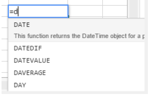
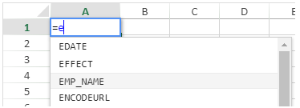

   
## Usando fórmulas

Uma fórmula de planilha é uma expressão que calcula o valor de uma célula.

### Introduzir fórmulas

Para introduzir uma fórmula numa área 4D View Pro:

1.  Selecione a célula onde você digitará a fórmula ou função.
2.  Digite = (o sinal de igual).
3.  Digite a fórmula e pressione a tecla **Enter**.

Ao escrever uma fórmula, pode utilizar diferentes atalhos:

- clique numa célula para introduzir a sua referência na fórmula:


- digite a primeira letra de uma função para entrar. Um menu pop-up que lista as funções e referências disponíveis é exibido, permitindo que você selecione os elementos desejados:


Você também pode criar fórmulas nomeadas que podem ser chamadas por seu nome. Para fazer isso, insira essas fórmulas usando o comando [VP ADD FORMULA NAME](method-list.md#vp-add-formula-name).

### Operadores e Operandos

Todas as fórmulas têm operandos e operadores:

*   **Operadores**: veja [Valores e operadores](#values-and-operators) abaixo.
*   **Operandos** inclui várias categorias:
    *   Os [valores](#values-and-operators) (5 tipos de dados são suportados)
    *   As [referências a outras células](#cell-references) (relativo, absoluto, misto ou por nome)
    *   [funções standard de folha de cálculo](#built-in-functions)
    *   [funções 4D](#4d-functions) baseadas em fórmulas 4D e que fornecem acesso a variáveis, campos, métodos, comandos ou expressões 4D.

## Valores e operadores

4D View Pro suporta cinco tipos de dados. Para cada tipo de dados, há suporte para valores literais e operadores específicos.

| Tipos de dados                       | Valores                                               | Operadores                                                                                                                                                                                                                                      |
| ------------------------------------ | ----------------------------------------------------- | ----------------------------------------------------------------------------------------------------------------------------------------------------------------------------------------------------------------------------------------------- |
| [Number](Concepts/dt_number.md)      | 1.2<br/>1.2 E3<br/>1.2E-3<br/>10.3x | + (adição)<br/>- (subtração)<br/>* (multiplicação)<br/>/ (divisão)<br/>^ (expoente, o número de vezes para multiplicar um número por ele mesmo)<br/>% (porcentagem -- dividir o número antes do operador por cem) |
| [Date](Concepts/dt_date.md)          | 10/24/2017                                            | + (data + número de dias -> data)<br/>+ (data + hora -> data + hora do dia)<br/>- (data - número de dias -> data)<br/>- (data - data - data -> número de dias entre os dois)                                                  |
| [Hora](Concepts/dt_time.md)          | 10:12:10                                              | Operadores de duração:<br/>+ (adição)<br/>- (subtração)<br/>* (duração * número -> duração)<br/>/ (duração / número -> duração)                                                                                       |
| [String](Concepts/dt_string.md)      | 'Sophie' ou "Sophie"                                  | & (concatenação)                                                                                                                                                                                                                                |
| [Parâmetros](Concepts/dt_boolean.md) | TRUE ou FALSE                                         | -                                                                                                                                                                                                                                               |


### Operadores de comparação

Os operadores a seguir podem ser usados com dois operandos do mesmo tipo:

| Operador   | Comparação           |
| ---------- | -------------------- |
| =          | igual a              |
| `<>` | diferente de         |
| >          | maior que            |
| <          | menor que            |
| >=         | maior ou igual a     |
| <=         | menor que ou igual a |


### Precedência do operador

Lista dos operadores, do mais importante para o menos importante:

| Operador                                      | Descrição                     |
| --------------------------------------------- | ----------------------------- |
| ()                                            | Parênteses (para agrupamento) |
| -                                             | Negativo                      |
| +                                             | Mais                          |
| %                                             | Porcentagem                   |
| ^                                             | Expoente                      |
| * e /                                         | Multiplicar e dividir         |
| + e -                                         | Adicionar e subtrair          |
| &                                             | Concatenar                    |
| `=`  `>` `<` `>=` `<=` `<>` | Comparar                      |


## Referências de células

As fórmulas referem-se frequentemente a outras células através de endereços de células. Pode copiar estas fórmulas para outras células. Por exemplo, a fórmula a seguir, inserida na célula C8, adiciona os valores nas duas células acima dela e exibe o resultado.

```
= C6 + C7
```

Essa fórmula se refere às células C6 e C7. Ou seja, 4D View Pro é instruído a consultar essas outras células para obter os valores a serem usados na fórmula.

Quando você copia ou move essas fórmulas para novos locais, o endereço de cada célula dessa fórmula muda ou permanece o mesmo, dependendo de como foi digitado.

*   Uma referência que muda é chamada de **referência relativa** e se refere a uma célula de acordo com a distância à esquerda/direita e acima/abaixo da célula com a fórmula.
*   Uma referência que sempre aponta para uma determinada célula é chamada de **referência absoluta**.
*   Pode também criar uma referência mista que sempre aponta para uma linha fixa ou coluna.


### Notação de referências

Se você usar apenas coordenadas de célula, por exemplo, `C5`, 4D View Pro interpreta a referência como relativa. Você pode fazer a referência absoluta colocando um sinal de dólar na frente da letra e do número, como em `$C$5`.

Você pode misturar referências absolutas e relativas inserindo um sinal de dólar na frente da letra ou do número sozinho, por exemplo, `$C5` ou `C$5`. Uma referência mista permite que você especifique a linha ou a coluna como absoluta, enquanto permite que a outra parte do endereço consulte relativamente.

Uma conveniente, maneira rápida e precisa de especificar uma referência absoluta é nomear a célula e usar esse nome no lugar do endereço da célula. Uma referência a uma célula nomeada é sempre absoluta. Você pode criar ou modificar células nomeadas, ou intervalos de células usando o método [`VP ADD RANGE NAME`](method-list.md#vp-add-range-name).

A tabela seguinte mostra o efeito das diferentes notações:

| Exemplo        | Tipo de referência | Descrição                                                                                                                                                  |
| -------------- | ------------------ | ---------------------------------------------------------------------------------------------------------------------------------------------------------- |
| C5             | Relativo           | A referência é a localização relativa da célula C5, dependendo da localização da célula na qual a referência é usada pela primeira vez                     |
| $C$5           | Absoluto           | A referência é absoluta. Referir-se-á sempre à célula C5, independentemente do local onde for utilizada.                                                   |
| $C5            | Mixed              | A referência é sempre à coluna C, mas a referência de linha é relativa à localização da célula na qual a referência é usada pela primeira vez.             |
| C$5            | Mixed              | Referência é sempre a linha 5, mas a referência da coluna é relativa à localização da célula na qual a referência é usada pela primeira vez                |
| Nome da célula | Absoluto           | A referência é absoluta. Sempre irá se referir à [célula ou intervalo nomeado](method-list.md#vp-add-range-name) não importa onde a referência seja usada. |


## Funções incorporadas

Funções da planilha são fórmulas pré-definidas usadas para calcular valores de célula. Quando você digita a primeira letra da função a ser inserida, um menu pop-up que lista as funções e referências disponíveis é exibido, permitindo que você selecione os elementos desejados:



Consulte a [**lista ampliada de funções de SpreadJS**](https://www.grapecity.com/spreadjs/docs/v14/online/FormulaFunctions.html) para obter detalhes e exemplos.


## Funções 4D

O 4D View Pro permite que você defina e chame **funções personalizadas 4D**, que executam [fórmulas 4D](API/FunctionClass.md). O uso de funções personalizadas 4D amplia as possibilidades de seus documentos 4D View Pro e permite interações poderosas com o banco de dados 4D.

Funções personalizadas 4D fornecem acesso, de dentro de suas fórmulas 4D View Pro, para:

- Variáveis processo 4D,
- campos,
- métodos projeto,
- Comandos de linguagem 4D,
- ou qualquer expressão 4D válida.

As funções personalizadas 4D podem receber [parâmetros](#parameters) da área 4D View Pro e retornar valores.

Você declara todas as suas funções usando o método [`VP SET CUSTOM`](method-list.md#vp-set-custom-functions). Exemplos:

```4d
o:=New object

//Name of the function in 4D View Pro: "DRIVERS_LICENCE"
$o.DRIVERS_LICENCE:=New object

//process variable
$o.DRIVERS_LICENCE.formula:=Formula(DriverLicence)

//table field
$o.DRIVERS_LICENCE.formula:=Formula([Users]DriverLicence)

//project method
$o.DRIVERS_LICENCE.formula:=Formula(DriverLicenceState)

//4D command
$o.DRIVERS_LICENCE:=Formula(Choose(DriverLicence; "Obtained"; "Failed"))

//4D expression and parameter
$o.DRIVERS_LICENCE.formula:=Formula(ds. Users.get($1). DriverLicence)
$o.DRIVERS_LICENCE.parameters:=New collection
$o.DRIVERS_LICENCE.parameters.push(New object("name"; "ID"; "type"; Is longint))
```

> **Veja também** [4D View Pro: Use fórmulas 4D em sua planilha (blog post)](https://blog.4d.com/4d-view-pro-use-4d-formulas-in-your-spreadsheet/)


### Exemplo Hello World

Queremos imprimir "Hello World" em uma célula de área do 4D View Pro usando um método de projeto 4D:

1.  Crie um método projeto "myMethod" com o seguinte código:

```4d
 #DECLARE->$hw Text
 $hw:="Hello World"

```

2.  Execute o código a seguir antes de abrir qualquer formulário que contenha uma área 4D View Pro:

```4d
  Case of
    :(Form event code=On Load)
       var $o : Object
       $o:=New object
  // Definir a função "vpHello" a partir do método "myMethod"
       $o.vpHello:=New object
       $o.vpHello.formula:=Formula(myMethod)
       VP SET CUSTOM FUNCTIONS("ViewProArea";$o)
 End case
```

3.  Editar o conteúdo de uma célula numa área 4D View Pro e digitar:

    

    "myMethod" é então chamado por 4D e a célula aparece:

    


### Parâmetros

Os parâmetros podem ser passados para funções 4D que chamam métodos de projeto usando a seguinte sintaxe:

```
=METHODNAME(param1,param2,...,paramN)
```

Esses parâmetros são recebidos em *methodName* em $1, $2...$N.

Observe que os ( ) são obrigatórios, mesmo que nenhum parâmetro seja passado:

```
=METHODWITHOUTNAME()
```

Você pode declarar o nome, o tipo e o número de parâmetros por meio da coleção de *parâmetros* da função que declarou usando o método [VP SET CUSTOM FUNCTIONS](method-list.md#vp-set-custom-functions). Opcionalmente, você pode controlar o número de parâmetros passados pelo usuário através das propriedades *minParams* e *maxParams*.

Para obter mais informações sobre os parâmetros de entrada compatíveis, consulte a descrição do método [VP SET CUSTOM FUNCTIONS](method-list.md#vp-set-custom-functions).

> Se você não declarar parâmetros, os valores podem ser seguidamente passados para os métodos (eles serão recebidos em $1, $2. .) e seu tipo será convertido automaticamente. Datas no *jstype* serão passadas como [objeto](Concepts/dt_object.md) no código 4D com duas propriedades:   
> ├Property"} Typeive ├---├---├ ├valueDateDateDateDateDate value├ ├Time em segundos.

Métodos de projeto 4D também podem retornar valores na fórmula da célula 4D View Pro através de $0. São suportados os seguintes tipos de dados para os parâmetros devolvidos:

* [text](Concepts/dt_string.md) (convertido em uma cadeia de caracteres em 4D View Pro)
* [real/longint](Concepts/dt_number.md) (convertido em número no 4D View Pro)
* [data](Concepts/dt_date.md) (convertida para o tipo JS Date no 4D View Pro - hora, minuto, segundo = 0)
* [time](Concepts/dt_time.md) (convertido para JS Date type em 4D View Pro - data na data base, ou seja, 12/30/1899)
* [boolean](Concepts/dt_boolean.md) (convertido para bool no 4D View Pro)
* [picture](Concepts/dt_picture.md) (jpg,png,gif,bmp,svg outros tipos convertidos para png) cria uma URI (data:image/png; ase64,xxxx) e depois usado como plano de fundo em 4D View Pro na célula onde a fórmula é executada
* [objeto](Concepts/dt_object.md) com as seguintes duas propriedades (permitindo passar uma data e hora):

    | Propriedade | Tipo | Descrição         |
    | ----------- | ---- | ----------------- |
    | value       | Date | Valor data        |
    | time        | Real | Tempo em segundos |

Se o método 4D não retornar nada, uma string vazia será automaticamente retornada.

É devolvido um erro na célula 4D View Pro se:

*   o método 4D retorna outro tipo além do listado acima
*   um erro ocorreu durante a execução do método 4D (quando o usuário clica no botão "abortar").

#### Exemplo

```4d
var $o : Object

$o.BIRTH_INFORMATION:=New object
$o.BIRTH_INFORMATION.formula:=Formula(BirthInformation)
$o.BIRTH_INFORMATION.parameters:=New collection
$o.BIRTH_INFORMATION.parameters.push(New object("name";"First name";"type";Is text))
$o.BIRTH_INFORMATION.parameters.push(New object("name";"Birthday";"type";Is date))
$o.BIRTH_INFORMATION.parameters.push(New object("name";"Time of birth";"type";Is time))
$o.BIRTH_INFORMATION.summary:="Returns a formatted string from given information" VP SET CUSTOM FUNCTIONS("ViewProArea"; $o)
```


## Compatibidade

Soluções alternativas estão disponíveis para declarar campos ou métodos como funções em suas áreas do 4D View Pro. Essas soluções são mantidas por motivos de compatibilidade e podem ser usadas em casos específicos. No entanto, é recomendável usar o método [`VP SET CUSTOM FUNCTIONS`](method-list.md#vp-set-custom-functions).

### Referência a campos utilizando a estrutura virtual


4D View Pro permite que você faça referência a campos 4D usando a estrutura virtual do banco de dados, ou seja, declarada por meio da função [`SET TABLE TITLES`](https://doc.4d.com/4dv19/help/command/en/page601.html) e/ou [`SET FIELD TITLES`](https://doc.4d.com/4dv19/help/command/en/page602.html) com o parâmetro \*. Essa solução alternativa pode ser útil se o sua aplicação já depender de uma estrutura virtual (caso contrário, recomenda-se [usar `VP SET CUSTOM FUNCTIONS`](#4d-functions)).

> **ATENÇÃO:** não pode utilizar a estrutura virtual e `VP SET CUSTOM FUNCTIONS` simultaneamente. Assim que `o VP SET CUSTOM FUNCTIONS` é chamado, as funções baseadas nos comandos `SET TABLE TITLES` e `SET FIELD TITLES` são ignoradas na área do 4D View Pro.

#### Requisitos

*   O campo deve pertencer à estrutura virtual do banco de dados, ou seja, deve ser declarado por meio do comando [`SET TABLE TITLES`](https://doc.4d.com/4dv19/help/command/en/page601.html) e/ou [`SET FIELD TITLES`](https://doc.4d.com/4dv19/help/command/en/page602.html) com o parâmetro \* (consulte o exemplo),
*   Os nomes das tabelas e dos campos devem estar em conformidade com (consulte [o standard ECMA ECMA Script](https://www.ecma-international.org/ecma-262/5.1/#sec-7.6)),
*   O tipo de campo deve ser compatível com 4D View Pro (veja acima).

Um erro será retornado na célula do 4D View Pro se a fórmula chamar um campo que não esteja em conformidade.

#### Chamar um campo virtual numa fórmula

Para inserir uma referência a um campo virtual em uma fórmula, insira o campo com a seguinte sintaxe:

```
TABLENAME_FIELDNAME()
```

Por exemplo, se você declarou o campo "Name" da tabela "People" na estrutura virtual, poderá chamar as seguintes funções:

```
=PEOPLE_NAME()
=LEN(PEOPLE_NAME())
```

> Se um campo tiver o mesmo nome de um [método 4D], ele terá prioridade sobre o método.

#### Exemplo

Queremos imprimir o nome de uma pessoa em uma célula de área do 4D View Pro usando um campo virtual 4D:

1.  Criar uma tabela "Employee" com um campo "L_Name":


2.  Execute o seguinte código para inicializar uma estrutura virtual:

    ```4d
    ARRAY TEXT($tableTitles;1)
    ARRAY LONGINT($tableNum;1)
    $tableTitles{1}:="Emp"
    $tableNum{1}:=2
    SET TABLE TITLES($tableTitles;$tableNum;*)

    ARRAY TEXT($fieldTitles;1)
    ARRAY LONGINT($fieldNum;1)
    $fieldTitles{1}:="Name"
    $fieldNum{1}:=2 //sobrenome
    SET FIELD TITLES([Employee];$fieldTitles;$fieldNum;*)
    ```

3.  Edite o conteúdo de uma célula na área do 4D View Pro e digite "=e":




4.  Selecionar EMP_NAME (utilizar a tecla Tab) e introduzir o fecho.


5.  Validar o campo para apresentar o nome do empregado atual:


> A tabela \[Employee] tem de ter um registo atual.


### Declaração dos métodos permitidos

Você pode chamar diretamente os métodos do projeto 4D a partir de suas fórmulas do 4D View Pro. Por motivos de segurança, você deve declarar explicitamente os métodos que podem ser chamados pelo usuário com o método [VP SET ALLOWED METHODS](method-list.md#vp-set-allowed-methods).


#### Requisitos

Para ser chamado numa fórmula 4D View Pro, um método projeto deve ser:

*   **Permitido**: ele foi declarado explicitamente usando o método [VP SET ALLOWED METHODS](method-list.md#vp-set-allowed-methods).
*   **Executável**: pertence ao projeto host ou a um componente carregado com a opção "Compartilhado por componentes e projeto host" ativada (consulte [Compartilhamento de métodos projeto](../Extensions/develop-components.md#sharing-of-project-methods)).
*   **Não entrar em conflito** com uma função de planilha do 4D View Pro existente: se você chamar um método de projeto com o mesmo nome de uma função integrada do 4D View Pro, a função será chamada.
> Se nem o [VP SET PERSONALIZADO](method-list.md#vp-set-custom-functions) nem o método [VP SET PERMITIDO DE METES](method-list.md#vp-set-allowed-methods) foi executado durante a sessão, As funções personalizadas do 4D View Pro dependem dos métodos permitidos definidos pelo comando `genérico do 4D SET PERMITIDO METES`. Nesse caso, os nomes dos métodos projeto devem estar em conformidade com a gramática do identificador JavaScript (consulte o [ECMA Script standard](https://www.ecma-international.org/ecma-262/5.1/#sec-7.6)). A opção global de filtragem na caixa de diálogo Configurações (ver *Acesso aos Dados*) é ignorada em todos os casos.

