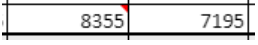

4D View Pro is a [4D component](Concepts/components.md) that includes a [4D form area](FormObjects/viewProArea_overview.md) and specific [methods](method-list.md). Permite que você incorpore funcionalidades avançadas de planilha em seus projetos.


Uma planilha é uma aplicação que contém uma grade de células onde você pode inserir informações, executar cálculos ou exibir imagens. 4D View Pro é alimentado pela solução de [folha de cálculo SpreadJS](https://www.grapecity.com/spreadjs/docs/versions/v14/online/overview.html) integrada em 4D.

Embedding 4D View Pro areas in your forms allows you to import and export spreadsheets documents using the 4D View Pro commands.


## Instalação e ativação

4D View Pro features are directly included in 4D, making it easy to deploy and manage. Não é necessária qualquer instalação adicional.

No entanto, 4D View Pro requer uma licença. You need to activate this license in your application in order to use its features. When using this component without a license, the contents of an object that requires a 4D View Pro feature are not displayed at runtime, an error message is displayed instead:


## Inserção de uma área 4D View Pro

4D View Pro documents are displayed and edited manually in a [4D form object](FormObjects/viewProArea_overview.md) named 4D View Pro. Para selecionar este objeto, clique na última ferramenta da barra de objetos:


You can also select a preconfigured 4D View Pro area in the [Object library](FormEditor/objectLibrary.md).

> As áreas 4D View Pro também podem ser [criadas e usadas fora da tela](method-list.md#vp-run-offscreen-area).

You can [configure the area](configuring.md) using the Property List and 4D View Pro methods.


## Noções básicas de seleção, introdução e navegação

As folhas de cálculo são compostas por linhas e colunas. A cada linha está associado um número. A letter (or group of letters once the number of columns surpasses the number of letters in the alphabet) is associated with each column. A intersecção de uma linha e de uma coluna constitui uma célula. As células podem ser seleccionadas e o seu conteúdo editado.

### Seleção de células, colunas e linhas

*   To select a cell, simply click on it or use the direction arrows on the keyboard. O seu conteúdo (ou fórmula) é apresentado na célula.

*   To select several continuous cells, drag the mouse from one end of the selection to the other. You can also click on the two ends of the selection while holding down the Shift key.

*   To select all cells in the spreadsheet, click on the cell at the top left of the area: 

*   Para selecionar uma coluna, clique na letra correspondente (ou conjunto de letras).

*   Para selecionar uma linha, clique no número correspondente.

*   To select a group of cells that are not continuous, hold down the **Ctrl** key (Windows) or **Command** key (Mac) and click on each cell to be selected.

*   Para anular a seleção de células, basta clicar em qualquer parte da folha de cálculo.

### Introdução de dados

Clicar duas vezes em uma célula permite passar para o modo entrada na célula relevante. If the cell is not empty, the insertion cursor is placed after the content of the cell.


Data can be entered directly once a cell is already selected, even if the insertion cursor is not visible. The input then replaces the content of the cell.

The **Tab** key validates the cell input and selects the cell to its right. Combining the **Shift + Tab** keys validates the cell input and selects the cell to its left.


The **Carriage return** key validates the cell input and selects the cell below it. Combining the **Shift + Carriage return** keys validates the cell input and selects the cell above it.

The direction keys (arrows) allow you to move a cell in the direction indicated by the arrow.


### Utilizar o menu de contexto

4D View Pro areas benefit from an automatic context menu that offers standard editing features such as copy and paste, but also basic spreadsheet features:


> The Copy/Cut and Paste features of the context menu only work within the spreadsheet area, they do not have access to the system pasteboard. System shortcuts such as **Ctrl+c/Ctrl+v** works however and can be used to exchange data between the area and other applications.

 Depending on the clicked area, the following options are also available:

*   click on a column or row header: **Insert**, **Delete**, **Hide**, or **Unhide** the contents
*   clique numa célula ou num intervalo de células:
    *   **Filter**: allows hiding row through filters (see [Filtering rows](https://www.grapecity.com/spreadjs/docs/versions/v14/online/filter.html) in the SpreadJS documentation).
    *   **Ordenar**: ordena o conteúdo da coluna.
    *   **Insert Comment**: allows user to enter a comment for an area. When a comment has been entered for an area, the top left cell of the area displays a small red triangle:  
      


## Uso dos métodos 4D View Pro

4D View Pro methods can be used in the 4D Code Editor, just like 4D language commands.

Since 4D View Pro is a built-in 4D component, you can access its list of methods from the Explorer, in the **Component Methods** section:


For a detailed list of component methods, see [Method list](method-list.md).

### Processamento de uma zona 4D View Pro

Uma área 4D View Pro lida com vários objetos e elementos.


Most of 4D View Pro methods require a *vpAreaName* parameter, which is the [**4D View Pro form area name**](FormObjects/viewProArea_overview.md) (4D form object). Este nome é a propriedade do [nome do objeto](FormObjects/properties_Object.md#object-name).

Por exemplo, se quiser definir o número total de colunas de uma área chamada "myVpArea", escreva:

```4d
VP SET COLUMN COUNT("myVpArea";5)
```


> When loading a 4D View Pro object in a form area, 4D generates the [On VP Ready](../Events/onVpReady.md) form event once the whole area is loaded. You must execute any 4D View Pro code handling the area in this event, otherwise an error is returned.


### Utilização de objectos de intervalo

Some 4D View Pro methods require a *rangeObj* parameter. No 4D View Pro, um intervalo é um objeto que referir-se a uma área em uma planilha. Esta área pode ser composta por uma ou várias células. Using 4D View Pro methods, you can create ranges and pass them to other methods to read from or write to specific locations in your document.

Por exemplo, para criar um objeto intervalo para as seguintes células:


Você pode usar o método [VP Cells](method-list.md#vp-cells):

```4d 
var $myRange : Object
$myRange:=VP Cells("ViewProArea";2;4;2;3) // C5 a D7
```

Você pode então passar `$myRange` para outro método 4D View Pro para modificar essas células (por exemplo, adicionar uma borda ao conjunto de células com [VP SET BORDER](method-list.md#vp-set-border)).

Os objectos intervalo 4D View Pro são compostos por várias propriedades:

*   área - O nome da área 4D View Pro
*   intervalos - Uma coleção de objeto(s) intervalo. Available properties within each range object depend on the range object type. For example, a column range object will only include the *.column* and *.sheet* properties.

| Propriedade |                   | Tipo       | Descrição                                                                 | Disponível para                                              |
| ----------- | ----------------- | ---------- | ------------------------------------------------------------------------- | ------------------------------------------------------------ |
| area        |                   | text       | Nome de objeto formulário área 4D View Pro                                | sempre disponível                                            |
| ranges      |                   | collection | Coleção de intervalo(s)                                                   | sempre disponível                                            |
|             | \[ ].name        | text       | Nome do intervalo                                                         | name                                                         |
|             | \[ ].sheet       | number     | Índice da folha (índice da folha atual por padrão) (contagem começa em 0) | célula, células, linha, linhas, coluna, colunas, todas, nome |
|             | \[ ].row         | number     | Índice da linha (a contagem começa em 0)                                  | célula, células, linha, linhas                               |
|             | \[ ].rowCount    | number     | Contagem de linhas                                                        | células, linhas                                              |
|             | \[ ].column      | number     | Índice da coluna (a contagem começa em 0)                                 | célula, células, coluna, colunas                             |
|             | \[ ].columnCount | number     | Contagem das colunas                                                      | cells, columns                                               |


## Importação e exportação de documentos

4D View Pro suporta a importação e exportação de vários formatos de documentos:

* .4vp
* .xlsx
* .txt e .csv
* .pdf (apenas para exportação)

Para obter mais detalhes, consulte a descrição de [VP IMPORT DOCUMENT](method-list.md#vp-import-document) e [VP EXPORT DOCUMENT](method-list.md#vp-export-document).
