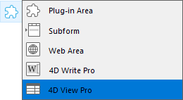
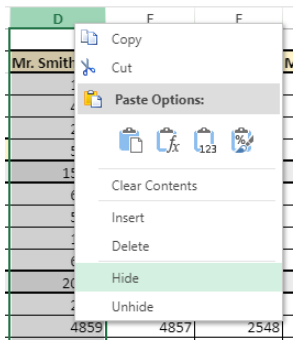
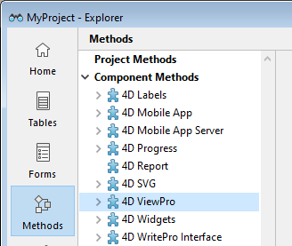

O 4D View Pro é um [componente 4D](Concepts/components.md) que inclui uma [área de formulário 4D](FormObjects/viewProArea_overview.md) e [métodos](method-list.md) específicos. Permite que você incorpore funcionalidades avançadas de planilha em seus projetos.


Uma planilha é uma aplicação que contém uma grade de células onde você pode inserir informações, executar cálculos ou exibir imagens. 4D View Pro é alimentado pela solução de [folha de cálculo SpreadJS](https://www.grapecity.com/spreadjs/docs/versions/v14/online/overview.html) integrada em 4D.

A incorporação de áreas do 4D View Pro em seus formulários permite importar e exportar documentos de planilhas eletrônicas usando os comandos do 4D View Pro.


## Instalação e ativação

Os recursos do 4D View Pro estão incluídos diretamente no 4D, o que facilita a implementação e o gerenciamento. Não é necessária qualquer instalação adicional.

No entanto, 4D View Pro requer uma licença. Você precisa ativar essa licença em seu aplicativo para usar seus recursos. Ao usar esse componente sem uma licença, o conteúdo de um objeto que requer um recurso do 4D View Pro não é exibido em tempo de execução; em vez disso, é exibida uma mensagem de erro:


## Inserção de uma área 4D View Pro

Os documentos 4D View Pro são exibidos e editados manualmente em um objeto [4D formulário](FormObjects/viewProArea_overview.md) chamado 4D View Pro. Para selecionar este objeto, clique na última ferramenta da barra de objetos:



Você também pode selecionar uma área 4D View Pro pré-configurada na biblioteca [Objeto](FormEditor/objectLibrary.md).

> As áreas 4D View Pro também podem ser [criadas e usadas fora da tela](method-list.md#vp-run-offscreen-area).

Você pode [configurar a área](configuring.md) usando os métodos Property List e 4D View Pro.


## Noções básicas de seleção, introdução e navegação

As folhas de cálculo são compostas por linhas e colunas. A cada linha está associado um número. Uma letra (ou grupo de letras, uma vez que o número de colunas ultrapassa o número de letras do alfabeto) é associada a cada coluna. A intersecção de uma linha e de uma coluna constitui uma célula. As células podem ser seleccionadas e o seu conteúdo editado.

### Seleção de células, colunas e linhas

*   Para selecionar uma célula, basta clicar nela ou usar as setas de direção do teclado. O seu conteúdo (ou fórmula) é apresentado na célula.

*   Para selecionar várias células contínuas, arraste o mouse de uma extremidade da seleção para a outra. Você também pode clicar nas duas extremidades da seleção enquanto mantém pressionada a tecla Shift.

*   Para selecionar todas as células da planilha, clique na célula no canto superior esquerdo da área: 

*   Para selecionar uma coluna, clique na letra correspondente (ou conjunto de letras).

*   Para selecionar uma linha, clique no número correspondente.

*   Para selecionar um grupo de células que não são contínuas, Mantenha pressionada a tecla **Ctrl** (Windows) ou **Comando** (Mac) e clique em cada célula a ser selecionada.

*   Para anular a seleção de células, basta clicar em qualquer parte da folha de cálculo.

### Introdução de dados

Clicar duas vezes em uma célula permite passar para o modo entrada na célula relevante. Se a célula não estiver vazia, o cursor de inserção será colocado após o conteúdo da célula.


Os dados podem ser inseridos diretamente quando uma célula já estiver selecionada, mesmo que o cursor de inserção não esteja visível. The input then replaces the content of the cell.

A tecla **Tab** valida a entrada da célula e seleciona a célula à sua direita. A combinação das teclas **Shift + Tab** valida a entrada da célula e seleciona a célula à sua esquerda.


A tecla **Retorno de Carro** valida a entrada da célula e seleciona a célula abaixo dela. A combinação das teclas **Shift + Retorno de Carro** valida a entrada da célula e seleciona a célula acima dela.

As teclas de direção (setas) permitem que você mova uma célula na direção indicada pela seta.


### Utilizar o menu de contexto

As áreas do 4D View Pro se beneficiam de um menu de contexto automático que oferece recursos de edição padrão, como copiar e colar, mas também recursos básicos de planilha eletrônica:


> Os recursos Copiar/Cortar e Colar do menu de contexto funcionam apenas na área da planilha, não tendo acesso à área de transferência do sistema. No entanto, os atalhos do sistema, como **Ctrl+c/Ctrl+v**, funcionam e podem ser usados para trocar dados entre a área e outros aplicativos.

 Dependendo da área clicada, as seguintes opções também estão disponíveis:

*   clique em um cabeçalho de coluna ou linha: **Inserir**, **excluir**, **ocultar** ou **exibir** o conteúdo
*   clique numa célula ou num intervalo de células:
    *   **Filter**: permite ocultar a linha por meio de filtros (consulte [Filtragem de linhas](https://www.grapecity.com/spreadjs/docs/versions/v14/online/filter.html) na documentação do SpreadJS).
    *   **Ordenar**: ordena o conteúdo da coluna.
    *   **Inserir Comentário**: permite que o usuário insira um comentário para uma área. Quando um comentário foi inserido para uma área, a célula superior esquerda da área exibe um pequeno triângulo vermelho:  
      


## Uso dos métodos 4D View Pro

Os métodos 4D View Pro podem ser usados no Editor de Código 4D, assim como comandos de idioma 4D.

Como o 4D View Pro é um componente 4D integrado, é possível acessar sua lista de métodos no Explorer, na seção **Component Methods (Métodos do componente** ):



Para obter uma lista detalhada dos métodos do componente, consulte a lista [Método](method-list.md).

### Processamento de uma zona 4D View Pro

Uma área 4D View Pro lida com vários objetos e elementos.


A maioria dos métodos 4D View Pro requer um parâmetro *vpAreaName* , que é o nome da área de formulário [**4D View Pro**](FormObjects/viewProArea_overview.md) (objeto de formulário 4D). Este nome é a propriedade do [nome do objeto](FormObjects/properties_Object.md#object-name).

Por exemplo, se quiser definir o número total de colunas de uma área chamada "myVpArea", escreva:

```4d
VP SET COLUMN COUNT("myVpArea";5)
```


> Ao carregar um objeto 4D View Pro em um formulário, 4D gera o evento do formulário [No VP Ready](../Events/onVpReady.md) depois que toda a área for carregada. Você deve executar qualquer código 4D View Pro que lide com a área neste evento, caso contrário um erro é devolvido.


### Utilização de objectos de intervalo

Alguns métodos do 4D View Pro exigem um parâmetro *rangeObj*. No 4D View Pro, um intervalo é um objeto que referir-se a uma área em uma planilha. Esta área pode ser composta por uma ou várias células. Usando métodos 4D View Pro, você pode criar intervalos e passá-los para outros métodos para ler ou escrever em locais específicos no seu documento.

Por exemplo, para criar um objeto intervalo para as seguintes células:


Você pode usar o método [VP Cells](method-list.md#vp-cells):

```4d 
var $myRange : Object
$myRange:=VP Cells("ViewProArea";2;4;2;3) // C5 a D7
```

Você pode então passar `$myRange` para outro método 4D View Pro para modificar essas células (por exemplo, adicionar uma borda ao conjunto de células com [VP SET BORDER](method-list.md#vp-set-border)).

Os objectos intervalo 4D View Pro são compostos por várias propriedades:

*   área - O nome da área 4D View Pro
*   intervalos - Uma coleção de objeto(s) intervalo. As propriedades disponíveis em cada objeto de intervalo dependem do tipo de objeto de intervalo. Por exemplo, um objeto de intervalo de colunas incluirá apenas as propriedades *.column* e *.sheet*.

| Propriedade |                   | Tipo       | Descrição                                                                 | Disponível para                                              |
| ----------- | ----------------- | ---------- | ------------------------------------------------------------------------- | ------------------------------------------------------------ |
| area        |                   | text       | Nome de objeto formulário área 4D View Pro                                | sempre disponível                                            |
| ranges      |                   | collection | Coleção de intervalo(s)                                                   | sempre disponível                                            |
|             | \[ ].name        | text       | Nome do intervalo                                                         | name                                                         |
|             | \[ ].sheet       | number     | Índice da folha (índice da folha atual por padrão) (contagem começa em 0) | célula, células, linha, linhas, coluna, colunas, todas, nome |
|             | \[ ].row         | number     | Índice da linha (a contagem começa em 0)                                  | célula, células, linha, linhas                               |
|             | \[ ].rowCount    | number     | Contagem de linhas                                                        | células, linhas                                              |
|             | \[ ].column      | number     | Índice da coluna (a contagem começa em 0)                                 | célula, células, coluna, colunas                             |
|             | \[ ].columnCount | number     | Contagem das colunas                                                      | células, colunas                                             |


## Importação e exportação de documentos

4D View Pro suporta a importação e exportação de vários formatos de documentos:

* .4vp
* .xlsx
* .txt e .csv
* .pdf (apenas para exportação)

Para obter mais detalhes, consulte a descrição de [VP IMPORT DOCUMENT](method-list.md#vp-import-document) e [VP EXPORT DOCUMENT](method-list.md#vp-export-document).
