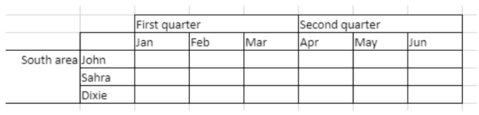
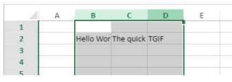
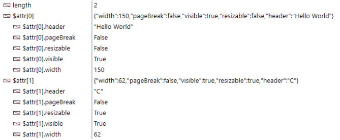
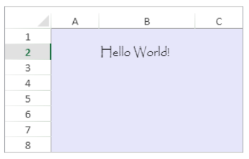

> **Aviso**: os comandos nesta página não são thread-safe.

[A](#a) - [C](#c) - [D](#d) - [E](#e) - [F](#f) - [G](#g) - [I](#i) - [M](#m) - [N](#n) - [O](#o) - [P](#p) - [R](#r) - [S](#s)

## A

### VP ADD FORMULA NAME

<!-- REF #_method_.VP ADD FORMULA NAME.Syntax -->

**VP ADD FORMULA NAME** ( *vpAreaName* : Text ; *vpFormula* : Text ; *name* : Text { ; *options* : Object } )<!-- END REF -->

<!-- REF #_method_.VP ADD FORMULA NAME.Params -->

| Parâmetro  | Tipo   |    | Descrição                                                |
| ---------- | ------ | -- | -------------------------------------------------------- |
| vpAreaName | Text   | -> | Nome de objeto formulário área 4D View Pro               |
| vpFormula  | Text   | -> | Fórmula 4D View Pro                                      |
| name       | Text   | -> | Nome da fórmula                                          |
| options    | Object | -> | Opções para a fórmula| nomeada<!-- END REF -->

|

#### Descrição

O comando `VP ADD FORMULA NAME` <!-- REF #_method_.VP ADD FORMULA NAME.Summary -->cria ou modifica uma fórmula nomeada no documento aberto<!-- END REF -->.
> As fórmulas nomeadas criadas por este comando são guardadas com o documento.

Em *vpAreaName*, passe o nome da área 4D View Pro. Se passar um nome que não existe, é devolvido um erro.

Passar a fórmula 4D View Pro que deseja nomear em *vpFormula*. Para obter informações detalhadas sobre a sintaxe das fórmulas, consulte a página [Fórmulas e funções](formulas.md).

Passar o novo nome da fórmula em *name*. Se o nome já estiver a ser utilizado no mesmo âmbito, a nova fórmula nomeada substitui a existente. Note que pode utilizar o mesmo nome para diferentes âmbitos (ver abaixo).

Pode passar um objeto com propriedades adicionais para a fórmula nomeada em *options*. As propriedades abaixo são compatíveis:

| Propriedade | Tipo   | Descrição                                                                                                                                                                                                                                                                                                                                                 |
| ----------- | ------ | --------------------------------------------------------------------------------------------------------------------------------------------------------------------------------------------------------------------------------------------------------------------------------------------------------------------------------------------------------- |
| scope       | Number | Escopo da fórmula. Pode passar o índice da folha (a contagem começa em 0) ou utilizar as seguintes constantes: <li>`vk current sheet`</li><li>`vk workbook`</li>O âmbito determina se um nome de fórmula é local para uma determinada folha (*scope*=sheet index ou `vk current sheet`), ou global para todo o livro de trabalho (*scope*=`vk workbook`). |
| comment     | Text   | Comentário associado à fórmula nomeada                                                                                                                                                                                                                                                                                                                    |

#### Exemplo

```4d
VP ADD FORMULA NAME("ViewProArea";"SUM($A$1:$A$10)";"Total2")
```

#### Veja também

[Cell references](formulas.md#cell-references)<br/>[VP Get formula by name](#vp-get-formula-by-name)<br/>[VP Get names](#vp-get-names)

### VP ADD RANGE NAME

<!-- REF #_method_.VP ADD RANGE NAME.Syntax -->

**VP ADD RANGE NAME** ( *rangeObj* : Object ; *name* : Text { ; *options* : Object } )<!-- END REF -->

<!-- REF #_method_.VP ADD RANGE NAME.Params -->

| Parâmetro | Tipo   |    | Descrição                                                |
| --------- | ------ | -- | -------------------------------------------------------- |
| rangeObj  | Object | -> | Objeto intervalo                                         |
| name      | Text   | -> | Nome da fórmula                                          |
| options   | Object | -> | Opções para a fórmula| nomeada<!-- END REF -->

|

#### Descrição

O comando `VP ADD RANGE NAME` <!-- REF #_method_.VP ADD RANGE NAME.Summary -->cria ou modifica um intervalo nomeado no documento aberto<!-- END REF -->.
> Os intervalos nomeados criados por este comando são guardados com o documento.

Em *rangeObj*, passe o intervalo que pretende nomear e passe o novo nome para o intervalo em *name*. Se o nome já estiver a ser utilizado no mesmo âmbito, o novo intervalo nomeado substitui o existente. Note que pode utilizar o mesmo nome para diferentes âmbitos (ver abaixo).

Pode passar um objeto com propriedades adicionais para o intervalo nomeado em *options*. As propriedades abaixo são compatíveis:

| Propriedade | Tipo   | Descrição                                                                                                                                                                                                                                                                                                                                                        |
| ----------- | ------ | ---------------------------------------------------------------------------------------------------------------------------------------------------------------------------------------------------------------------------------------------------------------------------------------------------------------------------------------------------------------- |
| scope       | Number | Âmbito do intervalo. Pode passar o índice da folha (a contagem começa em 0) ou utilizar as seguintes constantes: <li>`vk current sheet`</li><li>`vk workbook`</li>O âmbito determina se um nome de um intervalo é local para uma determinada folha (*scope*=sheet index ou `vk current sheet`), ou global para todo o livro de trabalho (*scope*=`vk workbook`). |
| comment     | Text   | Comentário associado ao intervalo nomeado                                                                                                                                                                                                                                                                                                                        |
> * Um intervalo nomeado é, na verdade, uma fórmula nomeada que contém coordenadas. `VP ADD RANGE NAME` facilita a criação de intervalos nomeados, mas também pode utilizar o comando [`VP ADD FORMULA NAME`](#vp-add-formula-name) para criar intervalos nomeados.
> * As fórmulas que definem intervalos nomeados podem ser recuperadas com o comando [`VP Get formula by name`](#vp-get-formula-by-name).

#### Exemplo

Pretende criar um intervalo nomeado para um intervalo de células:

```4d
$range:=VP Cell("ViewProArea";2;10)
VP ADD RANGE NAME($range;"Total1")
```

#### Veja também

[VP Get names](#vp-get-names)<br/>[VP Name](#vp-name)

### VP ADD SELECTION

<!-- REF #_method_.VP ADD SELECTION.Syntax -->

**VP ADD SELECTION** ( *rangeObj* : Object )<!-- END REF -->

<!-- REF #_method_.VP ADD SELECTION.Params -->

| Parâmetro | Tipo   |    | Descrição                                    |
| --------- | ------ | -- | -------------------------------------------- |
| rangeObj  | Object | -> | Objeto intervalo |<!-- END REF -->

|

#### Descrição

O comando `VP ADD SELECTION` <!-- REF #_method_.VP ADD SELECTION.Summary -->adiciona as células especificadas às células selecionadas<!-- END REF -->.

Em *rangeObj*, passe um objeto intervalo de células a adicionar à seleção atual.
> A célula ativa não é modificada.

#### Exemplo

Tem células atualmente seleccionadas:


O código seguinte adicionará células à sua seleção:

```4d
$currentSelection:=VP Cells("myVPArea";3;4;2;3)
VP ADD SELECTION($currentSelection)
```

Resultados:


#### Veja também

[VP Get active cell](#vp-get-active-cell)<br/>[VP Get selection](#vp-get-selection)<br/>[VP RESET SELECTION](#vp-reset-selection)<br/>[VP SET ACTIVE CELL](#vp-set-active-cell)<br/>[VP SET SELECTION](#vp-set-selection)<br/>[VP SHOW CELL](#vp-show-cell)

### VP ADD SHEET

<!-- REF #_method_.VP ADD SHEET.Syntax -->
**VP ADD SHEET** ( *vpAreaName* : Text )<br/>**VP ADD SHEET** ( *vpAreaName* : Text ; *index* : Integer )<br/>**VP ADD SHEET** ( *vpAreaName* : Text ; *sheet* : Integer ; *name* : Text )<!-- END REF -->

<!-- REF #_method_.VP ADD SHEET.Params -->

| Parâmetro  | Tipo    |    | Descrição                                  |
| ---------- | ------- | -- | ------------------------------------------ |
| vpAreaName | Text    | -> | Nome de objeto formulário área 4D View Pro |
| sheet      | Integer | -> | Índice da nova folha                       |
| name       | Text    | -> | Nome da folha|<!-- END REF -->

|

#### Descrição

O comando `VP ADD SHEET` <!-- REF #_method_.VP ADD SHEET.Summary -->insere uma folha no documento carregado em *vpAreaName*.<!-- END REF -->

Em *vpAreaName*, passe o nome da área 4D View Pro.

Em *sheet*, pode passar um índice para a nova folha. Se o *index* passado for inferior ou igual a 0, o comando insere a nova folha no início. Se o *index* exceder o número de folhas, o comando insere a nova folha após as existentes.
> A indexação começa em 0.

Em *name*, pode indicar um nome para a nova folha. O novo nome não pode conter os seguintes caracteres: `*, :, [, ], ?,\,/`

#### Exemplo

O documento tem atualmente 3 folhas:


Para inserir uma folha na terceira posição (índice 2) e chamar-lhe "March":

```4d
VP ADD SHEET("ViewProArea";2;"March")
```


#### Veja também

[VP REMOVE SHEET](#vp-remove-sheet)

### VP ADD SPAN

<!-- REF #_method_.VP ADD SPAN.Syntax -->
**VP ADD SPAN** ( *rangeObj* : Object )<!-- END REF -->

<!-- REF #_method_.VP ADD SPAN.Params -->

| Parâmetro | Tipo   |    | Descrição                                   |
| --------- | ------ | -- | ------------------------------------------- |
| rangeObj  | Object | -> | Objeto intervalo|<!-- END REF -->

|

#### Descrição

O comando `VP ADD SPAN` combina as células em *rangeObj* como um único intervalo de células.

Em *rangeObj*, passe um intervalo de células. As células do intervalo são unidas para criar uma célula maior que se estende por várias colunas ou linhas. Você pode passar vários intervalos de células para criar vários intervalos ao mesmo tempo. Note que se os intervalos de células se sobrepuserem, apenas o primeiro intervalo de células é utilizado.

> * Só são apresentados os dados da célula superior esquerda. Os dados nas outras células combinadas ficam ocultos até que a extensão seja removida.
> * Os dados ocultos em células estendidas podem ser acessados por meio de fórmulas (começando com a célula superior esquerda).

#### Exemplo

Para abranger as células do primeiro trimestre e do segundo trimestre nas duas células ao lado delas, e a célula da área sul nas duas linhas abaixo dela:


```4d
 // First quarter range
 $q1:=VP Cells("ViewProArea";2;3;3;1)

  // Second quarter range
 $q2:=VP Cells("ViewProArea";5;3;3;1)

  // South area range
 $south:=VP Cells("ViewProArea";0;5;1;3)

 VP ADD SPAN(VP Combine ranges($q1;$q2;$south))
```



#### Veja também

[4D View Pro Range Object Properties](getting-started.md#using-range-objects)<br/>[VP Get spans](#vp-get-spans)<br/>[VP REMOVE SPAN](#vp-remove-span)

### VP ADD STYLESHEET

<!-- REF #_method_.VP ADD STYLESHEET.Syntax -->
**VP ADD STYLESHEET** ( *vpAreaName* : Text ; *styleName* : Text ; *styleObj* : Object { ; *sheet* : Integer } )<!-- END REF -->

<!-- REF #_method_.VP ADD STYLESHEET.Params -->

| Parâmetro  | Tipo    |    | Descrição                                                           |
| ---------- | ------- | -- | ------------------------------------------------------------------- |
| vpAreaName | Text    | -> | Nome de objeto formulário área 4D View Pro                          |
| styleName  | Text    | -> | Nome do estilo                                                      |
| styleObj   | Object  | -> | Objeto que define as propriedades do atributo                       |
| sheet      | Integer | -> | Índice da folha (folha atual se omitida)|<!-- END REF -->

|

#### Descrição

O comando `VP ADD STYLESHEET` <!-- REF #_method_.VP ADD STYLESHEET.Summary -->cria ou modifica a folha de estilo *styleName* com base na combinação das propriedades especificadas em *styleObj* no documento aberto<!-- END REF -->. .

> As folhas de estilo criadas por esse comando são salvas com o documento.

Em *vpAreaName*, passe o nome da área 4D View Pro. Se passar um nome que não existe, é devolvido um erro.

O parâmetro *styleName* permite que você atribua um nome à folha de estilos. Se o nome já estiver sendo usado no mesmo escopo, a nova folha de estilo substituirá a existente. Note que pode utilizar o mesmo nome para diferentes âmbitos (ver abaixo).

Em *styleObj*, designe as configurações da folha de estilos (por exemplo, fonte, decoração de texto, alinhamento, bordas etc.). For the full list of style properties, see [Style object properties](configuring.md#style-object-properties).

Você pode designar onde definir a folha de estilos no parâmetro opcional *sheet* usando o índice da folha (a indexação começa em 0) ou com as seguintes constantes:

* `vk current sheet`
* `vk workbook`

Se uma folha de estilo *styleName* for definida no nível da pasta de trabalho e no nível da planilha, o nível da planilha terá prioridade sobre o nível da pasta de trabalho quando a folha de estilo for definida.

Para aplicar a folha de estilos, utilize os comandos [VP SET DEFAULT STYLE](#vp-set-default-style) ou [VP SET CELL STYLE](#vp-set-cell-style).

#### Exemplo

O seguinte código:

```4d
$styles:=New object
$styles.backColor:="green"

//Line Border Object
$borders:=New object("color";"green";"style";vk line style medium dash dot)

$styles.borderBottom:=$borders
$styles.borderLeft:=$borders
$styles.borderRight:=$borders
$styles.borderTop:=$borders VP ADD STYLESHEET("ViewProArea";"GreenDashDotStyle";$styles)

//To apply the style VP SET CELL STYLE(VP Cells("ViewProArea";1;1;2;2);New object("name";"GreenDashDotStyle"))
```

criará e aplicará o seguinte objeto estilo denominado *GreenDashDotStyle*:

```
{
 backColor:green,
 borderBottom:{color:green,style:10},
 borderLeft:{color:green,style:10},
 borderRight:{color:green,style:10},
 borderTop:{color:green,style:10}
}
```

#### Veja também

[4D View Pro Style Objects and Style Sheets](configuring.md#style-objects--style-sheets)<br/>[VP Get stylesheet](#vp-get-stylesheet)<br/>[VP Get stylesheets](#vp-get-stylesheets)<br/>[VP REMOVE STYLESHEET](#vp-remove-stylesheet)<br/>[VP SET CELL STYLE](#vp-set-cell-style)<br/>[VP SET DEFAULT STYLE](#vp-set-default-style)

### VP All

<!-- REF #_method_.VP All.Syntax -->
**VP All** ( *vpAreaName* : Text { ; *sheet* : Integer } )  : Object<!-- END REF -->

<!-- REF #_method_.VP All.Params -->

| Parâmetro  | Tipo    |    | Descrição                                                       |
| ---------- | ------- | -- | --------------------------------------------------------------- |
| vpAreaName | Text    | -> | Nome de objeto formulário área 4D View Pro                      |
| sheet      | Integer | -> | Índice da folha (folha atual se omitida)                        |
| Resultados | Object  | <- | Objeto intervalo de todas as células|<!-- END REF -->

|

#### Descrição

O comando `VP ALL` <!-- REF #_method_.VP All.Summary -->devolve um novo objeto de intervalo que faz referência a todas as células<!-- END REF -->.

Em *vpAreaName*, passe o nome da área 4D View Pro. Se passar um nome que não existe, é devolvido um erro.

No parâmetro opcional *sheet*, pode designar uma folha específica onde o intervalo será definido (a contagem começa em 0). Se for omisso ou se passar `vk current sheet`, é utilizada a folha de cálculo atual.

#### Exemplo

Pretende definir um objeto intervalo para todas as células da folha atual:

```4d
$all:=VP All("ViewProArea") // todas as células da folha atual
```

#### Veja também

[VP Cell](#vp-cell)<br/>[VP Cells](#vp-cells)<br/>[VP Column](#vp-column)<br/>[VP Combine ranges](#vp-combine-ranges)<br/>[VP Name](#vp-name)<br/>[VP Row](#vp-row)

## C

### VP Cell

<!-- REF #_method_.VP Cell.Syntax -->
**VP Cell** ( *vpAreaName* ; *column* : Integer ; *row* : Integer ; Text { ; *sheet* : Integer } )  : Object<!-- END REF -->

<!-- REF #_method_.VP Cell.Params -->

| Parâmetro  | Tipo    |    | Descrição                                  |
| ---------- | ------- | -- | ------------------------------------------ |
| vpAreaName | Text    | -> | Nome de objeto formulário área 4D View Pro |
| column     | Integer | -> | Índice de coluna                           |
| row        | Integer | -> | Índice de linha                            |
| sheet      | Integer | -> | Índice da folha (folha atual se omitida)   |
| Resultados | Object  | <- | Objeto intervalo de uma única célula       |
<!-- END REF -->

#### Descrição

O comando `VP Cell` <!-- REF #_method_.VP Cell.Summary -->devolve um novo objeto intervalo que referir-se a uma célula específica<!-- END REF -->.

> Este comando destina-se a intervalos de uma única célula. Para criar um objeto de intervalo para várias células, use o comando [VP Cells](#vp-cells) .

Em *vpAreaName*, passe o nome da área 4D View Pro. Se passar um nome que não existe, é devolvido um erro.

O parâmetro *column* define a coluna da posição do intervalo de células. Passe o índice da coluna neste parâmetro.

O parâmetro *row* define a linha da posição do intervalo de células. Passar o índice da linha neste parâmetro.

No parâmetro opcional *sheet* , você pode indicar o índice da planilha em que o intervalo será definido. Se for omitido ou se você passar `vk current sheet`, a planilha atual será usada por padrão.

> a indexação começa em 0.

#### Exemplo

Se quiser definir um objeto de intervalo para a célula mostrada abaixo (na planilha atual):


O código seria:

```4d
$cell:=VP Cell("ViewProArea";2;4) // C5
```

#### Veja também

[VP All](#vp-all)<br/>[VP Cells](#vp-cells)<br/>[VP Column](#vp-column)<br/>[VP Combine ranges](#vp-combine-ranges)<br/>[VP Name](#vp-name)<br/>[VP Row](#vp-row)

### VP Cells

<!-- REF #_method_.VP Cells.Syntax -->
**VP Cells** ( *vpAreaName* : Text ; *column*: Integer ; *row*: Integer ; *columnCount* : Integer ; *rowCount* : Integer { ; *sheet* : Integer } ) : Object<!-- END REF -->

<details><summary>Histórico</summary>

| Release | Mudanças   |
| ------- | ---------- |
| 17 R4   | Adicionado |
</details>

<!-- REF #_method_.VP Cells.Params -->

| Parâmetro   | Tipo    |    | Descrição                                              |
| ----------- | ------- | -- | ------------------------------------------------------ |
| vpAreaName  | Text    | -> | Nome de objeto formulário área 4D View Pro             |
| column      | Integer | -> | Índice de coluna                                       |
| row         | Integer | -> | Índice de linha                                        |
| columnCount | Integer | -> | Número de colunas                                      |
| rowCount    | Integer | -> | Número de linhas                                       |
| sheet       | Integer | -> | Índice da folha (folha atual se omitida)               |
| Resultados  | Object  | <- | Objeto intervalo de células|<!-- END REF -->

|

#### Descrição

O comando `VP Cells` <!-- REF #_method_.VP Cells.Summary -->devolve um novo objeto intervalo que referir-se a células específicas<!-- END REF -->.

Em *vpAreaName*, passe o nome da área 4D View Pro. Se passar um nome que não existe, é devolvido um erro.

O parâmetro *column* define a primeira coluna do intervalo de células. Passar o índice da coluna (a contagem começa em 0) neste parâmetro. Se o intervalo estiver em várias colunas, você também deverá usar o parâmetro *columnCount* .

No parâmetro *row* , você pode definir a(s) linha(s) da posição do intervalo de células. Passar o índice da linha (a contagem começa em 0) neste parâmetro. Se o intervalo estiver dentro de várias linhas, você também deverá usar o parâmetro *rowCount* .

O parâmetro *columnCount* permite que você defina o número total de colunas em que o intervalo se encontra. *columnCount* deve ser superior a 0.

O parâmetro *rowCount* permite que você defina o número total de linhas em que o intervalo se encontra. *rowCount* tem de ser superior a 0.

No parâmetro opcional *sheet*, pode designar uma folha específica onde o intervalo será definido (a contagem começa em 0). Se for omitido ou se você passar `vk current sheet`, a planilha atual será usada por padrão.

#### Exemplo

Você deseja definir um objeto de intervalo para as seguintes células (na planilha atual):


O código seria:

```4d
$cells:=VP Cells("ViewProArea";2;4;2;3) // C5 a D7
```

#### Veja também

[VP All](#vp-all)<br/>[VP Cells](#vp-cells)<br/>[VP Column](#vp-column)<br/>[VP Combine ranges](#vp-combine-ranges)<br/>[VP Name](#vp-name)<br/>[VP Row](#vp-row)

### VP Column

<!-- REF #_method_.VP Column.Syntax -->
**VP Column** ( *vpAreaName* : Text ; *column*: Integer ; *columnCount* : Integer { ; *sheet* : Integer } ) : Object<!-- END REF -->

<!-- REF #_method_.VP Column.Params -->

| Parâmetro   | Tipo    |    | Descrição                                              |
| ----------- | ------- | -- | ------------------------------------------------------ |
| vpAreaName  | Text    | -> | Nome de objeto formulário área 4D View Pro             |
| column      | Integer | -> | Índice de coluna                                       |
| columnCount | Integer | -> | Número de colunas                                      |
| sheet       | Integer | -> | Índice da folha (folha atual se omitida)               |
| Resultados  | Object  | <- | Objeto intervalo de células|<!-- END REF -->

|

#### Descrição

O comando `VP Column` <!-- REF #_method_.VP Column.Summary -->devolve um novo objeto intervalo que referir-se a uma coluna ou colunas específicas<!-- END REF -->.

Em *vpAreaName*, passe o nome da área 4D View Pro. Se passar um nome que não existe, é devolvido um erro.

O parâmetro *column* define a primeira coluna do intervalo de colunas. Passar o índice da coluna (a contagem começa em 0) neste parâmetro. Se o intervalo contiver várias colunas, deve também utilizar o parâmetro opcional *columnCount*.

O parâmetro opcional *columnCount* permite-lhe definir o número total de colunas do intervalo. *columnCount* deve ser superior a 0. Se for omitido, o valor será definido como 1 por padrão e um intervalo de tipo de coluna será criado.

No parâmetro opcional *sheet*, pode designar uma folha específica onde o intervalo será definido (a contagem começa em 0). Se for omitido ou se você passar `vk current sheet`, a planilha atual será usada por padrão.

#### Exemplo

Se quiser definir um objeto de intervalo para a coluna mostrada abaixo (na planilha atual):


O código seria:

```4d
 $column:=VP Column("ViewProArea";3) // coluna D
```

#### Veja também

[VP All](#vp-all)<br/>[VP Cells](#vp-cells)<br/>[VP Column](#vp-column)<br/>[VP Combine ranges](#vp-combine-ranges)<br/>[VP Name](#vp-name)<br/>[VP Row](#vp-row)<br/>[VP SET COLUMN ATTRIBUTES](#vp-set-column-attributes)

### VP COLUMN AUTOFIT

<!-- REF #_method_.VP COLUMN AUTOFIT.Syntax -->
**VP COLUMN AUTOFIT** ( *rangeObj* : Object )<!-- END REF -->

<!-- REF #_method_.VP COLUMN AUTOFIT.Params -->

| Parâmetro | Tipo   |    | Descrição                                   |
| --------- | ------ | -- | ------------------------------------------- |
| rangeObj  | Object | -> | Objeto intervalo|<!-- END REF -->

|

#### Descrição

O comando `VP COLUMN AUTOFIT` <!-- REF #_method_.VP COLUMN AUTOFIT.Summary -->dimensiona automaticamente a(s) coluna(s) em *rangeObj* conforme o seu conteúdo<!-- END REF -->.

Em *rangeObj*, passe um objeto de intervalo que contenha um intervalo de colunas cujo tamanho será tratado automaticamente.

#### Exemplo

As colunas a seguir são todas do mesmo tamanho e não exibem parte do texto:



Selecionar as colunas e executar este código:

```4d
 VP COLUMN AUTOFIT(VP Get selection("ViewProarea"))
```

... redimensiona as colunas para se adaptarem ao tamanho do conteúdo:


#### Veja também

[VP ROW AUTOFIT](#vp-row-autofit)

### VP Combine ranges

<!-- REF #_method_.VP Combine ranges.Syntax -->
**VP Combine ranges** ( *rangeObj* : Object ; *otherRangeObj* : Object {;...*otherRangeObjN* : Object }  ) : Object<!-- END REF -->

<!-- REF #_method_.VP Combine ranges.Params -->

| Parâmetro     | Tipo   |    | Descrição                                                           |
| ------------- | ------ | -- | ------------------------------------------------------------------- |
| rangeObj      | Object | -> | Objeto intervalo                                                    |
| otherRangeObj | Object | -> | Objeto intervalo                                                    |
| Resultados    | Object | <- | Objeto que contém um intervalo combinado|<!-- END REF -->

|

#### Descrição

O comando `VP Combine Ranges` <!-- REF #_method_.VP Combine ranges.Summary -->devolve um novo objeto intervalo que incorpora dois ou mais objetos intervalo existentes<!-- END REF -->. Todos os intervalos devem ser da mesma área 4D View Pro.

Em *rangeObj*, passe o primeiro intervalo.

Em *otherRangeObj*, passe um ou vários intervalos para combinar com *rangeObj*.
> O comando incorpora *rangeObj* e *otherRangeObj* por referência.

#### Exemplo

Se quiser combinar objetos de intervalo de células, colunas e linhas em um novo e diferente objeto de intervalo:

```4d
 $cell:=VP Cell("ViewProArea";2;4) // C5
 $column:=VP Column("ViewProArea";3) // coluna D
 $row:=VP Row("ViewProArea";9) // linha 10

 $combine:=VP Combine ranges($cell;$column;$row)
```

#### Veja também

[VP All](#vp-all)<br/>[VP Cells](#vp-cells)<br/>[VP Column](#vp-column)<br/>[VP Combine ranges](#vp-combine-ranges)<br/>[VP Name](#vp-name)<br/>[VP Row](#vp-row)<br/>[VP SET COLUMN ATTRIBUTES](#vp-set-column-attributes)

### VP Convert from 4D View

<!-- REF #_method_.VP Convert from 4D View.Syntax -->
**VP Convert from 4D View** ( *4DViewDocument* : Blob ) : Object<!-- END REF -->

<!-- REF #_method_.VP Convert from 4D View.Params -->

| Parâmetro      | Tipo   |    | Descrição                                     |
| -------------- | ------ | -- | --------------------------------------------- |
| 4DViewDocument | Blob   | -> | Documento 4D View                             |
| Resultados     | Object | <- | Objecto 4D View Pro<!-- END REF -->

|

#### Descrição

O comando `VP Convert from 4D View` <!-- REF #_method_.VP Convert from 4D View.Summary -->permite que você converta um documento antigo do 4D View em um objeto do 4D View Pro<!-- END REF -->.
> Esse comando não exige que o plug-in legado do 4D View esteja instalado em seu ambiente.

No parâmetro *4DViewDocument* , passe uma variável ou campo BLOB que contenha o documento 4D View a ser convertido. O comando retorna um objeto 4D View Pro no qual todas as informações originalmente armazenadas no documento 4D View são convertidas em atributos 4D View Pro.

#### Exemplo

Se quiser obter um objeto 4D View Pro de uma área 4D View armazenada em um BLOB:

```4d
C_OBJECT($vpObj)
$vpObj:=VP Convert from 4D View($pvblob)
```

### VP Convert to picture

<!-- REF #_method_.VP Convert to picture.Syntax -->
**VP Convert to picture** ( *vpObject* : Object {; *rangeObj* : Object} ) : Picture<!-- END REF -->

<!-- REF #_method_.VP Convert to picture.Params -->

| Parâmetro  | Tipo   |    | Descrição                                        |
| ---------- | ------ | -- | ------------------------------------------------ |
| vpObject   | Object | -> | Objeto 4D View Pro que contém a área a converter |
| rangeObj   | Object | -> | Objeto intervalo                                 |
| Resultados | Imagem | <- | Imagem SVG da área|<!-- END REF -->

|

#### Descrição

O comando `VP Convert to picture` <!-- REF #_method_.VP Convert to picture.Summary -->converte o objeto *vpObject* 4D View Pro (ou o intervalo *rangeObj* dentro de *vpObject*) em uma imagem SVG<!-- END REF -->.

Este comando é útil, por exemplo:

* para incorporar um documento 4D View Pro em outro documento, como um documento 4D Write Pro
* para imprimir um documento do 4D View Pro sem ter que carregá-lo em uma área do 4D View Pro.

Em *vpObject*, passe o objecto 4D View Pro que pretende converter. Esse objeto deve ter sido analisado anteriormente usando [VP Export to object](#vp-export-to-object) ou salvo usando [VP EXPORT DOCUMENT](#vp-export-document).
> O processo de conversão de SVG exige que as expressões e os formatos (cf. [Cell Format](configuring.md#cell-format)) incluídos na área do 4D View Pro sejam avaliados pelo menos uma vez, para que possam ser exportados corretamente. Se você converter um documento que não foi avaliado anteriormente, as expressões ou os formatos poderão ser renderizados de forma inesperada.

Em *rangeObj*, passe um intervalo de células a ser convertido. Por padrão, se esse parâmetro for omitido, todo o conteúdo do documento será convertido.

O conteúdo do documento é convertido com relação aos seus atributos de visualização, incluindo formatos (veja a observação acima), visibilidade de cabeçalhos, colunas e linhas. Há suporte para a conversão dos seguintes elementos:

* Texto: estilo / fonte / tamanho / alinhamento / orientação / rotação / formato
* Fundo da célula: cor / imagem
* Borda das células: espessura / cor / estilo
* Fusão de células
* Imagens
* Altura da linha
* Largura da coluna
* Colunas/linhas ocultas.
> > > Gridline visibility depends on document attribute defined with [VP SET PRINT INFO](#vp-set-print-info).

#### Resultado

O comando devolve uma imagem em formato SVG.

#### Exemplo

Pretende converter uma área 4D View Pro em SVG, pré-visualizar o resultado e enviá-lo para uma variável imagem:

```4d
C_OBJECT($vpAreaObj)
C_PICTURE($vPict)
$vpAreaObj:=VP Export to object("ViewProArea")
$vPict:=VP Convert to picture($vpAreaObj) //exportar toda a área
```

#### Veja também

[VP EXPORT DOCUMENT](#vp-export-document)<br/>[VP Export to object](#vp-export-to-object)<br/>[VP SET PRINT INFO](#vp-set-print-info)

### VP Copy to object

<details><summary>Histórico</summary>

| Release | Mudanças   |
| ------- | ---------- |
| 19 R4   | Adicionado |
</details>

<!-- REF #_method_.VP Copy to object.Syntax -->
**VP Copy to object** ( *rangeObj* : Object {; *options* : Object} ) : Object<!-- END REF -->

<!-- REF #_method_.VP Copy to object.Params -->

| Parâmetro  | Tipo   |    | Descrição                                                              |
| ---------- | ------ | -- | ---------------------------------------------------------------------- |
| rangeObj   | Object | -> | Objeto intervalo                                                       |
| options    | Object | -> | Opções adicionais                                                      |
| Resultados | Object | <- | Objecto devolvido. Contém os dados copiados|<!-- END REF -->


|


#### Descrição

O comando `VP Copy to object` <!-- REF #_method_.VP Copy to object.Summary -->copia o conteúdo, o estilo e as fórmulas de *rangeObj* para um objeto<!-- END REF -->.

Em *rangeObj*, passe o intervalo de células com os valores, a formatação e as fórmulas a serem copiadas. Se *rangeObj* for um intervalo combinado, somente o primeiro será usado.

Você pode passar um parâmetro opcional *options* com as seguintes propriedades:

| Propriedade | Tipo       | Descrição                                                                                                                        |
| ----------- | ---------- | -------------------------------------------------------------------------------------------------------------------------------- |
| copy        | Parâmetros | *True* (padrão) para manter os valores copiados, a formatação e as fórmulas após a execução do comando. *False* para os remover. |
| copyOptions | Integer    | Especifica o que é copiado ou movido. Valores possíveis: <p><table><tr><th>Valor</th><th>Descrição</th></tr><tr><td>`vk clipboard options all` (padrão)</td><td>Copia todos os objetos de dados, incluindo valores, formatação e fórmulas.</td></tr><tr><td>`vk clipboard options formatting`</td><td>Copia apenas a formatação.</td></tr><tr><td>`vk clipboard options formulas`</td><td>Copia apenas as fórmulas.</td></tr><tr><td>`vk clipboard options formulas and formatting`</td><td>Copia as fórmulas e a formatação.</td></tr><tr><td>`vk clipboard options values`</td><td>Copia apenas os valores.</td></tr><tr><td>`vk clipboard options value and formatting`</td><td>Copia os valores e a formatação.</td></tr></table></p>                                                |

As opções de colagem definidas nas opções da pasta de trabalho [](#vp-set-workbook-options) são levadas em consideração.

O comando retorna um objeto que contém os dados copiados.

#### Exemplo

Esse exemplo de código primeiro armazena o conteúdo, os valores, a formatação e as fórmulas de um intervalo em um objeto e, em seguida, cola-os em outro intervalo:

```4d
var $originRange; $targetRange; $dataObject; $options : Object

$originRange:=VP Cells("ViewProArea"; 0; 0; 2; 5)

$options:=New object
$options.copy:=True
$options.copyOptions:=vk clipboard options all

$dataObject:=VP Copy to object($originRange; $options)

$targetRange:=VP Cell("ViewProArea"; 4; 0)
VP PASTE FROM OBJECT($targetRange; $dataObject; vk clipboard options all)
```

#### Veja também


[VP PASTE FROM OBJECT](#vp-paste-from-object)<br/>[VP MOVE CELLS](#vp-move-cells)<br/>[VP Get workbook options](#vp-get-workbook-options)<br/>[VP SET WORKBOOK OPTIONS](#vp-set-workbook-options)

### VP CREATE TABLE

<details><summary>Histórico</summary>

| Release | Mudanças                                                                                                      |
| ------- | ------------------------------------------------------------------------------------------------------------- |
| 19 R8   | Suporte das opções de tema: `bandColumns`, `bandRows`, `highlightFirstColumn`, `highlightLastColumn`, `theme` |
| 18 R6   | Suporte da opção `allowAutoExpand`                                                                            |
| 19 R6   | Adicionado                                                                                                    |
</details>

<!-- REF #_method_.VP CREATE TABLE.Syntax -->
**VP CREATE TABLE** ( *rangeObj* : Object ; *tableName* : Text {; *source* : Text} {; *options* : cs. ViewPro. TableOptions} )<!-- END REF -->

<!-- REF #_method_.VP CREATE TABLE.Params -->

| Parâmetro | Tipo                                                 |    | Descrição                                                       |
| --------- | ---------------------------------------------------- | -- | --------------------------------------------------------------- |
| rangeObj  | Object                                               | -> | Objeto intervalo                                                |
| tableName | Text                                                 | -> | Nome da tabela                                                  |
| source    | Text                                                 | -> | Nome da propriedade de contexto de dados a apresentar na tabela |
| options   | [cs. ViewPro. TableOptions](classes.md#tableoptions) | -> | Opções adicionais|<!-- END REF -->

|

#### Descrição

O comando `VP CREATE TABLE` <!-- REF #_method_.VP CREATE TABLE.Summary -->cria uma tabela no intervalo especificado<!-- END REF -->. É possível criar uma tabela em um intervalo de células para facilitar o gerenciamento e a análise de um grupo de dados relacionados. Em geral, uma tabela contém dados relacionados em linhas e colunas e aproveita o contexto de dados [](#vp-set-data-context).


Em *rangeObj*, passe o intervalo de células em que a tabela será criada.

Em *tableName*, introduza um nome para a tabela. O nome deve:

* ser único na folha
* incluir pelo menos 5 caracteres
* não incluir espaços ou começar com um número

Na  *fonte*, você pode passar um nome de propriedade de  [um contexto de dados](#vp-set-data-context) para exibir seus dados na tabela. Isto liga a tabela ao contexto de dados. Quando o contexto de dados é atualizado, os dados exibidos na tabela são atualizados de acordo. A propriedade *source* deve conter uma coleção de objetos e cada elemento representa uma linha.

  * Se você não especificar uma  *fonte*, o comando criará uma tabela vazia com o tamanho definido em *rangeObj*.
  * Se a  *fonte especificada* não puder ser totalmente exibida no documento, nenhuma tabela será criada.

No parâmetro *options* , passe um objeto da classe [`cs.ViewPro.TableOptions`](classes.md#tableoptions) que contém as propriedades da tabela a serem definidas.

No objeto *options* , a coleção *tableColumns* determina a estrutura das colunas da tabela. O comprimento da coleção *tableColumns* deve ser igual à contagem de colunas do intervalo:

  * Quando a contagem de colunas em *rangeObj* excede o número de colunas em *tableColumns*, a tabela é preenchida com colunas vazias adicionais.
  * Quando a contagem de colunas em *rangeObj* é inferior ao número de *tableColumns*, a tabela exibe um número de colunas que corresponde à contagem de colunas do intervalo.

Se você passar uma fonte ** , mas não passar a opção *tableColumn* , o comando gerará colunas automaticamente. Neste caso, *rangeObj* tem de ser um intervalo de células. Caso contrário, é utilizada a primeira célula do intervalo. Ao gerar colunas automaticamente, as seguintes regras se aplicam:

* Se os dados passados para o comando forem uma coleção de objetos, os nomes das propriedades serão usados como títulos de coluna. Por exemplo:

```4d
([{ LastName: \"Freehafer\", FirstName: \"Nancy\"},{ LastName: \"John\", FirstName: \"Doe\"})
```
Aqui, os títulos das colunas seriam `LastName` e `FirstName`.

* Se os dados passados para o comando forem uma coleção de valores escalares, eles deverão conter uma coleção de subcoleções:

  * A coleção de primeiro nível contém subcoleções de valores. Cada subcolecção define uma linha. Passa uma coleção vazia para saltar uma linha. O número de valores na primeira subcoleção determina quantas colunas são criadas.
  * Os índices das subcoleções são utilizados como títulos das colunas.
  * Cada subcoleção define os valores das células para a linha. Os valores podem ser `Integer`, `Real`, `Boolean`, `Text`, `Date`, `Null`, `Time` ou `Picture`. Um valor `Time` deve ser um objeto que contenha um atributo de tempo, conforme descrito em [VP SET VALUE](#vp-set-value).

> Isto só funciona quando se geram colunas automaticamente. Não é possível usar uma coleção de dados escalares com a opção *tableColumns* .


#### Exemplo

Para criar uma tabela utilizando um contexto de dados:

```4d
// Set a data context
var $data : Object

$data:=New object()
$data.people:=New collection()
$data.people.push(New object("firstName"; "John"; "lastName"; "Smith"; "email"; "johnsmith@gmail.com"))
$data.people.push(New object("firstName"; "Mary"; "lastName"; "Poppins"; "email"; "marypoppins@gmail.com")) VP SET DATA CONTEXT("ViewProArea"; $data)

// Define the columns for the table
var $options : cs. ViewPro. TableOptions

$options:=cs. ViewPro. TableOptions.new()
$options.tableColumns:=New collection()
$options.tableColumns.push(cs. ViewPro. TableColumns.new("name"; "First name"; "dataField"; "firstName"))
$options.tableColumns.push(cs. ViewPro. TableColumns.new("name"; "Last name"; "dataField"; "lastName"))
$options.tableColumns.push(cs. ViewPro. TableColumns.new("name"; "Email"; "dataField"; "email"))

// Create a table from the "people" collection VP CREATE TABLE(VP Cells("ViewProArea"; 1; 1; $options.tableColumns.length; 1); "ContextTable"; "people"; $options)
```

Aqui está o resultado:


#### Veja também

[VP Find table](#vp-find-table)<br/>[VP Get table column attributes](#vp-get-table-column-attributes)<br/>[VP Get table column index](#vp-get-table-column-index)<br/>[VP INSERT TABLE COLUMNS](#vp-insert-table-columns)<br/>[VP INSERT TABLE ROWS](#vp-insert-table-rows)<br/>[VP REMOVE TABLE](#vp-remove-table)<br/>[VP RESIZE TABLE](#vp-resize-table)<br/>[VP SET DATA CONTEXT](#vp-set-data-context)<br/>[VP SET TABLE COLUMN ATTRIBUTES](#vp-set-table-column-attributes)<br/>[VP SET TABLE THEME](#vp-set-table-theme)


## D

### VP DELETE COLUMNS

<!-- REF #_method_.VP DELETE COLUMNS.Syntax -->
**VP DELETE COLUMNS** ( *rangeObj* : Object )<!-- END REF -->

<!-- REF #_method_.VP DELETE COLUMNS.Params -->

| Parâmetro | Tipo   |    | Descrição                                   |
| --------- | ------ | -- | ------------------------------------------- |
| rangeObj  | Object | -> | Objeto intervalo|<!-- END REF -->

|

#### Descrição

O comando `VP DELETE COLUMNS` <!-- REF #_method_.VP DELETE COLUMNS.Summary -->remove as colunas do intervalo *rangeObj*<!-- END REF -->.

Em *rangeObj*, passe um objeto que contenha um intervalo de colunas a remover. Se o intervalo passado contiver:

* tanto colunas como linhas, apenas as colunas são removidas.
* apenas linhas, o comando não faz nada.
> > > Columns are deleted from right to left.

#### Exemplo

Para eliminar as colunas seleccionadas pelo utilizador (colunas B, C e D da imagem abaixo):


utilizar o seguinte código:

```4d
VP DELETE COLUMNS(VP Get selection("ViewProArea"))
```

#### Veja também

[VP All](#vp-delete-rows)<br/>[VP Cells](#vp-insert-columns)<br/>[VP Column](#vp-insert-rows)

### VP DELETE ROWS

<!-- REF #_method_.VP DELETE ROWS.Syntax -->
**VP DELETE ROWS** ( *rangeObj* : Object )<!-- END REF -->

<!-- REF #_method_.VP DELETE ROWS.Params -->

| Parâmetro | Tipo   |    | Descrição                                   |
| --------- | ------ | -- | ------------------------------------------- |
| rangeObj  | Object | -> | Objeto intervalo|<!-- END REF -->

|

#### Descrição

O comando `VP DELETE ROWS` <!-- REF #_method_.VP DELETE ROWS.Summary -->remove as linhas do *rangeObj*<!-- END REF -->.

Em *rangeObj*, passe um objeto que contenha um intervalo de linhas a remover. Se o intervalo passado contiver:

* tanto colunas como linhas, apenas as linhas são removidas.
* apenas colunas, o comando não faz nada.
> > > Rows are deleted from bottom to top.

#### Exemplo

Para eliminar as linhas selecionadas pelo usuário (na imagem abaixo, as linhas 1, 2 e 3):


utilizar o seguinte código:

```4d

 VP DELETE ROWS(VP Get selection("ViewProArea"))
```

#### Veja também

[VP All](#vp-delete-columns)<br/>[VP Cells](#vp-insert-columns)<br/>[VP Column](#vp-insert-rows)

## E

### VP EXPORT DOCUMENT

<!-- REF #_method_.VP EXPORT DOCUMENT.Syntax -->
**VP EXPORT DOCUMENT** ( *vpAreaName* : Text ; *filePath* : Text {; *paramObj* : Object} )<!-- END REF -->

<!-- REF #_method_.VP EXPORT DOCUMENT.Params -->

| Parâmetro  | Tipo   |    | Descrição                                       |
| ---------- | ------ | -- | ----------------------------------------------- |
| vpAreaName | Text   | -> | Nome de objeto formulário área 4D View Pro      |
| filePath   | Text   | -> | Caminho do documento                            |
| paramObj   | Object | -> | Opções de exportação|<!-- END REF -->

|

#### Descrição

O comando `VP EXPORT DOCUMENT` <!-- REF #_method_.VP EXPORT DOCUMENT.Summary -->Exporta o objeto do 4D View Pro anexado à área do 4D View Pro *vpAreaName* para um documento no disco de acordo com os parâmetros *filePath* e *paramObj*<!-- END REF -->.

Em *vpAreaName*, passe o nome da área 4D View Pro. Se passar um nome que não existe, é devolvido um erro.

Em *filePath*, passe o caminho de destino e o nome do documento a ser exportado. Se você não especificar um caminho, o documento será salvo no mesmo nível da pasta Project.

Você pode especificar o formato do arquivo exportado incluindo uma extensão após o nome do documento:

* 4D View Pro (".4vp")
* Microsoft Excel (".xlsx")
* PDF (".pdf")
* CSV (".txt", ou ".csv")

Se a extensão não for incluída, mas o formato for especificado em *paramObj*, o arquivo exportado terá a extensão que corresponde ao formato, exceto para o formato CSV (nenhuma extensão é adicionada nesse caso).

O parâmetro opcional *paramObj* permite definir várias propriedades para o objeto 4D View Pro exportado, bem como iniciar um método de retorno de chamada quando a exportação for concluída.

| Propriedade                | Tipo       | Descrição                                                                                                                                                                                                                                                                                                                                                                                                                                                                                                                                                                     |
| -------------------------- | ---------- | ----------------------------------------------------------------------------------------------------------------------------------------------------------------------------------------------------------------------------------------------------------------------------------------------------------------------------------------------------------------------------------------------------------------------------------------------------------------------------------------------------------------------------------------------------------------------------- |
| format                     | text       | (optional) When present, designates the exported file format: ".4vp" (default), ".csv", ".xlsx", or ".pdf". É possível utilizar as seguintes constantes:<li>`vk 4D View Pro format`</li><li>`vk csv format`</li><li>`vk MS Excel format`</li><li>`vk pdf format`</li>4D adiciona a extensão apropriada ao nome do arquivo se necessário. Se o formato especificado não corresponder à extensão em *filePath*, ele será adicionado ao final de *filePath*. Se um formato não for especificado e nenhuma extensão for fornecida em *filePath*, o formato de arquivo padrão será usado. |
| senha                      | text       | Somente Microsoft Excel (opcional) - Senha usada para proteger o documento do MS Excel                                                                                                                                                                                                                                                                                                                                                                                                                                                                                        |
| formula                    | object     | Método de retorno de chamada a ser lançado quando a exportação estiver concluída. O uso de um método de retorno de chamada é necessário quando a exportação é assíncrona (que é o caso dos formatos PDF e Excel) se você precisar que algum código seja executado após a exportação. O método callback deve ser usado com o comando [`Formula`](https://doc.4d.com/4dv19/help/command/en/page1597.html) (veja abaixo para obter mais informações).                                                                                                                            |
| valuesOnly                 | boolean    | Especifica que somente os valores das fórmulas (se houver) serão exportados.                                                                                                                                                                                                                                                                                                                                                                                                                                                                                                  |
| includeFormatInfo          | boolean    | Verdadeiro para incluir informações de formatação; caso contrário, falso (o padrão é verdadeiro). As informações de formatação são úteis em alguns casos, por exemplo, para exportação para SVG. Por outro lado, definir essa propriedade como **false** permite reduzir o tempo de exportação.                                                                                                                                                                                                                                                                               |
| includeBindingSource       | Parâmetros | 4DVP e Microsoft Excel apenas. True (padrão) para exportar os valores do contexto de dados atual como valores de célula no documento exportado (os contextos de dados em si não são exportados). Caso contrário, false. Cell binding sempre é exportada. Para o gerenciamento do contexto de dados e da vinculação de células, consulte [VP SET DATA CONTEXT](#vp-set-data-context) e [VP SET BINDING PATH](#vp-set-binding-path).                                                                                                                                            |
| sheetIndex                 | number     | Somente PDF (opcional) - Índice da planilha a ser exportada (a partir de 0). -2=todas as planilhas visíveis (**default**), -1=apenas a planilha atual                                                                                                                                                                                                                                                                                                                                                                                                                         |
| pdfOptions                 | object     | Apenas PDF (opcional) - Opções para exportação de PDF <p><table><tr><th>Propriedade</th><th>Tipo</th><th>Descrição</th></tr><tr><td>creator</td><td>text</td><td>nome do aplicativo que criou o documento original a partir do qual ele foi convertido.</td></tr><tr><td>title</td><td>text</td><td>título do documento.</td></tr><tr><td>autor</td><td>text</td><td>nome da pessoa que criou o documento.</td></tr><tr><td>keywords</td><td>text</td><td>palavras-chave associadas ao documento.</td></tr><tr><td>subject</td><td>text</td><td>assunto do documento.</td></tr></table></p>                                                                                                                                                                                                                                                                                                                                                                                                                                                                                               |
| csvOptions                 | object     | Apenas CSV (opcional) - Opções para exportação csv <p><table><tr><th>Propriedade</th><th>Tipo</th><th>Descrição</th></tr><tr><td>range</td><td>object</td><td>Objeto intervalo de células</td></tr><tr><td>rowDelimiter</td><td>text</td><td>Delimitador de linha. Padrão: "\r\n"</td></tr><tr><td>columnDelimiter</td><td>text</td><td>Delimitador de coluna. O padrão: ","</td></tr></table></p>                                                                                                                                                                                                                                                                                                                                                                                                                                                                                                  |
| `\<customProperty>` | any        | Qualquer propriedade personalizada que estará disponível por meio do parâmetro $3 no método de retorno de chamada.                                                                                                                                                                                                                                                                                                                                                                                                                                                            |

**Notas sobre o formato Excel**:

* Ao exportar um documento do 4D View Pro para um arquivo no formato Microsoft Excel, algumas configurações podem ser perdidas. Por exemplo, os métodos e fórmulas 4D não são suportados pelo Excel. Você pode verificar outras configurações com [essa lista do GrapeCity](http://help.grapecity.com/spread/SpreadSheets10/webframe.html#excelexport.html).
* A exportação nesse formato é executada de forma assíncrona; use a fórmula ** propriedade do paramObj ** para o código a ser executado após a exportação.

**Notas sobre o formato PDF**:

* Ao exportar um documento do 4D View Pro em PDF, as fontes usadas no documento são automaticamente incorporadas ao arquivo PDF. Somente fontes OpenType (arquivos .OTF ou .TTF) com um mapa Unicode podem ser incorporadas. Se não for encontrado nenhum arquivo de fonte válido para uma fonte, será usada uma fonte padrão.
* A exportação nesse formato é executada de forma assíncrona; use a fórmula ** propriedade do paramObj ** para o código a ser executado após a exportação.

**Notas sobre o formato CSV**:

* Ao exportar um documento do 4D View Pro para CSV, algumas configurações podem ser perdidas, pois somente o texto e os valores são salvos.
* Todos os valores são guardados como cadeias de caracteres entre aspas duplas. Para obter mais informações sobre valores separados por delimitadores, consulte [este artigo na Wikipedia](https://en.wikipedia.org/wiki/Delimiter-separated_values).

Após a conclusão da operação de exportação, o `VP EXPORT DOCUMENT` aciona automaticamente a execução do método definido na propriedade *formula* do *paramObj*, se usado.

#### Passagem de um método de retorno de chamada (fórmula)

When including the optional *paramObj* parameter, the `VP EXPORT DOCUMENT` command allows you to use the [`Formula`](https://doc.4d.com/4dv19/help/command/en/page1597.html) command to call a 4D method which will be executed once the export has completed. O método de retorno de chamada receberá os seguintes valores em variáveis locais:

| Variável |               | Tipo    | Descrição                                                    |
| -------- | ------------- | ------- | ------------------------------------------------------------ |
| $1       |               | text    | O nome do objeto de área 4D View Pro                         |
| $2       |               | text    | O caminho do ficheiro do objeto 4D View Pro exportado        |
| $3       |               | object  | Uma referência ao *paramObj* do comando                      |
| $4       |               | object  | Um objeto devolvido pelo método com uma mensagem de estado   |
|          | .success      | boolean | True se a exportação for bem sucedida, False caso contrário. |
|          | .errorCode    | integer | Código de erro. Pode ser devolvido por 4D ou JavaScript.     |
|          | .errorMessage | text    | Mensagem de erro. Pode ser devolvido por 4D ou JavaScript.   |

#### Exemplo 1

Pretende exportar o conteúdo da área "VPArea" para um documento 4D View Pro no disco:

```4d
var $docPath: Text

$docPath:="C:\\Bases\\ViewProDocs\\MyExport.4VP" VP EXPORT DOCUMENT("VPArea";$docPath)
//MyExport.4VP is saved on your disk
```

#### Exemplo 2

Pretende exportar a folha atual em PDF:

```4d
var $params: Object
$params:=New object
$params.format:=vk pdf format
$params.sheetIndex:=-1
$params.pdfOptions:=New object("title";"Annual Report";"author";Current user)
VP EXPORT DOCUMENT("VPArea";"report.pdf";$params)
```

#### Exemplo 3

Você deseja exportar um documento do 4D View Pro no formato ".xlsx" e chamar um método que iniciará o Microsoft Excel com o documento aberto após a conclusão da exportação:

```4d
 $params:=New object
 $params.formula:=Formula(AfterExport)
 $params.format:=vk MS Excel format //".xlsx"
 $params.valuesOnly:=True

 VP EXPORT DOCUMENT("ViewProArea";"c:\\tmp\\convertedfile";$params)
```

Método ***AfterExport***:

```4d
 C_TEXT($1;$2)
 C_OBJECT($3;$4)
 $areaName:=$1
 $filePath:=$2
 $params:=$3
 $status:=$4

 If($status.success=False)
    ALERT($status.errorMessage)
 Else
    LAUNCH EXTERNAL PROCESS("C:\\Program Files\\Microsoft Office\\Office15\\excel "+$filePath)
 End if
```

#### Exemplo

Pretende exportar a folha atual para um ficheiro `.txt` com valores separados por "|":


```4d
var $params : Object
$params:=New object
$params.range:=VP Cells("ViewProArea";0;0;2;5)
$params.rowDelimiter:="\n"
$params.columnDelimiter:="|" VP EXPORT DOCUMENT("ViewProArea";"c:\\tmp\\data.txt";New object("format";vk csv format;"csvOptions";$params))
```

Aqui está o resultado:


#### Veja também


[VP Convert to picture](#vp-convert-to-picture)<br/>[VP Export to object](#vp-export-to-object)<br/>[VP Column](#vp-import-document)<br/>[VP Print](#vp-print)

### VP Export to object

<!-- REF #_method_.VP Export to object.Syntax -->
**VP Export to object** ( *vpAreaName* : Text {; *options* : Object} ) : Object<!-- END REF -->

<!-- REF #_method_.VP Export to object.Params -->

| Parâmetro  | Tipo   |    | Descrição                                     |
| ---------- | ------ | -- | --------------------------------------------- |
| vpAreaName | Text   | -> | Nome de objeto formulário área 4D View Pro    |
| options    | Object | -> | Opções de exportação                          |
| Resultados | Object | <- | Objeto 4D View Pro|<!-- END REF -->

|

#### Descrição

O comando `VP Export to object` <!-- REF #_method_.VP Export to object.Summary --> Retorna o objeto do 4D View Pro anexado à área do 4D View Pro *vpAreaName*<!-- END REF -->. Você pode usar esse comando, por exemplo, para armazenar a área do 4D View Pro em um campo de objeto do banco de dados 4D.

Em *vpAreaName*, passe o nome da área 4D View Pro. Se passar um nome que não existe, é devolvido um erro.

No parâmetro *options* , você pode passar as seguintes opções de exportação, se necessário:

| Propriedade          | Tipo       | Descrição                                                                                                                                                                                                                                                                         |
| -------------------- | ---------- | --------------------------------------------------------------------------------------------------------------------------------------------------------------------------------------------------------------------------------------------------------------------------------- |
| includeFormatInfo    | Parâmetros | Verdadeiro (padrão) para incluir informações de formatação; caso contrário, falso. As informações de formatação são úteis em alguns casos, por exemplo, para exportação para SVG. Por outro lado, a definição dessa propriedade como False permite reduzir o tempo de exportação. |
| includeBindingSource | Parâmetros | True (padrão) para exportar os valores do contexto de dados atual como valores de célula no objeto exportado (os contextos de dados em si não são exportados). Caso contrário, false. Cell binding sempre é exportada.                                                            |

Para mais informações sobre os objectos 4D View Pro, consulte o parágrafo [objeto 4D View Pro](configuring.md#4d-view-pro-object).

#### Exemplo 1

Você deseja obter a propriedade "version" da área atual do 4D View Pro:

```4d
var $vpAreaObj : Object
var $vpVersion : Number
$vpAreaObj:=VP Export to object("vpArea")
 // $vpVersion:=OB Get($vpAreaObj;"version")
$vpVersion:=$vpAreaObj.version
```

#### Exemplo 2

Pretende-se exportar a área, excluindo a informação de formatação:

```4d
var $vpObj : Object
$vpObj:=VP Export to object("vpArea";New object("includeFormatInfo";False))
```

#### Veja também

[VP Convert to picture](#vp-convert-to-picture)<br/>[VP EXPORT DOCUMENT](#vp-export-document)<br/>[VP IMPORT FROM OBJECT](#vp-import-from-object)

## F

### VP Find

<!-- REF #_method_.VP Find.Syntax -->
**VP Find** (  *rangeObj* : Object ; *searchValue* : Text ) : Object<br/>**VP Find** (  *rangeObj* : Object ; *searchValue* : Text ; *searchCondition* : Object } ) : Object<br/>**VP Find** (  *rangeObj* : Object ; *searchValue* : Text ; *searchCondition* : Object ; *replaceValue* : Text ) : Object<!-- END REF -->

<!-- REF #_method_.VP Find.Params -->

| Parâmetro       | Tipo   |    | Descrição                                   |
| --------------- | ------ | -- | ------------------------------------------- |
| rangeObj        | Object | -> | Objeto intervalo                            |
| searchValue     | Text   | -> | Valor da pesquisa                           |
| searchCondition | Object | -> | Objeto que contém condição(ões) de pesquisa |
| replaceValue    | Text   | -> | Valor de substituição                       |
| Resultados      | Object | <- | Objeto intervalo|<!-- END REF -->

|

#### Descrição

O comando `VP Find` <!-- REF #_method_.VP Find.Summary -->pesquisa o *rangeObj* para o *searchValue*<!-- END REF -->. Podem ser utilizados parâmetros opcionais para refinar a pesquisa e/ou substituir quaisquer resultados encontrados.

No parâmetro *rangeObj* , passe um objeto que contenha um intervalo a ser pesquisado.

O parâmetro *searchValue* permite que você passe o texto a ser pesquisado dentro do *rangeObj*.

Você pode passar o parâmetro opcional *searchCondition* para especificar como a pesquisa é realizada. As propriedades abaixo são compatíveis:

| Propriedade | Tipo       | Descrição                                                                                                                                                                                                                            |
| ----------- | ---------- | ------------------------------------------------------------------------------------------------------------------------------------------------------------------------------------------------------------------------------------ |
| afterColumn | Integer    | O número da coluna imediatamente anterior à coluna inicial da pesquisa. Se o *rangeObj* for um intervalo combinado, o número da coluna fornecido deverá ser do primeiro intervalo. Valor padrão: -1 (início do intervalo *rangeObj*) |
| afterRow    | Integer    | O número da linha imediatamente anterior à linha inicial da pesquisa. Se o *rangeObj* for um intervalo combinado, o número da linha fornecido deverá ser do primeiro intervalo. Valor padrão: -1 (início do intervalo *rangeObj*)    |
| all         | Parâmetros | <li>True - Todas as células em *rangeObj* correspondentes a *searchValue* são retornadas</li><li>False - (valor padrão) Somente a primeira célula em *rangeObj* correspondente a *searchValue* é retornada</li>                                                                                                                                                                                 |
| flags       | Integer    | <table><tr><td>`vk find flag exact match`</td><td>Todo o conteúdo da célula deve corresponder completamente ao valor da pesquisa</td></tr><tr><td>`vk find flag ignore case`</td><td>As letras maiúsculas e minúsculas são consideradas iguais. Ex: "a" é o mesmo que "A".</td></tr><tr><td>`vk find flag none`</td><td>nenhum sinalizador de pesquisa é considerado (padrão)</td></tr><tr><td>`vk find flag use wild cards`</td><td>Caracteres curinga (\*,?) podem ser usados na cadeia de pesquisa. Os caracteres curinga podem ser usados em qualquer comparação de cadeia de caracteres para corresponder a qualquer número de caracteres:<li>\* para zero ou vários caracteres (por exemplo, a busca por "bl*" pode encontrar "bl", "black" ou "blob")</li><li>? para um único caractere (por exemplo, a busca por "h?t" pode encontrar "hot" ou "hit")</li></td></tr></table>Esses marcadores podem ser combinados. Por exemplo: <code>$search.flags:=vk find flag use wild cards+vk find flag ignore case</code>                                                                                                                              |
| order       | Integer    | <table><tr><td>`vk find order by columns`</td><td>A pesquisa é efectuada por colunas. Cada linha de uma coluna é pesquisada antes que a pesquisa continue para a próxima coluna.</td></tr><tr><td>`vk find order by rows`</td><td>A pesquisa é efectuada por linhas. Cada coluna de uma linha é pesquisada antes de a pesquisa continuar para a próxima linha (padrão)</td></tr></table>                                                                                                                                                                                                           |
| target      | Integer    | <table><tr><td>`vk find target formula`</td><td>A pesquisa é efectuada na fórmula da célula</td></tr><tr><td>`vk find target tag`</td><td>A pesquisa é efetuada na etiqueta da célula</td></tr><tr><td>`vk find target text`</td><td>A pesquisa é efetuada no texto da célula (padrão)</td></tr></table><p>Esses marcadores podem ser combinados. Por exemplo:<code>$search.target:=vk find target formula+vk find target text</code></p>                                                                                                                                                                                 |

No parâmetro opcional *replaceValue* , você pode passar o texto para substituir qualquer instância do texto em *searchValue* encontrado no *rangeObj*.

#### Objecto devolvido

A função retorna um objeto de intervalo que descreve cada valor de pesquisa que foi encontrado ou substituído. É devolvido um objeto de intervalo vazio se não forem encontrados resultados.

#### Exemplo 1

Para encontrar a primeira célula que contém a palavra "Total":

```4d
var $range;$result : Object

$range:=VP All("ViewProArea")

$result:=VP Find($range;"Total")
```

#### Exemplo 2

Para encontrar "Total" e substituí-lo por "Total geral":

```4d
var $range;$condition;$result : Object

$range:=VP All("ViewProArea")

$condition:=New object
$condition.target:=vk find target text
$condition.all:=True //Search entire document
$condition.flags:=vk find flag exact match

  // Replace the cells containing only 'Total' in the current sheet with "Grand Total"
$result:=VP Find($range;"Total";$condition;"Grand Total")

  // Check for empty range object
If($result.ranges.length=0)
    ALERT("No result found")
Else
    ALERT($result.ranges.length+" results found")
End if
```


### VP Find table

<details><summary>Histórico</summary>

| Release | Mudanças   |
| ------- | ---------- |
| 18 R6   | Adicionado |
</details>

<!-- REF #_method_.VP Find table.Syntax -->
**VP Find table** ( *rangeObj* : Object ) : Text<!-- END REF -->

<!-- REF #_method_.VP Find table.Params -->

| Parâmetro  | Tipo   |    | Descrição                                 |
| ---------- | ------ | -- | ----------------------------------------- |
| rangeObj   | Object | -> | Intervalo de células                      |
| Resultados | Text   | <- | Nome da tabela|<!-- END REF -->

|

#### Descrição

O comando `VP Find table` <!-- REF #_method_.VP Find table.Summary -->devolve o nome da tabela à qual pertence à célula *rangeObj*<!-- END REF -->.

Em *rangeObj*, passar um objeto de intervalo de células. Se as células designadas não pertencerem a uma tabela, o comando retornará uma string vazia.

Se *rangeObj* não for um intervalo de células ou contiver vários intervalos, será usada a primeira célula do primeiro intervalo.

#### Exemplo

```4d
If (FORM Event.code=On After Edit && FORM Event.action="valueChanged")
     $tableName:=VP Find table(FORM Event.range)
     If ($tableName#"")
         ALERT("The "+$tableName+" table has been modified.")
     End if
     End if
End if
```


#### Veja também

[VP Get table range](#vp-get-table-range)


### VP FLUSH COMMANDS

<!-- REF #_method_.VP FLUSH COMMANDS.Syntax -->
**VP FLUSH COMMANDS** (  *vpAreaName* : Text )<!-- END REF -->

<!-- REF #_method_.VP FLUSH COMMANDS.Params -->

| Parâmetro  | Tipo |    | Descrição                                                         |
| ---------- | ---- | -- | ----------------------------------------------------------------- |
| vpAreaName | Text | -> | Nome da área 4D View Pro no formulário|<!-- END REF -->

|

#### Descrição

O comando `VP FLUSH COMMANDS` <!-- REF #_method_.VP FLUSH COMMANDS.Summary -->executa imediatamente os comandos armazenados e limpa o buffer de comandos<!-- END REF -->.

Em *vpAreaName*, passe o nome da área 4D View Pro. Se passar um nome que não existe, é devolvido um erro.

Para aumentar o desempenho e reduzir o número de solicitações enviadas, os comandos do 4D View Pro chamados pelo desenvolvedor são armazenados em um buffer de comando. Quando chamado, `VP FLUSH COMMANDS` executa os comandos como um lote ao sair do método e esvazia o conteúdo do buffer de comandos.

#### Exemplo

Você deseja rastrear a execução dos comandos e esvaziar o buffer de comandos:

```4d

 VP SET TEXT VALUE(VP Cell("ViewProArea1";10;1);"INVOICE")
 VP SET TEXT VALUE(VP Cell("ViewProArea1";10;2);"Invoice date: ")
 VP SET TEXT VALUE(VP Cell("ViewProArea1";10;3);"Due date: ")

 VP FLUSH COMMANDS(("ViewProArea1")
 TRACE
```

### VP Font to object

<!-- REF #_method_.VP Font to object.Syntax -->
**VP Font to object** (  *font* : Text ) : Object<!-- END REF -->


<!-- REF #_method_.VP Font to object.Params -->

| Parâmetro  | Tipo   |    | Descrição                               |
| ---------- | ------ | -- | --------------------------------------- |
| font       | Text   | -> | Cadeia de caracteres abreviada da fonte |
| Resultados | Object | <- | Objecto letra                           |
<!-- END REF -->


#### Descrição

O comando utilitário `VP Font to object` <!-- REF #_method_.VP Font to object.Summary -->devolve um objeto a partir de uma cadeia de caracteres abreviada<!-- END REF -->. Esse objeto pode ser usado para definir ou obter configurações de propriedade de fonte por meio de notação de objeto.

No parâmetro *font* , passe uma cadeia de caracteres abreviada de fonte para especificar as diferentes propriedades de uma fonte (por exemplo, "12 pt Arial"). Você pode saber mais sobre as cadeias de caracteres abreviadas de fontes [nesta página](https://www.w3schools.com/cssref/pr_font_font.asp) , por exemplo.

O objeto retornado contém atributos de fonte definidos como propriedades. Para obter mais informações sobre as propriedades disponíveis, consulte o comando [VP Object to font](#vp-object-to-font) .

#### Exemplo 1

Este código:

```4d
$font:=VP Font to object("16pt arial")
```

devolverá o seguinte objeto $font:

```4d
{

family:arial
size:16pt
}
```

#### Exemplo 2

Ver exemplo para [`VP Object to font`](#vp-object-to-font).

#### Veja também

[4D View Pro Style Objects and Style Sheets](configuring.md#style-objects--style-sheets)<br/>[VP Object to font](#vp-object-to-font)<br/>[VP SET CELL STYLE](#vp-set-cell-style)<br/>[VP SET DEFAULT STYLE](#vp-set-default-style)

## G

### VP Get active cell

<!-- REF #_method_.VP Get active cell.Syntax -->
**VP Get active cell** (  *vpAreaName* : Text { ; *sheet* : Integer } ) : Object<!-- END REF -->

<!-- REF #_method_.VP Get active cell.Params -->

| Parâmetro  | Tipo    |    | Descrição                                                       |
| ---------- | ------- | -- | --------------------------------------------------------------- |
| vpAreaName | Text    | -> | Nome de objeto formulário área 4D View Pro                      |
| sheet      | Integer | -> | Índice da folha (folha atual se omitida)                        |
| Resultados | Object  | <- | Objeto intervalo de uma única célula|<!-- END REF -->

|

#### Descrição

O comando `VP Get active cell` <!-- REF #_method_.VP Get active cell.Summary -->retorna um novo objeto de intervalo referenciando a célula que tem o foco e onde os novos dados serão inseridos (a célula ativa)<!-- END REF -->.

Em *vpAreaName*, passe o nome da área 4D View Pro. Se passar um nome que não existe, é devolvido um erro.

No parâmetro opcional *sheet*, pode designar uma folha específica onde o intervalo será definido (a contagem começa em 0). Se for omisso ou se passar `vk current sheet`, é utilizada a folha de cálculo atual.

#### Exemplo


O código seguinte irá obter as coordenadas da célula ativa:

```4d
$activeCell:=VP Get active cell("myVPArea")

  //returns a range object containing:
  //$activeCell.ranges[0].column=3
  //$activeCell.ranges[0].row=4
  //$activeCell.ranges[0].sheet=0
```

#### Veja também

[VP ADD SELECTION](#vp-add-selection)<br/>[VP Get selection](#vp-get-selection)<br/>[VP RESET SELECTION](#vp-reset-selection)<br/>[VP SET ACTIVE CELL](#vp-set-active-cell)<br/>[VP SET SELECTION](#vp-set-selection)<br/>[VP SHOW CELL](#vp-show-cell)

### VP Get binding path

<details><summary>Histórico</summary>

| Release | Mudanças   |
| ------- | ---------- |
| 19 R5   | Adicionado |

</details>

<!-- REF #_method_.VP Get binding path.Syntax -->
**VP Get binding path** ( *rangeObj* : Object ) : Text<!-- END REF -->

<!-- REF #_method_.VP Get binding path.Params -->

| Parâmetro  | Tipo   |    | Descrição                                                    |
| ---------- | ------ | -- | ------------------------------------------------------------ |
| rangeObj   | Object | -> | Objeto intervalo                                             |
| Resultados | Text   | <- | Nome do atributo ligado à célula |<!-- END REF -->

|

#### Descrição

O comando `VP Get binding path` <!-- REF #_method_.VP Get binding path.Summary -->devolve o nome do atributo ligado à célula especificada em *rangeObj*<!-- END REF -->.

Em *rangeObj*, passe um objeto que seja um intervalo de células ou um intervalo combinado de células. Note que:

* Se *rangeObj* for um intervalo com várias células, o comando retornará o nome do atributo vinculado à primeira célula do intervalo.
* Se *rangeObj* contiver vários intervalos de células, o comando retornará o nome do atributo vinculado à primeira célula do primeiro intervalo.

#### Exemplo


```4d
var $p; $options : Object
var $myAttribute : Text

$p:=New object
$p.firstName:="Freehafer"
$p.lastName:="Nancy" VP SET DATA CONTEXT("ViewProArea"; $p) VP SET BINDING PATH(VP Cell("ViewProArea"; 0; 0); "firstName")
VP SET BINDING PATH(VP Cell("ViewProArea"; 1; 0); "lastName")

$myAttribute:=VP Get binding path(VP Cell("ViewProArea"; 1; 0)) // "lastName"
```

#### Veja também

[VP SET BINDING PATH](#vp-set-binding-path)<br/>[VP Get data context](#vp-get-data-context)<br/>[VP SET DATA CONTEXT](#vp-get-data-context)

### VP Get cell style

<!-- REF #_method_.VP Get cell style.Syntax -->
**VP Get cell style** (  *rangeObj* : Object ) : Object<!-- END REF -->

<!-- REF #_method_.VP Get cell style.Params -->

| Parâmetro  | Tipo   |    | Descrição                                |
| ---------- | ------ | -- | ---------------------------------------- |
| rangeObj   | Object | -> | Objeto intervalo                         |
| Resultados | Object | <- | Objecto style|<!-- END REF -->

|

#### Descrição

O comando `VP Get cell style` <!-- REF #_method_.VP Get cell style.Summary -->devolve um [objeto estilo](configuring.md#style-objects) para a primeira célula de *rangeObj*<!-- END REF -->.

Em *rangeObj*, passe um intervalo que contenha o estilo a ser recuperado.

* Se *rangeObj* contiver um intervalo de células, o estilo da célula será retornado.
* Se *rangeObj* contiver um intervalo que não seja um intervalo de células, o estilo da primeira célula do intervalo será retornado.
* Se *rangeObj* contiver vários intervalos, somente o estilo da primeira célula do primeiro intervalo será retornado.

#### Exemplo

Para obter os detalhes sobre o estilo na célula selecionada (B2):


Este código:

```4d
$cellStyle:=VP Get cell style(VP Get selection("myDoc"))
```

... devolverá este objecto:

```4d
{
  "backColor":"Azure",
  "borderBottom":
   {
     "color":#800080,
     "style":5
   }
  "font":"8pt Arial",
  "foreColor":"red",
  "hAlign":1,
  "isVerticalText":"true",
  "vAlign":0
}
```

#### Veja também

[VP GET DEFAULT STYLE](#vp-get-default-style)<br/>[VP SET CELL STYLE](#vp-set-cell-style)

### VP Get column attributes

<!-- REF #_method_.VP Get column attributes.Syntax -->
**VP Get column attributes** (  *rangeObj* : Object ) : Collection<!-- END REF -->

<!-- REF #_method_.VP Get column attributes.Params -->

| Parâmetro  | Tipo       |    | Descrição                                                     |
| ---------- | ---------- | -- | ------------------------------------------------------------- |
| rangeObj   | Object     | -> | Objeto intervalo                                              |
| Resultados | Collection | <- | Coleção de propriedades da colunas|<!-- END REF -->

|

#### Descrição

O comando `VP Get column attributes` <!-- REF #_method_.VP Get column attributes.Summary -->devolve um conjunto de propriedades para as colunas de *rangeObj*<!-- END REF -->.

Em *rangeObj*, passe um objeto que contenha um intervalo das colunas cujos atributos serão recuperados.

A coleção retornada contém todas as propriedades das colunas, independentemente de terem sido definidas ou não pelo comando [VP SET COLUMN ATTRIBUTES](#vp-set-column-attributes) .

#### Exemplo

O seguinte código:

```4d
C_OBJECT($range)
C_COLLECTION($attr)

$range:=VP Column("ViewProArea";1;2)
$attr:=VP Get column attributes($range)
```

... devolverá uma coleção dos atributos no intervalo dado:



#### Veja também

[VP Get row attributes](#vp-get-row-attributes)<br/>[VP SET COLUMN ATTRIBUTES](#vp-set-column-attributes)<br/>[VP SET ROW ATTRIBUTES](#vp-set-row-attributes)

### VP Get column count

<!-- REF #_method_.VP Get column count.Syntax -->
**VP Get column count** ( *vpAreaName* : Text { ; *sheet* :  Integer } ) : Integer<!-- END REF -->

<!-- REF #_method_.VP Get column count.Params -->

| Parâmetro  | Tipo    |    | Descrição                                           |
| ---------- | ------- | -- | --------------------------------------------------- |
| vpAreaName | Text    | -> | Nome da área 4D View Pro no formulário              |
| sheet      | Integer | -> | Índice da folha (folha atual se omitida)            |
| Resultados | Integer | <- | Número total de colunas |<!-- END REF -->

|

#### Descrição

O comando `VP Get column count` <!-- REF #_method_.VP Get column count.Summary -->devolve o número total de colunas da *sheet* designada<!-- END REF -->.

Em *vpAreaName*, passe o nome da propriedade da área 4D View Pro. Se passar um nome que não existe, é devolvido um erro.

Você pode definir onde obter a contagem de colunas no parâmetro opcional *sheet* usando o índice da planilha (a contagem começa em 0). Se for omisso ou se passar `vk current sheet`, é utilizada a folha de cálculo atual.

#### Exemplo

O código seguinte retorna o número de colunas na área 4D View Pro:

```4d
C_INTEGER($colCount)
$colCount:=VP Get column count("ViewProarea")
```

#### Veja também

[VP Get row count](#vp-get-row-count)<br/>[VP SET COLUMN COUNT](#vp-set-column-count)<br/>[VP SET ROW COUNT](#vp-set-row-count)

### VP Get current sheet

<!-- REF #_method_.VP Get current sheet.Syntax -->
**VP Get current sheet** ( *vpAreaName* : Text )<!-- END REF -->

<!-- REF #_method_.VP Get current sheet.Params -->

| Parâmetro  | Tipo    |    | Descrição                                         |
| ---------- | ------- | -- | ------------------------------------------------- |
| vpAreaName | Text    | -> | Nome de objeto formulário área 4D View Pro        |
| Resultado  | Integer | <- | Índice da folha actual|<!-- END REF -->

|

#### Descrição

O comando `VP Get current sheet` <!-- REF #_method_.VP Get current sheet.Summary -->retorna o índice da planilha atual em *vpAreaName*. A folha atual é a folha selecionada no documento.<!-- END REF -->

Em *vpAreaName*, passe o nome da área 4D View Pro.

> A indexação começa em 0.

#### Exemplo

Quando a terceira folha é selecionada:


O comando devolve 2:

```4d
$index:=VP Get current sheet("ViewProArea")
```

#### Veja também

[VP SET CURRENT SHEET](#vp-set-current-sheet)

### VP Get data context

<details><summary>Histórico</summary>

| Release | Mudanças   |
| ------- | ---------- |
| 19 R5   | Adicionado |

</details>

<!-- REF #_method_.VP Get data context.Syntax -->
**VP Get data context** ( *vpAreaName* : Text {; *sheet* : Integer } ) : any<!-- END REF -->

<!-- REF #_method_.VP Get data context.Params -->

| Parâmetro  | Tipo                     |    | Descrição                                                     |
| ---------- | ------------------------ | -- | ------------------------------------------------------------- |
| vpAreaName | Text                     | -> | Nome de objeto formulário área 4D View Pro                    |
| sheet      | Integer                  | -> | Índice da folha a partir da qual se obtém o contexto de dados |
| Resultados | Object &#124; Collection | <- | Contexto de dados|<!-- END REF -->

|

#### Descrição

O comando `VP Get data context` <!-- REF #_method_.VP Get data context.Summary -->devolve o data context atual de uma folha de cálculo<!-- END REF -->. O contexto retornado inclui todas as modificações feitas no conteúdo do contexto de dados.

Em *sheet*, passe o índice da planilha para obter o contexto de dados. Se nenhum índice for passado, o comando retornará o contexto de dados da planilha atual. Se não houver contexto para a planilha, o comando retornará `Null`.

A função retorna um objeto ou uma coleção, dependendo do tipo de contexto de dados definido com [VP SET DATA CONTEXT](#vp-set-data-context).

#### Exemplo

Para obter o contexto de dados ligado às células seguintes:


```4d
var $dataContext : Object

$dataContext:=VP Get data context("ViewProArea") // {firstName:Freehafer,lastName:Nancy}
```

#### Veja também

[VP SET DATA CONTEXT](#vp-set-data-context)<br/>[VP Get binding path](#vp-get-binding-path)<br/>[VP SET BINDING PATH](#vp-set-binding-path)

### VP Get default style

<!-- REF #_method_.VP Get default style.Syntax -->
**VP Get default style** ( *vpAreaName* : Text { ; *sheet* :  Integer } ) : Object<!-- END REF -->

<!-- REF #_method_.VP Get default style.Params -->

| Parâmetro  | Tipo    |    | Descrição                                             |
| ---------- | ------- | -- | ----------------------------------------------------- |
| vpAreaName | Text    | -> | Nome da área 4D View Pro no formulário                |
| sheet      | Integer | -> | Índice da folha (folha atual se omitida)              |
| Resultados | Object  | <- | Parâmetros de estilo padrão<!-- END REF -->

|

#### Descrição

O comando `VP Get default style` <!-- REF #_method_.VP Get default style.Summary -->devolve um objeto style por padrão para uma folha<!-- END REF -->. O objeto retornado contém propriedades básicas de renderização de documentos, bem como as configurações de estilo padrão (se houver) previamente definidas pelo método [VP SET DEFAULT STYLE](#vp-set-default-style) . Para obter mais informações sobre propriedades de estilo, consulte [Style Objects & Style Sheets](configuring.md#style-objects--style-sheets).

Em *vpAreaName*, passe o nome da propriedade da área 4D View Pro. Se passar um nome que não existe, é devolvido um erro.

Você pode definir onde obter a contagem de colunas no parâmetro opcional *sheet* usando o índice da planilha (a contagem começa em 0). Se for omisso ou se passar `vk current sheet`, é utilizada a folha de cálculo atual.

#### Exemplo

Para obter os detalhes sobre o estilo predefinido para este documento:


Este código:

```4d
$defaultStyle:=VP Get default style("myDoc")
```

devolverá esta informação no objeto *$defaultStyle*:

```4d
{
 backColor:#E6E6FA,
 hAlign:0,
 vAlign:0,
 font:12pt papyrus
}
```

#### Veja também

[VP Get cell style](#vp-get-cell-style)<br/>[VP SET DEFAULT STYLE](#vp-set-default-style)

### VP Get formula

<!-- REF #_method_.VP Get formula.Syntax -->
**VP Get formula** ( *rangeObj* : Object) : Text<!-- END REF -->

<!-- REF #_method_.VP Get formula.Params -->

| Parâmetro  | Tipo   |    | Descrição                          |
| ---------- | ------ | -- | ---------------------------------- |
| rangeObj   | Object | -> | Objeto intervalo                   |
| Resultados | Text   | <- | Formula|<!-- END REF -->

|

#### Descrição

O comando `VP Get formula` <!-- REF #_method_.VP Get formula.Summary -->recupera a fórmula de um intervalo de células designado<!-- END REF -->.

Em *rangeObj*, passe um intervalo cuja fórmula você deseja recuperar. Se *rangeObj* designar várias células ou vários intervalos, uma fórmula é devolvida da primeira célula. Se *rangeObj* for uma célula sem fórmula, o método devolve uma string vazia.

#### Exemplo

```4d
  //set a formula VP SET FORMULA(VP Cell("ViewProArea";5;2);"SUM($A$1:$C$10)")

$result:=VP Get formula(VP Cell("ViewProArea";5;2)) // $result="SUM($A$1:$C$10)"
```

#### Veja também

[VP Get formulas](#vp-get-formulas)<br/>[VP SET FORMULA](#vp-set-formula)<br/>[VP SET ROW COUNT](#vp-set-row-count)

### VP Get formula by name

<!-- REF #_method_.VP Get formula by name.Syntax -->
**VP Get formula by name** ( *vpAreaName* : Text ; *name* : Text { ; *scope* : Number } ) : Object<!-- END REF -->

<!-- REF #_method_.VP Get formula by name.Params -->

| Parâmetro  | Tipo   |    | Descrição                                                                    |
| ---------- | ------ | -- | ---------------------------------------------------------------------------- |
| vpAreaName | Text   | -> | Nome de objeto formulário área 4D View Pro                                   |
| name       | Text   | -> | Nome do intervalo nomeado                                                    |
| scope      | Number | -> | Âmbito alvo (padrão=folha atual)                                             |
| Resultados | Object | <- | Definição da fórmula nomeada ou intervalo nomeado|<!-- END REF -->

|

#### Descrição

O comando `VP Get formula by name` <!-- REF #_method_.VP Get formula by name.Summary --> retorna a fórmula e comentários correspondentes ao intervalo nomeado ou formula nomeada passada no parâmetro *name* ou **null** se não existir no escopo definido<!-- END REF -->.

Em *vpAreaName*, passe o nome da área 4D View Pro. Se passar um nome que não existe, é devolvido um erro.

Passe o intervalo com nome ou a fórmula com nome que quiser obter em  *name*. Note que os intervalos com nome são devolvidos como fórmulas que contém referências absolutas de células.

Pode definir onde obter a fórmula em *scope* utilizando o índice da folha (a numeração começa em 0) ou uma das constantes abaixo:

* `vk current sheet`
* `vk workbook`

##### Objecto devolvido

O objeto retornado contém as propriedades abaixo:

| Propriedade | Tipo | Descrição                                                                                                                                                |
| ----------- | ---- | -------------------------------------------------------------------------------------------------------------------------------------------------------- |
| formula     | Text | Texto da fórmula correspondente à fórmula nomeada ou intervalo nomeado. Para os intervalos nomeados, a fórmula é uma sequência de coordenadas absolutas. |
| comment     | Text | Comentário correspondente à fórmula nomeada ou ao intervalo nomeado                                                                                      |

#### Exemplo

```4d
$range:=VP Cell("ViewProArea";0;0)
VP ADD RANGE NAME("Total1";$range)

$formula:=VP Get formula by name("ViewProArea";"Total1")
  //$formula.formula=Sheet1!$A$1

$formula:=VP Get formula by name("ViewProArea";"Total")
  //$formula=null (if not existing)
```

#### Veja também

[VP ADD FORMULA NAME](#vp-add-formula-name)<br/>[VP Get names](#vp-get-names)

### VP Get formulas

<!-- REF #_method_.VP Get formulas.Syntax -->
**VP Get formulas** ( *rangeObj* : Object ) : Collection<!-- END REF -->

<!-- REF #_method_.VP Get formulas.Params -->

| Parâmetro  | Tipo       |    | Descrição                                                    |
| ---------- | ---------- | -- | ------------------------------------------------------------ |
| rangeObj   | Object     | -> | Objeto intervalo                                             |
| Resultados | Collection | <- | Coleção de valores de uma fórmula|<!-- END REF -->

|

#### Descrição

O comando `VP Get formulas` <!-- REF #_method_.VP Get formulas.Summary -->recupera as fórmulas de um *rangeObj* designado<!-- END REF -->.

Em *rangeObj*, passe um intervalo cuja fórmula você deseja recuperar. Se *rangeObj* designar vários intervalos, a fórmula do primeiro intervalo é devolvida Se *rangeObj* não contiver fórmulas, o comando retorna uma string vazia.

A coleção devolvida é bidimensional:

* A coleção de primeiro nível contém subcoleções de fórmulas. Cada subcolecção representa uma linha.
* Cada subcoleção define os valores das células para a linha. The first-level collection contains subcollections of formulas.

#### Exemplo

Você deseja recuperar as fórmulas nas colunas Sum e Average desse documento:


Pode utilizar este código:

```4d
$formulas:=VP Get formulas(VP Cells("ViewProArea";5;1;2;3))
//$formulas[0]=[Sum(B2:D2),Average(B2:D2)]
//$formulas[1]=[Sum(B3:D3),Average(B3:D3)]
//$formulas[2]=[Sum(B4:D4),Average(C4:D4)]
```

#### Veja também

[VP Get formula](#vp-get-formula)<br/>[VP Get values](#vp-get-values)<br/>[VP SET FORMULAS](#vp-set-formulas)<br/>[VP SET VALUES](#vp-set-values)

### VP Get frozen panes

<!-- REF #_method_.VP Get frozen panes.Syntax -->
**VP Get frozen panes** ( vpAreaName : Text { ; sheet : Integer } ) : Object<!-- END REF -->

<!-- REF #_method_.VP Get frozen panes.Params -->

| Parâmetro  | Tipo    |    | Descrição                                                                                        |
| ---------- | ------- | -- | ------------------------------------------------------------------------------------------------ |
| vpAreaName | Text    | -> | Nome de objeto formulário área 4D View Pro                                                       |
| sheet      | Integer | -> | Índice da folha (folha atual se omitida)                                                         |
| Resultados | Object  | <- | Objeto que contém as informações sobre as colunas e linhas congeladas|<!-- END REF -->

|

#### Descrição

O comando `VP Get frozen panes` <!-- REF #_method_.VP Get frozen panes.Summary -->devolve um objeto com informações sobre as colunas e linhas congeladas em *vpAreaName*<!-- END REF -->.

Em *vpAreaName*, passe o nome da área 4D View Pro. Se passar um nome que não existe, é devolvido um erro.

No parâmetro opcional *sheet*, pode designar uma folha específica onde o intervalo será definido (a contagem começa em 0). Se for omisso ou se passar `vk current sheet`, é utilizada a folha de cálculo atual.

##### Objeto devolvido

O comando devolve um objeto que descreve as colunas e linhas congeladas. Este objeto pode conter as seguintes propriedades:

| Propriedade         | Tipo    | Descrição                                                |
| ------------------- | ------- | -------------------------------------------------------- |
| columnCount         | Integer | O número de colunas congeladas à esquerda da folha       |
| trailingColumnCount | Integer | O número de colunas congeladas à direita da folha        |
| rowCount            | Integer | O número de linhas congeladas na parte superior da folha |
| trailingRowCount    | Integer | O número de linhas congeladas na parte inferior da folha |

#### Exemplo

Pretende obter informações sobre o número de colunas e linhas congeladas:

```4d
var $panesObj : Object

$panesObj:=VP Get frozen panes("ViewProArea")
```

O objeto devolvido contém, por exemplo:


#### Veja também

[VP SET FROZEN PANES](#vp-set-frozen-panes)

### VP Get names

<!-- REF #_method_.VP Get names.Syntax -->
**VP Get names** ( vpAreaName : Text { ; scope : Number } ) : Collection<!-- END REF -->

<!-- REF #_method_.VP Get names.Params -->

| Parâmetro  | Tipo       |    | Descrição                                                      |
| ---------- | ---------- | -- | -------------------------------------------------------------- |
| vpAreaName | Text       | -> | Nome de objeto formulário área 4D View Pro                     |
| scope      | Number     | -> | Escopo de destino (padrão = planilha atual)                    |
| Resultados | Collection | <- | Nomes existentes no âmbito definido|<!-- END REF -->

|

#### Descrição

O comando `VP Get names` <!-- REF #_method_.VP Get names.Summary -->retorna uma coleção de todos  "names" definidos na planilha atual ou no escopo escolhido pelo parâmetro *scope*<!-- END REF -->.

Em *vpAreaName*, passe o nome da área 4D View Pro. Se passar um nome que não existe, é devolvido um erro.

Pode definir onde obter os nomes em *scope* usando o indice da planilha (contagem começa no 0) ou as constantes abaixo:

* `vk current sheet`
* `vk workbook`

##### Coleção devolvida

A coleção devolvida contém um objeto por nome. As seguintes propriedades do objeto podem ser devolvidas:

| Propriedade         | Tipo | Descrição                      |
| ------------------- | ---- | ------------------------------ |
| result\[ ].name    | Text | nome da célula ou do intervalo |
| result\[ ].formula | Text | formula                        |
| result\[ ].comment | Text | Comentário associado ao nome   |

Propriedades disponíveis dependendo do tipo de elemento nomeado (célula com nome, intervalo com nome ou fórmula com nome)

#### Exemplo

```4d
var $list : Collection


$list:=VP Get names("ViewProArea";2) //nomes na 3ª folha
```

#### Veja também

[VP ADD FORMULA NAME](#vp-get-formula)<br/>[VP ADD RANGE NAME](#vp-add-range-name)<br/>[VP Get formula by name](#vp-get-formula-by-name)<br/>[VP Name](#vp-name)

### VP Get print info

<!-- REF #_method_.VP Get print info.Syntax -->
**VP Get print info** ( vpAreaName : Text { ; sheet : Integer } ) : Object<!-- END REF -->

<!-- REF #_method_.VP Get print info.Params -->

| Parâmetro  | Tipo    |    | Descrição                                                     |
| ---------- | ------- | -- | ------------------------------------------------------------- |
| vpAreaName | Text    | -> | Nome de objeto formulário área 4D View Pro                    |
| sheet      | Integer | -> | Índice da folha (folha atual se omitida)                      |
| Resultados | Object  | <- | Objeto com informação de impressão|<!-- END REF -->

|

#### Descrição

O comando `VP Get print info` <!-- REF #_method_.VP Get print info.Summary -->retorna um objeto que contém os atributos de impressão do *vpAreaName*<!-- END REF -->.

Passe o nome da área 4D View Pro em *vpAreaName*. Se passar um nome que não existe, é devolvido um erro.

No parâmetro opcional *sheet* , você pode designar uma planilha específica (a contagem começa em 0) cujos atributos de impressão você deseja retornar.  Se for omisso ou se passar `vk current sheet`, é utilizada a folha de cálculo atual.

#### Exemplo

Este código:

```4d
$pinfo:=VP Get print info("ViewProArea")
```

... retorna os atributos de impressão da área 4D View Pro definida no comando [VP SET PRINT INFO](#vp-set-print-info):

```4d
{
bestFitColumns:false,
bestFitRows:false,
blackAndWhite:false,
centering:0,
columnEnd:8,
columnStart:0,
firstPageNumber:1,
fitPagesTall:1,
fitPagesWide:1,
footerCenter:"&BS. H.I.E.L.D. &A Sales Per Region",
footerCenterImage:,
footerLeft:,
footerLeftImage:,
footerRight:"page &P of &N",
footerRightImage:,
headerCenter:,
headerCenterImage:,
headerLeft:"&G",
headerLeftImage:logo.png,
headerRight:,
headerRightImage:,
margin:{top:75,bottom:75,left:70,right:70,header:30,footer:30},
orientation:2,
pageOrder:0,
pageRange:,
paperSize:{width:850,height:1100,kind:1},
qualityFactor:2,
repeatColumnEnd:-1,
repeatColumnStart:-1,
repeatRowEnd:-1,
repeatRowStart:-1,
rowEnd:24,
rowStart:0,
showBorder:false,
showColumnHeader:0,
showGridLine:false,
showRowHeader:0,
useMax:true,
watermark:[],
zoomFactor:1
}
```

#### Veja também

[4D View Pro Print Attributes](configuring.md#print-attributes)<br/>[VP SET PRINT INFO](#vp-set-print-info)

### VP Get row attributes

<!-- REF #_method_.VP Get row attributes.Syntax -->
**VP Get row attributes** ( rangeObj : Object ) : Collection<!-- END REF -->

<!-- REF #_method_.VP Get row attributes.Params -->

| Parâmetro  | Tipo       |    | Descrição                                                   |
| ---------- | ---------- | -- | ----------------------------------------------------------- |
| rangeObj   | Object     | -> | Objeto intervalo                                            |
| Resultados | Collection | <- | Coleção de propriedades de linha|<!-- END REF -->

|

#### Descrição

O comando `VP Get row attributes` <!-- REF #_method_.VP Get row attributes.Summary -->devolve um conjunto de propriedades para as linhas no *rangeObj*<!-- END REF -->.

En *rangeObj*, passe um objeto que contenha um intervalo de linhas cujos atributos serão recuperados.

A coleção devolvida contém as propriedades das linhas, tenham ou não sido definidas pelo método [VP SET ROW ATTRIBUTES](#vp-set-row-attributes).

#### Exemplo

O código seguinte retorna uma coleção de atributos no intervalo fornecido:

```4d
var $range : Object
var $attr : Collection

$range:=VP Column("ViewProArea";1;2)
$attr:=VP Get row attributes($range)
```


#### Veja também

[VP Get column attributes](#vp-get-column-attributes)<br/>[VP SET COLUMN ATTRIBUTES](#vp-set-column-attributes)<br/>[VP SET ROW ATTRIBUTES](#vp-set-row-attributes)

### VP Get row count

<!-- REF #_method_.VP Get row count.Syntax -->
**VP Get row count** ( *vpAreaName* : Text {; *sheet* : Integer } ) : Integer<!-- END REF -->

<!-- REF #_method_.VP Get row count.Params -->

| Parâmetro  | Tipo    |    | Descrição                                         |
| ---------- | ------- | -- | ------------------------------------------------- |
| vpAreaName | Text    | -> | Nome da área 4D View Pro no formulário            |
| sheet      | Integer | -> | Índice da folha (folha atual se omitida)          |
| Resultados | Integer | <- | Número total de linhas|<!-- END REF -->

|

#### Descrição

O comando `VP Get row count` <!-- REF #_method_.VP Get row count.Summary -->devolve o número total de linhas da *sheet* designada<!-- END REF -->.

Em *vpAreaName*, passe o nome da propriedade da área 4D View Pro. Se passar um nome que não existe, é devolvido um erro.

Pode definir onde obter o número de linhas no parâmetro opcional *sheet* utilizando o índice da folha (a numeração começa em 0). Se for omisso ou se passar `vk current sheet`, é utilizada a folha de cálculo atual.

#### Exemplo

O código seguinte retorna o número de linhas na área 4D View Pro:

```4d
var $rowCount : Integer
$rowCount:=VP Get row count("ViewProarea")
```

#### Veja também

[VP Get column count](#vp-get-column-count)<br/>[VP SET COLUMN COUNT](#vp-set-column-count)<br/>[VP SET ROW COUNT](#vp-set-row-count)

### VP Get selection

<!-- REF #_method_.VP Get selection.Syntax -->
**VP Get selection** ( *vpAreaName* : Text {; *sheet* : Integer } ) ) : Object<!-- END REF -->

<!-- REF #_method_.VP Get selection.Params -->

| Parâmetro  | Tipo    |    | Descrição                                              |
| ---------- | ------- | -- | ------------------------------------------------------ |
| vpAreaName | Text    | -> | Nome da área 4D View Pro no formulário                 |
| sheet      | Integer | -> | Índice da folha (folha atual se omitida)               |
| Resultados | Object  | <- | Objeto intervalo de células|<!-- END REF -->

|

#### Descrição

O comando `VP Get selection` <!-- REF #_method_.VP Get selection.Summary -->devolve um novo objeto intervalo que faz referência às células atualmente selecionadas<!-- END REF -->.

Em *vpAreaName*, passe o nome da área 4D View Pro. Se passar um nome que não existe, é devolvido um erro.

No parâmetro opcional *sheet*, pode designar uma folha específica onde o intervalo será definido (a contagem começa em 0). Se for omisso ou se passar `vk current sheet`, é utilizada a folha de cálculo atual.

#### Exemplo


O código seguinte recuperará as coordenadas de todas as células na seleção atual:

```4d
$currentSelection:=VP Get selection("myVPArea")


//retorna um objecto de intervalo que contém:  
//$currentSelection.ranges[0].column=5
//$currentSelection.ranges[0].columnCount=2
//$currentSelection.ranges[0].row=8
//$currentSelection.ranges[0].rowCount=6
```

#### Veja também

[VP ADD SELECTION](#vp-add-selection)<br/>[VP Get active cell](#vp-reset-selection)<br/>[VP SET ACTIVE CELL](#vp-set-active-cell)<br/>[VP SET SELECTION](#vp-set-selection)<br/>[VP SHOW CELL](#vp-show-cell)

### VP Get sheet count

<!-- REF #_method_.VP Get sheet count.Syntax -->
**VP Get sheet count** ( *vpAreaName* : Text ) : Integer<!-- END REF -->

<!-- REF #_method_.VP Get sheet count.Params -->

| Parâmetro  | Tipo    |    | Descrição                                   |
| ---------- | ------- | -- | ------------------------------------------- |
| vpAreaName | Text    | -> | Nome de objeto formulário área 4D View Pro  |
| Resultado  | Integer | <- | Número de folhas|<!-- END REF -->

|

#### Descrição

O comando `VP Get sheet count` <!-- REF #_method_.VP Get sheet count.Summary -->devolve o número de folhas no documento carregado em *vpAreaName*.<!-- END REF -->

Em *vpAreaName*, passe o nome da área 4D View Pro.


#### Exemplo

No documento seguinte:


Obter a contagem de folhas e definir a folha atual como a última folha:

```4d
 $count:=VP Get sheet count("ViewProArea")
  //definir a folha atual para a última folha (a indexação começa em 0)
 VP SET CURRENT SHEET("ViewProArea";$count-1)
```


#### Veja também

[VP Get sheet index](#vp-get-sheet-index)<br/>[VP SET SHEET COUNT](#vp-set-sheet-count)

### VP Get sheet index

<!-- REF #_method_.VP Get sheet index.Syntax -->
**VP Get sheet index** ( *vpAreaName* : Text ; *name* : Text ) : Integer<!-- END REF -->

<!-- REF #_method_.VP Get sheet index.Params -->

| Parâmetro  | Tipo    |    | Descrição                                  |
| ---------- | ------- | -- | ------------------------------------------ |
| vpAreaName | Text    | -> | Nome de objeto formulário área 4D View Pro |
| name       | Text    | -> | Nome da folha                              |
| Resultado  | Integer | <- | Índice da folha|<!-- END REF -->

|

#### Descrição

If no sheet named *name* is found in the document, the method returns -1. <!-- REF #_method_.VP Get sheet index.Summary -->In *name*, pass the name of the sheet whose index will be returned.<!-- END REF -->

Em *vpAreaName*, passe o nome da área 4D View Pro.

In *index*, pass the index of the sheet to remove. If the passed *index* does not exist, the command does nothing.
> A indexação começa em 0.

#### Exemplo

No documento seguinte:


Obter o índice da folha denominada "Total first quarter":

```4d
$index:=VP Get sheet index("ViewProArea"; "Total do primeiro trimestre") //retorna 2
```

#### Veja também

[VP Get sheet count](#vp-get-sheet-count)<br/>[VP Get sheet name](#vp-get-sheet-name)

### VP Get sheet name

<!-- REF #_method_.VP Get sheet name.Syntax -->
**VP Get sheet name** ( *vpAreaName* : Text ; *sheet* : Integer ) : Text<!-- END REF -->

<!-- REF #_method_.VP Get sheet name.Params -->

| Parâmetro  | Tipo    |    | Descrição                                  |
| ---------- | ------- | -- | ------------------------------------------ |
| vpAreaName | Text    | -> | Nome de objeto formulário área 4D View Pro |
| sheet      | Integer | -> | Índice da folha                            |
| Resultado  | Text    | <- | Nome da folha|<!-- END REF -->

|

#### Descrição

If *sheet* is omitted, the command applies to the current sheet. <!-- REF #_method_.VP Get sheet name.Summary -->In *sheet*, pass the index of the target sheet.<!-- END REF -->

Em *vpAreaName*, passe o nome da área 4D View Pro.

Em *sheet*, passe o índice da folha cujo nome será devolvido.

Se o índice de folha passado não existir, o método devolve um nome vazio.
> A indexação começa em 0.

#### Exemplo

Obtém o nome da terceira folha do documento:

```4d
$sheetName:=VP Get sheet name("ViewProArea";2)
```


#### Veja também

[VP Get sheet index](#vp-set-frozen-panes)

### VP Get sheet options

<!-- REF #_method_.VP Get sheet options.Syntax -->
**VP Get sheet options** ( *vpAreaName* : Text {; *sheet* : Integer } ) ) : Object<!-- END REF -->

<!-- REF #_method_.VP Get sheet options.Params -->

| Parâmetro  | Tipo    |    | Descrição                                          |
| ---------- | ------- | -- | -------------------------------------------------- |
| vpAreaName | Text    | -> | Nome da área 4D View Pro no formulário             |
| sheet      | Integer | -> | Índice da folha (folha atual se omitida)           |
| Resultados | Object  | <- | Objecto opções de folha|<!-- END REF -->

|

#### Descrição

O comando `VP Get sheet options` <!-- REF #_method_.VP Get sheet options.Summary -->retorna um objeto que contém os atributos atuais da área *vpAreaName*<!-- END REF -->.

Passe o nome da área 4D View Pro em *vpAreaName*. Se passar um nome que não existe, é devolvido um erro.

No parâmetro opcional *sheet*, pode designar uma planilha específica (a contagem começa em 0). Se for omisso ou se passar `vk current sheet`, é utilizada a folha de cálculo atual.

#### Objeto devolvido

O método devolve um objeto que contém os valores atuais de todas as opções de folha disponíveis Um valor de uma opção pode ter sido modificado pelo usuário ou pelo  método [VP SET SHEET OPTIONS](#vp-set-sheet-options).

Para ver a lista completa das opções, consulte [Folha opções](configuring.md#sheet-options).

#### Exemplo

```4d
$options:=VP Get sheet options("ViewProArea")
If($options.colHeaderVisible) //column headers are visible
    ... //do something End if
```

#### Veja também

[4D VIEW PRO SHEET OPTIONS](configuring.md#sheet-options)<br/>[VP SET SHEET OPTIONS](#vp-set-sheet-options)

### VP Get show print lines

<!-- REF #_method_.VP Get show print lines.Syntax -->
**VP Get show print lines** ( *vpAreaName* : Text {; *sheet* : Integer } ) : Boolean<!-- END REF -->

<!-- REF #_method_.VP Get show print lines.Params -->

| Parâmetro  | Tipo       |    | Descrição                                                                                      |
| ---------- | ---------- | -- | ---------------------------------------------------------------------------------------------- |
| vpAreaName | Text       | -> | Nome de objeto formulário área 4D View Pro                                                     |
| sheet      | Integer    | <- | Índice da folha                                                                                |
| Resultado  | Parâmetros | <- | True se as linhas de impressão forem visíveis, False caso contrário|<!-- END REF -->

|

#### Descrição

returns `True` if the print preview lines are visible and `False` if they are hidden. <!-- REF #_method_.VP Get show print lines.Summary -->O comando `VP Get show print lines`<!-- END REF -->

Em *vpAreaName*, passe o nome da área 4D View Pro.

Em *sheet*, passe o índice da folha de destino. If no index is specified, the command applies to the current sheet.

> A indexação começa em 0.

#### Exemplo

O código abaixo comprova se as linhas de visualização prévia são mostradas ou ocultadas no documento:

```4d
 var $result : Boolean
 $result:=VP Get show print lines("ViewProArea";1)
```

#### Veja também

[VP SET SHOW PRINT LINES](#vp-set-show-print-lines)

### VP Get spans

<!-- REF #_method_.VP Get spans.Syntax -->
**VP Get spans** ( *rangeObj* : Object ) : Object<!-- END REF -->

<!-- REF #_method_.VP Get spans.Params -->

| Parâmetro  | Tipo   |    | Descrição                                                                   |
| ---------- | ------ | -- | --------------------------------------------------------------------------- |
| rangeObj   | Object | -> | Objeto intervalo                                                            |
| Resultados | Object | <- | Objeto de células fundidas no intervalo definido|<!-- END REF -->

|

#### Descrição

O comando `VP Get spans` <!-- REF #_method_.VP Get spans.Summary -->recupera os intervalos de células no *rangeObj*designado<!-- END REF -->.

Em *rangeObj*, passe um intervalo de células fusionadas que queira recuperar. Se *rangeObj* não contiver um intervalo de células, um intervalo vazio será retornado.

#### Exemplo


Se quiser centrar o texto das células fusionadas neste documento:


```4d
// Search for all cell spans
$range:=VP Get spans(VP All("ViewProArea"))

//center text
$style:=New object("vAlign";vk vertical align center;"hAlign";vk horizontal align center)
VP SET CELL STYLE($range;$style)
```

#### Veja também

[VP ADD SPAN](configuring.md#sheet-options)<br/>[VP REMOVE SPAN](#vp-remove-span)

### VP Get stylesheet

<!-- REF #_method_.VP Get stylesheet.Syntax -->
**VP Get stylesheet** ( *vpAreaName* : Text ; *styleName* : Text { ; *sheet* : Integer } ) : Object<!-- END REF -->

<!-- REF #_method_.VP Get stylesheet.Params -->

| Parâmetro  | Tipo    |    | Descrição                                            |
| ---------- | ------- | -- | ---------------------------------------------------- |
| vpAreaName | Text    | -> | Nome de objeto formulário área 4D View Pro           |
| styleName  | Text    | -> | Nome do estilo                                       |
| sheet      | Integer | -> | Índice da folha (folha atual se omitida)             |
| Resultados | Object  | <- | Objeto da folha de estilo|<!-- END REF -->

|

#### Descrição

O comando `VP Get stylesheet` <!-- REF #_method_.VP Get stylesheet.Summary -->retorna o objeto de folha de estilo *styleName* que contém os valores da propriedade que foi definida<!-- END REF -->.

Em *vpAreaName*, passe o nome da área 4D View Pro. Se passar um nome que não existe, é devolvido um erro.

Em *styleName*, passe o nome da folha de estilo a obter.

Você pode designar onde definir a folha de estilos no parâmetro opcional *sheet* usando o índice da folha (a indexação começa em 0) ou com as seguintes constantes:

* `vk current sheet`
* `vk workbook`

#### Exemplo

O seguinte código:

```4d
$style:=VP Get stylesheet("ViewProArea";"GreenDashDotStyle")
```

... retorna o objeto estilo *GreenDashDotStyle* da folha atual:

```4d
{
backColor:green,
borderBottom:{color:green,style:10},
borderLeft:{color:green,style:10},
borderRight:{color:green,style:10},
borderTop:{color:green,style:10}
}
```

#### Veja também

[4D View Pro Style Objects and Style Sheets](configuring.md#style-objects--style-sheets)<br/>[VP ADD STYLESHEET](#vp-set-sheet-options)<br/>[VP Get stylesheets](#vp-get-stylesheets)<br/>[VP REMOVE STYLESHEET](#vp-remove-stylesheet)

### VP Get stylesheets

<!-- REF #_method_.VP Get stylesheets.Syntax -->
**VP Get stylesheets** ( *vpAreaName* : Text { ; *sheet* : Integer } ) : Collection<!-- END REF -->

<!-- REF #_method_.VP Get stylesheets.Params -->

| Parâmetro  | Tipo       |    | Descrição                                                          |
| ---------- | ---------- | -- | ------------------------------------------------------------------ |
| vpAreaName | Text       | -> | Nome de objeto formulário área 4D View Pro                         |
| sheet      | Integer    | -> | Âmbito alvo (padrão = folha atual)                                 |
| Resultados | Collection | <- | Coleção de objectos de folhas de estilo|<!-- END REF -->

|

#### Descrição

O comando `VP Get stylesheets` <!-- REF #_method_.VP Get stylesheets.Summary -->retorna a coleção de objetos de folha de etilo definidos  na folha designada *sheet*<!-- END REF -->.

Em *vpAreaName*, passe o nome da propriedade da área 4D View Pro. Se passar um nome que não existe, é devolvido um erro.

Você pode designar onde definir a folha de estilos no parâmetro opcional *sheet* usando o índice da folha (a indexação começa em 0) ou com as seguintes constantes:

* `vk current sheet`
* `vk workbook`

#### Exemplo

O código abaixo retorna a coleção de todos os objetos de estilo na folha atual:

```4d
$styles:=VP Get stylesheets("ViewProArea")
```

Nesse caso, a planilha atual usa dois objetos estilo:

```4d
[
   {
     backColor:green,
     borderLeft:{color:green,style:10},
     borderTop:{color:green,style:10},
     borderRight:{color:green,style:10},
     borderBottom:{color:green,style:10},
     name:GreenDashDotStyle
   },
   {
     backColor:red,
     textIndent:10,
     name:RedIndent
   }
]
```

#### Veja também

[VP ADD STYLESHEET](#vp-add-stylesheet)<br/>[VP Get stylesheet](#vp-get-stylesheet)<br/>[VP REMOVE STYLESHEET](#vp-remove-stylesheet)


### VP Get table column attributes

<details><summary>Histórico</summary>

| Release | Mudanças   |
| ------- | ---------- |
| 18 R6   | Adicionado |
</details>

<!-- REF #_method_.VP Get table column attributes.Syntax -->
**VP Get table column attributes** ( *vpAreaName* : Text ; *tableName* : Text ; *column* : Integer {; *sheet* : Integer } ) : Object<!-- END REF -->

<!-- REF #_method_.VP Get table column attributes.Params -->

| Parâmetro  | Tipo    |    | Descrição                                         |
| ---------- | ------- | -- | ------------------------------------------------- |
| vpAreaName | Text    | -> | Nome de objeto formulário área 4D View Pro        |
| tableName  | Text    | -> | Nome da tabela                                    |
| column     | Integer | -> | Índice da coluna na tabela                        |
| sheet      | Integer | -> | Índice da folha (folha atual se omitida)          |
| Resultados | Object  | <- | Atributos da *coluna *|<!-- END REF -->


|


#### Descrição

O comando `VP Get table column attributes` <!-- REF #_method_.VP Get table column attributes.Summary -->devolve os atributos atuais da coluna especificada *column*em *tableName*<!-- END REF -->.

Em *vpAreaName*, passe o nome da área 4D View Pro.

Em *sheet*, passe o índice da folha de destino. Se nenhum indice for especcificado ou se passar -1, o comando se aplica a folha atual.
> A indexação começa em 0.

O comando retorna um objeto descrevendo os atributos atuais da  *column*:

| Propriedade         | Tipo    | Descrição                                                                                                               |
| ------------------- | ------- | ----------------------------------------------------------------------------------------------------------------------- |
| dataField           | text    | Nome da propriedade da coluna da tabela no contexto de dados. Não devolvido se a tabela for apresentada automaticamente |
| name                | text    | Nome da coluna da tabela.                                                                                               |
| footerText          | text    | Valor do rodapé da coluna.                                                                                              |
| footerFormula       | text    | Fórmula do rodapé da coluna.                                                                                            |
| filterButtonVisible | boolean | True se o botão de filtro da coluna da tabela for exibido, senão False                                                  |

Se *tableName* não for encontrado ou se o índice *column* for maior que o número de colunas, o comando retorna **null**.

#### Exemplo

```4d
var $attributes : Object
$attributes:=VP Get table column attributes("ViewProArea"; $tableName; 1)
If ($attributes.dataField#"")
     ...
End if
```

#### Veja também

[VP CREATE TABLE](#vp-create-table)<br/>[VP Find table](#vp-find-table)<br/>[VP SET TABLE COLUMN ATTRIBUTES](#vp-set-table-column-attributes)<br/>[VP RESIZE TABLE](#vp-resize-table)


### VP Get table column index

<details><summary>Histórico</summary>

| Release | Mudanças   |
| ------- | ---------- |
| 18 R6   | Adicionado |
</details>

<!-- REF #_method_.VP Get table column index.Syntax -->
**VP Get table column index** ( *vpAreaName* : Text ; *tableName* : Text ; *columnName* : Text {; *sheet* : Integer } ) : Integer<!-- END REF -->

<!-- REF #_method_.VP Get table column index.Params -->

| Parâmetro  | Tipo    |    | Descrição                                         |
| ---------- | ------- | -- | ------------------------------------------------- |
| vpAreaName | Text    | -> | Nome de objeto formulário área 4D View Pro        |
| tableName  | Text    | -> | Nome da tabela                                    |
| columnName | Text    | -> | Nome da coluna da tabela                          |
| sheet      | Integer | -> | Índice da folha (folha atual se omitida)          |
| Resultados | Integer | <- | Índice de *columnName*|<!-- END REF -->


|


#### Descrição

O comando `VP Get table column index` <!-- REF #_method_.VP Get table column index.Summary -->devolve o índice do *columnName* no *tableName*<!-- END REF -->.

Em *vpAreaName*, passe o nome da área 4D View Pro.

Em *columnName*, passe o nome da tabela coluna para o qual deseja o indice.

Em *sheet*, passe o índice da folha de destino. Se nenhum indice for especcificado ou se passar -1, o comando se aplica a folha atual.
> A indexação começa em 0.

Se *tableName* ou *columnName* não for encontrado, o comando retornará -1.

#### Exemplo

```4d
    // Search the column id according the column name
var $id : Integer
$id:=VP Get table column index($area; $tableName; "Weight price")
    // Remove the column by id VP REMOVE TABLE COLUMNS($area; $tableName; $id)
```


#### Veja também

[VP CREATE TABLE](#vp-create-table)<br/>[VP Find table](#vp-find-table)<br/>[VP Get table column attributes](#vp-get-table-column-attributes)<br/>[VP SET TABLE COLUMN ATTRIBUTES](#vp-set-table-column-attributes)


### VP Get table dirty rows

<details><summary>Histórico</summary>

| Release | Mudanças   |
| ------- | ---------- |
| 19 R8   | Adicionado |
</details>

<!-- REF #_method_.VP Get table dirty rows.Syntax -->
**VP Get table dirty rows** ( *vpAreaName* : Text ; *tableName* : Text { ; *reset* : Boolean {; *sheet* : Integer }} ) : Collection<!-- END REF -->

<!-- REF #_method_.VP Get table dirty rows.Params -->

| Parâmetro  | Tipo       |    | Descrição                                                                                                       |
| ---------- | ---------- | -- | --------------------------------------------------------------------------------------------------------------- |
| vpAreaName | Text       | -> | Nome de objeto formulário área 4D View Pro                                                                      |
| tableName  | Text       | -> | Nome da tabela                                                                                                  |
| reset      | Parâmetros | -> | True para apagar o estado "dirty" da tabela atual, False para mantê-lo igual. Padrão=True                       |
| sheet      | Integer    | -> | Índice da folha (folha atual se omitida)                                                                        |
| Resultados | Collection | <- | Coleção de objetos com todos os elementos  que foram modificados desde o último reset<!-- END REF -->


|


#### Descrição

O comando `VP Get table dirty rows` <!-- REF #_method_.VP Get table dirty rows.Summary -->retorna uma coleção de objetos *dirty row*, contendo itens que foram modificados desde o último reset na *tableName* especificada.<!-- END REF -->.

Em *vpAreaName*, passe o nome da área 4D View Pro.

Em *tableName*, passe o nome da tabela para a qual deseja as dirty rows. Só colunas modificadas vinculadas a um [data context](#vp-set-data-context) são levadas em consideração.

Como padrão, chamar o comando vai apagar o status *dirty* da tabela atual. Para manter este estado intacto, passe `False` no parâmetro *reset*.

Em *sheet*, passe o índice da folha de destino. Se nenhum indice for especcificado ou se passar -1, o comando se aplica a folha atual.

> A indexação começa em 0.

Cada objeto *dirty row* na coleção retornada contém as propriedades abaixo:

| Propriedade  | Tipo    | Descrição                             |
| ------------ | ------- | ------------------------------------- |
| item         | object  | Objeto modificado da linha modificada |
| originalItem | object  | Objeto antes da modificação           |
| row          | integer | Índice da linha modificada            |

Se *tableName* não for encontrada ou se não contiver uma coluna modificada, o comando retorna uma coleção vazia.

#### Exemplo

Pretende contar o número de linhas editadas:

```4d
var $dirty : Collection
$dirty:=VP Get table dirty rows("ViewProArea"; "ContextTable"; False)
VP SET NUM VALUE(VP Cell("ViewProArea"; 0; 0); $dirty.length)
```

#### Veja também

[VP CREATE TABLE](#vp-create-table)<br/>[VP Find table](#vp-find-table)<br/>[VP SET TABLE COLUMN ATTRIBUTES](#vp-set-table-column-attributes)<br/>[VP RESIZE TABLE](#vp-resize-table)


### VP Get table range

<details><summary>Histórico</summary>

| Release | Mudanças   |
| ------- | ---------- |
| 18 R6   | Adicionado |
</details>

<!-- REF #_method_.VP Get table range.Syntax -->
**VP Get table range** ( *vpAreaName* : Text ; *tableName* : Text {; *onlyData* : Integer {; *sheet* : Integer }} ) : Object<!-- END REF -->

<!-- REF #_method_.VP Get table range.Params -->

| Parâmetro  | Tipo    |    | Descrição                                                |
| ---------- | ------- | -- | -------------------------------------------------------- |
| vpAreaName | Text    | -> | Nome de objeto formulário área 4D View Pro               |
| tableName  | Text    | -> | Nome da tabela                                           |
| onlyData   | Integer | -> | `vk table full range` (padrão) ou `vk table data range`  |
| sheet      | Integer | -> | Índice da folha (folha atual se omitida)                 |
| Resultados | Object  | <- | Intervalo que contém a tabela|<!-- END REF -->

|

#### Descrição

O comando `VP Get table range` <!-- REF #_method_.VP Get table range.Summary -->devolve o intervalo de *tableName*<!-- END REF -->.

Em *vpAreaName*, passe o nome da área 4D View Pro.

No parâmetro *onlyData* pode passar uma das constantes abaixo se deseja obter apenas os dados:

| Parâmetros            | Valor | Descrição                                                                                     |
| --------------------- | ----- | --------------------------------------------------------------------------------------------- |
| `vk table full range` | 0     | Obtém o intervalo de células para a área da tabela com rodapé e cabeçalho (padrão se omitido) |
| `vk table data range` | 1     | Obter o intervalo de células apenas para a área de dados da tabela                            |

Em *sheet*, passe o índice da folha de destino. Se nenhum índice for especificado, o comando se aplica à folha atual.
> A indexação começa em 0.

Se*tableName* não for encontrado, o comando retorna **null**.

#### Veja também

[VP RESIZE TABLE](#vp-resize-table)<br/> [VP Find table](#vp-find-table)


### VP Get table theme

<details><summary>Histórico</summary>

| Release | Mudanças   |
| ------- | ---------- |
| 19 R8   | Adicionado |
</details>

<!-- REF #_method_.VP Get table theme.Syntax -->

**VP Get table theme** ( *vpAreaName* : Text ; *tableName* : Text ) : cs. ViewPro. TableTheme<!-- END REF -->

<!-- REF #_method_.VP Get table theme.Params -->

| Parâmetro  | Tipo                                             |    | Descrição                                                                 |
| ---------- | ------------------------------------------------ | -- | ------------------------------------------------------------------------- |
| vpAreaName | Text                                             | -> | Nome de objeto formulário área 4D View Pro                                |
| tableName  | Text                                             | -> | Nome da tabela                                                            |
| Resultados | [cs. ViewPro. TableTheme](classes.md#tabletheme) | <- | Valores de propriedade do tema da tabela atual|<!-- END REF -->


|


#### Descrição

O comando `VP Get table theme` <!-- REF #_method_.VP Get table theme.Summary -->retorna os valores de propriedade do tema atual na *tableName*<!-- END REF -->. Um tema de uma tabela pode ser definido usando os comando [`VP CREATE TABLE`](#vp-create-table) ou [`VP SET TABLE THEME`](#vp-set-table-theme), ou através da interface.

Em *vpAreaName*, passe o nome da área 4D View Pro e em *tableName*, o nome da tabela.

O comando devolve um objeto da classe [cs.ViewPro.TableTheme](classes.md#tabletheme) com propriedades e valores que descrevem o tema atual da tabela.


#### Exemplo

O comando devolve um objeto `tema` completo mesmo se for usado um nome de [tema SpreadJS nativo](https://www.grapecity.com/spreadjs/api/classes/GC.Spread.Sheets.Tables.TableThemes) para definir o tema.

```4d
var $param : cs. ViewPro. TableTheme
$param:=cs. ViewPro. TableTheme.new()
$param.theme:="dark10" //use of a native theme name VP SET TABLE THEME("ViewProArea"; "ContextTable"; $param)
$vTheme:=VP Get table theme("ViewProArea"; "ContextTable")
$result:=Asserted(Value type($vTheme.theme)=Is object) //true
```


#### Veja também

[VP CREATE TABLE](#vp-create-table)<br/>[VP SET TABLE THEME](#vp-set-table-theme)


### VP Get tables

<details><summary>Histórico</summary>

| Release | Mudanças   |
| ------- | ---------- |
| 18 R6   | Adicionado |
</details>

<!-- REF #_method_.VP Get tables.Syntax -->
**VP Get tables** ( *vpAreaName* : Text { ; *sheet* : Integer } ) : Collection<!-- END REF -->

<!-- REF #_method_.VP Get tables.Params -->

| Parâmetro  | Tipo       |    | Descrição                                                                  |
| ---------- | ---------- | -- | -------------------------------------------------------------------------- |
| vpAreaName | Text       | -> | Nome de objeto formulário área 4D View Pro                                 |
| sheet      | Integer    | -> | Índice da folha (folha atual se omitida)                                   |
| Resultados | Collection | <- | Coleção do textos com todos os nomes de tabelas|<!-- END REF -->

|

#### Descrição

O comando `VP Get tables` <!-- REF #_method_.VP Get tables.Summary -->devolve uma coleção de todos os nomes de tabelas definidos na *sheet*<!-- END REF -->.

Em *vpAreaName*, passe o nome da área 4D View Pro.

Em *sheet*, passe o índice da folha de destino. Se nenhum índice for especificado, o comando se aplica à folha atual.
> A indexação começa em 0.


#### Exemplo

O código abaixo devolverá uma coleção de todos os nomes de tabelas da folha atual:


```4d
$tables:=VP Get tables("ViewProArea")
//$tables contém por exemplo ["contextTable","emailTable"]

```

#### Veja também

[VP CREATE TABLE](#vp-create-table)


### VP Get value

<!-- REF #_method_.VP Get value.Syntax -->
**VP Get value** ( *rangeObj* : Object ) : Object<!-- END REF -->

<!-- REF #_method_.VP Get value.Params -->

| Parâmetro  | Tipo   |    | Descrição                                                       |
| ---------- | ------ | -- | --------------------------------------------------------------- |
| rangeObj   | Object | -> | Objeto intervalo                                                |
| Resultados | Object | <- | Objeto que contém um valor de célula|<!-- END REF -->

|

#### Descrição

O comando `VP Get value` <!-- REF #_method_.VP Get value.Summary -->recupera um valor de célula de um intervalo de células designado<!-- END REF -->.

Em *rangeObj*, passe um intervalo cujo valor você deseja recuperar.

#### Objeto devolvido

O objeto devolvido conterá a propriedade `value` e em caso de um valor data js, uma propriedade `time`:

| Propriedade | Tipo                               | Descrição                                               |
| ----------- | ---------------------------------- | ------------------------------------------------------- |
| value       | Integer, Real, Boolean, Text, Date | Valor de *rangeObj* (exceto - time)                     |
| time        | Real                               | Valor hora (em segundos) se o valor for do tipo data js |

Se o objetivo retornado incluir uma data ou hora, é tratado como uma datetime e completado como abaixo:

* valor hora - a porção da data se completa como dezembro, 30, 1899 em formato dd/MM/yyyy
* valor data - a parte da hora se completa como meia noite no formato HH:mm:ss (00:00:00)

Se *rangeObj* contiver várias células ou vários intervalos, o valor da primeira célula é retornado. O comando retorna um objeto null se a célula estiver vazia.


#### Exemplo

```4d
$cell:=VP Cell("ViewProArea";5;2)
$value:=VP Get value($cell)
If(Value type($value.value)=Is text)
    VP SET VALUE($cell;New object("value";Uppercase($value.value)))
End if
```

#### Veja também

[VP Get values](#vp-get-values)<br/>[VP SET VALUE](#vp-set-value)<br/>[VP SET VALUES](#vp-set-values)

### VP Get values

<!-- REF #_method_.VP Get values.Syntax -->
**VP Get values** ( *rangeObj* : Object ) : Collection<!-- END REF -->

<!-- REF #_method_.VP Get values.Params -->

| Parâmetro  | Tipo       |    | Descrição                                     |
| ---------- | ---------- | -- | --------------------------------------------- |
| rangeObj   | Object     | -> | Objeto intervalo                              |
| Resultados | Collection | <- | Coleção de valores|<!-- END REF -->

|

#### Descrição

O comando `VP Get values` <!-- REF #_method_.VP Get values.Summary --> obtém os valores do *rangeObj* designado<!-- END REF -->.

Em *rangeObj*, passe um intervalo cujo valor você deseja recuperar. Se *rangeObj* incluir vários intervalos, somente o primeiro será usado.

A coleção retornada por `VP Get values` contém uma coleção bidimensional:

* Cada elemento da coleção de primeiro nível representa uma linha e contém uma subcoleção de valores.
* Cada subcoleção contém valores de células para a linha. Os valores podem ser Inteiros, Reais, Booleanos, Texto, Null. Se um valor for uma data ou hora, é retornado em um objeto com as propriedades abaixo:

 | Propriedade | Tipo | Descrição                                               |
 | ----------- | ---- | ------------------------------------------------------- |
 | value       | Date | Valor da célula (exceto - time)                         |
 | time        | Real | Valor hora (em segundos) se o valor for do tipo data js |

Datas ou horas são tratadas como um datetime e são completadas da forma abaixo:

* valor hora - a parte da data é preenchida como 30 de dezembro de 1899
* valor data - a porção hora é completa como meia noite (00:00:00:000)

#### Exemplo

Pretende obter valores de C4 a G6:


```4d
$result:=VP Get values(VP Cells("ViewProArea";2;3;5;3))
// $result[0]=[4,5,null,hello,world]
// $result[1]=[6,7,8,9,null]
// $result[2]=[null,{time:42,value:2019-05-29T00:00:00.000Z},null,null,null]
```

#### Veja também

[VP Get formulas](#vp-get-formulas)<br/>[VP Get value](#vp-get-value)<br/>[VP SET FORMULAS](#vp-set-formulas)<br/>[VP SET VALUES](#vp-set-values)

### VP Get workbook options

<!-- REF #_method_.VP Get workbook options.Syntax -->

**VP Get workbook options** ( *vpAreaName* : Text ) : Object<!-- END REF -->

<!-- REF #_method_.VP Get workbook options.Params -->

| Parâmetro  | Tipo   |    | Descrição                                                                   |
| ---------- | ------ | -- | --------------------------------------------------------------------------- |
| vpAreaName | Text   | -> | Nome de objeto formulário área 4D View Pro                                  |
| Resultados | Object | <- | Objeto que contém as opções do livro de trabalho|<!-- END REF -->

|

#### Descrição

`VP Get workbook options` <!-- REF #_method_.Get workbook options.Summary -->
retorna um objeto contendo todas as opções de workbook em *vpAreaName*<!-- END REF -->

Em *vpAreaName*, passe o nome da área 4D View Pro.

O objeto devolvido contém todas as opções de workbook (padrão e modificadas) no workbook.

A lista de opções de workbook está referenciada na descrição de [`VP SET WORKBOOK OPTIONS`](#vp-set-workbook-options).

#### Exemplo

```4d
var $workbookOptions : Object

$workbookOptions:=VP Get workbook options("ViewProArea")
```

#### Veja também

[VP SET WORKBOOK OPTIONS](#vp-set-workbook-options)

## I

### VP IMPORT DOCUMENT

<!-- REF #_method_.VP IMPORT DOCUMENT.Syntax -->
**VP IMPORT DOCUMENT** ( *vpAreaName* : Text ; *filePath* : Text { ; *paramObj* : Object} ) <!-- END REF -->

<!-- REF #_method_.VP IMPORT DOCUMENT.Params -->

| Parâmetro  | Tipo   |    | Descrição                                       |
| ---------- | ------ | -- | ----------------------------------------------- |
| vpAreaName | Text   | -> | Nome de objeto formulário área 4D View Pro      |
| filePath   | Text   | -> | Caminho do documento                            |
| paramObj   | Object | -> | Opções de importação|<!-- END REF -->

|

#### Descrição

O comando `VP IMPORT DOCUMENT` <!-- REF #_method_.VP IMPORT DOCUMENT.Summary -->importa e mostra o documento designado por *filePath* na área 4D View Pro *vpAreaName*<!-- END REF -->. O documento importado substitui qualquer dado já inserido na área

Em *vpAreaName*, passe o nome da área 4D View Pro. Se passar um nome que não existe, é devolvido um erro.

Em *filePath*, passe o caminho de destino e o nome do documento a ser importado. São suportados os seguintes formatos:

* Os documentos 4D View Pro (extensão ".4vp")
* Microsoft Excel (extensão ".xlsx")

* documentos textos (extensão ".txt", ".csv", o documento deve ser em utf-8)

Se a extensão do documento não for uma extensão conhecida, como `.4vp` ou `.xlsx`, o documento é considerado como sendo um documento texto. Deve passar uma rota completa, a não ser que o documento esteja localizado no mesmo nível que a pasta Project, em cujo caso pode passar apenas seu nome.

> Quando importar um arquivo formatado em Excel em um documento 4D View Pro, algumas configurações podem ser perdidas. Você pode verificar outras configurações com [essa lista do GrapeCity](http://help.grapecity.com/spread/SpreadSheets10/webframe.html#excelexport.html).

Um erro é retornado se o parâmetro `filePath` for inválido ou se o arquivo estiver faltando ou for malformado

O parâmetro opcional *paramObj* permite definir as propriedades do documento importado

| Parâmetro  |                 | Tipo   | Descrição                                                                                                                                                                                                                                                                             |
| ---------- | --------------- | ------ | ------------------------------------------------------------------------------------------------------------------------------------------------------------------------------------------------------------------------------------------------------------------------------------- |
| formula    |                 | object | Nome de um método callback a ser iniciado quando a importação for concluída. O método deve utilizar o comando [`Formula`](https://doc.4d.com/4dv19/help/command/en/page1597.html). Consulte [Passando um método de retorno de chamada (fórmula)](#passing-a-callback-method-formula). |
| senha      |                 | text   | Somente Microsoft Excel (opcional) - Senha usada para proteger o documento do MS Excel.                                                                                                                                                                                               |
| csvOptions |                 | object | opções para importação csv                                                                                                                                                                                                                                                            |
|            | range           | object | O intervalo  de células que contém a primeira célula onde os dados serão escritos. Se o intervalo especificado não é um intervalo de células, só a primeira célula do intervalo é usada.                                                                                              |
|            | rowDelimiter    | text   | Delimitador de linha. Se não estiver presente, o delimitador é automaticamente determinado por 4D.                                                                                                                                                                                    |
|            | columnDelimiter | text   | Delimitador de coluna. O padrão: ","                                                                                                                                                                                                                                                  |

> Para obter mais informações sobre CSV e valores separados por delimitadores, consulte [este artigo na Wikipedia](https://en.wikipedia.org/wiki/Delimiter-separated_values)

#### Exemplo 1

Se quiser importar um documento 4D View Pro armazenado no disco quando o formulário for aberto:

```4d
C_TEXT($docPath)
If(Form event code=On VP Ready) //A zona 4D View Pro está carregada e pronta
    $docPath:="C:\\Bases\\ViewProDocs\\MyExport.4VP"
    VP IMPORT DOCUMENT("VPArea";$docPath)
End if
```

#### Exemplo 2

Você deseja importar um documento do Microsoft Excel protegido por senha para uma área do 4D View Pro:

```4d
$o:=New object
$o.password:="excel123" VP IMPORT DOCUMENT("ViewProArea";"c:\\tmp\\excelfilefile.xlsx";$o)
```

```4d
    //myImport callback method
#DECLARE($area : Text; $filePath : Text; $param : Object; $status : Object)

If ($status.success)
     ALERT("Import successfully completed")
Else
     ALERT("Error: "+$status.errorMessage)
End if
```


#### Exemplo 3

Você deseja importar um arquivo `.txt` que usa uma vírgula (",") como delimitador:


```4d
$params:=New object
$params.range:=VP Cells("ViewProArea";0;0;2;5)
VP IMPORT DOCUMENT("ViewProArea";"c:\\import\\my-file.txt";New object("csvOptions";$params))
```

Aqui está o resultado: 

#### Veja também


[VP EXPORT DOCUMENT](#vp-export-document)<br/>[VP NEW DOCUMENT](#vp-new-document)

### VP IMPORT FROM OBJECT

<!-- REF #_method_.VP IMPORT FROM OBJECT.Syntax -->
**VP IMPORT FROM OBJECT** ( *vpAreaName* : Text  { ; *viewPro* : Object} ) <!-- END REF -->

<!-- REF #_method_.VP IMPORT FROM OBJECT.Params -->

| Parâmetro  | Tipo   |    | Descrição                                     |
| ---------- | ------ | -- | --------------------------------------------- |
| vpAreaName | Text   | -> | Nome de objeto formulário área 4D View Pro    |
| viewPro    | Object | -> | Objeto 4D View Pro|<!-- END REF -->

|

#### Descrição

O comando `VP IMPORT FROM OBJECT` <!-- REF #_method_.VP IMPORT FROM OBJECT.Summary -->importa e exibe o objeto *viewPro* 4D View Pro object in the *vpAreaName* 4D View Pro area<!-- END REF -->. O documento importado substitui qualquer dado já inserido na área

Em *vpAreaName*, passe o nome da área 4D View Pro. Se passar um nome que não existe, é devolvido um erro.

Em *viewPro*, passe um objeto 4D View Pro válido. Este objeto pode ter sido criado usando [VP Export to object](#vp-export-to-object) ou manualmente. For more information on 4D View Pro objects, please refer to the [4D View Pro object](configuring.md#4d-view-pro-object) section.

Um erro é retornado se o objeto *viewPro* for inválido.

#### Exemplo

Se quiser importar uma folha de cálculo que foi salva previamente em um campo objeto:

```4d
QUERY([VPWorkBooks];[VPWorkBooks]ID=10)
VP IMPORT FROM OBJECT("ViewProArea1";[VPWorkBooks]SPBook)
```

#### Veja também

[VP Export to object](#vp-export-to-object)

### VP INSERT COLUMNS

<!-- REF #_method_.VP INSERT COLUMNS.Syntax -->
**VP INSERT COLUMNS** ( *rangeObj* : Object ) <!-- END REF -->

<!-- REF #_method_.VP INSERT COLUMNS.Params -->

| Parâmetro | Tipo   |    | Descrição                                   |
| --------- | ------ | -- | ------------------------------------------- |
| rangeObj  | Object | -> | Objeto intervalo|<!-- END REF -->

|

#### Descrição

O comando `VP INSERT COLUMNS` <!-- REF #_method_.VP INSERT COLUMNS.Summary -->insere colunas no *rangeObj*<!-- END REF -->.

Em *rangeObj*, passe um objeto  contendo um intervalo de coluna início ( a coluna que designa onde a nova coluna será inserida) e o número de colunas a inserir. Se o número de colunas a inseriri for omitido (não definido), uma única coluna é inserida.

Novas colunas são inseridas na esquerda, diretamente na coluna inicio em *rangeObj*.

#### Exemplo

Para inserir três colunas antes da segunda coluna:

```4d
VP INSERT COLUMNS(VP Column("ViewProArea";1;3))
```

O resultado é:


#### Veja também

[VP DELETE COLUMNS](#vp-delete-columns)<br/>[VP DELETE ROWS](#vp-delete-rows)<br/>[VP INSERT ROWS](#vp-insert-rows)

### VP INSERT ROWS

<!-- REF #_method_.VP INSERT ROWS.Syntax -->
**VP INSERT ROWS** ( *rangeObj* : Object ) <!-- END REF -->

<!-- REF #_method_.VP INSERT ROWS.Params -->

| Parâmetro | Tipo   |    | Descrição                                   |
| --------- | ------ | -- | ------------------------------------------- |
| rangeObj  | Object | -> | Objeto intervalo|<!-- END REF -->

|

#### Descrição

O comando `VP INSERT ROWS` <!-- REF #_method_.VP INSERT ROWS.Summary -->insere linhas definidas pelo *rangeObj*<!-- END REF -->.

Em *rangeObj*, passe um objeto  contendo um intervalo de linha início ( a linhaa que designa onde a nova linha será inserida) e o número de linhas a inserir. Se o número de linhas a inserir for omitido (não definido), uma única linha é inserida.

Novas linhas são inseridas imediatamente antes da primeira linha do  *rangeObj*.

#### Exemplo

Para inserir 3 linhas antes da primeira linha:

```4d
VP INSERT ROWS(VP Row("ViewProArea";0;3))
```

O resultado é:


#### Veja também

[VP DELETE COLUMNS](#vp-delete-columns)<br/>[VP DELETE ROWS](#vp-delete-rows)<br/>[VP INSERT COLUMNS](#vp-insert-columns)

### VP INSERT TABLE COLUMNS

<details><summary>Histórico</summary>

| Release | Mudanças   |
| ------- | ---------- |
| 18 R6   | Adicionado |
</details>

<!-- REF #_method_.VP INSERT TABLE COLUMNS.Syntax -->
**VP INSERT TABLE COLUMNS** ( *vpAreaName* : Text ; *tableName* : Text ; *column* : Integer {; *count* : Integer {; *insertAfter* : Integer {; *sheet* : Integer }}} )<!-- END REF -->

<!-- REF #_method_.VP INSERT TABLE COLUMNS.Params -->

| Parâmetro   | Tipo    |    | Descrição                                                           |
| ----------- | ------- | -- | ------------------------------------------------------------------- |
| vpAreaName  | Text    | -> | Nome de objeto formulário área 4D View Pro                          |
| tableName   | Text    | -> | Nome da tabela                                                      |
| column      | Integer | -> | Índice na tabela da coluna inicial a inserir                        |
| count       | Text    | -> | Número de colunas a adicionar (tem de ser >0)                       |
| insertAfter | Integer | -> | `vk table insert before` ou `vk table insert after` *column*        |
| sheet       | Integer | -> | Índice da folha (folha atual se omitida)|<!-- END REF -->

|

#### Descrição

O comando `VP INSERT TABLE COLUMNS` <!-- REF #_method_.VP INSERT TABLE COLUMNS.Summary -->insere uma ou  um número *count*de colunas vazias na tabela especificada *tableName* no índice determinado *column*<!-- END REF -->.

Quando uma coluna foi inserida com este comando, pode geralmente modificar seu conteúdo  usando o comando [VP SET TABLE COLUMN ATTRIBUTES](#vp-set-table-column-attributes).

No parâmetro *insertAfter* pode passar uma das constantes abaixo para indicar se as colunas devem sr inseridas antes ou depois do índice *column*:

| Parâmetros               | Valor | Descrição                                                       |
| ------------------------ | ----- | --------------------------------------------------------------- |
| `vk table insert before` | 0     | Insere colunas antes de *column* (padrão se omitir o parâmetro) |
| `vk table insert after`  | 1     | Inserir coluna(s) após a *coluna *                              |

Este comando insere algumas colunas na tabela *tableName* , NÂO na folha. O número total de colunas da folha não é impactado pelo  comando. Dados presentes à direita da tabela (se houver) são movidos para a direita automaticamente de acordo com o número de colunas adicionadas.

se *tableName* não existir ou se não houver espaço suficiente na folha, nada acontece.


#### Exemplo

Ver exemplos para [VP INSERT TABLE ROWS](#vp-insert-table-rows) e [VP SET TABLE COLUMN ATTRIBUTES](#vp-set-table-column-attributes).


#### Veja também

[VP INSERT TABLE ROWS](#vp-insert-table-rows)<br/>[VP REMOVE TABLE COLUMNS](#vp-remove-table-columns)<br/>[VP SET TABLE COLUMN ATTRIBUTES](#vp-set-table-column-attributes)


### VP INSERT TABLE ROWS

<details><summary>Histórico</summary>

| Release | Mudanças   |
| ------- | ---------- |
| 18 R6   | Adicionado |
</details>

<!-- REF #_method_.VP INSERT TABLE ROWS.Syntax -->
**VP INSERT TABLE ROWS** ( *vpAreaName* : Text ; *tableName* : Text ; *row* : Integer {; *count* : Integer {; *insertAfter* : Integer {; *sheet* : Integer }}} )<!-- END REF -->

<!-- REF #_method_.VP INSERT TABLE ROWS.Params -->

| Parâmetro   | Tipo    |    | Descrição                                                           |
| ----------- | ------- | -- | ------------------------------------------------------------------- |
| vpAreaName  | Text    | -> | Nome de objeto formulário área 4D View Pro                          |
| tableName   | Text    | -> | Nome da tabela                                                      |
| row         | Integer | -> | Índice na tabela da linha inicial a inserir                         |
| count       | Text    | -> | Número de linhas a adicionar (tem de ser >0)                        |
| insertAfter | Integer | -> | `vk table insert before` ou `vk table insert after` *row*           |
| sheet       | Integer | -> | Índice da folha (folha atual se omitida)|<!-- END REF -->

|

#### Descrição

O comando `VP INSERT TABLE ROWS` <!-- REF #_method_.VP INSERT TABLE ROWS.Summary -->insere uma ou  um número *count*de linhas vazias na tabela especificada *tableName* no índice determinado *row*<!-- END REF -->.

No parâmetro *insertAfter* pode passar uma das constantes abaixo para indicar se as linhas devem ser inseridas antes ou depois do índice *row*:

| Parâmetros               | Valor | Descrição                                                 |
| ------------------------ | ----- | --------------------------------------------------------- |
| `vk table insert before` | 0     | Inserir linha(s) antes da *row* (predefinição se omitido) |
| `vk table insert after`  | 1     | Inserir linha(s) após a *row*                             |

Este comando insere algumas linhas na tabela *tableName* , NÂO na folha. O número total de linhas da folha não é impactado pelo  comando. Dados presentes abaixo da tabela (se houver) são movidos para baixo automaticamente de acordo com o número de linhas adicionadas.

Se a tabela *tableName*estiver vinculada a[data context](#vp-set-data-context), o comando insere novos elementos vazios na coleção.

se *tableName* não existir ou se não houver espaço suficiente na folha, nada acontece.


#### Exemplo

Você cria uma tabela com um contexto de dados:

```4d
var $context : Object
$context:=New object()

$context.col:=New collection
$context.col.push(New object("name"; "Smith"; "salary"; 10000))
$context.col.push(New object("name"; "Wesson"; "salary"; 50000))
$context.col.push(New object("name"; "Gross"; "salary"; 10500)) VP SET DATA CONTEXT("ViewProArea"; $context) VP CREATE TABLE(VP Cells("ViewProArea"; 1; 1; 3; 3); "PeopleTable"; "col")
```


Se quiser inserir duas linhas e duas colunas na tabela, pode escrever:

```4d
VP INSERT TABLE ROWS("ViewProArea"; "PeopleTable"; 1; 2)
VP INSERT TABLE COLUMNS("ViewProArea"; "PeopleTable"; 1; 2)
```


#### Veja também

[VP INSERT TABLE COLUMNS](#vp-insert-table-columns)<br/>[VP REMOVE TABLE ROWS](#vp-remove-table-rows)


## M

### VP MOVE CELLS


<details><summary>Histórico</summary>

| Release | Mudanças   |
| ------- | ---------- |
| 19 R4   | Adicionado |
</details>

<!-- REF #_method_.VP MOVE CELLS.Syntax -->
**VP MOVE CELLS** ( *originRange* : Object ; *targetRange* : Object ; *options* : Object )<!-- END REF -->

<!-- REF #_method_.VP MOVE CELLS.Params -->

| Parâmetro   | Tipo   |    | Descrição                                                   |
| ----------- | ------ | -- | ----------------------------------------------------------- |
| originRange | Object | -> | Intervalo de células a partir do qual copiar                |
| targetRange | Object | -> | Intervalo de destino para os valores, formatação e fórmulas |
| options     | Object | -> | Opções adicionais|<!-- END REF -->

|

#### Descrição

O comando `VP MOVE CELLS` <!-- REF #_method_.VP MOVE CELLS.Summary -->move ou copia os valores, estilo e fórmulas de *originRange* a *targetRange*<!-- END REF -->.

*originRange* e *targetRange* podem se referir a áreas View Pro diferentes.

Em *originRange*, passe um objeto intervalo que contenha os valores, o estilo e as células da fórmula a copiar ou mover. Se *originRange* for um intervalo combinado, somente o primeiro será usado.

Em *targetRange*, passe o intervalo de células onde os valores de célula, estilo e fórmulas serão copiados ou movidos.

O parâmetro *options* tem várias propriedades:

| Propriedade  | Tipo       | Descrição                                                                                                                                              |
| ------------ | ---------- | ------------------------------------------------------------------------------------------------------------------------------------------------------ |
| copy         | Parâmetros | Determina se os valores, formatação e fórmulas das células no intervalo *originRange* são removidos após o comando executar:<ul><li>*False* (padrão) para os remover</li><li>*True* para os manter</li></ul> |
| pasteOptions | Integer    | Especifica o que é colado. Valores possíveis: <p><table><tr><th>Valor</th><th>Descrição</th></tr><tr><td>`vk clipboard options all` (padrão)</td><td>Cola todos os objectos de dados, incluindo valores, formatação e fórmulas.</td></tr><tr><td>`vk clipboard options formatting`</td><td>Cola apenas a formatação.</td></tr><tr><td>`vk clipboard options formulas`</td><td>Cola apenas as fórmulas.</td></tr><tr><td>`vk clipboard options formulas and formatting`</td><td>Cola as fórmulas e a formatação.</td></tr><tr><td>`vk clipboard options values`</td><td>Cola apenas os valores.</td></tr><tr><td>`vk clipboard options value and formatting`</td><td>Cola os valores e a formatação.</td></tr></table></p>                                                                                |


As opções de colagem definidas nas opções da pasta de trabalho [](#vp-set-workbook-options) são levadas em consideração.

#### Exemplo

Para copiar os conteúdos, valores, formatação e fórmulas de um intervalo de origem:

```4d
var $originRange; $targetRange; $options : Object

$originRange:=VP Cells("ViewProArea"; 0; 0; 2; 5)

$targetRange:=VP Cells("ViewProArea"; 4; 0; 2; 5)

$options:=New object
$options.copy:=True
$options.pasteOptions:=vk clipboard options all

VP MOVE CELLS($originRange; $targetRange; $options)
```

#### Veja também

[VP Copy to object](#vp-copy-to-object)<br/>[VP PASTE FROM OBJECT](#vp-paste-from-object)<br/>[VP SET WORKBOOK OPTIONS](#vp-set-workbook-options)

## N

### VP Name

<!-- REF #_method_.VP Name.Syntax -->
**VP Name** ( *vpAreaName* : Text ; *rangeName* : Text { ; *sheet* : Integer }  ) : Object <!-- END REF -->

<!-- REF #_method_.VP Name.Params -->

| Parâmetro  | Tipo    |    | Descrição                                           |
| ---------- | ------- | -- | --------------------------------------------------- |
| vpAreaName | Text    | -> | Nome de objeto formulário área 4D View Pro          |
| rangeName  | Text    | -> | Nome do intervalo existente                         |
| sheet      | Integer | -> | Localização do intervalo (folha atual se omitida)   |
| Resultados | Object  | <- | Objeto intervalo de nome|<!-- END REF -->

|

#### Descrição

O comando `VP Name` <!-- REF #_method_.VP Name.Summary -->devolve um novo objeto intervalo que faz referência a um intervalo nomeado<!-- END REF -->.

Em *vpAreaName*, passe o nome da área 4D View Pro. Se passar um nome que não existe, é devolvido um erro.

O parâmetro *rangeName* especifica um intervalo de célula nomeada existente.

No parâmetro *folha* opcional, você pode designar uma planilha específica onde *intervalo* é definido. Se omitido, a planilha atual será utilizada por padrão. Você pode selecionar explicitamente a planilha atual ou toda a pasta de trabalho com as seguintes constantes:

* `vk current sheet`
* `vk workbook`

#### Exemplo

Pretende atribuir um valor ao intervalo nomeado "Total".

```4d
// name the B5 cell as Total
VP ADD RANGE NAME(VP Cell("ViewProArea";1;4);"Total")
$name:=VP Name("ViewProArea";"Total")
VP SET NUM VALUE($name;285;"$#,###.00")
```

#### Veja também

[VP ADD RANGE NAME](#vp-add-range-name)<br/>[VP ALL](#vp-all)<br/>[VP Cell](#vp-cell)<br/>[VP Cells](#vp-cells)<br/>[VP Column](#vp-column)<br/>[VP Combine ranges](#vp-combine-ranges)<br/>[VP Get names](#vp-get-names)<br/>[VP REMOVE NAME](#vp-remove-name)<br/>[VP Row](#vp-row)

### VP NEW DOCUMENT

<!-- REF #_method_.VP NEW DOCUMENT.Syntax -->
**VP NEW DOCUMENT** ( *vpAreaName* : Text ) <!-- END REF -->

<!-- REF #_method_.VP NEW DOCUMENT.Params -->

| Parâmetro  | Tipo |    | Descrição                                                         |
| ---------- | ---- | -- | ----------------------------------------------------------------- |
| vpAreaName | Text | -> | Nome da área 4D View Pro no formulário|<!-- END REF -->

|

#### Descrição

O comando `VP NEW DOCUMENT` <!-- REF #_method_.VP NEW DOCUMENT.Summary -->carrega e exibe um novo documento padrão no objeto de área de formulário 4D View Pro, *vpAreaName*<!-- END REF -->. O novo documento vazio substitui quaisquer dados já inseridos na área.

Em *vpAreaName*, passe o nome da área 4D View Pro. Se passar um nome que não existe, é devolvido um erro.

#### Exemplo

Se quiser exibir um documento vazio no formulário "myVPArea":

```4d
VP NEW DOCUMENT("myVPArea")
```

#### Veja também

[VP IMPORT DOCUMENT](#vp-import-document)

---

## O

### VP Object to font

<!-- REF #_method_.VP Object to font.Syntax -->
**VP Object to font** ( *fontObj* : Object ) : Text <!-- END REF -->

<!-- REF #_method_.VP Object to font.Params -->

| Parâmetro  | Tipo   |    | Descrição                                 |
| ---------- | ------ | -- | ----------------------------------------- |
| fontObj    | Object | -> | Objecto letra                             |
| Resultados | Text   | <- | Fonte abreviada<!-- END REF -->

|

#### Descrição

O comando `VP Object to font` <!-- REF #_method_.VP Object to font.Summary -->retorna uma string abreviada de *fontObj*<!-- END REF -->.

Em *fontObj*, passe um objeto que contém as propriedades da fonte. As propriedades abaixo são compatíveis:

| Propriedade | Tipo | Descrição                                                                                                           | Valores possíveis                                                                                                                                                                                                                                                                                                        | Obrigatório |
| ----------- | ---- | ------------------------------------------------------------------------------------------------------------------- | ------------------------------------------------------------------------------------------------------------------------------------------------------------------------------------------------------------------------------------------------------------------------------------------------------------------------ | ----------- |
| family      | text | Especifica o tipo de letra.                                                                                         | qualquer família de tipos de letra padrão ou genérica. Ex. Ex. Ex. "Arial", "Helvetica", "serif", "arial,sans-serif"                                                                                                                                                                                                     | Sim         |
| size        | text | Defines the size of the font. The line-height can be added to the font-size: font-size/line-height: Ex: "15pt/20pt" | um número com uma das seguintes unidades: <li>"em", "ex", "%", "px", "cm", "mm", "in", "pt", "pc", "ch", "rem", "vh", "vw", "vmin", "vmax"</li>ou uma das seguintes:<li>`vk font size large`</li><li>`vk font size larger`</li><li>`vk font size x large`</li><li>`vk font size xx large`</li><li>`vk font size small`</li><li>`vk font size smaller`</li><li>`vk font size x small`</li><li>`vk font size xx small`</li>                 | Sim         |
| style       | text | O estilo do tipo de letra.                                                                                          | <li>`vk font style italic`</li><li>`vk font style oblique`</li>                                                                                                                                                                                                                                                                     | Não         |
| variant     | text | Especifica o tipo de letra em pequenas maiúsculas.                                                                  | <li>`vk font variant small caps`</li>                                                                                                                                                                                                                                                                                               | Não         |
| weight      | text | Define a espessura do tipo de letra.                                                                                | <li>`vk font weight 100`</li><li>`vk font weight 200`</li><li>`vk font weight 300`</li><li>`vk font weight 400`</li><li>`vk font weight 500`</li><li>`vk font weight 600`</li><li>`vk font weight 700`</li><li>`vk font weight 800`</li><li>`vk font weight 900`</li><li>`vk font weight bold`</li><li>`vk font weight bolder`</li><li>`vk font weight lighter`</li> | Não         |

Este objeto pode ser criado com o comando [Fonte VP para objeto](#vp-font-to-object).

A string abreviada retornada pode ser atribuída à propriedade "font" de uma célula com [VP SET CÉLULA](#vp-set-cell-style), por exemplo.

#### Exemplo

```4d
$cellStyle:=VP Get cell style($range)

$font:=VP Font to object($cellStyle.font)
$font.style:=vk font style oblique
$font.variant:=vk font variant small caps
$font.weight:=vk font weight bolder

$cellStyle.font:=VP Object to font($font)
//$cellStyle.font contém "bolder oblique small-caps 16pt arial"
```

#### Veja também

[4D View Pro Style Objects and Style Sheets](configuring.md#style-objects--style-sheets)<br/>[VP Font to object](#vp-font-to-object)<br/>[VP SET CELL STYLE](#vp-set-cell-style)<br/>[VP SET DEFAULT STYLE](#vp-set-default-style)

## P


### VP PASTE FROM OBJECT

<details><summary>Histórico</summary>

| Release | Mudanças   |
| ------- | ---------- |
| 19 R4   | Adicionado |
</details>

<!-- REF #_method_.PASTE FROM OBJECT.Syntax -->
**VP PASTE FROM OBJECT** ( *rangeObj* : Object ; *dataObject* : Object {; *options* : Longint} )<!-- END REF -->

<!-- REF #_method_.PASTE FROM OBJECT.Params -->

| Parâmetro  | Tipo    |    | Descrição                                            |
| ---------- | ------- | -- | ---------------------------------------------------- |
| rangeObj   | Object  | -> | Objeto intervalo de células                          |
| dataObject | Object  | -> | Objeto que contém os dados a colar                   |
| options    | Integer | -> | Especifica o que é colado|<!-- END REF -->

|

#### Descrição

O comando `VP PASTE FROM OBJECT` <!-- REF #_method_.PASTE FROM OBJECT.Summary -->Cola o conteúdo, o estilo e as fórmulas armazenadas no *dataObject* no objeto *rangeObj*<!-- END REF -->.

No *rangeObj*, passe o objeto de gama de células onde os valores, formatando, e/ou as células serão coladas. Se *rangeObj* se refere a mais de uma célula, apenas a primeira é usada.

No *dataObject*, passa o objeto que contém os dados da célula, a formatação e as fórmulas a serem coladas.

Na opção opcional *opções* , você pode especificar o que colar no intervalo de células. Valores possíveis:

| Parâmetros                                     | Descrição                                                                  |
| ---------------------------------------------- | -------------------------------------------------------------------------- |
| `vk clipboard options all`                     | Cola todos os objectos de dados, incluindo valores, formatação e fórmulas. |
| `vk clipboard options formatting`              | Cola apenas a formatação.                                                  |
| `vk clipboard options formulas`                | Cola apenas as fórmulas.                                                   |
| `vk clipboard options formulas and formatting` | Cola fórmulas e formatação.                                                |
| `vk clipboard options values`                  | Cola apenas valores.                                                       |
| `vk clipboard options value and formatting`    | Cola valores e formatação.                                                 |

As opções de colagem definidas nas opções da pasta de trabalho [](#vp-set-workbook-options) são levadas em consideração.

Se *options* se refere a uma opção de colar não presente no objeto copiado (por exemplo, fórmulas), o comando não faz nada.

#### Exemplo

Ver o exemplo de [VP Copy to object](#vp-copy-to-object)

#### Veja também

[VP Copy to object](#vp-copy-to-object)<br/>[VP MOVE CELLS](#vp-move-cells)<br/>[VP Get workbook options](#vp-get-workbook-options)<br/>[VP SET WORKBOOK OPTIONS](#vp-set-workbook-options)

### VP PRINT

<!-- REF #_method_.VP PRINT.Syntax -->
**VP PRINT** ( *vpAreaName* : Text  { ; *sheet* : Integer } ) <!-- END REF -->

<!-- REF #_method_.VP PRINT.Params -->

| Parâmetro  | Tipo    |    | Descrição                                                           |
| ---------- | ------- | -- | ------------------------------------------------------------------- |
| vpAreaName | Text    | -> | Nome de objeto formulário área 4D View Pro                          |
| sheet      | Integer | -> | Índice da folha (folha atual se omitida)|<!-- END REF -->

|

#### Descrição

O comando `VP PRINT` <!-- REF #_method_.VP PRINT.Summary -->abre uma janela de diálogo de impressão para imprimir *vpAreaName*<!-- END REF -->.

Passe a área 4D View Pro a ser impressa em *vpAreaName*. O comando abrirá a janela de diálogo de impressão do sistema onde a impressora pode ser especificada e as propriedades da página podem ser definidas.
> As propriedades definidas na janela de diálogo de impressão são para o papel de impressora, elas não são as propriedades de impressão para a área 4D View Pro. Propriedades de impressão para áreas 4D View Pro são definidas usando o comando [VP SET PRINT INFO](#vp-set-print-info). É altamente recomendável que as propriedades tanto para impressora quanto para correspondência 4D View Pro, caso contrário, o documento impresso pode não corresponder às suas expectativas.

No parâmetro opcional *sheet* , você pode designar uma planilha específica para imprimir (a contagem começa às 0). Se omitido, a folha atual será usada como padrão. Você pode selecionar explicitamente a planilha atual ou toda a planilha com as seguintes constantes:

* `vk current sheet`
* `vk workbook`

> * As áreas do 4D View Pro só podem ser impressas com o comando `VP PRINT`.
> * Comandos do tema de idioma 4D **Imprimir** não são suportados pela `VP PRINT`.
> * Esse comando é destinado a impressão individual pelo usuário final. Para trabalhos de impressão automáticos, recomendamos exportar a área 4D View Pro como um PDF com o método [EXPORT DOCUMENT](#vp-export-document).

#### Exemplo

O seguinte código:

```4d
 VP PRINT("myVPArea")
```

... abre uma janela de diálogo de impressão:


#### Veja também

[VP EXPORT DOCUMENT](#vp-export-document)<br/>[VP SET PRINT INFO](#vp-set-print-info)

## R

### VP RECOMPUTE FORMULAS


<!-- REF #_method_.VP RECOMPUTE FORMULAS.Syntax -->
**VP RECOMPUTE FORMULAS** ( *vpAreaName* : Text ) <!-- END REF -->

<!-- REF #_method_.VP RECOMPUTE FORMULAS.Params -->

| Parâmetro  | Tipo |    | Descrição                                                         |
| ---------- | ---- | -- | ----------------------------------------------------------------- |
| vpAreaName | Text | -> | Nome da área 4D View Pro no formulário|<!-- END REF -->

|

#### Descrição

O comando `VP RECOMPUTE FORMULAS` <!-- REF #_method_.VP RECOMPUTE FORMULAS.Summary -->avalia imediatamente todas as fórmulas em *vpAreaName*<!-- END REF -->. Por padrão, o 4D calcula automaticamente fórmulas quando elas são inseridas, importadas ou exportadas. `VP RECOMPUTE FORMULAS` permite forçar o cálculo a qualquer momento (por exemplo, se as fórmulas forem modificadas ou se as fórmulas contiverem chamadas para o banco de dados). The command launches the execution of the [VP FLUSH COMMANDS](#vp-flush-commands) command to execute any stored commands and clear the command buffer, then calculates all formulas in the workbook.

Em *vpAreaName*, passe o nome da área 4D View Pro. Se passar um nome que não existe, é devolvido um erro.
> Certifique-se de que o comando [VP SUSPEND COMPUTANDO](#vp-suspend-computing) não foi executado antes de usar `VP RECOMPUTE FORMULAS`, caso contrário, o comando não faz nada.


#### Exemplo

Para atualizar todas as fórmulas no livro de trabalho:

```4d
VP RECOMPUTE FORMULAS("ViewProArea")
```

#### Veja também

[VP RESUME COMPUTING](#vp-resume-computing)<br/>[VP SUSPEND COMPUTING](#vp-suspend-computing)

### VP REMOVE NAME

<!-- REF #_method_.VP REMOVE NAME.Syntax -->
**VP REMOVE NAME** ( *vpAreaName* : Text  ; *name*  : Text { ; *sheet* : Integer } )<!-- END REF -->

<!-- REF #_method_.VP REMOVE NAME.Params -->

| Parâmetro  | Tipo    |    | Descrição                                                   |
| ---------- | ------- | -- | ----------------------------------------------------------- |
| vpAreaName | Text    | -> | Nome de objeto formulário área 4D View Pro                  |
| name       | Text    | -> | Nome do intervalo nomeado ou da fórmula nomeada a remover   |
| scope      | Integer | -> | Âmbito alvo (padrão=folha atual)|<!-- END REF -->

|

#### Descrição

O comando `VP REMOVER NOME` <!-- REF #_method_.VP REMOVE NAME.Summary -->remove o intervalo nomeado ou a fórmula nomeada passada no parâmetro *nome* no escopo definido **<!-- END REF -->.

Em *vpAreaName*, passe o nome da área 4D View Pro. Se passar um nome que não existe, é devolvido um erro.

Passe o intervalo ou a fórmula nomeada que você deseja remover no nome **.

Você pode definir onde remover o nome no escopo ** usando o índice da folha (contagem começa em 0) ou as seguintes constantes:

* `vk current sheet`
* `vk workbook`

#### Exemplo

```4d
$range:=VP Cell("ViewProArea";0;0)
VP ADD RANGE NAME("Total1";$range) VP REMOVE NAME("ViewProArea";"Total1")
$formula:=VP Get formula by name("ViewProArea";"Total1")
//$formula=null
```


#### Veja também

[VP Name](#vp-name)

### VP REMOVE SHEET

<!-- REF #_method_.VP REMOVE SHEET.Syntax -->
**VP REMOVE SHEET** ( *vpAreaName* : Text ; *index*: Integer ) <!-- END REF -->

<!-- REF #_method_.VP REMOVE SHEET.Params -->

| Parâmetro  | Tipo    |    | Descrição                                            |
| ---------- | ------- | -- | ---------------------------------------------------- |
| vpAreaName | Text    | -> | Nome de objeto formulário área 4D View Pro           |
| index      | Integer | -> | Índice da folha a remover|<!-- END REF -->

|

#### Veja também

[VP ADD SHEET](#vp-add-sheet)

#### Descrição

O comando `VP REMOVE SHEET` <!-- REF #_method_.VP REMOVE SHEET.Summary -->remove a folha com o índice *especificado* do documento carregado no *vpAreaName*<!-- END REF -->.

Em *vpAreaName*, passe o nome da área 4D View Pro.

In *sheet*, pass the index of the target sheet. If no index is specified, the command applies to the current sheet.
> A indexação começa em 0.

#### Exemplo

O documento tem atualmente três folhas:


Retirar a terceira folha:

```4d
VP REMOVE SHEET("ViewProArea";2)
```


### VP REMOVE SPAN

<!-- REF #_method_.VP REMOVE SPAN.Syntax -->
**VP REMOVE SPAN** ( *rangeObj* : Object ) <!-- END REF -->

<!-- REF #_method_.VP REMOVE SPAN.Params -->

| Parâmetro | Tipo   |    | Descrição                                   |
| --------- | ------ | -- | ------------------------------------------- |
| rangeObj  | Object | -> | Objeto intervalo|<!-- END REF -->
|
#### Descrição

O comando `VP REMOVE SPAN` <!-- REF #_method_.VP REMOVE SPAN.Summary -->remove o intervalo das células em *rangeObj*<!-- END REF -->.

Em *rangeObj*, passe um objeto de alcance do intervalo da célula. As células geradas no alcance são divididas em células individuais.

#### Exemplo

Para remover todos os intervalos de células deste documento:


```4d
 //encontre todas as células fusionadas
 $span:=VP Obter spans(VP All("ViewProArea"))


  /remove a célula
 VP SPAN($span)
```

Resultados:


#### Veja também

[VP ADD SPAN](#vp-add-span)<br/>[VP Get spans](#vp-get-spans)

### VP REMOVE STYLESHEET

<!-- REF #_method_.VP REMOVE STYLESHEET.Syntax -->
**VP REMOVE STYLESHEET** ( *vpAreaName* : Text ; *styleName* : Text { ; *sheet* : Integer } ) <!-- END REF -->

<!-- REF #_method_.VP REMOVE STYLESHEET.Params -->

| Parâmetro  | Tipo    |    | Descrição                                                           |
| ---------- | ------- | -- | ------------------------------------------------------------------- |
| vpAreaName | Text    | -> | Nome de objeto formulário área 4D View Pro                          |
| styleName  | Text    | -> | Nome do estilo a remover                                            |
| sheet      | Integer | -> | Índice da folha (folha atual se omitida)|<!-- END REF -->

|

#### Descrição

O comando `VP REMOVE STYLESHEET` <!-- REF #_method_.VP REMOVE STYLESHEET.Summary -->remove a folha de estilo passada no *styleName* do *vpAreaName*<!-- END REF -->.

Em *vpAreaName*, passe o nome da área 4D View Pro. Se passar um nome que não existe, é devolvido um erro.

Passe a folha de estilo para remover no parâmetro *styleName*.

Você pode definir onde remover o estilo no parâmetro *sheet* opcional usando o índice da folha (contagem começa em 0) ou com as seguintes constantes:

* `vk current sheet`
* `vk workbook`

#### Exemplo

Para remover o objeto de estilo *GreenDashDotStyle* da folha atual:

```4d
VP REMOVE STYLESHEET("ViewProArea";"GreenDashDotStyle")
```

#### Veja também

[VP ADD STYLESHEET](#vp-add-stylesheet)<br/>[VP Get stylesheet](#vp-get-stylesheet)<br/>[VP Get stylesheets](#vp-get-stylesheets)

### VP REMOVE TABLE

<details><summary>Histórico</summary>

| Release | Mudanças   |
| ------- | ---------- |
| 19 R6   | Adicionado |
</details>

<!-- REF #_method_.VP REMOVE TABLE.Syntax -->
**VP REMOVE TABLE** ( *vpAreaName* : Object; *tableName* : Text {; *options* : Integer} {; *sheet* : Integer}} )<!-- END REF -->

<!-- REF #_method_.VP REMOVE TABLE.Params -->

| Parâmetro  | Tipo    |    | Descrição                                                           |
| ---------- | ------- | -- | ------------------------------------------------------------------- |
| vpAreaName | Text    | -> | Nome da área View Pro                                               |
| tableName  | Text    | -> | Nome da tabela a remover                                            |
| options    | Integer | -> | Opções adicionais                                                   |
| sheet      | Integer | -> | Índice da folha (folha atual se omitida)|<!-- END REF -->

|

#### Descrição

O comando `VP REMOVE TABLE` <!-- REF #_method_.VP REMOVE TABLE.Summary -->remove uma tabela<!-- END REF --> que criou com [VP CREATE TABLE](#vp-create-table).

Em *vpAreaName*, passe o nome da área onde a tabela a ser removida está localizada.

Em *tableName*, passe o nome da tabela para remover.

Em *opções*, você pode especificar o comportamento adicional. Valores possíveis:

| Parâmetros            | Valor | Descrição                                   |
| --------------------- | ----- | ------------------------------------------- |
| vk table remove all   | 0     | Remover tudo, incluindo o estilo e os dados |
| vk table remove style | 1     | Remover o estilo, mas manter os dados       |
| vk table remove data  | 2     | Remover dados, mas manter o estilo          |

Os nomes das tabelas são definidos ao nível da folha. Você pode especificar onde a tabela está localizada usando um parâmetro opcional *sheet* (indexação começa em 0).

#### Exemplo

Para remover a tabela "pessoas" na segunda folha e manter os dados nas células:

```4d
VP REMOVE TABLE("ViewProArea"; "people"; vk table remove style; 2)
```

#### Veja também

[VP CREATE TABLE](#vp-create-table)


### VP REMOVE TABLE COLUMNS

<details><summary>Histórico</summary>

| Release | Mudanças   |
| ------- | ---------- |
| 18 R6   | Adicionado |
</details>

<!-- REF #_method_.VP REMOVE TABLE COLUMNS.Syntax -->
**VP REMOVE TABLE COLUMNS** ( *vpAreaName* : Text ; *tableName* : Text ; *column* : Integer {; *count* : Integer {; *sheet* : Integer }}} )<!-- END REF -->

<!-- REF #_method_.VP REMOVE TABLE COLUMNS.Params -->

| Parâmetro  | Tipo    |    | Descrição                                                           |
| ---------- | ------- | -- | ------------------------------------------------------------------- |
| vpAreaName | Text    | -> | Nome de objeto formulário área 4D View Pro                          |
| tableName  | Text    | -> | Nome da tabela                                                      |
| column     | Integer | -> | Índice na tabela da coluna inicial a remover                        |
| count      | Text    | -> | Número de colunas a remover (tem de ser >0)                         |
| sheet      | Integer | -> | Índice da folha (folha atual se omitida)|<!-- END REF -->

|

#### Descrição

O comando `VP REMOVE TABLE COLUMNS` <!-- REF #_method_.VP REMOVE TABLE COLUMNS.Summary -->remove uma ou *count* coluna(s) no *tableName* especificado no índice especificado *coluna*<!-- END REF -->. O comando remove valores e estilos.

O comando remove colunas da tabela *tableName* , NÃO da planilha. O número total de colunas da folha não é impactado pelo  comando. The total number of columns of the sheet is not impacted by the command.

Se *tableName* não existir, não acontece nada.


#### Exemplo

Para remover duas colunas da 3.ª coluna da tabela "dataTable":

```4d
VP REMOVE TABLE COLUMNS("ViewProArea"; "dataTable"; 3; 2)
```

#### Veja também

[VP INSERT TABLE COLUMNS](#vp-insert-table-columns)<br/>[VP REMOVE TABLE ROWS](#vp-remove-table-rows)


### VP REMOVE TABLE ROWS

<details><summary>Histórico</summary>

| Release | Mudanças   |
| ------- | ---------- |
| 18 R6   | Adicionado |
</details>

<!-- REF #_method_.VP REMOVE TABLE ROWS.Syntax -->
**VP REMOVE TABLE ROWS** ( *vpAreaName* : Text ; *tableName* : Text ; *row* : Integer {; *count* : Integer {; *sheet* : Integer }}} )<!-- END REF -->

<!-- REF #_method_.VP REMOVE TABLE ROWS.Params -->

| Parâmetro  | Tipo    |    | Descrição                                                           |
| ---------- | ------- | -- | ------------------------------------------------------------------- |
| vpAreaName | Text    | -> | Nome de objeto formulário área 4D View Pro                          |
| tableName  | Text    | -> | Nome da tabela                                                      |
| row        | Integer | -> | Índice na tabela da linha inicial a remover                         |
| count      | Text    | -> | Número de linhas a remover (tem de ser >0)                          |
| sheet      | Integer | -> | Índice da folha (folha atual se omitida)|<!-- END REF -->

|

#### Descrição

removes one or *count* row(s) from the specified *tableName* at the specified *row* index <!-- REF #_method_.VP REMOVE TABLE ROWS.Summary -->O comando `VP REMOVE TABLE ROWS`<!-- END REF -->. O comando remove valores e estilos.

Este comando remove linhas da tabela *nome da tabela* , não da folha. O número total de linhas da folha não é impactado pelo  comando. Dados presentes abaixo da tabela (se houver) são movidos automaticamente de acordo com o número de linhas removidas.

Se a tabela *tableName* está vinculada a um contexto [de dados](#vp-set-data-context), o comando remove o(s) elemento(s) da coleção.

Se *tableName* não existir, não acontece nada.


#### Exemplo

Para remover duas linhas da 3.ª linha da tabela "dataTable":

```4d
VP REMOVE TABLE ROWS("ViewProArea"; "dataTable"; 3; 2)
```

#### Veja também

[VP INSERT TABLE ROWS](#vp-insert-table-rows)<br/>[VP REMOVE TABLE COLUMNS](#vp-remove-table-columns)


### VP RESET SELECTION

<!-- REF #_method_.VP RESET SELECTION.Syntax -->
**VP RESET SELECTION** ( *vpAreaName* : Text { ; *sheet* : Integer } ) <!-- END REF -->

<!-- REF #_method_.VP RESET SELECTION.Params -->

| Parâmetro  | Tipo    |    | Descrição                                                           |
| ---------- | ------- | -- | ------------------------------------------------------------------- |
| vpAreaName | Text    | -> | Nome de objeto formulário área 4D View Pro                          |
| sheet      | Integer | -> | Índice da folha (folha atual se omitida)|<!-- END REF -->

|

#### Descrição

O comando `VP RESET SELECTION` <!-- REF #_method_.VP RESET SELECTION.Summary -->desmarca todas as células, de modo que não haja seleção atual ou célula ativa visível<!-- END REF -->.

> Uma célula ativa padrão (célula A1) permanece definida para comandos 4D View Pro.

Em *vpAreaName*, passe o nome da área 4D View Pro. Se passar um nome que não existe, é devolvido um erro.

No parâmetro opcional *sheet*, pode designar uma folha específica onde o intervalo será definido (a contagem começa em 0). Se omitido, a planilha atual será utilizada por padrão. Você pode selecionar explicitamente a planilha atual com a seguinte constante:

* `vk current sheet`

#### Exemplo

Se quiser desmarcar todas as células (a célula ativa e as células selecionadas):

```4d
VP RESET SELECTION("myVPArea")
```

#### Veja também

[VP ADD SELECTION](#vp-add-selection)<br/>[VP Get active cell](#vp-get-active-cell)<br/>[VP Get selection](#vp-get-selection)<br/>[VP SET ACTIVE CELL](#vp-set-active-cell)<br/>[VP SET SELECTION](#vp-set-selection)<br/>[VP SHOW CELL](#vp-show-cell)


### VP RESIZE TABLE

<details><summary>Histórico</summary>

| Release | Mudanças   |
| ------- | ---------- |
| 18 R6   | Adicionado |
</details>

<!-- REF #_method_.VP RESIZE TABLE.Syntax -->
**VP RESIZE TABLE** ( *rangeObj* : Object; *tableName* : Text )<!-- END REF -->

<!-- REF #_method_.VP RESIZE TABLE.Params -->

| Parâmetro | Tipo   |    | Descrição                                   |
| --------- | ------ | -- | ------------------------------------------- |
| rangeObj  | Object | -> | Nova gama para a tabela                     |
| tableName | Text   | -> | Nombre da tabela|<!-- END REF -->

|

#### Descrição

O comando `VP RESIZE TABLE` <!-- REF #_method_.VP RESIZE TABLE.Summary -->muda o tamanho *tableName* com relação ao intervalo *rangeObj*<!-- END REF -->.

As regras abaixo são válidas:

- Cabeçalhos devem permanecer na mesma linha e o intervalo de tabelas resultante deve sobrepor o intervalo de tabela original.
- Se a contagem de linha da tabela redimensionada é inferior à contagem de linhas inicial, valores dentro de linhas ou colunas cortadas são mantidos se eles não fossem vinculados a um contexto de dados [](#vp-set-data-context), caso contrário, eles serão excluídos.
- Se a tabela se expandir nas células que contêm dados:
    - se as linhas forem adicionadas, os dados serão excluídos,
    - se colunas forem adicionadas, dados serão mantidos e exibidos em novas colunas.

Se *tableName* não existir, não acontece nada.


#### Exemplo

Você cria uma tabela com um contexto de dados:

```4d
var $context : Object
$context:=New object()

$context.col:=New collection
$context.col.push(New object("name"; "Smith"; "salary"; 10000))
$context.col.push(New object("name"; "Wesson"; "salary"; 50000))
$context.col.push(New object("name"; "Gross"; "salary"; 10500)) VP SET DATA CONTEXT("ViewProArea"; $context) VP CREATE TABLE(VP Cells("ViewProArea"; 1; 1; 3; 3); "PeopleTable"; "col")
```


Se quiser adicionar uma coluna antes e depois da tabela, bem como duas linhas vazias. Você pode escrever:

```4d
VP RESIZE TABLE(VP Cells("ViewProArea"; 0; 1; 4; 6); "PeopleTable")
```


#### Veja também

[VP CREATE TABLE](#vp-create-table)<br/>[VP Get table range](#vp-get-table-range)


### VP RESUME COMPUTING

<!-- REF #_method_.VP RESUME COMPUTING.Syntax -->
**VP RESUME COMPUTING** ( *vpAreaName* : Text ) <!-- END REF -->

<!-- REF #_method_.VP RESUME COMPUTING.Params -->

| Parâmetro  | Tipo |    | Descrição                                                         |
| ---------- | ---- | -- | ----------------------------------------------------------------- |
| vpAreaName | Text | -> | Nome da área 4D View Pro no formulário|<!-- END REF -->

|

#### Descrição

O comando `VP RESUME COMPUTING` <!-- REF #_method_.VP RESUME COMPUTING.Summary --> reinicia o cálculo das fórmulas em *vpAreaName*<!-- END REF -->.

O comando reativa o serviço de cálculo de 4D View Pro. Quaisquer fórmulas afetadas por alterações feitas enquanto os cálculos foram suspensos são atualizadas, e fórmulas adicionadas após `RESUME VP CONCLUÍDO` são calculadas.

Em *vpAreaName*, passe o nome da área 4D View Pro. Se passar um nome que não existe, é devolvido um erro.

> O serviço de cálculo de 4D View Pro mantém um contador de ações de sugastar/retomar. Portanto, cada execução de `VP RESUME COMPUTING` deve ser balanceada por uma execução [VP SUSPEND COMPUTANDO](#vp-suspend-computing).

#### Exemplo

Ver exemplo em [VP SUSPEND COMPUTING](#vp-suspend-computing).

#### Veja também

[VP RECOMPUTE FORMULAS](#vp-recompute-formulas)<br/>[VP SUSPEND COMPUTING](#vp-suspend-computing)

### VP Row

<!-- REF #_method_.VP Row.Syntax -->
**VP Row** ( *vpAreaName* : Text; *row* : Integer { ; *rowCount* : Integer { ; *sheet* : Integer } } ) : Object <!-- END REF -->

<!-- REF #_method_.VP Row.Params -->

| Parâmetro  | Tipo    |    | Descrição                                  |
| ---------- | ------- | -- | ------------------------------------------ |
| vpAreaName | Text    | -> | Nome de objeto formulário área 4D View Pro |
| row        | Integer | -> | Índice de linha                            |
| rowCount   | Integer | -> | Número de linhas                           |

|sheet  |Integer|->|Sheet index (folha atual, se omitida)| |Result |Object|<-|Range object of row(s)|<!-- END REF -->

#### Descrição

O comando `VP Row` <!-- REF #_method_.VP Row.Summary -->devolve um novo objeto intervalo que referir-se a uma linha ou linhas específicas<!-- END REF -->.

Em *vpAreaName*, passe o nome da área 4D View Pro. Se passar um nome que não existe, é devolvido um erro.

O parâmetro *row* define a primeira linha do intervalo de linhas. Passar o índice da linha (a contagem começa em 0) neste parâmetro. *rowCount* must be greater than 0.

O parâmetro *rowCount* opcional permite que você defina o número total de linhas do intervalo. *rowCount* tem de ser superior a 0. Se for omisso, o valor será definido como 1 por padrão.

No parâmetro opcional *sheet*, pode designar uma folha específica onde o intervalo será definido (a contagem começa em 0). Se não for especificada, a folha de cálculo atual é utilizada por padrão. Você pode selecionar explicitamente a planilha atual com a seguinte constante:

* `vk current sheet`

#### Exemplo

Se quiser definir um objeto de intervalo para a linha exibida abaixo (na planilha atual):


Você pode escrever:

```4d
$row:=VP Row("ViewProArea";9) // linha 10
```

#### Veja também

[VP All](#vp-all)<br/>[VP Cell](#vp-cell)<br/>[VP Cells](#vp-cells)<br/>[VP Column](#vp-column)<br/>[VP Combine ranges](#vp-combine-ranges)<br/>[VP Name](#vp-name)

### VP ROW AUTOFIT

<!-- REF #_method_.VP ROW AUTOFIT.Syntax -->
**VP ROW AUTOFIT** ( *rangeObj* : Object) <!-- END REF -->

<!-- REF #_method_.VP ROW AUTOFIT.Params -->

| Parâmetro | Tipo   |    | Descrição                                   |
| --------- | ------ | -- | ------------------------------------------- |
| rangeObj  | Object | -> | Objeto intervalo|<!-- END REF -->

|

#### Descrição

O comando `VP ROW AUTOFIT` <!-- REF #_method_.VP ROW AUTOFIT.Summary -->dimensiona automaticamente a(s) linha(s) em *rangeObj* conforme o seu conteúdo<!-- END REF -->.

No *rangeObj*, passe um objeto de alcance que contém um intervalo de linhas cujo tamanho será tratado automaticamente.

#### Exemplo

As linhas seguintes não apresentam corretamente o texto:


```4d
 VP ROW AUTOFIT(VP Row("ViewProArea";1;2))
```

Resultados:


#### Veja também

[VP Column autofit](#vp-column-autofit)

### VP Run offscreen area

<!-- REF #_method_.VP Run offscreen area.Syntax -->
**VP Run offscreen area** ( *parameters* : Object) : Mixed<!-- END REF -->

<!-- REF #_method_.VP Run offscreen area.Params -->

| Parâmetro  | Tipo   |    | Descrição                                                                                                 |
| ---------- | ------ | -- | --------------------------------------------------------------------------------------------------------- |
| parameters | Object | -> | Objeto que contém os atributos da área fora do ecrã                                                       |
| Resultados | Mixed  | <- | `.result` propriedade do objeto `.onEvent` , ou Null se não retorna um valor™️.<!-- END REF -->

|

#### Descrição

O comando `VP Run offscreen area` <!-- REF #_method_.VP Run offscreen area.Summary -->cria uma área offscreen na memória que pode ser usada para processar comandos e funções de 4D View Pro<!-- END REF -->.

Em *parâmetros* objeto, passe qualquer uma das seguintes propriedades opcionais. Essas propriedades estarão disponíveis através do `Este comando` dentro do método `onEvent` e faça referência à instância:

| Propriedade              | Tipo             | Descrição                                                                                                                                                                                                                                                                                                                                                                                                                                                                                                                                                                                                                                                                                |
| ------------------------ | ---------------- | ---------------------------------------------------------------------------------------------------------------------------------------------------------------------------------------------------------------------------------------------------------------------------------------------------------------------------------------------------------------------------------------------------------------------------------------------------------------------------------------------------------------------------------------------------------------------------------------------------------------------------------------------------------------------------------------- |
| area                     | text             | O nome da área offscreen. Se omitido ou nulo, um nome genérico é atribuído (por exemplo, "OffscreenArea1").                                                                                                                                                                                                                                                                                                                                                                                                                                                                                                                                                                              |
| onEvent                  | object (fórmula) | Um método de callback que será iniciado quando a área fora da tela estiver pronta. Pode ser um ou outro:<li>uma função `onEvent` de uma classe, ou</li><li>um objecto `Formula`</li>Por padrão, o método de callback é chamado nos eventos [`On VP Ready`](../Events/onVpReady.md), [`On Load`](../Events/onLoad.md), [`On Unload`](../Events/onUnload.md), [`On End URL Loading`](../Events/onEndUrlLoading.md), [`On URL Loading Error`](../Events/onUrlLoadingError.md), [`On VP Range Changed`](../Events/onVpRangeChanged.md), ou [`On Timer`](../Events/onTimer.md). O método de callback pode ser usado para acessar a [variável de objeto 4D View Pro](configuring.md#4d-view-pro-form-object-variable). |
| autoQuit                 | boolean          | Verdadeiro (valor padrão) se o comando deve parar a fórmula de execução quando os eventos [`Na URL Final Carregando`](../Events/onEndUrlLoading.md) ou [`Na URL carregar erro`](../Events/onUrlLoadingError.md) ocorrem. Se falso, você deve usar o comando `CANCEL` ou `ACEITAR` no método *noEvent* callback.                                                                                                                                                                                                                                                                                                                                                                          |
| timeout                  | number           | Tempo máximo (expresso em segundos) antes que a área seja encerrada automaticamente, se nenhum evento for gerado. Se for definido para 0, não é aplicada qualquer limitação. Valor por padrão: 60                                                                                                                                                                                                                                                                                                                                                                                                                                                                                        |
| resultado                | misto            | Resultado do processamento (se for caso disso)                                                                                                                                                                                                                                                                                                                                                                                                                                                                                                                                                                                                                                           |
| `<customProperty>` | misto            | Qualquer atributo personalizado a estar disponível no método de callback *onEvent*.                                                                                                                                                                                                                                                                                                                                                                                                                                                                                                                                                                                                      |


A seguinte propriedade é automaticamente adicionada pelo comando, se necessário:

| Propriedade    | Tipo    | Descrição                                                       |
| -------------- | ------- | --------------------------------------------------------------- |
| timeoutReached | boolean | Adicionado com valor true se o tempo limite tiver sido excedido |

> A área fora da tela só está disponível durante a execução do comando `VP Run fora da área`. Ele será destruído automaticamente após o término da execução.

Os seguintes comandos podem ser utilizados no método de retorno de chamada:

* `ACCEPT`
* `CANCEL`
* `SET TIMER`
* `WA Evaluate JavaScript`
* `WA EXECUTE JAVASCRIPT FUNCTION`

#### Exemplo 1

Se quiser criar uma zona fora da área da tela do 4D View Pro e ler o valor de uma célula:

```4d
// cs.OffscreenArea class declaration
Class constructor ($path : Text)
 This.filePath:=$path

// This function will be called on each event of the offscreen area
Function onEvent()
 Case of
  :(FORM Event.code=On VP Ready)
      VP IMPORT DOCUMENT(This.area;This.filePath)
       This.result:=VP Get value(VP Cell(This.area;6;22))

       ALERT("The G23 cell contains the value: "+String(This.result))
 End case

```

O método de retorno de chamada *OffscreenArea*:

```4d
$o:=cs. OffscreenArea.new()

$result:=VP Run offscreen area($o)
```

#### Exemplo 2

Se quiser carregar um grande documento offscreen, aguardar todos os cálculos para concluir a avaliação e exportá-lo como um PDF:


```4d
//cs. OffscreenArea class declaration Class constructor($pdfPath : Text)
 This.pdfPath:=$pdfPath
 This.autoQuit:=False
 This.isWaiting:=False Function onEvent()
 Case of
     :(FORM Event.code=On VP Ready)
 // Document import
   VP IMPORT DOCUMENT(This.area;$largeDocument4VP)
         This.isWaiting:=True

 // Comece um timer para verificar se todos os cálculos terminaram
 // Se durante este período o intervalo "No VP Alterado" for lançado, o temporizador será reiniciado
 // O tempo deve ser definido de acordo com a configuração do computador.
   SET TIMER(60)

  :(FORM Event.code=On VP Range Changed)
 // Fim de cálculo detectado. Restarts the timer
         If(This.isWaiting)
           SET TIMER(60)
         End if

  :(FORM Event.code=On Timer)
 // To be sure to not restart the timer if you call others 4D View command after this point
         This.isWaiting:=False

 // Stop the timer
   SET TIMER(0)

 // Start the PDF export
        VP EXPORT DOCUMENT(This.area;This.pdfPath;New object("formula";Formula(ACCEPT)))

     :(FORM Event.code=On URL Loading Error)
         CANCEL
 End case
```

O método de retorno de chamada *OffscreenArea*:

```4d
$o:=cs. OffscreenArea.new()

$result:=VP Run offscreen area($o)
```

#### Veja também

[Blog post: End of document loading](https://blog.4d.com/4d-view-pro-end-of-document-loading/)

## S

### VP SET ACTIVE CELL

<!-- REF #_method_.VP SET ACTIVE CELL.Syntax -->
**VP SET ACTIVE CELL** ( *rangeObj* : Object) <!-- END REF -->

<!-- REF #_method_.VP SET ACTIVE CELL.Params -->

| Parâmetro | Tipo   |    | Descrição                                   |
| --------- | ------ | -- | ------------------------------------------- |
| rangeObj  | Object | -> | Objeto intervalo|<!-- END REF -->

|

#### Descrição

O comando `VP SET ACTIVE CELL` <!-- REF #_method_.VP SET ACTIVE CELL.Summary -->define uma célula específica como ativa<!-- END REF -->.

Em *rangeObj*, passe um intervalo que contenha uma única célula como um objeto (ver [VP Cell](#vp-cell)). Se *rangeObj* não for um intervalo de células ou contiver vários intervalos, será usada a primeira célula do primeiro intervalo.

#### Exemplo

Para definir a célula na coluna D, linha 5 como a célula ativa:

```4d
$activeCell:=VP Cell("myVPArea";3;4)
VP SET ACTIVE CELL($activeCell)
```


#### Veja também

[VP ADD SELECTION](#vp-add-selection)<br/>[VP Get active cell](#vp-get-active-cell)<br/>[VP Get selection](#vp-get-selection)<br/>[VP RESET SELECTION](#vp-reset-selection)<br/>[VP SET SELECTION](#vp-set-selection)<br/>[VP SHOW CELL](#vp-show-cell)

### VP SET ALLOWED METHODS

<!-- REF #_method_.VP SET ALLOWED METHODS.Syntax -->
**VP SET ALLOWED METHODS** ( *methodObj* : Object) <!-- END REF -->

<!-- REF #_method_.VP SET ALLOWED METHODS.Params -->


| Parâmetro | Tipo   |    | Descrição                                                           |
| --------- | ------ | -- | ------------------------------------------------------------------- |
| methodObj | Object | -> | Métodos permitidos nas áreas 4D View Pro|<!-- END REF -->

|
> **Compatibidade**
> 
> Para maior flexíbilidade, é recomendado usar o comando [`VP SET PERSONALIZADOS`](#vp-set-custom-functions) que permite que você designe fórmulas 4D que podem ser chamadas de 4D View Pro. Assim que `VP DET PERSONALIZADO DE FUNÇÕES` for chamado, `VP SET DE MÉTODOS` chamadas são ignoradas. A 4D View Pro também suporta o comando genérico `do 4D PERMITIR METHODS` se nem o comando `VP SET DE FUNÇÕES DO CUSTOM` nem `VP SET METES` são chamados. no entanto não é recomendado usar o comando genérico.


#### Descrição

O comando `VP SET ALLOWED METHODS` <!-- REF #_method_.VP SET ALLOWED METHODS.Summary -->define os métodos do projeto que podem ser chamados em 4D View Pro formulas<!-- END REF -->. Esse comando se aplica a todas as áreas do 4D View Pro inicializadas após sua chamada durante a sessão. Ele pode ser chamado várias vezes na mesma sessão para inicializar diferentes configurações.

Por padrão, por motivos de segurança, se você não executar o comando `VP SET ALLOWED METHODS` , nenhuma chamada de método será permitida nas áreas do 4D View Pro - exceto se o comando genérico `SET ALLOWED METHODS` do 4D tiver sido usado (consulte a nota de compatibilidade). A utilização de um método não autorizado numa fórmula imprime um error #NOME? erro na área 4D View Pro.

No parâmetro *methodObj* , passe um objeto no qual cada propriedade é o nome de uma função a ser definida nas áreas do 4D View Pro:

| Propriedade            |            |            | Tipo                   | Descrição                                                                                                                                                                                                                                                                                                                                                                                                                                                                                                                                        |
| ---------------------- | ---------- | ---------- | ---------------------- | ------------------------------------------------------------------------------------------------------------------------------------------------------------------------------------------------------------------------------------------------------------------------------------------------------------------------------------------------------------------------------------------------------------------------------------------------------------------------------------------------------------------------------------------------ |
| `<functionName>` |            |            | Object                 | Definição da função personalizada. O nome da propriedade `<functionName>` define o nome da função personalizada a ser exibida nas fórmulas do 4D View Pro (não são permitidos espaços)                                                                                                                                                                                                                                                                                                                                                     |
|                        | method     |            | Text                   | (obrigatório) Nome do método projeto 4D existente para permitir                                                                                                                                                                                                                                                                                                                                                                                                                                                                                  |
|                        | parameters |            | Uma coleção de objetos | Coleção de parâmetros (na ordem em que são definidos no método).                                                                                                                                                                                                                                                                                                                                                                                                                                                                                 |
|                        |            | \[ ].name | Text                   | Nome de um parâmetro a ser exibido para o `<functionName>`.**Observação**: Os nomes dos parâmetros não devem conter caracteres de espaço.                                                                                                                                                                                                                                                                                                                                                                                                  |
|                        |            | \[ ].type | Number                 | Tipo do parâmetro. Tipos suportados:<li>`Is Boolean`</li><li>`Is date`</li><li>`Is Integer`</li><li>`Is object`</li><li>`Is real`</li><li>`Is text`</li><li>`Is time`</li>Se omitido, por padrão, o valor é enviado automaticamente com seu tipo, exceto os valores de data ou hora que são enviados como um objeto (consulte a seção [Parameters](formulas.md#parameters)). Se o tipo for `Is object`, o objeto terá a mesma estrutura do objeto retornado por [`VP Get value`](#vp-get-value). |
|                        | resumo     |            | Text                   | Descrição da função a ser exibida no 4D View Pro                                                                                                                                                                                                                                                                                                                                                                                                                                                                                                 |
|                        | minParams  |            | Number                 | Número mínimo de parâmetros                                                                                                                                                                                                                                                                                                                                                                                                                                                                                                                      |
|                        | maxParams  |            | Number                 | Número máximo de parâmetros. Passar um número maior que o comprimento dos parâmetros permite declarar parâmetros "opcionais" com o tipo padrão                                                                                                                                                                                                                                                                                                                                                                                                   |

#### Exemplo

Pretende permitir dois métodos nas suas áreas 4D View Pro:

```4d
C_OBJECT($allowed)
$allowed:=New object //parameter for the command

$allowed. Hello:=New object //create a first simple function named "Hello"
$allowed. Hello.method:="My_Hello_Method" //sets the 4D method
$allowed. Hello.summary:="Hello prints hello world"

$allowed. Byebye:=New object //create a second function with parameters named "Byebye"
$allowed. Byebye.method:="My_ByeBye_Method"
$allowed. Byebye.parameters:=New collection
$allowed. Byebye.parameters.push(New object("name";"Message";"type";Is text))
$allowed. Byebye.parameters.push(New object("name";"Date";"type";Is date))
$allowed. Byebye.parameters.push(New object("name";"Time";"type";Is time))
$allowed. Byebye.summary:="Byebye prints a custom timestamp"
$allowed. Byebye.minParams:=3
$allowed. Byebye.maxParams:=3 VP SET ALLOWED METHODS($allowed)
```

Depois que esse código é executado, as funções definidas podem ser usadas nas fórmulas do 4D View Pro:


> Nas fórmulas do 4D View Pro, os nomes das funções são automaticamente exibidos em letras maiúsculas.

#### Veja também

[4D functions](formulas.md#4d-functions)<br/>[VP SET CUSTOM FUNCTIONS](#vp-set-custom-functions)

### VP SET BINDING PATH

<details><summary>Histórico</summary>

| Release | Mudanças   |
| ------- | ---------- |
| 19 R5   | Adicionado |

</details>

<!-- REF #_method_.VP SET BINDING PATH.Syntax -->
**VP SET BINDING PATH** ( *rangeObj* : Object  ; *dataContextAttribute*  : Text) <!-- END REF -->

<!-- REF #_method_.VP SET BINDING PATH.Params -->

| Parâmetro            | Tipo   |    | Descrição                                                           |
| -------------------- | ------ | -- | ------------------------------------------------------------------- |
| rangeObj             | Object | -> | Objeto intervalo                                                    |
| dataContextAttribute | Text   | -> | Nome do atributo a associar a *rangeObj*|<!-- END REF -->

|

#### Descrição

O comando `VP SET BINDING PATH` <!-- REF #_method_.VP SET BINDING PATH.Summary -->liga um atributo do contexto de dados de uma folha a *rangeObj*<!-- END REF -->. Depois de definir um contexto de dados utilizando o método [SET DATA CONTEXT](#vp-set-data-context). Quando carregado, se o contexto de dados contiver o atributo, o valor de *dataContextAttribute* será automaticamente exibido nas células em *rangeObj*.

Em *rangeObj*, passe um objeto que seja um intervalo de células ou um intervalo combinado de células.

* Se *rangeObj* for um intervalo com várias células, o comando associará o atributo à primeira célula do intervalo.
* Se *rangeObj* contiver vários intervalos de células, o comando associará o atributo à primeira célula de cada intervalo.

No *dataContextAtributo*, passe o nome do atributo para vincular ao intervalo *e Obj*. Se *dataContextAtributo* é uma string vazia, a função remove a vinculação atual.

> Os atributos do tipo coleção não são suportados. Quando você passar o nome de uma coleção, o comando não faz nada.

#### Exemplo

Defina um contexto de dados e vincule o atributo `firstName` e `lastName` às células:

```4d
var $p : Object

$p:=New object
$p.firstName:="Freehafer"
$p.lastName:="Nancy" VP SET DATA CONTEXT("ViewProArea"; $p) VP SET BINDING PATH(VP Cell("ViewProArea"; 0; 0); "firstName")
VP SET BINDING PATH(VP Cell("ViewProArea"; 1; 0); "lastName")
```


#### Veja também

[VP Get binding path](#vp-get-binding-path)<br/>[VP Get data context](#vp-get-data-context)<br/>[VP SET DATA CONTEXT](#vp-get-data-context)

### VP SET BOOLEAN VALUE

<!-- REF #_method_.VP SET BOOLEAN VALUE.Syntax -->
**VP SET BOOLEAN VALUE** ( *rangeObj* : Object  ; *boolValue* : Boolean) <!-- END REF -->

<!-- REF #_method_.VP SET BOOLEAN VALUE.Params -->

| Parâmetro | Tipo       |    | Descrição                                           |
| --------- | ---------- | -- | --------------------------------------------------- |
| rangeObj  | Object     | -> | Objeto intervalo                                    |
| boolValue | Parâmetros | -> | Valor booleano a definir|<!-- END REF -->

|

#### Descrição

O comando `VP SET BOOLEAN VALUE` <!-- REF #_method_.VP SET BOOLEAN VALUE.Summary -->atribui um valor booleano especificado a um intervalo de células designado<!-- END REF -->.

Em *rangeObj*, passe um intervalo da(s) célula(s) (criada(s), por exemplo, com [`VP Cell`](#vp-cell) ou [`VP Column`](#vp-column)) cujo valor você deseja especificar. Se *rangeObj* incluir várias células, o valor especificado será repetido em cada célula.


O parâmetro *boolValue* permite-lhe passar o valor booleano (**True** ou **False**) que será atribuído ao *rangeObj*.


#### Exemplo

```4d
//Set the cell value as False VP SET BOOLEAN VALUE(VP Cell("ViewProArea";3;2);False)
```

#### Veja também

[VP SET VALUE](#vp-set-value)

### VP SET BORDER

<!-- REF #_method_.VP SET BORDER.Syntax -->
**VP SET BORDER** ( *rangeObj* : Object ; *borderStyleObj* : Object  ; *borderPosObj* : Object ) <!-- END REF -->

<!-- REF #_method_.VP SET BORDER.Params -->

| Parâmetro      | Tipo   |    | Descrição                                                         |
| -------------- | ------ | -- | ----------------------------------------------------------------- |
| rangeObj       | Object | -> | Objeto intervalo                                                  |
| borderStyleObj | Object | -> | Objeto que contém o estilo da borda                               |
| borderPosObj   | Object | -> | Objeto que contém a colocação da borda|<!-- END REF -->

|

#### Descrição

O comando `VP SET BORDER` <!-- REF #_method_.VP SET BORDER.Summary -->aplica o(s) estilo(s) de borda definido(s) em *borderStyleObj* e *borderPosObj* ao intervalo definido em *rangeObj*<!-- END REF -->.

Em *rangeObj*, passe um intervalo de células em que o estilo de borda será aplicado. Se o *rangeObj* contiver várias células, as bordas aplicadas com `VP SET BORDER` serão aplicadas ao *rangeObj* como um todo (ao contrário do comando [`VP SET CELL STYLE`](#vp-set-cell-style) que aplica bordas a cada célula do *rangeObj*). Se uma folha de estilo já tiver sido aplicada, `VP SET BORDER` substituirá as configurações de borda aplicadas anteriormente para o *rangeObj*.

O parâmetro *borderStyleObj* permite que você defina o estilo das linhas da borda. O *borderStyleObj* oferece suporte às seguintes propriedades:

| Propriedade | Tipo    | Descrição                                       | Valores possíveis                                                                                                                                                                                                                                                                                                                                                            |
| ----------- | ------- | ----------------------------------------------- | ---------------------------------------------------------------------------------------------------------------------------------------------------------------------------------------------------------------------------------------------------------------------------------------------------------------------------------------------------------------------------- |
| color       | text    | Define a cor da margem. Predefinição = black.   | Sintaxe da cor CSS "#rrggbb" (sintaxe preferencial), sintaxe da cor CSS "rgb(r,g,b)" (sintaxe alternativa), nome da cor CSS (sintaxe alternativa)                                                                                                                                                                                                                            |
| style       | Integer | Define o estilo da borda. Predefinição = vazio. | <li>`vk line style dash dot`</li><li>`vk line style dash dot dot`</li><li>`vk line style dashed`</li> <li>`vk line style dotted`</li><li>`vk line style double`</li><li>`vk line style empty`</li><li>`vk line style hair`</li> <li>`vk line style medium`</li><li>`vk line style medium dash dot`</li><li>`vk line style medium dash dot dot`</li><li>`vk line style medium dashed`</li><li>`vk line style slanted dash dot`</li><li>`vk line style thick`</li><li>`vk line style thin`</li> |

Você pode definir a posição do *borderStyleObj* (ou seja, onde a linha é aplicada) com o *borderPosObj*:

| Propriedade     | Tipo    | Descrição                                                                  |
| --------------- | ------- | -------------------------------------------------------------------------- |
| all             | boolean | Estilo de linha de fronteira aplicado a todas as fronteiras.               |
| left            | boolean | Estilo de linha de fronteira aplicado à fronteira esquerda.                |
| top             | boolean | Estilo de linha da borda aplicado à borda superior.                        |
| direita         | boolean | Estilo de linha de fronteira aplicado à fronteira direita.                 |
| bottom          | boolean | Estilo da linha de fronteira aplicado à fronteira inferior.                |
| outline         | boolean | Estilo da linha de fronteira aplicado apenas às fronteiras exteriores.     |
| inside          | boolean | Estilo da linha de fronteira aplicado apenas às fronteiras interiores.     |
| innerHorizontal | boolean | Estilo de linha da borda aplicado apenas às bordas horizontais interiores. |
| innerVertical   | boolean | Estilo da borda aplicado apenas a bordas verticais interiores.             |

#### Exemplo 1

Este código produz uma borda à volta de todo o intervalo:

```4d
$border:=New object("color";"red";"style";vk line style thick)
$option:=New object("outline";True)
VP SET BORDER(VP Cells("ViewProArea";1;1;3;3);$border;$option)
```


#### Exemplo 2

Esse código demonstra a diferença entre `VP SET BORDER` e a definição de bordas com o comando [`VP SET CELL STYLE`](#vp-set-cell-style) :

```4d
// Definir margens usando VP SET BORDER
$border:=New object("color";"red";"style";vk line style thick)
$option:=New object("outline";True)
VP SET BORDER(VP Cells("ViewProArea";1;1;3;3);$border;$option)

// // Definir margens usando VP SET CELL STYLE
$cellStyle:=New object
$cellStyle.borderBottom:=New object("color";"blue";"style";vk line style thick)
$cellStyle.borderRight:=New object("color";"blue";"style";vk line style thick)
VP SET CELL STYLE(VP Cells("ViewProArea";4;4;3;3);$cellStyle)
```


#### Veja também

[VP SET CELL STYLE](#vp-set-cell-style)

### VP SET CELL STYLE


<!-- REF #_method_.VP SET CELL STYLE.Syntax -->

**VP SET CELL STYLE** ( *rangeObj* : Object  ; *styleObj*  : Object) <!-- END REF -->

<!-- REF #_method_.VP SET CELL STYLE.Params -->

| Parâmetro | Tipo   |    | Descrição                                |
| --------- | ------ | -- | ---------------------------------------- |
| rangeObj  | Object | -> | Objeto intervalo                         |
| styleObj  | Object | -> | Objecto style|<!-- END REF -->

|

#### Descrição

O comando `VP SET CELL STYLE` <!-- REF #_method_.VP SET CELL STYLE.Summary -->aplica o(s) estilo(s) definido(s) no *styleObj* às células definidas no *rangeObj*<!-- END REF -->.

Em *rangeObj*, passe um intervalo de células em que o estilo será aplicado. Se o *rangeObj* contiver várias células, o estilo será aplicado a cada célula.
> As bordas aplicadas com `VP SET CELL STYLE` serão aplicadas a cada célula do intervalo *rangeObj*, ao contrário do comando [VP SET BORDER](#vp-set-border) que aplica bordas ao intervalo *rangeObj* como um todo.

O parâmetro *styleObj* permite que você passe um objeto contendo configurações de estilo. Pode utilizar uma folha de estilos existente ou criar um novo estilo. Se o *styleObj* contiver uma folha de estilo existente e configurações de estilo adicionais, a folha de estilo existente será aplicada primeiro, seguida pelas configurações adicionais.

Para remover um estilo e reverter para as configurações de estilo padrão (se houver), passe um valor NULL:

* O fato de dar ao parâmetro *styleObj* um valor NULL removerá todas as configurações de estilo do parâmetro *rangeObj*,
* Atribuir um valor NULL a um atributo removerá esse atributo específico do *rangeObj*.

Para obter mais informações sobre objetos de estilo e folhas de estilo, consulte o parágrafo [Style Objects](configuring.md#style-objects) .

#### Exemplo

```4d
$style:=New object
$style.font:="8pt Arial"
$style.backColor:="Azure"
$style.foreColor:="red"
$style.hAlign:=1
$style.isVerticalText:=True
$style.borderBottom:=New object("color";"#800080";"style";vk line style thick)
$style.backgroundImage:=Null //remove a specific attribute VP SET CELL STYLE(VP Cell("ViewProArea";1;1);$style)
```


#### Veja também

[VP ADD STYLESHEET](#vp-add-stylesheet)<br/>[VP Font to object](#vp-font-to-object)<br/>[VP Get cell style](#vp-get-cell-style)<br/>[VP Object to font](#vp-object-to-font)<br/>[VP SET BORDER](#vp-set-border)<br/>[VP SET DEFAULT STYLE](#vp-set-default-style)

### VP SET COLUMN ATTRIBUTES

<!-- REF #_method_.VP SET COLUMN ATTRIBUTES.Syntax -->
**VP SET COLUMN ATTRIBUTES** ( *rangeObj* : Object  ; *propertyObj* : Object) <!-- END REF -->

<!-- REF #_method_.VP SET COLUMN ATTRIBUTES.Params -->

| Parâmetro   | Tipo   |    | Descrição                                                              |
| ----------- | ------ | -- | ---------------------------------------------------------------------- |
| rangeObj    | Object | -> | Objeto intervalo                                                       |
| propertyObj | Object | -> | Objeto que contém as propriedades da coluna|<!-- END REF -->

|

#### Descrição

O comando `VP SET COLUMN ATTRIBUTES` <!-- REF #_method_.VP SET COLUMN ATTRIBUTES.Summary --> aplica os atributos definidos na propriedade *propertyObj* às colunas no intervalo *rangeObj*<!-- END REF -->.

Em *rangeObj*, passe um objeto que contenha um intervalo. If the range contains both columns and rows, attributes are applied only to the columns.

The *propertyObj* parameter lets you specify the attributes to apply to the columns in the *rangeObj*. Estes atributos são:

| Propriedade | Tipo    | Descrição                                                                                 |
| ----------- | ------- | ----------------------------------------------------------------------------------------- |
| width       | number  | Largura da coluna expressa em píxeis                                                      |
| pageBreak   | boolean | True para inserir uma quebra de página antes da primeira coluna do intervalo, senão false |
| visible     | boolean | True se a coluna for visível, senão false                                                 |
| resizable   | boolean | True se a coluna puder ser redimensionada, senão false                                    |
| header      | text    | Texto do cabeçalho da coluna                                                              |

#### Exemplo

Para alterar o tamanho da segunda coluna e definir o cabeçalho, escreve-se:

```4d
C_OBJECT($column;$properties)

$column:=VP Column("ViewProArea";1) //column B
$properties:=New object("width";100;"header";"Hello World") VP SET COLUMN ATTRIBUTES($column;$properties)
```


#### Veja também

[VP Column](#vp-column)<br/>[VP Get column attributes](#vp-get-column-attributes)<br/>[VP Get row attributes](#vp-get-row-attributes)<br/>[VP SET ROW ATTRIBUTES](#vp-set-row-attributes)

### VP SET COLUMN COUNT

<!-- REF #_method_.VP SET COLUMN COUNT.Syntax -->
**VP SET COLUMN COUNT** ( *vpAreaName* : Text , *columnCount* : Integer { , *sheet* : Integer } ) <!-- END REF -->

<!-- REF #_method_.VP SET COLUMN COUNT.Params -->

| Parâmetro   | Tipo    |    | Descrição                                                           |
| ----------- | ------- | -- | ------------------------------------------------------------------- |
| vpAreaName  | Text    | -> | Nome de objeto formulário área 4D View Pro                          |
| columnCount | Integer | -> | Número de colunas                                                   |
| sheet       | Integer | -> | Índice da folha (folha atual se omitida)|<!-- END REF -->

|

#### Descrição

O comando `VP SET COLUMN COUNT` <!-- REF #_method_.VP SET COLUMN COUNT.Summary -->define o número total de colunas em *vpAreaName*<!-- END REF -->.


Em *vpAreaName*, passe o nome da área 4D View Pro. Se passar um nome que não existe, é devolvido um erro.

Pass the total number of columns in the *columnCount* parameter. *columnCount* deve ser superior a 0.

In the optional *sheet* parameter, you can designate a specific spreadsheet where the *columnCount* will be applied (counting begins at 0). Se omitido, a planilha atual será utilizada por padrão. Você pode selecionar explicitamente a planilha atual com a seguinte constante:

* `vk current sheet`

#### Exemplo

O código seguinte define cinco colunas na área 4D View Pro:

```4d
VP SET COLUMN COUNT("ViewProArea";5)
```


#### Veja também

[VP Get column count](#vp-get-column-count)<br/>[VP Get row count](#vp-get-row-count)<br/>[VP SET ROW COUNT](#vp-set-row-count)

### VP SET CURRENT SHEET

<!-- REF #_method_.VP SET CURRENT SHEET.Syntax -->
**VP SET CURRENT SHEET** ( *vpAreaName* : Text ; *sheet* : Integer)<!-- END REF -->

<!-- REF #_method_.VP SET CURRENT SHEET.Params -->

| Parâmetro  | Tipo    |    | Descrição                                             |
| ---------- | ------- | -- | ----------------------------------------------------- |
| vpAreaName | Text    | -> | Nome de objeto formulário área 4D View Pro            |
| sheet      | Integer | <- | Índice da nova folha atual|<!-- END REF -->

|

#### Descrição

sets the current sheet in *vpAreaName* <!-- REF #_method_.VP SET CURRENT SHEET.Summary -->O comando `VP SET CURRENT SHEET`<!-- END REF --> . A folha atual é a folha selecionada no documento.


Em *vpAreaName*, passe o nome da área 4D View Pro.

In *sheet*, pass the index of the sheet to be set as current sheet. If the index passed is inferior to 0 or exceeds the number of sheets, the command does nothing.

> A indexação começa em 0.

#### Exemplo

A folha atual do documento é a primeira folha:


Definir a folha atual como a terceira folha:

```4d
VP SET CURRENT SHEET("ViewProArea";2)
```


#### Veja também

[VP Get current sheet](#vp-get-current-sheet)

### VP SET CUSTOM FUNCTIONS

<!-- REF #_method_.VP SET CUSTOM FUNCTIONS.Syntax -->
**VP SET CUSTOM FUNCTIONS** ( *vpAreaName* : Text ; *formulaObj* : Object  ) <!-- END REF -->

<!-- REF #_method_.VP SET CUSTOM FUNCTIONS.Params -->

| Parâmetro  | Tipo   |    | Descrição                                  |
| ---------- | ------ | -- | ------------------------------------------ |
| vpAreaName | Text   | -> | Nome de objeto formulário área 4D View Pro |
| formulaObj | Object | -> | Objecto fórmula|<!-- END REF -->

|

#### Descrição

O comando `VP SET CUSTOM FUNCTIONS` <!-- REF #_method_.VP SET CUSTOM FUNCTIONS.Summary -->designates the 4D formulas that can be called directly from 4D View Pro formulas<!-- END REF -->. Because custom functions are not stored in the document,`VP SET CUSTOM FUNCTIONS` must be executed in the `On Load` form event.

As fórmulas especificadas por `VP SET CUSTOM FUNCTIONS` aparecem em um menu pop-up quando a primeira letra de seu nome é inserida. Consulte a página [Fórmulas e funções](formulas.md).

> Se `VP SET CUSTOM FUNCTIONS` for chamado várias vezes para a mesma área, na mesma sessão, apenas a última chamada é tida em conta.

Passe o nome da área 4D View Pro em *vpAreaName*. Se passar um nome que não existe, é devolvido um erro.

In the *formulaObj* parameter, pass an object containing the 4D formulas that can be called from 4D View Pro formulas as well as additional properties. Each `customFunction` property passed in *formulaObj* becomes the name of a function in the 4D View Pro area.

| Propriedade              |            |            | Tipo                   | Descrição                                                                                                                                                                                                                                                                                                                                                                                                                                                                                                                                                             |
| ------------------------ | ---------- | ---------- | ---------------------- | --------------------------------------------------------------------------------------------------------------------------------------------------------------------------------------------------------------------------------------------------------------------------------------------------------------------------------------------------------------------------------------------------------------------------------------------------------------------------------------------------------------------------------------------------------------------- |
| `<customFunction>` |            |            | Object                 | Definição da função personalizada. `<customFunction>` defines the name of the custom function to display in 4D View Pro formulas (no spaces allowed)                                                                                                                                                                                                                                                                                                                                                                                                            |
|                          | formula    |            | Object                 | Objeto fórmula 4D (obrigatório). Ver o comando `Formula`.                                                                                                                                                                                                                                                                                                                                                                                                                                                                                                             |
|                          | parameters |            | Uma coleção de objetos | Coleção de parâmetros (pela ordem em que são definidos na fórmula)                                                                                                                                                                                                                                                                                                                                                                                                                                                                                                    |
|                          |            | \[ ].name | Text                   | Nome do parâmetro a mostrar no 4D View Pro                                                                                                                                                                                                                                                                                                                                                                                                                                                                                                                            |
|                          |            | \[ ].type | Number                 | Tipo do parâmetro. Tipos suportados:<li>`Is Boolean`</li><li>`Is date`</li><li>`Is Integer`</li><li>`Is object`</li><li>`Is real`</li><li>`Is text`</li><li>`Is time`</li>If *type* is omitted or if the default value (-1) is passed, the value is automatically sent with its type, except date or time values which are sent as an object (see [Parameters](formulas.md#parameters) section). If *type* is `Is object`, the object has the same structure as the object returned by [VP Get value](#vp-get-value). |
|                          | resumo     |            | Text                   | Descrição da fórmula a mostrar no 4D View Pro                                                                                                                                                                                                                                                                                                                                                                                                                                                                                                                         |
|                          | minParams  |            | Number                 | Número mínimo de parâmetros                                                                                                                                                                                                                                                                                                                                                                                                                                                                                                                                           |
|                          | maxParams  |            | Number                 | Número máximo de parâmetros. Passing a number higher than the length of *parameters* allows declaring "optional" parameters with default type                                                                                                                                                                                                                                                                                                                                                                                                                         |
> **AVISO**
> * **AVISO** * As soon as `VP SET CUSTOM FUNCTIONS` is called, the methods allowed by the [VP SET ALLOWED METHODS](#vp-set-allowed-methods) command (if any) are ignored in the 4D View Pro area.
> * As soon as `VP SET CUSTOM FUNCTIONS` is called, the functions based upon `SET TABLE TITLES` and `SET FIELD TITLES` commands are ignored in the 4D View Pro area.

#### Exemplo

You want to use formula objects in a 4D View Pro area to add numbers, retrieve a customer's last name and gender:

```4d
Case of
    :(FORM Event.code=On Load)

       var $o : Object
       $o:=New object

// Define "addnum" function from a method named "addnum"
       $o.addnum:=New object
       $o.addnum.formula:=Formula(addnum)
       $o.addnum.parameters:=New collection
       $o.addnum.parameters.push(New object("name";"num1";"type";Is Integer))
       $o.addnum.parameters.push(New object("name";"num2";"type";Is Integer))

// Define "ClientLastName" function from a database field
       $o. ClientLastName:=New object
       $o. ClientLastName.formula:=Formula([Customers]lastname)
       $o. ClientLastName.summary:="Lastname of the current client"

// Define "label" function from a 4D expression with one parameter
       $o.label:=New object
       $o.label.formula:=Formula(ds. Customers.get($1).label)
       $o.label.parameters:=New collection
       $o.label.parameters.push(New object("name";"ID";"type";Is Integer))

// Define "Title" function from a variable named "Title"
       $o. Title:=New object
       $o. Title.formula:=Formula(Title)

       VP SET CUSTOM FUNCTIONS("ViewProArea";$o) End case
```

#### Veja também

[VP SET ALLOWED METHODS](#vp-set-allowed-methods)

### VP SET DATA CONTEXT

<details><summary>Histórico</summary>

| Release | Mudanças   |
| ------- | ---------- |
| 19 R5   | Adicionado |

</details>

<!-- REF #_method_.VP SET DATA CONTEXT.Syntax -->
**VP SET DATA CONTEXT** ( *vpAreaName* : Text ; *dataObj* : Object {; *options* : Object } {; *sheet* : Integer} )<br/>**VP SET DATA CONTEXT** ( *vpAreaName* : Text ; *dataColl* : Collection ; {*options* : Object } {; *sheet* : Integer} )<!-- END REF -->

<!-- REF #_method_.VP SET DATA CONTEXT.Params -->

| Parâmetro  | Tipo       |    | Descrição                                        |
| ---------- | ---------- | -- | ------------------------------------------------ |
| vpAreaName | Text       | -> | Nome de objeto formulário área 4D View Pro       |
| dataObj    | Object     | -> | Objeto dados a carregar no contexto de dados     |
| dataColl   | Collection | -> | Recolha de dados a carregar no contexto de dados |
| options    | Object     | -> | Opções adicionais                                |
| sheet      | Integer    | -> | Índice da folha|<!-- END REF -->

|

#### Descrição

O comando `VP SET DATA CONTEXT` <!-- REF #_method_.VP SET DATA CONTEXT.Summary -->define o contexto de dados de uma folha<!-- END REF -->. A data context is an object or a collection bound to a worksheet, and whose contents can be used to automatically fill the sheet cells, either by using an autogenerate option or the [VP SET BINDING PATH](#vp-set-binding-path) method. On the other hand, the [VP Get data context](#vp-get-data-context) command can return a context containing user modifications.

Em *vpAreaName*, passe o nome da área 4D View Pro. Se passar um nome que não existe, é devolvido um erro.

In *dataObj* or *dataColl*, pass an object or a collection containing the data to load in the data context. As imagens são convertidas em esquemas URI de dados.

Para passar um valor de tempo em *dataObj* ou *dataColl*, encapsule-o em um objeto com as seguintes propriedades (veja [o exemplo 4](#example-4---date-and-time-syntax)):

| Propriedade | Tipo                                     | Descrição                                            |
| ----------- | ---------------------------------------- | ---------------------------------------------------- |
| value       | Integer, Real, Boolean, Text, Date, Null | Valor a inserir no contexto                          |
| time        | Real                                     | Valor de hora (em segundos) a introduzir no contexto |

In *options*, you can pass an object that specifies additional options. As propriedades possíveis são:

| Propriedade         | Tipo   | Descrição                                                                                                                                                                                                                      |
| ------------------- | ------ | ------------------------------------------------------------------------------------------------------------------------------------------------------------------------------------------------------------------------------ |
| reset               | Object | True to reset the sheet's contents before loading the new context, False (default) otherwise.                                                                                                                                  |
| autoGenerateColumns | Object | Apenas utilizado quando os dados são uma coleção. True (default) to specify that columns must be generated automatically when the data context is bound. Neste caso, aplicam-se as seguintes regras: <ul><li>Se *dataColl* for uma coleção de objetos, os nomes dos atributos serão usados como títulos das colunas (veja o exemplo 2).</li><li>Se *dataColl* contiver subcoleções de valores escalares, cada subcoleção definirá os valores em uma linha (consulte o exemplo 3). A primeira subcoleção determina o número de colunas criadas.</li></ul> |

In *sheet*, pass the index of the sheet that will receive the data context. Se nenhum índice for passado, o contexto será aplicado à folha atual.

If you export your document to an object using [VP Export to object](#vp-export-to-object), or to a 4DVP document using [VP EXPORT DOCUMENT](#vp-export-document), the `includeBindingSource` option lets you copy the contents of the current contexts as cell values in the exported object or document. Para obter mais detalhes, consulte a descrição desses métodos.

#### Exemplo

Passa um objeto e associa os dados de contexto às células da primeira linha:

```4d
var $data : Object

$data:=New object

$data.firstName:="Freehafer"
$data.lastName:="Nancy" VP SET DATA CONTEXT("ViewProArea"; $data) VP SET BINDING PATH(VP Cell("ViewProArea"; 0; 0); "firstName")
VP SET BINDING PATH(VP Cell("ViewProArea"; 1; 0); "lastName")

```


#### Exemplo 2

Passe uma coleção de objetos e gere colunas automaticamente:


```4d
var $options : Object
var $data : Collection

$data:=New collection()
$data.push(New object("firstname"; "John"; "lastname"; "Smith"))
$data.push(New object("firstname"; "Mary"; "lastname"; "Poppins"))

$options:=New object("autoGenerateColumns"; True) VP SET DATA CONTEXT("ViewProArea"; $data; $options)
```


#### Exemplo 3

*data* passada como parâmetro é uma coleção que contém subcoleções. Cada subcoleção define o conteúdo de uma linha:

```4d
var $data : Collection
var $options : Object

$data:=New collection
$data.push(New collection(1; 2; 3; False; ""))  // 5 columns are created
$data.push(New collection)  // Second row is empty
$data.push(New collection(4; 5; Null; "hello"; "world"))  // Third row has 5 values
$data.push(New collection(6; 7; 8; 9))  // Fourth row has 4 values

$options:=New object("autoGenerateColumns"; True) VP SET DATA CONTEXT("ViewProArea"; $data; $options)
```


#### Exemplo 4 - Sintaxe de data e hora

```4d
var $data : Collection
var $options : Object

$data:= New collection()

// Dates can be passed as scalar values
$data.push(New collection("Date"; Current date))

// Time values must be passed as object attributes
$data.push(New collection("Time"; New object("time"; 5140)))

// Date + time example
$data.push(New collection("Date + Time"; New object("value"; Current date; "time"; 5140)))

$options:=New object("autoGenerateColumns"; True)

VP SET DATA CONTEXT("ViewProArea"; $data; $options)
```

Eis o resultado após as colunas serem geradas:


#### Veja também

[VP SET BINDING PATH](#vp-set-binding-path)<br/>[VP Get binding path](#vp-get-binding-path)<br/>[VP Get data context](#vp-get-data-context)

### VP SET DATE TIME VALUE

<!-- REF #_method_.VP SET DATE TIME VALUE.Syntax -->
**VP SET DATE TIME VALUE** ( *rangeObj* : Object ; *dateValue* : Date ; *timeValue* : Time {; *formatPattern* : Text } ) <!-- END REF -->

<!-- REF #_method_.VP SET DATE TIME VALUE.Params -->

| Parâmetro     | Tipo   |    | Descrição                                   |
| ------------- | ------ | -- | ------------------------------------------- |
| rangeObj      | Object | -> | Objeto intervalo                            |
| dateValue     | Date   | -> | Valor date a definir                        |
| timeValue     | Hora   | -> | Valor hora a definir                        |
| formatPattern | Text   | -> | Formato do valor|<!-- END REF -->

|

#### Descrição

O comando `VP SET DATE TIME VALUE` <!-- REF #_method_.VP SET DATE TIME VALUE.Summary -->atribui um valor de data e hora especificado a um intervalo de células designado<!-- END REF -->.

Em *rangeObj*, passe um intervalo da(s) célula(s) (criada(s), por exemplo, com [`VP Cell`](#vp-cell) ou [`VP Column`](#vp-column)) cujo valor você deseja especificar. Se *rangeObj* incluir várias células, o valor especificado será repetido em cada célula.

The *dateValue* parameter specifies a date value to be assigned to the *rangeObj*.

The *timeValue* parameter specifies a time value (expressed in seconds) to be assigned to the *rangeObj*.

The optional *formatPattern* defines a pattern for the *dateValue* and *timeValue* parameters. Para obter informações sobre padrões e caracteres de formatação, consulte a seção [Formatos de data e hora](configuring.md#date-and-time-formats).

#### Exemplo

```4d
//Set the cell value as the current date and time VP SET DATE TIME VALUE(VP Cell("ViewProArea";6;2);Current time;Current date;vk pattern full date time)


//Set the cell value as the 18th of December VP SET DATE TIME VALUE(VP Cell("ViewProArea";3;9);!2024-12-18!;?14:30:10?;vk pattern sortable date time)
```

#### Veja também

[4D View Pro cell format](configuring.md#cell-format)<br/>[VP SET DATE VALUE](#vp-set-date-value)<br/>[VP SET TIME VALUE](#vp-set-time-value)<br/>[VP SET VALUE](#vp-set-value)

### VP SET DATE VALUE

<!-- REF #_method_.VP SET DATE VALUE.Syntax -->
**VP SET DATE VALUE** ( *rangeObj* : Object ; *dateValue* : Date { ; *formatPattern* : Text } ) <!-- END REF -->

<!-- REF #_method_.VP SET DATE VALUE.Params -->

| Parâmetro     | Tipo   |    | Descrição                                   |
| ------------- | ------ | -- | ------------------------------------------- |
| rangeObj      | Object | -> | Objeto intervalo                            |
| dateValue     | Date   | -> | Valor date a definir                        |
| formatPattern | Text   | -> | Formato do valor|<!-- END REF -->

|

#### Descrição

O comando `VP SET DATE VALUE` <!-- REF #_method_.VP SET DATE VALUE.Summary -->atribui um valor de data especificado a um intervalo de células designado<!-- END REF -->.

Em *rangeObj*, passe um intervalo dá(s) célula(s) cujo valor pretende especificar. Se *rangeObj* incluir várias células, o valor especificado será repetido em cada célula.

The *dateValue* parameter specifies a date value to be assigned to the *rangeObj*.

The optional *formatPattern* defines a pattern for the *dateValue* parameter. Passe qualquer formato personalizado ou você pode usar uma das seguintes constantes:

| Parâmetros              | Descrição                              | Padrão predefinido dos EUA |
| ----------------------- | -------------------------------------- | -------------------------- |
| `vk pattern long date`  | Formato ISO 8601 para a data completa  | "dddd, dd MMMM yyyy"       |
| `vk pattern month day`  | Formato ISO 8601 para o mês e o dia    | "MMMM dd"                  |
| `vk pattern short date` | Formato ISO 8601 abreviado para a data | "MM/dd/yyyy"               |
| `vk pattern year month` | Formato ISO 8601 para o mês e o ano    | "yyyy MMMM"                |

Para obter informações sobre padrões e caracteres de formatação, consulte a seção [Formatos de data e hora](configuring.md#date-and-time-formats).

#### Exemplo

```4d
//Set the cell value to the current date VP SET DATE VALUE(VP Cell("ViewProArea";4;2);Current date))

//Set the cell value to a specific date with a designated format VP SET DATE VALUE(VP Cell("ViewProArea";4;4);Date("12/25/94");"d/m/yy ")
VP SET DATE VALUE(VP Cell("ViewProArea";4;6);!2005-01-15!;vk pattern month day)
```

#### Veja também

[4D View Pro cell format](configuring.md#cell-format)<br/>[VP SET DATE TIME VALUE](#vp-set-date-time-value)<br/>[VP SET VALUE](#vp-set-value)

### VP SET DEFAULT STYLE

<!-- REF #_method_.VP SET DEFAULT STYLE.Syntax -->
**VP SET DEFAULT STYLE** ( *vpAreaName* : Text ; *styleObj* : Object { ; *sheet* : Integer } ) <!-- END REF -->

<!-- REF #_method_.VP SET DEFAULT STYLE.Params -->

| Parâmetro  | Tipo    |    | Descrição                                                         |
| ---------- | ------- | -- | ----------------------------------------------------------------- |
| vpAreaName | Text    | -> | Nome de objeto formulário área 4D View Pro                        |
| styleObj   | Object  | -> | Objecto estilo                                                    |
| sheet      | Integer | -> | Índice da folha (padrão = folha atual)|<!-- END REF -->

|

#### Descrição

O comando `VP SET DEFAULT STYLE` <!-- REF #_method_.VP SET DEFAULT STYLE.Summary -->defines the style in the *styleObj* as the default style for a *sheet*<!-- END REF -->.

Em *vpAreaName*, passe o nome da área 4D View Pro. Se passar um nome que não existe, é devolvido um erro.

The *styleObj* lets you pass an object containing style settings. Você pode usar uma folha de estilo existente ou criar um estilo. Para obter mais informações, consulte o parágrafo [Objetos estilo](configuring.md#style-objects).

In the optional *sheet* parameter, you can designate a specific spreadsheet where the style will be defined. Se omitido, a planilha atual será utilizada por padrão. Você pode selecionar explicitamente a planilha atual com a seguinte constante:

* `vk current sheet`

#### Exemplo

```4d
$style:=New object
$style.hAlign:=vk horizontal align left
$style.font:="12pt papyrus"
$style.backColor:="#E6E6FA" //light purple color VP SET DEFAULT STYLE("myDoc";$style)
```



#### Veja também

[VP ADD STYLESHEET](#vp-add-stylesheet)<br/>[VP Font to object](#vp-font-to-object)<br/>[VP Get default style](#vp-get-default-style)<br/>[VP Object to font](#vp-object-to-font)<br/>[VP SET BORDER](#vp-set-border)<br/>[VP SET CELL STYLE](#vp-set-cell-style)

### VP SET FIELD

<!-- REF #_method_.VP SET FIELD.Syntax -->
**VP SET FIELD** ( *rangeObj* : Object ; *field* : Pointer { ; *formatPattern* : Text } ) <!-- END REF -->

<!-- REF #_method_.VP SET FIELD.Params -->

| Parâmetro     | Tipo     |    | Descrição                                   |
| ------------- | -------- | -- | ------------------------------------------- |
| rangeObj      | Object   | -> | Objeto intervalo                            |
| campo         | Ponteiro | -> | Referência ao campo na estrutura virtual    |
| formatPattern | Text     | -> | Formato do campo|<!-- END REF -->

|

#### Descrição

O comando `VP SET FIELD` <!-- REF #_method_.VP SET FIELD.Summary -->atribui um campo virtual do banco de dados 4D a um intervalo de células designado<!-- END REF -->.

Em *rangeObj*, passe um intervalo dá(s) célula(s) cujo valor pretende especificar. In *rangeObj*, pass a range of the cell(s) whose value you want to specify.

The *field* parameter specifies a 4D database [virtual field](formulas.md#referencing-fields-using-the-virtual-structure) to be assigned to the *rangeObj*. The virtual structure name for *field* can be viewed in the formula bar. If any of the cells in *rangeObj* have existing content, it will be replaced by *field*.

The optional *formatPattern* defines a pattern for the *field* parameter. Você pode passar qualquer [formato personalizado](configuring.md#cell-format) válido.

#### Exemplo

```4d
VP SET FIELD(VP Cell("ViewProArea";5;2);->[TableName]Field)
```

#### Veja também

[VP SET VALUE](#vp-set-value)

### VP SET FORMULA

<!-- REF #_method_.VP SET FORMULA.Syntax -->
**VP SET FORMULA** ( *rangeObj* : Object ; *formula* : Text { ; *formatPattern* : Text } ) <!-- END REF -->


<!-- REF #_method_.VP SET FORMULA.Params -->

| Parâmetro | Tipo |  | Descrição |
| --------- | ---- |  | --------- |
|           |      |  |           |

|rangeObj |Object|->|Range object| |formula |Text|->|Formula or 4D method| |formatPattern |Text|->|Format of field|<!-- END REF -->

#### Descrição


O comando `VP SET FORMULA` <!-- REF #_method_.VP SET FORMULA.Summary -->atribui uma fórmula ou um método 4D especificado a um intervalo de células designado<!-- END REF -->.

Em *rangeObj*, passe um intervalo da(s) célula(s) (criada(s), por exemplo, com [`VP Cell`](#vp-cell) ou [`VP Column`](#vp-column)) cujo valor você deseja especificar. In *rangeObj*, pass a range of the cell(s) (created for example with [`VP Cell`](#vp-cell) or [`VP Column`](#vp-column)) whose value you want to specify.

The *formula* parameter specifies a formula or 4D method name to be assigned to the *rangeObj*.

> If the *formula* is a string, use the period `.` as numerical separator and the comma `,` as parameter separator. If a 4D method is used, it must be allowed with the [`VP SET ALLOWED METHODS`](#vp-set-allowed-method) command.

The optional *formatPattern* defines a [pattern](configuring.md#cell-format) for the *formula*.

You remove the formula in *rangeObj* by replacing it with an empty string ("").

#### Exemplo 1

```4d
VP SET FORMULA(VP Cell("ViewProArea";5;2);"SUM($A$1:$C$10)")
```

#### Exemplo 2

Para remover a fórmula:

```4d
VP SET FORMULA(VP Cell("ViewProArea";5;2);"")
```

#### Exemplo 3

```4d
VP SET FORMULA($range; "SUM(A1,B7,C11)") //"," para separar parâmetros
```

#### Veja também

[Cell format](configuring.md#cell-format)<br/>[VP Get Formula](#vp-get-formula)<br/>[VP SET FORMULAS](#vp-set-formulas)<br/>[VP SET VALUE](#vp-set-value)

### VP SET FORMULAS

<!-- REF #_method_.VP SET FORMULAS.Syntax -->
**VP SET FORMULAS** ( *rangeObj* : Object ; *formulasCol* : Collection ) <!-- END REF -->

<!-- REF #_method_.VP SET FORMULAS.Params -->

| Parâmetro   | Tipo       |    | Descrição                                       |
| ----------- | ---------- | -- | ----------------------------------------------- |
| rangeObj    | Object     | -> | Objeto intervalo de células                     |
| formulasCol | Collection | -> | Colecção de fórmulas|<!-- END REF -->

|

#### Descrição

O comando `VP SET FORMULAS` <!-- REF #_method_.VP SET FORMULAS.Summary -->atribui uma coleção de fórmulas que começa no intervalo de células especificado<!-- END REF -->.

In *rangeObj*, pass a range of the cell (created with [VP Cell](#vp-cell)) whose formula you want to specify. Se *rangeObj* incluir vários intervalos, somente o primeiro será usado.

O parâmetro *formulasCol* é uma coleção bidimensional:

* A coleção de primeiro nível contém subcoleções de fórmulas. Cada subcolecção define uma linha.
* Cada subcoleção define os valores das células para a linha. Values must be text elements containing the formulas to assign to the cells.

> If the formula is a string, use the period `.` as numerical separator and the comma `,` as parameter separator. If a 4D method is used, it must be allowed with the [`VP SET ALLOWED METHODS`](#vp-set-allowed-method) command.

You remove the formulas in *rangeObj* by replacing them with an empty string ("").

#### Exemplo 1

```4d
$formulas:=New collection
$formulas.push(New collection("MAX(B11,C11,D11)";"myMethod(G4)")) // First row
$formulas.push(New collection("SUM(B11:D11)";"AVERAGE(B11:D11)")) // Second row VP SET FORMULAS(VP Cell("ViewProArea";6;3);$formulas) // Set the cells with the formulas
```

*myMethod*:

```4d
$0:=$1*3.33
```


#### Exemplo 2

Para remover fórmulas:

```4d
$formulas:=New collection
$formulas.push(New collection("";"")) // first collection
$formulas.push(New collection("";"")) // second collection VP SET FORMULAS(VP Cell("ViewProArea";0;0);$formulas) // Assign to cells
```

#### Veja também

[VP Get Formulas](#vp-get-formulas)<br/>[VP GET VALUES](#vp-get-values)[VP SET FORMULA](#vp-set-formula)<br/>[VP SET VALUES](#vp-set-values)

### VP SET FROZEN PANES

<!-- REF #_method_.VP SET FROZEN PANES.Syntax -->
**VP SET FROZEN PANES** ( *vpAreaName* : Text ; *paneObj* : Object { ; *sheet* : Integer } ) <!-- END REF -->

<!-- REF #_method_.VP SET FROZEN PANES.Params -->

| Parâmetro  | Tipo    |    | Descrição                                                             |
| ---------- | ------- | -- | --------------------------------------------------------------------- |
| vpAreaName | Text    | -> | Nome de objeto formulário área 4D View Pro                            |
| paneObj    | Object  | -> | Objeto que contém as informações sobre as colunas e linhas congeladas |
| sheet      | Integer | -> | Índice da folha (folha atual se omitida)                              |
<!-- END REF -->


#### Descrição

O comando `VP SET FROZEN PANES` <!-- REF #_method_.VP SET FROZEN PANES.Summary -->sets the frozen status of the columns and rows in the *paneObj* so they are always displayed in the *vpAreaName*<!-- END REF -->. Frozen columns and rows are fixed in place and do not move when the rest of the document is scrolled. Uma linha sólida é exibida para indicar que as colunas e linhas estão congeladas. The location of the line depends on where the frozen column or row is on the sheet:

* **Columns on the left or right**: For columns on the left of the sheet, the line is displayed on the right side of the last frozen column. For columns on the right side of the sheet, the line is displayed on the left side of the first frozen column.
* **Rows on the top or bottom**: For rows at the top of the sheet, the line is displayed below the last frozen row. For rows at the bottom of the sheet, the line is displayed above the first frozen row.

Em *vpAreaName*, passe o nome da área 4D View Pro. Se passar um nome que não existe, é devolvido um erro.

You can pass an object defining the columns and rows to freeze in the *paneObj* parameter. Setting the value of any of the column or row properties equal to zero resets (unfreezes) the property. Se uma propriedade for definida para menos de zero, o comando não fará nada. Pode passar:

| Propriedade         | Tipo    | Descrição                                                |
| ------------------- | ------- | -------------------------------------------------------- |
| columnCount         | Integer | O número de colunas congeladas à esquerda da folha       |
| trailingColumnCount | Integer | O número de colunas congeladas à direita da folha        |
| rowCount            | Integer | O número de linhas congeladas na parte superior da folha |
| trailingRowCount    | Integer | O número de linhas congeladas na parte inferior da folha |

No parâmetro opcional *sheet*, pode designar uma folha específica onde o intervalo será definido (a contagem começa em 0). Se omitido, a planilha atual será utilizada por padrão. Você pode selecionar explicitamente a planilha atual com a seguinte constante:

* `vk current sheet`

#### Exemplo

You want to freeze the first three columns on the left, two columns on the right, and the first row:

```4d
C_OBJECT($panes)

$panes:=New object
$panes.columnCount:=3
$panes.trailingColumnCount:=2
$panes.rowCount:=1 VP SET FROZEN PANES("ViewProArea";$panes)
```


#### Veja também

[VP Get frozen panes](#vp-get-frozen-panes)

### VP SET NUM VALUE

<!-- REF #_method_.VP SET NUM VALUE.Syntax -->
**VP SET NUM VALUE** ( *rangeObj* : Object ; *numberValue* : Number { ; *formatPattern* : Text } ) <!-- END REF -->

<!-- REF #_method_.VP SET NUM VALUE.Params -->

| Parâmetro     | Tipo   |    | Descrição                                   |
| ------------- | ------ | -- | ------------------------------------------- |
| rangeObj      | Object | -> | Objeto intervalo                            |
| numberValue   | Number | -> | Valor do número a definir                   |
| formatPattern | Text   | -> | Formato do valor|<!-- END REF -->

|

#### Descrição

O comando `VP SET NUM VALUE` <!-- REF #_method_.VP SET NUM VALUE.Summary -->atribui um valor numérico especificado a um intervalo de células designado<!-- END REF -->.

Em *rangeObj*, passe um intervalo da(s) célula(s) (criada(s), por exemplo, com [`VP Cell`](#vp-cell) ou [`VP Column`](#vp-column)) cujo valor você deseja especificar. Se *rangeObj* incluir várias células, o valor especificado será repetido em cada célula.

The *numberValue* parameter specifies a numeric value to be assigned to the *rangeObj*.

The optional *formatPattern* defines a [pattern](configuring.md#cell-format) for the *numberValue* parameter.

#### Exemplo

```4d
VP SET VALUE(VP Cell("ViewProArea";3;2);New object("value";False))

//Set the cell value as 2 VP SET VALUE(VP Cell("ViewProArea";3;2);New object("value";2))

//Set the cell value as $125,571.35
```

#### Veja também

[Cell format](configuring.md#cell-format)<br/>[VP SET VALUE](#vp-set-value)

### VP SET PRINT INFO

<!-- REF #_method_.VP SET PRINT INFO.Syntax -->
**VP SET PRINT INFO** ( *vpAreaName* : Text ; *printInfo* : Object { ; *sheet* : Integer }  ) <!-- END REF -->

<!-- REF #_method_.VP SET PRINT INFO.Params -->

| Parâmetro  | Tipo    |    | Descrição                                                           |
| ---------- | ------- | -- | ------------------------------------------------------------------- |
| vpAreaName | Text    | -> | Nome da área 4D View Pro                                            |
| printInfo  | Object  | -> | Objeto que contém atributos de impressão                            |
| sheet      | Integer | -> | Índice da folha (folha atual se omitida)|<!-- END REF -->

|

#### Descrição

O comando `VP SET PRINT INFO` <!-- REF #_method_.VP SET PRINT INFO.Summary -->define os atributos a serem usados ao imprimir o *vpAreaName*<!-- END REF -->.

Passe o nome da área 4D View Pro a ser impressa em *vpAreaName*. Se passar um nome que não existe, é devolvido um erro.

Pode passar um objeto que contenha as definições para vários atributos de impressão no parâmetro *printInfo*. Para ver a lista completa dos atributos disponíveis, consulte [Atributos de impressão](configuring.md#print-attributes).

No parâmetro opcional *sheet* , você pode designar uma planilha específica para imprimir (a contagem começa às 0). Se omitido, a planilha atual será utilizada por padrão. Você pode selecionar explicitamente a planilha atual com a seguinte constante:

* `vk current sheet`

#### Exemplo

O código seguinte imprime uma área 4D View Pro num documento PDF:


```4d
var $printInfo : Object

//declare print attributes object
$printInfo:=New object

//define print attributes
$printInfo.headerCenter:="&BS. H.I.E.L.D. &A Sales Per Region"
$printInfo.firstPageNumber:=1
$printInfo.footerRight:="page &P of &N"
$printInfo.orientation:=vk print page orientation landscape
$printInfo.centering:=vk print centering horizontal
$printInfo.columnStart:=0
$printInfo.columnEnd:=8
$printInfo.rowStart:=0
$printInfo.rowEnd:=24

$printInfo.showGridLine:=True

//Add corporate logo
$printInfo.headerLeftImage:=logo.png
$printInfo.headerLeft:="&G"

$printInfo.showRowHeader:=vk print visibility hide
$printInfo.showColumnHeader:=vk print visibility hide
$printInfo.fitPagesWide:=1
$printInfo.fitPagesTall:=1

//print PDF document VP SET PRINT INFO ("ViewProArea";$printInfo)

//export the PDF VP EXPORT DOCUMENT("ViewProArea";"Sales2018.pdf";New object("formula";Formula(ALERT("PDF ready!"))))
```

O PDF:


#### Veja também

[4D View Pro print attributes](configuring.md#print-attributes)<br/>[VP Convert to picture](#vp-convert-to-picture)<br/>[VP Get print info](#vp-get-print-info)<br/>[VP PRINT](#vp-print)

### VP SET ROW ATTRIBUTES

<!-- REF #_method_.VP SET ROW ATTRIBUTES.Syntax -->
**VP SET ROW ATTRIBUTES** ( *rangeObj* : Object ; *propertyObj* : Object  ) <!-- END REF -->

<!-- REF #_method_.VP SET ROW ATTRIBUTES.Params -->

| Parâmetro   | Tipo   |    | Descrição                                                              |
| ----------- | ------ | -- | ---------------------------------------------------------------------- |
| rangeObj    | Object | -> | Intervalo de linhas                                                    |
| propertyObj | Object | -> | Objeto que contém as propriedades da linhas|<!-- END REF -->

|

#### Descrição

O comando `VP SET ROW ATTRIBUTES` <!-- REF #_method_.VP SET ROW ATTRIBUTES.Summary -->applies the attributes defined in the *propertyObj* to the rows in the *rangeObj*<!-- END REF -->.

Em *rangeObj*, passe um objeto que contenha um intervalo. Se o intervalo contiver colunas e linhas, os atributos são aplicados apenas às linhas.

O parâmetro *propertyObj* permite-lhe especificar os atributos a aplicar às linhas no *rangeObj*. Estes atributos são:

| Propriedade | Tipo    | Descrição                                                                                |
| ----------- | ------- | ---------------------------------------------------------------------------------------- |
| height      | number  | Altura da linha expressa em píxeis                                                       |
| pageBreak   | boolean | True para inserir uma quebra de página antes da primeira linha do intervalo, senão false |
| visible     | boolean | True se a linha for visível, senão false                                                 |
| resizable   | boolean | True se a linha puder ser redimensionada, senão false                                    |
| header      | text    | Texto do cabeçalho da linha                                                              |

#### Exemplo

Pretende-se alterar o tamanho da segunda linha e definir o cabeçalho:

```4d
var $row; $properties : Object

$row:=VP Row("ViewProArea";1)
$properties:=New object("height";75;"header";"June") VP SET ROW ATTRIBUTES($row;$properties)
```


#### Veja também

[VP Get row attributes](#vp-get-row-attributes)<br/>[VP get column attributes](#vp-get-column-attributes)<br/>[VP SET ROW ATTRIBUTES](#vp-set-row-attributes)

### VP SET ROW COUNT


<!-- REF #_method_.VP SET ROW COUNT.Syntax -->
**VP SET ROW COUNT** ( *vpAreaName* : Text ; *rowCount* : Integer { ; *sheet* : Integer }  ) <!-- END REF -->

<!-- REF #_method_.VP SET ROW COUNT.Params -->

| Parâmetro  | Tipo    |    | Descrição                                                           |
| ---------- | ------- | -- | ------------------------------------------------------------------- |
| vpAreaName | Text    | -> | Nome de objeto formulário área 4D View Pro                          |
| rowCount   | Integer | -> | Número de linhas                                                    |
| sheet      | Integer | -> | Índice da folha (folha atual se omitida)|<!-- END REF -->

|

#### Descrição

O comando `VP SET ROW COUNT` <!-- REF #_method_.VP SET ROW COUNT.Summary -->define o número total de linhas em *vpAreaName*<!-- END REF -->.

Em *vpAreaName*, passe o nome da área 4D View Pro. Se passar um nome que não existe, é devolvido um erro.

Passe o número total de linhas no parâmetro *rowCount*. *rowCount* tem de ser superior a 0.

In the optional *sheet* parameter, you can designate a specific spreadsheet where the *rowCount* will be applied (counting begins at 0). Se omitido, a planilha atual será utilizada por padrão. Você pode selecionar explicitamente a planilha atual com a seguinte constante:

* `vk current sheet`

#### Exemplo

O código seguinte define cinco linhas na área 4D View Pro:

```4d
VP SET ROW COUNT("ViewProArea";5)
```


#### Veja também

[VP Get column count](#vp-get-column-count)<br/>[VP get row-count](#vp-get-row-count)<br/>[VP SET COLUMN COUNT](#vp-set-column-count)

### VP SET SELECTION

<!-- REF #_method_.VP SET SELECTION.Syntax -->
**VP SET SELECTION** ( *rangeObj* : Object  ) <!-- END REF -->

<!-- REF #_method_.VP SET SELECTION.Params -->

| Parâmetro | Tipo   |    | Descrição                                              |
| --------- | ------ | -- | ------------------------------------------------------ |
| rangeObj  | Object | -> | Objeto intervalo de células|<!-- END REF -->

|

#### Descrição

O comando `VP SET SELECTION` <!-- REF #_method_.VP SET SELECTION.Summary -->defines the specified cells as the selection and the first cell as the active cell<!-- END REF -->.

In *rangeObj*, pass a range object of cells to designate as the current selection.

#### Exemplo


```4d
$currentSelection:=VP Combine ranges(VP Cells("myVPArea";3;2;1;6);VP Cells("myVPArea";5;7;1;7))
VP SET SELECTION($currentSelection)
```


#### Veja também

[VP Get active cell](#vp-get-active-cell)<br/>[VP Get selection](#vp-get-selection)<br/>[VP RESET SELECTION](#vp-reset-selection)<br/>[VP SET ACTIVE CELL](#vp-set-active-cell)<br/>[VP ADD SELECTION](#vp-add-selection)<br/>[VP SHOW CELL](#vp-show-cell)

### VP SET SHEET COUNT

<!-- REF #_method_.VP SET SHEET COUNT.Syntax -->
**VP SET SHEET COUNT** ( *vpAreaName* : Text ; *number* : Integer  ) <!-- END REF -->

<!-- REF #_method_.VP SET SHEET COUNT.Params -->

| Parâmetro  | Tipo    |    | Descrição                                   |
| ---------- | ------- | -- | ------------------------------------------- |
| vpAreaName | Text    | -> | Nome de objeto formulário área 4D View Pro  |
| number     | Integer | -> | Número de folhas|<!-- END REF -->

|

#### Descrição

O comando `VP SET SHEET COUNT` <!-- REF #_method_.VP SET SHEET COUNT.Summary -->define o número de folhas em *vpAreaName*<!-- END REF -->.

In `number`, pass a number corresponding to how many sheets the document will contain after the command is executed.
> **Warning**: The command will delete sheets if the previous amount of sheets in your document is superior to the number passed. For example, if there are 5 sheets in your document and you set the sheet count to 3, the command will delete sheets number 4 and 5.

#### Exemplo

O documento tem atualmente uma folha:


Para definir o número de folhas como 3:

```4d
VP SET SHEET COUNT("ViewProArea";3)
```


#### Veja também

[VP Get sheet count](#vp-get-sheet-count)

### VP SET SHEET NAME

<!-- REF #_method_.VP SET SHEET NAME.Syntax -->
**VP SET SHEET NAME** ( *vpAreaName* : Text ; *name* : Text {; *sheet*: Integer} )<!-- END REF -->

<!-- REF #_method_.VP SET SHEET NAME.Params -->

| Parâmetro  | Tipo    |    | Descrição                                                  |
| ---------- | ------- | -- | ---------------------------------------------------------- |
| vpAreaName | Text    | -> | Nome de objeto formulário área 4D View Pro                 |
| name       | Text    | -> | Novo nome para a folha                                     |
| sheet      | Integer | -> | Índice da folha a ser renomeada|<!-- END REF -->

|

#### Descrição

O comando `VP SET SHEET NAME` <!-- REF #_method_.VP SET SHEET NAME.Summary -->renomeia uma planilha no documento carregado em *vpAreaName*<!-- END REF -->.

Em *vpAreaName*, passe o nome da área 4D View Pro.

Em *name*, introduza um novo nome para a folha.

Em *sheet*, passe o índice da folha a ser renomeada.

> A indexação começa em 0.

If no *sheet* is passed, the command renames the current sheet.

O novo nome não pode conter os seguintes caracteres: `*, :, [, ], ?,\,/`

O comando não faz nada se:

* o novo nome contém caracteres proibidos
* o valor do novo nome está em branco
* o novo nome já existe
* the passed *sheet* does not exist

#### Exemplo

Defina o nome da terceira folha como "Total first quarter":

```4d
VP SET SHEET NAME("ViewProArea";"Total first quarter";2)
```


### VP SET SHEET OPTIONS

<!-- REF #_method_.VP SET SHEET OPTIONS.Syntax -->
**VP SET SHEET OPTIONS** ( *vpAreaName* : Text; *sheetOptions* : Object { ; *sheet* : Integer}  ) <!-- END REF -->

<!-- REF #_method_.VP SET SHEET OPTIONS.Params -->

| Parâmetro    | Tipo   |    | Descrição                                                           |
| ------------ | ------ | -- | ------------------------------------------------------------------- |
| vpAreaName   | Text   | -> | Nome da área 4D View Pro                                            |
| sheetOptions | Object | -> | Opção(ões) de folha a definir                                       |
| sheet        | Object | -> | Índice da folha (folha atual se omitida)|<!-- END REF -->

|

#### Descrição

O comando `VP SET SHEET OPTIONS` <!-- REF #_method_.VP SET SHEET OPTIONS.Summary -->permite definir várias opções de folha da área *vpAreaName*<!-- END REF -->.

Passe o nome da área 4D View Pro em *vpAreaName*. Se passar um nome que não existe, é devolvido um erro.

Pass an object containing definitions for the options to set in the *sheetOptions* parameter. To view the full list of the available options, see the [Sheet Options](configuring.md#sheet-options) paragraph.

No parâmetro opcional *sheet*, pode designar uma planilha específica (a contagem começa em 0). Se omitido, a planilha atual será utilizada por padrão. Você pode selecionar explicitamente a planilha atual com a seguinte constante:

* `vk current sheet`

#### Exemplo 1

Pretende proteger todas as células exceto o intervalo C5:D10:

```4d
// Activate protection on the current sheet
var $options : Object

$options:=New object
$options.isProtected:=True VP SET SHEET OPTIONS("ViewProArea";$options)

// mark cells C5:D10 as 'unlocked' VP SET CELL STYLE(VP Cells("ViewProArea";2;4;2;6);New object("locked";False))
```

#### Exemplo 2

You need to protect your document while your users can resize rows and columns:

```4d
var $options : Object

$options:=New object
// Activate protection
$options.isProtected:=True
$options.protectionOptions:=New object
// Allow user to resize rows
$options.protectionOptions.allowResizeRows=True;
// Allow user to resize columns
$options.protectionOptions.allowResizeColumns=True;

// Apply protection on the current sheet VP SET SHEET OPTIONS("ViewProArea";$options)
```

#### Exemplo 3

You want to customize the colors of your sheet tabs, frozen lines, grid lines, selection background and selection border:

```4d
var $options : Object

$options:=New object
// Customize color of Sheet 1 tab
$options.sheetTabColor:="Black"
$options.gridline:=New object("color";"Purple")
$options.selectionBackColor:="rgb(255,128,0,0.4)"
$options.selectionBorderColor:="Yellow"
$options.frozenlineColor:="Gold" VP SET SHEET OPTIONS("ViewProArea";$options;0)

// Customize color of Sheet 2 tab
$options.sheetTabColor:="red" VP SET SHEET OPTIONS("ViewProArea";$options;1)

// Customize color of Sheet 3 tab
$options.sheetTabColor:="blue" VP SET SHEET OPTIONS("ViewProArea";$options;2)
```

Resultados:


#### Exemplo

Pretende ocultar as linhas da grelha, bem como os cabeçalhos das linhas e das colunas.

```4d
var $options : Object

$options:=New object

$options.gridline:=New object()
$options.gridline.showVerticalGridline:=False
$options.gridline.showHorizontalGridline:=False
$options.rowHeaderVisible:=False
$options.colHeaderVisible:=False

VP SET SHEET OPTIONS("ViewProArea";$options)
```

Resultados:


#### Veja também

[4D View Pro sheet options](configuring.md#sheet-options)<br/>[VP Get sheet options](#vp-get-sheet-options)

### VP SET SHOW PRINT LINES

<!-- REF #_method_.VP SET SHOW PRINT LINES.Syntax -->
**VP SET SHOW PRINT LINES** ( *vpAreaName* : Text {; visible : Boolean}{; *sheet* : Integer} )<!-- END REF -->

<!-- REF #_method_.VP SET SHOW PRINT LINES.Params -->

| Parâmetro  | Tipo       |    | Descrição                                                           |
| ---------- | ---------- | -- | ------------------------------------------------------------------- |
| vpAreaName | Text       | -> | Nome de objeto formulário área 4D View Pro                          |
| visible    | Parâmetros | -> | Linhas de impressão apresentadas se True (padrão), ocultas se False |
| sheet      | Integer    | -> | Índice da folha (folha atual se omitida)|<!-- END REF -->

|

#### Descrição

O comando `VP SET SHOW PRINT LINES` <!-- REF #_method_.VP SET SHOW PRINT LINES.Summary --> define se as linhas de pré-visualização da impressão devem ser apresentadas numa folha.<!-- END REF -->.

Em *vpAreaName*, passe o nome da área 4D View Pro.

In *visible*, pass `True` to display the print lines, and `False` to hide them. `True` é passado por defeito.

Em *sheet*, passe o índice da folha de destino. Se nenhum índice for especificado, o comando se aplica à folha atual.


> A indexação começa em 0.

The position of a spreadsheet's print lines varies according to that spreadsheet's page breaks.

#### Exemplo

O código a seguir exibe linhas de impressão na segunda folha de um documento:

```4d
VP SET SHOW PRINT LINES("ViewProArea";True;1)

```


Com uma quebra de página:


#### Veja também

[4D Get show print lines](#vp-get-show-print-lines)


### VP SET TABLE COLUMN ATTRIBUTES

<details><summary>Histórico</summary>

| Release | Mudanças   |
| ------- | ---------- |
| 18 R6   | Adicionado |
</details>

<!-- REF #_method_.VP SET TABLE COLUMN ATTRIBUTES.Syntax -->
**VP SET TABLE COLUMN ATTRIBUTES** ( *vpAreaName* : Text ; *tableName* : Text ; *column* : Integer ; *attributes* : Object {; *sheet* : Integer } )<!-- END REF -->

<!-- REF #_method_.VP SET TABLE COLUMN ATTRIBUTES.Params -->

| Parâmetro  | Tipo    |    | Descrição                                                           |
| ---------- | ------- | -- | ------------------------------------------------------------------- |
| vpAreaName | Text    | -> | Nome de objeto formulário área 4D View Pro                          |
| tableName  | Text    | -> | Nome da tabela                                                      |
| column     | Integer | -> | Índice da coluna na tabela                                          |
| attributes | Object  | -> | Atributo(s) a aplicar à *column*                                    |
| sheet      | Integer | -> | Índice da folha (folha atual se omitida)|<!-- END REF -->

|

#### Descrição

O comando `VP SET TABLE COLUMN ATTRIBUTES` <!-- REF #_method_.VP SET TABLE COLUMN ATTRIBUTES.Summary -->aplica os *attributes* definidos à *column* na tabela *tableName*<!-- END REF -->.

Em *vpAreaName*, passe o nome da área 4D View Pro.

In the *attributes* parameter, pass an object that contains the properties to set:

| Propriedade         | Tipo    | Descrição                                                                                                                                                                       |
| ------------------- | ------- | ------------------------------------------------------------------------------------------------------------------------------------------------------------------------------- |
| dataField           | text    | Nome da propriedade da coluna da tabela no contexto de dados.                                                                                                                   |
| name                | text    | Nome da coluna da tabela. Deve ser único na tabela. If this name already used by another column, it is not applied and a default name is automaticaly used.                     |
| formula             | text    | Define a fórmula para cada célula da coluna. Veja [Structured Reference Formulas na documentação SpreadJS](https://www.grapecity.com/spreadjs/docs/features/tablegen/structref) |
| footerText          | text    | Valor do rodapé da coluna.                                                                                                                                                      |
| footerFormula       | text    | Fórmula do rodapé da coluna.                                                                                                                                                    |
| filterButtonVisible | boolean | Sets whether the table column's filter button is displayed (default is `True` when the table is created).                                                                       |

Em *sheet*, passe o índice da folha de destino. Se nenhum indice for especcificado ou se passar -1, o comando se aplica a folha atual.
> A indexação começa em 0.

If *tableName* is not found or if *column* is higher than the number of columns, the command does nothing.


#### Exemplo

Você cria uma tabela com um contexto de dados:

```4d
var $context;$options : Object

$context:=New object()
$context.col:=New collection()
$context.col.push(New object("name"; "Smith"; "firstname"; "John"; "salary"; 10000))
$context.col.push(New object("name"; "Wesson"; "firstname"; "Jim"; "salary"; 50000))
$context.col.push(New object("name"; "Gross"; "firstname"; "Maria"; "salary"; 10500))
VP SET DATA CONTEXT("ViewProArea"; $context)

    //Define the columns for the table
$options:=New object()
$options.tableColumns:=New collection()
$options.tableColumns.push(New object("name"; "Last Name"; "dataField"; "name"))
$options.tableColumns.push(New object("name"; "Salary"; "dataField"; "salary")) VP CREATE TABLE(VP Cells("ViewProArea"; 1; 1; 2; 3); "PeopleTable"; "col"; $options)
```


Then you want to insert a column with data from the data context and hide some filter buttons:

```4d
    //insert a column VP INSERT TABLE COLUMNS("ViewProArea"; "PeopleTable"; 1; 1)

var $param : Object
$param:=New object()
    // Bind the column to the firstname field from the datacontext
$param.dataField:="firstname"
    // Change the default name of the column to "First name"
    // and hide the filter button
$param.name:="First Name"
$param.filterButtonVisible:=False VP SET TABLE COLUMN ATTRIBUTES("ViewProArea"; "PeopleTable"; 1; $param)

    // Hide the filter button of the first column VP SET TABLE COLUMN ATTRIBUTES("ViewProArea"; "PeopleTable"; 0; \
    New object("filterButtonVisible"; False))

```


#### Veja também

[VP CREATE TABLE](#vp-create-table)<br/>[VP Find table](#vp-find-table)<br/>[VP Get table column attributes](#vp-get-table-column-attributes)<br/>[VP RESIZE TABLE](#vp-resize-table)


### VP SET TABLE THEME

<details><summary>Histórico</summary>

| Release | Mudanças   |
| ------- | ---------- |
| 19 R8   | Adicionado |
</details>

<!-- REF #_method_.VP SET TABLE THEME.Syntax -->
**VP SET TABLE THEME** ( *vpAreaName* : Text ; *tableName* : Text ; *options* : cs. ViewPro. TableTheme )<!-- END REF -->

<!-- REF #_method_.VP SET TABLE THEME.Params -->

| Parâmetro  | Tipo                                             |    | Descrição                                                             |
| ---------- | ------------------------------------------------ | -- | --------------------------------------------------------------------- |
| vpAreaName | Text                                             | -> | Nome de objeto formulário área 4D View Pro                            |
| tableName  | Text                                             | -> | Nome da tabela                                                        |
| options    | [cs. ViewPro. TableTheme](classes.md#tabletheme) | -> | Propriedades do tema da tabela a modificar|<!-- END REF -->


|


#### Descrição

O comando `VP SET TABLE THEME` <!-- REF #_method_.VP SET TABLE THEME.Summary -->modifica o tema atual do *tableName*<!-- END REF -->.

In *vpAreaName*, pass the name of the 4D View Pro area and in *tableName*, the name of the table to modify.

In the *options* parameter, pass an object of the [`cs. ViewPro. TableTheme` class](classes.md#tabletheme) that contains the theme properties to modify.


#### Exemplo 1

Pretende-se definir um tema predefinido para uma tabela:

```4d
var $param : cs. ViewPro. TableTheme
$param:=cs. ViewPro. TableTheme.new()
$param.theme:="medium2" VP SET TABLE THEME("ViewProArea"; "myTable"; $param)
```

#### Exemplo 2

Pretende ter esta renderização de coluna alternativa:


```4d
var $param : cs. ViewPro. TableTheme
$param:=cs. ViewPro. TableTheme.new()

// Enable the band column rendering
$param.bandColumns:=True
$param.bandRows:=False

// Create the theme object with header and column styles
$param.theme:=cs. ViewPro. TableThemeOptions.new()

var $styleHeader; $styleColumn; $styleColumn2 : cs. ViewPro. TableStyle

$styleHeader:=cs. ViewPro. TableStyle.new()
$styleHeader.backColor:="Gold"
$styleHeader.foreColor:="#03045E"
$param.theme.headerRowStyle:=$styleHeader

$styleColumn1:=cs. ViewPro. TableStyle.new()
$styleColumn1.backColor:="SkyBlue"
$styleColumn1.foreColor:="#03045E"
$param.theme.firstColumnStripStyle:=$styleColumn1

$styleColumn2:=cs. ViewPro. TableStyle.new()
$styleColumn2.backColor:="LightCyan"
$styleColumn2.foreColor:="#03045E"
$param.theme.secondColumnStripStyle:=$styleColumn2 VP SET TABLE THEME("ViewProArea"; "myTable"; $param)

```


#### Veja também

[VP CREATE TABLE](#vp-create-table)<br/>[VP Get table theme](#vp-get-table-theme)


### VP SET TEXT VALUE

<!-- REF #_method_.VP SET TEXT VALUE.Syntax -->
**VP SET TEXT VALUE** ( *rangeObj* : Object ; *textValue* : Text { ; *formatPattern* : Text }  ) <!-- END REF -->

<!-- REF #_method_.VP SET TEXT VALUE.Params -->

| Parâmetro     | Tipo   |    | Descrição                                   |
| ------------- | ------ | -- | ------------------------------------------- |
| rangeObj      | Object | -> | Objeto intervalo                            |
| textValue     | Text   | -> | Valor texto a definir                       |
| formatPattern | Text   | -> | Formato do valor|<!-- END REF -->

|

#### Descrição

O comando `VP SET TEXT VALUE` <!-- REF #_method_.VP SET TEXT VALUE.Summary -->atribui um valor de texto especificado a um intervalo de células designado<!-- END REF -->.

Em *rangeObj*, passe um intervalo da(s) célula(s) (criada(s), por exemplo, com [`VP Cell`](#vp-cell) ou [`VP Column`](#vp-column)) cujo valor você deseja especificar. Se *rangeObj* incluir várias células, o valor especificado será repetido em cada célula.

The *textValue* parameter specifies a text value to be assigned to the *rangeObj*.

The optional *formatPattern* defines a [pattern](configuring.md#cell-format) for the *textValue* parameter.

#### Exemplo

```4d
VP SET TEXT VALUE(VP Cell("ViewProArea";3;2);"Test 4D View Pro")
```

#### Veja também

[Cell Format](configuring.md#cell-format)<br/>[VP SET VALUE](#vp-set-value)

### VP SET TIME VALUE

<!-- REF #_method_.VP SET TIME VALUE.Syntax -->
**VP SET TIME VALUE** ( *rangeObj* : Object ; *timeValue* : Text { ; *formatPattern* : Text }  ) <!-- END REF -->

<!-- REF #_method_.VP SET TIME VALUE.Params -->

| Parâmetro     | Tipo   |    | Descrição                                   |
| ------------- | ------ | -- | ------------------------------------------- |
| rangeObj      | Object | -> | Objeto intervalo                            |
| timeValue     | Text   | -> | Valor hora a definir                        |
| formatPattern | Text   | -> | Formato do valor|<!-- END REF -->

|

#### Descrição

O comando `VP SET TIME VALUE` <!-- REF #_method_.VP SET TIME VALUE.Summary -->atribui um valor de tempo especificado a um intervalo de células designado<!-- END REF -->.

Em *rangeObj*, passe um intervalo da(s) célula(s) (criada(s), por exemplo, com [`VP Cell`](#vp-cell) ou [`VP Column`](#vp-column)) cujo valor você deseja especificar. Se *rangeObj* incluir várias células, o valor especificado será repetido em cada célula.

The *timeValue* parameter specifies a time expressed in seconds to be assigned to the *rangeObj*.

The optional *formatPattern* defines a [pattern](configuring.md#cell-format) for the *timeValue* parameter.

#### Exemplo

```4d
//Set the value to the current time VP SET TIME VALUE(VP Cell("ViewProArea";5;2);Current time)

//Set the value to a specific time with a designated format VP SET TIME VALUE(VP Cell("ViewProArea";5;2);?12:15:06?;vk pattern long time)
```

#### Veja também

[Cell Format](configuring.md#cell-format)<br/>[VP SET DATE TIME VALUE](#vp-set-date-time-value)<br/>[VP SET VALUE](#vp-set-value)

### VP SET VALUE

<!-- REF #_method_.VP SET VALUE.Syntax -->
**VP SET VALUE** ( *rangeObj* : Object ; *valueObj* : Object ) <!-- END REF -->

<!-- REF #_method_.VP SET VALUE.Params -->

| Parâmetro | Tipo   |    | Descrição                                                         |
| --------- | ------ | -- | ----------------------------------------------------------------- |
| rangeObj  | Object | -> | Objeto intervalo                                                  |
| valueObj  | Object | -> | Valores de células e opções de formato|<!-- END REF -->

|

#### Descrição

O comando `VP SET VALUE` <!-- REF #_method_.VP SET VALUE.Summary -->atribui um valor especificado a um intervalo de células designado<!-- END REF -->.

The command allows you to use a generic code to set and format the types of values in *rangeObj*, whereas other commands, such as [`VP SET TEXT VALUE`](#vp-set-text-value) and [`VP SET NUM VALUE`](#vp-set-num-value), reduce the values to specific types.

Em *rangeObj*, passe um intervalo da(s) célula(s) (criada(s), por exemplo, com [`VP Cell`](#vp-cell) ou [`VP Column`](#vp-column)) cujo valor você deseja especificar. Se *rangeObj* incluir várias células, o valor especificado será repetido em cada célula.

The parameter *valueObj* is an object that includes properties for the value and the [format](configuring.md#cell-format) to assign to *rangeObj*. Pode incluir as seguintes propriedades:

| Propriedade | Tipo                                     | Descrição                                                                                                                                                            |
| ----------- | ---------------------------------------- | -------------------------------------------------------------------------------------------------------------------------------------------------------------------- |
| value       | Integer, Real, Boolean, Text, Date, Null | Valor a atribuir a *rangeObj* (exceto - hora). Passar null para apagar o conteúdo da célula.                                                                         |
| time        | Real                                     | Valor hora (em segundos) a atribuir a *rangeObj*                                                                                                                     |
| format      | Text                                     | Padrão para propriedade valor/tempo. For information on patterns and formatting characters, please refer to the [Cell Format](configuring.md#cell-format) paragraph. |

#### Exemplo

```4d
//Set the cell value to 2
VP SET NUM VALUE(VP Cell("ViewProArea";3;2);2)

//Set the cell value and format it in dollars

VP SET NUM VALUE(VP Cell("ViewProArea";3;2);12.356;"_($* #,##0.00_)")
```

#### Veja também

[Cell Format](configuring.md#cell-format)<br/>[VP Get values](#vp-get-value)<br/>[VP SET VALUE](#vp-set-value)<br/>[VP SET BOOLEAN VALUE](#vp-set-boolean-value)<br/>[VP SET DATE TIME VALUE](#vp-set-date-time-value)<br/>[VP SET FIELD](#vp-set-field)<br/>[VP SET FORMULA](#vp-set-formula)<br/>[VP SET NUM VALUE](#vp-set-num-value)<br/>[VP SET TEXT VALUE](#vp-set-text-value)<br/>[VP SET TIME VALUE](#vp-set-time-value)

### VP SET VALUES


<!-- REF #_method_.VP SET VALUES.Syntax -->
**VP SET VALUES** ( *rangeObj* : Object ; *valuesCol* : Collection ) <!-- END REF -->

<!-- REF #_method_.VP SET VALUES.Params -->

| Parâmetro | Tipo       |    | Descrição                                     |
| --------- | ---------- | -- | --------------------------------------------- |
| rangeObj  | Object     | -> | Objeto intervalo                              |
| valuesCol | Collection | -> | Coleção de valores|<!-- END REF -->

|

#### Descrição

O comando `VP SET VALUES` <!-- REF #_method_.VP SET VALUES.Summary -->atribui uma coleção de valores começando no intervalo de células especificado<!-- END REF -->.

In *rangeObj*, pass a range for the cell (created with [`VP Cell`](#vp-cell)) whose value you want to specify. The cell defined in the *rangeObj* is used to determine the starting point.
> * If *rangeObj* is not a cell range, only the first cell of the range is used.
> * If *rangeObj* includes multiple ranges, only the first cell of the first range is used.

O parâmetro *valuesCol* é bidimensional:


* A coleção de primeiro nível contém subcoleções de valores. Cada subcolecção define uma linha. Passa uma coleção vazia para saltar uma linha.
* Cada subcoleção define os valores das células para a linha. Os valores podem ser Integer, Real, Boolean, Text, Date, Null ou Object. Se o valor for um objeto, pode ter as seguintes propriedades:

 | Propriedade | Tipo                                     | Descrição                       |
 | ----------- | ---------------------------------------- | ------------------------------- |
 | value       | Integer, Real, Boolean, Text, Date, Null | Valor da célula (exceto - time) |
 | time        | Real                                     | Valor hora (em segundos)        |

#### Exemplo

```4d
$param:=New collection
$param.push(New collection(1;2;3;False)) //first row, 4 values
$param.push(New collection) //second row, untouched
$param.push(New collection(4;5;Null;"hello";"world")) // third row, 5 values
$param.push(New collection(6;7;8;9)) // fourth row, 4 values
$param.push(New collection(Null;New object("value";Current date;"time";42))) //fifth row, 1 value VP SET VALUES(VP Cell("ViewProArea";2;1);$param)
```


#### Veja também

[VP Get formulas](configuring.md#vp-get-formulas)<br/>[VP Get value](#vp-get-value)<br/>[VP Get Values](#vp-get-values)<br/>[VP SET FORMULAS](#vp-set-formulas)<br/>[VP SET VALUE](#vp-set-value)

### VP SET WORKBOOK OPTIONS

<!-- REF #_method_.VP SET WORKBOOK OPTIONS.Syntax -->
**VP SET WORKBOOK OPTIONS** ( *vpAreaName* : Text ; *optionObj* : Object)<!-- END REF -->

<!-- REF #_method_.VP SET WORKBOOK OPTIONS.Params -->
| Parâmetro  | Tipo   |    | Descrição                                                                 |
| ---------- | ------ | -- | ------------------------------------------------------------------------- |
| vpAreaName | Text   | -> | Nome de objeto formulário área 4D View Pro                                |
| optionObj  | Object | -> | Objeto que contém as opções do livro a definir|<!-- END REF -->

|

#### Descrição

`VP SET WORKBOOK OPTIONS` <!-- REF #_method_.VP SET WORKBOOK OPTIONS.Summary -->
define as opções do livro de trabalho em *vpAreaName*<!-- END REF -->.

Em *vpAreaName*, passe o nome da área 4D View Pro.

Em *optionObj*, passe as opções da pasta de trabalho a serem aplicadas a *vpAreaName*.

Se *optionObj* estiver vazio, o comando não fará nada.

As opções modificadas do livro são guardadas com o documento.

A tabela seguinte lista as opções de libro disponíveis:

| Propriedade                           | Tipo                    | Descrição                                                                                                                                                                                                                                                                          |
| ------------------------------------- | ----------------------- | ---------------------------------------------------------------------------------------------------------------------------------------------------------------------------------------------------------------------------------------------------------------------------------- |
| allowUserDragMerge                    | boolean                 | The drag merge operation is allowed (select cells and drag the selection to merge cells)                                                                                                                                                                                           |
| allowAutoCreateHyperlink              | boolean                 | Permite a criação automática de hiperlinks na planilha.                                                                                                                                                                                                                            |
| allowContextMenu                      | boolean                 | O menu de contexto incorporado pode ser aberto.                                                                                                                                                                                                                                    |
| allowCopyPasteExcelStyle              | boolean                 | Styles from a spreadsheet can be copied and pasted to Excel, and vice-versa.                                                                                                                                                                                                       |
| allowDynamicArray                     | boolean                 | Permite arrays dinâmicos em folhas de trabalho                                                                                                                                                                                                                                     |
| allowExtendPasteRange                 | boolean                 | Estende o intervalo colado se o intervalo colado não for suficiente para os dados colados                                                                                                                                                                                          |
| allowSheetReorder                     | boolean                 | É permitida a reordenação de folhas                                                                                                                                                                                                                                                |
| allowUndo                             | boolean                 | É permitido desfazer as edições.                                                                                                                                                                                                                                                   |
| allowUserDeselect                     | boolean                 | É permitido desmarcar células específicas de uma seleção.                                                                                                                                                                                                                          |
| allowUserDragDrop                     | boolean                 | É permitido arrastar e largar dados de intervalo                                                                                                                                                                                                                                   |
| allowUserDragFill                     | boolean                 | É permitido o preenchimento por arrastamento                                                                                                                                                                                                                                       |
| allowUserEditFormula                  | boolean                 | As fórmulas podem ser introduzidas nas células                                                                                                                                                                                                                                     |
| allowUserResize                       | boolean                 | As colunas e as linhas podem ser redimensionadas                                                                                                                                                                                                                                   |
| allowUserZoom                         | boolean                 | É permitido fazer zoom (ctrl + roda do rato)                                                                                                                                                                                                                                       |
| autoFitType                           | number                  | O conteúdo é formatado para caber em células, ou células e cabeçalhos. Valores disponíveis: <table><tr><th>Parâmetros</th><th>Valor</th><th>Descrição</th></tr><tr><td> vk auto fit type cell </td><td>0</td><td> O conteúdo ajusta-se automaticamente às células</td></tr><tr><td> vk auto fit type cell with header </td><td>1</td><td> O conteúdo ajusta automaticamente as células e os cabeçalhos</td></tr></table>                                                                                                                                                              |
| backColor                             | string                  | A color string used to represent the background color of the area, such as "red", "#FFFF00", "rgb(255,0,0)", "Accent 5". A cor de fundo inicial fica oculta quando uma backgroundImage é definida.                                                                                 |
| backgroundImage                       | string / picture / file | Imagem de fundo para a área.                                                                                                                                                                                                                                                       |
| backgroundImageLayout                 | number                  | Como é apresentada a imagem de fundo. Valores disponíveis: <table><tr><th>Parâmetros</th><th>Valor</th><th>Descrição</th></tr><tr><td> vk image layout center </td><td>1</td><td> No centro da zona.</td></tr><tr><td> vk image layout none </td><td>3</td><td> No canto superior esquerdo da área, com seu tamanho original.</td></tr><tr><td> vk image layout stretch </td><td>0</td><td> Preenche a área.</td></tr><tr><td> vk image layout zoom </td><td>2</td><td> Mostrado com o seu rácio de aspeto original.</td></tr></table>                                                                                                                                                                                              |
| calcOnDemand                          | boolean                 | As fórmulas só são calculadas quando são solicitadas.                                                                                                                                                                                                                              |
| columnResizeMode                      | number                  | Modo de redimensionamento de colunas. Valores disponíveis: <table><tr><th>Parâmetros</th><th>Valor</th><th>Descrição</th></tr><tr><td> vk resize mode normal </td><td>0</td><td> Utilizar o modo de redimensionamento normal (ou seja, as restantes colunas são afetadas)</td></tr><tr><td> vk resize mode split </td><td>1</td><td> Usar o modo split (ou seja, as colunas restantes não são afetadas)</td></tr></table>                                                                                                                                                                                              |
| copyPasteHeaderOptions                | number                  | Cabeçalhos a incluir quando os dados são copiados ou colados. Valores disponíveis: <table><tr><th>Parâmetros</th><th>Valor</th><th>Descrição</th></tr><tr><td> vk copy paste header options all headers</td><td>3</td><td> Includes selected headers when data is copied; overwrites selected headers when data is pasted.</td></tr><tr><td> vk copy paste header options column headers </td><td>2</td><td> Includes selected column headers when data is copied; overwrites selected column headers when data is pasted.</td></tr><tr><td> vk copy paste header options no headers</td><td>0</td><td> Column and row headers are not included when data is copied; does not overwrite selected column or row headers when data is pasted.</td></tr><tr><td> vk copy paste header options row headers</td><td>1</td><td>  Includes selected row headers when data is copied; overwrites selected row headers when data is pasted.</td></tr></table>                                                                                                                                                                      |
| customList                            | collection              | The list for users to customize drag fill, prioritize matching this list in each fill. Cada item da coleção é um conjunto de cadeias de caracteres. See on [GrapeCity's website](https://www.grapecity.com/spreadjs/docs/v13/online/AutoFillLists.html#b).                         |
| cutCopyIndicatorBorderColor           | string                  | Border color for the indicator displayed when the user cuts or copies the selection.                                                                                                                                                                                               |
| cutCopyIndicatorVisible               | boolean                 | Apresenta um indicador quando se copia ou corta o item selecionado.                                                                                                                                                                                                                |
| defaultDragFillType                   | number                  | O tipo de preenchimento de arrastamento padrão. Valores disponíveis: <table><tr><th>Parâmetros</th><th>Valor</th><th>Descrição</th></tr><tr><td> vk auto fill type auto </td><td>5</td><td> Preenche automaticamente as células. </td></tr><tr><td> vk auto fill type clear values </td><td>4</td><td> Limpa os valores das células.</td></tr><tr><td> vk auto fill type copycells </td><td>0</td><td> Preenche as células com todos os objetos de dados, incluindo valores, formatação e fórmulas.</td></tr><tr><td> vk auto fill type fill formatting only </td><td>2</td><td> Preenche as células apenas com formatação.</td></tr><tr><td> vk auto fill type fill series </td><td>1</td><td> Preenche as células com séries. </td></tr><tr><td> vk auto fill type fill without formatting </td><td>3</td><td> Preenche as células com valores e não com formatação. </td></tr></table>                                                                                                                                                                                    |
| enableAccessibility                   | boolean                 | O suporte de acessibilidade está ativado na folha de cálculo.                                                                                                                                                                                                                      |
| enableFormulaTextbox                  | boolean                 | A caixa de texto da fórmula está activada.                                                                                                                                                                                                                                         |
| grayAreaBackColor                     | string                  | A color string used to represent the background color of the gray area , such as "red", "#FFFF00", "rgb(255,0,0)", "Accent 5", and so on.                                                                                                                                          |
| highlightInvalidData                  | boolean                 | Os dados inválidos são realçados.                                                                                                                                                                                                                                                  |
| iterativeCalculation                  | boolean                 | Ativa o cálculo iterativo. Veja em [o site de Grapecity](https://www.grapecity.com/spreadjs/docs/v14/online/calculating-iterative.html).                                                                                                                                           |
| iterativeCalculationMaximumChange     | numeric                 | Quantidade máxima de variação entre dois valores de cálculo.                                                                                                                                                                                                                       |
| iterativeCalculationMaximumIterations | numeric                 | Número de vezes que a fórmula deve ser recalculada.                                                                                                                                                                                                                                |
| newTabVisible                         | boolean                 | Apresentar um separador especial para permitir que os usuários insiram novas folhas.                                                                                                                                                                                               |
| numbersFitMode                        | number                  | Muda o modo de exibição quando a largura de dados/data é maior que a largura da coluna. Valores disponíveis: <table><tr><th>Parâmetros</th><th>Valor</th><th>Descrição</th></tr><tr><td> vk numbers fit mode mask</td><td>0</td><td> Substituir o conteúdo dos dados por "####" e mostra a dica</td></tr><tr><td> vk numbers fit mode overflow </td><td>1</td><td> Mostra o conteúdo dos dados como uma cadeia de caracteres. Se a célula seguinte estiver vazia, transborda o conteúdo.</td></tr></table>                                                                                                                                            |
| pasteSkipInvisibleRange               | boolean                 | Colar ou ignorar a colagem de dados em intervalos invisíveis: <ul><li>Falso (padrão): colar dados</li><li>True: Saltar a colagem em intervalos invisíveis</li></ul>Consulte a documentação da [Grapecidade](https://www.grapecity.com/spreadjs/docs/v14/online/paste-skip-data-invisible-range.html) para obter mais informações sobre intervalos invisíveis. |
| referenceStyle                        | number                  | Estilo para referências de células e intervalos em fórmulas de células. Valores disponíveis: <table><tr><th>Parâmetros</th><th>Valor</th><th>Descrição</th></tr><tr><td> vk reference style A1 </td><td>0</td><td> Utilizar o estilo A1.</td></tr><tr><td> vk reference style R1C1 </td><td>1</td><td> Utilizar o estilo R1C1</td></tr></table>                                                                                                                                                            |
| resizeZeroIndicator                   | number                  | Política de desenho quando a linha ou coluna é redimensionada para zero. Valores disponíveis: <table><tr><th>Parâmetros</th><th>Valor</th><th>Descrição</th></tr><tr><td> vk resize zero indicator default </td><td>0</td><td> Usa a política de desenho atual quando a linha ou coluna é redimensionada para zero.</td></tr><tr><td> vk resize zero indicator enhance </td><td>1</td><td> Desenha duas linhas curtas quando a linha ou coluna é redimensionada para zero.</td></tr></table>                                                                                                                                                           |
| rowResizeMode                         | number                  | A forma como as linhas são redimensionadas. Os valores disponíveis são os mesmos que columnResizeMode                                                                                                                                                                              |
| scrollbarAppearance                   | number                  | Aspeto da barra de deslocação. Valores disponíveis: <table><tr><th>Parâmetros</th><th>Valor</th><th>Descrição</th></tr><tr><td> vk scrollbar appearance mobile</td><td>1</td><td> Aparência da barra de deslocação móvel.</td></tr><tr><td> vk scrollbar appearance skin (padrão)</td><td>0</td><td> Aparência da barra de deslocação clássica semelhante à do Excel.</td></tr></table>                                                                                                                                                                                                     |
| scrollbarMaxAlign                     | boolean                 | A barra de rolagem se alinha com a última linha e coluna da folha ativa.                                                                                                                                                                                                           |
| scrollbarShowMax                      | boolean                 | The displayed scroll bars are based on the entire number of columns and rows in the sheet.                                                                                                                                                                                         |
| scrollByPixel                         | boolean                 | Ativar a deslocação de precisão por pixel.                                                                                                                                                                                                                                         |
| scrollIgnoreHidden                    | boolean                 | A barra de rolagem ignora as linhas ou colunas ocultas.                                                                                                                                                                                                                            |
| scrollPixel                           | integer                 | Decides scrolling by that number of pixels at a time when scrollByPixel is true. Os pixels de rolagem finais são o resultado de `scrolling delta * scrollPixel`. For example: scrolling delta is 3, scrollPixel is 5, the final scrolling pixels are 15.                           |
| showDragDropTip                       | boolean                 | Exibir a dica de arrastar e soltar.                                                                                                                                                                                                                                                |
| showDragFillSmartTag                  | boolean                 | Exibe a caixa de diálogo de arrastar e preencher.                                                                                                                                                                                                                                  |
| showDragFillTip                       | boolean                 | Exibir a dica de preenchimento de arrasto.                                                                                                                                                                                                                                         |
| showHorizontalScrollbar               | boolean                 | Mostrar a barra de deslocação horizontal.                                                                                                                                                                                                                                          |
| showResizeTip                         | number                  | Position of the tab strip. Valores disponíveis: <table><tr><th>Parâmetros</th><th>Valor</th><th>Descrição</th></tr><tr><td> vk show resize tip both </td><td>3</td><td> São apresentadas dicas de redimensionamento horizontal e vertical.</td></tr><tr><td> vk show resize tip column </td><td>1</td><td> Só é mostrada a ponta de redimensionamento horizontal.</td></tr><tr><td> vk show resize tip none </td><td>0</td><td> Nenhuma dica de redimensionamento é exibida.</td></tr><tr><td> vk show resize tip row </td><td>2</td><td> Somente a ponta de redimensionamento vertical é exibida.</td></tr></table>                                                                                                                                                                                                         |
| showScrollTip                         | number                  | Position of the tab strip. Valores disponíveis: <table><tr><th>Parâmetros</th><th>Valor</th><th>Descrição</th></tr><tr><td> vk show scroll tip both </td><td>3</td><td> São apresentadas dicas de deslocação horizontal e vertical.</td></tr><tr><td> vk show scroll tip horizontal </td><td>1</td><td> Só é mostrada a ponta de deslocamento horizontal.</td></tr><tr><td> vk show scroll tip none </td><td> Nenhuma dica de rolagem é exibida.</td></tr><tr><td> vk show scroll tip vertical </td><td>2</td><td> Só é apresentada a ponta de deslocamento vertical.</td></tr></table>                                                                                                                                                                                                         |
| showVerticalScrollbar                 | boolean                 | Mostrar a barra de deslocação vertical.                                                                                                                                                                                                                                            |
| tabEditable                           | boolean                 | The sheet tab strip can be edited.                                                                                                                                                                                                                                                 |
| tabNavigationVisible                  | boolean                 | Display the sheet tab navigation.                                                                                                                                                                                                                                                  |
| tabStripPosition                      | number                  | Position of the tab strip. Valores disponíveis: <table><tr><th>Parâmetros</th><th>Valor</th><th>Descrição</th></tr><tr><td> vk tab strip position bottom </td><td>0</td><td> A posição da tabulação é relativa à parte inferior da pasta de trabalho.</td></tr><tr><td> vk tab strip position left </td><td>2</td><td> A posição da tabulação é relativa à esquerda da pasta de trabalho.</td></tr><tr><td> vk tab strip position right </td><td>3</td><td> A posição da tabulação é relativa à direita da pasta de trabalho.</td></tr><tr><td> vk tab strip position top </td><td>1</td><td> A posição da tabulação é relativa à parte superior da pasta de trabalho.</td></tr></table>                                                                                                                                                                                                         |
| tabStripRatio                         | number                  | Percentage value (0.x) that specifies how much of the horizontal space will be allocated to the tab strip. The rest of the horizontal area (1 - 0.x) will allocated to the horizontal scrollbar.                                                                                   |
| tabStripVisible                       | boolean                 | Display the sheet tab strip.                                                                                                                                                                                                                                                       |
| tabStripWidth                         | number                  | Width of the tab strip when position is left or right. O padrão e o mínimo são 80.                                                                                                                                                                                                 |
| useTouchLayout                        | boolean                 | Se deve ser usado o layout de toque para apresentar o componente Spread.                                                                                                                                                                                                           |

#### Exemplo

Para definir a opção allowExtendpasteRange em "ViewProArea":

```4d
var $workbookOptions : Object

$workbookOptions:= New Object
$workbookOptions.allowExtendPasteRange:=True VP SET WORKBOOK OPTIONS("ViewProArea";$workbookOptions)
```

#### Veja também

[VP Get workbook options](#vp-get-workbook-options)

### VP SHOW CELL

<!-- REF #_method_.VP SHOW CELL.Syntax -->
**VP SHOW CELL** ( *rangeObj* : Object { ; *vPos* : Integer; *hPos* : Integer } ) <!-- END REF -->

<!-- REF #_method_.VP SHOW CELL.Params -->

| Parâmetro | Tipo    |    | Descrição                                                                 |
| --------- | ------- | -- | ------------------------------------------------------------------------- |
| rangeObj  | Object  | -> | Objeto intervalo                                                          |
| vPos      | Integer | -> | Posição vertical da vista da célula ou linha                              |
| hPos      | Integer | -> | Posição horizontal da vista da célula ou linha|<!-- END REF -->

|

#### Descrição

O comando `VP SHOW CELL` <!-- REF #_method_.VP SHOW CELL.Summary -->vertically and horizontally repositions the view of the *rangeObj*<!-- END REF -->.

In *rangeObj*, pass a range of cells as an object to designate the cells to be viewed. The view of the *rangeObj* will be positioned vertically or horizontally (i.e., where *rangeObj* appears) based on the *vPos* and *hPos* parameters. The *vPos* parameter defines the desired vertical position to display the *rangeObj*, and the *hPos* parameter defines the desired horizontal position to display the *rangeObj*.

Estão disponíveis os seguintes selectores:

| Selector              | Descrição                                                                                                                                                                                                                                   | Disponível com *vPos* | Disponível com *hPos* |
| --------------------- | ------------------------------------------------------------------------------------------------------------------------------------------------------------------------------------------------------------------------------------------- | --------------------- | --------------------- |
| `vk position bottom`  | Alinhamento vertical para o fundo da célula ou linha.                                                                                                                                                                                       | X                     |                       |
| `vk position center`  | Alinhamento com o centro. The alignment will be to the cell, row, or column limit according to the view position indicated:<li>Posição vertical da vista - célula ou linha</li><li>Posição horizontal da vista - célula ou coluna</li>                                                           | X                     | X                     |
| `vk position left`    | Alinhamento horizontal à esquerda da célula ou coluna                                                                                                                                                                                       |                       | X                     |
| `vk position nearest` | Alinhamento ao limite mais próximo (superior, inferior, esquerda, direita, centro). The alignment will be to the cell, row, or column limit according to the view position indicated:<li>Posição vertical da vista (topo, centro, fundo) - célula ou linha </li><li>Posição horizontal da vista (esquerda, centro, direita) - célula ou coluna</li> | X                     | X                     |
| `vk position right`   | Alinhamento horizontal à direita da célula ou coluna                                                                                                                                                                                        |                       | X                     |
| `vk position top`     | Alinhamento vertical ao topo da célula ou linha                                                                                                                                                                                             | X                     |                       |
> Este comando só é eficaz se o reposicionamento da vista for possível. For example, if the *rangeObj* is in cell A1 (the first column and the first row) of the current sheet, repositioning the view will make no difference because the vertical and horizontal limits have already been reached (i.e., it is not possible to scroll any higher or any more to the left). The same is true if *rangeObj* is in cell C3 and the view is repositioned to the center or the bottom right. A vista mantém-se inalterada.

#### Exemplo

You want to view the cell in column AY, row 51 in the center of the 4D View Pro area:

```4d
$displayCell:=VP Cell("myVPArea";50;50)
// Move the view to show the cell VP SHOW CELL($displayCell;vk position center;vk position center)
```

Resultados:


The same code with the vertical and horizontal selectors changed to show the same cell positioned at the top right of the 4D View Pro area:

```4d
$displayCell:=VP Cell("myVPArea";50;50)
  // Move the view to show the cell VP SHOW CELL($displayCell;vk position top;vk position right)
```

Resultados:


#### Veja também

[VP ADD CELL](#vp-add-cell)<br/>[VP Get active cell](#vp-get-active-cell)<br/>[VP Get selection](#vp-get-selection)<br/>[VP RESET SELECTION](#vp-reset-selection)<br/>[VP SET ACTIVE CELL](#vp-set-active-cell)<br/>[VP SET SELECTION](#vp-set-selection)

### VP SUSPEND COMPUTING

<!-- REF #_method_.VP SUSPEND COMPUTING.Syntax -->
**VP SUSPEND COMPUTING** ( *vpAreaName* : Text ) <!-- END REF -->

<!-- REF #_method_.VP SUSPEND COMPUTING.Params -->

| Parâmetro  | Tipo |    | Descrição                                                         |
| ---------- | ---- | -- | ----------------------------------------------------------------- |
| vpAreaName | Text | -> | Nome da área 4D View Pro no formulário|<!-- END REF -->

|

#### Descrição

O comando `VP SUSPEND COMPUTING` <!-- REF #_method_.VP SUSPEND COMPUTING.Summary -->para o cálculo de todas as fórmulas em *vpAreaName*<!-- END REF -->. This command is useful when you want to suspend calculations in this 4D View Pro area so you can manually make modifications to formulas without encountering errors before you've finished making the changes.

O comando pausa o serviço de cálculo no 4D View Pro. Formulas that have already been calculated remain unchanged, however any formulas added after `VP SUSPEND COMPUTING` command  is executed are not calculated.

Em *vpAreaName*, passe o nome da área 4D View Pro. Se passar um nome que não existe, é devolvido um erro.
> O serviço de cálculo de 4D View Pro mantém um contador de ações de sugastar/retomar. Therefore, each execution of `VP SUSPEND COMPUTING` command  must be balanced by a corresponding execution of the `VP RESUME COMPUTING` command. Any formula impacted by modifications made while calculations are suspended will be recalculated when the command is executed.

#### Exemplo

You've added two buttons to the form so that the user can suspend/resume calculations:


O código do botão Suspend Computing:

```4d
 //pause calculations while users enter information
 If(FORM Event.code=On Clicked)

    VP SUSPEND COMPUTING("ViewProArea")

 End if
```

```4d
If(FORM Event.code=On Clicked)

    VP RESUME COMPUTING("ViewProArea") End if
```

#### Veja também

[VP RECOMPUTE FORMULAS](#vp-recompute-formulas)<br/>[VP RESUME COMPUTING](#vp-resume-computing)
