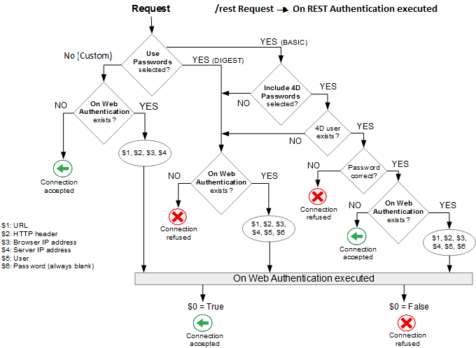

A autenticação de usuários é necessária quando se deseja fornecer direitos de acesso específicos aos usuários Web. A autenticação determina como as informações referentes às credenciais do usuário (geralmente nome e senha) são coletadas e processadas.


## Modos de autenticação

O servidor web 4D propõe três modos de autenticação, que podem ser selecionados na página **Web**/**Options (I)** da caixa de diálogo Configurações:


> É recomendado usar uma autenticação **personalizada**.

### Visão Geral

O funcionamento do sistema de acesso do servidor web 4D está resumido no diagrama seguinte:



> As solicitações que começam com `rest/` são tratadas diretamente pelo [servidor REST](REST/configuration.md).


### Personalizado (padrão)

Basicamente, nesse modo, cabe ao desenvolvedor definir como autenticar os usuários. 4D só avalia solicitações HTTP [que requerem uma autenticação](#method-calls).

Este modo de autenticação é o mais flexível porque permite que você:

- ou delegar a autenticação do usuário a um aplicativo de terceiros (por exemplo, uma rede social, SSO);
- Ou fornecer uma interface para o usuário (por exemplo, um formulário da Web) para que ele possa criar sua conta no banco de dados de clientes; em seguida, você pode autenticar os usuários com qualquer algoritmo personalizado (veja [este exemplo](sessions.md#example) no capítulo "Sessões de usuário"). O importante é que você nunca armazene a senha de forma não protegida, usando esse código:

```4d
//... criar conta de usuário
ds.webUser.password:=Generate password hash($password)  
ds.webUser.save()
```

Veja também [este exemplo](gettingStarted.md#authenticating-users) do capítulo "Introdução".

Se nenhuma autenticação personalizada for fornecida, 4D chama a função [`On Web Authentication`](#on-web-authentication) do banco de dados (se existir). Além de $1 e $2, apenas os endereços IP do navegador e do servidor ($3 e $4) são fornecidos, o nome de usuário e a senha ($5 e $6) estão vazios. O método deve retornar **True** em $0 se o usuário for autenticado com êxito e, em seguida, o recurso solicitado novamente é fornecido, ou **False** em $0 se a autenticação falhar.

> **Aviso:** se o método de banco de dados `On Web Authentication` não existir, as conexões serão aceitas automaticamente (modo de teste).


### Protocolo Basic

Quando um usuário se conecta ao servidor, uma caixa de diálogo padrão é exibida no navegador para que ele digite o nome de usuário e a senha.

> O nome e a palavra-passe introduzidos pelo utilizador são enviados sem encriptação no cabeçalho do pedido HTTP. Este modo requer normalmente HTTPS para garantir a confidencialidade.

Os valores introduzidos são então avaliados:

- Se a opção **Include 4D passwords (Incluir senhas 4D** ) estiver marcada, as credenciais do usuário serão avaliadas primeiro em relação à [tabela interna de usuários 4D](Users/overview.md).
    - Se o nome de usuário enviado pelo navegador existir na tabela de usuários 4D e a senha estiver correta, a conexão será aceita. Se a palavra-passe estiver incorreta, a ligação é recusada.
    - Se o nome de usuário não existir na tabela de usuários 4D, a mensagem [`On Web Authentication`](#on-web-authentication) é chamado. Se o método de banco de dados `On Web Authentication` não existir, as conexões serão rejeitadas.

- Se a opção **Incluir senhas 4D** não estiver marcada, credenciais de usuário são enviadas para o método de banco de dados [`On Web Authentication`](#on-web-authentication) juntamente com outros parâmetros de conexão (endereço IP e porta, URL .) para que você possa processá-los. Se o método de banco de dados `On Web Authentication` não existir, as conexões serão rejeitadas.
> Com o servidor da Web 4D Client, lembre-se de que todos os sites publicados pelas máquinas 4D Client compartilharão a mesma tabela de usuários. Validação de usuários/senhas é realizada pela aplicação 4D Server.

### Protocolo DIGEST

Esse modo oferece um nível maior de segurança, pois as informações de autenticação são processadas por um processo unidirecional chamado hashing, que impossibilita decifrar seu conteúdo.

Como no modo BASIC, os usuários devem digitar seu nome e senha ao se conectarem. O método banco de dados [`On Web Authentication`](#on-web-authentication) é chamado. Quando o modo DIGEST é ativado, o parâmetro $6 (senha) é sempre retornado vazio. De fato, ao usar esse modo, essas informações não passam pela rede como texto claro (não criptografado). Portanto, é imperativo, nesse caso, avaliar as solicitações de conexão usando o comando `WEB Validate digest`.
> Você deve reiniciar o servidor Web para que as alterações feitas nesses parâmetros sejam levadas em conta.


## On Web Authentication

O método de banco de dados `On Web Authentication` é responsável pelo gerenciamento do acesso ao mecanismo do servidor Web. É chamado por 4D ou 4D Server quando uma solicitação HTTP dinâmica é recebida.

### Chamadas dos métodos banco

O método banco de dados `On Web Authentication` é chamado automaticamente quando uma solicitação ou processamento exige a execução de algum código 4D (exceto para chamadas REST). Ele também é chamado quando o servidor Web recebe um URL estático inválido (por exemplo, se a página estática solicitada não existir).

O método banco de dados `On Web Authentication` é, portanto chamado:

- quando o servidor da Web recebe um URL solicitando um recurso que não existe
- quando o servidor da Web receber uma URL que começa com `4DACTION/`, `4DCGI/`...
- quando o servidor da Web receber uma URL de acesso à raiz e nenhuma página inicial foi definida nas Configurações ou por meio do comando `WEB SET HOME PAGE`
- quando o servidor da Web processar um código de execução de tag (por exemplo, `4DSCRIPT`) em uma página semidinâmica.

O método banco de dados `On Web Authentication` NÃO é chamado:

- quando o servidor Web recebe um URL solicitando uma página estática válida.
- quando o servidor da Web receber uma URL que começa com `rest/` e o servidor REST for iniciado (nesse caso, a autenticação é tratada por meio do [método de banco de dados `On REST Authentication`](REST/configuration.md#using-the-on-rest-authentication-database-method) ou das [configurações de estrutura](REST/configuration.md#using-the-structure-settings)).


### Sintaxe

**On Web Authentication**( *$1* : Text ; *$2* : Text ; *$3* : Text ; *$4* : Text ; *$5* : Text ; *$6* : Text ) -> $0 : Boolean

| Parâmetros | Tipo       |    | Descrição                                             |
| ---------- | ---------- |:--:| ----------------------------------------------------- |
| $1         | Text       | <- | URL                                                   |
| $2         | Text       | <- | Cabeçalhos HTTP + corpo HTTP (até um limite de 32 kb) |
| $3         | Text       | <- | Endereço IP do cliente Web (browser)                  |
| $4         | Text       | <- | Endereço IP do servidor                               |
| $5         | Text       | <- | Nome de usuario                                       |
| $6         | Text       | <- | Senha                                                 |
| $0         | Parâmetros | -> | True = pedido aceite, False = pedido rejeitado        |

Estes parâmetros devem ser declarados da seguinte forma:

```4d
//Método base On Web Authentication

 C_TEXT($1;$2;$3;$4;$5;$6)
 C_BOOLEAN($0)

//Código do método
```

Como alternativa, você pode usar a sintaxe de [parâmetros nomeados](Concepts/parameters.md#named-parameters):

```4d
// Método de banco de dados de autenticação na Web
#DECLARE ($url : Text; $header : Text; \
  $BrowserIP : Text; $ServerIP : Text; \
  $user : Text; $password : Text) \
  -> $RequestAccepted : Boolean

```
> Todos os parâmetros do método de banco de dados `On Web Authentication` não são necessariamente preenchidos. As informações recebidas pelo método de banco de dados dependem do [modo de autenticação](#authentication-mode) selecionado.)


#### $1 - URL

O primeiro parâmetro (`$1`) é o URL recebido pelo servidor, do qual o endereço do host foi removido.

Vejamos o exemplo de uma ligação Intranet. Suponha que o endereço IP do seu Web Server 4D é 123.45.67.89. A tabela a seguir mostra os valores de $1 dependendo do URL inserido no navegador Web:

| URL introduzido no navegador Web     | Valor do parâmetro $1    |
| ------------------------------------ | ------------------------ |
| 123.45.67.89                         | /                        |
| http://123.45.67.89                  | /                        |
| 123.45.67.89/Customers               | /Customers               |
| http://123.45.67.89/Customers/Add    | /Customers/Add           |
| 123.45.67.89/Do_This/If_OK/Do_That | /Do_This/If_OK/Do_That |

#### $2 - Cabeçalho e corpo do pedido HTTP

O segundo parâmetro (`$2`) é o cabeçalho e o corpo da solicitação HTTP enviada pelo navegador Web. Observe que essas informações são passadas para o método de banco de dados `On Web Authentication` como estão. Seu conteúdo varia conforme a natureza do navegador Web que está tentando se conectar.

Se o seu aplicativo usar essas informações, caberá a você analisar o cabeçalho e o corpo. Você pode usar os comandos `WEB GET HTTP HEADER` e `WEB GET HTTP BODY`.
> Por motivos de desempenho, o tamanho dos dados que passam pelo parâmetro $2 não deve exceder 32 KB. Para além deste tamanho, são truncados pelo servidor HTTP 4D.

#### $3 - Endereço IP do cliente Web

O parâmetro `$3` recebe o endereço IP da máquina do navegador. Essas informações permitem distinguir entre conexões de intranet e de Internet.
> 4D devolve endereços IPv4 em formato híbrido IPv6/IPv4 escritos com um prefixo de 96 bits, por exemplo ::ffff:192.168.2.34 para o endereço IPv4 192.168.2.34. Para obter mais informações, consulte a seção [Suporte IPv6](webServerConfig.md#about-ipv6-support).


#### $4 - Endereço IP do servidor

O parâmetro `$4` recebe o endereço IP usado para chamar o servidor web. 4D permite multi-home que você explore máquinas com mais de um endereço IP. Para obter mais informações, consulte a [página Configuração](webServerConfig.md#ip-address-to-listen).


#### $5 e $6 - Nome de usuário e palavra-passe

Os parâmetros `$5` e `$6` recebem o nome de usuário e a senha inseridos pelo usuário na caixa de diálogo de identificação padrão exibida pelo navegador. Esta caixa de diálogo aparece para cada conexão, se a autenticação [basic](#basic-protocol) ou [digest](#digest-protocol) for selecionada.
> Se o nome de usuário enviado pelo navegador existir em 4D, o parâmetro $6 (a senha do usuário) não é retornado por razões de segurança.

#### Parâmetro $0

O método banco de dados `On Web Autenticação` retorna um booliano em $0:

*   Se $0 é True, a ligação é aceite.

*   Se $0 é False, a ligação é recusada.

O método banco de dados `On Web Connection` só é executado se a conexão tiver sido aceite pelo `On Web Authentication`.
> **AVISO**<br/>Se nenhum valor estiver definido como $0 ou se $0 não estiver definido no método banco de dados `On Web Authentication`, a conexão é considerada aceita e o método banco de dados `On Web Connection` é executado.
> * - Não chamar nenhum elemento de interface no método banco de dados `On Web Authentication` (`ALERT`, `DIALOG`, etc.) porque, caso contrário, a sua execução será interrompida e a ligação recusada. O mesmo acontecerá se ocorrer um erro durante seu processamento.


### Exemplo

Exemplo de método de banco de dados `On Web Authentication` em [Modo DIGEST](#digest-protocol):

```4d
 // On Web Authentication Database Method
 #DECLARE ($url : Text; $header : Text; $ipB : Text; $ipS : Text; \
  $user : Text; $pw : Text) -> $valid : Boolean

 var $found : cs. WebUserSelection
 $valid:=False

 $found:=ds. WebUser.query("User === :1";$user)
 If($found.length=1) // User is found
  $valid:=WEB Validate digest($user;[WebUser]password)
 Else
    $valid:=False // User does not exist
 End if
```
