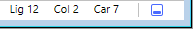
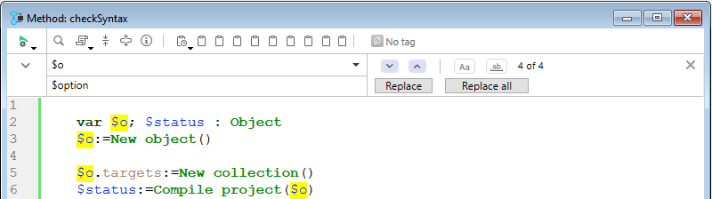

4D tem um poderoso editor de código embutido que oferece um amplo conjunto de funcionalidades para edição de código altamente produtiva, como preenchimento inteligente de código, navegação de código, depuração, busca, e mais.


O editor de código funciona de forma semelhante a um editor de texto. Escrever um método ou uma classe é geralmente uma combinação de digitar texto, selecionar componentes e arrastar itens do Explorador ou de outras janelas. Você também pode usar várias funções de preenchimento automático para criar métodos mais rapidamente.

Você pode rolar através do conteúdo de métodos, classes e funções, que podem incluir até 32.000 linhas de código ou 2 GB de texto.

O Editor de código 4D fornece verificação básica de erros de sintaxe. É efetuada uma verificação de erros adicional quando o código é executado. Para obter mais informações sobre como lidar com erros, consulte [Depuração](../Debugging/basics.md).

## Interface

### Barra de ferramentas

Cada janela do Editor de Código possui uma barra de ferramentas que fornece acesso instantâneo a funções básicas relacionadas à execução e edição de código.

| Elemento                                     | Ícone                                                                             | Descrição                                                                                                                                                                                                                                                                                                                                                      |
| -------------------------------------------- | --------------------------------------------------------------------------------- | -------------------------------------------------------------------------------------------------------------------------------------------------------------------------------------------------------------------------------------------------------------------------------------------------------------------------------------------------------------- |
| **Execução do método**                       |                     | Ao trabalhar com métodos, cada janela do Code Editor tem um botão que pode ser usado para executar o método atual. Usar o menu associado com o botão, pode escolher o tipo de execução:<ul><li> **Executar novo processo**: cria um processo e executa o método no modo padrão neste processo.</li><li>**Executar e depurar novo processo**: cria um novo processo e exibe o método na janela do depurador para execução passo a passo nesse processo.</li><li>**Executar no processo aplicação**: executa o método no modo padrão no contexto do processo Aplicação (em outras palavras, a janela de exibição do registro).</li><li>**Executar e depurar no processo aplicação**: exibe o método na janela do Debugger para execução passo a passo no contexto do processo da aplicação (ou seja, na janela de exibição de registros).</li></ul>Para obter mais informações sobre a execução dos métodos, consulte [Chamando Métodos Projeto](../Concepts/methods.md#calling-project-methods). |
| **Procurar no método**                       |                                | Exibe a área [*Pesquisa*](#find-and-replace).                                                                                                                                                                                                                                                                                                                  |
| **Macros**                                   |                              | Insere uma macro na seleção. Clique na seta pendente para visualizar uma lista de macros disponíveis. For more information on how to create and instantiate macros, see [Macros](creating-using-macros.md).                                                                                                                                                    |
| **Expandir tudo / Recolher tudo**            |        | Estes botões permitem expandir ou recolher todas as estruturas de fluxo de controle do código.                                                                                                                                                                                                                                                                 |
| **Informações sobre o método**               |        | Exibe a caixa de diálogo [Propriedades do método](../Concepts/methods.md#project-method-properties) (somente métodos de projeto).                                                                                                                                                                                                                              |
| **Últimos valores da área de transferência** |  | Exibe os últimos valores armazenados na área de transferência.                                                                                                                                                                                                                                                                                                 |
| **Pranchetas**                               |                        | Nove pranchetas disponíveis no editor de código. Você pode [usar essas pranchetas](./write-class-method.md#multiple-copy-paste-and-numbering-of-clipboards) clicando nelas diretamente ou usando os atalhos do teclado. Você pode usar uma [opção Preferências](Preferences/methods.md#options-1) para ocultá-las.                                             |
| **Menu de navegação suspenso**               |                        | Permite navegar dentro de métodos e classes com conteúdo marcado automaticamente ou marcadores declarados manualmente. Ver abaixo                                                                                                                                                                                                                              |


### Área de edição

É aqui que escreve e edita o seu código. O editor recua automaticamente o texto do código e colore os diferentes elementos de sintaxe para uma estrutura de código clara.

É possível personalizar a apresentação da área de edição. Qualquer personalização é automaticamente passada para todas as janelas do editor de código:

| Opção                                     | Descrição                                                                                                                                                                                     | Definido em...                                                                                                                                                                                                                    |
| ----------------------------------------- | --------------------------------------------------------------------------------------------------------------------------------------------------------------------------------------------- | --------------------------------------------------------------------------------------------------------------------------------------------------------------------------------------------------------------------------------- |
| **tipo de letra** e **tamanho de letra**  | Define o tipo de letra e o tamanho dos caracteres a utilizar na área de edição                                                                                                                | **Preferências** > [**Métodos**](../Preferences/methods.md) ou **Método > Ver** > **Tipo de letra maior** ou **Tipo de letra menor**                                                                                              |
| **estilo e cor dos elementos de sintaxe** | atribui uma cor e/ou estilo específicos a cada tipo de elemento da linguagem 4D.  Você também pode alterar as diferentes cores usadas na interface da área de edição (destaque, fundo, etc.). | Right-click on a language element (variable, keyword, etc.) Right-click on a language element (variable, keyword, etc.) > **Style** submenu. Submenu > **Estilo**. Ou **Preferências** > [**Métodos**](../Preferences/methods.md) |
| **espaços**                               | You can display the spaces between words using dots (.) instead of blank spaces. Esta opção se aplica a todos os elementos de código (nomes de comandos, variáveis, comentários, etc.).       | **Método > Ver > Espaços em branco**                                                                                                                                                                                              |
| **temas**                                 | Pode selecionar o tema Escuro ou Claro, ou definir um tema personalizado                                                                                                                      | **Preferências** > [**Métodos**](../Preferences/methods.md)                                                                                                                                                                       |
| **largura das indentações de código**     | Definir a largura das indentações do código                                                                                                                                                   | **Preferências** > [**Métodos**](../Preferences/methods.md)                                                                                                                                                                       |

#### Mudar barras

Barras coloridas mostram instantaneamente onde as linhas de código foram modificadas desde que o método foi aberto:


As barras de alteração mudam de cor para indicar se as modificações foram salvas ou não:

- amarelo: a linha foi modificada e o método ainda não foi guardado.
- verde: A linha foi modificada e o método foi guardado.


### Área listas

A área de lista permite exibir uma ou mais listas de elementos necessários para escrever métodos e classes (comandos, constantes, formulários, etc.). Você pode escolher o número e o conteúdo das listas exibidas na janela.

Por padrão, o editor de código apresenta quatro listas. Você pode ocultar ou mostrar todas as listas clicando no ícone no canto inferior direito da janela. 

Você pode aumentar ou reduzir a largura relativa de cada área da lista arrastando uma de suas divisões. Também é possível ajustar o tamanho da área de lista em relação à área de edição arrastando a linha divisória entre elas.

- Ao clicar duas vezes em um item em uma lista, ele será inserido na área de edição, na posição do cursor.
- Para **modificar o conteúdo** de uma lista, clique na área do título da lista em questão: um menu pop-up será exibido, permitindo que você escolha o tipo de item a ser exibido.


- Para adicionar ou remover uma lista, clique na área do título de uma das listas e escolha o comando correspondente no menu suspenso. O comando **Remover esta lista** está desativado quando você clica na última lista. Se você deseja ocultar todas as listas, você deve clicar no botão **mostrar ou ocultar listas** no canto inferior direito da janela ou ocultá-las por padrão nas **Preferências**.

- Pode ocultar as listas em todas as janelas das seguintes formas:
  - Selecione a opção **Ver > Listas** no menu **Método** (uma marca de seleção indica se as listas são exibidas)
  - Desmarque a opção **Preferências** > **Métodos** > **Opções** > **Mostrar Listas**. Para que as modificações feitas na caixa de diálogo **Preferências** sejam consideradas, todos os métodos, classes ou funções abertos devem ser fechados e reabertos.

#### Listas de itens disponíveis

Você pode exibir as seguintes listas de itens na área de listas da janela do Code Editor:

- **Todas as tabelas e campos**: nomes de tabelas e campos do banco de dados em forma de lista hierárquica. Quando você inserir um nome de campo no método, clicando duas vezes no seu nome, A 4D inseriu-a respeitando a sintaxe e adiciona o nome da tabela ou subtabela, como o caso pode ser.
- **Tabela** (submenu): nomes dos campos da tabela selecionada usando o submenu.
- **Tabela atual**: nomes dos campos da tabela atual (disponível em triggers, métodos formulário e métodos objeto).
- **Formulários projeto**: nomes de formulários projeto de banco de dados. Quando você clica duas vezes no nome de um projeto de formulário, 4D insere o mesmo respeitando a sintaxe: o nome do formulário é inserido entre as cotações.
- **Formulários de tabela**: nomes de tabelas do banco de dados e nomes de formulários em forma de lista hierárquica. Quando você inserir o nome de um formulário em um método, clicando duas vezes em seu nome, 4D insere ele respeitando a sintaxe: o nome do formulário é inserido entre aspas e é precedido pelo nome da tabela e um ponto e vírgula. Por exemplo: [Table]; "Form".
- **Métodos**: nomes de métodos projeto do banco de dados.
- **Todas as pastas**: nomes das pastas de objetos e subpastas definidas no banco de dados exibidas na forma de uma lista hierárquica. As pastas podem ser utilizadas para organizar objetos de uma forma personalizada. São geridos a partir da página inicial do explorador.
- **Pastas** (submenu): conteúdo da pasta selecionada usando o submenu.
- **Macros**: nomes de macros definidos para o banco de dados (consulte [Criação e uso de macros](#creating-and-using-macros)).
- **Comandos**: comandos da linguagem 4D em ordem alfabética.
- **Comandos por temas**: comandos da linguagem 4D classificados por tema em forma de lista hierárquica.
- **Barras de menu**: nomes e números das barras de menu [criadas com o editor de barras de menu 4D](../Menus/creating.md).
- **Constantes**: constantes 4D e de quaisquer plug-ins, classificadas por tema em forma de lista hierárquica.
- **Listas**: Nomes de listas.
- **Todos os comandos de plug-in**: comandos para todos os plug-ins instalados no banco de dados (se houver), classificados por tema em forma de lista hierárquica.
- **Palavras SQL**: conjunto de palavras-chave reconhecidas pelo analisador de sintaxe SQL de 4D. Essa lista inclui comandos (por exemplo, SELECT), cláusulas (por exemplo, WHERE), bem como funções (ABS).
- **Funções SQL**: funções SQL 4D.

**Nota:** com exceção do elemento Macros, todas as listas estão por ordem alfabética.

#### Guardar como modelo

Você pode salvar as listas definidas na janela do Editor de Código na forma de um modelo. Depois que o modelo é salvo, os parâmetros definidos nele serão usados para cada nova janela do Editor de Código que é aberta.

Os seguintes parâmetros são armazenados no modelo:

- Tamanho relativo das áreas de edição e de lista
- Número de listas
- Localização e conteúdo de cada lista
- Largura relativa de cada lista

Para salvar uma janela do editor de código como um modelo, selecione **Método** > **Salvar como modelo**. O modelo é guardado imediatamente (não aparece nenhuma caixa de diálogo). Está armazenado nas **Preferências** do aplicativo 4D. Se já existir um modelo anterior, ele será substituído.

### Área de pontos de paragem

Esta área, localizada à esquerda da área de edição, permite que você exiba os números de linha e insira pontos de interrupção diretamente ao lado de instruções específicas. Os pontos de interrupção são úteis durante a fase de depuração de sua programação. Eles interrompem a execução do seu código em locais específicos e exibem o depurador.

Para obter mais informações sobre pontos de interrupção, consulte a seção [Depuração](../Debugging/breakpoints.md#breakpoints).

Você pode exibir ou ocultar os números de linhas na área de pontos de quebra para cada janela do Editor de Código.

- Para ativar ou desativar a exibição de números de linha por padrão, escolha **Preferências** > **Métodos** > **Mostrar números de linha**.
- Para modificar essa exibição separadamente para cada janela do editor de código, selecione **Método** > **Visualizar** > **Números de linha**.

Exibir as linhas de números torna mais fácil encontrar o seu caminho na janela. O comando **Método** > **Ir al número de linha...** no também permite aproveitar essa exibição.

Esse tipo de pesquisa é útil quando usado em conjunto com o [compilador](../Project/compiler.md), que sinaliza os erros de tempo de execução pelo número da linha em que eles ocorrem.

### Barra de estado

A barra de status localizada na parte inferior direita do editor da janela exibe a posição do cursor em todos os momentos:



- **Ln**: Número da linha
- **C**: número de coluna, ou seja, o nível na hierarquia das estruturas de programação. O primeiro nível é 0. O número da coluna é útil para debugar, pois essa informação pode ser fornecida pelo interpretador em caso de erro no código.
- **Ch**: localização do carácter na linha.
- : ocultar/apresentar listas.

Quando você define o cursor em um comando, função ou parâmetros, a barra de status exibe a sintaxe do comando. Se você escrever ou selecionar um parâmetro, a área mostrará o parâmetro atual em **negrito**: 

### Menu de navegação suspenso

O menu suspenso de navegação ajuda você a organizar seu código e navegar com mais facilidade dentro de suas classes e métodos:


Algumas tags são adicionadas automaticamente, e você pode complementar a lista suspensa usando [marcadores](#manual-tagging).

#### Navegação de código

Clique em um item da lista suspensa para acessar sua primeira linha no código. Você também pode navegar com as teclas de seta e pressionar **Enter**.

#### Marcação automática

Construtores, declarações de métodos, funções e atributos computados são automaticamente marcados e adicionados à lista suspensa.

Quando não existe uma etiqueta na classe/método, a ferramenta apresenta "Sem etiqueta".

Os seguintes itens são adicionados automaticamente:

| Ícone                                                                       | Elemento                                       |
| --------------------------------------------------------------------------- | ---------------------------------------------- |
|                          | Sem etiqueta                                   |
|                | Class constructor ou declaração de método      |
|  | Atributo calculado (get, set, orderBy e query) |
|                      | Nome da função de classe                       |

#### Marcação manual

Ao adicionar marcadores no seu código, pode adicionar as seguintes etiquetas ao menu pendente:

| Ícone                                                   | Elemento        |
| ------------------------------------------------------- | --------------- |
|  | MARK: etiqueta  |
|  | TODO: etiqueta  |
|    | FIXME: etiqueta |

Declara-os acrescentando comentários como:

```4d
// FIXME: Correção dos seguintes itens
```

As declarações não diferenciam maiúsculas de minúsculas; escrever `fixme:` tem o mesmo efeito.

A adição de um hífen após a tag `MARK:` desenha uma linha de separação no editor de código e no menu suspenso. Por isso, estou a escrever isto:


Os resultados são os seguintes:


Todos os marcadores localizados dentro de funções são recuados na lista suspensa, exceto as tags `MARK:` localizadas no final das funções e não seguidas de instruções. Estes aparecerão no primeiro nível.

#### Ordem de visualização

As etiquetas são exibidas em sua ordem de aparecimento dentro do método/classe.

Para exibir as tags de um método ou classe em ordem alfabética, faça uma das seguintes:

- **Clique direito** na ferramenta suspensa
- mantenha pressionado **Cmd** no macOS ou **Alt** no Windows e clique na ferramenta suspensa

> As etiquetas em funções movem-se com os seus itens pais.


### Atalhos

Várias funcionalidades do editor de código do 4D estão disponíveis através de atalhos de teclado padrão.

:::info macOS

No macOS, use a tecla **Command** em vez da tecla **Ctrl** mencionada (Windows).

:::

| **Atalho**                                                       | **Ação**                                                                                                                                     |
| ---------------------------------------------------------------- | -------------------------------------------------------------------------------------------------------------------------------------------- |
| **Selecção e navegação**                                         |                                                                                                                                              |
| Duplo clique                                                     | Selecionar o nome de um elemento da linguagem                                                                                                |
| [Alt]+Clique duas vezes                                          | Selecionar um nome de elemento de língua contendo espaços (constante, método, etc.)                                                          |
| [Shift]+[seta para a direita]                                    | Criar e ampliar a seleção, personagem por caractere, para a direita ou Reduzir a seleção, personagem por caracter a partir da esquerda       |
| [Shift]+[seta para a esquerda]                                   | Reduzir a seleção, caractere por caractere, da direita ou Criar e ampliar a seleção, caractere por caractere, para a esquerda                |
| [Shift]+[seta para baixo]                                        | Criar e ampliar uma seleção, linha por linha, da parte superior à parte inferior                                                             |
| [Shift]+[seta para cima]                                         | Criar e ampliar uma seleção, linha por linha, de baixo para cima                                                                             |
| [Ctrl]+[Shift]+[seta para a direita]                             | Criar e ampliar a seleção, palavra a palavra, a partir da direita                                                                            |
| [Ctrl]+[Shift]+[seta para a esquerda]                            | Reduza a seleção, palavra por palavra, à direita, ou crie e amplie a seleção, palavra por palavra, à esquerda                                |
| [Ctrl]+[seta para a direita]                                     | Mover o ponto de inserção, palavra a palavra, da esquerda para a direita                                                                     |
| [Ctrl]+[left arrow]                                              | Mover o ponto de inserção, palavra a palavra, da direita para a esquerda                                                                     |
| [Alt]+[seta para baixo]                                          | Mover a(s) linha(s) onde se encontra o cursor para a parte inferior                                                                          |
| [Alt]+[seta para cima]                                           | Mover a(s) linha(s) onde se encontra o cursor para o topo                                                                                    |
| [Home]                                                           | Posicione o ponto de inserção no início da linha                                                                                             |
| [End]                                                            | Colocar o ponto de inserção no fim da linha                                                                                                  |
| [Ctrl]+[Home]                                                    | Colocar o ponto de inserção no início do método                                                                                              |
| [Ctrl]+[End]                                                     | Colocar o ponto de inserção no final do método                                                                                               |
| [Shift]+[Home]                                                   | Selecione todos os caracteres da linha que estão à esquerda do cursor                                                                        |
| [Shift]+[End]                                                    | Selecione todos os caracteres da linha que estão à direita do cursor                                                                         |
| [PgUp]                                                           | Rolar o conteúdo do método, página por página, da parte inferior até a parte superior (não modificar o ponto de inserção)                    |
| [PgDn]                                                           | Rolar o conteúdo do método, página por página, de cima para baixo (não modifica o ponto de inserção)                                         |
| [**Introspecção**](#goto-definition)                             |                                                                                                                                              |
| [Ctrl]+K ou [Alt]+clique duas vezes                              | Mesmo que o comando [**Goto definition**](#goto-definition)                                                                                  |
| \[Ctrl\] (Windows) or \[Alt\] (macOS)+hovering over a token  | Sublinhar o token (elemento linguístico identificado). Clique no token sublinhado = igual ao comando [**Goto definition**](#goto-definition) |
| [**Procurar e substituir**](#find-and-replace)                   |                                                                                                                                              |
| [Ctrl]+F                                                         | Find                                                                                                                                         |
| [Ctrl]+G                                                         | Encontrar o próximo                                                                                                                          |
| [Ctrl]+[Shift]+G                                                 | Procurar Anterior                                                                                                                            |
| [Ctrl]+E                                                         | Encontrar o mesmo próximo                                                                                                                    |
| [Ctrl]+[Shift]+E                                                 | Encontrar o mesmo anterior                                                                                                                   |
| [Ctrl]+[Alt]+F                                                   | Substituir                                                                                                                                   |
| [Ctrl]+[Alt]+G                                                   | Substituir próximo                                                                                                                           |
| [Ctrl]+[Alt]+[Shift]+G                                           | Reemplazar anterior                                                                                                                          |
| [**Pranchetas**](#clipboards)                                    |                                                                                                                                              |
| [Shift]+clique ou [Alt]+clique no ícone da área de transferência | Copiar texto selecionado para uma área de transferência                                                                                      |
| [Ctrl]+[Shift]+tecla numérica                                    | Copiar texto selecionado numa área de transferência numérica                                                                                 |
| [Ctrl]+clique no ícone da área de transferência                  | Colar o conteúdo de uma área de transferência na localização do cursor                                                                       |
| [Ctrl]+chave numérica                                            | Colar o conteúdo da área de transferência numérica na localização do cursor                                                                  |

:::tip

A maioria desses atalhos pode ser personalizada na caixa de diálogo [Preferencias4D](../Preferences/shortcuts.md).

:::


## Editar código

O 4D utiliza técnicas padrão de edição de texto para digitar e editar no Editor de código.

O Editor de código usa convenções de exibição (estilo, cor) para os elementos de sintaxe. Você pode [personalizar essas convenções](#customizing-the-editing-area). Conforme você digita, ao validar sua entrada, o 4D avalia o texto da linha e aplica o formato de exibição apropriado. 4D também recua cada linha para seu nível adequado em relação à linha anterior quando você usa estruturas de programação (If, End if...).

Pode utilizar as teclas de setas para se deslocar rapidamente de uma linha para outra. Usar as teclas de seta para mover-se por várias linhas é mais rápido do que clicar, pois o editor atrasa a avaliação da linha em busca de erros.

No Windows, o editor de código inclui um Editor de Código de Entrada (IME) para facilitar a edição de código em sistemas japoneses ou chineses.

O Editor de código inclui numerosos [atalhos de navegação](#shortcuts).

#### Uso de la barra invertida

O caractere de barra invertida (`\`) tem um suporte específico na linguagem 4D:

- inserido no final das linhas, permite escrever uma única declaração em [várias linhas](../Concepts/quick-tour.md#code-on-several-lines).
- permite definir [sequências de escape](../Concepts/quick-tour.md#escape-sequences).


:::caution

O caractere de barra invertida`(`) é usado como separador em [nomes de caminho no Windows](../Concepts/paths.md#windows). In general, 4D will correctly interpret Windows pathnames entered in the Code Editor by replacing the single backslash `\` with a double backslash ``\\`. Por exemplo,``C:\MyDocuments`se tornará`C:\\MyDocuments`. No entanto, se escrever `"C:\MyDocuments\New"`, 4D will display`"C:\\MyDocuments\New"`. In this case, the second backslash is interpreted incorrectly as`\N`(an existing [escape sequence](../Concepts/quick-tour.md#escape-sequences)). You must therefore enter a double backslash`\\` when you want to have a backslash in front of a character used in one of the escape sequences recognized by 4D.

:::


### Arrastar e largar

Do explorer, você pode arrastar e soltar tabelas, campos, formulários, métodos de projeto, constantes ou comandos 4D. Quando você arrasta e solta um elemento, 4D sempre usa a sintaxe correta. Por exemplo, se você arrastar o nome de campo First Name da tabela `[People]`, ele aparecerá no Editor editor de código como `[People]First Name`. Da mesma forma, se você arrastar o nome do formulário Input da tabela People, ele aparecerá no Code Editor como `[People]; "Input"`.

Quando você insere um comando arrastando-o da página **Comandos** do Explorer, ele aparece com sua sintaxe (que consiste em todos os seus parâmetros) no Editor de código. Essa funcionalidade simplesmente lembra você dos parâmetros que o comando espera. Assim, você pode usar uma sintaxe mais adequada ao seu uso.


In the Code Editor, the drag-and-drop mechanism is activated as soon as a portion of text is selected. You can also drag-and-drop within a method, class, function or between two different ones. Por padrão, o mecanismo de arrastar e soltar **move** o texto selecionado. Para **copiá-lo**, mantenha pressionada a tecla **Ctrl** (Windows) ou a tecla **Option** (macOS) durante a operação.


### Alternância entre letras maiúsculas e minúsculas

Você pode modificar automaticamente o caso dos caracteres selecionados usando os comandos em **Métodos** > **Case** ou o menu de contexto do editor:

- **Maiúsculas** / **Minúsculas**: muda os caracteres selecionados para maiúsculas ou minúsculas.
- **camelCase** / **CamelCase**: muda os caracteres selecionados para "camel case". Isso consiste em alterar a primeira letra de cada palavra do grupo para maiúscula. Este tipo de notação é frequentemente utilizado para as nomenclaturas de variáveis. hireDate e PurchaseDate são exemplos de duas variantes da notação camel case.

Quando você aplica um desses comandos a uma seleção de texto, os espaços e os caracteres "_" são removidos e a primeira letra de cada palavra se torna maiúscula.

### Trocar expressão

A função **Swap Expression** pode ser usada para inverter os argumentos de uma expressão que atribui um valor. Por exemplo,

`variable1:=variable2`

torna-se

`variable2:=variable1`

Essa função é extremamente útil para reverter um conjunto de atribuições usadas para obter ou definir propriedades ou para corrigir erros de entrada. Para usar essa função, selecione a(s) linha(s) a ser(em) modificada(s) e, em seguida, escolha **Method** > **Swap Expression** ou use o menu de contexto da área. Dentro da seleção, apenas as linhas que atribuem um valor serão modificadas.

### Pranchetas

Além da operação padrão de copiar e colar, o 4D oferece duas funções adicionais que permitem trabalhar com o conteúdo de diferentes áreas de transferência:

- O programa armazena em memória as últimas 10 ações de "copiar" ou "recortar" que foram executadas no Editor de Código durante a sessão atual. Cada um dos diferentes conteúdos salvos desta forma pode ser reutilizado a qualquer momento. Para isso, use o comando **Clipboard History** do menu de contexto do Editor de código ou o botão "Last Clipboard values" da barra de ferramentas:

    

    São apresentadas as primeiras palavras dos itens copiados ou cortados. Selecione um item para inseri-lo no local atual do cursor.

- Nove áreas de transferência numeradas adicionais estão disponíveis e podem ser empregadas diretamente usando os botões da barra de ferramentas do Editor de Código ou [usando atalhos de teclado](#shortcuts):


### Linhas em movimento

Você pode mover a linha onde o cursor está diretamente, sem selecioná-la primeiro, usando os comandos **Mover Linhas para Cima** e **Mover Linhas para Baixo** no menu **Método**. Você também pode fazer isso usando as teclas **Alt/Option** + **Seta para cima** ou **Seta para baixo** [atalho do teclado](#shortcuts).


### Funções de preenchimento automático

O editor de código fornece funções de preenchimento automático. 4D exibe automaticamente sugestões baseadas nos primeiros caracteres digitados.

No exemplo abaixo, digitar a string "cop" faz com que seja exibido um triângulo azul indicando que há várias sugestões disponíveis:


When the characters you enter correspond to a single possibility, this suggested value appears greyed out (and is inserted if you hit the **Tab** key):  ---> 

> If you checked the **Insert () and closing } ) ] "** option in the **Methods** page of the **Preferences**, 4D will also automatically add **()** after a 4D command, keyword or project method that requires one or more mandatory arguments (after accepting a suggestion or completion):  -> 

Autocompletion also works with code structures (e.g. If.. End if, For each... End for each): when you enter the first part of the structure, the Code Editor will automatically suggest the closing part:

Se houver várias sugestões disponíveis, 4D as exibe em uma lista pop-up quando você pressiona a tecla **Tab**:


A lista está por ordem alfabética. Escolha o valor clicando duas vezes nele ou role a lista usando as teclas de seta do teclado e, em seguida, pressione **Enter**, **Carriage Return** ou **Tab** para inserir o valor selecionado.

Por padrão, você também pode inserir um valor sugerido pressionando uma das seguintes teclas delimitadoras `( ; : = < [ {` após selecionar um valor: o valor inserido é seguido pelo delimitador, pronto para a entrada de dados.

  +  **(** key --> 

> Você pode desativar o uso de delimitadores para inserir valores sugeridos em **Preferências** > **Métodos** > **Opções**.

Você pode pressionar a tecla **Esc** para fechar a lista pop-up ou pode continuar digitando enquanto ela estiver aberta. Os valores sugeridos na lista pop-up são atualizados como caracteres adicionais são digitados.

Se os caracteres digitados correspondem a diferentes tipos de objetos, a lista os exibe em seu estilo atual. Podem ser visualizados os seguintes tipos de objetos:

- Comandos 4D
- Comandos SQL
- Métodos utilizador
- Nomes de tabelas
- Nomes de campos
- Constantes
- Variável local, processo ou inter-processo, declarada no método
- Nomes de propriedade de objeto
- Comandos Plug-in
- Palavras-chave 4D
- Palavras-chave SQL
- Macros (apresentadas entre < >)

> For practical reasons, you can disable the automatic display of the list of suggestions for **constants**, **(local or interprocess) variables and object attributes** and/or **tables**. Essas opções podem ser encontradas em **Preferências** > **Métodos** > **Opções**

#### Nomes de propriedade de objeto

O 4D exibe automaticamente sugestões sensíveis a maiúsculas e minúsculas de todos os nomes de propriedades de objetos válidos no código 4D quando você:

- digite um ponto "." depois de um objeto ou
- utilizar a tecla Tab após um ponteiro objeto desreferenciado "->".


> A propriedade `length` é sempre incluída para uso com coleções.

Uma vez criados, os nomes das propriedades são armazenados em uma lista global interna e ficam disponíveis sempre que um método/classe/função é aberto, fechado ou muda de foco.


A lista de sugestões é atualizada dinamicamente enquanto você edita o código. Ao alternar entre janelas, os nomes de propriedades novos/editados são sempre adicionados à lista global. A lista também é atualizada quando você visualiza um método, uma classe ou uma função no Explorer.

Quando o banco de dados é reiniciado, a lista é reinicializada.

> Você pode desativar a exibição automática das propriedades do objeto em **Preferências** > **Métodos** > **sugestões**.


## Procurar e substituir


O editor de código possui poderosas funcionalidades de **buscar e substituir** que se aplicam à janela atual.

Uma área de busca e substituição pode ser exibida na barra de ferramentas de qualquer janela de método:



Para exibir essa área, clique no ícone **Localizar no método** da [barra de ferramentas](#toolbar) ou selecione uma função de localização ou substituição por meio de um [**atalho**](#shortcuts) ou um comando no submenu **Editar > Localizar**. Você pode fechar essa área a qualquer momento clicando no botão **x** no lado direito da barra de ferramentas.

:::tip

A funcionalidade **Localizar no Design** na barra de ferramentas do 4D ou no menu **Editar** não é específica do editor de código, mas pode ser usada para pesquisar um valor entre todos os métodos e classes.

:::


### Find

Selecione **Localizar > Localizar...** no menu **Editar** ou digite **Ctrl+F** (Windows)/**Cmd+F** (macOS) para exibir/ativar a área de *Pesquisa*.

A pesquisa definida nessa área será executada no código localizado na janela.

A área de entrada **find** permite que você insira a string a ser pesquisada. Esta área é uma caixa de combinação que armazena as últimas 10 sequências de caracteres que foram pesquisadas ou substituídas durante a sessão. Se você destacar o texto antes de escolher o comando **Localizar...**, ele aparecerá nessa área. Pode então utilizar este texto ou substituí-lo por outro.

Depois que uma cadeia é inserida ou selecionada, todas as ocorrências encontradas na janela aberta são destacadas e o lado direito da área exibe o número total de ocorrências encontradas. Também indica a posição atual do cursor entre todos os resultados.

Pressione a tecla **Enter** para selecionar a ocorrência mais próxima ao cursor. Também pode clicar nos botões **Próximo / Anterior**  para selecionar todas as ocorrências sequencialmente no início ou no fim do método atual, a partir da localização inicial do cursor, ou utilizar os comandos **Procurar seguinte** e **Procurar anterior** do menu [**Editar**](#shortcuts).


#### Opções

- **Sensível a maiúsculas e minúsculas** : tem em conta as maiúsculas e minúsculas dos caracteres tal como foram introduzidos na área de pesquisa. Essa opção também considera os caracteres diacríticos. Por exemplo, uma busca por "MyVar" não encontrará "myVar"; uma busca por "dej" não encontrará "déjà".
- **Palavra inteira** : limita a pesquisa a ocorrências exatas da palavra pesquisada. Quando esta opção for marcada, por exemplo, uma busca por "cliente" não irá encontrar nem "clientes" nem "meucliente." Por padrão, essa opção não está marcada; portanto, uma pesquisa por "var" encontrará "Myvar", "variation" etc.


### Substituir

Clique no botão de alternância **v** no lado esquerdo da área *Pesquisa* para mostrar/ocultar a área *Substituir*. Você também pode selecionar **Find > Replace...** no menu **Edit** ou digitar **Ctrl+Alt+F** (Windows)**/Cmd+Alt+F** (macOS).

A área de entrada *Replace* é usada para definir a cadeia de caracteres que substituirá a definida acima.

Clique no botão **Substituir** para iniciar a pesquisa com todas as opções definidas e substituir a primeira ocorrência encontrada. 4D begins searching from the current text insertion point and continues to the end of the method. It is then possible to continue finding/replacing using the **Replace Next** and **Replace Previous** commands of the [**Edit** menu](#shortcuts).

Click the **Replace all** button to replace all the occurrences corresponding to the search criteria directly in the open method.


### Encontrar o mesmo

The **Find Same** command is used to find character strings identical to the one selected. This command is only active if you have selected at least one character in the Code Editor.

The search carried out is of the "Find Next" type in the current code editor window.

The **Find Same Next** and **Find Same Previous** commands are used to find character strings *strictly* identical to the ones selected. Por exemplo, as maiúsculas e minúsculas devem corresponder.


### Marcar tudo

The **Edit > Bookmark All** command is enabled when a search has already been specified in the find or replace dialog box. When you select this command, 4D puts a bookmark at each line that contains an item corresponding to the "current" search criteria. Deste modo, é fácil identificar todos os resultados da pesquisa. For more information about bookmarks, refer to [Bookmarks](#bookmarks).


## Erros de sintaxe

4D verifica automaticamente a sintaxe do método para ver se está correta. Se introduzir texto ou selecionar um componente que não esteja sintaticamente correto, 4D apresenta um símbolo para indicar a expressão incorrecta . When you move the mouse over the symbol, a help tip displays the cause of the error:


When entering code, you can immediately check the syntax of the current line (without advancing to the next line) by pressing the **Enter** key on the numeric keypad. 4D evaluates the line, formats it, marks any errors, and places the insertion point at the end of the line. When a line of a method, class or function is marked as having improper syntax, check and fix the entry. Se a linha estiver correta, 4D removerá o símbolo de erro. Quando salvar ou fechar a janela, todo o método é validado. You can also force validation by pressing the **Enter** key.

Quando o método, classe ou função é validado, 4D verifica:

- erros básicos de sintaxe
- the structure of statements (`If`, `End if` and so on)
- matching enclosing characters in the code such as parentheses or quotation marks. When you type an enclosing character, 4D indicates the match by framing the start/end characters with gray rectangles:


> If you click on an enclosing character in the code, 4D indicates its match with gray rectangles by default. You can modify the way 4D indicates matching enclosing characters or disable this feature in **Preferences** > **Methods** > **Options** > **Matching parentheses**.

The Code Editor can only check for obvious syntax errors (misspellings and the like). Não verifica os erros que só ocorrem durante a execução. Erros de execução são capturados por 4D quando o código é executado.

4D has a built-in debugger (see [Debugging](../Debugging/debugger.md)) for handling and correcting these errors. O compilador também oferece uma ajuda indispensável para a detecção de erros. For more information about the compiler, refer to the [Compilation](../Project/compiler.md) chapter.

## Dicas de ajuda

O Editor de código fornece várias informações contextuais utilizando dicas de ajuda. Aparecem quando se passa o rato por cima de um objeto.

:::tip

A [barra de estado](#status-bar) também fornece informações contextuais.

:::

- **Errors**: When you mouse over the symbol indicating an error to the left of the editing area, a help tip displays the cause of the error (see [Syntax errors](#syntax-errors)).

- **4D command documentation**: When you move the mouse over a 4D command or function, a help tip provides its syntax along with a brief description of how it works. 

- **Variable type and description**: When you mouse over a variable, a help tip shows its type (if it has been explicitly defined in the method) and associated comment, if any. 

- **Project methods or functions**: When you mouse over a project method or class function, a help tip displays:

  - ou os comentários especificados no Explorador.
  - or the first few lines of the method or class function if it includes comments (lines beginning with // or /*...*/ comment block). It is common practice to insert documentation for the method as well as its parameters in the form of comments at the beginning of the method. You can get this information directly in the help tip, just make sure to first remove any comments found in the Explorer. Comments at the beginning of a method:  Help tip in another method: 

- You can also create a **dedicated documentation file** named `<MethodName>.md` in the `<package>/documentation` folder. See [Viewing documentation in the code editor](../Project/documentation.md#viewing-documentation-in-the-code-editor)


## Comentar / Não comentar

There is no limit on the number of lines. O editor de código não aplica nenhum estilo específico nos comentários. The length of comments is limited to the maximum size of 32,000 characters per line.

There are two kinds of comments: `//comment` (single line comment) and `/*comment*/`(inline comments or multiline comment blocks).

When the selection includes both active code and commented lines, an additional pair of comment characters ( // ) is added to the latter; this way, they will retain their initial commented status if the line is subsequently "uncommented." When the selection contains only commented lines, the **Uncomment** command is applied. When the selection contains only active code, the **Comment** command is applied.

 --> 

Comments can be created by typing `/` characters. Or, the **Comment/Uncomment** command, found in the **Method** menu as well as in the Code Editor context menu is used to mark a group of selected lines of code as single line comments, or, on the contrary, to remove the single line comment characters from a selection. To use this command, select the code to be marked as commented, then select the **Comment/Uncomment** command:

> The **Comment/Uncomment** command only operates with full lines --- it cannot be used to comment only part of a line.


## Expandir / Recolher

4D code located inside loops and conditions can now be collapsed or expanded, in order to facilitate the reading of methods:

- Expanded code: 

- Collapsed code: 

If you place the mouse over the expand button [...], a help tip appears, displaying the first lines of the hidden code.

A collapsed portion of code can be selected, copied, pasted or deleted. Todas as linhas incluídas nesse documento serão copiadas, coladas ou excluídas, respectivamente. Quando uma parte do código é colada, é automaticamente expandida.

Existem várias formas de expandir e recolher código:

- Click on the expand/collapse icons ([+] and [-] under Windows) or on the opening button [...]
- Use the commands of the **Method > Collapse/Expand** submenu:

  - **Collapse Selection** / **Expand Selection**: collapses or expands all the code structures found in the text selection.
  - **Collapse Current Level** / **Expand Current Level**: collapses or expands the code structure at the level where the cursor is located. These commands are also available in the **context menu** of the editor.
  - **Collapse All** / **Expand All**: collapses or expands all the loops and conditions of a method. Estes comandos também estão disponíveis na barra de ferramentas do editor.


## Blocos

Os blocos podem ser definidos por:

- Aspas
- Parênteses
- Uma estrutura lógica (If/Else/End if, While/End while, Repeat/Until Case of/End case)
- Parêntesis

### Selecionar bloco envolvente

The **Select Enclosing Block** function is used to select the "enclosing block" of the code containing the insertion point.

If a block of text is already selected, the function selects the enclosing block of the next highest level and so on, until the entire method is selected.

Pressing **Ctrl+Shift+B** (Windows) or **Command+Shift+B** (macOS) enables you to reverse this operation and deselect the last enclosing block selected.

**Note:** If the insertion point is placed in an `If` or `Else` type structure, the enclosing block will be the one containing, respectively, the `If` or `Else` statement.


### Início do bloco ou fim do bloco

Two commands make it easier to move around within code structures (e.g. `If... Else... End if`):

- **Start Of Block**: places the cursor at the start of the current structure, just before the initial keyword.
- **End Of Block**: places the cursor at the end of the current structure, just after the final keyword.

These commands are found in the **Method** menu as well as the context menu of the editor. Também pode utilizar os seguintes atalhos:

- Windows: **Ctrl + seta para cima** ou **Ctrl** + **seta para baixo**'
- macOS: **Comando** + **seta para cima** ou **Comando** +**seta para baixo**.

## Marcadores

4D permite que você associe marcadores a certas linhas em seus métodos. You can then browse quickly within the code by passing from one bookmark to another using specific commands.


A bookmark moves along with its original row if additional rows are inserted in the method. Os marcadores são guardados com os métodos.

Bookmarks are managed using the **Bookmarks** submenu of the **Method** menu:

- **Toggle**: Associates a bookmark with the current line (where the cursor is located) if it does not already have one or removes the existing bookmark if it does. This function is also available using the **Toggle Bookmark** command of the editor's context menu or using the **Ctrl+F3** (Windows) or **Command+F3** (macOS) keyboard shortcut.
- **Remove All**: Removes all bookmarks from the foreground window.
- **Goto Next** / **Goto Previous**: Enables browsing among bookmarks in the window. Selecting one of these commands places the cursor on the first character of the line associated with the bookmark concerned. You can also use the keyboard shortcuts **F3** (go to next) or **Shift+F3** (go to previous).

:::info

You can use bookmarks as markers for lines that contain an [item found by a search](#find). Neste caso, 4D adiciona automaticamente os marcadores. Para mais informações, consulte [Marcar tudo](#bookmark-all).

:::

## Revelar no Explorador

The **Reveal in Explorer...** command opens an Explorer window with the target element selected. To do this, place the cursor inside the element's name or select it, then choose **Method** > **Reveal in Explorer...** .


## Pesquisar chamadores

The **Search Callers** command in the **Method** menu is only enabled for project methods. It searches for all the objects (other methods or menus) that reference the project method.

**Note:** The **Search Callers...** command is also available in **Explorer** > **Methods**

Este comando apresenta os seus resultados numa nova janela.


## Ir para Definição

The **Goto Definition** command opens the definition of an element referenced in the Code Editor. To do this, place the cursor inside the object name or select it, and choose **Method** > **Goto Definition...** or use the context menu of the editor.

:::tip

This feature is also available through the keyboard shortcut **Ctrl+K** (Windows) / **Command+K** (macOS) or  **Alt+double-click**.

:::

The effect of the **Goto Definition...** command varies depending on the target element:

- with a project method, it displays the contents of the method in a new window of the Code Editor
- com um nome de classe ou função classe, ele abre a classe no Editor de código
- with a built-in 4D command or function, it has the same effect as the [**Show documentation**](#show-documentation) command.

## Mostrar documentação

The **Show documentation...** command opens the documentation for the target element. To do this, place the cursor inside the element's name or select it, then choose **Method** > **Show documentation...** or use the contextual menu. O efeito varia consoante o elemento alvo. Por exemplo:

- Selecting a project method or a user class and choosing **Show documentation...** selects the method in the Explorer and switches to the documentation tab
- Selecting a 4D command, function, or class name and choosing **Show documentation...** displays the online documentation.
- If no element is selected, the command opens the documentation of the method currently opened in the Code Editor, [if any](../Project/documentation.md).

:::tip

To display the documentation of a 4D "classic" language command, select the command name or simply place the cursor in the name and press **F1**. The documentation of the command is displayed in a new window of your default browser. 4D looks for the documentation depending on the settings made in the Preferences (see [Documentation location](../Preferences/general.md#documentation-location)).

:::


## Pesquisar referências

The **Search References...** command found in the **Method** menu or the context menu of the Code Editor finds all the objects (methods and forms) in the project where the current item of the method is referenced (used).

The current item is either the one selected or the one where the cursor is located. Pode ser um nome de campo, nome de variável, comando, cadeia de caracteres e assim por diante. For example, the following action looks for all the occurrences of the *vlNbCmd* variable in the database:


Este comando apresenta os seus resultados numa nova janela.

