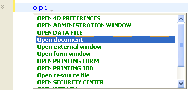
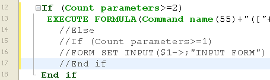
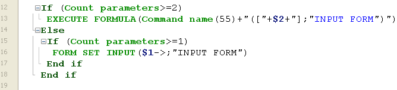

4D tem um poderoso editor de código embutido que oferece um amplo conjunto de funcionalidades para edição de código altamente produtiva, como preenchimento inteligente de código, navegação de código, depuração, busca, e mais.


O editor de código funciona de forma semelhante a um editor de texto. Escrever um método ou uma classe é geralmente uma combinação de digitar texto, selecionar componentes e arrastar itens do Explorador ou de outras janelas. Você também pode usar várias funções de preenchimento automático para criar métodos mais rapidamente.

You can scroll through the contents of methods, classes and functions, which can include up to 32,000 lines of code or 2 GB of text.

O Editor de código 4D fornece verificação básica de erros de sintaxe. É efetuada uma verificação de erros adicional quando o código é executado. Para obter mais informações sobre como lidar com erros, consulte [Depuração](../Debugging/basics.md).

## Interface

### Barra de ferramentas

Each Code Editor window has a toolbar that provides instant access to basic functions related to code execution and editing.

| Elemento                                     | Ícone                                                                             | Descrição                                                                                                                                                                                                                                                                                                                                      |
| -------------------------------------------- | --------------------------------------------------------------------------------- | ---------------------------------------------------------------------------------------------------------------------------------------------------------------------------------------------------------------------------------------------------------------------------------------------------------------------------------------------- |
| **Execução do método**                       |                     | When working with methods, each Code Editor window has a button that can be used to run the current method. Using the menu associated with this button, you can choose the type of execution:<ul><li> **Run new process**: Creates a process and runs the method in standard mode in this process.</li><li>**Run and debug new process**: Creates a new process and displays the method in the Debugger window for step by step execution in this process.</li><li>**Run in Application process**: Runs the method in standard mode in the context of the Application process (in other words, the record display window).</li><li>**Run and debug in Application process**: Displays the method in the Debugger window for step by step execution in the context of the Application process (in other words, the record display window).</li></ul>For more information on method execution, see [Calling Project Methods](../Concepts/methods.md#calling-project-methods). |
| **Procurar no método**                       |                                | Displays the [*Search* area](#find-and-replace).                                                                                                                                                                                                                                                                                               |
| **Macros**                                   |                              | Insere uma macro na seleção. Clique na seta pendente para visualizar uma lista de macros disponíveis. For more information on how to create and instantiate macros, see [Macros](creating-using-macros.md).                                                                                                                                    |
| **Expandir tudo / Recolher tudo**            |        | These buttons allow expanding or collapsing all the control flow structures of the code.                                                                                                                                                                                                                                                       |
| **Informações sobre o método**               |        | Displays the [Method Properties](../Concepts/methods.md#project-method-properties) dialog box (project methods only).                                                                                                                                                                                                                          |
| **Últimos valores da área de transferência** |  | Exibe os últimos valores armazenados na área de transferência.                                                                                                                                                                                                                                                                                 |
| **Pranchetas**                               |                        | Nove pranchetas disponíveis no editor de código. You can [use these clipboards](./write-class-method.md#multiple-copy-paste-and-numbering-of-clipboards) by clicking on them directly or by using keyboard shortcuts. You can use a [Preferences option](Preferences/methods.md#options-1) to hide them.                                       |
| **Menu de navegação suspenso**               |                        | Lets you navigate inside methods and classes with automatically tagged content or manually declared markers. Ver abaixo                                                                                                                                                                                                                        |


### Área de edição

É aqui que escreve e edita o seu código. The editor automatically indents code text and colors the different syntax elements for clear code structure.

É possível personalizar a apresentação da área de edição. Qualquer personalização é automaticamente passada para todas as janelas do editor de código:

| Opção                                     | Descrição                                                                                                                                                                                     | Definido em...                                                                                                                                                                                                                    |
| ----------------------------------------- | --------------------------------------------------------------------------------------------------------------------------------------------------------------------------------------------- | --------------------------------------------------------------------------------------------------------------------------------------------------------------------------------------------------------------------------------- |
| **tipo de letra** e **tamanho de letra**  | Define o tipo de letra e o tamanho dos caracteres a utilizar na área de edição                                                                                                                | **Preferências** > [**Métodos**](../Preferences/methods.md) ou **Método > Ver** > **Tipo de letra maior** ou **Tipo de letra menor**                                                                                              |
| **estilo e cor dos elementos de sintaxe** | atribui uma cor e/ou estilo específicos a cada tipo de elemento da linguagem 4D.  Você também pode alterar as diferentes cores usadas na interface da área de edição (destaque, fundo, etc.). | Right-click on a language element (variable, keyword, etc.) Right-click on a language element (variable, keyword, etc.) > **Style** submenu. Submenu > **Estilo**. Ou **Preferências** > [**Métodos**](../Preferences/methods.md) |
| **espaços**                               | You can display the spaces between words using dots (.) instead of blank spaces. This option applies to all the code elements (command names, variables, comments, etc.).                     | **Método > Ver > Espaços em branco**                                                                                                                                                                                              |
| **temas**                                 | Pode selecionar o tema Escuro ou Claro, ou definir um tema personalizado                                                                                                                      | **Preferências** > [**Métodos**](../Preferences/methods.md)                                                                                                                                                                       |
| **largura das indentações de código**     | Definir a largura das indentações do código                                                                                                                                                   | **Preferências** > [**Métodos**](../Preferences/methods.md)                                                                                                                                                                       |

#### Mudar barras

Colored bars instantly show you where lines of code were modified since the method was opened:


The change bars change colors to indicate whether or not the modifications were saved:

- amarelo: a linha foi modificada e o método ainda não foi guardado.
- verde: A linha foi modificada e o método foi guardado.


### Área listas

The lists area lets you display one or more lists of elements necessary for writing methods and classes (commands, constants, forms, etc.). You can choose the number and contents of the lists displayed in the window.

Por padrão, o editor de código apresenta quatro listas. You can hide or show all lists by clicking on the icon at the botton right of the window. 

You can enlarge or reduce the relative width of each list area by dragging one of its partitions. It is also possible to adjust the size of the list area in relation to that of the editing area by dragging the dividing line between them.

- Double-clicking on an item in a list causes it to be inserted into the editing area, at the location of the cursor.
- To **modify the contents** of a list, click on the title area of the list concerned: a pop-up menu appears, enabling you to choose the type of item to be displayed.


- To add or remove a list, click in the title area of one of the lists and choose the corresponding command in the pop-up menu. The **Remove this list** command is disabled when you click on the last list. If you want to hide all the lists, you must either click on the **show or hide lists**  button at the bottom right of the window or hide them by default in the **Preferences**.

- Pode ocultar as listas em todas as janelas das seguintes formas:
  - Select the **View > Lists** option in the **Method** menu (a check mark indicates whether lists are displayed)
  - Uncheck the **Preferences** > **Methods** > **Options** > **Show Lists** option. For the modifications made in the **Preferences** dialog box to be taken into account, any open methods, classes or functions must first be closed then reopened.

#### Listas de itens disponíveis

You can display the following lists of items in the lists area of the Code Editor window:

- **All tables and fields**: Database table and field names in the form of a hierarchical list. When you insert a field name into the method by double-clicking on its name, 4D inserts it while respecting the syntax and adds the name of the table or subtable as the case may be.
- **Table** (submenu): Field names of the table selected using the submenu.
- **Current table**: Field names of the current table (available in triggers, form methods and object methods).
- **Formulários projeto**: nomes de formulários projeto de banco de dados. When you double-click on a project form name, 4D inserts its while respecting the syntax: the form name is inserted between quotes.
- **Table forms**: Database table and form names in the form of a hierarchical list. When you insert a form name into a method by double-clicking its name, 4D inserts it while respecting the syntax: the form name is inserted between quotes and is preceded by the name of the table and a semi-colon. Por exemplo: [Table]; "Form".
- **Métodos**: nomes de métodos projeto do banco de dados.
- **All folders**: Names of object folders and subfolders set in the database displayed in the form of a hierarchical list. As pastas podem ser utilizadas para organizar objetos de uma forma personalizada. São geridos a partir da página inicial do explorador.
- **Folders** (submenu): Contents of the folder selected using the submenu.
- **Macros**: Macro names defined for the database (see [Creating and using macros](#creating-and-using-macros)).
- **Commands**: 4D language commands in alphabetical order.
- **Commands by themes**: 4D language commands classified by theme in the form of a hierarchical list.
- **Menu bars**: Names and numbers of menu bars [created with the 4D Menu bar editor](../Menus/creating.md).
- **Constants**: 4D constants and those of any plug-ins, classified by theme in the form of a hierarchical list.
- **Listas**: Nomes de listas.
- **All plug-in commands**: Commands for all the plug-ins installed in the database (if any), classified by theme in the form of a hierarchical list.
- **SQL Keywords**: set of keywords recognized by the 4D SQL syntax parser. This list includes commands (e.g. SELECT), clauses (e.g. WHERE) as well as functions (ABS).
- **Funções SQL**: funções SQL 4D.

**Nota:** com exceção do elemento Macros, todas as listas estão por ordem alfabética.

#### Guardar como modelo

You can save the lists set in the Code Editor window in the form of a template. Once the template is saved, the parameters set in it will be used for each new Code Editor window that is opened.

Os seguintes parâmetros são armazenados no modelo:

- Tamanho relativo das áreas de edição e de lista
- Número de listas
- Localização e conteúdo de cada lista
- Largura relativa de cada lista

To save a Code Editor window as a template, choose **Method** > **Save As Template**. O modelo é guardado imediatamente (não aparece nenhuma caixa de diálogo). It is stored in the **Preferences** of the 4D application. Se já existir um modelo anterior, ele será substituído.

### Área de pontos de paragem

This area, located to the left of the editing area, allows you to display the line numbers and to insert break points directly next to specific instructions. Os pontos de interrupção são úteis durante a fase de depuração de sua programação. They stop the execution of your code at specific locations and display the debugger.

For more information on break points, see the [Debugging](../Debugging/breakpoints.md#breakpoints) section.

You can display or hide the line numbers in the break points area for each window of the Code Editor.

- To enable or disable the display of line numbers by default,  choose **Preferences** > **Methods** > **Show line numbers**.
- To modify this display separately for each window of the Code Editor, choose **Method** > **View** > **Line Numbers**.

Displaying the line numbers makes it easier to find your way around in the window. The **Method** > **Go to Line Number...** command in the also lets you take advantage of this display.

This type of search is useful when used in conjunction with the [compiler](../Project/compiler.md), which flags runtime errors by the line number in which they occur.

### Barra de estado

The status bar located at the bottom right part of the editor window displays the position of the cursor at all times:


- **Ln**: Número da linha
- **Col**: Column number, i.e., the level in the hierarchy of programming structures. O primeiro nível é 0. The column number is useful for debugging since this information can be provided by the interpreter in the event of an error in the code.
- **Ch**: localização do carácter na linha.
- : Ocultar/apresentar listas.

When you set the cursor in a command, function or parameter(s), the status bar displays the syntax of the command. If you write or select a parameter, the area shows the current parameter in **bold**: 

### Menu de navegação suspenso

The navigation dropdown helps you organize your code and navigate more easily inside your classes and methods:


Some tags are added automatically, and you can complement the dropdown list using [markers](#manual-tagging).

#### Navegação de código

Click an item in the dropdown list to go to its first line in the code. You can also navigate with arrow-keys and press **Enter**.

#### Marcação automática

Constructors, method declarations, functions and computed attributes are automatically tagged and added to the dropdown list.

Quando não existe uma etiqueta na classe/método, a ferramenta apresenta "Sem etiqueta".

Os seguintes itens são adicionados automaticamente:

| Ícone                                                                       | Elemento                                       |
| --------------------------------------------------------------------------- | ---------------------------------------------- |
|                          | Sem etiqueta                                   |
|                | Class constructor ou declaração de método      |
|  | Atributo calculado (get, set, orderBy e query) |
|                      | Nome da função de classe                       |

#### Marcação manual

Ao adicionar marcadores no seu código, pode adicionar as seguintes etiquetas ao menu pendente:

| Ícone                                                   | Elemento        |
| ------------------------------------------------------- | --------------- |
|  | MARK: etiqueta  |
|  | TODO: etiqueta  |
|    | FIXME: etiqueta |

Declara-os acrescentando comentários como:

```4d
// FIXME: Correção dos seguintes itens
```

Declarations are not case-sensitive; writing `fixme:` has the same effect.

Adding a hyphen after the `MARK:` tag draws a separating line in the code editor and the dropdown menu. Por isso, estou a escrever isto:


Os resultados são os seguintes:


All markers located inside functions are indented in the dropdown list, except for the `MARK:` tags located at the end of functions and not followed by instructions. Estes aparecerão no primeiro nível.

#### Ordem de visualização

As etiquetas são exibidas em sua ordem de aparecimento dentro do método/classe.

To display the tags of a method or class in alphabetical order, do one of the following:

- **Clique direito** na ferramenta suspensa
- hold **Cmd** on macOS or **Alt** on Windows, and click the dropdown tool

> As etiquetas em funções movem-se com os seus itens pais.


### Atalhos

Multiple features of 4D's Code Editor are available through default keyboard shortcuts.

:::info macOS

Under macOS, use the **Command** key instead of the **Ctrl** key mentioned (Windows).

:::

| **Atalho**                                                       | **Ação**                                                                                                                                       |
| ---------------------------------------------------------------- | ---------------------------------------------------------------------------------------------------------------------------------------------- |
| **Selecção e navegação**                                         |                                                                                                                                                |
| Duplo clique                                                     | Selecionar o nome de um elemento da linguagem                                                                                                  |
| [Alt]+Clique duas vezes                                          | Selecionar um nome de elemento de língua contendo espaços (constante, método, etc.)                                                            |
| [Shift]+[seta para a direita]                                    | Create and enlarge the selection, character by character, to the right, or Reduce the selection, character by character, from the left         |
| [Shift]+[seta para a esquerda]                                   | Reduce the selection, character by character, from the right or Create and enlarge the selection, character by character, to the left          |
| [Shift]+[seta para baixo]                                        | Create and enlarge a selection, line by line, from the top to the bottom                                                                       |
| [Shift]+[seta para cima]                                         | Create and enlarge a selection, line by line, from the bottom to the top                                                                       |
| [Ctrl]+[Shift]+[seta para a direita]                             | Criar e ampliar a seleção, palavra a palavra, a partir da direita                                                                              |
| [Ctrl]+[Shift]+[seta para a esquerda]                            | Reduce the selection, word for word, from the right, or create and enlarge the selection, word by word, from the left                          |
| [Ctrl]+[seta para a direita]                                     | Mover o ponto de inserção, palavra a palavra, da esquerda para a direita                                                                       |
| [Ctrl]+[left arrow]                                              | Mover o ponto de inserção, palavra a palavra, da direita para a esquerda                                                                       |
| [Alt]+[seta para baixo]                                          | Mover a(s) linha(s) onde se encontra o cursor para a parte inferior                                                                            |
| [Alt]+[seta para cima]                                           | Mover a(s) linha(s) onde se encontra o cursor para o topo                                                                                      |
| [Home]                                                           | Posicione o ponto de inserção no início da linha                                                                                               |
| [End]                                                            | Colocar o ponto de inserção no fim da linha                                                                                                    |
| [Ctrl]+[Home]                                                    | Colocar o ponto de inserção no início do método                                                                                                |
| [Ctrl]+[End]                                                     | Colocar o ponto de inserção no final do método                                                                                                 |
| [Shift]+[Home]                                                   | Select all the characters in the line that are to the left of the cursor                                                                       |
| [Shift]+[End]                                                    | Select all the characters in the line that are to the right of the cursor                                                                      |
| [PgUp]                                                           | Scroll the contents of the method, page by page, from the bottom to the top (doesn't modify the insertion point)                               |
| [PgDn]                                                           | Scroll the contents of the method, page by page, from the top to the bottom (doesn't modify the insertion point)                               |
| [**Introspecção**](#goto-definition)                             |                                                                                                                                                |
| [Ctrl]+K ou [Alt]+clique duas vezes                              | Same as [**Goto definition**](#goto-definition) command                                                                                        |
| \[Ctrl\] (Windows) or \[Alt\] (macOS)+hovering over a token  | Sublinhar o token (elemento linguístico identificado). Click on the underlined token = same as [**Goto definition**](#goto-definition) command |
| [**Procurar e substituir**](#find-and-replace)                   |                                                                                                                                                |
| [Ctrl]+F                                                         | Find                                                                                                                                           |
| [Ctrl]+G                                                         | Encontrar o próximo                                                                                                                            |
| [Ctrl]+[Shift]+G                                                 | Procurar Anterior                                                                                                                              |
| [Ctrl]+E                                                         | Encontrar o mesmo próximo                                                                                                                      |
| [Ctrl]+[Shift]+E                                                 | Encontrar o mesmo anterior                                                                                                                     |
| [Ctrl]+[Alt]+F                                                   | Substituir                                                                                                                                     |
| [Ctrl]+[Alt]+G                                                   | Substituir próximo                                                                                                                             |
| [Ctrl]+[Alt]+[Shift]+G                                           | Reemplazar anterior                                                                                                                            |
| [**Pranchetas**](#clipboards)                                    |                                                                                                                                                |
| [Shift]+clique ou [Alt]+clique no ícone da área de transferência | Copiar texto selecionado para uma área de transferência                                                                                        |
| [Ctrl]+[Shift]+tecla numérica                                    | Copiar texto selecionado numa área de transferência numérica                                                                                   |
| [Ctrl]+clique no ícone da área de transferência                  | Colar o conteúdo de uma área de transferência na localização do cursor                                                                         |
| [Ctrl]+chave numérica                                            | Colar o conteúdo da área de transferência numérica na localização do cursor                                                                    |

:::tip

A maioria desses atalhos pode ser personalizada na caixa de diálogo [Preferencias4D](../Preferences/shortcuts.md).

:::


## Editar código

4D uses standard text editing techniques for typing and editing in the Code Editor.

The Code Editor uses display conventions (style, color) for the syntax elements. You can [customize these conventions](#customizing-the-editing-area). As you type, when you validate your entry, 4D evaluates the text of the line and applies the appropriate display format. 4D also indents each line to its proper level in relation to the preceding line when you use programming structures (If, End if...).

Pode utilizar as teclas de setas para se deslocar rapidamente de uma linha para outra. Using the arrow keys to move across several lines is quicker than clicking because the editor delays evaluating the line for errors.

Under Windows, the code editor includes an Input Code Editor (IME) to facilitate code editing on Japanese or Chinese systems.

The Code Editor includes numerous [navigation shortcuts](#shortcuts).

#### Uso de la barra invertida

The backslash character (`\`) has a specific support in the 4D language:

- inserted at the end of lines, it allows to write a single statement on [several lines](../Concepts/quick-tour.md#code-on-several-lines).
- it allows to define [escape sequences](../Concepts/quick-tour.md#escape-sequences).


:::caution

The backslash character (`\`) is used as a separator in [pathnames under Windows](../Concepts/paths.md#windows). In general, 4D will correctly interpret Windows pathnames entered in the Code Editor by replacing the single backslash `\` with a double backslash ``\\`. Por exemplo,``C:\MyDocuments`se tornará`C:\\MyDocuments`. No entanto, se escrever `"C:\MyDocuments\New"`, 4D will display`"C:\\MyDocuments\New"`. In this case, the second backslash is interpreted incorrectly as`\N`(an existing [escape sequence](../Concepts/quick-tour.md#escape-sequences)). You must therefore enter a double backslash`\\` when you want to have a backslash in front of a character used in one of the escape sequences recognized by 4D.

:::


### Arrastar e largar

From the Explorer, you can drag and drop tables, fields, forms, project methods, constants, or 4D commands. Quando você arrasta e solta um elemento, 4D sempre usa a sintaxe correta. For example, if you drag the field name First Name from the `[People]` table, it appears in the Code Editor as `[People]First Name`. Similarly, if you drag the Form name Input from the People table, it appears in the Code Editor as `[People];"Input"`.

When you insert a command by dragging it from the **Commands** page of the Explorer, it appears with its syntax (which consists of all of its parameters) in the Code Editor. This feature simply reminds you of the parameters that the command expects. Assim, você pode usar uma sintaxe mais adequada ao seu uso.


In the Code Editor, the drag-and-drop mechanism is activated as soon as a portion of text is selected. You can also drag-and-drop within a method, class, function or between two different ones. By default, the drag-and-drop mechanism **moves** the selected text. In order to **copy** it, hold down the **Ctrl** key (Windows) or the **Option** key (macOS) during the operation.


### Alternância entre letras maiúsculas e minúsculas

You can automatically modify the case of selected characters using the commands in **Methods** > **Case** or the context menu of the editor:

- **Uppercase** / **Lowercase**: Switch the selected characters to uppercase or lowercase.
- **camelCase** / **CamelCase** : Switch the selected characters to "camel case". This consists in changing each first letter of a group of attached words to uppercase. Este tipo de notação é frequentemente utilizado para as nomenclaturas de variáveis. hireDate e PurchaseDate são exemplos de duas variantes da notação camel case.

When you apply one of these commands to a text selection, the spaces and "_" characters are removed and the first letter of each word becomes uppercase.

### Trocar expressão

The **Swap Expression** function can be used to reverse the arguments of an expression assigning a value. Por exemplo,

`variable1:=variable2`

torna-se

`variable2:=variable1`

This function is extremely useful for reversing a set of assignments used to get or set properties, or to correct input errors. To use this function, select the line(s) to be modified, then choose **Method** > **Swap Expression** or use the context menu of the area. Within the selection, only the lines assigning a value will be modified.

### Pranchetas

In addition to the standard copy-paste operation, 4D offers two additional functions that let you work with the contents of different clipboards:

- The program stores the last 10 "copy" or "cut" actions that were performed in the Code Editor in memory during the current session. Each of the different contents saved in this way can be reused at any time. To do this, use the **Clipboard History** command of the Code Editor context menu or the "Last Clipboard values" button of the toolbar:

    

    São apresentadas as primeiras palavras dos itens copiados ou cortados. Selecione um item para inseri-lo no local atual do cursor.

- Nine additional numbered clipboards are available and can be employed directly using the buttons of the Code Editor toolbar or [using keyboard shortcuts](#shortcuts):


### Linhas em movimento

You can move the line where the cursor is directly without selecting it first using the **Move Lines Up** and **Move Lines Down** commands in the **Method** menu. You can also do this using the **Alt/Option** + **Up Arrow** or **Down Arrow** [keyboard shorcut](#shortcuts).


### Funções de preenchimento automático

O editor de código fornece funções de preenchimento automático. 4D exibe automaticamente sugestões baseadas nos primeiros caracteres digitados.

In the example given below, typing the string "cop" causes the display of a blue triangle indicating that several suggestions are available:


When the characters you enter correspond to a single possibility, this suggested value appears greyed out (and is inserted if you hit the **Tab** key):  ---> 

> If you checked the **Insert () and closing } ) ] "** option in the **Methods** page of the **Preferences**, 4D will also automatically add **()** after a 4D command, keyword or project method that requires one or more mandatory arguments (after accepting a suggestion or completion):  -> 

Autocompletion also works with code structures (e.g. If.. End if, For each... End for each): when you enter the first part of the structure, the Code Editor will automatically suggest the closing part:

If there are several suggestions available, 4D displays them in a pop-up list when you hit the **Tab** key:


A lista está por ordem alfabética. Choose the value by double-clicking it or scroll the list using the arrow keys of the keyboard and then hit **Enter**, **Carriage Return** or **Tab** to insert the selected value.

By default, you can also insert a suggested value by hitting one of the following delimiter `( ; : = < [ {` keys after selecting a value: the value inserted is then followed by the delimiter, ready for data entry.

  +  **(** key --> 

> You can disable the use of delimiters for inserting suggested values in **Preferences** > **Methods** > **Options**.

You can press the **Esc** key to close the pop-up list or you can continue typing while it is open. The values suggested in the pop-up list are updated as additional characters are typed.

If the characters typed correspond to different types of objects, the list displays them in their current style. Podem ser visualizados os seguintes tipos de objetos:

- Comandos 4D
- Comandos SQL
- Métodos utilizador
- Nomes de tabelas
- Nomes de campos
- Constantes
- Variável local, processo ou inter-processo, declarada no método
- Nomes de propriedade de objeto
- Comandos Plug-in
- Palavras-chave 4D
- Palavras-chave SQL
- Macros (apresentadas entre < >)

> For practical reasons, you can disable the automatic display of the list of suggestions for **constants**, **(local or interprocess) variables and object attributes** and/or **tables**. These options are found in **Preferences** > **Methods** > **Options**

#### Nomes de propriedade de objeto

4D automatically displays case-sensitive suggestions of all valid object property names in 4D code when you:

- digite um ponto "." depois de um objeto ou
- utilizar a tecla Tab após um ponteiro objeto desreferenciado "->".


> A propriedade `length` é sempre incluída para uso com coleções.

Once created, property names are stored in an internal global list and are available anytime a method/class/function is opened, closed or changes focus.


A lista de sugestões é atualizada dinamicamente enquanto você edita o código. When switching between windows, new/edited property names are always added to the global list. The list is also updated when you preview a method, class or function in the Explorer.

Quando o banco de dados é reiniciado, a lista é reinicializada.

> You can disable the automatic display of object properties in **Preferences** > **Methods** > **suggestions**.


## Procurar e substituir


The Code editor has powerful **find and replace** features that apply to the current window.

A search and replace area can be displayed in the toolbar of any method window:


To display this area, click on the **Find in method** icon of the [toolbar](#toolbar) or select a find or replace function either through a [**shortcut**](#shortcuts) or a command from the **Edit > Find** submenu. You can close this area at any moment by clicking on the **x** button at the rightmost side of the toolbar.

:::tip

The **Find in Design** feature in the 4D toolbar or in the **Edit** menu is not specific to the Code editor but may be used to search for a value among all the methods and classes.

:::


### Find

Select **Find > Find...** in the **Edit** menu or type **Ctrl+F** (Windows)/**Cmd+F** (macOS) to display/enable the *Search* area.

The search defined in this area will be performed in the code located in the window.

The **find** entry area enables you to enter the string to be searched for. This area is a combo box that stores the last 10 strings that have been searched for or replaced during the session. If you highlight text before choosing the **Find...** command, it will appear in this area. Pode então utilizar este texto ou substituí-lo por outro.

Once a string is entered or selected, all occurrences found in the opened window are highlighted and the right side of the area displays the total number of hits found. Também indica a posição atual do cursor entre todos os resultados.

Hit the **Enter** key to select closest occurrence to the cursor. Também pode clicar nos botões **Próximo / Anterior**  para selecionar todas as ocorrências sequencialmente no início ou no fim do método atual, a partir da localização inicial do cursor, ou utilizar os comandos **Procurar seguinte** e **Procurar anterior** do menu [**Editar**](#shortcuts).


#### Opções

- **Sensível a maiúsculas e minúsculas** : tem em conta as maiúsculas e minúsculas dos caracteres tal como foram introduzidos na área de pesquisa. Essa opção também considera os caracteres diacríticos. For instance, a search for "MyVar" will not find "myVar"; a search for "dej" will not find "déjà".
- **Palavra inteira** : limita a pesquisa a ocorrências exatas da palavra pesquisada. When this option is checked, for instance, a search for "client" will not find either "clients" or "myclient." When this option is checked, for instance, a search for "client" will not find either "clients" or "myclient."


### Substituir

Click on the **v** toggle button on the left side of the *Search* area to display/hide the *Replace* area. You can also select **Find > Replace...** in the **Edit** menu or type **Ctrl+Alt+F** (Windows)/**Cmd+Alt+F** (macOS) .

The *Replace* entry area is used to define the character string that will replace the one defined above.

Click the **Replace** button to launch the search with all defined options and replace the first occurrence found. 4D begins searching from the current text insertion point and continues to the end of the method. It is then possible to continue finding/replacing using the **Replace Next** and **Replace Previous** commands of the [**Edit** menu](#shortcuts).

Click the **Replace all** button to replace all the occurrences corresponding to the search criteria directly in the open method.


### Encontrar o mesmo

The **Find Same** command is used to find character strings identical to the one selected. This command is only active if you have selected at least one character in the Code Editor.

The search carried out is of the "Find Next" type in the current code editor window.

The **Find Same Next** and **Find Same Previous** commands are used to find character strings *strictly* identical to the ones selected. Por exemplo, as maiúsculas e minúsculas devem corresponder.


### Marcar tudo

The **Edit > Bookmark All** command is enabled when a search has already been specified in the find or replace dialog box. When you select this command, 4D puts a bookmark at each line that contains an item corresponding to the "current" search criteria. Deste modo, é fácil identificar todos os resultados da pesquisa. For more information about bookmarks, refer to [Bookmarks](#bookmarks).


## Erros de sintaxe

4D verifica automaticamente a sintaxe do método para ver se está correta. Se introduzir texto ou selecionar um componente que não esteja sintaticamente correto, 4D apresenta um símbolo para indicar a expressão incorrecta . When you move the mouse over the symbol, a help tip displays the cause of the error:


When entering code, you can immediately check the syntax of the current line (without advancing to the next line) by pressing the **Enter** key on the numeric keypad. 4D evaluates the line, formats it, marks any errors, and places the insertion point at the end of the line. When a line of a method, class or function is marked as having improper syntax, check and fix the entry. Se a linha estiver correta, 4D removerá o símbolo de erro. Quando salvar ou fechar a janela, todo o método é validado. You can also force validation by pressing the **Enter** key.

Quando o método, classe ou função é validado, 4D verifica:

- erros básicos de sintaxe
- the structure of statements (`If`, `End if` and so on)
- matching enclosing characters in the code such as parentheses or quotation marks. When you type an enclosing character, 4D indicates the match by framing the start/end characters with gray rectangles:


> If you click on an enclosing character in the code, 4D indicates its match with gray rectangles by default. You can modify the way 4D indicates matching enclosing characters or disable this feature in **Preferences** > **Methods** > **Options** > **Matching parentheses**.

The Code Editor can only check for obvious syntax errors (misspellings and the like). Não verifica os erros que só ocorrem durante a execução. Erros de execução são capturados por 4D quando o código é executado.

4D has a built-in debugger (see [Debugging](../Debugging/debugger.md)) for handling and correcting these errors. O compilador também oferece uma ajuda indispensável para a detecção de erros. For more information about the compiler, refer to the [Compilation](../Project/compiler.md) chapter.

## Dicas de ajuda

O Editor de código fornece várias informações contextuais utilizando dicas de ajuda. Aparecem quando se passa o rato por cima de um objeto.

:::tip

A [barra de estado](#status-bar) também fornece informações contextuais.

:::

- **Errors**: When you mouse over the symbol indicating an error to the left of the editing area, a help tip displays the cause of the error (see [Syntax errors](#syntax-errors)).

- **4D command documentation**: When you move the mouse over a 4D command or function, a help tip provides its syntax along with a brief description of how it works. 

- **Variable type and description**: When you mouse over a variable, a help tip shows its type (if it has been explicitly defined in the method) and associated comment, if any. 

- **Project methods or functions**: When you mouse over a project method or class function, a help tip displays:

  - ou os comentários especificados no Explorador.
  - or the first few lines of the method or class function if it includes comments (lines beginning with // or /*...*/ comment block). It is common practice to insert documentation for the method as well as its parameters in the form of comments at the beginning of the method. You can get this information directly in the help tip, just make sure to first remove any comments found in the Explorer. Comments at the beginning of a method:  Help tip in another method: 

- You can also create a **dedicated documentation file** named `<MethodName>.md` in the `<package>/documentation` folder. See [Viewing documentation in the code editor](../Project/documentation.md#viewing-documentation-in-the-code-editor)


## Comentar / Não comentar

There is no limit on the number of lines. O editor de código não aplica nenhum estilo específico nos comentários. The length of comments is limited to the maximum size of 32,000 characters per line.

There are two kinds of comments: `//comment` (single line comment) and `/*comment*/`(inline comments or multiline comment blocks).

When the selection includes both active code and commented lines, an additional pair of comment characters ( // ) is added to the latter; this way, they will retain their initial commented status if the line is subsequently "uncommented." When the selection contains only commented lines, the **Uncomment** command is applied. When the selection contains only active code, the **Comment** command is applied.

 --> 

Comments can be created by typing `/` characters. Or, the **Comment/Uncomment** command, found in the **Method** menu as well as in the Code Editor context menu is used to mark a group of selected lines of code as single line comments, or, on the contrary, to remove the single line comment characters from a selection. To use this command, select the code to be marked as commented, then select the **Comment/Uncomment** command:

> The **Comment/Uncomment** command only operates with full lines --- it cannot be used to comment only part of a line.


## Expandir / Recolher

4D code located inside loops and conditions can now be collapsed or expanded, in order to facilitate the reading of methods:

- Expanded code: 

- Collapsed code: 

If you place the mouse over the expand button [...], a help tip appears, displaying the first lines of the hidden code.

A collapsed portion of code can be selected, copied, pasted or deleted. Todas as linhas incluídas nesse documento serão copiadas, coladas ou excluídas, respectivamente. Quando uma parte do código é colada, é automaticamente expandida.

Existem várias formas de expandir e recolher código:

- Click on the expand/collapse icons ([+] and [-] under Windows) or on the opening button [...]
- Use the commands of the **Method > Collapse/Expand** submenu:

  - **Collapse Selection** / **Expand Selection**: collapses or expands all the code structures found in the text selection.
  - **Collapse Current Level** / **Expand Current Level**: collapses or expands the code structure at the level where the cursor is located. These commands are also available in the **context menu** of the editor.
  - **Collapse All** / **Expand All**: collapses or expands all the loops and conditions of a method. Estes comandos também estão disponíveis na barra de ferramentas do editor.


## Blocos

Os blocos podem ser definidos por:

- Aspas
- Parênteses
- Uma estrutura lógica (If/Else/End if, While/End while, Repeat/Until Case of/End case)
- Parêntesis

### Selecionar bloco envolvente

The **Select Enclosing Block** function is used to select the "enclosing block" of the code containing the insertion point.

If a block of text is already selected, the function selects the enclosing block of the next highest level and so on, until the entire method is selected.

Pressing **Ctrl+Shift+B** (Windows) or **Command+Shift+B** (macOS) enables you to reverse this operation and deselect the last enclosing block selected.

**Note:** If the insertion point is placed in an `If` or `Else` type structure, the enclosing block will be the one containing, respectively, the `If` or `Else` statement.


### Início do bloco ou fim do bloco

Two commands make it easier to move around within code structures (e.g. `If... Else... End if`):

- **Start Of Block**: places the cursor at the start of the current structure, just before the initial keyword.
- **End Of Block**: places the cursor at the end of the current structure, just after the final keyword.

These commands are found in the **Method** menu as well as the context menu of the editor. Também pode utilizar os seguintes atalhos:

- Windows: **Ctrl + seta para cima** ou **Ctrl** + **seta para baixo**'
- macOS: **Comando** + **seta para cima** ou **Comando** +**seta para baixo**.

## Marcadores

4D permite que você associe marcadores a certas linhas em seus métodos. You can then browse quickly within the code by passing from one bookmark to another using specific commands.


A bookmark moves along with its original row if additional rows are inserted in the method. Os marcadores são guardados com os métodos.

Bookmarks are managed using the **Bookmarks** submenu of the **Method** menu:

- **Toggle**: Associates a bookmark with the current line (where the cursor is located) if it does not already have one or removes the existing bookmark if it does. This function is also available using the **Toggle Bookmark** command of the editor's context menu or using the **Ctrl+F3** (Windows) or **Command+F3** (macOS) keyboard shortcut.
- **Remove All**: Removes all bookmarks from the foreground window.
- **Goto Next** / **Goto Previous**: Enables browsing among bookmarks in the window. Selecting one of these commands places the cursor on the first character of the line associated with the bookmark concerned. You can also use the keyboard shortcuts **F3** (go to next) or **Shift+F3** (go to previous).

:::info

You can use bookmarks as markers for lines that contain an [item found by a search](#find). Neste caso, 4D adiciona automaticamente os marcadores. Para mais informações, consulte [Marcar tudo](#bookmark-all).

:::

## Revelar no Explorador

The **Reveal in Explorer...** command opens an Explorer window with the target element selected. To do this, place the cursor inside the element's name or select it, then choose **Method** > **Reveal in Explorer...** .


## Pesquisar chamadores

The **Search Callers** command in the **Method** menu is only enabled for project methods. It searches for all the objects (other methods or menus) that reference the project method.

**Note:** The **Search Callers...** command is also available in **Explorer** > **Methods**

Este comando apresenta os seus resultados numa nova janela.


## Ir para Definição

The **Goto Definition** command opens the definition of an element referenced in the Code Editor. To do this, place the cursor inside the object name or select it, and choose **Method** > **Goto Definition...** or use the context menu of the editor.

:::tip

This feature is also available through the keyboard shortcut **Ctrl+K** (Windows) / **Command+K** (macOS) or  **Alt+double-click**.

:::

The effect of the **Goto Definition...** command varies depending on the target element:

- with a project method, it displays the contents of the method in a new window of the Code Editor
- com um nome de classe ou função classe, ele abre a classe no Editor de código
- with a built-in 4D command or function, it has the same effect as the [**Show documentation**](#show-documentation) command.

## Mostrar documentação

The **Show documentation...** command opens the documentation for the target element. To do this, place the cursor inside the element's name or select it, then choose **Method** > **Show documentation...** or use the contextual menu. O efeito varia consoante o elemento alvo. Por exemplo:

- Selecting a project method or a user class and choosing **Show documentation...** selects the method in the Explorer and switches to the documentation tab
- Selecting a 4D command, function, or class name and choosing **Show documentation...** displays the online documentation.
- If no element is selected, the command opens the documentation of the method currently opened in the Code Editor, [if any](../Project/documentation.md).

:::tip

To display the documentation of a 4D "classic" language command, select the command name or simply place the cursor in the name and press **F1**. The documentation of the command is displayed in a new window of your default browser. 4D looks for the documentation depending on the settings made in the Preferences (see [Documentation location](../Preferences/general.md#documentation-location)).

:::


## Pesquisar referências

The **Search References...** command found in the **Method** menu or the context menu of the Code Editor finds all the objects (methods and forms) in the project where the current item of the method is referenced (used).

The current item is either the one selected or the one where the cursor is located. Pode ser um nome de campo, nome de variável, comando, cadeia de caracteres e assim por diante. For example, the following action looks for all the occurrences of the *vlNbCmd* variable in the database:


Este comando apresenta os seus resultados numa nova janela.

