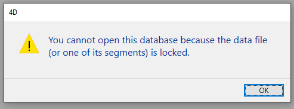

## Página de armazenamento de dados

Esta página é utilizada para configurar o armazenamento de dados no disco para a base de dados 4D.

### Parámetros generales

#### Permitir a utilização do ficheiro de dados só de leitura

Essa opção permite a configuração da operação do aplicativo ao abrir um arquivo de dados bloqueado no nível do sistema operacional. 4D inclui um mecanismo que impede automaticamente a abertura de uma base de dados quando seu arquivo de dados, ou um de seus segmentos, está bloqueado. Neste caso, quando esta opção de detecção é ativada, 4D exibe uma mensagem de aviso e não abre o banco de dados:

A menos que essa opção esteja marcada, não é possível abrir um banco de dados quando seu arquivo de dados estiver bloqueado (operação padrão para bancos de dados 4D).

#### Sobre arquivos bloqueados

Os arquivos bloqueados podem ser lidos, mas seu conteúdo não pode ser modificado. Por exemplo, os arquivos são bloqueados quando são armazenados em um suporte não regravável (tipo DVD) ou quando são copiados deste tipo de suporte. 4D pode trabalhar de forma transparente com arquivos de dados bloqueados, o que permite, mais particularmente, o uso de projetos armazenados em DVD. No entanto, esta operação corre o risco de usar inadvertidamente um arquivo de dados bloqueado no qual as modificações não serão salvas. É por isso que por padrão 4D não permite que bancos de dados com arquivo de dados bloqueado sejam abertos.

### Localização da pasta temporária

Essa área permite que você altere o local dos arquivos temporários criados enquanto o 4D está em execução. A pasta de arquivos temporários é usada pelo aplicativo, quando necessário, para salvar temporariamente os dados da memória no disco.

A localização atual desta pasta é exibida na área "Atual:". Você pode clicar nessa área para mostrar o nome do caminho como uma lista suspensa:

São oferecidos três opções de localização:

-   **Sistema**: Quando essa opção é selecionada, os arquivos temporários 4D são criados em uma pasta colocada no local especificado pelo Windows e/ou macOS. Você pode descobrir o local atual definido pelo seu sistema usando o comando 4D [`Temporary folder`](https://doc.4d.com/4dv19R/help/command/en/page486.html). Os arquivos são colocados em uma subpasta cujo nome consiste no nome do banco de dados e em um identificador exclusivo.
-   **Pasta de arquivo de dados** (opção padrão): Quando esta opção é selecionada, os arquivos temporários 4D são criados em uma pasta chamada "arquivos temporários" localizada no mesmo nível do arquivo de dados do banco de dados.
-   **Usuário Definido**: Esta opção é usada para definir um local personalizado. Se a opção local for modificada, será necessário reiniciar a base de dados para que a nova opção seja tida em conta. 4D verifica se a pasta selecionada pode ser acessada por gravação. Se não for esse o caso, o aplicativo tenta outras opções até que uma pasta válida seja encontrada.

> Esta opção é armazenada nas "propriedades extras" da estrutura que está disponível quando a definição de estrutura é exportada em XML (veja [Exportar e importar definições de estrutura](https://doc.4d.com/4Dv19/4D/19/Exporting-and-importing-structure-definitions.300-5416829.en.html)).

### Comparação de textos

> Se você alterar uma dessas opções, é preciso sair e reabrir o banco de dados para tornar a alteração eficaz. Quando a base de dados for reaberta, todos os índices da base de dados são automaticamente reindexados.

-   **Considerar @ como curinga somente quando estiver no início ou no final de padrões de texto**: Permite definir como o sinal de arroba "@" será interpretado quando usado em uma consulta ou em uma comparação de cadeia de caracteres, quando estiver localizado em uma palavra. Quando esta opção não é marcada (valor padrão), o sinal de presente é usado como caractere coringa, em outras palavras, substitui qualquer caractere (veja [caractere curinga (@)](https://doc.4d.com/4Dv19/4D/19/Query-editor.300-5416813.en.html#463876)).

    Quando a opção estiver marcada, o sinal de arroba é considerado um caractere simples se estiver localizado em uma palavra. Essa configuração é especialmente útil quando se procura por endereços de e-mail, onde o sinal @ é usado internamente. Esta opção tem influência em pesquisas, ordenações, comparações de string, bem como em dados armazenados em tabelas e dados encontrados na memória, como arrays. Campos e variáveis do alfa (indexado ou não) e tipo de texto estão preocupados com a forma como o caractere @ é interpretado em pesquisas e tipos de caracteres.

     **Notas:**
    -   Para pesquisas, se os critérios de pesquisa iniciam ou terminam com @, o caractere "@" será tratado como um caractere curinga. Somente se o caractere "@" for colocado no meio de uma palavra (por exemplo: bill@cgi.com) é tratado por 4D de maneira diferente.
    -   Essa opção também pode influenciar o comportamento dos comandos no tema [Objetos (Formulários)](https://doc.4d.com/4Dv19/4D/19/Objects-Forms.201-5391558.en.html) que aceitam o caractere curinga ("@") no parâmetro do objeto.
    -   Por razões de segurança, apenas o Administrador ou Designer da base de dados podem modificar este parâmetro.

-   **Idioma atual dos dados:** Usado para configurar o idioma usado para processamento e comparação de cadeias de caracteres. A escolha do idioma influencia diretamente a classificação e a pesquisa de texto, bem como as letras maiúsculas e minúsculas, mas não afeta a tradução de textos nem os formatos de data, hora ou moeda, que permanecem no idioma do sistema. Por padrão, 4D usa a linguagem do sistema.

    Um projeto 4D pode, portanto, operar em uma linguagem diferente da do sistema. Quando um projeto for aberto, o mecanismo 4D detecta o idioma usado pelo arquivo de dados e o fornece ao idioma (modo interpretador ou compilado). As comparações de texto, independentemente de serem realizadas pelo mecanismo de projeto ou pelo idioma, são feitas no mesmo idioma.

    > Você pode modificar essa configuração nas Preferências do aplicativo (consulte [Página Geral](../Preferences/general.md)). Neste caso, a configuração aplica-se a todas as novas bases de dados criadas pela 4D.

-   **Considere apenas caracteres não alfanuméricos para palavras-chave**: Modifica o algoritmo usado por 4D para identificar separadores de palavras-chave e, portanto, compilar seus índices. Por padrão, quando esta opção não é verificada, a 4D usa um algoritmo sofisticado que leva em conta as características linguísticas.

    Este algoritmo é semelhante ao usado pelo software de processamento de palavras para determinar os limites ao selecionar uma palavra que é clicada duplo. Para obter mais informações sobre este algoritmo, consulte o seguinte endereço: `http://userguide.icu-project.org/boundaryanalysis`.

    Quando esta opção está selecionada, 4D utiliza um algoritmo simplificado. Nessa configuração, qualquer caractere não alfanumérico (ou seja, que não seja uma letra ou um número) é considerado um separador de palavras-chave. Essa configuração atende a requisitos específicos associados a determinados idiomas, como o japonês.

-   **Ordem de classificação apropriada para pesquisa**: Essa opção só é exibida quando o idioma japonês for selecionado. Modifica a interpretação de caracteres como a "Marca de som prolongado Katakana-Hiragana" ou "長音記号" ou as "Marcas de iteração japonesas" como "ゝ" ou "ゞ". Um falante típico de japonês provavelmente preferirá os resultados com a configuração  ativada.

#### Compatibilidade do MeCab (versão japonesa)

Em sistemas japoneses, 4D é compatível com a biblioteca *MeCab*, com um algoritmo de indexação de palavras-chave que é particularmente adequado para o idioma japonês.

Este algoritmo é usado por padrão nas versões japonesas da 4D. Se necessário, você pode desativar o uso do algoritmo *MeCab* e usar a biblioteca *ICU* convencional.

Para desativar *o MeCab*, basta marcar a opção **Considerar apenas caracteres não alfanuméricos para palavras-chave**:

## Página Memória

Você usa as configurações nesta aba para configurar a memória em cache para o banco de dados.

### Parâmetros da cache do banco de dados

-   **Cálculo do cache adaptativo**: Quando essa opção estiver marcada, o gerenciamento do cache de memória é feito dinamicamente pelo sistema, respeitando os limites definidos por você. Isto permite a configuração de um cache de memória de alto desempenho adaptado à maioria das configurações. O tamanho do cache de memória é então calculado dinamicamente dependendo dos parâmetros definidos. Os valores oferecidos por defeito correspondem à utilização normal de 4D.

    -   **Memória a ser reservada para outros aplicativos e para o sistema**: Parte da memória RAM a ser reservada para o sistema e outros aplicativos. Esse valor é aumentado para otimização quando outros aplicativos são executados na mesma máquina que a 4D.
    -   **Porcentagem de memória disponível usada em cache**: Porcentagem da memória restante alocada ao cache por padrão.\
      Para obter o tamanho alocado por padrão para o cache, simplesmente faça o seguinte cálculo: memória física -- memória física a ser reservada) Porcentagem X da memória usada para o cache. No modo adaptável, o tamanho do cache de memória varia dinamicamente dependendo das necessidades do aplicativo e do sistema. Você pode definir limites usando as seguintes duas opções:
    -   **Tamanho mínimo**: quantidade mínima de memória a ser reservada para o cache. Este valor não pode ser inferior a 100 MB.
    -   **Tamanho máximo**: quantidade máxima de memória que o cache pode usar. This value is virtually unlimited.\  
      Setting limits is particularly useful for databases that are distributed on machines for which you do not know the memory configuration a priori. Nesse caso, os limites definidos garantem um desempenho mínimo em todos os casos. O diagrama seguinte ilustra este comportamento:

    Example for calculating cache memory: *Physical memory to reserve = 256 MB Percentage of the available memory used for the cache = 50% Maximum size = 1 GB Minimum size = 128 MB*

    

-   **Cálculo do cache adaptativo não verificado**: nesse modo, você mesmo define o tamanho do cache de memória para o banco de dados. O 4D então exibe uma área de entrada que permite a configuração do cache de memória para uso, bem como informações relacionadas à memória física (RAM disponíveis na máquina), o cache atual e o cache após reiniciar (levando suas alterações em conta).

    O tamanho do cache de memória que você inserir será reservado para o banco de dados 4D, independentemente do estado dos recursos da máquina. Esta configuração pode ser usada em certas configurações específicas, ou quando a base de dados é projetada para ser usada em sistemas diferentes em termos de memória. Geralmente, a cache adaptativa oferece um melhor desempenho.

-   **Limpar a cache a cada ... Segundos/Minutos**: Especifica o período de tempo entre cada salvamento automático do cache de dados, ou seja, sua gravação no disco. 4D salva os dados colocados no cache em intervalos regulares. Você pode especificar qualquer intervalo de tempo entre 1 segundo e 500 minutos. Por padrão, 4D salva seus dados a cada 20 segundos. O aplicativo também salva seus dados em disco toda vez que você alterar para outro ambiente ou sair do aplicativo. Você também pode chamar o comando [FLUSH CACHE](https://doc.4d.com/4dv19R/help/command/en/page297.html) para acionar a descarga a qualquer momento.

    Quando você antecipar uma entrada de dados pesada, considere definir um curto intervalo de tempo entre saves. Em caso de falha de poder, você só perderá os dados inseridos desde o salvamento anterior (se o banco de dados estiver sendo executado sem um arquivo de log).

    Se houver uma lentidão notável no banco de dados toda vez que o cache for liberado, você precisará ajustar a frequência. Essa lentidão significa que uma grande quantidade de registros está sendo salva. Um período mais curto entre as economias seria portanto mais eficaz, uma vez que cada poupança implicaria menos registos e, por conseguinte, mais rápido.

    Por padrão, 4D exibe uma pequena janela quando o cache é liberado. Se não quiser esse lembrete visual, você pode desmarcar a opção **Flushing progress** na [página Interface](./interface.md).