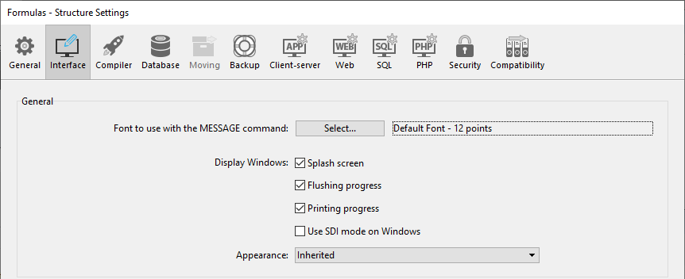
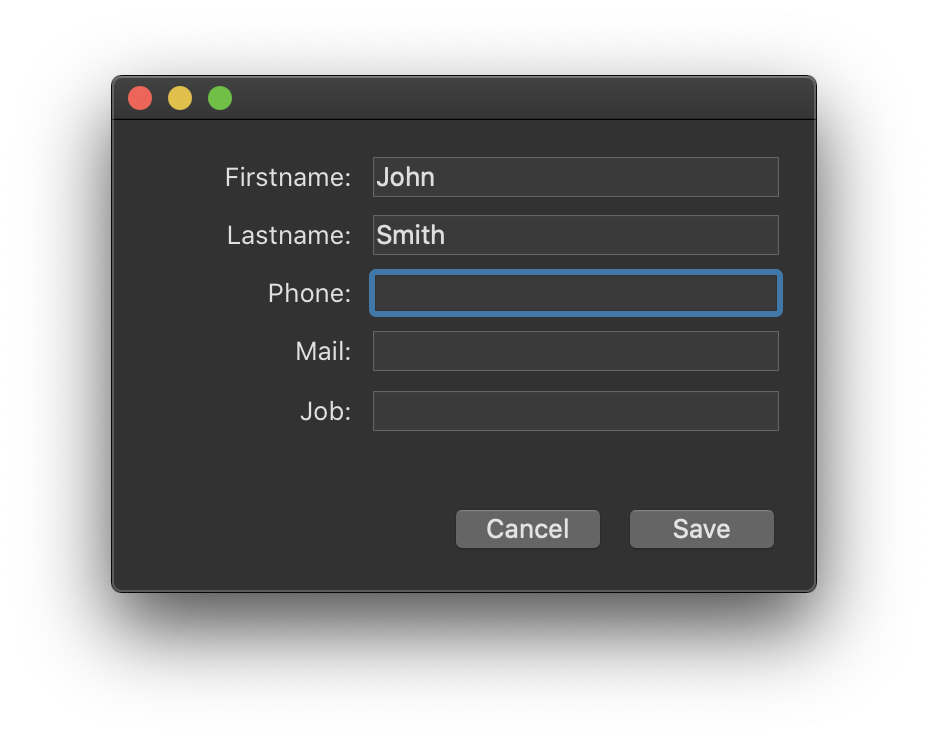

 
A página Interface é usada para definir várias opções relacionadas à interface do projeto.

## Geral

Esta área permite-lhe definir várias opções relativas ao ecrã.

### Fonte a ser usada com o comando MESSAGE

Click **Select...** to set the font and size for the characters used by the `MESSAGE` command.

The default font and its size depend on the platform where 4D is running.

> Esta propriedade também afecta as seguintes partes de 4D: <li>determinadas áreas de pré-visualização do Explorador</li><li>a régua do editor de formulários</li>
### Exibir janelas

Other options configure the display of various windows in the Application mode.

-   **Splash screen**: When this option is deselected, the [splash screen of the current menu bar](Menus/bars.md#splash-screen) does not appear in the Application mode. When you hide this window, it is up to you to manage the display of all your windows by programming, for example in the `On Startup` database method.

-   **Flushing progress**: When this option is checked, 4D displays a window at the bottom left of the screen while the data in the cache is flushed. Since this operation momentarily blocks user actions, displaying this window lets them know that flushing is underway.

:::note

You can set the [frequency for cache flushing](database.md#memory-page) in **Settings** > **Database** > **Memory**.

:::

-   **Printing progress**: Lets you enable or disable the display of the printing progress dialog box when printing.

-   **Use SDI mode on Windows**: When this option checked, 4D enables automatically the [SDI mode (Single-Document Interface)](../Menus/sdi.md) in your application when executed in a [supported context](../Menus/sdi.md#sdi-mode-availability). When you select this option, on Windows the **Run** menu of the 4D menu bar allows you to select the mode in which you want to test the application:

    

:::note

This option can be selected on macOS but will be ignored when the application is executed on this platform.

:::

### Aparência

This menu lets you select the color scheme to use at the main application level. A color scheme defines a global set of interface colors for texts, backgrounds, windows, etc., used in your forms.

> Esta opção só funciona no macOS. No Windows, é sempre utilizado o esquema "Light".

Os seguintes esquemas estão disponíveis:

-   **Light**: the application will use the Default Light Theme 
-   **Dark**: the application will use the Default Dark Theme 
-   **Inherited** (default): the application will inherit from the higher priority level (i.e., OS user preferences)

> Os temas predefinidos podem ser tratados com CSS. For more information, please refer to the [Media Queries](../FormEditor/createStylesheet.md#media-queries) section.

O esquema de aplicação principal será aplicado aos formulários por defeito. No entanto, ele pode ser substituído:

-   pelo comando [SET APPLICATION COLOR SCHEME](https://doc.4d.com/4dv19R/help/command/en/page1762.html) no nível da sessão de trabalho;
-   usando pela propriedade de formulário [esquema de cores](../FormEditor/propertiesForm.html#color-scheme) em cada nível de formulário (nível de prioridade mais alta). **Note:** When printed, forms always use the "Light" scheme.

## Atalhos

You use the Shortcuts area for viewing and modifying default shortcuts for three basic 4D form operations in your desktop applications. Esses atalhos são idênticos em ambas as plataformas. Os ícones das teclas indicam as teclas correspondentes para Windows e macOS.

Os atalhos predefinidos são os seguintes:

-   Aceitar de formulário de entrada: **Enter**
-   Cancelamento de entrada: **Esc**
-   Add to subform: **Ctrl+Shift+/** (Windows) or **Command+Shift+/** (macOS)

To change the shortcut of an operation, click the corresponding **Edit** button. Aparece a seguinte caixa de diálogo:

To change the shortcut, type the new key combination on your keyboard and click **OK**. If you prefer not to have a shortcut for an operation, click **Clear**.

