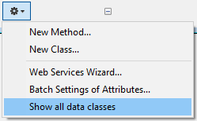

O código 4D usado em seu projeto está escrito em [métodos](../Concepts/methods.md) e [classes](../Concepts/classes.md).

O IDE 4D fornece vários recursos para criar, editar, exportar ou excluir seu código. Normalmente, você usará o [editor de código](../code-editor/write-class-method.md) 4D incluído para trabalhar com seu código. Você também pode usar outros editores, como **VS Code**, para o qual a [extensão 4D-Analyzer](https://github.com/4d/4D-Analyzer-VSCode) está disponível.

## Criação de métodos

Um método em 4D é armazenado em um arquivo **.4dm** localizado na pasta apropriada da pasta [`/Project/Sources/`](../Project/architecture.md#sources).

Você pode criar [vários tipos de métodos](../Concepts/methods.md#method-types):

- All types of methods can be created or opened from the **Explorer** window (except Object methods which are managed from the [Form editor](../FormEditor/formEditor.md)).
- Os métodos projeto também podem ser criados ou abertos no menu **File**, ou na barra de ferramentas (\*\*Novo/Método.. \*\* ou **Abrir/Método...**) ou usando atalhos na [janela do editor de código](../code-editor/write-class-method.md#shortcuts).
- **Triggers** can also be created or opened from the [Structure editor](../Develop-legacy/triggers.md#activating-and-creating-a-trigger).
- Los métodos formulario también pueden crearse o abrirse desde el [editor de formularios](../FormEditor/formEditor.md).

## Criação de classes

### User classes

Uma classe usuário no 4D é definida por um arquivo de método específico (**.4dm**), armazenado na pasta [`/Project/Sources/Classes/`](../Project/architecture.md#sources). O nome do arquivo é o nome da classe. For example, a class named "Polygon" will be stored in the following file:

```
Project folder
```

You can create a class file from the **File** menu or toolbar (**New > Class...**) or in the **Methods** page of the **Explorer** window. Você também pode usar o atalho **Ctrl+Shift+Alt+k**.

Na página de **Métodos** do Explorador, as classes são agrupadas na categoria **Classes**.

Para criar uma nova classe, pode:

- selecione a categoria **Classes** e clique no botão .
- selecione **Nova Classe...** no menu de ação na parte inferior da janela do Explorer, ou no menu contextual do grupo Classes.
  
- selecione **Novo > Classe...** a partir do menu contextual da página inicial do Explorador.

Ao nomear classes, deve ter em mente as seguintes regras:

- Um [nome de classe](../Concepts/identifiers.md#classes) deve estar em conformidade com as [regras de nomenclatura das propriedades](../Concepts/identifiers.md#object-properties).
- Nomes de classe diferenciam minúsculas de maiúsculas.
- Não se recomenda dar o mesmo nome a uma classe e a uma tabela de base de dados, a fim de evitar qualquer conflito.

### ORDA classes

[ORDA data model user classes](../ORDA/ordaClasses.md) are high-level class functions created above the data model.

An ORDA data model class is defined by adding, at the same location as regular class files (*i.e.* in the `/Sources/Classes` folder of the project folder), a .4dm file with the name of the class. Por exemplo, uma classe de entidade para o dataclass `Utilities` será definida através de um arquivo `UtilitiesEntity.4dm`.

4D pré-criou automaticamente classes vazias na memória para cada objeto de modelo de dados disponível.


Por padrão, as classes ORDA vazias não são exibidas no Explorer. Para mostrar a eles, você precisa selecionar **Mostrar todas as classes de dados** do menu de opções do Explorador:


As classes de utilizadores ORDA têm um ícone diferente das classes normais. As classes vazias são escurecidas:


Para criar um arquivo de classe ORDA, basta fazer duplo clique na classe predefinida correspondente no Explorador. 4D creates the class file and add the [`extends`](../Concepts/classes.md#class-extends-classname) code. Por exemplo, para uma classe Entity:

```
Class extends Entity
```

Quando uma classe for definida, o seu nome deixa de estar obscurecido no Explorador.

Para abrir una clase ORDA definida en el editor de código 4D, seleccione o haga doble clic en el nombre de una clase ORDA y utilice **Editar...** en el menú contextual/menú de opciones de la ventana del Explorador:


Para as classes ORDA baseadas no armazenamento de dados local (`ds`), é possível acessar diretamente o código da classe pela janela 4D Structure:


### Support in 4D projects

Nas várias janelas 4D (editor de código, compilador, depurador, explorador de tempo de execução), o código de classe é basicamente tratado como um método de projecto com algumas especificidades:

- No editor de código:
  - uma aula não pode ser executada
  - uma função de classe é um bloco de código
  - **Ir para a definição** em um membro do objeto procura por declarações da classe Função; por exemplo, "$o.f()" encontrará "Função f".
  - **Procurar referências** na declaração de função da classe procura a função utilizada como membro do objeto; por exemplo, "Função f" irá encontrar "$o.f()".
  - variables typed as a user or ORDA class automatically benefit from autocompletion features. Exemplo com uma variável de classe Entity:


- In the Runtime explorer and Debugger, class functions are displayed with the `<ClassName>` constructor or `<ClassName>.<FunctionName>` format.

## Excluir os métodos ou as classes

Para eliminar um método ou classe existente, pode:

- em seu disco, remova o arquivo *.4dm* da pasta "Sources",
- in the 4D Explorer, select the method or class and click  or choose **Move to Trash** from the contextual menu.

> To delete an object method, choose **Clear Object Method** from the [Form editor](../FormEditor/formEditor.md) (**Object** menu or context menu).

## Design Object Access commands

You can access the contents and paths of all methods in your applications by programming, thanks to the [**"Design Object Access" command theme**](../commands/theme/Design_Object_Access.md). This source toolkit facilitates the integration into your applications of code control tools and more particularly version control systems (VCS). It also lets you implement advanced systems for [code documentation](../Project/documentation.md), for building a custom explorer or for organizing scheduled backups of the code saved as disk files.

The following principles are implemented:

- Each method and form in a 4D application has its own address in the form of a pathname. For example, the trigger method for table 1 can be found at "[trigger]/table_1". Each object pathname is unique in an application.
- You can access objects in the 4D application using the commands of the **"Design Object Access"** command theme, for example [`METHOD GET NAMES`](../commands/method-get-names) or [`METHOD GET PATHS`](../commands/method-get-paths).
- Most of the commands in this theme work in both [interpreted and compiled](../Concepts/interpreted.md) mode. However, commands that modify properties or access contents executable from methods can only be used in interpreted mode (see the table below).
- You can use all the commands of this theme with 4D in local or remote mode. However, keep in mind that you cannot use certain commands in compiled mode: the purpose of this theme is to create custom development support tools. You must not use these commands to dynamically change the functioning of a database that is running. For example, you cannot use [`METHOD SET ATTRIBUTE`](../commands/method-set-attribute) to change a method attribute according to the status of the current user.
- When a command of this theme is called from a [component](../Project/components.md), by default it accesses the component objects. In this case, to access objects of the host, you just pass a `*` as the last parameter.

### Use in compiled mode

For reasons related to the principle of the compilation process, only certain commands in this theme can be used in compiled mode. The following table indicates the available of the commands in compiled mode:

| Comando                                                                  | Can be used in compiled mode |
| ------------------------------------------------------------------------ | ---------------------------- |
| [Current method path](../commands/current-method-path)                   | Sim                          |
| [FORM GET NAMES](../commands/form-get-names)                             | Sim                          |
| [METHOD Get attribute](../commands/method-get-attribute)                 | Sim                          |
| [METHOD GET ATTRIBUTES](../commands/method-get-attributes)               | Sim                          |
| [METHOD GET CODE](../commands/method-get-code)                           | Não                          |
| [METHOD GET COMMENTS](../commands/method-get-comments)                   | Sim                          |
| [METHOD GET FOLDERS](../commands/method-get-folders)                     | Sim                          |
| [METHOD GET MODIFICATION DATE](../commands/method-get-modification-date) | Sim                          |
| [METHOD GET NAMES](../commands/method-get-names)                         | Sim                          |
| [METHOD Get path](../commands/method-get-path)                           | Sim                          |
| [METHOD GET PATHS](../commands/method-get-paths)                         | Sim                          |
| [METHOD GET PATHS FORM](../commands/method-get-paths-form)               | Sim                          |
| [METHOD OPEN PATH](../commands/method-open-path)                         | Não                          |
| [METHOD RESOLVE PATH](../commands/method-resolve-path)                   | Sim                          |
| [METHOD SET ACCESS MODE](../commands/method-set-access-mode)             | Sim                          |
| [METHOD SET ATTRIBUTE](../commands/method-set-attribute)                 | Não                          |
| [METHOD SET ATTRIBUTES](../commands/method-set-attributes)               | Não                          |
| [METHOD SET CODE](../commands/method-set-code)                           | Não                          |
| [METHOD SET COMMENTS](../commands/method-set-comments)                   | Não                          |

:::note

The error -9762 "The command cannot be executed in a compiled database." is generated when the command is executed in compiled mode.

:::

### Creation of pathnames

Pathnames generated for 4D objects must be compatible with the file management of the operating system. Characters that are forbidden at the OS level such as ":" are automatically encoded in method names, so that generated files may be integrated automatically in a version control system.

Here are the encoded characters:

| Caracteres                   | Encoding |
| ---------------------------- | -------- |
| "                            | %22      |
| \*                           | %2A      |
| /                            | %2F      |
| :            | %3A      |
| \< | %3C      |
| \>                          | %3E      |
| ?                            | %3F      |
| \|                           | %7C      |
| \\                         | %5C      |
| %                            | %25      |

#### Exemplos

`Form?1` is encoded `Form%3F1`  
`Button/1` is encoded `Button%2F1`