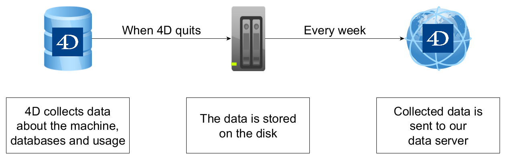

Para ajudar a tornar os produtos melhores, automaticamente coletamos dados referentes a estatísticas de usuário nas aplicações 4D Server Dados completados são anônimos e dados são transferidos sem ter impacto na experiência de usuário. Dados completados são anônimos e dados são transferidos sem ter impacto na experiência de usuário.

Esta página explica:

- que informação é coletada,
- onde a informação é armazenada e quando é enviada a 4D,
- como desativar a coleção de dados automática em aplicações cliente/servidor

## Informação coletada

Dados são coletados durante os eventos abaixo:

- arranque da base de dados,
- fechamento de banco de dados,
- início do servidor Web,
- uso de recursos específicos, como php, open datastore, depurador remoto,
- ligação cliente,
- envio da recolha de dados.

Alguns dados são também recolhidos a intervalos regulares.

| Dados                                                       | Tipo                                                     | Notas                                                                                                                                    |
| ----------------------------------------------------------- | -------------------------------------------------------- | ---------------------------------------------------------------------------------------------------------------------------------------- |
| buildNumber                                                 | Number                                                   | Número da versão da aplicação 4D                                                                                                         |
| cacheMissBytes                                              | Object                                                   | Número de bytes perdidos na cache                                                                                                        |
| cacheMissCount                                              | Object                                                   | Número de leituras falhadas na cache                                                                                                     |
| cacheReadBytes                                              | Object                                                   | Número de bytes lidos da cache                                                                                                           |
| cacheReadCount                                              | Object                                                   | Número de leituras na cache                                                                                                              |
| cacheSize                                                   | Number                                                   | Tamanho da cache em bytes                                                                                                                |
| compiled                                                    | Parâmetros                                               | Verdadeiro se a aplicação for compilada                                                                                                  |
| connectionSystems                                           | Collection                                               | SO do cliente sem o número de compilação (entre parêntesis) e número de clientes que o utilizam                       |
| CPU                                                         | Text                                                     | Nome, tipo, e velocidade do processador                                                                                                  |
| dataFileSize                                                | Number                                                   | Tamanho do arquivo de dados em bytes                                                                                                     |
| dataSegment1.diskReadBytes                  | Object                                                   | Número de bytes lidos no ficheiro de dados                                                                                               |
| dataSegment1.diskReadCount                  | Object                                                   | Número de leituras no ficheiro de dados                                                                                                  |
| dataSegment1.diskWriteBytes                 | Object                                                   | Número de bytes escritos no ficheiro de dados                                                                                            |
| dataSegment1.diskWriteCount                 | Object                                                   | Número de escritas no ficheiro de dados                                                                                                  |
| databases.externalDatastoreOpened           | Number                                                   | Número de chamadas para 'Open datastore'                                                                                                 |
| databases.internalDatastoreOpened           | Number                                                   | Número de vezes que o armazenamento de dados é aberto por um servidor externo                                                            |
| databases.remoteDebugger4DRemoteAttachments | Number                                                   | Número de anexos ao depurador remoto de um 4D remoto                                                                                     |
| databases.remoteDebuggerQodlyAttachments    | Number                                                   | Número de anexos ao depurador remoto da Qodly                                                                                            |
| databases.remoteDebuggerVSCodeAttachments   | Number                                                   | Número de anexos para o depurador remoto do Código VS                                                                                    |
| databases.restMaxLicensedSessions           | Number                                                   | Número máximo de sessões REST web no servidor que usa a licença REST                                                                     |
| databases.restMaxUnlicensedSessions         | Number                                                   | Número máximo de outras sessões da Web REST no servidor                                                                                  |
| databases.webIPAddressesNumber              | Number                                                   | Número de endereços IP diferentes que fizeram uma solicitação ao 4D Server                                                               |
| databases.webMaxLicensedSessions            | Number                                                   | Número máximo de sessões Web não REST no servidor que usam a licença do servidor Web                                                     |
| databases.webMaxUnlicensedSessions          | Number                                                   | Número máximo de outras sessões não-REST no servidor                                                                                     |
| databases.webScalableSessions               | Parâmetros                                               | True se as sessões escalonáveis estiverem ativadas                                                                                       |
| encrypted                                                   | Parâmetros                                               | True se o arquivo de dados estiver criptografado                                                                                         |
| encryptedConnections                                        | Parâmetros                                               | True se as ligações cliente/servidor forem encriptadas                                                                                   |
| externalPHP                                                 | Parâmetros                                               | True se o cliente efetuar uma chamada para `PHP execute` e utilizar a sua própria versão de php                                          |
| hasDataChangeTracking                                       | Parâmetros                                               | True if a "__DeletedRecords" table exists                                                      |
| headless                                                    | Parâmetros                                               | Verdadeiro se a aplicação estiver a correr em modo sem cabeça                                                                            |
| id                                                          | Texto (cadeia de caracteres com hash) | Identificação única associada à base de dados (*Polinômio Rolling hash do nome da base de dados*)                     |
| indexSegment.diskReadBytes                  | Number                                                   | Número de bytes lidos no ficheiro de índice                                                                                              |
| indexSegment.diskReadCount                  | Number                                                   | Número de leituras no ficheiro índice                                                                                                    |
| indexSegment.diskWriteBytes                 | Number                                                   | Número de bytes escritos no ficheiro de índice                                                                                           |
| indexSegment.diskWriteCount                 | Number                                                   | Número de escritas no ficheiro de índice                                                                                                 |
| indexesSize                                                 | Number                                                   | Tamanho do índice em bytes                                                                                                               |
| isEngined                                                   | Parâmetros                                               | Verdadeiro se a aplicação for fundida com o Volume Desktop 4D                                                                            |
| isRosetta                                                   | Parâmetros                                               | True se 4D for emulado através do Rosetta no macOS, False caso contrário (não emulado ou no Windows). |
| LDAPLogin                                                   | Number                                                   | Number of calls to `LDAP LOGIN`                                                                                                          |
| licença                                                     | Object                                                   | Nome comercial e descrição das licenças do produto                                                                                       |
| maximum4DClientConnections                                  | Number                                                   | Número máximo de ligações 4D Client ao servidor                                                                                          |
| maximumNumberOfWebProcesses                                 | Number                                                   | Número máximo de processos Web simultâneos                                                                                               |
| maximumUsedPhysicalMemory                                   | Number                                                   | Utilização máxima da memória física                                                                                                      |
| maximumUsedVirtualMemory                                    | Number                                                   | Utilização máxima da memória virtual                                                                                                     |
| memory                                                      | Number                                                   | Volume de armazenamento de memória (em bytes) disponível na máquina                                                   |
| mobile                                                      | Collection                                               | Informação sobre sessões móveis                                                                                                          |
| numberOfCores                                               | Number                                                   | Número total de núcleos                                                                                                                  |
| numberOfFields                                              | Number                                                   | Number of fields                                                                                                                         |
| numberOfKeepRecordSyncInfo                                  | Number                                                   | Number of tables with the "Enable Replication" option checked                                                                            |
| numberOfRecordsMax                                          | Number                                                   | Total number of records                                                                                                                  |
| numberOfTables                                              | Number                                                   | Number of tables                                                                                                                         |
| numberOfWebServices                                         | Number                                                   | Number of methods published as Web Services                                                                                              |
| ODBCLogin                                                   | Number                                                   | Number of calls to `SQL LOGIN` using ODBC                                                                                                |
| phpCall                                                     | Number                                                   | Número de chamadas para 'PHP execute'                                                                                                    |
| projectMode                                                 | Parâmetros                                               | Verdadeiro se a aplicação for compilada                                                                                                  |
| qodly.webforms                              | Number                                                   | Número de formulários web Qodly                                                                                                          |
| QueryBySQL                                                  | Number                                                   | Number of calls to `QUERY BY SQL`                                                                                                        |
| restHits                                                    | Number                                                   | Número de acessos ao servidor REST durante a recolha de dados                                                                            |
| SQLBeginEndStatement                                        | Number                                                   | Number of uses of `Begin SQL` / `End SQL`                                                                                                |
| SQLLoginInternal                                            | Number                                                   | Number of calls to `SQL LOGIN` using SQL_INTERNAL                                                                   |
| SQLServer                                                   | Number                                                   | Number of SQL requests through the network                                                                                               |
| system                                                      | Text                                                     | Versão do sistema operativo e número de construção                                                                                       |
| uniqueID                                                    | Text                                                     | ID único do 4D Server                                                                                                                    |
| uptime                                                      | Number                                                   | Tempo decorrido (em segundos) desde que a base de dados 4D local foi aberta                                           |
| usingLegacyNetworkLayer                                     | Parâmetros                                               | Verdadeiro se a usar a camada de rede herdada para o servidor de aplicações                                                              |
| usingQUICNetworkLayer                                       | Parâmetros                                               | True se a base de dados utilizar a camada de rede QUIC                                                                                   |
| version                                                     | Number                                                   | Número da versão da aplicação 4D                                                                                                         |
| webServer                                                   | Object                                                   | "started":true se o servidor Web estiver a arrancar ou iniciado                                                          |
| webserverBytesIn                                            | Number                                                   | Bytes recebidos pelo servidor Web durante a recolha de dados                                                                             |
| webserverBytesOut                                           | Number                                                   | Bytes enviados pelo servidor Web durante a recolha de dados                                                                              |
| webserverHits                                               | Number                                                   | Número de acessos ao servidor Web durante a recolha de dados                                                                             |

## Onde é armazenado e enviado?

Os dados coletados são escritos em um arquivo de texto (formato JSON) por banco de dados quando 4D Servidor abandona. O ficheiro é armazenado dentro da [pasta 4D ativa](../commands-legacy/get-4d-folder.md), ou seja:

- en Windows:
  `Users\[userName]\AppData\Roaming\4D Server`
- em macOS: `/Users/[userName]/Library/ApplicationSupport/4D Server`

Uma vez por semana, o ficheiro é automaticamente enviado através da rede para 4D. O arquivo é então apagado da pasta 4D activa.

> Se o arquivo não pôde ser enviado por algum motivo, é, no entanto, apagado e não é exibida nenhuma mensagem de erro no lado do Servidor 4D.

O arquivo é enviado para o seguinte endereço de servidor: `https://dcollector.4d.com` (ip: 195.68.52.83).

## Desativar a coleção de dados em aplicações cliente/servidor geradas

Pode desactivar a recolha automática de dados em [aplicações construídas cliente/servidor](../Desktop/building.md#clientserver-page).

Para desativar a coleção, passe o valor **False** para a chave [`ServerDataCollection`](https://doc.4d.com/4Dv20/4D/20/ServerDataCollection.300-6335775.en.html) no arquivo `buildApp.4DSettings`, utilizado para construir a aplicação cliente/servidor.