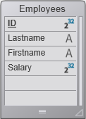

4D oferece um servidor REST poderoso que permite acesso direto aos dados armazenadas em seus bancos 4D.

El servidor REST está incluido en 4D y 4D Server, está automáticamente disponible en sus aplicaciones 4D [una vez configurado](configuration.md).

Esta seção tem o objetivo de familiarizar com as funcionalidades REST com um exemplo simples. Nós vamos:

 - criar e configurar um banco de dados 4D simples
 - acessar aos dados do banco 4D através de REST usando um navegador padrão.

Para simplificar o exemplo, vamos usar uma aplicação 4D e um navegador que são executados na mesma máquina. Também poderia usar uma arquitetura remota.

## Criar e configurar o banco de dados 4D

1. Lançar sua aplicação 4D ou 4D server e criar um novo banco de dados. Pode chamar de "Emp4D", por exemplo.

2. Create a table with some fields, for example:
   - Lastname (Alpha)
   - Firstname (Alpha)
   - Salary (Longint)



> A opção "Expor um recurso REST" está marcada por definição para a tabela e cada campo; não mude essa configuração.

3. Crie formulários depois crie alguns funcionários:


4. Abra la página **Web > Web Features** de la caja de diálogo de las Propiedades y [marque la opción Exponer como servidor REST](configuration.md#starting-the-rest-server).

5. En el menú **Ejecutar**, seleccione **Iniciar el servidor Web** (si es necesario), luego seleccione **Probar el servidor Web**.

4D exibe a página home padrão do servidor Web 4D.

## Acessar dados 4D através do navegador

Pode ler e editar dados com 4D apenas através de petições REST.

Toda petición de URL 4D REST comienza por `/rest`, que se debe insertar después del área `address:port`. Por exemplo, para ver o que está dentro da 4D Datastore, pode escrever:

```
http://localhost/rest/$catalog
```

O servidor REST responde:

```
{
	"__UNIQID": "96A49F7EF2ABDE44BF32059D9ABC65C1",
	"dataClasses": [
		{
			"name": "Employees",
			"uri": "/rest/$catalog/Employees",
			"dataURI": "/rest/Employees"
		}
	]
}
```

Significa que a datastore contém a dataclass Employees. Pode ver os atributos de classe de dados digitando:

```
/rest/$catalog/Employees
```

Se quiser obter todas as entidades da classe de dados Employee, pode escrever:

```
/rest/Employees
```

**Response:**

```
{
	"__entityModel": "Employees",
	"__GlobalStamp": 0,
	"__COUNT": 3,
	"__FIRST": 0,
	"__ENTITIES": [
		{
			"__KEY": "1",
			"__TIMESTAMP": "2020-01-07T17:07:52.467Z",
			"__STAMP": 2,
			"ID": 1,
			"Lastname": "Brown",
			"Firstname": "Michael",
			"Salary": 25000
		},
		{
			"__KEY": "2",
			"__TIMESTAMP": "2020-01-07T17:08:14.387Z",
			"__STAMP": 2,
			"ID": 2,
			"Lastname": "Jones",
			"Firstname": "Maryanne",
			"Salary": 35000
		},
		{
			"__KEY": "3",
			"__TIMESTAMP": "2020-01-07T17:08:34.844Z",
			"__STAMP": 2,
			"ID": 3,
			"Lastname": "Smithers",
			"Firstname": "Jack",
			"Salary": 41000
		}
	],
	"__SENT": 3
}
```

Tem muitas possibilidades para filtrar dados a receber. Por exemplo, para obter só o valor de atributo "Lasname" da segunda entidade, pode escrever:

```
/rest/Employees(2)/Lastname
```

**Response:**

```
{
	"__entityModel": "Employees",
	"__KEY": "2",
	"__TIMESTAMP": "2020-01-07T17:08:14.387Z",
	"__STAMP": 2,
	"Lastname": "Jones"
}
```

La [API REST](REST_requests.md) ofrece varios comandos para interactuar con las aplicaciones 4D.
