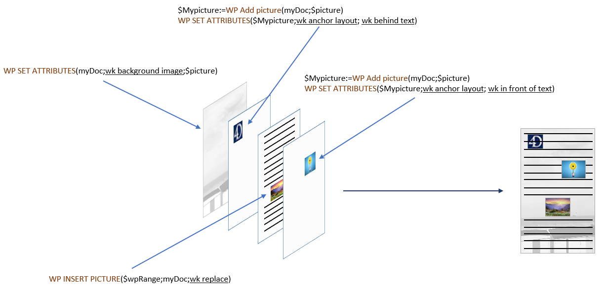

## Adicionar imagens 

Agregar imagenes a um documento 4D Write Pro pode ser feita de múltiplas maneiras dependendo de suas necessidades:

* para agregar uma **imagem de fundo**, use o atributo wk background image com o comando [WP SET ATTRIBUTES](../commands/wp-set-attributes)
* para agregar uma **imagem inserida** (inline), ou seja, inserida no fluxo de texto como un caractere, use o comando [WP INSERT PICTURE](../commands/wp-insert-picture) ou o comando [ST INSERT EXPRESSION](../../commands/st-insert-expression)
* para agregar uma **imagem ancorada** na página (atrás ou na frente do texto), use [WP Add picture](../commands/wp-add-picture) e defina o atributo wk anchor layout.

A forma em que agrega uma imagem determina a capa na qual está colocada, como se ilustra no diagrama abaixo:



## Imagens de fundo 

As imagens podem ser configuradas como fundo dos documentos 4D Write Pro e os elementos de documento (tabelas, parágrafos, seções, cabeçalhos/rodapés de página, etc.).

Aqui há um exemplo que mostra duas maneiras diferentes en que se pode usar uma imagem como fundo de um documento:

>  

As imagens de fundo podem ser definidas por programação ou mediante o menu contextual. Para saber mais, consulte a seção *Fundo* no artigo *Utilizar uma área 4D Write Pro*.

A visualização da imagem de fundo também pode se estabelecer por programação ou através do menu contextual. Lembre que os valores do modo de visualização de fundo definem preajustes da configuração de fundo, como se indica na descrição da constante:

| Constante                | Comentário                                                                                                                                                                                                                                                                                                                                                                                                                                                                                                                                                 |
| ------------------------ | ---------------------------------------------------------------------------------------------------------------------------------------------------------------------------------------------------------------------------------------------------------------------------------------------------------------------------------------------------------------------------------------------------------------------------------------------------------------------------------------------------------------------------------------------------------- |
| wk proportional          | Quando se utiliza como valor de wk image display mode, a imagen se alinha na parte superior esquerda da caixa de conteúdo, não se replica, se escala para ajustar-se à caixa de conteúdo e mantém sua relação de aspecto. Quando se utiliza como valor de wk background display mode, preestablece os atributos abaixo: wk background width \= "contain" wk background height \= "auto" wk background repeat \= wk no repeat wk background origin \= wk padding box wk background position horizontal \= wk left wk background position vertical \= wk top |
| wk proportional centered | Quando se utiliza como valor de wk image display mode, a imagem se centra na caixa de conteúdo, não se replica, se escala para ajustar-se à caixa de conteúdo e mantém sua relação de aspecto. Quando se utiliza como valor de wk background display mode, preestablece os atributos abaixo: wk background width \= "contain" wk background height \= "auto" wk background repeat \= wk no repeat wk background origin \= wk padding box wk background position horizontal \= wk center wk background position vertical \= wk center                       |
| wk replicated            | Quando se utiliza como valor de wk image display mode, a imagen se alinha na parte superior esquerda da caixa de conteúdo, se replica e mantém seu tamanho original. Quando se utiliza como valor de wk background display mode, preestablece os atributos abaixo: wk background width \= "auto" wk background height \= "auto" wk background repeat \= wk repeat wk background origin \= wk padding box wk background position horizontal \= wk left wk background position vertical \= wk top                                                            |
| wk replicated centered   | Quando se utiliza como valor de wk image display mode, a imagem se centra na caixa de conteúdo, se replica e mantém seu tamanho original. Quando se utiliza como valor de wk background display mode, preestablece os atributos abaixo: wk background width \= "auto" wk background height \= "auto" wk background repeat \= wk repeat wk background origin \= wk padding box wk background position horizontal \= wk center wk background position vertical \= wk center                                                                                  |
| wk scaled to fit         | Quando utiliza como valor de wk image display mode, a imagem se escala para se ajustar à caixa de conteúdo e não se replica. Quando se utiliza como valor de wk background display mode, se modificam os atributos abaixo: wk background width \= "100%" wk background height \= "100%" wk background repeat \= wk no repeat wk background origin \= wk padding box wk background position horizontal \= wk left wk background position vertical \= wk top                                                                                                 |
| wk truncated             | Quando for usada como valor de wk image display mode, a imagem se alinha na parte superior esquerda da caixa de conteúdo, não se replica e mantém seu tamanho original. Quando for utilizada como valor de wk background display mode, preestabelece os seguintes atributos: wk background width \= "auto" wk background height \= "auto" wk background repeat \= wk no repeat wk background origin \= wk padding box wk background position horizontal \= wk left wk background position vertical \= wk top                                               |
| wk truncated centered    | Quando usar como valor de wk image display mode, a imagem se centra na caixa de conteúdo, não se replica, e mantém seu tamanho original. Quando se utiliza como valor de wk background display mode, preestabelece os atributos: wk background width \= "auto" wk background height \= "auto" wk background repeat \= wk no repeat wk background origin \= wk padding box wk background position horizontal \= wk center wk background position vertical \= wk center                                                                                      |

## Posição e exibição das imagens ancoradas 

As imagens ancoradas são agregadas com uma posição absoluta, na frente e atrás do texto, e também são ancoradas a página ou partes específicas de um documento (ou seja, cabeçalho, rodapé, seções). Estabelecer uma posição absoluta para uma imagem se realiza com os comandos [WP Add picture](../commands/wp-add-picture) e [WP SET ATTRIBUTES](../commands/wp-set-attributes).

As posições das imagens ancoradas podem ser modificadas com os atributos abaixo específicos ou ações padrão:

| **Propriedade (constante)** | **Ação padrão**         |
| --------------------------- | ----------------------- |
| wk anchor layout            | *anchorLayout*          |
| wk anchor horizontal offset |                         |
| wk anchor horizontal align  | *anchorHorizontalAlign* |
| wk anchor vertical offset   |                         |
| wk anchor vertical align    | *anchorVerticalAlign*   |
| wk anchor origin            | *anchorOrigin*          |
| wk anchor page              | *anchorPage*            |
| wk anchor section           | *anchorSection*         |
| | *moveToBack*              |                         |
| | *moveToFront*             |                         |

As imagens ancoradas admitem o ajuste automático do texto quando se ancoram a um documento com opções como à esquerda, à direita, por cima ou por baixo, ou ao reder, oferecidas através da propriedade wk anchor layout ou a ação padrão anchorLayout. Leia esta entrada do blog para saber mais.


As imagens com ajuste de texto ancoradas ao corpo da página não afetam o cabeçalho nem ao rodapé (a imagem é mostrada na frente do cabeçalhoo ou do rodapé), do contrário, as imagens ancoradas ao cabeçalho e rodapé afetam ao corpo da página nem se sobrepõe com ele.

Nota: se quiser ancorar uma imagem com ajsute de texto ao cabeçalho ou rodapé, também deve definir o alinhamento vertical da imagem na parte superior.

Todas as imagens ancoradas são mostradas unicamente no modo de visualização de página. Não são mostradas se:

* estão ancorados a um cabeçalho ou rodapé que não for visível;
* o modo de vista é Rascunho;
* estão centradas ou ancoradas em seções e a opção **Mostrar HTML WYSIWYG** está marcada;
* a opção "Mostrar fundo" não está selecionada.

## Expressões de Imagem 

Pode inserir expressões 4D que devolvam imagens em suas áreas 4D Write Pro. As expressões podem ser variáveis, campos, métodos projeto(\*), atributos de objeto ou elementos de coleção.

Pode ver a referência de uma expressão na ponta da imagem (\*):


(\*)Como não há texto associado com uma imagem ancorada, sua referência de expressão não pode ser mostrada.

Todos os atributos imagem podem ser aplicados a expressões imagem (wk image e os atributos wk image url apenas podem ser lidos). Entretanto, lembre que, dado que as imagens têm atributos específicos, 4D Write Pro deve avaliar a expressão ao menos uma vez para detectar que seu resultado seja uma imagem e manejá-la como uma expressão de imagem. Isto significa que quando for inserida uma expressão de imagem com [WP INSERT FORMULA](../commands/wp-insert-formula), [WP COMPUTE FORMULAS](../commands/wp-compute-formulas) deve ser chamada antes de definir todo atributo imagem.

**Nota**: da mesma forma que com outras expressões, as expressões de imagem também são afetadas pelos comandos [WP COMPUTE FORMULAS](../commands/wp-compute-formulas) e [WP FREEZE FORMULAS](../commands/wp-freeze-formulas)

### Imagens ancoradas 

As expressões imagem ancoradas são adicioinadas com o comando [WP Add picture](../commands/wp-add-picture) (sem o segundo parâmetro), seguido de um chamada ao comando [WP SET ATTRIBUTES](../commands/wp-set-attributes)com o seletor wk image formula

Exemplo:

```4d
 obImage:=WP Add picture(myDoc)
 WP SET ATTRIBUTES(obImage;wk image formula;Formula(m_buildPict))
```

Também pode inserir expressões de imagem usando [WP SET ATTRIBUTES](../commands/wp-set-attributes) e wk image expression em imagens ancoradas existentes.

**Nota de compatibilidade:** wk image expression ainda pode ser usada para definir as expressões de imagem através de texto. Entretanto é recomendado usar wk image formula e objetos. 

Chamar ao comando [WP RESET ATTRIBUTES](../commands/wp-reset-attributes) com wk image expression é similar a chamar a [ST FREEZE EXPRESSIONS](../../commands/st-freeze-expressions) (no documento todo) na qual a expressão é limpada desde o atributo imagem. Entretanto, [ST FREEZE EXPRESSIONS](../../commands/st-freeze-expressions) calcula a expressão antes de apagar, enquanto [WP RESET ATTRIBUTES](../commands/wp-reset-attributes) não faz isso. Se nunca tiver calculado uma expressão, se mostrará a imagem de marco negro pré-determinada.

### Inserir expressões de imagem 

Expressões de imagem Inline são adicionadas com o comando [WP INSERT FORMULA](../commands/wp-insert-formula)

Exemplos:

```4d
  //Insere uma variável de imagem
 WP INSERT FORMULA(wpRange;Formula($vpict);wk prepend)
 
  //Insere um campo
 WP INSERT FORMULA(wpRange;Formula([DOC]SamplePict);wk prepend)
 
  //Insere um método 4D
 WP INSERT FORMULA(wpRange;Formula(M_ComputeChart);wk prepend)
```

### Imagens vazias 

Se uma imagem estiver vazia (por exemplo, se não foi carregada, ou é resultado de uma expressão que não pôde ser computada, ou se usa um formato de imagem não compatível) como padrão 4D Write Pro exibe um retângulo negro


Pode remover os retângulos negros da visão atual usando:

* A opção "Mostrar imagens vazias ou não compatíveis" da lista de Propriedades *Configurar propriedades de Vista*, ou
* o comando [WP SET VIEW PROPERTIES](../commands/wp-set-view-properties) com o seletor wk visible empty images ou
* a ação padrão *visibleEmptyImage* (ver *Usando ações padrão*).

Também pode usar o seletor wk visible empty images com os comandos [WP EXPORT DOCUMENT](../commands/wp-export-document) e [WP EXPORT VARIABLE](../commands/wp-export-variable) para remover os retângulos negros de conteúdos exportados

Note que quando esta opção for estabelecida, elementos de imagem faltando não serão exibidos mesmo que tenham bordas, altura, largura ou fundo; por isso podem impactar o layout de página para imagens inline.

## Propriedades de Imagens 

Todas as imagens têm propriedades (atributos) como altura, largura, bordas, etc., que podem ser obtidas ou definidas através da linguagem 4D Write Pro ([WP GET ATTRIBUTES](../commands/wp-get-attributes) e [WP SET ATTRIBUTES](../commands/wp-set-attributes)) ou de ações padrão.

* a lista completa de propriedades disponíveis para imagens é oferecida na página *Atributos 4D Write Pro*.
* a seção *Imagem* contém atributos que são específicos das imagens somente.
* a página *Usando ações padrão* também lista as propriedades de imagem disponíveis.

### Referência de Imagem ou URL de imagem 

Pode trabalhar com referências de imagens (variáveis de imagem, campos, expressões) ou URL de imagens (texto que representa um endereço local ou de rede da imagem).

Dois conjuntos de atributos lhe permitem definir se deseja estabelecer ou obter uma referência de imagem ou uma URL de imagem:

* wk image, wk background image, wk list style image: para definir ou obter referências de imagem.  
Quando obter uma imagem utilizando um dessos atributos, recebe uma imagem 4D, sem importar como a imagem foi definda.
* wk image url, wk background image url, wk list style image url: para definir u obtener URLs de imágenes.  
Quando obter uma imagem utilizando um desses atributos, recebe um texto. Se a imagem tiver sido definida através de uma referência (por exemplo, uma variável de imagem), uma URL local é obtida seguido da imagem em Base64.

**Exemplo:** 

```4d
 $range:=WP Get selection(WPArea) //obtém a imagem selecionada pelo usuário
 $range:=WP Picture range($range) //cria uma range
 $url:="http://doc.4d.com/image/logo/poweredby4D_web.png"
 
 WP SET ATTRIBUTES($range;wk image;$url) //define uma referência de imagem desde uma URL
 
  //obtém la imagem
 var vPictureGet : Picture
 WP GET ATTRIBUTES($range;wk image;vPictureGet) //vPictureGet contém uma imagem
 var vPictureURLGet : Text
 WP GET ATTRIBUTES($range;wk image url;vPictureURLGet) //vPictureURLGet=$url
```

## Recuperar imagens 

Os comandos abaixo podem ser usados para devolver imagens:

* [WP Picture range](../commands/wp-picture-range) \- aplica so a imagens inseridas inline
* [WP Selection range](../commands/wp-selection-range) \- só aplica as imagens selecionadas pelo usuário

## Apagando Imagens 

Pode remover imagens inline ou ancoradas com: 

* *Ações Mouse/teclado*
* o comando [WP DELETE PICTURE ](../commands/wp-delete-picture)

## Ações Mouse/teclado 

As imagens podem ser manipuladas com o mouse ou o teclado. As ações disponíveis incluem:

* **SELECT**  
   * As imagens na capa frontal podem ser selecionadas clicando nelas;  
   * As imagens de fundo podem ser selecionadas pressionando CTRL + clicando na imagem (Windows) ou COMANDO + clique (Mac);  
   * Só pode ser selecionada uma única imagem com uma posição absoluta: não é possível a seleção múltipla.
* **MOVE**  
   * As imagens podem ser movidas e mudar de tamanho com o mouse; (as imagens inline sinderidas não podem ser arrastadas para fora do documento).
* **INSERT**  
   * Se as imagens com uma posição absoluta são coladas em modo Rascunho, são mostradas inline inseridas no começo da seleção do teclado atual.
* **CUT/PASTE/COPY**  
   * As imagens podem ser copiadas a área de transferência, ou cortar/colar enquanto são selecionadas.  
   * Colar uma imagem com uma posição absoluta no modo Página colará a imagem na primeira página selecionada e vai ancorar a essa página, sem importar a configuração de ancoragem da página original; as imagens coladas se manterão seus deslocamentos, a menos que se colem em um modo diferente ao original (por exemplo, se a imagem se copia em modo Página e se cola em modo Aninhado, os deslocamentos são restabelecidos em 0).
* **DELETE** \- As imagens podem ser apagadas enquanto são selecionadas com:  
   * Tecla DELETE, ou  
   * atalho de teclado para a ação Clear