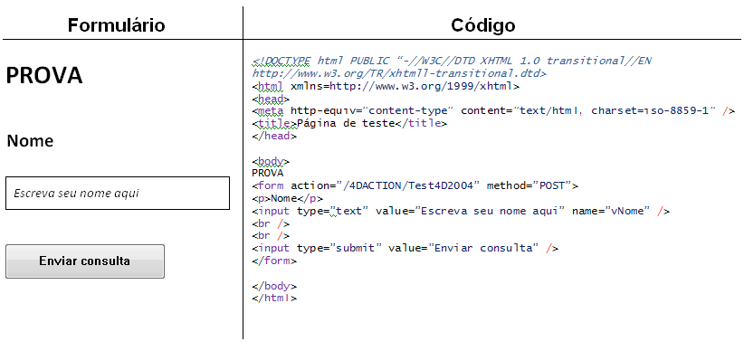

<!--REF #_command_.WEB GET HTTP BODY.Syntax-->**WEB GET HTTP BODY** ( *corpo* )<!-- END REF-->
<!--REF #_command_.WEB GET HTTP BODY.Params-->
| Parâmetro | Tipo |  | Descrição |
| --- | --- | --- | --- |
| corpo | Blob, Text | &#8592; | corpo da petição HTTP |

<!-- END REF-->

## Descrição 

<!--REF #_command_.WEB GET HTTP BODY.Summary-->O comando **WEB GET HTTP BODY** retorna o corpo da solicitação HTTP que esta sendo processada.<!-- END REF--> O corpo HTTP se retorna tal qual, sem processo nem análise.  

Este comando pode ser chamado utilizando um método de banco web (*On Web Authentication Database Method*, [On Web Connection](./on-web-connection-database-method.md)) ou todo método web.  
  
Pode passar no parâmetro *corpo*, uma variável ou um campo de tipo BLOB ou Texto. O tipo Texto é geralmente suficiente (o parâmetro *corpo* pode receber até 2 GB de texto).  
  
Este comando permite por exemplo realizar as pesquisas no corpo das solicitações. Também permite aos usuários avançados configurar um servidor WebDAV dentro de um banco 4D.

## Exemplo 

Neste exemplo, uma petição simples é enviada ao servidor web de 4D e o conteúdo do campo HTTP corpo se visualiza no depurador. Este é o formulário enviado ao servidor web de 4D, assim como o código HTML correspondente:  
  
 

Este é o método Test4D2004:

```4d
 var $petição : Blob
 var $textoPetição : Text
 
 WEB HTTP BODY($petição)
 $textoPetição:=BLOB to text($petição;UTF8 text without length)
 WEB SEND FILE("pagina.html")
```

**Nota:** este método se declara “Disponível através das etiquetas HTML e as URLs 4D (4DACTION...)” em suas propriedades. 

Quando o formulário é enviado ao servidor web, a variável $textoPetição recebe o texto do campo corpo da petição HTTP.

## Ver também 

[WEB GET BODY PART](web-get-body-part.md)  
[WEB GET HTTP HEADER](web-get-http-header.md)  

## Propriedades

|  |  |
| --- | --- |
| Número do comando | 814 |
| Thread-seguro | &check; |


