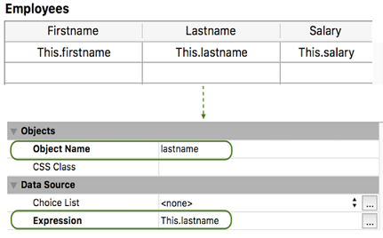

<!--REF #_command_.FORM Event.Syntax-->**FORM Event** : Object<!-- END REF-->

<!--REF #_command_.FORM Event.Params-->

| Parâmetro | Tipo   |                             | Descrição      |
| --------- | ------ | --------------------------- | -------------- |
| Resultado | Object | &#8592; | Objecto evento |

<!-- END REF-->

## Descrição

<!--REF #_command_.FORM Event.Summary-->**FORM Event** returns an object containing information about the form event that has just occurred.<!-- END REF-->O **FORM Event** retorna um objeto que contém informações sobre o evento de formulário que acabou de ocorrer. Normalmente, você usará **FORM Event** em um método formulário ou objeto.

**Objeto devolvido**

Cada objeto retornado inclui as seguintes propriedades principais:

| **Propriedade** | **Tipo** | **Description**                                                                                                                                                                    |
| --------------- | -------- | ---------------------------------------------------------------------------------------------------------------------------------------------------------------------------------- |
| objectName      | text     | Name of the object triggering the event - Not included if the event is triggered by the form                                                                                       |
| code            | integer  | Valor numérico do evento de formulário.                                                                                                                            |
| description     | text     | Nome do evento de formulário (\*por exemplo, \* "On After Edit"). Veja a seção [**Eventos Formulário**](../Events/overview.md). |

Por exemplo, no caso de um clique em um botão, o objeto contém as seguintes propriedades:

```json
{"code":4,"description":"On Clicked","objectName":"Button2"}
```

O objeto evento pode conter propriedades adicionais, dependendo do objeto para o qual o evento ocorre. Para os objetos *eventObj* gerados em:

- dos objetos list box ou coluna de list box, consulte [esta seção](../FormObjects/listbox_overview.md#additional-properties).
- As areas 4D View Pro consulte no evento formulário [On VP Ready](../Events/onVpReady.md).

**Nota:** se não houver um evento atual, **FORM Event** retornará um objeto null.

## Exemplo 1

Você deseja manipular o evento On Clicked em um botão:

```4d
 If(FORM Event.code=On Clicked)
    ...
 End if
```

## Exemplo 2

Se você definir o nome do objeto coluna com um nome de atributo real de uma dataclass como esta:



Você pode classificar a coluna usando o evento On Header Click:

```4d
 Form.event:=FORM Event
 Case of
    :(Form event code=On Header Click)
       if(Form.event.columnName="lastname")
          Form.employees:=Form.employees.orderBy(Form.event.columnName+", firstname")
       End if
 End case
```

## Exemplo 3

Você deseja tratar On Display Details em um objeto list box com um método definido na propriedade *Meta info expression*:


O método *setColor*:

```4d
 var $event;$0;$meta : Object
 $event:=FORM Event
 $meta:=New object
 
 Case of
    :($event.code=On Display Detail)
       If($event.isRowSelected)
          $meta.fill:="lightblue"
       End if
 End case
 $0:=$meta
```

O list box resultante quando as linhas são selecionadas:


## Veja também

[Form Events](../Events/overview.md)
[Form event code](form-event-code.md)

## Propriedades

|                   |                             |
| ----------------- | --------------------------- |
| Número de comando | 1606                        |
| Thread safe       | &check; |


