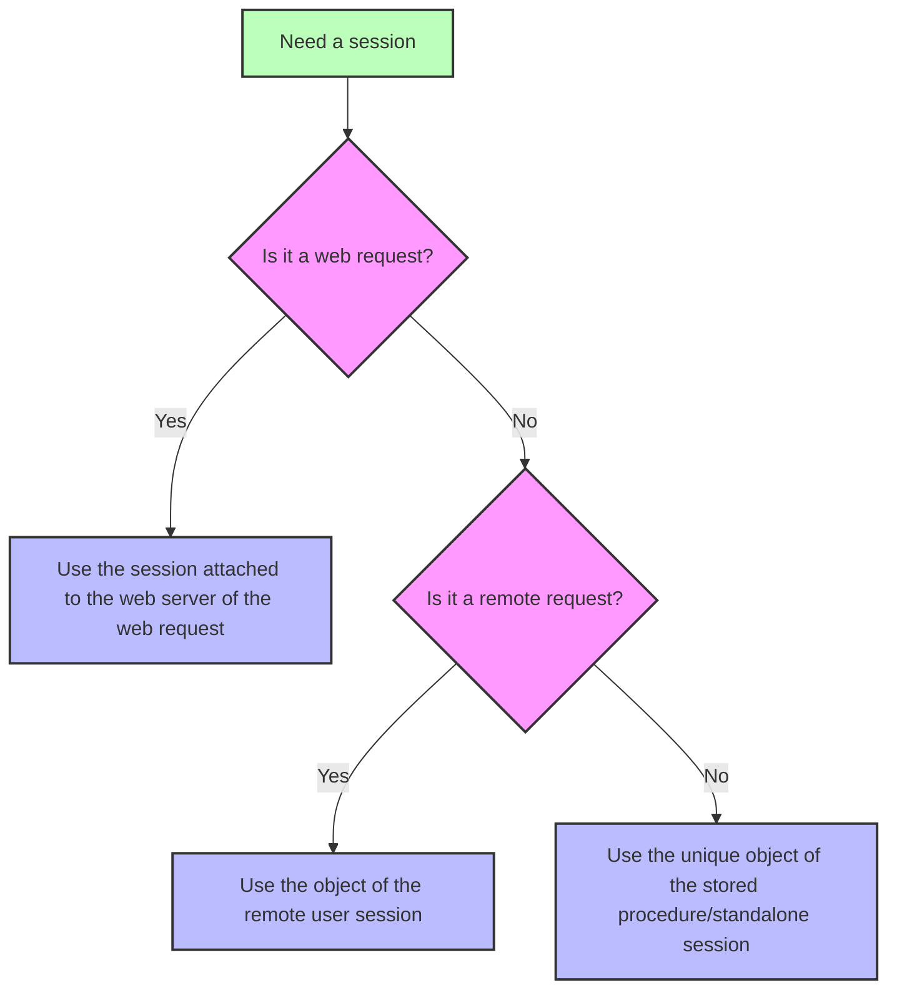

<!-- REF #_command_.Session.Syntax -->**Session** : 4D.Session<!-- END REF -->

<!--REF #_command_.Session.Params-->

| Parâmetro | Tipo                        |                             | Descrição       |
| --------- | --------------------------- | --------------------------- | --------------- |
| Resultado | 4D. Session | &#8592; | Objecto Session |

<!-- END REF-->

<details><summary>História</summary>

| Release | Mudanças                                                      |
| ------- | ------------------------------------------------------------- |
| 20 R8   | Support of standalone sessions                                |
| 20 R5   | Suporte a sessões de procedimento armazenado e cliente remoto |
| 18 R6   | Adicionado                                                    |

</details>

## Descrição

The `Session` command <!-- REF #_command_.Session.Summary -->returns the `Session` object corresponding to the current session<!-- END REF -->.

Depending on the process from which the command is called, the current session can be:

- uma sessão web (quando [sessões escaláveis são ativadas](WebServer/sessions.md#enabling-web-sessions)),
- a remote client session (on the server),
- a stored procedures session,
- a standalone session.

Para obter mais informações, consulte [Tipos de sessão](../API/SessionClass.md#session-types).

The command returns *Null* if:

- it is called in a web process and scalable sessions are disabled on the web server,
- it is called on a remote 4D.

### Sessões web

O objeto `Session` das sessões web está disponível em qualquer processo web:

- `On Web Authentication`, `On Web Connection`, and `On REST Authentication` database methods,
- código processado a través das etiquetas 4D nas páginas semidinâmicas (4DTEXT, 4DHTML, 4DEVAL, 4DSCRIPT/, 4DCODE)
- os métodos projeto com o atributo "Available through 4D tags and URLs (4DACTION...)" e chamados através de 4DACTION/ urls,
- [`On Mobile App Authentication`](https://developer.4d.com/go-mobile/docs/4d/on-mobile-app-authentication) and [`On Mobile App Action`](https://developer.4d.com/go-mobile/docs/4d/on-mobile-app-action) database methods for mobile requests,
- Funções ORDA [chamadas com solicitações REST](../REST/ClassFunctions.md).

Para obter mais informações sobre as sessões dos usuários da web, consulte a seção [Sessões de Servidor Web](../WebServer/sessions.md).

### Sessões cliente remoto

O objeto `Session` das sessões remotas de clientes está disponível em:

- Métodos de projeto que têm o atributo [Execute on Server](../Project/code-overview.md#execute-on-server) (são executados no processo "geminado" do processo do cliente),
- Triggers,
- ORDA [funções do modelo de dados](../ORDA/ordaClasses.md) (exceto aquelas declaradas com a palavra-chave [`local`](../ORDA/ordaClasses.md#local-functions),
- 'Conexão aberta com o servidor' e 'Conexão com o servidor' métodos de banco de dados.

For more information on remote user sessions, please refer to the [**Remote user sessions**](../Desktop/sessions.md#remote-user-sessions) paragraph.

### a sessão de procedimentos armazenados

Todos os processos de procedimento armazenado compartilham a mesma sessão de usuário virtual. O objeto `Session` de procedimentos armazenados está disponível em:

- métodos chamados com o comando [`Execute on server`](../commands-legacy/execute-on-server.md),
- `On Server Startup`, `On Server Shutdown`, `On Backup Startup`, `On Backup Shutdown`, and `On System event` database methods

For more information on stored procedures virtual user session, please refer to the [**Stored procedure sessions**](../Desktop/sessions.md#stored-procedure-sessions) paragraph.

### Sessão autônoma

The `Session` object is available from any process in standalone (single-user) applications so that you can write and test your client/server code using the `Session` object in your 4D development environment.

For more information on standalone sessions, please refer to the [**Standalone sessions**](../Desktop/sessions.md#standalone-sessions) paragraph.

### `Session` and components

When `Session` is called from the code of different [components loaded in the project](../Concepts/components.md), the command returns an object depending on the calling request and the context:

- in case of a web request, `Session` always returns the session attached to the target web server of the request (and not a session of the component's web server),
- in case of a remote request executed on the server, `Session` always returns the session attached to the remote user,
- in case of a stored procedure session or a standalone session, `Session` always returns the single current session (the same object is used during all the work session).



## Exemplo

You have defined the `action_Session` method with attribute "Available through 4D tags and URLs". Pode chamar ao método introduzindo a URL abaixo no navegador:

```
IP:port/4DACTION/action_Session
```

```4d
  //action_Session method
 Case of
    :(Session#Null)
       If(Session.hasPrivilege("CreateInvoices")) //calling the hasPrivilege function
          WEB SEND TEXT("4DACTION --> Session is CreateInvoices")
       Else
          WEB SEND TEXT("4DACTION --> Session is not CreateInvoices")
       End if
    Else
       WEB SEND TEXT("4DACTION --> Session is null")
 End case
```

## Veja também

[Session storage](session-storage.md)  
[Session API](../API/SessionClass.md)
[Desktop sessions](../Desktop/sessions.md)
[Web server user sessions](../WebServer/sessions.md)  
[*Scalable sessions for advanced web applications* (blog post)](https://blog.4d.com/scalable-sessions-for-advanced-web-applications/)

## Propriedades

|                   |      |
| ----------------- | ---- |
| Número de comando | 1714 |
| Thread safe       | sim  |


