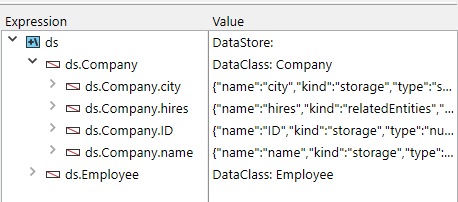

Since ORDA is object-based, using ORDA requires basic knowledge in object programmming.

## Exploring the datastore

The ORDA datastore is automatically based upon a 4D database structure, provided it complies with the [ORDA prerequisites](overview.md#orda-prerequisites).

This example will use the following simple 4D database structure:


To know what is exposed as the datastore, create a new project method, write the following line:

```code4d
TRACE
``` 

Execute the method -- it simply calls the debugger window. 
In the Expression area, double-click to insert an expression and enter `ds`. It returns the datastore object.
Deploy the object, you can see that tables and fields are automatically exposed by ORDA as properties of the `ds` object:



It means for example that, whenever you need to refer to the city field of the [Company] table, in ORDA you just need to write:

```code4d
ds.Company.city //returns the name of the city
```

> In the ORDA world, ds.Company is a **dataclass**. ds.Company.city is an **attribute**. 

> ORDA is case sensitive. `ds.company.city` will not refer to the ds.Company.city attribute. 

You have also noticed the extra `hires` property in the ds.Company dataclass. It does not correspond to a field. `hires` is actually the name of the *One to many* relation between Company and Employee:
 
 
*Name of the relation as defined in the Inspector*

It means that, whenever you need to access the list of employees working for a company, in ORDA you just need to write:

```code4d
ds.Company.hires //returns the list of employees
```

But don't go too fast. Let's see now how to record data in ORDA dataclasses. 


## Adding data

In ORDA, you can add a record to a dataclass using the `new()` command. 

>In the ORDA world, a record is an **entity** -- an entity is itself an object. A command that is attached to a specific object is called a **member method**.

```code4d
$entity:=ds.Company.new() //create a new entity reference
//in the Company dataclass  
//and assign it to the $entity variable
```

A new entity object contains a "copy" of all attributes of its parent dataclass, thus you can assign values to them:

```code4d
$entity.name:="ACME, inc."  
$entity.city:="London"  
//$entity.ID is automatically filled
```

Right now, the entity only exists in memory. To store it in the data file, you need to save it using the `save()` member method:

```code4d
$status:=$entity.save()
```


