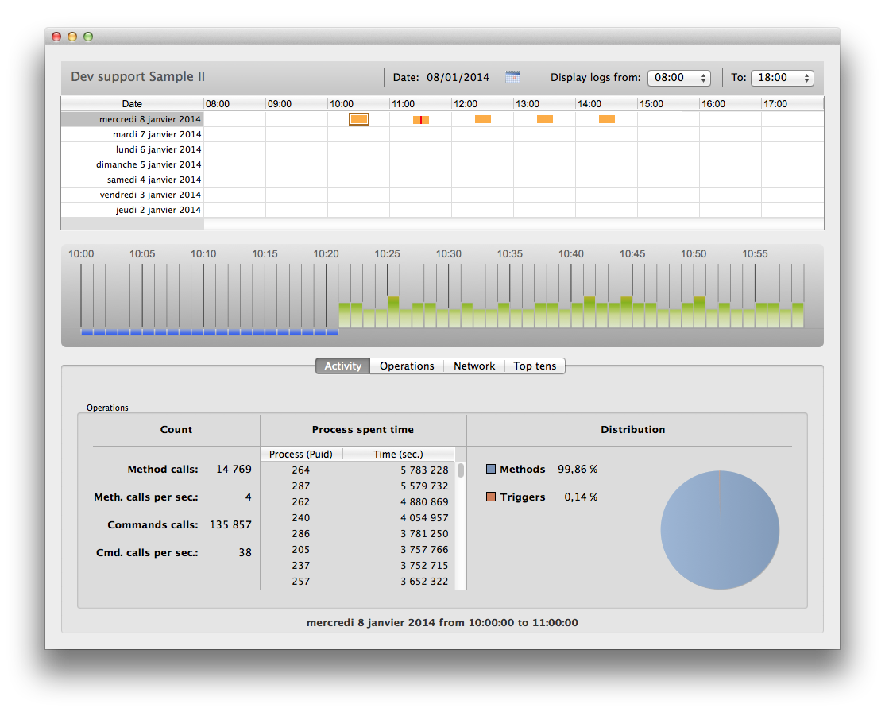

Forms provide the interface through which information is entered, modified, and printed in a desktop application. Users interact with the data in a database using forms and print reports using forms. Forms can be used to create custom dialog boxes, palettes, or any featured custom window.



Forms can also contain other forms through the following features:

- [subform objects](FormObjects/subform_overview.md)
- [inherited forms](properties_FormProperties.md#inherited-forms)

## Creating forms

You can add or modify 4D forms using the following elements:

- **4D Developer interface:** Create new forms from the **File** menu or the **Explorer** window.
- **Form Editor**: Modify your forms using the **[Form Editor](FormEditor/formEditor.md)**.
- **JSON code:** Create and design your forms using JSON and save the form files at the [appropriate location](Project/architecture.md#sources-folder). Example:

```
{
    "windowTitle": "Hello World",
    "windowMinWidth": 220,
    "windowMinHeight": 80,
    "method": "HWexample",
    "pages": [
        null,
        {
            "objects": {
                "text": {
                "type": "text",
                "text": "Hello World!",
                "textAlign": "center",
                "left": 50,
                "top": 120,
                "width": 120,
                "height": 80
                },
                "image": {
                "type": "picture",
                "pictureFormat": "scaled",
                "picture": "/RESOURCES/Images/HW.png",
                "alignment":"center", 
                "left": 70,
                "top": 20, 
                "width":75, 
                "height":75        
                },
                "button": {
                "type": "button",
                "text": "OK",
                "action": "Cancel",
                "left": 60,
                "top": 160,


                "width": 100,
                "height": 20
                }
            }
        }
    ]
}
```

## Project form and Table form

There are two categories of forms:

- **Project forms** - Independent forms that are not attached to any table. They are intended more particularly for creating interface dialog boxes as well as components. Project forms can be used to create interfaces that easily comply with OS standards.

- **Table forms** - Attached to specific tables and thus benefit from automatic functions useful for developing applications based on databases. Typically, a table has separate input and output forms.

Typically, you select the form category when you create the form, but you can change it afterwards.

## Form pages

Each form has is made of at least two pages:

- a page 1: a main page, displayed by default
- a page 0: a background page, whose contents is displayed on every other page.

You can create multiple pages for an input form. If you have more fields or variables than will fit on one screen, you may want to create additional pages to display them. Multiple pages allow you to do the following:

- Place the most important information on the first page and less important information on other pages.
- Organize each topic on its own page.
- Reduce or eliminate scrolling during data entry by setting the [entry order](formEditor.md#data-entry-order).
- Provide space around the form elements for an attractive screen design.

Multiple pages are a convenience used for input forms only. They are not for printed output. When a multi-page form is printed, only the first page is printed.

There are no restrictions on the number of pages a form can have. The same field can appear any number of times in a form and on as many pages as you want. However, the more pages you have in a form, the longer it will take to display it.

A multi-page form has both a background page and several display pages. Objects that are placed on the background page may be visible on all display pages, but can be selected and edited only on the background page. In multi-page forms, you should put your button palette on the background page. You also need to include one or more objects on the background page that provide page navigation tools for the user.

## Inherited Forms

4D forms can use and be used as "inherited forms," meaning that all of the objects from *Form A* can be used in *Form B*. In this case, *Form B* "inherits" the objects from *Form A*.

References to an inherited form are always active: if an element of an inherited form is modified (button styles, for example), all forms using this element will automatically be modified.

All forms (table forms and project forms) can be designated as an inherited form. However, the elements they contain must be compatible with use in different database tables.

When a form is executed, the objects are loaded and combined in the following order:

1. Page zero of the inherited form
2. Page 1 of the inherited form
3. Page zero of the open form
4. Current page of the open form.

This order determines the default [entry order](formEditor.md#data-entry-order) of objects in the form.

> Only pages 0 and 1 of an inherited form can appear in other forms.

The properties and method of a form are not considered when that form is used as an inherited form. On the other hand, the methods of objects that it contains are called.

To define an inherited form, the [Inherited Form Name](properties_FormProperties.md#inherited-form-name) and [Inherited Form Table](properties_FormProperties.md#inherited-form-table) (for table form) properties must be defined in the form that will inherit something from another form.

A form can inherit from a project form, by setting the [Inherited Form Table](properties_FormProperties.md#inherited-form-table) property to `\<None>` in the Property List (or " " in JSON).

To stop inheriting a form, select `\<None>` in the Property List (or " " in JSON) for the [Inherited Form Name](properties_FormProperties.md#inherited-form-name) property.

>It is possible to define an inherited form in a form that will eventually be used as an inherited form for a third form. The combining of objects takes place in a recursive manner. 4D detects recursive loops (for example, if form [table1]form1 is defined as the inherited form of [table1]form1, in other words, itself) and interrupts the form chain.

## Supported Properties

[Associated Menu Bar](properties_Menu.md#associated-menu-bar) - [Fixed Height](properties_WindowSize.md#fixed-height) - [Fixed Width](properties_WindowSize.md#fixed-width) - [Form Break](properties_Markers.md#form-break) - [Form Detail](properties_Markers.md#form-detail) - [Form Footer](properties_Markers.md#form-footer) - [Form Header](properties_Markers.md#form-header) - [Form Name](properties_FormProperties.md#form-name) - [Form Type](properties_FormProperties.md#form-type) - [Inherited Form Name](properties_FormProperties.md#inherited-form-name) - [Inherited Form Table](properties_FormProperties.md#inherited-form-table) - [Maximum Height](properties_WindowSize.md#maximum-height-minimum-height) - [Maximum Width](properties_WindowSize.md#maximum-width-minimum-width) - [Method](properties_Action.md#method) - [Minimum Height](properties_WindowSize.md#maximum-height-minimum-height) - [Minimum Width](properties_WindowSize.md#maximum-width-minimum-width) - [Pages](properties_FormProperties.md#pages) - [Print Settings](properties_Print.md#settings) - [Published as Subform](properties_FormProperties.md#published-as-subform) - [Save Geometry](properties_FormProperties.md#save-geometry) - [Window Title](properties_FormProperties.md#window-title)
