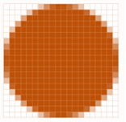

4D includes specific support for pictures used in your forms.

## Native Formats Supported  

4D integrates native management of picture formats. This means that pictures will be displayed and stored in their original format, without any interpretation in 4D. The specific features of the different formats (shading, transparent areas, etc.) will be retained when they are copied and pasted, and will be displayed without alteration. This native support is valid for all pictures stored in 4D forms: [static pictures](FormObjects/staticPicture.md) pasted in Design mode, pictures pasted into [inputs objects](FormObjects/input_overview.md) at runtime, etc.

The most common picture formats are supported of both platforms: .jpeg, .gif, .png, .tiff, .bmp, etc. On macOS, the .pdf format is also available for encoding and decoding.

> The full list of supported formats varies according to the operating system and the custom codecs that are installed on the machines. To find out which codecs are available, you must use the `PICTURE CODEC LIST` command (see also the [picture data type](Concepts/dt_picture.md) description).

### Unavailable picture format  

A specific icon is displayed for pictures saved in a format that is not available on the machine. The extension of the missing format is shown at the bottom of the icon:

The icon is automatically used wherever the picture is meant to be displayed:

This icon indicates that the picture cannot be displayed or manipulated locally -- but it can be saved without alteration so that it can be displayed on other machines. This is the case, for example, for PDF pictures on Windows, or for PICT format pictures.

## High Resolution Pictures

4D supports high resolution pictures on both macOS and Windows platforms. High resolution pictures can be defined by either scale factor or dpi.

### Scale factor

High resolution displays have a higher pixel density than traditional standard displays. For pictures to render correctly on high resolution displays, the number of pixels in the picture must be multiplied by the *scale factor* (*i.e.*, two times larger, three times larger, etc.).

When using high resolution pictures, you can specify the scale factor by adding "@nx" in the picture's name (where *n* designates the scale factor). In the table below, you can see that the scale factor is indicated in the names of the high resolution pictures, *circle@2x.png* and *circle@3x.png*.

|Display Type| Scale Factor|Example
|---|---|---|
|Standard Resolution|1:1 pixel density.| **1x**  *circle.png*|
|High Resolution| Pixel density increased by a factor of 2 or 3.|<table><th>2x</th><th>3x</th><tr><td>*circle@2x.png*</td><td> *circle@3x.png*</td></tr></table>

High resolution pictures with the @nx convention can be used in the following objects:

* [Static pictures](FormObjects/staticPicture.md)
* [Buttons](FormObjects/button_overview.md)/[radio](FormObjects/radio_overview.md)/[check boxes](FormObjects/checkbox_overview.md)
* [Picture buttons](FormObjects/pictureButton_overview.md)/[Picture pop-ups](FormObjects/picturePopupMenu_overview.md)
* [Tab controls](FormObjects/tabControl.md)
* [List box headers](FormObjects/listbox_overview.md#list-box-headers)
* [Menu icons](Menus/properties.md#item-icon)

4D automatically prioritizes pictures with the highest resolution. For example, when using two screens (one high resolution display, one standard display) and you move a form from one screen to another, 4D automatically renders the highest possible resolution of the picture. Even if a command or property specifies *circle.png*, *circle@3x.png* will be used (if it exists).

>Note that resolution prioritization occurs only for displaying pictures onscreen, there is no automatic prioritization made when printing.

### DPI

While 4D automatically prioritizes the highest resolution,  there are, however, some behavioral differences depending on screen and image dpi*(\*)*, and picture format:

|Operation |Behavior|
|---|---|
|Drop or Paste|If the picture has:<ul><li>**72dpi or 96dpi** - The picture is "[Center](FormObjects/properties_Picture.md#center--truncated-non-centered)" formatted and the object containing the picture has the same number of pixels.</li><li>**Other dpi** - The picture is "[Scaled to fit](FormObjects/properties_Picture.md#scaled-to-fit)" formatted and the object containing the picture is equal to (picture's number of pixels * screen dpi) / (picture's dpi)</li> <li>**No dpi** - The picture is "[Scaled to fit](FormObjects/properties_Picture.md#scaled-to-fit)" formatted.</li></ul>|
|[Automatic Size](https://doc.4d.com/4Dv19/4D/19/Setting-object-display-properties.300-5416671.en.html#148057) (Form Editor context menu)|If the picture's display format  is:<ul><li>**[Scaled](FormObjects/properties_Picture.md#scaled-to-fit)** - The object containing the picture is resized according to (picture's number of pixels * screen dpi) / (picture's dpi) </li> <li>**Not scaled** - The object containing the picture has the same number of pixels as the picture.</li></ul>|

*(\*) Typically,  macOS = 72dpi, Windows = 96dpi*

## Dark mode pictures (macOS only)

You can define specific pictures and icons to be used instead of standard pictures when [forms use the dark scheme](properties_FormProperties.md#color-scheme).

A dark mode picture is defined in the following way:

* dark mode picture has the same name as the standard (light scheme) version with the suffix "`_dark`"
* dark mode picture is stored next to the standard version.

At runtime, 4D will automatically load the light or dark image according to the [current form color scheme](https://doc.4d.com/4dv19/help/command/en/1761.html).  

## Mouse Coordinates in a Picture  

4D lets you retrieve the local coordinates of the mouse in an [input object](FormObjects/input_overview.md) associated with a [picture expression](FormObjects/properties_Object.md#expression-type), in case of a click or a hovering, even if a scroll or zoom has been applied to the picture. This mechanism, similar to that of a picture map, can be used, for example, to handle scrollable button bars or the interface of cartography software.

The coordinates are returned in the *MouseX* and *MouseY* [System Variables](../Concepts/variables.md#system-variables). The coordinates are expressed in pixels with respect to the top left corner of the picture (0,0). If the mouse is outside of the picture coordinates system, -1 is returned in *MouseX* and *MouseY*.

You can get the value of these variables as part of the [`On Clicked`](Events/onClicked.md), [`On Double Clicked`](Events/onDoubleClicked.md), [`On Mouse up`](Events/onMouseUp.md), [`On Mouse Enter`](Events/onMouseEnter.md), or [`On Mouse Move`](Events/onMouseMove.md) form events.
