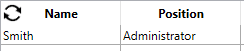

:::note

- To be able to access header properties for a list box, you must enable the [Display Headers](properties_Headers.md#display-headers) option.
- To be able to access footer properties for a list box, you must enable the [Display Footers](properties_Footers.md#display-footers) option.

:::

## Headers

When headers are displayed, you can select a header in the Form editor by clicking it when the list box object is selected:

You can set standard text properties for each column header of the list box; in this case, these properties have priority over those of the column or of the list box itself.

In addition, you have access to the specific properties for headers. Specifically, an icon can be displayed in the header next to or in place of the column title, for example when performing [customized sorts](./listbox_overview.md#managing-sorts).

At runtime, events that occur in a header are generated in the list box column object method.

When the `OBJECT SET VISIBLE` command is used with a header, it is applied to all headers, regardless of the individual element set by the command. For example, `OBJECT SET VISIBLE(*;"header3";False)` will hide all headers in the list box object to which *header3* belongs and not simply this header.

### Header Specific Properties

[Bold](properties_Text.md#bold) - [Class](properties_Object.md#css-class) - [Font](properties_Text.md#font) - [Font Color](properties_Text.md#font-color) - [Help Tip](properties_Help.md#help-tip) - [Horizontal Alignment](properties_Text.md#horizontal-alignment) - [Icon Location](properties_TextAndPicture.md#icon-location) - [Italic](properties_Text.md#italic) - [Object Name](properties_Object.md#object-name) - [Pathname](properties_TextAndPicture.md#picture-pathname) - [Title](properties_Object.md#title) - [Underline](properties_Text.md#underline) - [Variable or Expression](properties_Object.md#variable-or-expression) - [Vertical Alignment](properties_Text.md#vertical-alignment) - [Width](properties_CoordinatesAndSizing.md#width)

## Footers

List boxes can contain non-enterable "footers" displaying additional information. For data shown in table form, footers are usually used to display calculations such as totals or averages.

When footers are displayed, you can click to select one when the list box object is selected in the Form editor:

For each List box column footer, you can set standard text properties: in this case, these properties take priority over those of the column or of the list box. You can also access specific properties for footers. In particular, you can insert a [custom or automatic calculation](properties_Object.md#variable-calculation).

At runtime, events that occur in a footer are generated in the list box column object method.

When the `OBJECT SET VISIBLE` command is used with a footer, it is applied to all footers, regardless of the individual element set by the command. For example, `OBJECT SET VISIBLE(*;"footer3";False)` will hide all footers in the list box object to which *footer3* belongs and not simply this footer.

### Footer Specific Properties

[Alpha Format](properties_Display.md#alpha-format) - [Background Color](properties_BackgroundAndBorder.md#background-color--fill-color) - [Bold](properties_Text.md#bold) - [Class](properties_Object.md#css-class) - [Date Format](properties_Display.md#date-format) - [Expression Type](properties_Object.md#expression-type) - [Font](properties_Text.md#font) - [Font Color](properties_Text.md#font-color) - [Help Tip](properties_Help.md#help-tip) - [Horizontal Alignment](properties_Text.md#horizontal-alignment) - [Italic](properties_Text.md#italic) - [Number Format](properties_Display.md#number-format) - [Object Name](properties_Object.md#object-name) - [Picture Format](properties_Display.md#picture-format) - [Time Format](properties_Display.md#time-format) - [Truncate with ellipsis](properties_Display.md#truncate-with-ellipsis) - [Underline](properties_Text.md#underline) - [Variable Calculation](properties_Object.md#variable-calculation) - [Variable or Expression](properties_Object.md#variable-or-expression) - [Vertical Alignment](properties_Text.md#vertical-alignment) - [Width](properties_CoordinatesAndSizing.md#width) - [Wordwrap](properties_Display.md#wordwrap)

