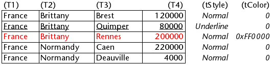
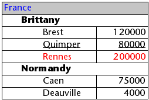

List boxes are complex active objects that allow displaying and entering data as synchronized columns. They can be bound to database contents such as entity selections and record sections, or to any language contents such as collections and arrays. They include advanced features regarding data entry, column sorting, event management, customized appearance, moving of columns, etc.


A list box contains one or more columns whose contents are automatically synchronized. The number of columns is, in theory, unlimited (it depends on the machine resources).

## Overview

### Basic user features

During execution, list boxes allow displaying and entering data as lists. To make a cell editable ([if entry is allowed for the column](#managing-entry)), simply click twice on the value that it contains:


Users can enter and display the text on several lines within a list box cell. To add a line break, press **Ctrl+Carriage return** on Windows or **Option+Carriage return** on macOS.

Booleans and pictures can be displayed in cells, as well as dates, times, or numbers. It is possible to sort column values by clicking on a header ([standard sort](#managing-sorts)). All columns are automatically synchronized.

It is also possible to resize each column, and the user can modify the order of [columns](properties_ListBox.md#locked-columns-and-static-columns) and [rows](properties_Action.md#movable-rows) by moving them using the mouse, if this action is authorized. Note that list boxes can be used in [hierarchical mode](#hierarchical-list-boxes).

The user can select one or more rows using the standard shortcuts: **Shift+click** for an adjacent selection and **Ctrl+click** (Windows) or **Command+click** (macOS) for a non-adjacent selection.

### List box parts

A list box is composed of four distinct parts:

*	the [list box object](./listbox-object.md) in its entirety,
*	[columns](./listbox-column.md),
*	column [headers](./listbox-header-footer.md#headers), and
*	column [footers](./listbox-header-footer.md#footers).


Each part has its own name as well as specific properties. For example, the number of columns or the alternating color of each row is set in the list box object properties, the width of each column is set in the column properties, and the font of the header is set in the header properties.

It is possible to add an object method to the list box object and/or to each column of the list box. Object methods are called in the following order:

1. Object method of each column
2. Object method of the list box

The column object method gets events that occur in its [header](./listbox-header-footer.md#headers) and [footer](./listbox-header-footer.md#footers).

### List box types  

There are several types of list boxes, with their own specific behaviors and properties. The list box type depends on its [Data Source property](properties_Object.md#data-source):

* **Arrays**: each column is bound to a 4D array. Array-based list boxes can be displayed as [hierarchical list boxes](listbox_overview.md#hierarchical-list-boxes).
* **Selection** (**Current selection** or **Named selection**): each column is bound to an expression (e.g. a field) which is evaluated for every record of the selection.
* **Collection or Entity selection**: each column is bound to an expression which is evaluated for every element of the collection or every entity of the entity selection.

>It is not possible to combine different list box types in the same list box object. The data source is set when the list box is created. It is then no longer possible to modify it by programming.

### Managing list boxes

You can completely configure a list box object through its properties, and you can also manage it dynamically through programming.

The 4D Language includes a dedicated "List Box" theme for list box commands, but commands from various other themes, such as "Object properties" commands or `EDIT ITEM`, `Displayed line number` commands can also be used. Refer to the [List Box Commands Summary](https://doc.4d.com/4Dv20/4D/20.6/List-Box-Commands-Summary.300-7487600.en.html) page of the *4D Language reference* for more information.


## Managing entry  

For a list box cell to be enterable, both of the following conditions must be met:

* The cell’s column must have been set as [Enterable](properties_Entry.md#enterable) (otherwise, the cells of the column can never be enterable).
* In the `On Before Data Entry` event, $0 does not return -1. When the cursor arrives in the cell, the `On Before Data Entry` event is generated in the column method. If, in the context of this event, $0 is set to -1, the cell is considered as not enterable. If the event was generated after **Tab** or **Shift+Tab** was pressed, the focus goes to either the next cell or the previous one, respectively. If $0 is not -1 (by default $0 is 0), the cell is enterable and switches to editing mode.

Let’s consider the example of a list box containing two arrays, one date and one text. The date array is not enterable but the text array is enterable if the date has not already past.


Here is the method of the *arrText* column:

```4d
 Case of
    :(FORM event.code=On Before Data Entry) // a cell gets the focus
       LISTBOX GET CELL POSITION(*;"lb";$col;$row)
  // identification of cell
       If(arrDate{$row}<Current date) // if date is earlier than today
          $0:=-1 // cell is NOT enterable
       Else
  // otherwise, cell is enterable
       End if
 End case
```

The `On Before Data Entry` event is returned before `On Getting Focus`.

In order to preserve data consistency for selection type and entity selection type list boxes, any modified record/entity is automatically saved as soon as the cell is validated, i.e.:

* when the the cell is deactivated (user presses tab, clicks, etc.)
* when the listbox is no longer focused,
* when the form is no longer focused.

The typical sequence of events generated during data entry or modification is as follows:

|Action|Listbox type(s)|Sequence of events|
|---|---|---|
|A cell switches to edit mode (user action or a call to the `EDIT ITEM` command)|All|On Before Data Entry|
||All|On Getting Focus|
|Its value is modified|All|On Before Keystroke|
||All|On After Keystroke|
||All|On After Edit|
|A user validates and leaves the cell|Selection list boxes| Save|
||Record selection list boxes|On saving an existing record trigger (if set)|
||Selection list boxes|On Data Change(*)|
||Entity selection list boxes|Entity is saved with automerge option, optimistic lock (see entity.save( )). In case of successful save, the entity is refreshed with the last update done. If the save operation fails, an error is displayed|
||All|On Losing Focus

(*) With entity selection list boxes, in the On Data Change event:

* the [Current item](properties_DataSource.md#current-item) object contains the value before modification.
* the `This` object contains the modified value.

> Data entry in collection/entity selection type list boxes has a limitation when the expression evaluates to null. In this case, it is not possible to edit or remove the null value in the cell.

## Managing selections  

Selections are managed differently depending on whether the list box is based on an array, on a selection of records, or on a collection/entity selection:

* **Selection list box**: Selections are managed by a set, which you can modify if necessary, called `$ListboxSetX` by default (where X starts at 0 and is incremented based on the number of list boxes in the form). This set is [defined in the properties](properties_ListBox.md#highlight-set) of the list box. It is automatically maintained by 4D: If the user selects one or more rows in the list box, the set is immediately updated. On the other hand, it is also possible to use the commands of the "Sets" theme in order to modify the selection of the list box via programming.

* **Collection/Entity selection list box**: Selections are managed through dedicated list box properties:
  * [Current item](properties_DataSource.md#current-item) is an object that will receive the selected element/entity
  * [Selected Items](properties_DataSource.md#selected-items) is a collection/entity selection object of selected items
  * [Current item position](properties_DataSource.md#current-item-position) returns the position of the selected element or entity.

* **Array list box**: The `LISTBOX SELECT ROW` command can be used to select one or more rows of the list box by programming.
The [variable linked to the List box object](properties_Object.md#variable-or-expression) is used to get, set or store selections of object rows. This variable corresponds to a Boolean array that is automatically created and maintained by 4D. The size of this array is determined by the size of the list box: it contains the same number of elements as the smallest array linked to the columns.
Each element of this array contains `True` if the corresponding line is selected and `False` otherwise. 4D updates the contents of this array depending on user actions. Inversely, you can change the value of array elements to change the selection in the list box.
On the other hand, you can neither insert nor delete rows in this array; you cannot retype rows either. The `Count in array` command can be used to find out the number of selected lines.
For example, this method allows inverting the selection of the first row of the (array type) list box:

```4d
 ARRAY BOOLEAN(tBListBox;10)
  //tBListBox is the name of the list box variable in the form
 If(tBListBox{1}=True)
    tBListBox{1}:=False
 Else
    tBListBox{1}:=True
 End if
```

> The `OBJECT SET SCROLL POSITION` command scrolls the list box rows so that the first selected row or a specified row is displayed.

### Customizing appearance of selected rows

When the [Hide selection highlight](properties_Appearance.md#hide-selection-highlight) option is selected, you need to make list box selections visible using available interface options. Since selections are still fully managed by 4D, this means:

* For array type list boxes, you must parse the Boolean array variable associated with the list box to determine which rows are selected or not.
* For selection type list boxes, you have to check whether the current record (row) belongs to the set specified in the [Highlight Set](properties_ListBox.md#highlight-set) property of the list box.

You can then define specific background colors, font colors and/or font styles by programming to customize the appearance of selected rows. This can be done using arrays or expressions, depending on the type of list box being displayed (see the following sections).

> You can use the `lk inherited` constant to mimic the current appearance of the list box (e.g., font color, background color, font style, etc.).

#### Selection list boxes  

To determine which rows are selected, you have to check whether they are included in the set indicated in the [Highlight Set](properties_ListBox.md#highlight-set) property of the list box. You can then define the appearance of selected rows using one or more of the relevant [color or style expression property](#using-arrays-and-expressions).

Keep in mind that expressions are automatically re-evaluated each time the:

* list box selection changes.
* list box gets or loses the focus.
* form window containing the list box becomes, or ceases to be, the frontmost window.

#### Array list boxes  

You have to parse the Boolean array [Variable or Expression](properties_Object.md#variable-or-expression) associated with the list box to determine whether rows are selected or not selected.

You can then define the appearance of selected rows using one or more of the relevant [color or style array property](#using-arrays-and-expressions).

Note that list box arrays used for defining the appearance of selected rows must be recalculated during the `On Selection Change` form event; however, you can also modify these arrays based on the following additional form events:

* `On Getting Focus` (list box property)
* `On Losing Focus` (list box property)
* `On Activate` (form property)
* `On Deactivate` (form property)
...depending on whether and how you want to visually represent changes of focus in selections.

##### Example  

You have chosen to hide the system highlight and want to display list box selections with a green background color, as shown here:


For an array type list box, you need to update the [Row Background Color Array](properties_BackgroundAndBorder.md#row-background-color-array) by programming. In the JSON form, you have defined the following Row Background Color Array for the list box:

```
 "rowFillSource": "_ListboxBackground",
```

In the object method of the list box, you can write:

```4d
 Case of
    :(FORM event.code=On Selection Change)
       $n:=Size of array(LB_Arrays)
       ARRAY LONGINT(_ListboxBackground;$n) // row background colors
       For($i;1;$n)
          If(LB_Arrays{$i}=True) // selected
             _ListboxBackground{$i}:=0x0080C080 // green background
          Else // not selected
             _ListboxBackground{$i}:=lk inherited
          End if
       End for
 End case
```

For a selection type list box, to produce the same effect you can use a method to update the [Background Color Expression](properties_BackgroundAndBorder.md#background-color-expression) based on the set specified in the [Highlight Set](properties_ListBox.md#highlight-set) property.

For example, in the JSON form, you have defined the following Highlight Set and Background Color Expression for the list box:

```
 "highlightSet": "$SampleSet",
 "rowFillSource": "UI_SetColor",
```

You can write in the *UI_SetColor* method:

```4d
 If(Is in set("$SampleSet"))
    $color:=0x0080C080 // green background
 Else
    $color:=lk inherited
 End if
 
 $0:=$color
```

> In hierarchical list boxes, break rows cannot be highlighted when the [Hide selection highlight](properties_Appearance.md#hide-selection-highlight) option is checked. Since it is not possible to have distinct colors for headers of the same level, there is no way to highlight a specific break row by programming.

## Managing sorts

A sort in a list box can be standard or custom. When a column of a list box is sorted, all other columns are always synchronized automatically.

### Standard sort

By default, a list box provides standard column sorts when the header is clicked. A standard sort is an alphanumeric sort of evaluated column values, alternately ascending/descending with each successive click.

You can enable or disable standard user sorts by disabling the [Sortable](properties_Action.md#sortable) property of the list box (enabled by default).

Standard sort support depends on the list box type:

|List box type|Support of standard sort|Comments|
|---|---|---|
|Collection of objects|Yes|<li>"This.a" or "This.a.b" columns are sortable.</li><li>The [list box source property](properties_Object.md#variable-or-expression) must be an [assignable expression](../Concepts/quick-tour.md#assignable-vs-non-assignable-expressions).</li>|
|Collection of scalar values|No|Use custom sort with [`orderBy()`](../API/CollectionClass.md#orderby) function|
|Entity selection|Yes|<li>The [list box source property](properties_Object.md#variable-or-expression) must be an [assignable expression](../Concepts/quick-tour.md#assignable-vs-non-assignable-expressions).</li><li>Supported: sorts on object attribute properties (e.g. "This.data.city" when "data" is an object attribute)</li><li>Supported: sorts on related attributes (e.g. "This.company.name")</li><li>Not supported: sorts on object attribute properties through related attributes (e.g. "This.company.data.city"). For this, you need to use custom sort with [`orderByFormula()`](../API/EntitySelectionClass.md#orderbyformula) function (see example below)</li>|
|Current selection|Yes|Only simple expressions are sortable (e.g. `[Table_1]Field_2`)|
|Named selection|No||
|Arrays|Yes|Columns bound to picture and pointer arrays are not sortable|

### Custom sort

The developer can set up custom sorts, for example using the [`LISTBOX SORT COLUMNS`](https://doc.4d.com/4dv19/help/command/en/page916.html) command and/or combining the [`On Header Click`](../Events/onHeaderClick) and [`On After Sort`](../Events/onAfterSort) form events and relevant 4D commands.

Custom sorts allow you to:

* carry out multi-level sorts on several columns, thanks to the [`LISTBOX SORT COLUMNS`](https://doc.4d.com/4dv19/help/command/en/page916.html) command,
* use functions such as [`collection.orderByMethod()`](../API/CollectionClass.md#orderbymethod) or [`entitySelection.orderByFormula()`](../API/EntitySelectionClass.md#orderbyformula) to sort columns on complex criteria.

#### Example

You want to sort a list box using values of a property stored in a related object attribute. You have the following structure:


You design a list box of the entity selection type, bound to the `Form.child` expression. In the `On Load` form event, you execute `Form.child:=ds.Child.all()`.

You display two columns:

|Child name|Parent's nickname|
|----|---|
|`This.name`|`This.parent.extra.nickname`

If you want to sort the list box using the values of the second column, you have to write:

```4d
If (Form event code=On Header Click)
 Form.child:=Form.child.orderByFormula("This.parent.extra.nickname"; dk ascending)
End if
```

### Column header variable

The value of the [column header variable](properties_Object.md#variable-or-expression) allows you to manage additional information: the current sort of the column (read) and the display of the sort arrow.

* If the variable is set to 0, the column is not sorted and the sort arrow is not displayed.  


* If the variable is set to 1, the column is sorted in ascending order and the sort arrow is displayed.


* If the variable is set to 2, the column is sorted in descending order and the sort arrow is displayed.


> Only declared or dynamic [variables](Concepts/variables.md) can be used as header column variables. Other kinds of [expressions](Concepts/quick-tour.md#expressions) such as `Form.sortValue` are not supported.  

You can set the value of the variable (for example, Header2:=2) in order to "force" the sort arrow display. The column sort itself is not modified in this case; it is up to the developer to handle it.

> The [`OBJECT SET FORMAT`](https://doc.4d.com/4dv19/help/command/en/page236.html) command offers specific support for icons in list box headers, which can be useful when you want to work with a customized sort icon.

## Managing row colors, styles, and display

There are several different ways to set background colors, font colors and font styles for list boxes:

* at the level of the [list box object properties](./listbox-object.md),
* at the level of the [column properties](./listbox-column.md),
* using [arrays or expressions properties](#using-arrays-and-expressions) for the list box and/or for each column,
* at the level of the text of each cell (if [multi-style text](properties_Text.md#multi-style)).

### Priority & inheritance

Priority and inheritance principles are observed when the same property is set at more than one level.

|Priority level|Setting location|
|---|---|
|high priority|Cell (if multi-style text)|
||Column arrays/methods|
||List box arrays/methods|
||Column properties|
||List box properties|
|low priority|Meta Info expression (for collection or entity selection list boxes)|

For example, if you set a font style in the list box properties and another using a style array for the column, the latter one will be taken into account.

For each attribute (style, color and background color), an **inheritance** is implemented when the default value is used:

* for cell attributes: attribute values of rows
* for row attributes: attribute values of columns
* for column attributes: attribute values of the list box

This way, if you want an object to inherit the attribute value from a higher level, you can use pass the `lk inherited` constant (default value) to the definition command or directly in the element of the corresponding style/color array. For example, given an array list box containing a standard font style with alternating colors:


You perform the following modifications:

* change the background of row 2 to red using the [Row Background Color Array](properties_BackgroundAndBorder.md#row-background-color-array) property of the list box object,
* change the style of row 4 to italics using the [Row Style Array](properties_Text.md#row-style-array) property of the list box object,
* two elements in column 5 are changed to bold using the [Row Style Array](properties_Text.md#row-style-array) property of the column 5 object,
* the 2 elements for column 1 and 2 are changed to dark blue using the [Row Background Color Array](properties_BackgroundAndBorder.md#row-background-color-array) property for the column 1 and 2 objects:


To restore the original appearance of the list box, you can:

* pass the `lk inherited` constant in element 2 of the background color arrays for columns 1 and 2: then they inherit the red background color of the row.
* pass the `lk inherited` constant in elements 3 and 4 of the style array for column 5: then they inherit the standard style, except for element 4, which changes to italics as specified in the style array of the list box.
* pass the `lk inherited` constant in element 4 of the style array for the list box in order to remove the italics style.
* pass the `lk inherited` constant in element 2 of the background color array for the list box in order to restore the original alternating color of the list box.

### Using arrays and expressions

Depending of the list box type, you can use different properties to customize row colors, styles and display:

|Property|Array list box|Selection list box|Collection or Entity Selection list box|
|---|----|---|---|
|Background color|[Row Background Color Array](properties_BackgroundAndBorder.md#row-background-color-array)|[Background Color Expression](properties_BackgroundAndBorder.md#background-color-expression)|[Background Color Expression](properties_BackgroundAndBorder.md#background-color-expression) or [Meta info expression](properties_Text.md#meta-info-expression)|
|Font color|[Row Font Color Array](properties_Text.md#row-font-color-array)|[Font Color Expression](properties_Text.md#font-color-expression)|[Font Color Expression](properties_Text.md#font-color-expression) or [Meta info expression](properties_Text.md#meta-info-expression)|
|Font style|[Row Style Array](properties_Text.md#row-style-array)|[Style Expression](properties_Text.md#style-expression)|[Style Expression](properties_Text.md#style-expression) or [Meta info expression](properties_Text.md#meta-info-expression)|
|Display|[Row Control Array](properties_ListBox.md#row-control-array)|-|-|

## Printing list boxes

Two printing modes are available: **preview mode** - which can be used to print a list box like a form object, and **advanced mode** - which lets you control the printing of the list box object itself within the form. Note that the "Printing" appearance is available for list box objects in the Form editor.

### Preview mode  

Printing a list box in preview mode consists of directly printing the list box and the form that contains it using the standard print commands or the **Print** menu command. The list box is printed as it is in the form. This mode does not allow precise control of the printing of the object; in particular, it does not allow you to print all the rows of a list box that contains more rows than it can display.

### Advanced mode  

In this mode, the printing of list boxes is carried out by programming, via the `Print object` command (project forms and table forms are supported). The `LISTBOX GET PRINT INFORMATION` command is used to control the printing of the object.

In this mode:

* The height of the list box object is automatically reduced when the number of rows to be printed is less than the original height of the object (there are no "blank" rows printed). On the other hand, the height does not automatically increase according to the contents of the object. The size of the object actually printed can be obtained via the `LISTBOX GET PRINT INFORMATION` command.
* The list box object is printed "as is", in other words, taking its current display parameters into account: visibility of headers and gridlines, hidden and displayed rows, etc.
These parameters also include the first row to be printed: if you call the `OBJECT SET SCROLL POSITION` command before launching the printing, the first row printed in the list box will be the one designated by the command.
* An automatic mechanism facilitates the printing of list boxes that contain more rows than it is possible to display: successive calls to `Print object` can be used to print a new set of rows each time. The `LISTBOX GET PRINT INFORMATION` command can be used to check the status of the printing while it is underway.

## Hierarchical list boxes

A hierarchical list box is a list box in which the contents of the first column appears in hierarchical form. This type of representation is adapted to the presentation of information that includes repeated values and/or values that are hierarchically dependent (country/region/city and so on).

> Only [array type list boxes](#array-list-boxes) can be hierarchical.

Hierarchical list boxes are a particular way of representing data but they do not modify the data structure (arrays). Hierarchical list boxes are managed exactly the same way as regular list boxes.

### Defining the hierarchy

To specify a hierarchical list box, there are several possibilities:

* Manually configure hierarchical elements using the Property list of the form editor (or edit the JSON form).
* Visually generate the hierarchy using the list box management pop-up menu, in the form editor.
* Use the [LISTBOX SET HIERARCHY](https://doc.4d.com/4Dv20/4D/20.6/LISTBOX-SET-HIERARCHY.301-7487634.en.html) and [LISTBOX GET HIERARCHY](https://doc.4d.com/4Dv20/4D/20.6/LISTBOX-GET-HIERARCHY.301-7487597.en.html) commands, described in the *4D Language Reference* manual.

#### Hierarchical List Box property

This property specifies that the list box must be displayed in hierarchical form. In the JSON form, this feature is triggered [when the *dataSource* property value is an array](properties_Object.md#array-list-box), i.e. a collection.

Additional options (**Variable 1...10**) are available when the *Hierarchical List Box* option is selected, corresponding to each *dataSource* array to use as break column. Each time a value is entered in a field, a new row is added. Up to 10 variables can be specified. These variables set the hierarchical levels to be displayed in the first column.

The first variable always corresponds to the name of the variable for the first column of the list box (the two values are automatically bound). This first variable is always visible and enterable. For example: country.
The second variable is also always visible and enterable; it specifies the second hierarchical level. For example: regions.
Beginning with the third field, each variable depends on the one preceding it. For example: counties, cities, and so on. A maximum of ten hierarchical levels can be specified. If you remove a value, the whole hierarchy moves up a level.

The last variable is never hierarchical even if several identical values exists at this level. For example, referring to the configuration illustrated above, imagine that arr1 contains the values A A A B B B, arr2 has the values 1 1 1 2 2 2 and arr3 the values X X Y Y Y Z. In this case, A, B, 1 and 2 could appear in collapsed form, but not X and Y:


This principle is not applied when only one variable is specified in the hierarchy: in this case, identical values may be grouped.

>If you specify a hierarchy based on the first columns of an existing list box, you must then remove or hide these columns (except for the first), otherwise they will appear in duplicate in the list box. If you specify the hierarchy via the pop-up menu of the editor (see below), the unnecessary columns are automatically removed from the list box.

#### Create hierarchy using the contextual menu

When you select at least one column in addition to the first one in a list box object (of the array type) in the form editor, the **Create hierarchy** command is available in the context menu:


This command is a shortcut to define a hierarchy. When it is selected, the following actions are carried out:

* The **Hierarchical list box** option is checked for the object in the Property List.
* The variables of the columns are used to specify the hierarchy. They replace any variables already specified.
* The columns selected no longer appear in the list box (except for the title of the first one).

Example: given a list box whose first columns contain Country, Region, City and Population. When Country, Region and City are selected, if you choose **Create hierarchy** in the context menu, a three-level hierarchy is created in the first column, columns 2 and 3 are removed and the Population column becomes the second:


##### Cancel hierarchy  

When the first column is selected and already specified as hierarchical, you can use the **Cancel hierarchy** command. When you choose this command, the following actions are carried out:

* The **Hierarchical list box** option is deselected for the object,
* The hierarchical levels 2 to X are removed and transformed into columns added to the list box.

### How it works

When a form containing a hierarchical list box is opened for the first time, by default all the rows are expanded.

A break row and a hierarchical "node" are automatically added in the list box when values are repeated in the arrays. For example, imagine a list box containing four arrays specifying cities, each city being characterized by its country, its region, its name and its number of inhabitants:


If this list box is displayed in hierarchical form (the first three arrays being included in the hierarchy), you obtain:


The arrays are not sorted before the hierarchy is constructed. If, for example, an array contains the data AAABBAACC, the hierarchy obtained is:
    >    A
    >    B
    >    A
    >    C

To expand or collapse a hierarchical "node," you can just click on it. If you **Alt+click** (Windows) or **Option+click** (macOS) on the node, all its sub-elements will be expanded or collapsed as well. These operations can also be carried out by programming using the `LISTBOX EXPAND` and `LISTBOX COLLAPSE` commands.

When values of the date or time type are included in a hierarchical list box, they are displayed in the short system format.

#### Sorts in hierarchical list boxes
  
In a list box in hierarchical mode, a standard sort (carried out by clicking on the header of a list box column) is always constructed as follows:

* In the first place, all the levels of the hierarchical column (first column) are automatically sorted by ascending order.
* The sort is then carried out by ascending or descending order (according to the user action) on the values of the column that was clicked.
* All the columns are synchronized.
* During subsequent sorts carried out on non-hierarchical columns of the list box, only the last level of the first column is sorted. It is possible to modify the sorting of this column by clicking on its header.

Given for example the following list box, in which no specific sort is specified:


If you click on the "Population" header to sort the populations by ascending (or alternately descending) order, the data appear as follows:


As for all list boxes, you can [disable the standard sort mechanism](properties_Action.md#sortable) and manage sorts using programming.

#### Selections and positions in hierarchical list boxes

A hierarchical list box displays a variable number of rows on screen according to the expanded/collapsed state of the hierarchical nodes. This does not however mean that the number of rows of the arrays vary. Only the display is modified, not the data. It is important to understand this principle because programmed management of hierarchical list boxes is always based on the data of the arrays, not on the displayed data. In particular, the break rows added automatically are not taken into account in the display options arrays (see below).

Let’s look at the following arrays for example:


If these arrays are represented hierarchically, the row "Quimper" will not be displayed on the second row, but on the fourth, because of the two break rows that are added:


Regardless of how the data are displayed in the list box (hierarchically or not), if you want to change the row containing "Quimper" to bold, you must use the statement Style{2} = bold. Only the position of the row in the arrays is taken into account.

This principle is implemented for internal arrays that can be used to manage:

* colors
* background colors
* styles
* hidden rows
* selections

For example, if you want to select the row containing Rennes, you must pass:

```4d
 ->MyListbox{3}:=True
```

Non-hierarchical representation:

Hierarchical representation:


> If one or more rows are hidden because their parents are collapsed, they are no longer selected. Only the rows that are visible (either directly or by scrolling) can be selected. In other words, rows cannot be both hidden and selected.

As with selections, the `LISTBOX GET CELL POSITION` command will return the same values for a hierarchical list box and a non-hierarchical list box. This means that in both of the examples below, `LISTBOX GET CELL POSITION` will return the same position: (3;2).

*Non-hierarchical representation:*


*Hierarchical representation:*


When all the rows of a sub-hierarchy are hidden, the break line is automatically hidden. In the above example, if rows 1 to 3 are hidden, the "Brittany" break row will not appear.

#### Break rows  

If the user selects a break row, `LISTBOX GET CELL POSITION` returns the first occurrence of the row in the corresponding array. In the following case:


... `LISTBOX GET CELL POSITION` returns (2;4). To select a break row by programming, you will need to use the `LISTBOX SELECT BREAK` command.

Break rows are not taken into account in the internal arrays used to manage the graphic appearance of list boxes (styles and colors). It is however possible to modify these characteristics for break rows via the graphic management commands for objects. You simply need to execute the appropriate commands on the arrays that constitute the hierarchy.

Given for example the following list box (the names of the associated arrays are specified in parentheses):

*Non-hierarchical representation:*


*Hierarchical representation:*


In hierarchical mode, break levels are not taken into account by the style modification arrays named `tStyle` and `tColors`. To modify the color or style of break levels, you must execute the following statements:

```4d
 OBJECT SET RGB COLORS(T1;0x0000FF;0xB0B0B0)
 OBJECT SET FONT STYLE(T2;Bold)
```

>In this context, only the syntax using the array variable can function with the object property commands because the arrays do not have any associated object.

Result:



#### Optimized management of expand/collapse  

You can optimize hierarchical list boxes display and management using the `On Expand` and `On Collapse` form events.

A hierarchical list box is built from the contents of its arrays so it can only be displayed when all these arrays are loaded into memory. This makes it difficult to build large hierarchical list boxes based on arrays generated from data (through the `SELECTION TO ARRAY` command), not only because of the display speed but also the memory used.

Using the `On Expand` and `On Collapse` form events can overcome these constraints: for example, you can display only part of the hierarchy and load/unload the arrays on the fly, based on user actions. In the context of these events, the `LISTBOX GET CELL POSITION` command returns the cell where the user clicked in order to expand or collapse a row.

In this case, you must fill and empty arrays through the code. The principles to be implemented are:

* When the list box is displayed, only the first array must be filled. However, you must create a second array with empty values so that the list box displays the expand/collapse buttons:


* When a user clicks on an expand button, you can process the `On Expand` event. The `LISTBOX GET CELL POSITION` command returns the cell concerned and lets you build the appropriate hierarchy: you fill the first array with the repeated values and the second with the values sent from the `SELECTION TO ARRAY` command and you insert as many rows as needed in the list box using the `LISTBOX INSERT ROWS` command.


* When a user clicks on a collapse button, you can process the `On Collapse` event. The `LISTBOX GET CELL POSITION` command returns the cell concerned: you remove as many rows as needed from the list box using the `LISTBOX DELETE ROWS` command.

