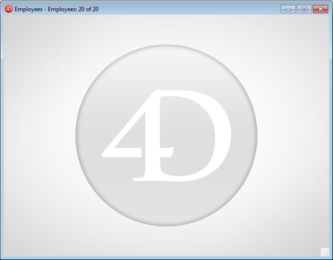

Menu bars provide the major interface for custom applications. For each custom application, you must create at least one menu bar with at least one menu. By default, Menu Bar #1 is the menu bar displayed in the Application environment. You can change which menu bar is displayed using the `SET MENU BAR` command.

4D lets you associate a custom splash screen picture with each menu bar and to preview this menu bar at any time.

## Splash screen

You can enhance the appearance of each menu bar by associating a custom splash screen with it. The window containing the splash screen is displayed below the menu bar when it appears. It can contain a logo or any type of picture. By default, 4D displays the 4D logo in the splash screen: 

A custom splash screen picture can come from any graphic application. 4D lets you paste a clipboard picture or use any picture present on your hard disk. Any standard picture format supported by 4D can be used.

The splash screen picture can be set only in the Menu editor: select the menu bar with which you want to associate the custom splash screen. Note the "Background Image" area in the right-hand part of the window. 
To open a picture stored on your disk directly, click on the **Open** button or click in the "Background Image" area. A pop-up menu appears: 
- To paste a picture from the clipboard, choose **Paste**.
- To open a picture stored in a disk file, choose **Open**.
If you choose Open, a standard Open file dialog box will appear so that you can select the picture file to be used. Once set, the picture is displayed in miniature in the area. It is then associated with the menu bar. 

You can view the final result by testing the menu bar (see the following section). In Application mode, the picture is displayed in the splash screen with the "Truncated (Centered)" type format.

> You can choose whether to display or hide this window using the **Display toolbar** option in the Settings.

To remove the custom picture and display the default one instead, click on the **Clear** button or select **Clear** in the area pop-up menu.

## Previewing menu bars

The Menu Bar editor lets you view the custom menus and splash screen at any time, without closing the toolbox window. 

To do so, simply select the menu bar and choose **Test the menu bar "Menu Bar #X"** in the context menu or the options menu of the editor. 

4D displays a preview of the menu bar as well as the splash screen. You can scroll down the menus and sub-menus to preview their contents. However, these menus are not active. To test the functioning of menus and the toolbar, you must use the **Test Application** command from the **Run** menu.

:::info

If the **Use SDI mode on Windows** option is selected in the ["Interface" page of the Settings dialog box](../settings/interface.md#display-windows), the **Test Application** menu allows you to test your application in [SDI or MDI mode](sdi.md) on Windows:

:::
