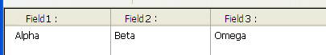

## Column Auto-Resizing

When this property is enabled (`rightToLeft` value in JSON), list box columns are automatically resized along with the list box, within the limits of the [minimum](properties_CoordinatesAndSizing.md#minimum-width) and [maximum](properties_CoordinatesAndSizing.md#maximum-width) widths defined.

When this property is disabled (`legacy` value in JSON), only the rightmost column of the list box is resized, even if its width exceeds the maximum value defined.

### How column auto-resizing works  

* As the list box width increases, its columns are enlarged, one by one, starting from right to left, until each reaches its [maximum width](properties_CoordinatesAndSizing.md#maximum-width). Only columns with the [Resizable](#resizable) property selected are resized.

* The same procedure applies when the list box width decreases, but in reverse order (*i.e.*, columns are resized starting from left to right). When each column has reached its [minimum width](properties_CoordinatesAndSizing.md#minimum-width), the horizontal scroll bar becomes active again.

* Columns are resized only when the horizontal scroll bar is not "active"; *i.e.*, all columns are fully visible in the list box at its current size. **Note**: If the horizontal scroll bar is hidden, this does not alter its state: a scroll bar may still be active, even though it is not visible.

* After all columns reach their maximum size, they are no longer enlarged and instead a blank (fake) column is added on the right to fill the extra space. If a fake (blank) column is present, when the list box width decreases, this is the first area to be reduced.

#### About the fake (blank) column

The appearance of the fake column matches that of the existing columns; it will have a fake header and/or footer if these elements are present in the existing list box columns and it will have the same background color(s) applied.

The fake header and/or footer can be clicked but this does not have any effect on the other columns (e.g.: no sort is performed); nevertheless, the `On Clicked`, `On Header Click` and `On Footer Click` events are generated accordingly.

If a cell in the fake column is clicked, the [LISTBOX GET CELL POSITION](https://doc.4d.com/4Dv17R6/4D/17-R6/LISTBOX-GET-CELL-POSITION.301-4311145.en.html) command returns "X+1" for its column number (where X is the number of existing columns).

#### JSON Grammar

|Name|Data Type|Possible Values|
|---|---|---|
|resizingMode|string |"rightToLeft", "legacy"|

#### Objects Supported

[List Box](listbox_overview.md)

---

## Horizontal Sizing

This property specifies if the horizontal size of an object should be moved or resized when a user resizes the form. It can also be set dynamically by the `OBJECT SET RESIZING OPTIONS` language command.

Three options are available:

|Option|JSON value|Result|
|---|---|---|
|Grow|"grow"|The same percentage is applied to the object’s width when the user resizes the width of the window, |
|Move|"move"|The object is moved the same amount left or right as the width increase when the user resizes the width of the window, |
|None|"fixed"|The object remains stationary when the form is resized|

>This property works in conjunction with the [Vertical Sizing](#vertical-sizing) property.

#### JSON Grammar

|Name|Data Type|Possible Values|
|---|---|---|
|sizingX|string |"grow", "move", "fixed"|

#### Objects Supported

[4D View Pro Area](viewProArea_overview.md) - [4D Write Pro Area](writeProArea_overview.md) - [Button](button_overview.md) - [Button Grid](buttonGrid_overview.md) - [Check Box](checkbox_overview.md) - [Combo Box](comboBox_overview.md) - [Dropdown list](dropdownList_Overview.md) - [Group Box](groupBox.md) - [Hierarchical List](list_overview.md#overview) - [Input](input_overview.md) - [List Box](listbox_overview.md#overview) - [Line](shapes_overview.md#line) - [List Box Column](listbox_overview.md#list-box-columns) - [Oval](shapes_overview.md#oval) - [Picture Button](pictureButton_overview.md) - [Picture Pop up menu](picturePopupMenu_overview.md) - [Plug-in Area](pluginArea_overview.md#overview) - [Progress Indicators](progressIndicator.md) - [Radio Button](radio_overview.md) - [Ruler](ruler.md) - [Rectangle](shapes_overview.md#rectangle) - [Spinner](spinner.md) - [Splitter](splitters.md) - [Static Picture](staticPicture.md) - [Stepper](stepper.md) - [Subform](subform_overview.md) - [Tab control](tabControl.md) - [Web Area](webArea_overview.md#overview)

---

## Vertical Sizing

This property specifies if the vertical size of an object should be moved or resized when a user resizes the form. It can also be set dynamically by the `OBJECT SET RESIZING OPTIONS` language command.

Three options are available:

|Option|JSON value| Result|
|---|---|---|
|Grow|"grow"|The same percentage is applied to the object's height when the user resizes the width of the window,
|Move|"move"|The object is moved the same amount up or down as the height increase when the user resizes the width of the window,
|None|"fixed"|The object remains stationary when the form is resized

>This property works in conjunction with the [Horizontal Sizing](#horizontal-sizing) property.

#### JSON Grammar

|Name|Data Type|Possible Values|
|---|---|---|
|sizingY|string|"grow", "move", "fixed"|

#### Objects Supported

[4D View Pro Area](viewProArea_overview.md) - [4D Write Pro Area](writeProArea_overview.md) - [Button](button_overview.md) - [Button Grid](buttonGrid_overview.md) - [Check Box](checkbox_overview.md) - [Combo Box](comboBox_overview.md) - [Dropdown list](dropdownList_Overview.md) - [Group Box](groupBox.md) - [Hierarchical List](list_overview.md#overview) - [Input](input_overview.md) - [List Box](listbox_overview.md#overview) - [Line](shapes_overview.md#line) - [List Box Column](listbox_overview.md#list-box-columns) - [Oval](shapes_overview.md#oval) - [Picture Button](pictureButton_overview.md) - [Picture Pop up menu](picturePopupMenu_overview.md) - [Plug-in Area](pluginArea_overview.md#overview) - [Progress Indicators](progressIndicator.md) - [Radio Button](radio_overview.md) - [Ruler](ruler.md) - [Rectangle](shapes_overview.md#rectangle) - [Spinner](spinner.md) - [Splitter](splitters.md) - [Static Picture](staticPicture.md) - [Stepper](stepper.md) - [Subform](subform_overview.md) - [Tab control](tabControl.md) - [Web Area](webArea_overview.md#overview)

---

## Pusher

When a splitter object has this property, other objects to its right (vertical splitter) or below it (horizontal splitter) are pushed at the same time as the splitter, with no stop.

Here is the result of a “pusher” splitter being moved:
  

When this property is not applied to the splitter, the result is as follows:

#### JSON Grammar

|Name|Data Type|Possible Values|
|:---|:---:|:---:|
|splitterMode|string|"move" (pusher), "resize" (standard)|

#### Objects Supported

[Splitter](splitters.md)

---

## Resizable

Designates if the size of the column can be modified by the user.

#### JSON Grammar

|Name|Data Type|Possible Values|
|:---|:---:|:---:|
|resizable|boolean|"true", "false"|

#### Objects Supported

[List Box Column](listbox_overview.md#list-box-columns)
